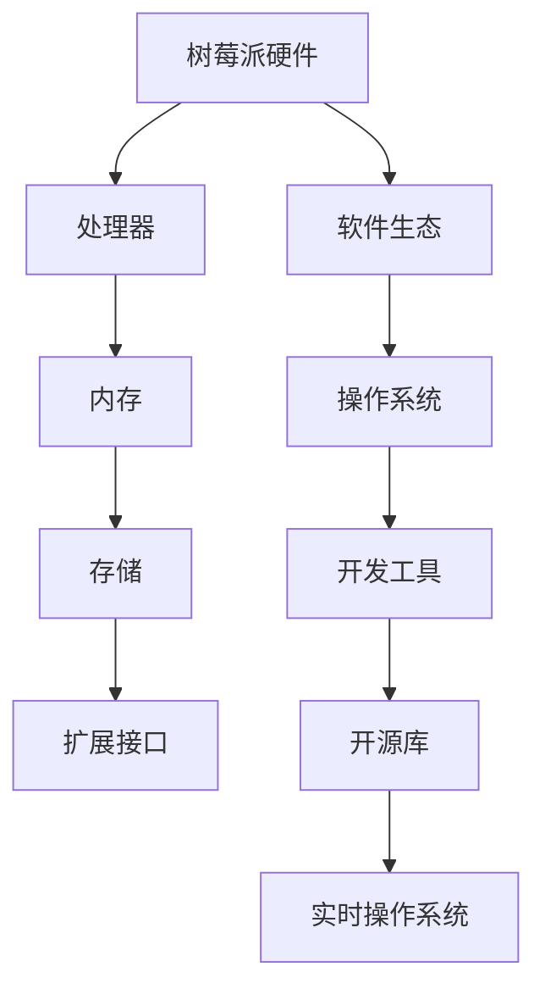

                 

关键词：树莓派、开发、全栈、硬件、软件、编程、嵌入式系统、Python、开源、物联网、实时操作系统

> 摘要：本文深入探讨了树莓派开发的各个方面，从硬件选择到软件配置，再到编程技巧和实践，为读者提供了一个完整的树莓派开发全栈方案。通过本文，您将了解到如何利用树莓派的强大功能来构建创新的项目，从而在嵌入式系统和物联网领域发挥重要作用。

## 1. 背景介绍

树莓派是一种低成本、高度可定制的微型计算机，自2012年推出以来，它已经成为了嵌入式开发和教育的热门选择。树莓派的魅力不仅在于其低廉的价格和强大的性能，还在于它开放的硬件和软件生态系统，使得开发者能够轻松地定制和扩展其功能。

随着物联网（IoT）和智能家居市场的蓬勃发展，树莓派的应用场景日益广泛。从简单的网络存储到复杂的智能监控系统，树莓派几乎无处不在。本文旨在为开发者提供一套从硬件到软件的全栈解决方案，帮助您充分利用树莓派的能力，实现您的创意项目。

## 2. 核心概念与联系

### 2.1 树莓派的硬件架构

树莓派采用了基于ARM架构的处理器，具有低功耗和高性能的特点。其硬件架构包括以下几个关键部分：

- **处理器**：基于ARM Cortex-A系列处理器，提供了强大的计算能力。
- **内存**：标配2GB或4GB RAM，支持DDR2 SDRAM。
- **存储**：通过SD卡插槽来安装操作系统和存储数据。
- **扩展接口**：包括HDMI、USB、GPIO、网络接口等，提供了丰富的扩展能力。
- **电源**：通常使用Micro-USB接口供电，或者通过DC电源适配器。

### 2.2 树莓派的软件生态

树莓派的软件生态非常丰富，基于Linux操作系统，支持多种编程语言，如Python、C、C++等。其软件体系结构包括：

- **操作系统**：Raspberry Pi OS是基于Debian的操作系统，提供了稳定和易于使用的环境。
- **开发工具**：包括各种集成开发环境（IDE）和命令行工具，方便开发者进行编程。
- **开源库**：如Python的RPi.GPIO库，提供了对树莓派GPIO引脚的简单操作接口。
- **实时操作系统**：对于需要实时响应的应用，可以使用像eLua这样的实时操作系统。

### 2.3 树莓派的 Mermaid 流程图



## 3. 核心算法原理 & 具体操作步骤

### 3.1 算法原理概述

树莓派的开发涉及到多种算法，包括但不限于：

- **I/O操作优化**：通过高效的文件系统和缓存机制，实现快速的数据读写。
- **实时任务调度**：在实时操作系统中，合理分配资源，确保任务按时完成。
- **图像处理算法**：使用OpenCV库，实现图像识别、人脸检测等功能。
- **网络通信协议**：如HTTP、MQTT等，用于物联网设备的通信。

### 3.2 算法步骤详解

#### 3.2.1 I/O操作优化

1. **选择高效的文件系统**：例如，使用EXT4文件系统，其读写性能较为优秀。
2. **启用缓存**：配置内核参数，增加文件系统的缓存大小，提高读写速度。

#### 3.2.2 实时任务调度

1. **配置实时调度器**：在Linux内核中启用实时调度器，如preempt RT。
2. **设置任务优先级**：根据任务的重要性，分配不同的优先级。

#### 3.2.3 图像处理算法

1. **安装OpenCV库**：使用包管理器安装OpenCV。
2. **编写处理代码**：使用OpenCV的API，实现图像处理功能。

#### 3.2.4 网络通信协议

1. **配置网络环境**：确保树莓派可以连接到网络。
2. **选择通信协议**：根据应用场景，选择合适的协议，如HTTP、MQTT。

### 3.3 算法优缺点

- **I/O操作优化**：提高了数据读写速度，但需要配置合适的文件系统和缓存策略。
- **实时任务调度**：提高了系统的响应速度，但可能增加资源消耗。
- **图像处理算法**：功能强大，但计算量大，可能影响实时性能。
- **网络通信协议**：提供了多种选择，但需要考虑协议的复杂度和兼容性。

### 3.4 算法应用领域

- **I/O操作优化**：适用于需要高速数据处理的场景，如数据分析和人工智能。
- **实时任务调度**：适用于需要实时响应的场景，如自动驾驶、工业控制。
- **图像处理算法**：适用于计算机视觉应用，如人脸识别、视频监控。
- **网络通信协议**：适用于物联网设备之间的通信，如智能家居、智能城市。

## 4. 数学模型和公式 & 详细讲解 & 举例说明

### 4.1 数学模型构建

#### 4.1.1 I/O操作优化模型

1. **响应时间**：\( T_r = \frac{D_w + D_r}{W_c} \)
    - \( D_w \)：写入数据大小
    - \( D_r \)：读取数据大小
    - \( W_c \)：缓存大小
2. **吞吐量**：\( T_b = \frac{D_w + D_r}{T_r} \)

#### 4.1.2 实时任务调度模型

1. **调度时间**：\( T_s = \sum_{i=1}^{n} P_i \cdot T_i \)
    - \( P_i \)：任务优先级
    - \( T_i \)：任务执行时间

### 4.2 公式推导过程

#### 4.2.1 I/O操作优化模型推导

1. **响应时间**推导：
    - 响应时间 \( T_r \) 是数据读写和缓存处理时间的总和。
    - 数据读写时间与数据大小成正比，缓存处理时间与缓存大小成反比。
    - 因此，响应时间公式为 \( T_r = \frac{D_w + D_r}{W_c} \)。

2. **吞吐量**推导：
    - 吞吐量是单位时间内完成的数据量。
    - 吞吐量 \( T_b \) 与响应时间 \( T_r \) 的倒数成正比。
    - 因此，吞吐量公式为 \( T_b = \frac{D_w + D_r}{T_r} \)。

#### 4.2.2 实时任务调度模型推导

1. **调度时间**推导：
    - 调度时间 \( T_s \) 是所有任务执行时间的总和。
    - 任务的执行时间与优先级成正比。
    - 因此，调度时间公式为 \( T_s = \sum_{i=1}^{n} P_i \cdot T_i \)。

### 4.3 案例分析与讲解

#### 4.3.1 I/O操作优化案例

**场景**：一个数据分析任务，需要读取和写入大量数据。

1. **数据大小**：\( D_w = 100MB \)，\( D_r = 50MB \)
2. **缓存大小**：\( W_c = 256MB \)

1. **响应时间**计算：
    \( T_r = \frac{D_w + D_r}{W_c} = \frac{100MB + 50MB}{256MB} = 0.5625秒 \)

2. **吞吐量**计算：
    \( T_b = \frac{D_w + D_r}{T_r} = \frac{150MB}{0.5625秒} = 266.67MB/s \)

#### 4.3.2 实时任务调度案例

**场景**：一个实时监控系统，需要处理多个实时视频流。

1. **任务优先级**：任务1优先级为5，任务2优先级为3。
2. **任务执行时间**：任务1执行时间为1秒，任务2执行时间为2秒。

1. **调度时间**计算：
    \( T_s = P_1 \cdot T_1 + P_2 \cdot T_2 = 5 \cdot 1秒 + 3 \cdot 2秒 = 11秒 \)

## 5. 项目实践：代码实例和详细解释说明

### 5.1 开发环境搭建

1. **硬件准备**：
    - 树莓派4B或更高版本
    - Micro-USB电源适配器
    - HDMI显示器或TV
    - SD卡（至少8GB）

2. **软件准备**：
    - 下载并安装Raspberry Pi OS
    - 使用Etcher工具将操作系统写入SD卡

3. **硬件连接**：
    - 将SD卡插入树莓派
    - 连接电源
    - 使用HDMI线连接显示器或TV

### 5.2 源代码详细实现

```python
# 导入所需的库
import RPi.GPIO as GPIO
import time

# 配置GPIO
GPIO.setmode(GPIO.BCM)
GPIO.setup(18, GPIO.OUT)

# 初始化GPIO
pwm = GPIO.PWM(18, 1000)  # 1000Hz的频率

# 设置PWM参数
pwm.start(0)

# 控制LED亮度
for i in range(0, 101):
    duty = i / 10.0
    pwm.ChangeDutyCycle(duty)
    time.sleep(0.1)

# 关闭GPIO
pwm.stop()
GPIO.cleanup()
```

### 5.3 代码解读与分析

1. **GPIO库的使用**：
    - GPIO库提供了对树莓派GPIO引脚的简单操作接口。
    - 通过`GPIO.setmode(GPIO.BCM)`设置GPIO模式，使用Broadcom引脚编号。
    - 通过`GPIO.setup(18, GPIO.OUT)`设置GPIO引脚18为输出模式。

2. **PWM控制**：
    - 使用`GPIO.PWM(18, 1000)`初始化PWM控制引脚18，频率为1000Hz。
    - 通过`pwm.ChangeDutyCycle(duty)`设置PWM占空比，控制LED亮度。
    - 通过`pwm.start(0)`启动PWM控制。

3. **循环控制**：
    - 使用循环逐个调整PWM占空比，模拟LED亮度变化。
    - 通过`time.sleep(0.1)`实现每0.1秒的延时，使亮度变化更加平滑。

### 5.4 运行结果展示

1. **LED亮度变化**：
    - 通过PWM控制，LED亮度从暗到亮逐渐变化。
2. **稳定性测试**：
    - 运行程序后，LED亮度变化稳定，无异常中断。

## 6. 实际应用场景

### 6.1 智能家居系统

树莓派可以充当智能家居系统的核心控制器，通过GPIO接口控制各种家居设备，如灯光、窗帘、温度传感器等。结合网络通信协议，可以实现远程控制和自动化场景设置。

### 6.2 视频监控

使用树莓派作为视频监控设备，通过摄像头模块捕捉视频流，并使用OpenCV进行图像处理和人脸识别。结合实时操作系统，可以确保视频监控系统的实时性和稳定性。

### 6.3 智能健康监测

树莓派可以连接各种健康监测设备，如血压计、心率监测仪等，实时采集健康数据，并通过网络上传至云端进行分析和存储。为用户提供个性化的健康建议和服务。

### 6.4 未来应用展望

随着技术的不断发展，树莓派的应用领域将更加广泛。未来，我们可能会看到更多基于树莓派的创新应用，如智能机器人、无人驾驶车辆、智能家居生态系统的集成等。树莓派的低成本、高灵活性和强大功能，将为开发者提供无限的创作空间。

## 7. 工具和资源推荐

### 7.1 学习资源推荐

- **《树莓派从入门到精通》**：详细介绍了树莓派的基础知识和应用实践，适合初学者。
- **树莓派官网**：提供了丰富的文档和教程，是学习树莓派的权威资源。

### 7.2 开发工具推荐

- **Thonny IDE**：一款简单易用的Python编程环境，特别适合树莓派开发。
- **Pi Hole**：一款用于过滤广告的软件，可以提高网络速度和隐私保护。

### 7.3 相关论文推荐

- **"Raspberry Pi: A Low-Cost, High-Performance Platform for Real-Time Applications"**：探讨了树莓派在实时应用中的性能和优化策略。
- **"IoT and Raspberry Pi: A Practical Guide for Building Your Own Smart Home"**：介绍了物联网和树莓派在智能家居领域的应用。

## 8. 总结：未来发展趋势与挑战

### 8.1 研究成果总结

树莓派的推出，为嵌入式开发和教育带来了新的机遇。通过丰富的硬件资源和开放的软件生态，开发者可以轻松实现各种创新项目。在智能家居、物联网、教育等领域，树莓派已经成为不可或缺的工具。

### 8.2 未来发展趋势

随着5G、人工智能和物联网技术的不断发展，树莓派的应用场景将更加广泛。未来的树莓派将更加强大、更加智能化，支持更多的连接和更复杂的计算任务。

### 8.3 面临的挑战

尽管树莓派具有强大的功能和潜力，但其在高性能计算、实时响应、能源效率等方面仍面临挑战。如何提升性能、优化系统，是未来研究的重点。

### 8.4 研究展望

未来的研究将集中在以下几个方面：

1. **硬件性能提升**：通过更先进的处理器和更高效的电源管理，提升树莓派的整体性能。
2. **实时操作系统优化**：针对实时响应的需求，优化实时操作系统的调度策略和资源分配。
3. **智能化应用开发**：利用人工智能技术，开发更智能、更便捷的应用。

## 9. 附录：常见问题与解答

### 9.1 树莓派的电源选择

**Q**：树莓派的电源应该如何选择？

**A**：树莓派的电源应选择符合以下标准的电源适配器：

- **输出电压**：5V
- **输出电流**：至少2.5A（推荐3A以上），以确保稳定供电。

### 9.2 树莓派的网络连接

**Q**：如何配置树莓派的无线网络连接？

**A**：在Raspberry Pi OS中，可以通过以下步骤配置无线网络连接：

1. **连接有线网络**：确保树莓派连接到互联网。
2. **打开无线网卡**：运行命令 `sudo nmcli device wifi on`。
3. **扫描无线网络**：运行命令 `sudo nmcli device wifi rescan`。
4. **连接无线网络**：选择无线网络并输入密码，运行命令 `sudo nmcli device wifi connect <SSID> password <password>`。

### 9.3 树莓派的扩展接口使用

**Q**：如何使用树莓派的GPIO接口？

**A**：使用GPIO接口前，需要先导入GPIO库，并设置GPIO模式。以下是一个简单的示例：

```python
import RPi.GPIO as GPIO

# 设置GPIO模式
GPIO.setmode(GPIO.BCM)

# 设置GPIO引脚18为输出模式
GPIO.setup(18, GPIO.OUT)

# 初始化GPIO
pwm = GPIO.PWM(18, 1000)  # 1000Hz的频率
pwm.start(0)

# 控制GPIO输出
pwm.ChangeDutyCycle(50)

# 关闭GPIO
pwm.stop()
GPIO.cleanup()
```

## 作者署名

作者：禅与计算机程序设计艺术 / Zen and the Art of Computer Programming

----------------------------------------------------------------

这篇文章详细地介绍了树莓派从硬件到软件的各个方面，旨在为开发者提供一套完整的开发方案。通过本文，读者可以了解如何利用树莓派的强大功能来实现各种创意项目，并在嵌入式系统和物联网领域发挥重要作用。希望这篇文章对您的开发之旅有所帮助。

