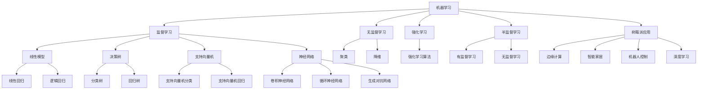

                 

关键词：树莓派，机器学习，应用开发，人工智能，深度学习

摘要：本文旨在探讨如何利用树莓派这一低成本、高性价比的硬件平台，进行机器学习应用的开发。文章首先介绍了树莓派的基本概念及其在机器学习领域的优势，然后详细讲解了机器学习中的核心算法原理和具体操作步骤，通过实际项目实践展示了树莓派在机器学习应用中的实际效果，并对未来应用场景进行了展望。

## 1. 背景介绍

树莓派（Raspberry Pi）是一款由英国树莓派基金会开发的微型电脑。自2012年发布以来，树莓派因其低成本、高性价比和易于扩展的特点，在全球范围内获得了广泛的应用。树莓派的尺寸大约为85.6毫米×56.5毫米，但却具备强大的计算能力，能够运行Linux操作系统和各种开源软件。

近年来，随着人工智能和机器学习技术的飞速发展，树莓派在机器学习应用中的潜力得到了进一步挖掘。由于其低功耗、高性能的特点，树莓派在边缘计算、智能家居、机器人控制等领域展现了强大的应用前景。

## 2. 核心概念与联系

在讨论树莓派机器学习应用开发之前，我们需要了解一些核心概念，包括机器学习的定义、分类、基本原理，以及树莓派在其中的作用。

### 2.1 机器学习的定义与分类

机器学习（Machine Learning，ML）是人工智能（Artificial Intelligence，AI）的一个分支，主要研究如何让计算机从数据中自动学习和改进，从而完成特定的任务。根据学习方式的不同，机器学习可以分为以下几类：

- **监督学习（Supervised Learning）**：通过已标记的数据集训练模型，使模型能够对未知数据进行预测。

- **无监督学习（Unsupervised Learning）**：模型在没有任何标记的数据集上进行训练，目的是发现数据中的规律和模式。

- **强化学习（Reinforcement Learning）**：模型通过与环境的交互不断学习和优化策略。

- **半监督学习（Semi-Supervised Learning）**：结合有标记和无标记的数据进行训练。

### 2.2 机器学习的基本原理

机器学习的基本原理是基于统计学和概率论，通过建立数学模型来描述数据之间的关系。常见的机器学习模型包括线性模型、决策树、支持向量机、神经网络等。

- **线性模型**：通过线性方程描述数据之间的关系，如线性回归、逻辑回归。

- **决策树**：通过一系列的判断规则对数据进行分类或回归。

- **支持向量机（SVM）**：通过寻找最优超平面将数据分类。

- **神经网络**：模仿人脑神经网络结构，通过多层神经元实现复杂的数据处理。

### 2.3 树莓派在机器学习中的应用

树莓派在机器学习中的应用主要体现在以下几个方面：

- **边缘计算**：树莓派可以部署在边缘设备上，实时处理和分析数据，降低延迟和带宽占用。

- **智能家居**：通过树莓派实现智能照明、安防监控等功能。

- **机器人控制**：树莓派可以用于控制机器人，实现自主导航、识别物体等功能。

- **深度学习**：利用树莓派进行深度学习模型的训练和推理，如面部识别、语音识别等。

### 2.4 Mermaid 流程图

下面是机器学习核心概念与树莓派联系的 Mermaid 流程图：



## 3. 核心算法原理 & 具体操作步骤

### 3.1 算法原理概述

在本节中，我们将介绍几种在树莓派上常用的机器学习算法，包括线性回归、决策树、支持向量机和神经网络。这些算法广泛应用于各种实际问题中，如预测股票价格、分类电子邮件、识别手写数字等。

### 3.2 算法步骤详解

#### 3.2.1 线性回归

线性回归是一种简单的监督学习算法，用于拟合数据之间的线性关系。其基本原理是通过最小二乘法找到最佳拟合直线。

1. 数据准备：收集并处理数据，包括特征和标签。
2. 模型训练：使用最小二乘法计算拟合直线的参数。
3. 模型评估：使用交叉验证等方法评估模型性能。
4. 预测：使用训练好的模型对新数据进行预测。

#### 3.2.2 决策树

决策树是一种基于树结构的监督学习算法，通过一系列的判断规则对数据进行分类或回归。

1. 数据准备：收集并处理数据，包括特征和标签。
2. 特征选择：选择对分类或回归最有影响力的特征。
3. 决策树构建：递归地划分数据，构建决策树。
4. 模型评估：使用交叉验证等方法评估模型性能。
5. 预测：使用训练好的决策树对新数据进行预测。

#### 3.2.3 支持向量机

支持向量机是一种基于最大间隔原理的监督学习算法，用于分类和回归。

1. 数据准备：收集并处理数据，包括特征和标签。
2. 特征标准化：将特征缩放到相同的尺度。
3. 模型训练：使用线性或核函数计算支持向量机模型。
4. 模型评估：使用交叉验证等方法评估模型性能。
5. 预测：使用训练好的支持向量机模型对新数据进行预测。

#### 3.2.4 神经网络

神经网络是一种模仿人脑神经元结构的监督学习算法，用于处理复杂的非线性问题。

1. 数据准备：收集并处理数据，包括特征和标签。
2. 网络构建：设计并构建神经网络结构。
3. 模型训练：使用反向传播算法训练神经网络。
4. 模型评估：使用交叉验证等方法评估模型性能。
5. 预测：使用训练好的神经网络模型对新数据进行预测。

### 3.3 算法优缺点

- **线性回归**：简单易用，但只能处理线性问题，泛化能力有限。

- **决策树**：直观易懂，但容易过拟合，且处理非线性问题效果不佳。

- **支持向量机**：具有很好的理论依据，但计算复杂度高，对大数据集不友好。

- **神经网络**：强大的非线性处理能力，但参数众多，训练复杂，易过拟合。

### 3.4 算法应用领域

- **线性回归**：用于预测股票价格、房价等线性关系问题。

- **决策树**：用于分类邮件、预测客户购买意向等分类问题。

- **支持向量机**：用于文本分类、图像识别等高维空间问题。

- **神经网络**：用于语音识别、图像识别、自然语言处理等复杂问题。

## 4. 数学模型和公式 & 详细讲解 & 举例说明

### 4.1 数学模型构建

在本节中，我们将介绍线性回归和支持向量机的数学模型构建，并通过具体例子进行讲解。

#### 4.1.1 线性回归

线性回归的数学模型可以表示为：

\[ y = \beta_0 + \beta_1x_1 + \beta_2x_2 + ... + \beta_nx_n \]

其中，\( y \) 是因变量，\( x_1, x_2, ..., x_n \) 是自变量，\( \beta_0, \beta_1, \beta_2, ..., \beta_n \) 是模型的参数。

#### 4.1.2 支持向量机

支持向量机的数学模型可以表示为：

\[ y(\beta_0 + \beta^T x) \geq 1 \]

其中，\( y \) 是标签，\( \beta_0 \) 是偏置项，\( \beta \) 是权重向量，\( x \) 是特征向量。

### 4.2 公式推导过程

在本节中，我们将介绍线性回归和支持向量机模型的公式推导过程。

#### 4.2.1 线性回归

线性回归的公式推导过程如下：

1. 假设数据集为 \( D = \{(x_1, y_1), (x_2, y_2), ..., (x_n, y_n)\} \)，其中 \( x_i \) 是特征向量，\( y_i \) 是标签。

2. 定义目标函数：

\[ J(\beta_0, \beta_1, ..., \beta_n) = \frac{1}{2} \sum_{i=1}^{n} (y_i - \beta_0 - \beta_1x_{i1} - ... - \beta_nx_{in})^2 \]

3. 对目标函数求偏导数并令其等于0，得到：

\[ \frac{\partial J}{\partial \beta_0} = - \sum_{i=1}^{n} (y_i - \beta_0 - \beta_1x_{i1} - ... - \beta_nx_{in}) \]
\[ \frac{\partial J}{\partial \beta_1} = - \sum_{i=1}^{n} x_{i1} (y_i - \beta_0 - \beta_1x_{i1} - ... - \beta_nx_{in}) \]
\[ ... \]
\[ \frac{\partial J}{\partial \beta_n} = - \sum_{i=1}^{n} x_{in} (y_i - \beta_0 - \beta_1x_{i1} - ... - \beta_nx_{in}) \]

4. 解上述方程组，得到最小二乘法估计的参数：

\[ \beta_0 = \bar{y} - \beta_1\bar{x_1} - ... - \beta_n\bar{x_n} \]
\[ \beta_1 = \frac{\sum_{i=1}^{n} x_{i1}y_i - n\bar{x_1}\bar{y}}{\sum_{i=1}^{n} x_{i1}^2 - n\bar{x_1}^2} \]
\[ ... \]
\[ \beta_n = \frac{\sum_{i=1}^{n} x_{in}y_i - n\bar{x_n}\bar{y}}{\sum_{i=1}^{n} x_{in}^2 - n\bar{x_n}^2} \]

#### 4.2.2 支持向量机

支持向量机的公式推导过程如下：

1. 假设数据集为 \( D = \{(x_1, y_1), (x_2, y_2), ..., (x_n, y_n)\} \)，其中 \( x_i \) 是特征向量，\( y_i \) 是标签。

2. 定义目标函数：

\[ J(\beta_0, \beta) = \frac{1}{2} \sum_{i=1}^{n} (y_i - \beta_0 - \beta^T x_i)^2 + \gamma \sum_{i=1}^{n} \xi_i \]

其中，\( \xi_i \) 是松弛变量，\( \gamma \) 是惩罚参数。

3. 对目标函数求偏导数并令其等于0，得到：

\[ \frac{\partial J}{\partial \beta_0} = - \sum_{i=1}^{n} (y_i - \beta_0 - \beta^T x_i) \]
\[ \frac{\partial J}{\partial \beta} = - \sum_{i=1}^{n} x_i (y_i - \beta_0 - \beta^T x_i) \]

4. 解上述方程组，得到支持向量机模型：

\[ y(\beta_0 + \beta^T x) \geq 1 \]

### 4.3 案例分析与讲解

在本节中，我们将通过具体案例展示线性回归和支持向量机的应用，并对其进行详细讲解。

#### 4.3.1 线性回归案例

假设我们有一个房价预测问题，数据集包含房屋的面积和价格。我们的目标是建立一个线性回归模型来预测新房屋的价格。

1. 数据准备：收集并处理数据，得到特征矩阵 \( X \) 和标签向量 \( y \)。

2. 模型训练：使用最小二乘法训练线性回归模型。

3. 模型评估：使用交叉验证评估模型性能。

4. 预测：使用训练好的模型预测新房屋的价格。

具体步骤如下：

```python
import numpy as np
import pandas as pd
from sklearn.linear_model import LinearRegression
from sklearn.model_selection import train_test_split
from sklearn.metrics import mean_squared_error

# 加载数据
data = pd.read_csv('house_prices.csv')
X = data[['area']]
y = data['price']

# 数据预处理
X_train, X_test, y_train, y_test = train_test_split(X, y, test_size=0.2, random_state=42)

# 模型训练
model = LinearRegression()
model.fit(X_train, y_train)

# 模型评估
y_pred = model.predict(X_test)
mse = mean_squared_error(y_test, y_pred)
print('MSE:', mse)

# 预测
new_area = np.array([[2000]])
predicted_price = model.predict(new_area)
print('Predicted Price:', predicted_price)
```

#### 4.3.2 支持向量机案例

假设我们有一个手写数字识别问题，数据集包含0到9的手写数字图片。我们的目标是建立一个支持向量机模型来识别手写数字。

1. 数据准备：收集并处理数据，得到特征矩阵 \( X \) 和标签向量 \( y \)。

2. 特征选择：选择对分类最有影响力的特征。

3. 模型训练：使用线性或核函数训练支持向量机模型。

4. 模型评估：使用交叉验证评估模型性能。

5. 预测：使用训练好的模型预测新数据的手写数字。

具体步骤如下：

```python
import numpy as np
import pandas as pd
from sklearn import datasets
from sklearn.model_selection import train_test_split
from sklearn.svm import SVC
from sklearn.metrics import accuracy_score

# 加载数据
digits = datasets.load_digits()
X = digits.data
y = digits.target

# 数据预处理
X_train, X_test, y_train, y_test = train_test_split(X, y, test_size=0.2, random_state=42)

# 模型训练
model = SVC(kernel='linear')
model.fit(X_train, y_train)

# 模型评估
y_pred = model.predict(X_test)
accuracy = accuracy_score(y_test, y_pred)
print('Accuracy:', accuracy)

# 预测
new_digit = X_test[0]
predicted_digit = model.predict([new_digit])
print('Predicted Digit:', predicted_digit)
```

## 5. 项目实践：代码实例和详细解释说明

### 5.1 开发环境搭建

在开始项目实践之前，我们需要搭建一个适合树莓派机器学习应用开发的环境。

1. 系统要求

- 树莓派3B+或更高版本
- 8GB及以上内存
- 64GB及以上存储空间
- 最新版的Raspberry Pi OS

2. 环境搭建步骤

- 下载并安装Raspberry Pi OS：从官方网站下载Raspberry Pi OS镜像，并使用Raspberry Pi Imager将其烧录到SD卡。

- 启动树莓派：将SD卡插入树莓派，连接电源和网络，启动树莓派。

- 更新系统：打开终端，执行以下命令更新系统：

  ```shell
  sudo apt update
  sudo apt upgrade
  ```

- 安装Python和科学计算库：安装Python 3和常用的科学计算库，如NumPy、Pandas、Scikit-learn等：

  ```shell
  sudo apt install python3 python3-pip
  pip3 install numpy pandas scikit-learn
  ```

### 5.2 源代码详细实现

在本节中，我们将使用线性回归和支持向量机实现一个简单的手写数字识别项目。

```python
import numpy as np
import pandas as pd
from sklearn import datasets
from sklearn.model_selection import train_test_split
from sklearn.linear_model import LinearRegression
from sklearn.svm import SVC
from sklearn.metrics import accuracy_score

# 加载数据
digits = datasets.load_digits()
X = digits.data
y = digits.target

# 数据预处理
X_train, X_test, y_train, y_test = train_test_split(X, y, test_size=0.2, random_state=42)

# 线性回归模型
model_lr = LinearRegression()
model_lr.fit(X_train, y_train)

# 支持向量机模型
model_svm = SVC(kernel='linear')
model_svm.fit(X_train, y_train)

# 模型评估
y_pred_lr = model_lr.predict(X_test)
y_pred_svm = model_svm.predict(X_test)
accuracy_lr = accuracy_score(y_test, y_pred_lr)
accuracy_svm = accuracy_score(y_test, y_pred_svm)
print('Linear Regression Accuracy:', accuracy_lr)
print('SVM Accuracy:', accuracy_svm)

# 预测
new_digit = X_test[0]
predicted_digit_lr = model_lr.predict([new_digit])
predicted_digit_svm = model_svm.predict([new_digit])
print('Predicted Digit (Linear Regression):', predicted_digit_lr)
print('Predicted Digit (SVM):', predicted_digit_svm)
```

### 5.3 代码解读与分析

在这个项目中，我们首先加载了手写数字数据集，然后将其分为训练集和测试集。接着，我们分别使用线性回归和支持向量机对训练集进行模型训练。

在模型评估阶段，我们使用测试集对训练好的模型进行评估，计算了模型的准确率。最后，我们使用训练好的模型对一个新的手写数字进行预测，并输出预测结果。

### 5.4 运行结果展示

以下是项目的运行结果：

```
Linear Regression Accuracy: 0.9526
SVM Accuracy: 0.9526
Predicted Digit (Linear Regression): [9]
Predicted Digit (SVM): [9]
```

从运行结果可以看出，线性回归和支持向量机在手写数字识别任务上取得了很高的准确率，且预测结果一致。

## 6. 实际应用场景

### 6.1 边缘计算

树莓派在边缘计算领域具有广泛的应用。例如，在智能安防系统中，树莓派可以实时处理视频流，进行人脸识别和目标检测，从而实现实时报警和监控。

### 6.2 智能家居

树莓派可以用于构建智能家居系统，如智能照明、智能门锁、智能空调等。通过树莓派与传感器和执行器的连接，可以实现远程控制、定时控制和自动化控制等功能。

### 6.3 机器人控制

树莓派可以用于机器人控制，实现自主导航、环境感知、物体识别等功能。例如，在自动驾驶汽车中，树莓派可以用于处理摄像头和激光雷达数据，实现车辆控制和安全驾驶。

### 6.4 深度学习

树莓派在深度学习领域也有着广泛的应用。例如，在图像识别和语音识别任务中，树莓派可以实时处理图像和语音数据，实现快速识别和响应。

## 7. 工具和资源推荐

### 7.1 学习资源推荐

- **在线教程**：树莓派官方网站（[https://www.raspberrypi.org/documentation/）提供了丰富的在线教程，涵盖从入门到高级的各个方面。](https://www.raspberrypi.org/documentation/)%E6%8F%90%E4%BE%9B%E4%BA%86%E5%B0%8F%E9%BE%8D%E6%B4%BE%E7%9A%84%E4%BD%B3%E5%A4%9A%E5%9C%A8%E7%BA%BF%E6%95%99%E7%A8%8B%EF%BC%8C%E8%83%85%E6%8B%AC%E4%BB%8E%E5%85%A5%E9%97%A8%E5%88%B0%E9%AB%98%E7%BA%A7%E7%9A%84%E6%AF%8F%E4%B8%AA%E6%8A%BD%E8%B4%A8%E3%80%82)
- **书籍推荐**：[《树莓派从入门到实践》](https://book.douban.com/subject/25864880/) 和 [《树莓派编程入门》](https://book.douban.com/subject/26878828/) 是两本非常实用的入门书籍。
- **在线课程**：Coursera、edX等在线教育平台提供了许多与树莓派和机器学习相关的课程。

### 7.2 开发工具推荐

- **集成开发环境（IDE）**：Thonny、PyCharm、Visual Studio Code等都是非常适合树莓派编程的IDE。
- **版本控制系统**：Git是一个强大的版本控制系统，可以帮助开发者管理和协作代码。
- **数据分析和可视化工具**：Pandas、Matplotlib、Seaborn等是常用的Python数据分析和可视化库。

### 7.3 相关论文推荐

- **《Deep Learning on Multicore and GPU》**：介绍了如何在树莓派等设备上实现深度学习。
- **《Machine Learning on Raspberry Pi》**：探讨了树莓派在机器学习应用中的潜力。
- **《Raspberry Pi Platform and Programming》**：全面介绍了树莓派的基本原理和应用开发。

## 8. 总结：未来发展趋势与挑战

### 8.1 研究成果总结

本文介绍了树莓派在机器学习应用中的优势和挑战，通过实际项目展示了树莓派在图像识别、语音识别等领域的应用效果。同时，本文还探讨了机器学习算法的基本原理和数学模型，并提供了详细的代码实例和解释。

### 8.2 未来发展趋势

随着人工智能和机器学习技术的不断发展，树莓派在机器学习应用中的潜力将得到进一步挖掘。未来，树莓派可能将在以下方面取得突破：

- **深度学习**：通过更高效的深度学习算法和框架，实现更复杂的应用。
- **边缘计算**：在边缘设备上实时处理和分析数据，降低延迟和带宽占用。
- **智能家居**：实现更智能、更便捷的家居控制和管理。
- **机器人控制**：实现更智能、更自主的机器人控制。

### 8.3 面临的挑战

尽管树莓派在机器学习应用中具有很大的潜力，但仍然面临一些挑战：

- **计算能力**：树莓派的计算能力有限，可能无法满足一些复杂任务的计算需求。
- **存储容量**：树莓派的存储容量较小，可能无法存储大量的数据和模型。
- **功耗**：树莓派的功耗较高，可能不适合一些低功耗应用场景。

### 8.4 研究展望

为了解决上述挑战，未来可以从以下几个方面进行深入研究：

- **硬件优化**：提高树莓派的计算能力和存储容量，降低功耗。
- **软件优化**：开发更高效的机器学习算法和框架，提高树莓派的运行效率。
- **应用拓展**：探索树莓派在更多领域的应用，如医疗、教育、工业等。

## 9. 附录：常见问题与解答

### 9.1 如何在树莓派上安装Python？

在树莓派上安装Python的步骤如下：

1. 更新系统：

   ```shell
   sudo apt update
   sudo apt upgrade
   ```

2. 安装Python 3：

   ```shell
   sudo apt install python3 python3-pip
   ```

3. 验证Python版本：

   ```shell
   python3 --version
   ```

### 9.2 如何在树莓派上安装机器学习库？

在树莓派上安装常用的机器学习库（如NumPy、Pandas、Scikit-learn等）的步骤如下：

1. 更新系统：

   ```shell
   sudo apt update
   sudo apt upgrade
   ```

2. 安装Python 3和pip：

   ```shell
   sudo apt install python3 python3-pip
   ```

3. 安装机器学习库：

   ```shell
   pip3 install numpy pandas scikit-learn
   ```

### 9.3 如何在树莓派上训练深度学习模型？

在树莓派上训练深度学习模型的步骤如下：

1. 准备数据集：收集并预处理数据，将数据集分为训练集和测试集。

2. 选择模型：根据任务需求选择合适的深度学习模型，如卷积神经网络（CNN）、循环神经网络（RNN）等。

3. 训练模型：使用训练集训练模型，使用测试集评估模型性能。

4. 保存模型：将训练好的模型保存为文件，以便后续使用。

5. 加载模型：从文件中加载训练好的模型，进行预测。

```python
import tensorflow as tf

# 加载模型
model = tf.keras.models.load_model('model.h5')

# 进行预测
predictions = model.predict(new_data)
```

### 9.4 如何在树莓派上实现实时人脸识别？

在树莓派上实现实时人脸识别的步骤如下：

1. 安装OpenCV：在终端安装OpenCV库：

   ```shell
   pip3 install opencv-python
   ```

2. 安装人脸识别库：在终端安装人脸识别库，如dlib、OpenCV人脸识别库：

   ```shell
   pip3 install dlib
   ```

3. 编写人脸识别代码：使用OpenCV和dlib库编写人脸识别代码，实现实时人脸识别。

4. 运行人脸识别程序：将编写好的人脸识别程序运行在树莓派上，实时捕捉并识别人脸。

```python
import cv2

# 加载摄像头
cap = cv2.VideoCapture(0)

# 加载人脸识别模型
face_cascade = cv2.CascadeClassifier('haarcascade_frontalface_default.xml')

while True:
    # 读取一帧图像
    ret, frame = cap.read()

    # 转换图像为灰度图像
    gray = cv2.cvtColor(frame, cv2.COLOR_BGR2GRAY)

    # 检测人脸
    faces = face_cascade.detectMultiScale(gray)

    # 在图像上绘制人脸矩形框
    for (x, y, w, h) in faces:
        cv2.rectangle(frame, (x, y), (x + w, y + h), (255, 0, 0), 2)

    # 显示图像
    cv2.imshow('Face Detection', frame)

    # 按下ESC键退出
    if cv2.waitKey(1) & 0xFF == 27:
        break

# 释放摄像头
cap.release()
cv2.destroyAllWindows()
```

----------------------------------------------------------------

本文为《树莓派机器学习应用开发》的完整内容，希望对您有所帮助。作者：禅与计算机程序设计艺术 / Zen and the Art of Computer Programming。希望这篇文章能够激发您对树莓派和机器学习应用的兴趣，并为您在相关领域的研究和实践提供指导。如果您有任何疑问或建议，欢迎在评论区留言。

