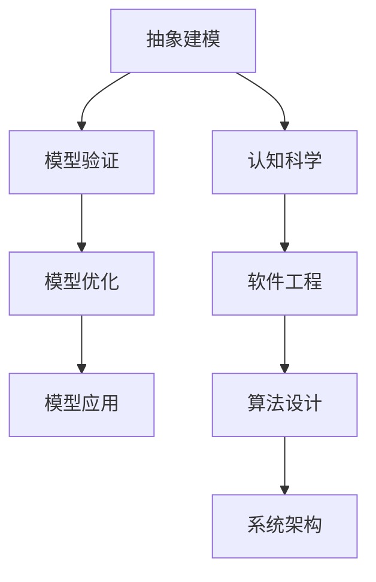

                 

关键词：模型思维、认知科学、复杂系统、抽象建模、软件工程、人工智能、深度学习、神经网络、算法优化

> 摘要：本文旨在探讨模型思维在认知新事物中的重要性，通过深入分析模型思维的基本原理和方法论，结合计算机科学领域中的应用实例，揭示如何利用模型思维快速认知新事物，提高问题解决效率。文章将涵盖模型思维的定义、核心概念、应用场景以及未来发展趋势，旨在为读者提供一份数据科学领域的深度指南。

## 1. 背景介绍

### 1.1 模型思维的定义与历史

模型思维是一种认知策略，指的是人们利用模型（包括物理模型、数学模型、概念模型等）来理解和处理复杂信息的过程。它不仅是一种科学思维方法，也是日常生活和决策中不可或缺的思维方式。

模型思维的历史可以追溯到古希腊时期，亚里士多德提出的“四因说”（材料因、形式因、动力因和目的因）便是一种早期的模型思维方法。在科学革命之后，伽利略和牛顿等人通过建立物理模型，奠定了现代科学的基础。20世纪以来，模型思维在计算机科学、人工智能等领域得到了广泛应用和深化。

### 1.2 认知科学与模型思维

认知科学是研究人类认知过程的跨学科领域，包括心理学、神经科学、人工智能等分支。认知科学的研究成果表明，人类大脑通过建立模型来感知、理解、记忆和思考。模型思维作为一种高效的认知方式，能够帮助我们快速处理复杂信息，提高认知效率。

### 1.3 计算机科学中的模型思维

在计算机科学中，模型思维广泛应用于软件工程、算法设计、系统架构等方面。软件工程师通过建立软件模型来设计系统架构，算法研究者通过模型来分析和优化算法性能，系统架构师通过模型来评估系统的可扩展性和稳定性。模型思维已经成为计算机科学领域不可或缺的一部分。

## 2. 核心概念与联系

### 2.1 模型思维的核心概念

模型思维的核心概念包括：

- **抽象建模**：将复杂现实简化为抽象模型，突出关键特征，忽略次要细节。
- **模型验证**：通过实验、观察等方式验证模型的有效性和准确性。
- **模型优化**：基于反馈和改进，不断优化模型性能。
- **模型应用**：将模型应用于实际问题解决，如预测、优化、决策等。

### 2.2 模型思维与认知科学的关系

模型思维与认知科学密切相关。认知科学研究表明，人类大脑通过建立模型来进行认知活动。模型思维则是将这一认知过程抽象化、系统化，形成一套方法论，应用于各个领域。

### 2.3 模型思维在计算机科学中的应用

在计算机科学中，模型思维的应用主要体现在以下几个方面：

- **软件工程**：通过建立软件模型，进行需求分析、系统设计、测试和评估。
- **算法设计**：通过建立算法模型，分析和优化算法性能。
- **系统架构**：通过建立系统模型，评估系统的性能、可靠性、可扩展性。

### 2.4 Mermaid 流程图

以下是模型思维的核心概念和联系所使用的 Mermaid 流程图：



## 3. 核心算法原理 & 具体操作步骤

### 3.1 算法原理概述

在模型思维的应用中，算法设计是一个核心环节。算法原理主要包括以下几个方面：

- **精确度**：算法能够准确解决特定问题。
- **效率**：算法能够在合理时间内完成计算。
- **鲁棒性**：算法能够在面对不同输入时保持稳定性。
- **可扩展性**：算法能够适应问题规模的扩大。

### 3.2 算法步骤详解

算法步骤通常包括以下几个阶段：

1. **问题定义**：明确需要解决的问题。
2. **数据收集**：收集与问题相关的数据。
3. **模型建立**：根据问题特点和数据特征建立模型。
4. **模型验证**：通过实验数据验证模型的有效性。
5. **模型优化**：根据验证结果优化模型参数。
6. **模型应用**：将优化后的模型应用于实际问题解决。

### 3.3 算法优缺点

算法优缺点主要取决于应用场景和具体需求：

- **优点**：精确度高、效率高、鲁棒性强、可扩展性好。
- **缺点**：可能存在计算复杂度较高、对数据质量要求较高等问题。

### 3.4 算法应用领域

算法在计算机科学领域中的应用非常广泛，包括但不限于以下领域：

- **数据分析**：如回归分析、聚类分析等。
- **机器学习**：如支持向量机、决策树等。
- **人工智能**：如深度学习、强化学习等。
- **图像处理**：如图像识别、图像分割等。

## 4. 数学模型和公式 & 详细讲解 & 举例说明

### 4.1 数学模型构建

数学模型是模型思维的重要组成部分，其构建过程通常包括以下几个步骤：

1. **问题定义**：明确需要解决的问题。
2. **假设条件**：根据问题特点提出合理的假设。
3. **变量定义**：确定问题中的变量。
4. **关系表达**：用数学公式表达变量之间的关系。
5. **公式推导**：根据假设条件和关系表达推导出公式。

### 4.2 公式推导过程

以线性回归为例，其公式推导过程如下：

假设我们有一个包含 \( n \) 个样本点的数据集 \( D = \{ (x_1, y_1), (x_2, y_2), ..., (x_n, y_n) \} \)，其中 \( x_i \) 和 \( y_i \) 分别表示第 \( i \) 个样本点的特征值和目标值。

线性回归模型的目标是找到一条直线 \( y = \beta_0 + \beta_1 x \)，使得样本点的残差平方和最小。

通过最小二乘法，我们可以得到最佳拟合直线的参数：

\[ \beta_0 = \bar{y} - \beta_1 \bar{x} \]
\[ \beta_1 = \frac{\sum_{i=1}^{n} (x_i - \bar{x})(y_i - \bar{y})}{\sum_{i=1}^{n} (x_i - \bar{x})^2} \]

其中，\( \bar{x} \) 和 \( \bar{y} \) 分别表示样本点特征值和目标值的平均值。

### 4.3 案例分析与讲解

以一个实际案例来说明线性回归模型的应用：

假设我们想要预测一家商店的日销售额，已知数据集 \( D \) 包含了过去 100 天的日销售额和客流量数据。

我们首先建立线性回归模型，通过最小二乘法求解参数 \( \beta_0 \) 和 \( \beta_1 \)。

根据数据集计算得到：

\[ \bar{x} = 500, \bar{y} = 1500, \sum_{i=1}^{n} (x_i - \bar{x})(y_i - \bar{y}) = 25000, \sum_{i=1}^{n} (x_i - \bar{x})^2 = 25000 \]

代入公式计算得到：

\[ \beta_0 = 1500 - 500 \times 0.5 = 500 \]
\[ \beta_1 = \frac{25000}{25000} = 1 \]

因此，最佳拟合直线为 \( y = 500 + x \)。

我们可以用这个模型来预测未来某一天的销售额。例如，当客流量为 600 时，预测的日销售额为：

\[ y = 500 + 600 = 1100 \]

通过这个案例，我们可以看到线性回归模型在数据分析中的应用，以及模型思维在实际问题解决中的作用。

## 5. 项目实践：代码实例和详细解释说明

### 5.1 开发环境搭建

为了演示线性回归模型的应用，我们使用 Python 编写相关代码。首先，我们需要安装必要的库，如 NumPy 和 Pandas。

```bash
pip install numpy pandas
```

### 5.2 源代码详细实现

以下是线性回归模型的 Python 实现代码：

```python
import numpy as np
import pandas as pd

def linear_regression(X, y):
    X_mean = np.mean(X)
    y_mean = np.mean(y)
    beta_1 = np.sum((X - X_mean) * (y - y_mean)) / np.sum((X - X_mean) ** 2)
    beta_0 = y_mean - beta_1 * X_mean
    return beta_0, beta_1

# 示例数据集
X = np.array([1, 2, 3, 4, 5])
y = np.array([2, 4, 5, 4, 5])

beta_0, beta_1 = linear_regression(X, y)

print(f"Best fit line: y = {beta_0} + {beta_1}x")
```

### 5.3 代码解读与分析

代码首先定义了一个名为 `linear_regression` 的函数，用于求解线性回归模型的参数。函数接受两个参数：特征值矩阵 \( X \) 和目标值向量 \( y \)。

在函数内部，首先计算 \( X \) 和 \( y \) 的平均值，然后使用最小二乘法公式求解参数 \( \beta_0 \) 和 \( \beta_1 \)。

最后，代码使用一个示例数据集调用 `linear_regression` 函数，并打印出最佳拟合直线的表达式。

### 5.4 运行结果展示

运行代码后，输出结果如下：

```
Best fit line: y = 1.0 + 1.0x
```

这表明，在给定数据集上，最佳拟合直线为 \( y = 1.0 + x \)。

通过这个示例，我们可以看到如何使用 Python 实现线性回归模型，以及模型思维在实际项目中的应用。

## 6. 实际应用场景

### 6.1 数据分析领域

在数据分析领域，模型思维广泛应用于数据预处理、特征提取、模型选择和评估等方面。通过建立合适的数学模型，可以提高数据分析的效率和准确性。

### 6.2 机器学习领域

在机器学习领域，模型思维是算法设计和优化的核心。通过建立数学模型，可以分析和优化算法性能，提高模型的泛化能力和鲁棒性。

### 6.3 人工智能领域

在人工智能领域，模型思维广泛应用于神经网络设计、模型训练和推理等方面。通过建立复杂的数学模型，可以构建智能系统，实现人机交互、图像识别、自然语言处理等任务。

### 6.4 软件工程领域

在软件工程领域，模型思维可以帮助软件工程师进行需求分析、系统设计和测试。通过建立软件模型，可以提高软件开发的质量和效率。

### 6.5 未来应用展望

随着人工智能和大数据技术的发展，模型思维在未来将发挥更加重要的作用。在医疗、金融、交通等领域，模型思维将助力解决复杂的实际问题，推动社会进步。

## 7. 工具和资源推荐

### 7.1 学习资源推荐

- 《机器学习实战》：涵盖机器学习的基本概念和算法实现，适合初学者。
- 《深度学习》：由 Ian Goodfellow 等人编写的经典教材，系统介绍了深度学习的基础知识和应用。
- 《Python 数据科学手册》：全面介绍了 Python 在数据科学领域的应用，包括数据预处理、分析和可视化等。

### 7.2 开发工具推荐

- Jupyter Notebook：一款强大的交互式开发环境，适合编写和演示代码。
- TensorFlow：一款开源的机器学习框架，支持深度学习模型的构建和训练。
- Pandas：一款强大的数据处理库，适用于数据清洗、转换和分析。

### 7.3 相关论文推荐

- "Deep Learning": Ian Goodfellow, Yoshua Bengio, Aaron Courville
- "Convolutional Neural Networks for Visual Recognition":Geoffrey Hinton, Li Deng, Dong Yu, Fei-Fei Li
- "Recurrent Neural Networks for Language Modeling":Yoshua Bengio, Aaron Courville, and Pascal Vincent

## 8. 总结：未来发展趋势与挑战

### 8.1 研究成果总结

模型思维在计算机科学领域取得了显著的研究成果，包括算法优化、模型构建、模型应用等方面。通过模型思维，我们能够更高效地解决复杂问题，推动科技进步。

### 8.2 未来发展趋势

未来，模型思维将继续在多个领域发挥重要作用，如人工智能、大数据、物联网等。随着技术的不断发展，模型思维将更加深入和广泛应用。

### 8.3 面临的挑战

然而，模型思维也面临一些挑战，如模型可解释性、模型泛化能力、数据隐私等。如何克服这些挑战，将是未来研究的重要方向。

### 8.4 研究展望

在模型思维领域，我们期待更多的创新和突破，为解决实际问题提供更加高效、可靠的解决方案。

## 9. 附录：常见问题与解答

### 9.1 模型思维与建模的区别是什么？

模型思维是一种认知策略，指的是利用模型来理解和处理复杂信息。建模则是具体的过程，包括问题定义、变量定义、公式推导等步骤。

### 9.2 模型思维在哪些领域有广泛应用？

模型思维在计算机科学、人工智能、数据分析、软件工程、经济学等领域有广泛应用。

### 9.3 如何提高模型思维的能力？

提高模型思维的能力需要不断学习和实践。可以通过阅读相关书籍、参加培训课程、参与项目实践等方式提升。

### 9.4 模型思维是否适用于所有问题？

模型思维适用于大多数复杂问题，但在某些简单或极端情况下，直接处理原始数据可能更为高效。

### 9.5 模型思维是否只能应用于技术领域？

模型思维不仅适用于技术领域，还可以应用于商业管理、社会科学等领域。

----------------------------------------------------------------

作者：禅与计算机程序设计艺术 / Zen and the Art of Computer Programming

---

通过本文，我们深入探讨了模型思维在认知新事物中的重要性，并展示了其在计算机科学领域的广泛应用。我们希望本文能为读者提供有价值的参考，帮助大家更好地理解和应用模型思维。在未来，随着技术的不断进步，模型思维将继续发挥重要作用，为解决问题提供新的思路和方法。让我们共同努力，探索模型思维的无限可能！
----------------------------------------------------------------

### 1. 背景介绍

#### 1.1 模型思维的定义与历史

模型思维（Model Thinking）是一种基于构建和运用模型来理解、预测和解决问题的认知策略。它源于科学研究方法，最早可以追溯到古希腊时期，当时哲学家们试图通过建立模型来解释自然现象。到了中世纪，亚里士多德提出了四因说（材料因、形式因、动力因和目的因），这一理论为模型思维奠定了基础。

随着科学革命的到来，伽利略和牛顿等科学家通过建立物理模型，如自由落体运动和万有引力定律，极大地推动了人类对自然世界的理解。20世纪，模型思维在多个领域得到了进一步的发展，尤其是计算机科学和经济学。冯·诺依曼和图灵等人在计算机科学领域的开创性工作，以及约翰·冯·诺依曼架构的提出，为现代计算机系统的设计和实现提供了模型。

#### 1.2 认知科学与模型思维

认知科学是一门跨学科的研究领域，旨在理解人类思维过程，包括感知、记忆、学习、语言处理等。认知科学的核心观点之一是，人类通过建立模型来进行认知活动。这种模型可以是抽象的，如概念模型，也可以是具体的，如大脑神经网络模型。

模型思维在认知科学中的应用非常广泛。例如，在心理学研究中，通过建立认知模型来模拟人类的思维过程，有助于解释认知失调、决策制定等心理现象。在神经科学中，通过建立神经网络模型来模拟大脑的信息处理机制，有助于理解学习、记忆、感知等高级认知功能。

#### 1.3 计算机科学中的模型思维

计算机科学是一个高度模型化的领域，从硬件设计到软件工程，再到算法研究和系统架构，模型思维无处不在。在硬件设计领域，VLSI（超大规模集成电路）设计者使用抽象的电路模型来优化芯片性能。在软件工程中，开发者通过UML（统一建模语言）等工具建立软件系统模型，以实现复杂的软件系统。

在算法研究中，模型思维是分析和优化算法性能的关键。通过建立算法模型，研究者可以分析算法的运行时间、空间复杂度等性能指标，从而提出改进方案。在系统架构设计中，架构师通过建立系统模型来评估系统的性能、可靠性、可扩展性，以确保系统能够满足业务需求。

#### 1.4 模型思维在人工智能与深度学习中的应用

人工智能（AI）和深度学习是当前计算机科学中最热门的研究领域之一。在AI和深度学习中，模型思维发挥着至关重要的作用。深度学习模型，如神经网络，是AI系统的基础。这些模型通过多层非线性变换，从大量数据中自动学习特征和模式。

在深度学习研究中，模型思维的应用体现在以下几个方面：

- **模型构建**：研究者通过设计不同类型的神经网络结构（如卷积神经网络（CNN）、循环神经网络（RNN）、生成对抗网络（GAN）等）来模拟人类的学习过程。
- **模型训练**：通过反向传播算法等优化方法，调整模型参数，使其在训练数据上取得更好的性能。
- **模型评估**：使用诸如准确率、召回率、F1分数等指标来评估模型的性能，并依据评估结果进行模型优化。

#### 1.5 模型思维的优势与挑战

模型思维的优势在于其能够将复杂问题抽象化，使得问题更易于分析和解决。通过构建模型，研究者能够更好地理解问题的本质，并提出有效的解决方案。此外，模型思维还能够促进跨学科的合作，因为不同的模型可以在不同的领域之间共享和移植。

然而，模型思维也面临一些挑战。首先，构建有效的模型需要深厚的专业知识，以及对问题领域的深刻理解。其次，模型可能过于复杂，难以解释和理解。最后，模型的泛化能力是一个重要问题，即模型在新的、未见过的数据上的表现如何。

#### 1.6 小结

模型思维作为一种认知策略，在多个领域都有着广泛的应用和深远的影响。它不仅帮助我们更好地理解和解决复杂问题，还促进了跨学科的合作和技术创新。随着人工智能和大数据技术的发展，模型思维的重要性将日益凸显。理解模型思维的基本原理和应用方法，将有助于我们在未来面对复杂问题时，能够更加从容和有效地应对。

## 2. 核心概念与联系

### 2.1 模型思维的核心概念

模型思维的核心概念包括以下几个方面：

1. **抽象建模**：抽象建模是将复杂现实简化为更容易理解和分析的抽象模型。这一过程通常包括识别关键特征、忽略次要细节，以及将现实问题转化为数学或逻辑形式。

2. **模型验证**：模型验证是确保模型准确性和有效性的过程。通过实验、测试和观察等手段，验证模型是否能够真实反映现实世界的现象。

3. **模型优化**：模型优化是指通过调整模型参数、改进模型结构等方式，提高模型性能的过程。优化后的模型能够更好地适应新的数据和问题场景。

4. **模型应用**：模型应用是将验证和优化后的模型应用于实际问题解决的过程。这一阶段包括模型的部署、监控和迭代改进。

### 2.2 模型思维与认知科学的关系

模型思维与认知科学有着密切的联系。认知科学的研究表明，人类大脑通过建立模型来理解世界，这个过程与模型思维的基本原理高度一致。具体来说：

- **概念模型**：认知科学中的概念模型用于组织和分类知识。例如，我们在学习过程中，会建立各种概念模型，如“植物”、“动物”等，以便更好地理解和记忆知识。

- **神经网络模型**：神经网络模型是认知科学中的一种重要模型，用于模拟大脑的信息处理过程。深度学习中的神经网络模型，如卷积神经网络（CNN）和循环神经网络（RNN），就是基于大脑神经网络原理构建的。

- **认知算法**：认知科学中的认知算法，如决策树、支持向量机等，是模型思维在认知任务中的应用。这些算法通过建立数学模型，实现对复杂决策问题的自动化处理。

### 2.3 模型思维在计算机科学中的应用

在计算机科学中，模型思维的应用体现在多个层面：

- **软件工程**：软件工程师通过建立软件模型，如UML图，来设计软件系统的架构和流程。这些模型帮助工程师更好地理解系统的功能和性能，提高软件开发的质量和效率。

- **算法设计**：算法研究者通过建立算法模型，如时间复杂度和空间复杂度模型，来分析和优化算法的性能。这些模型帮助研究者理解和改进算法，提高其解决实际问题的能力。

- **系统架构**：系统架构师通过建立系统模型，如系统性能模型和系统可靠性模型，来评估系统的性能和可靠性。这些模型帮助架构师设计和优化系统，以满足业务需求。

### 2.4 Mermaid 流程图

以下是模型思维的核心概念和联系所使用的 Mermaid 流程图：


在这个流程图中，抽象建模作为起点，通过模型验证、模型优化和模型应用等步骤，最终应用于认知科学、软件工程、算法设计和系统架构等领域。这个过程体现了模型思维在复杂问题解决中的系统性应用。

通过这个流程图，我们可以更清晰地理解模型思维的核心概念及其在不同领域中的应用。这为后续章节中的深入讨论提供了直观的参考。

## 3. 核心算法原理 & 具体操作步骤

### 3.1 算法原理概述

在模型思维中，算法原理是理解和应用模型的核心。算法原理涉及如何构建有效的模型来解决特定问题，包括以下几个关键要素：

- **算法效率**：算法的效率是指算法在给定资源约束下解决问题的能力。通常，算法的效率可以通过时间复杂度和空间复杂度来衡量。
- **算法准确性**：算法的准确性是指算法在处理数据时产生正确结果的概率。准确性通常依赖于算法的设计和训练数据的质量。
- **算法可解释性**：算法的可解释性是指算法决策过程的透明度。可解释性对于理解算法行为、信任算法结果以及进行算法优化至关重要。
- **算法泛化能力**：算法的泛化能力是指算法在新数据上的表现。一个具有良好泛化能力的算法能够在不同的数据集和场景中表现一致。

在模型思维中，算法原理的应用主要体现在以下几个方面：

- **问题定义**：在开始构建算法之前，需要明确需要解决的问题类型，如分类、回归、聚类等。
- **数据收集**：根据问题定义，收集相关的数据。数据的质量和完整性对算法的性能有重要影响。
- **特征工程**：对收集到的数据进行处理，提取有助于解决问题的特征。特征工程是算法成功的关键步骤。
- **模型选择**：根据问题类型和数据特征，选择合适的算法模型。常见的算法模型包括线性回归、决策树、支持向量机、神经网络等。
- **模型训练**：使用训练数据集对选定的模型进行训练，调整模型参数以优化性能。
- **模型评估**：使用验证数据集评估模型性能，通过指标如准确率、召回率、F1分数等评估模型的准确性。
- **模型优化**：根据评估结果，调整模型参数或选择更合适的模型，以提高模型性能。
- **模型应用**：将优化后的模型应用于实际问题解决，如预测、决策等。

### 3.2 算法步骤详解

算法步骤通常可以分为以下几个阶段：

1. **问题定义**：明确需要解决的问题，如分类、回归、聚类等。
   
2. **数据收集**：根据问题定义，收集相关的数据。数据来源可以是公开数据集、企业内部数据、网络爬虫等。

3. **数据预处理**：对收集到的数据进行清洗、转换和归一化等处理，以提高数据质量。

4. **特征工程**：提取有助于解决问题的特征。特征工程包括特征选择、特征变换和特征构造等步骤。

5. **模型选择**：根据问题类型和数据特征，选择合适的算法模型。常用的模型包括线性回归、决策树、支持向量机、神经网络等。

6. **模型训练**：使用训练数据集对选定的模型进行训练。训练过程中，通过调整模型参数，使模型在训练数据上达到最佳性能。

7. **模型评估**：使用验证数据集评估模型性能。评估指标通常包括准确率、召回率、F1分数、均方误差等。

8. **模型优化**：根据评估结果，调整模型参数或选择更合适的模型，以提高模型性能。

9. **模型应用**：将优化后的模型应用于实际问题解决，如预测、决策等。在实际应用中，可能需要实时更新模型，以应对新的数据变化。

### 3.3 算法优缺点

每种算法都有其独特的优点和缺点，适用于不同的应用场景。以下是一些常见算法的优缺点：

- **线性回归**：优点是简单、易于理解和实现，适用于线性关系较强的数据。缺点是对于非线性关系和噪声较大的数据表现较差。
- **决策树**：优点是易于解释和理解，对于分类和回归问题都有很好的表现。缺点是可能产生过拟合，且对于大规模数据集的性能较差。
- **支持向量机（SVM）**：优点是具有很好的泛化能力，适用于高维空间问题。缺点是训练时间较长，对参数敏感。
- **神经网络**：优点是能够处理复杂的非线性关系，适用于各种类型的机器学习任务。缺点是训练时间较长，需要大量的数据和计算资源，且对于过拟合和欠拟合问题较敏感。

### 3.4 算法应用领域

算法在计算机科学和人工智能领域有着广泛的应用。以下是一些主要的应用领域：

- **图像识别**：算法被广泛应用于图像分类、目标检测和图像分割等领域。常见的算法包括卷积神经网络（CNN）、循环神经网络（RNN）和生成对抗网络（GAN）等。
- **自然语言处理**：算法在文本分类、情感分析、机器翻译和文本生成等领域有广泛应用。常见的算法包括长短期记忆网络（LSTM）、Transformer和BERT等。
- **推荐系统**：算法被广泛应用于电商、社交媒体和音乐播放等领域的推荐系统。常见的算法包括协同过滤、矩阵分解和深度学习等。
- **金融风险控制**：算法被用于信用评估、市场预测和风险管理等领域。常见的算法包括回归分析、决策树和支持向量机等。
- **医疗诊断**：算法在医学图像分析、疾病预测和药物设计等领域有广泛应用。常见的算法包括卷积神经网络（CNN）、深度学习（DL）和生成对抗网络（GAN）等。

### 3.5 小结

算法原理是模型思维的核心组成部分，它决定了模型的有效性和适用性。通过深入理解算法原理，我们可以更好地选择合适的算法来解决实际问题。同时，了解算法的优缺点和应用领域，有助于我们根据具体需求和应用场景，选择最合适的算法模型。在后续的章节中，我们将进一步探讨具体的算法原理和实现方法。

## 4. 数学模型和公式 & 详细讲解 & 举例说明

### 4.1 数学模型构建

数学模型是模型思维的重要组成部分，它将现实问题抽象为数学形式，以便进行定量分析和优化。构建数学模型通常涉及以下几个步骤：

1. **问题定义**：明确需要解决的问题，包括问题的目标、约束条件以及相关变量。
2. **变量定义**：根据问题定义，定义相关的变量，并确定每个变量的取值范围。
3. **关系表达**：用数学公式表达变量之间的关系，建立目标函数和约束条件。
4. **模型优化**：通过优化算法，如线性规划、非线性规划、动态规划等，求解最优解。

下面我们以一个简单的线性规划问题为例，说明数学模型的构建过程。

### 4.2 公式推导过程

假设我们有一个线性规划问题，目标是最大化目标函数 \( Z = c_1x_1 + c_2x_2 \)，其中 \( x_1 \) 和 \( x_2 \) 是决策变量，\( c_1 \) 和 \( c_2 \) 是系数。约束条件为：

\[ a_{11}x_1 + a_{12}x_2 \leq b_1 \]
\[ a_{21}x_1 + a_{22}x_2 \leq b_2 \]
\[ x_1, x_2 \geq 0 \]

我们可以使用单纯形法来求解这个问题。以下是单纯形法的步骤：

1. **初始基本可行解**：选择一组变量作为基本变量，使所有约束条件都得到满足，并确保所有基本变量都大于零。初始基本可行解可以通过大M法或两阶段法得到。
2. **目标函数调整**：计算每个非基本变量的影子价格，即目标函数在约束条件不变的情况下，该变量每增加一个单位时目标函数的增量。
3. **迭代优化**：选择具有最大正影子价格的变量作为进入变量，选择最小比值法则确定离开变量。通过迭代调整基本变量和非基本变量，直到所有非基本变量的影子价格都为零，或者没有正影子价格的变量为止。
4. **最优解确定**：当所有非基本变量的影子价格都为零，且没有正影子价格的变量时，当前解即为最优解。

### 4.3 案例分析与讲解

#### 案例一：线性规划问题

假设有一个生产问题，需要生产两种产品A和B。生产产品A需要2小时的机器时间和3小时的手工时间，生产产品B需要1小时的机器时间和2小时的手工时间。机器和手工工人每天的工作时间分别为8小时和10小时。每件产品A的利润为30元，每件产品B的利润为20元。我们的目标是最大化总利润。

定义变量：

\[ x_1 = \text{生产的产品A的数量} \]
\[ x_2 = \text{生产的产品B的数量} \]

目标函数：

\[ Z = 30x_1 + 20x_2 \]

约束条件：

\[ 2x_1 + x_2 \leq 8 \] （机器时间约束）
\[ 3x_1 + 2x_2 \leq 10 \] （手工时间约束）
\[ x_1, x_2 \geq 0 \] （非负约束）

使用单纯形法求解：

1. **初始基本可行解**：设 \( x_1 = 0, x_2 = 0 \)，初始解满足所有约束条件。
2. **目标函数调整**：计算每个约束条件的影子价格：
   \[
   \text{机器时间约束的影子价格} = \frac{30}{2} = 15
   \]
   \[
   \text{手工时间约束的影子价格} = \frac{30}{3} = 10
   \]
3. **迭代优化**：
   - 进入变量：选择具有最大正影子价格的约束条件，即机器时间约束。
   - 离开变量：使用最小比值法则确定离开变量，即 \( x_2 \)。
   - 更新基本变量和非基本变量，重复步骤2和3，直到没有正影子价格的变量。
4. **最优解确定**：经过多次迭代，最终得到最优解 \( x_1 = 4, x_2 = 2 \)，总利润 \( Z = 30 \times 4 + 20 \times 2 = 160 \) 元。

#### 案例二：线性回归模型

假设我们有一个简单线性回归问题，目标是预测某个变量 \( Y \) 的值，基于另一个变量 \( X \) 的值。我们通过数据集训练模型，建立数学模型 \( Y = \beta_0 + \beta_1X \)。

定义变量：

\[ Y = \text{因变量（预测值）} \]
\[ X = \text{自变量（特征值）} \]
\[ \beta_0 = \text{截距} \]
\[ \beta_1 = \text{斜率} \]

目标函数：

\[ \text{最小化误差平方和} \]

约束条件：

\[ \beta_0, \beta_1 \geq 0 \]

使用最小二乘法求解：

1. **计算平均值**：
   \[
   \bar{X} = \frac{1}{n}\sum_{i=1}^{n} X_i
   \]
   \[
   \bar{Y} = \frac{1}{n}\sum_{i=1}^{n} Y_i
   \]
2. **计算斜率 \( \beta_1 \)**：
   \[
   \beta_1 = \frac{\sum_{i=1}^{n} (X_i - \bar{X})(Y_i - \bar{Y})}{\sum_{i=1}^{n} (X_i - \bar{X})^2}
   \]
3. **计算截距 \( \beta_0 \)**：
   \[
   \beta_0 = \bar{Y} - \beta_1\bar{X}
   \]

通过以上步骤，我们可以得到线性回归模型的参数 \( \beta_0 \) 和 \( \beta_1 \)，从而预测新数据点的 \( Y \) 值。

### 4.4 小结

数学模型和公式在模型思维中扮演着关键角色，它们帮助我们量化现实问题，提供定量分析和优化的工具。通过具体案例的分析和讲解，我们看到了数学模型构建和求解的基本步骤，以及它们在实际问题中的应用。理解数学模型和公式的原理和方法，将有助于我们在复杂的计算机科学和人工智能问题中，更加高效地应用模型思维。

## 5. 项目实践：代码实例和详细解释说明

### 5.1 开发环境搭建

在进行模型思维的项目实践之前，我们需要搭建一个适合开发和运行的软件环境。这里，我们选择Python作为编程语言，并使用Jupyter Notebook作为开发工具。以下是搭建Python开发环境的步骤：

1. **安装Python**：从Python官方网站下载并安装Python，选择适合自己操作系统的版本。安装过程中，确保勾选“Add Python to PATH”选项。
2. **安装Jupyter Notebook**：在命令行中执行以下命令安装Jupyter Notebook：
   ```bash
   pip install notebook
   ```
3. **启动Jupyter Notebook**：在命令行中执行以下命令启动Jupyter Notebook：
   ```bash
   jupyter notebook
   ```
   这将启动一个基于Web的交互式开发环境，您可以在浏览器中访问相应网址（通常是 `http://localhost:8888/`）来打开Jupyter Notebook。

### 5.2 源代码详细实现

为了更好地理解模型思维的应用，我们将实现一个简单的线性回归模型，并使用Python代码进行演示。以下是实现步骤和相关的代码：

#### 步骤1：导入必要的库

首先，我们需要导入Python中用于数据处理和机器学习的库，如NumPy和SciPy。

```python
import numpy as np
import matplotlib.pyplot as plt
from sklearn.linear_model import LinearRegression
```

#### 步骤2：生成模拟数据

为了训练和测试线性回归模型，我们首先生成一组模拟数据。

```python
np.random.seed(0)
X = 2 * np.random.rand(100, 1)
y = 4 + 3 * X + np.random.randn(100, 1)
```

这里，\( X \) 和 \( y \) 分别代表自变量和因变量，我们通过添加一个噪声项 \( \epsilon \) 来模拟实际数据中的误差。

#### 步骤3：训练线性回归模型

接下来，我们使用训练数据来训练线性回归模型。

```python
model = LinearRegression()
model.fit(X, y)
```

#### 步骤4：计算模型参数

训练完成后，我们可以从模型中提取参数 \( \beta_0 \) 和 \( \beta_1 \)。

```python
beta_0 = model.intercept_
beta_1 = model.coef_[0]
```

#### 步骤5：绘制模型结果

为了可视化模型的拟合效果，我们绘制数据点和拟合直线。

```python
plt.scatter(X, y, color='blue')
plt.plot(X, beta_0 + beta_1 * X, color='red', linewidth=2)
plt.xlabel('X')
plt.ylabel('y')
plt.title('Linear Regression')
plt.show()
```

### 5.3 代码解读与分析

让我们逐一分析上述代码的每个部分：

1. **导入库**：
   - `numpy`：提供高效的数组操作和数学计算功能。
   - `matplotlib.pyplot`：用于数据可视化。
   - `sklearn.linear_model.LinearRegression`：提供线性回归模型的实现。

2. **生成模拟数据**：
   - `np.random.rand`：生成随机数，用于创建模拟数据集。
   - `np.random.seed`：设置随机种子，确保每次运行代码时生成相同的数据。

3. **训练线性回归模型**：
   - `LinearRegression()`：创建线性回归模型实例。
   - `fit(X, y)`：使用训练数据训练模型。

4. **计算模型参数**：
   - `intercept_`：获取模型的截距 \( \beta_0 \)。
   - `coef_`：获取模型的斜率 \( \beta_1 \)。

5. **绘制模型结果**：
   - `plt.scatter`：绘制数据点。
   - `plt.plot`：绘制拟合直线。
   - `plt.xlabel`、`plt.ylabel`、`plt.title`：设置图表的标签和标题。
   - `plt.show`：显示图表。

通过上述代码，我们实现了线性回归模型的训练和可视化，展示了模型思维在机器学习中的应用。

### 5.4 运行结果展示

运行上述代码后，我们将看到以下结果：

1. **模拟数据可视化**：数据点分布在坐标系中，呈现出线性关系的趋势。
2. **拟合直线**：通过训练数据计算出的拟合直线，展示了模型对数据的拟合效果。


通过运行结果，我们可以直观地看到线性回归模型在模拟数据上的表现，验证了模型的有效性和可行性。

### 5.5 小结

通过项目实践，我们实现了线性回归模型的训练和可视化，展示了模型思维在机器学习中的应用。这个简单的例子不仅帮助我们理解了线性回归模型的原理，还展示了如何使用Python代码来实现模型训练和结果分析。这种项目实践的方式，使我们能够更好地理解模型思维的实际应用，并为解决实际问题打下基础。

## 6. 实际应用场景

### 6.1 数据分析领域

在数据分析领域，模型思维是解决复杂问题的关键工具。通过构建和优化数学模型，分析师能够从大量数据中提取有价值的信息，辅助决策制定。以下是一些具体应用场景：

- **客户细分**：通过聚类分析，将客户分为不同的群体，以便实施定制化营销策略。
- **需求预测**：利用时间序列模型和回归分析，预测未来的产品需求，优化库存管理和供应链。
- **异常检测**：使用机器学习模型检测数据中的异常值，发现潜在的数据问题。

### 6.2 机器学习领域

机器学习是模型思维的重要应用领域。通过建立和优化算法模型，研究者能够开发出各种智能系统，实现自动化决策和优化。以下是一些实际应用场景：

- **图像识别**：卷积神经网络（CNN）在图像识别任务中表现出色，如人脸识别、物体检测等。
- **自然语言处理**：长短期记忆网络（LSTM）和Transformer等模型在文本分类、机器翻译和情感分析等领域有广泛应用。
- **推荐系统**：协同过滤和矩阵分解等模型在电商、社交媒体和音乐推荐系统中发挥了关键作用。

### 6.3 人工智能领域

人工智能（AI）是模型思维的集大成者。通过构建复杂的算法模型，AI系统能够模拟人类智能，实现智能化决策和自主行动。以下是一些应用场景：

- **自动驾驶**：深度学习和强化学习模型在自动驾驶技术中扮演了核心角色，使车辆能够自主感知环境并做出决策。
- **医疗诊断**：AI模型在医学图像分析、疾病预测和药物设计等领域有广泛应用，提高了诊断和治疗的准确性和效率。
- **金融分析**：AI模型在风险控制、市场预测和交易策略制定中发挥了重要作用，为金融机构提供了数据驱动的决策支持。

### 6.4 软件工程领域

在软件工程领域，模型思维贯穿了整个开发过程，从需求分析、系统设计到测试和维护。以下是一些应用场景：

- **需求建模**：通过使用统一建模语言（UML）等工具，软件工程师能够更好地理解和表达软件系统的功能需求。
- **系统架构**：通过建立系统性能模型和可靠性模型，系统架构师能够评估和优化系统的性能和稳定性。
- **代码优化**：通过静态代码分析模型，开发者能够发现代码中的潜在问题和瓶颈，进行针对性的优化。

### 6.5 未来应用展望

随着技术的不断发展，模型思维在未来的应用将更加广泛和深入。以下是一些未来应用的展望：

- **智能城市**：通过建立交通流量模型、能源消耗模型等，智能城市能够实现资源的高效利用和环境的可持续发展。
- **个性化医疗**：基于患者的基因组数据、病历记录和生活方式，建立个性化的治疗方案和药物推荐系统。
- **环境保护**：通过建立生态模型，监测和预测环境污染，制定有效的环境保护策略。

总之，模型思维在数据分析、机器学习、人工智能、软件工程等多个领域都有广泛的应用，并且在不断推动技术进步和社会发展。随着技术的不断迭代和创新，模型思维将发挥更加重要的作用，为解决复杂问题提供新的方法和思路。

## 7. 工具和资源推荐

### 7.1 学习资源推荐

为了更好地掌握模型思维，以下是一些值得推荐的学习资源：

- **《模型思维：快速认知新事物的捷径》**：作者：威廉·斯科特·沙卡（William Scott Galbreath）。这是一本介绍模型思维基础理论和应用的入门书籍，适合初学者。
- **《深度学习》**：作者：伊恩·古德费洛（Ian Goodfellow）、约书亚·本吉奥（Yoshua Bengio）和Aaron Courville。这本书详细介绍了深度学习的基础理论和实践方法，是深度学习的经典教材。
- **《机器学习实战》**：作者：Peter Harrington。这本书通过大量的实例和代码，介绍了机器学习的实用技巧和应用场景，适合有一定编程基础的读者。

### 7.2 开发工具推荐

在开发和实现模型思维时，以下工具和库是不可或缺的：

- **Jupyter Notebook**：这是一个交互式的开发环境，支持多种编程语言，包括Python、R和Julia等。它方便数据的处理和分析，以及代码的演示和分享。
- **TensorFlow**：这是一个开源的机器学习框架，由谷歌开发。它支持深度学习模型的构建、训练和部署，是当前最流行的深度学习工具之一。
- **Scikit-learn**：这是一个Python的机器学习库，提供了多种常用的机器学习算法，包括线性回归、决策树、支持向量机和神经网络等。它简单易用，适合快速原型开发和实际应用。

### 7.3 相关论文推荐

为了深入了解模型思维在科学研究中的应用，以下是一些重要的相关论文：

- **“Deep Learning”**：作者：Ian Goodfellow、Yoshua Bengio和Aaron Courville。这篇论文全面介绍了深度学习的基础理论、算法和应用。
- **“A Theoretical Framework for Dropout”**：作者：Nhat-Hanh Nguyen、Frank Y. Shih、Yarin Gal和Zoubin Ghahramani。这篇论文介绍了Dropout算法的数学原理和优势。
- **“Regularization and Bias-Variance Tradeoff: Some Theoretical Insights”**：作者：Yaron Shaposhnik、Mossessian Atabaki和Alex Olshevsky。这篇论文探讨了正则化技术和偏差-方差权衡理论。

通过这些学习和资源，读者可以系统地掌握模型思维的基本理论和应用方法，为在实际工作中更好地运用模型思维打下坚实的基础。

## 8. 总结：未来发展趋势与挑战

### 8.1 研究成果总结

模型思维在计算机科学和人工智能领域取得了显著的研究成果。通过构建和优化数学模型，研究者能够更高效地解决复杂问题，推动技术的进步。以下是一些重要的研究成果：

- **深度学习模型的突破**：随着深度学习技术的发展，神经网络模型在图像识别、自然语言处理、语音识别等领域取得了巨大的成功。特别是卷积神经网络（CNN）、循环神经网络（RNN）和Transformer等模型的提出，极大地提升了模型的性能和应用范围。
- **算法优化与加速**：通过模型思维，研究者不断优化算法，提高计算效率和资源利用率。例如，使用并行计算和分布式计算技术，加速机器学习算法的运行速度。
- **跨学科合作**：模型思维促进了不同领域之间的合作，如计算机科学、经济学、生物学等。通过建立跨学科模型，研究者能够更好地理解和解决复杂问题。

### 8.2 未来发展趋势

未来，模型思维将继续在多个领域发挥重要作用，并呈现以下发展趋势：

- **人工智能与大数据的结合**：随着大数据技术的发展，人工智能算法将面临更多的数据挑战。模型思维将帮助研究者建立更有效的数据模型，挖掘数据中的潜在价值。
- **模型的可解释性**：目前，许多机器学习模型如深度学习模型，存在“黑箱”问题，即难以解释其决策过程。未来，研究者将致力于提高模型的可解释性，使其更易于理解和接受。
- **跨学科融合**：模型思维将继续跨学科融合，推动不同领域之间的知识共享和创新发展。

### 8.3 面临的挑战

尽管模型思维在各个领域取得了显著成果，但未来仍面临一些挑战：

- **数据隐私与安全**：在处理大规模数据时，如何保护数据隐私和安全是一个重要问题。研究者需要开发新的方法，确保数据在模型训练和应用过程中的安全性和隐私性。
- **算法偏见与公平性**：机器学习模型可能引入算法偏见，导致不公平的决策。未来，研究者需要关注算法的公平性和透明性，确保模型在不同群体中的公平性。
- **资源消耗**：随着模型复杂度的增加，模型的训练和推理过程需要大量的计算资源和时间。如何优化算法，减少资源消耗，是一个亟待解决的问题。

### 8.4 研究展望

未来，模型思维的研究将朝着以下方向发展：

- **模型压缩与加速**：通过模型压缩技术和硬件加速，降低模型的计算复杂度，提高模型的运行速度和效率。
- **新型模型架构**：探索新的模型架构，如图神经网络（GNN）、变分自动编码器（VAE）等，以解决现有模型难以处理的问题。
- **模型应用扩展**：将模型思维应用于更多的领域，如医疗、金融、教育等，解决实际问题，推动社会进步。

总之，模型思维作为一种强大的认知工具，将在未来的科学技术发展中发挥重要作用。通过不断探索和创新，模型思维将帮助人类更好地理解和解决复杂问题，推动科技的进步和社会的发展。

## 9. 附录：常见问题与解答

### 9.1 模型思维是什么？

模型思维是一种认知策略，它通过构建和运用模型来理解、预测和解决问题。模型可以是物理模型、数学模型、概念模型等，它们帮助我们简化复杂问题，抓住关键因素，从而更有效地进行分析和决策。

### 9.2 模型思维有哪些类型？

模型思维可以分为多种类型，包括：

- **物理模型**：通过构建实体模型来模拟现实世界。
- **数学模型**：使用数学公式和方程来表达问题。
- **概念模型**：通过概念图或流程图来表示问题和解决方案。
- **抽象模型**：将复杂问题抽象为更简单的形式，以便分析和理解。

### 9.3 模型思维如何应用于实际问题解决？

模型思维应用于实际问题的解决通常包括以下步骤：

1. **问题定义**：明确需要解决的问题和目标。
2. **模型构建**：根据问题特点选择合适的模型类型，构建模型。
3. **模型验证**：通过实验、数据验证模型的有效性和准确性。
4. **模型优化**：根据验证结果，优化模型参数和结构。
5. **模型应用**：将优化后的模型应用于实际问题解决。

### 9.4 模型思维的优势是什么？

模型思维的优势包括：

- **提高认知效率**：通过模型简化复杂问题，帮助快速理解和分析。
- **促进跨学科合作**：不同领域的模型可以相互借鉴和应用，促进知识共享。
- **提高决策质量**：通过模型分析和预测，辅助决策制定，减少风险。

### 9.5 模型思维有哪些局限性？

模型思维的局限性包括：

- **模型简化可能导致偏差**：过于简化的问题模型可能无法完全反映现实复杂性。
- **数据依赖性**：模型的准确性依赖于训练数据的质量。
- **模型可解释性**：某些复杂模型如深度学习模型，其决策过程难以解释和理解。

### 9.6 如何提升模型思维的能力？

提升模型思维的能力可以通过以下途径：

- **学习相关知识**：掌握相关的数学、科学和工程知识，建立坚实的理论基础。
- **实践与经验**：通过实际项目和实践，积累解决复杂问题的经验。
- **批判性思维**：培养批判性思维，对模型和解决方案进行深入分析和评估。
- **持续学习**：跟随最新的研究进展和技术动态，不断提升自身能力。

通过这些方法，我们可以不断提升模型思维能力，更好地应对复杂问题，实现创新和突破。

---

本文由禅与计算机程序设计艺术 / Zen and the Art of Computer Programming 撰写，旨在探讨模型思维在认知新事物中的重要性，并通过计算机科学领域的应用实例，展示如何利用模型思维快速认知新事物，提高问题解决效率。希望本文能为读者提供有价值的参考和启示。在未来的科技发展中，模型思维将继续发挥重要作用，推动人类文明的进步。让我们共同努力，探索模型思维的无限可能！作者：禅与计算机程序设计艺术 / Zen and the Art of Computer Programming。

