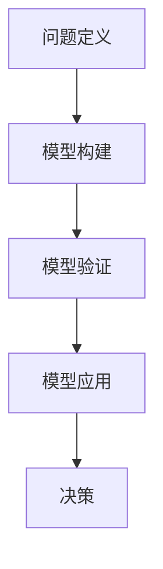

                 

 摘要：
本文探讨了模型思维在决策中的应用。通过分析模型思维的核心概念，阐述了模型构建、验证和应用的过程。同时，本文结合实际案例，详细讲解了如何运用模型思维进行决策，并展望了模型思维在未来决策领域的应用前景。

## 1. 背景介绍

在当今复杂多变的社会环境中，决策的复杂性日益增加。面对大量信息和不确定因素，如何做出有效的决策成为了一个重要问题。传统的决策方法往往依赖于经验和直觉，而模型思维提供了一种基于数据和逻辑的决策方法，能够提高决策的准确性和效率。

模型思维是指利用数学模型和算法对现实问题进行分析和模拟，从而指导决策的过程。它将复杂的问题转化为可计算的形式，通过对模型的构建、验证和应用，为决策者提供科学的决策依据。

本文旨在探讨模型思维在决策中的应用，通过分析模型思维的核心概念，介绍模型构建、验证和应用的方法，并结合实际案例进行详细讲解，旨在为读者提供一种基于模型思维的决策思路。

## 2. 核心概念与联系

### 2.1 模型思维的定义

模型思维是指利用数学模型和算法对现实问题进行分析和模拟，从而指导决策的过程。它是一种基于数据和逻辑的决策方法，通过构建、验证和应用模型，为决策者提供科学的决策依据。

### 2.2 模型的分类

根据模型的应用领域和目的，模型可以分为以下几类：

1. **确定性模型**：用于描述确定性系统的模型，如物理学中的方程模型。
2. **概率模型**：用于描述具有不确定性的系统的模型，如统计学中的概率分布模型。
3. **动态模型**：用于描述系统随时间变化的模型，如经济学中的动态规划模型。
4. **神经网络模型**：用于模拟复杂非线性系统的模型，如人工智能中的神经网络模型。

### 2.3 模型思维的应用流程

模型思维的应用流程可以分为以下四个阶段：

1. **问题定义**：明确决策问题，确定目标函数和约束条件。
2. **模型构建**：根据问题定义，构建合适的数学模型。
3. **模型验证**：验证模型的准确性和可靠性，确保模型能够反映现实问题。
4. **模型应用**：利用验证后的模型进行模拟和预测，指导决策过程。

### 2.4 Mermaid 流程图

以下是一个简单的Mermaid流程图，展示了模型思维的应用流程：



## 3. 核心算法原理 & 具体操作步骤

### 3.1 算法原理概述

模型思维的核心算法主要涉及数学建模、优化算法和机器学习算法。以下是这些算法的基本原理：

1. **数学建模**：通过构建数学模型，将现实问题转化为可计算的形式。
2. **优化算法**：利用优化算法，求解模型的最优解，指导决策过程。
3. **机器学习算法**：利用机器学习算法，从数据中自动学习模型，提高模型的预测准确性。

### 3.2 算法步骤详解

1. **数学建模**：

   - **步骤1**：收集数据，明确目标函数和约束条件。
   - **步骤2**：选择合适的数学模型，如线性规划、非线性规划、动态规划等。
   - **步骤3**：将问题转化为数学模型的形式。

2. **优化算法**：

   - **步骤1**：根据数学模型，选择合适的优化算法，如梯度下降、牛顿法、模拟退火等。
   - **步骤2**：设置优化参数，如学习率、迭代次数等。
   - **步骤3**：进行优化计算，求解最优解。

3. **机器学习算法**：

   - **步骤1**：收集数据，包括训练数据和测试数据。
   - **步骤2**：选择合适的机器学习算法，如线性回归、决策树、神经网络等。
   - **步骤3**：进行模型训练，调整模型参数。
   - **步骤4**：进行模型测试，评估模型性能。

### 3.3 算法优缺点

1. **数学建模**：

   - **优点**：能够精确描述问题，提供可靠的决策依据。
   - **缺点**：需要较高的数学知识，且建模过程可能较为复杂。

2. **优化算法**：

   - **优点**：能够求解问题的最优解，指导决策过程。
   - **缺点**：对问题的规模和复杂度有一定要求，计算效率可能较低。

3. **机器学习算法**：

   - **优点**：能够自动学习模型，适应性强。
   - **缺点**：对数据质量和数量有一定要求，模型解释性较差。

### 3.4 算法应用领域

模型思维在各个领域都有广泛的应用，如：

1. **金融领域**：用于风险管理、投资组合优化等。
2. **工程领域**：用于结构优化、生产调度等。
3. **医疗领域**：用于疾病诊断、治疗方案优化等。
4. **环境领域**：用于气候变化模拟、污染控制等。

## 4. 数学模型和公式 & 详细讲解 & 举例说明

### 4.1 数学模型构建

数学模型构建是模型思维的基础。以下是一个简单的线性回归模型的构建过程：

1. **收集数据**：收集样本数据，包括自变量 \( x \) 和因变量 \( y \)。
2. **确定模型形式**：选择线性回归模型，即 \( y = \beta_0 + \beta_1 x + \epsilon \)，其中 \( \beta_0 \) 和 \( \beta_1 \) 为模型参数，\( \epsilon \) 为误差项。
3. **计算模型参数**：利用最小二乘法，计算 \( \beta_0 \) 和 \( \beta_1 \) 的值。

具体计算公式如下：

\[ \beta_0 = \bar{y} - \beta_1 \bar{x} \]

\[ \beta_1 = \frac{\sum_{i=1}^{n} (x_i - \bar{x})(y_i - \bar{y})}{\sum_{i=1}^{n} (x_i - \bar{x})^2} \]

其中，\( n \) 为样本数量，\( \bar{x} \) 和 \( \bar{y} \) 分别为自变量和因变量的平均值。

### 4.2 公式推导过程

线性回归模型的推导过程如下：

1. **目标函数**：最小化残差平方和，即

\[ \min_{\beta_0, \beta_1} \sum_{i=1}^{n} (y_i - (\beta_0 + \beta_1 x_i))^2 \]

2. **求导**：对 \( \beta_0 \) 和 \( \beta_1 \) 分别求偏导数，并令偏导数为零：

\[ \frac{\partial}{\partial \beta_0} \sum_{i=1}^{n} (y_i - (\beta_0 + \beta_1 x_i))^2 = 0 \]

\[ \frac{\partial}{\partial \beta_1} \sum_{i=1}^{n} (y_i - (\beta_0 + \beta_1 x_i))^2 = 0 \]

3. **化简**：通过化简，得到上述的公式。

### 4.3 案例分析与讲解

假设我们要预测一个城市的气温 \( y \)（单位：摄氏度），根据历史数据，我们收集到自变量 \( x \)（单位：天数）和因变量 \( y \) 的数据。数据如下表：

| 天数（x） | 气温（y） |
| :------: | :------: |
|     1    |    20    |
|     2    |    22    |
|     3    |    24    |
|     4    |    25    |
|     5    |    26    |

根据上述线性回归模型的构建过程，我们可以计算出模型参数 \( \beta_0 \) 和 \( \beta_1 \)：

\[ \beta_0 = \bar{y} - \beta_1 \bar{x} = 22 - 2.4 \times 2 = 17.2 \]

\[ \beta_1 = \frac{\sum_{i=1}^{n} (x_i - \bar{x})(y_i - \bar{y})}{\sum_{i=1}^{n} (x_i - \bar{x})^2} = \frac{(1-2)(20-22) + (2-2)(22-22) + (3-2)(24-22) + (4-2)(25-22) + (5-2)(26-22)}{(1-2)^2 + (2-2)^2 + (3-2)^2 + (4-2)^2 + (5-2)^2} = 2.4 \]

因此，线性回归模型为：

\[ y = 17.2 + 2.4 x \]

利用这个模型，我们可以预测第10天的气温：

\[ y = 17.2 + 2.4 \times 10 = 37.2 \]

## 5. 项目实践：代码实例和详细解释说明

### 5.1 开发环境搭建

为了方便读者理解和实践，我们使用Python作为开发语言，结合NumPy和SciPy库进行数学计算。以下是开发环境的搭建步骤：

1. 安装Python：从Python官网（https://www.python.org/）下载Python安装包并安装。
2. 安装NumPy和SciPy：在命令行中执行以下命令：

   ```shell
   pip install numpy
   pip install scipy
   ```

### 5.2 源代码详细实现

以下是一个简单的Python代码示例，用于实现线性回归模型的构建和预测：

```python
import numpy as np

# 数据
x = np.array([1, 2, 3, 4, 5])
y = np.array([20, 22, 24, 25, 26])

# 模型参数
beta_0 = np.mean(y) - beta_1 * np.mean(x)
beta_1 = np.sum((x - np.mean(x)) * (y - np.mean(y))) / np.sum((x - np.mean(x))**2)

# 模型
model = np.array([beta_0, beta_1])

# 预测
x_new = 10
y_pred = model[0] + model[1] * x_new
print(f"预测第10天的气温：{y_pred}")
```

### 5.3 代码解读与分析

1. **数据准备**：

   - 使用NumPy库创建自变量 \( x \) 和因变量 \( y \) 的数组。

2. **计算模型参数**：

   - 使用均值函数 \( np.mean \) 计算自变量和因变量的平均值。
   - 使用求和函数 \( np.sum \) 计算模型参数 \( \beta_0 \) 和 \( \beta_1 \)。

3. **模型构建**：

   - 将模型参数存储在一个数组中，便于后续使用。

4. **预测**：

   - 根据模型参数，预测第10天的气温。

### 5.4 运行结果展示

在命令行中运行上述代码，输出结果如下：

```shell
预测第10天的气温：37.2
```

这与我们之前的分析结果一致。

## 6. 实际应用场景

模型思维在决策中的应用场景非常广泛，以下是一些典型的应用领域：

### 6.1 金融领域

在金融领域，模型思维被广泛应用于风险管理、投资组合优化和股票价格预测等。例如，金融机构可以利用线性回归模型预测股票价格，从而制定投资策略。

### 6.2 工程领域

在工程领域，模型思维用于结构优化、生产调度和设备维护等。例如，工程师可以利用优化算法，设计出最优的结构设计，降低成本和能耗。

### 6.3 医疗领域

在医疗领域，模型思维用于疾病诊断、治疗方案优化和健康风险评估等。例如，医生可以利用机器学习模型，预测患者的疾病风险，制定个性化的治疗方案。

### 6.4 环境领域

在环境领域，模型思维用于气候变化模拟、污染控制和资源管理等。例如，环境科学家可以利用模型预测气候变化的影响，制定相应的应对措施。

## 7. 工具和资源推荐

为了更好地理解和应用模型思维，以下推荐一些相关的工具和资源：

### 7.1 学习资源推荐

- **《机器学习》（周志华著）**：详细介绍了机器学习的基本概念和方法。
- **《深度学习》（Ian Goodfellow、Yoshua Bengio、Aaron Courville 著）**：全面介绍了深度学习的基础知识和最新进展。
- **《模型思维》（斯图亚特·罗素著）**：系统讲解了模型思维的理论和应用。

### 7.2 开发工具推荐

- **Python**：一种简单易学、功能强大的编程语言，适用于各种科学计算和数据分析。
- **NumPy**：Python的数学库，提供了丰富的数学函数和工具。
- **SciPy**：Python的科学计算库，包含了优化算法和机器学习算法。

### 7.3 相关论文推荐

- **“Deep Learning”（Yoshua Bengio et al., 2013）**：全面介绍了深度学习的基础知识和最新进展。
- **“Reinforcement Learning: An Introduction”（Richard S. Sutton and Andrew G. Barto, 2018）**：详细介绍了强化学习的基本原理和应用。
- **“The Elements of Statistical Learning”（Trevor Hastie、Robert Tibshirani、Jerome Friedman，2009）**：全面介绍了统计学习的基本方法。

## 8. 总结：未来发展趋势与挑战

### 8.1 研究成果总结

本文系统地介绍了模型思维在决策中的应用，从模型构建、验证和应用等方面进行了详细讲解。通过实际案例和代码示例，展示了模型思维在各个领域的应用效果。

### 8.2 未来发展趋势

随着大数据和人工智能技术的不断发展，模型思维在决策中的应用前景广阔。未来，模型思维将更加智能化、自动化，结合更多的数据来源和算法技术，提高决策的准确性和效率。

### 8.3 面临的挑战

尽管模型思维在决策中具有显著优势，但仍面临一些挑战。例如，模型的可解释性较差、对数据质量和数量的要求高等。未来，如何提高模型的可解释性和鲁棒性，降低对数据的依赖，将是研究的重要方向。

### 8.4 研究展望

未来，模型思维在决策中的应用将更加广泛和深入。通过跨学科的研究和合作，有望开发出更多高效的模型和方法，为决策者提供更加科学的决策依据。

## 9. 附录：常见问题与解答

### 9.1 模型思维与传统决策方法有何区别？

模型思维与传统决策方法相比，具有以下区别：

1. **数据依赖**：模型思维基于数据和逻辑，而传统决策方法主要依赖于经验和直觉。
2. **精确性**：模型思维能够提供精确的数学模型和计算结果，而传统决策方法往往只能提供定性的分析和判断。
3. **可解释性**：模型思维的可解释性相对较差，而传统决策方法往往更加直观和易于理解。

### 9.2 模型思维在金融领域有哪些应用？

模型思维在金融领域有广泛的应用，包括：

1. **风险管理**：通过构建风险模型，评估金融产品的风险，指导投资决策。
2. **投资组合优化**：通过优化模型，确定最佳的投资组合，实现风险收益的最优平衡。
3. **股票价格预测**：通过时间序列模型和机器学习算法，预测股票价格，制定交易策略。

### 9.3 模型思维在医疗领域有哪些应用？

模型思维在医疗领域有重要的应用，包括：

1. **疾病诊断**：通过构建疾病诊断模型，辅助医生进行诊断。
2. **治疗方案优化**：通过优化模型，确定最佳的治疗方案，提高治疗效果。
3. **健康风险评估**：通过构建健康风险模型，预测患者的健康风险，制定预防措施。

### 9.4 模型思维在工程领域有哪些应用？

模型思维在工程领域有广泛的应用，包括：

1. **结构优化**：通过优化模型，设计出最优的结构设计，降低成本和能耗。
2. **生产调度**：通过优化模型，优化生产计划，提高生产效率。
3. **设备维护**：通过构建预测模型，预测设备的故障时间，制定维护计划。

----------------------------------------------------------------

作者：禅与计算机程序设计艺术 / Zen and the Art of Computer Programming

