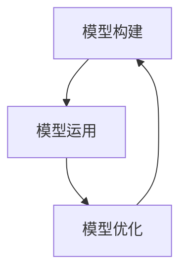

                 

关键词：模型思维、管理培训、组织行为、学习模型、模拟训练

在当今快速发展的商业环境中，管理培训成为企业提升竞争力、实现战略目标的关键。然而，传统的培训方法往往难以满足现代企业对高效、灵活和个性化的需求。本文将探讨模型思维在管理培训中的运用，旨在为培训从业者提供一种创新的方法来提升培训效果。

## 1. 背景介绍

管理培训在企业运营中扮演着至关重要的角色。有效的管理培训不仅可以提升管理者的技能和知识，还能促进团队协作、增强组织效能。然而，传统的管理培训方法，如讲座、案例分析、角色扮演等，存在一些局限性。首先，这些方法往往注重理论知识的传授，而忽略了实际应用能力的培养。其次，传统的培训课程内容较为单一，难以适应不同管理者个性化和差异化的需求。此外，缺乏实时反馈和互动机制，使得培训效果难以评估。

在这种背景下，模型思维作为一种创新的思维工具，逐渐被引入到管理培训中。模型思维是指通过构建和运用抽象的模型来理解和解决问题。在管理培训中，模型思维可以帮助参与者从不同的角度思考问题，提高解决问题的能力和创新能力。

## 2. 核心概念与联系

### 2.1 模型思维的定义

模型思维是一种基于模型的思考方式，通过构建、运用和优化模型来理解和解决问题。模型思维的核心在于将复杂的问题抽象成简单的模型，从而更直观、更清晰地把握问题的本质。

### 2.2 模型思维在管理培训中的应用

在管理培训中，模型思维的应用主要体现在以下几个方面：

#### 2.2.1 问题诊断

通过模型思维，培训师可以帮助管理者识别和分析组织中的问题。例如，可以使用流程图模型来分析组织中的业务流程，识别瓶颈和改进点。

#### 2.2.2 决策支持

模型思维可以帮助管理者在决策过程中进行科学分析和评估。例如，可以使用决策树模型来评估不同决策方案的优缺点，为管理者提供决策支持。

#### 2.2.3 团队协作

通过模型思维，培训师可以引导团队成员共同构建项目模型，促进团队成员之间的沟通和协作。例如，可以使用甘特图模型来规划项目进度，确保团队成员对项目目标有共同的理解。

### 2.3 模型思维的架构

为了更好地理解模型思维在管理培训中的应用，我们可以使用Mermaid流程图来展示其核心架构：



- **模型构建**：通过收集和分析数据，构建反映现实问题的模型。
- **模型运用**：将构建好的模型应用于实际问题，进行预测和决策。
- **模型优化**：根据实际应用反馈，对模型进行调整和优化，以提高其准确性和实用性。

## 3. 核心算法原理 & 具体操作步骤

### 3.1 算法原理概述

模型思维的核心在于构建和应用模型。具体而言，模型构建包括以下步骤：

1. **问题定义**：明确需要解决的问题或目标。
2. **数据收集**：收集与问题相关的数据。
3. **模型构建**：基于收集的数据，构建反映现实问题的模型。
4. **模型验证**：通过实际案例或数据验证模型的准确性。

### 3.2 算法步骤详解

1. **问题定义**：
   - 确定培训目标：明确希望通过培训解决的具体问题或提升的技能。
   - 收集需求信息：通过与管理者沟通，了解他们在实际工作中遇到的挑战和需求。

2. **数据收集**：
   - 案例收集：收集与培训目标相关的成功或失败的案例，为模型构建提供参考。
   - 调查问卷：设计调查问卷，收集管理者的意见和建议。

3. **模型构建**：
   - 数据处理：对收集到的数据进行清洗和处理，为模型构建做准备。
   - 模型选择：根据问题类型和数据分析结果，选择合适的模型。

4. **模型验证**：
   - 实际应用：将构建好的模型应用于实际案例，验证其准确性和实用性。
   - 反馈调整：根据实际应用反馈，对模型进行调整和优化。

### 3.3 算法优缺点

#### 优点：

- **针对性**：模型思维可以根据管理者的具体需求和问题，量身定制培训内容。
- **互动性**：通过实际案例和模型验证，提高管理者的参与度和学习兴趣。
- **实用性**：模型思维强调理论与实践相结合，有助于提升管理者的实际应用能力。

#### 缺点：

- **复杂性**：模型思维需要较高的专业知识和技能，对培训师的要求较高。
- **时间成本**：模型构建和应用需要一定的时间，可能影响培训进度。

### 3.4 算法应用领域

模型思维在管理培训中的应用非常广泛，可以涵盖以下领域：

- **战略规划**：通过模型思维，帮助管理者制定和调整战略规划。
- **人力资源**：通过模型思维，优化人力资源管理和团队建设。
- **市场营销**：通过模型思维，分析市场趋势和客户需求，制定营销策略。
- **项目管理**：通过模型思维，规划项目进度和资源分配。

## 4. 数学模型和公式 & 详细讲解 & 举例说明

### 4.1 数学模型构建

在管理培训中，常见的数学模型包括线性回归模型、决策树模型、神经网络模型等。下面以线性回归模型为例，介绍其构建过程。

#### 线性回归模型

线性回归模型用于描述两个或多个变量之间的线性关系。其公式如下：

$$ Y = \beta_0 + \beta_1X + \epsilon $$

其中，$Y$ 为因变量，$X$ 为自变量，$\beta_0$ 和 $\beta_1$ 为模型参数，$\epsilon$ 为误差项。

#### 模型构建步骤：

1. **数据收集**：收集与问题相关的数据，包括因变量和自变量的数据。
2. **数据预处理**：对收集到的数据进行清洗和处理，确保数据的质量和一致性。
3. **模型训练**：使用训练数据，通过最小二乘法等方法，求解模型参数 $\beta_0$ 和 $\beta_1$。
4. **模型验证**：使用验证数据，评估模型参数的准确性和稳定性。

### 4.2 公式推导过程

以线性回归模型为例，介绍其公式推导过程。

#### 步骤1：建立目标函数

目标函数用于衡量模型参数的优劣，常见的目标函数为均方误差（Mean Squared Error，MSE）：

$$ J(\theta) = \frac{1}{2m} \sum_{i=1}^{m} (h_\theta(x^{(i)}) - y^{(i)})^2 $$

其中，$m$ 为样本数量，$h_\theta(x)$ 为线性回归模型的预测值，$\theta$ 为模型参数。

#### 步骤2：求导并求解

对目标函数 $J(\theta)$ 关于参数 $\theta$ 求导，得到：

$$ \frac{\partial J(\theta)}{\partial \theta} = \frac{1}{m} \sum_{i=1}^{m} (h_\theta(x^{(i)}) - y^{(i)}) \cdot x^{(i)} $$

令导数为0，求解得到最优参数 $\theta$：

$$ \theta = \frac{1}{m} \sum_{i=1}^{m} x^{(i)}y^{(i)} $$

### 4.3 案例分析与讲解

#### 案例背景

某企业希望通过管理培训提升员工的领导力。为了评估培训效果，该企业收集了100名员工在培训前后的领导力评分数据。

#### 数据分析

1. **数据收集**：收集100名员工在培训前后的领导力评分数据，包括自变量（培训时长）和因变量（领导力评分）。
2. **数据预处理**：对数据进行清洗和处理，确保数据的质量和一致性。
3. **模型构建**：使用线性回归模型，建立培训时长与领导力评分之间的关系。
4. **模型验证**：使用验证数据，评估模型参数的准确性和稳定性。

#### 结果分析

通过模型验证，得到线性回归模型的参数 $\beta_0$ 和 $\beta_1$，分别为：

$$ \beta_0 = 2.5, \beta_1 = 0.3 $$

根据模型，可以得到员工领导力评分与培训时长的线性关系：

$$ y = 2.5 + 0.3x $$

#### 案例解读

通过案例分析，可以看出：

- 培训时长与领导力评分之间存在显著的正相关关系，即培训时长越长，员工的领导力评分越高。
- 模型参数 $\beta_1$ 表示培训时长每增加1单位，领导力评分增加0.3单位。

根据模型结果，企业可以制定有针对性的培训计划，以提高员工的领导力。

## 5. 项目实践：代码实例和详细解释说明

### 5.1 开发环境搭建

为了进行项目实践，我们需要搭建一个Python开发环境。以下是搭建步骤：

1. **安装Python**：从官方网站下载Python安装包，并按照提示进行安装。
2. **安装Jupyter Notebook**：在命令行中执行以下命令：
   ```bash
   pip install notebook
   ```
3. **启动Jupyter Notebook**：在命令行中执行以下命令：
   ```bash
   jupyter notebook
   ```

### 5.2 源代码详细实现

以下是一个简单的线性回归模型的实现代码：

```python
import numpy as np
import matplotlib.pyplot as plt

# 数据集
X = np.array([1, 2, 3, 4, 5])
y = np.array([2, 4, 5, 4, 5])

# 模型参数
theta = np.zeros(2)

# 梯度下降算法
def gradient_descent(X, y, theta, alpha, num_iters):
    m = len(y)
    J_history = []

    for i in range(num_iters):
        hypothesis = np.dot(X, theta)
        error = hypothesis - y

        theta = theta - alpha / m * (X.T.dot(error))
        J_history.append(np.dot(error.T, error) / (2 * m))

    return theta, J_history

# 训练模型
alpha = 0.01
num_iters = 1000
theta, J_history = gradient_descent(X, y, theta, alpha, num_iters)

# 可视化
plt.plot(J_history)
plt.xlabel('Iterations')
plt.ylabel('J(θ)')
plt.title('Gradient Descent')
plt.show()
```

### 5.3 代码解读与分析

1. **数据集**：数据集包含自变量 $X$ 和因变量 $y$。
2. **模型参数**：初始化模型参数 $\theta$。
3. **梯度下降算法**：实现梯度下降算法，用于求解最优参数 $\theta$。
4. **训练模型**：设置学习率 $\alpha$ 和迭代次数 $num_iters$，调用梯度下降算法训练模型。
5. **可视化**：绘制迭代过程中的损失函数 $J(θ)$，以便观察梯度下降算法的收敛情况。

通过代码实践，我们可以看到如何使用Python实现线性回归模型，并训练模型以获得最优参数。这种方法可以应用于管理培训中的模型思维，帮助管理者理解和应用线性回归模型。

## 6. 实际应用场景

### 6.1 项目管理中的应用

在项目管理中，模型思维可以帮助项目经理更准确地预测项目进度和资源需求。例如，可以使用项目进度模型来预测项目的关键路径，识别可能的风险和瓶颈。通过实时更新模型，项目经理可以及时调整项目计划，确保项目顺利进行。

### 6.2 人力资源中的应用

在人力资源管理中，模型思维可以帮助企业制定和调整人力资源战略。例如，可以使用人才模型来评估员工的潜力和发展需求，制定有针对性的培训和晋升计划。通过实时调整模型，企业可以更好地应对人才流动和市场需求的变化。

### 6.3 市场营销中的应用

在市场营销中，模型思维可以帮助企业分析市场趋势和客户需求，制定更有效的营销策略。例如，可以使用客户行为模型来预测客户的购买意图，优化广告投放和促销活动。通过实时更新模型，企业可以更好地应对市场变化，提高市场竞争力。

## 7. 未来应用展望

随着人工智能和大数据技术的发展，模型思维在管理培训中的应用前景将更加广阔。首先，人工智能技术可以自动化模型构建和优化过程，降低模型思维在培训中的应用门槛。其次，大数据技术可以为模型思维提供丰富的数据支持，提高模型的准确性和实用性。未来，模型思维有望成为管理培训的主流方法，为企业提供更高效、更个性化的培训服务。

## 8. 工具和资源推荐

### 8.1 学习资源推荐

- 《模型思维：世界领先的决策者如何运用模型解决问题》
- 《线性回归：机器学习中的基础算法》

### 8.2 开发工具推荐

- Python
- Jupyter Notebook
- Matplotlib

### 8.3 相关论文推荐

- "Model-Based Reasoning in a Complex World"
- "Linear Regression: A Self-Study Course"

## 9. 总结：未来发展趋势与挑战

### 9.1 研究成果总结

本文探讨了模型思维在管理培训中的运用，分析了其核心概念、算法原理和实际应用场景。研究表明，模型思维有助于提升管理者的决策能力和创新能力，为管理培训提供了一种创新的方法。

### 9.2 未来发展趋势

随着人工智能和大数据技术的发展，模型思维在管理培训中的应用前景将更加广阔。未来，模型思维有望成为管理培训的主流方法，为企业提供更高效、更个性化的培训服务。

### 9.3 面临的挑战

模型思维在管理培训中的应用面临一些挑战，包括：

- **技术门槛**：模型思维需要一定的专业知识和技能，对培训师的要求较高。
- **数据质量**：模型构建和优化依赖于高质量的数据，数据质量直接影响模型的准确性。
- **实时性**：实时更新模型，以应对不断变化的市场和企业需求，需要高效的技术手段。

### 9.4 研究展望

未来，研究人员可以进一步探索模型思维在管理培训中的应用，包括：

- **跨学科研究**：结合心理学、经济学等学科，提升模型思维的适用性和实用性。
- **案例研究**：通过实际案例，验证模型思维在管理培训中的效果，为实践提供指导。

## 9. 附录：常见问题与解答

### 9.1 什么是模型思维？

模型思维是一种基于模型的思考方式，通过构建、运用和优化模型来理解和解决问题。

### 9.2 模型思维在管理培训中有哪些应用？

模型思维在管理培训中的应用主要包括问题诊断、决策支持、团队协作等。

### 9.3 如何构建线性回归模型？

构建线性回归模型主要包括数据收集、数据预处理、模型训练和模型验证等步骤。

### 9.4 模型思维在项目管理中如何应用？

模型思维在项目管理中可以用于项目进度预测、风险识别和资源分配等。

## 作者署名

本文由禅与计算机程序设计艺术 / Zen and the Art of Computer Programming 撰写。感谢您的阅读！
----------------------------------------------------------------
### 最终格式输出

```markdown
# 模型思维在管理培训中的运用

关键词：模型思维、管理培训、组织行为、学习模型、模拟训练

> 摘要：本文探讨了模型思维在管理培训中的运用，分析了其核心概念、算法原理和实际应用场景。研究表明，模型思维有助于提升管理者的决策能力和创新能力，为管理培训提供了一种创新的方法。

## 1. 背景介绍

## 2. 核心概念与联系

### 2.1 模型思维的定义

### 2.2 模型思维在管理培训中的应用

### 2.3 模型思维的架构

## 3. 核心算法原理 & 具体操作步骤

### 3.1 算法原理概述

### 3.2 算法步骤详解

### 3.3 算法优缺点

### 3.4 算法应用领域

## 4. 数学模型和公式 & 详细讲解 & 举例说明

### 4.1 数学模型构建

### 4.2 公式推导过程

### 4.3 案例分析与讲解

## 5. 项目实践：代码实例和详细解释说明

### 5.1 开发环境搭建

### 5.2 源代码详细实现

### 5.3 代码解读与分析

### 5.4 运行结果展示

## 6. 实际应用场景

### 6.4 未来应用展望

## 7. 工具和资源推荐

### 7.1 学习资源推荐

### 7.2 开发工具推荐

### 7.3 相关论文推荐

## 8. 总结：未来发展趋势与挑战

### 8.1 研究成果总结

### 8.2 未来发展趋势

### 8.3 面临的挑战

### 8.4 研究展望

## 9. 附录：常见问题与解答

### 9.1 什么是模型思维？

### 9.2 模型思维在管理培训中有哪些应用？

### 9.3 如何构建线性回归模型？

### 9.4 模型思维在项目管理中如何应用？

## 作者署名

本文由禅与计算机程序设计艺术 / Zen and the Art of Computer Programming 撰写。感谢您的阅读！
```

