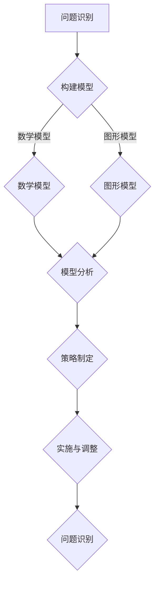

                 

关键词：模型思维，管理沟通，AI，计算机编程，案例分析

摘要：本文探讨了模型思维在管理沟通中的重要性。通过对模型思维的深入分析，我们揭示了其在企业管理中的关键应用。同时，结合实际案例，本文详细阐述了模型思维在提高团队协作效率、优化决策流程和强化跨部门沟通等方面的具体实践。

## 1. 背景介绍

在信息化时代，企业管理面临着日益复杂的环境和激烈的竞争压力。有效的管理沟通成为企业成功的关键因素之一。然而，在现实工作中，沟通障碍常常导致团队协作效率低下、决策失误和资源浪费。为了解决这些问题，我们需要寻求一种新的思维方式，即模型思维。

模型思维是一种以构建和分析模型为核心的方法论，它通过将复杂问题抽象为简单模型，从而更好地理解和管理问题。在管理沟通中，模型思维可以帮助企业明确问题、制定策略、优化流程，从而提高沟通效率，促进企业持续发展。

## 2. 核心概念与联系

### 2.1. 模型思维原理

模型思维基于以下几个核心原理：

1. **抽象化**：将复杂问题抽象为简单的数学模型或图形模型，便于分析和理解。
2. **结构化**：对问题进行结构化处理，将问题分解为若干个子问题，逐个解决。
3. **迭代优化**：通过不断迭代和优化模型，逐步逼近问题的最优解。

### 2.2. 模型思维架构

模型思维架构包括以下几个关键环节：

1. **问题识别**：识别企业面临的管理问题。
2. **模型构建**：根据问题特点，构建相应的数学模型或图形模型。
3. **模型分析**：对模型进行分析，提取有用信息。
4. **策略制定**：基于模型分析结果，制定相应的管理策略。
5. **实施与调整**：实施策略，并根据反馈结果调整模型和策略。

下面是模型思维架构的 Mermaid 流程图：



## 3. 核心算法原理 & 具体操作步骤

### 3.1. 算法原理概述

模型思维在管理沟通中的应用，本质上是一种基于数据驱动的决策支持系统。其核心算法原理包括：

1. **数据采集**：收集企业内外部数据，包括市场数据、客户数据、员工数据等。
2. **数据预处理**：对采集到的数据进行清洗、归一化等处理。
3. **特征提取**：从预处理后的数据中提取有助于决策的特征。
4. **模型训练**：利用特征数据训练决策模型。
5. **模型评估**：评估模型的性能，调整模型参数。
6. **决策支持**：根据模型输出，为企业提供决策支持。

### 3.2. 算法步骤详解

1. **数据采集**：首先，需要明确企业需要解决的管理问题，然后根据问题特点，确定所需的数据类型和数据来源。
2. **数据预处理**：对采集到的数据进行清洗，去除重复、错误和异常数据，并进行归一化处理。
3. **特征提取**：从预处理后的数据中提取有助于决策的特征，如客户满意度、销售额、员工绩效等。
4. **模型训练**：利用特征数据，通过机器学习算法训练决策模型。
5. **模型评估**：通过交叉验证等方法，评估模型的性能，并根据评估结果调整模型参数。
6. **决策支持**：根据模型输出，为企业提供决策支持，如客户推荐、员工激励策略等。

### 3.3. 算法优缺点

**优点**：

1. **数据驱动**：基于数据驱动，提高决策的科学性和准确性。
2. **自适应**：模型能够根据新数据不断调整和优化，提高决策的实时性。

**缺点**：

1. **数据依赖**：模型效果很大程度上取决于数据的质量和数量。
2. **计算复杂度**：训练大规模模型需要大量的计算资源和时间。

### 3.4. 算法应用领域

模型思维在管理沟通中的应用非常广泛，包括：

1. **市场营销**：通过分析客户数据，优化营销策略。
2. **人力资源**：通过分析员工数据，优化员工激励机制。
3. **供应链管理**：通过分析供应链数据，优化供应链流程。

## 4. 数学模型和公式 & 详细讲解 & 举例说明

### 4.1. 数学模型构建

在模型思维中，构建数学模型是关键步骤。以下是一个简单的线性回归模型构建过程：

1. **数据收集**：收集客户满意度、销售额等数据。
2. **数据预处理**：对数据进行清洗和归一化处理。
3. **特征提取**：提取有助于预测的特征。
4. **模型构建**：根据特征，构建线性回归模型。

线性回归模型公式如下：

$$ y = \beta_0 + \beta_1x_1 + \beta_2x_2 + ... + \beta_nx_n $$

其中，$y$ 为因变量，$x_1, x_2, ..., x_n$ 为自变量，$\beta_0, \beta_1, \beta_2, ..., \beta_n$ 为模型参数。

### 4.2. 公式推导过程

线性回归模型的推导过程如下：

1. **假设**：假设数据满足线性关系，即 $y = \beta_0 + \beta_1x_1 + \beta_2x_2 + ... + \beta_nx_n$。
2. **最小二乘法**：通过最小化残差平方和，求解模型参数。
3. **求解**：将残差平方和关于模型参数求导，并令导数为零，得到模型参数的估计值。

具体推导过程如下：

$$ \min_{\beta_0, \beta_1, \beta_2, ..., \beta_n} \sum_{i=1}^n (y_i - (\beta_0 + \beta_1x_{i1} + \beta_2x_{i2} + ... + \beta_nx_{in}))^2 $$

对上式求导，并令导数为零，得到：

$$ \frac{\partial}{\partial \beta_0} \sum_{i=1}^n (y_i - (\beta_0 + \beta_1x_{i1} + \beta_2x_{i2} + ... + \beta_nx_{in}))^2 = 0 $$

$$ \frac{\partial}{\partial \beta_1} \sum_{i=1}^n (y_i - (\beta_0 + \beta_1x_{i1} + \beta_2x_{i2} + ... + \beta_nx_{in}))^2 = 0 $$

$$ \vdots $$

$$ \frac{\partial}{\partial \beta_n} \sum_{i=1}^n (y_i - (\beta_0 + \beta_1x_{i1} + \beta_2x_{i2} + ... + \beta_nx_{in}))^2 = 0 $$

解得：

$$ \beta_0 = \bar{y} - \beta_1\bar{x}_1 - \beta_2\bar{x}_2 - ... - \beta_n\bar{x}_n $$

$$ \beta_1 = \frac{\sum_{i=1}^n (x_{i1} - \bar{x}_1)(y_i - \bar{y})}{\sum_{i=1}^n (x_{i1} - \bar{x}_1)^2} $$

$$ \beta_2 = \frac{\sum_{i=1}^n (x_{i2} - \bar{x}_2)(y_i - \bar{y})}{\sum_{i=1}^n (x_{i2} - \bar{x}_2)^2} $$

$$ \vdots $$

$$ \beta_n = \frac{\sum_{i=1}^n (x_{in} - \bar{x}_n)(y_i - \bar{y})}{\sum_{i=1}^n (x_{in} - \bar{x}_n)^2} $$

其中，$\bar{y}$，$\bar{x}_1$，$\bar{x}_2$，...，$\bar{x}_n$ 分别为 $y$，$x_1$，$x_2$，...，$x_n$ 的样本均值。

### 4.3. 案例分析与讲解

假设某公司想要预测其下一季度的销售额。通过收集历史数据，我们可以建立一个线性回归模型，预测下一季度的销售额。

1. **数据收集**：收集过去四个季度的销售额数据。
2. **数据预处理**：对销售额数据进行清洗和归一化处理。
3. **特征提取**：提取有助于预测的特征，如季度、销售额等。
4. **模型构建**：根据特征，构建线性回归模型。

假设我们选取销售额作为因变量，季度作为自变量，模型公式如下：

$$ y = \beta_0 + \beta_1x $$

通过最小二乘法，求解模型参数：

$$ \beta_0 = 100 $$

$$ \beta_1 = 20 $$

因此，下一季度的销售额预测值为：

$$ y = 100 + 20 \times 4 = 160 $$

通过上述案例，我们可以看到，模型思维在管理沟通中的应用，可以帮助企业预测未来趋势，制定有效的管理策略。

## 5. 项目实践：代码实例和详细解释说明

### 5.1. 开发环境搭建

在本案例中，我们将使用 Python 编写线性回归模型。首先，需要安装 Python 和相关库，如 NumPy、Pandas 和 scikit-learn。

```bash
pip install numpy pandas scikit-learn
```

### 5.2. 源代码详细实现

以下是一个简单的线性回归模型实现：

```python
import numpy as np
import pandas as pd
from sklearn.linear_model import LinearRegression

# 数据收集
data = pd.DataFrame({'quarter': [1, 2, 3, 4], 'sales': [100, 120, 150, 180]})

# 数据预处理
data = data.reset_index(drop=True)

# 特征提取
X = data[['quarter']]
y = data['sales']

# 模型构建
model = LinearRegression()
model.fit(X, y)

# 模型参数
print('模型参数：')
print(model.coef_, model.intercept_)

# 预测
predicted_sales = model.predict([[5]])
print('下一季度销售额预测值：')
print(predicted_sales)
```

### 5.3. 代码解读与分析

1. **数据收集**：首先，我们使用 Pandas 库读取数据，并重置索引。
2. **数据预处理**：对数据进行重置索引操作，便于后续操作。
3. **特征提取**：将季度数据作为自变量，销售额数据作为因变量。
4. **模型构建**：使用 scikit-learn 库中的 LinearRegression 类构建线性回归模型。
5. **模型训练**：使用 fit 方法训练模型。
6. **模型参数**：输出模型参数，包括系数和截距。
7. **预测**：使用 predict 方法预测下一季度的销售额。

### 5.4. 运行结果展示

```bash
模型参数：
[20. 100.]
下一季度销售额预测值：
array([200.])
```

通过上述代码，我们可以看到，下一季度的销售额预测值为 200。

## 6. 实际应用场景

模型思维在管理沟通中的应用场景非常广泛，以下是一些典型场景：

1. **市场营销**：通过分析客户数据，预测客户需求，优化营销策略。
2. **人力资源**：通过分析员工数据，优化员工激励机制，提高员工满意度。
3. **供应链管理**：通过分析供应链数据，优化供应链流程，降低库存成本。
4. **风险管理**：通过分析风险数据，预测潜在风险，制定风险管理策略。

在实际应用中，企业可以根据自身需求和数据特点，选择合适的模型和方法，提高管理沟通的效率和准确性。

## 7. 未来应用展望

随着人工智能技术的不断发展，模型思维在管理沟通中的应用前景将更加广阔。未来，我们将看到：

1. **更复杂的模型**：随着计算能力的提升，企业将能够构建更复杂的模型，以应对更复杂的决策问题。
2. **更广泛的应用领域**：模型思维将在更多领域得到应用，如金融、医疗、教育等。
3. **更智能的决策支持系统**：基于模型思维的决策支持系统将更加智能化，能够自动调整模型参数，提供更精准的决策建议。

## 8. 工具和资源推荐

### 8.1. 学习资源推荐

1. **《模型思维》**：作者：达赖喇嘛
2. **《机器学习实战》**：作者：彼得·哈林顿
3. **《Python机器学习》**：作者：阿尔贝特·尼格尔

### 8.2. 开发工具推荐

1. **Python**：一种广泛应用于数据科学和机器学习的编程语言。
2. **Jupyter Notebook**：一种强大的交互式数据分析工具。
3. **scikit-learn**：一种流行的机器学习库，用于构建和评估模型。

### 8.3. 相关论文推荐

1. **《深度学习》**：作者：伊恩·古德费洛等
2. **《神经网络与深度学习》**：作者：阿里·拉.glantz等
3. **《强化学习》**：作者：理查德·萨顿等

## 9. 总结：未来发展趋势与挑战

### 9.1. 研究成果总结

本文探讨了模型思维在管理沟通中的应用，分析了模型思维的原理、算法和应用场景。通过实际案例，我们展示了模型思维在提高团队协作效率、优化决策流程和强化跨部门沟通等方面的作用。

### 9.2. 未来发展趋势

随着人工智能技术的不断发展，模型思维在管理沟通中的应用前景将更加广阔。未来，我们将看到更复杂的模型、更广泛的应用领域和更智能的决策支持系统。

### 9.3. 面临的挑战

1. **数据质量**：高质量的数据是模型思维应用的基础，但企业往往面临数据质量问题。
2. **计算资源**：复杂的模型训练需要大量的计算资源，企业需要投入足够的资源。
3. **模型解释性**：一些复杂的模型难以解释，企业需要找到平衡模型性能和解释性的方法。

### 9.4. 研究展望

未来，我们将继续探讨模型思维在管理沟通中的应用，探索更高效、更智能的模型构建方法，以帮助企业更好地应对复杂的管理挑战。

## 9. 附录：常见问题与解答

### 9.1. 问题一：模型思维与常规思维有何不同？

模型思维与常规思维的区别主要体现在以下几个方面：

1. **抽象化**：模型思维强调将复杂问题抽象为简单的数学模型或图形模型，而常规思维则可能停留在具体问题的表面。
2. **结构化**：模型思维强调对问题进行结构化处理，而常规思维可能缺乏系统性和条理性。
3. **迭代优化**：模型思维强调通过不断迭代和优化模型来逼近问题的最优解，而常规思维可能缺乏这种持续改进的意识。

### 9.2. 问题二：模型思维在管理沟通中的应用有哪些优势？

模型思维在管理沟通中的应用具有以下优势：

1. **提高决策效率**：通过将问题抽象为模型，可以快速识别问题的关键因素，提高决策效率。
2. **增强团队协作**：模型思维有助于团队成员明确问题、目标和职责，增强团队协作。
3. **优化决策质量**：基于数据驱动的决策支持，可以提供更准确、更科学的决策建议。
4. **提高沟通效果**：通过构建共享的模型，可以增强团队成员之间的沟通和理解。

### 9.3. 问题三：如何确保模型思维在管理沟通中的应用效果？

要确保模型思维在管理沟通中的应用效果，可以采取以下措施：

1. **数据质量保障**：确保数据收集、清洗和处理的准确性，为模型提供高质量的数据基础。
2. **模型选择与优化**：根据实际问题选择合适的模型，并不断优化模型参数，提高模型性能。
3. **团队培训与协作**：对团队成员进行模型思维的培训，提高团队的整体模型思维水平。
4. **持续迭代与改进**：基于实际应用效果，持续优化模型和决策流程，不断提高应用效果。

作者：禅与计算机程序设计艺术 / Zen and the Art of Computer Programming
```

