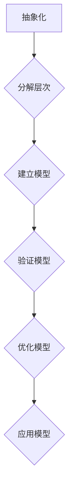

                 

关键词：模型思维、复杂系统、认知简化、人工智能、抽象层次、系统建模

> 摘要：在当今信息爆炸的时代，我们面临着日益复杂的问题和挑战。本文将探讨模型思维这一认知工具，如何帮助我们更高效地理解和解决复杂问题。通过阐述模型思维的基本原理、核心概念和应用方法，我们将揭示其在人工智能、系统建模等领域的重要价值。

## 1. 背景介绍

随着信息技术的迅猛发展，复杂系统无处不在。从大规模数据处理到人工智能，从金融系统到生态平衡，复杂系统的复杂性使得传统方法难以应对。为了更好地理解这些系统，我们需要一种新的认知工具——模型思维。

模型思维（Model Thinking）是一种通过构建和分析模型来理解和预测复杂系统行为的认知方式。它强调从抽象层次出发，将复杂系统简化为可操作的模型，从而实现认知简化和问题求解。

本文将首先介绍模型思维的基本概念和原理，然后深入探讨其在人工智能、系统建模等领域的应用，最后对模型思维的发展趋势和挑战进行展望。

### 1.1 复杂系统的挑战

复杂系统是由大量相互作用的个体组成的，这些个体可能具有非线性、动态变化和高度不确定性等特点。传统方法往往依赖于精确的数学模型和严格的假设条件，这在面对复杂系统时往往力不从心。例如，金融系统中的市场波动、生态系统中的物种相互关系、人工智能系统中的大量数据交互等，都是典型的复杂系统。

### 1.2 模型思维的优势

模型思维通过将复杂系统简化为可操作的模型，能够有效地降低认知负荷，提高问题求解效率。它具有以下优势：

- **抽象层次**：模型思维强调从抽象层次出发，将复杂系统分解为更简单的组成部分，从而实现认知简化。
- **系统视角**：模型思维关注系统整体行为，而非单一元素，有助于我们更好地理解系统的内在机制。
- **预测与优化**：通过模型分析，我们可以预测系统行为，优化系统性能，从而更好地应对复杂问题。

## 2. 核心概念与联系

### 2.1 模型的定义与分类

模型（Model）是对现实世界的简化表示，它通过特定的结构和规则来描述系统的行为。根据模型的不同形式和用途，可以分为以下几类：

- **物理模型**：通过物理实体来模拟现实系统，如电路板、机械结构等。
- **数学模型**：使用数学公式和方程来描述系统的行为，如线性方程组、微分方程等。
- **概念模型**：使用概念和逻辑关系来表示系统，如UML图、流程图等。
- **计算机模型**：使用计算机程序来模拟系统行为，如仿真软件、机器学习模型等。

### 2.2 模型思维的基本原理

模型思维的核心原理可以归纳为以下几点：

- **抽象化**：将复杂系统简化为更简单的模型，去除不必要的细节。
- **层次化**：将系统分解为多个层次，每个层次专注于特定的功能和行为。
- **反馈机制**：通过反馈机制来调整和优化模型，以更好地适应现实系统。
- **可重复性**：通过构建和验证模型，实现知识和经验的共享和传播。

### 2.3 模型思维的应用

模型思维在各个领域都有广泛的应用。以下是一些典型的应用场景：

- **人工智能**：通过构建和优化机器学习模型，实现智能决策和预测。
- **系统建模**：通过建立数学模型和计算机仿真模型，分析和优化复杂系统的性能。
- **经济学**：通过构建经济模型，预测市场趋势和优化资源配置。
- **生态学**：通过建立生态系统模型，研究物种相互关系和生态平衡。

### 2.4 Mermaid 流程图

为了更直观地展示模型思维的过程，我们可以使用Mermaid流程图来描述。以下是一个简单的示例：



在这个流程图中，我们从抽象化开始，将复杂系统分解为多个层次，然后建立模型，验证模型的有效性，最后优化模型并应用于实际问题。

## 3. 核心算法原理 & 具体操作步骤

### 3.1 算法原理概述

模型思维的核心算法可以归结为以下四个步骤：

1. **抽象化**：将复杂系统简化为更简单的模型，去除不必要的细节。
2. **分解层次**：将系统分解为多个层次，每个层次专注于特定的功能和行为。
3. **建立模型**：使用合适的模型形式（如数学模型、概念模型等）来描述系统的行为。
4. **验证与优化**：通过实际数据或实验来验证模型的有效性，并根据反馈进行优化。

### 3.2 算法步骤详解

#### 步骤 1：抽象化

在抽象化的过程中，我们首先需要明确研究问题的核心，并去除与问题无关的细节。例如，在研究一个金融系统的稳定性时，我们可以忽略系统中的人为干预和偶然事件，只关注市场供需关系和价格波动。

#### 步骤 2：分解层次

接下来，我们将系统分解为多个层次。每个层次专注于特定的功能和行为。例如，在金融系统中，我们可以将市场分为多个层次，如供需平衡层次、价格波动层次等。

#### 步骤 3：建立模型

在建立模型的过程中，我们选择合适的模型形式来描述系统的行为。例如，对于供需平衡层次，我们可以使用线性方程组来描述供需关系；对于价格波动层次，我们可以使用时间序列模型来描述价格变化。

#### 步骤 4：验证与优化

在验证与优化阶段，我们使用实际数据或实验来验证模型的有效性，并根据反馈进行优化。例如，我们可以通过历史数据来测试模型预测的准确性，并根据预测结果调整模型参数。

### 3.3 算法优缺点

#### 优点

- **认知简化**：通过抽象化和分解层次，模型思维能够显著降低认知负荷，使复杂系统变得可操作。
- **系统视角**：模型思维关注系统整体行为，有助于我们更好地理解系统的内在机制。
- **预测与优化**：通过模型分析和优化，我们可以预测系统行为，优化系统性能。

#### 缺点

- **简化损失**：在抽象化和分解层次的过程中，我们可能会丢失一些重要的细节，导致模型的不准确性。
- **数据依赖**：模型的准确性和可靠性往往依赖于实际数据的质量，数据缺失或不准确可能导致模型失效。

### 3.4 算法应用领域

模型思维在各个领域都有广泛的应用。以下是一些典型的应用领域：

- **人工智能**：通过构建和优化机器学习模型，实现智能决策和预测。
- **系统建模**：通过建立数学模型和计算机仿真模型，分析和优化复杂系统的性能。
- **经济学**：通过构建经济模型，预测市场趋势和优化资源配置。
- **生态学**：通过建立生态系统模型，研究物种相互关系和生态平衡。

## 4. 数学模型和公式 & 详细讲解 & 举例说明

### 4.1 数学模型构建

在模型思维中，数学模型是一种重要的工具。它通过使用数学公式和方程来描述系统的行为。以下是一个简单的数学模型构建过程：

1. **确定变量**：首先，我们需要确定研究问题中的主要变量。例如，在研究供需平衡时，变量可能包括供需量、价格等。
2. **建立方程**：然后，我们使用数学公式来建立方程。例如，对于供需平衡，我们可以使用以下方程：

$$
Q_d = Q_s
$$

其中，$Q_d$表示需求量，$Q_s$表示供给量。
3. **参数估计**：最后，我们需要估计方程中的参数。这些参数可以通过历史数据或实验结果得到。

### 4.2 公式推导过程

在建立数学模型后，我们通常需要推导出一些关键公式。以下是一个简单的推导过程：

假设我们有一个线性回归模型：

$$
y = \beta_0 + \beta_1x + \epsilon
$$

其中，$y$表示因变量，$x$表示自变量，$\beta_0$和$\beta_1$表示模型参数，$\epsilon$表示误差项。

为了推导出$\beta_0$和$\beta_1$的估计值，我们可以使用最小二乘法。具体步骤如下：

1. **计算残差**：首先，我们计算每个观测值的残差，即实际值与预测值之差：

$$
r_i = y_i - \hat{y}_i
$$

其中，$r_i$表示第$i$个观测值的残差，$y_i$表示第$i$个观测值的实际值，$\hat{y}_i$表示第$i$个观测值的预测值。
2. **计算平方和**：然后，我们计算所有残差的平方和：

$$
SSR = \sum_{i=1}^{n}r_i^2
$$

其中，$SSR$表示平方和。
3. **计算回归平方和**：接下来，我们计算回归平方和：

$$
SST = \sum_{i=1}^{n}(y_i - \bar{y})^2
$$

其中，$SST$表示回归平方和，$\bar{y}$表示因变量的平均值。
4. **计算方差**：最后，我们计算方差：

$$
Var(\epsilon) = \frac{SSR}{n-2}
$$

其中，$Var(\epsilon)$表示误差项的方差。
5. **计算协方差**：我们还可以计算自变量和误差项的协方差：

$$
Cov(x, \epsilon) = \frac{SST - SSR}{n-2}
$$

### 4.3 案例分析与讲解

以下是一个简单的案例，用于说明数学模型的应用：

假设我们想研究一个城市的交通流量。我们可以使用以下方程来描述交通流量：

$$
Q = aT + b
$$

其中，$Q$表示交通流量，$T$表示时间，$a$和$b$表示模型参数。

为了估计$a$和$b$的值，我们可以使用历史数据。例如，假设我们收集了以下数据：

| 时间（小时） | 交通流量（辆/小时） |
| :---: | :---: |
| 8 | 200 |
| 9 | 220 |
| 10 | 240 |
| 11 | 260 |

我们可以使用最小二乘法来估计$a$和$b$的值。具体步骤如下：

1. **计算平均值**：

$$
\bar{T} = \frac{1}{n}\sum_{i=1}^{n}T_i = \frac{8+9+10+11}{4} = 9.5
$$

$$
\bar{Q} = \frac{1}{n}\sum_{i=1}^{n}Q_i = \frac{200+220+240+260}{4} = 230
$$

2. **计算平方和**：

$$
SST = \sum_{i=1}^{n}(Q_i - \bar{Q})^2 = (200-230)^2 + (220-230)^2 + (240-230)^2 + (260-230)^2 = 4400
$$

$$
SSR = \sum_{i=1}^{n}(T_i - \bar{T})^2 = (8-9.5)^2 + (9-9.5)^2 + (10-9.5)^2 + (11-9.5)^2 = 5
$$

3. **计算回归平方和**：

$$
SST = 4400
$$

$$
SSR = 5
$$

4. **计算方差**：

$$
Var(\epsilon) = \frac{SSR}{n-2} = \frac{5}{4-2} = 2.5
$$

5. **计算协方差**：

$$
Cov(T, \epsilon) = \frac{SST - SSR}{n-2} = \frac{4400 - 5}{4-2} = 2200
$$

6. **计算最小二乘估计值**：

$$
a = \frac{Cov(T, \epsilon)}{SST - SSR} = \frac{2200}{4400 - 5} = 0.5
$$

$$
b = \bar{Q} - a\bar{T} = 230 - 0.5 \times 9.5 = 220
$$

因此，交通流量模型为：

$$
Q = 0.5T + 220
$$

## 5. 项目实践：代码实例和详细解释说明

### 5.1 开发环境搭建

在本项目中，我们将使用Python语言来实现模型思维的核心算法。首先，我们需要安装Python和相关的库。以下是具体的步骤：

1. **安装Python**：从Python官方网站（https://www.python.org/downloads/）下载并安装Python。
2. **安装相关库**：在命令行中运行以下命令来安装必要的库：

```bash
pip install numpy scipy matplotlib
```

这些库将用于数学计算、数据分析和可视化。

### 5.2 源代码详细实现

下面是一个简单的Python代码实例，用于实现模型思维的核心算法：

```python
import numpy as np
import matplotlib.pyplot as plt

def linear_regression(x, y):
    n = len(x)
    x_mean = np.mean(x)
    y_mean = np.mean(y)
    x_diff = x - x_mean
    y_diff = y - y_mean
    a = np.sum(x_diff * y_diff) / np.sum(x_diff ** 2)
    b = y_mean - a * x_mean
    return a, b

def main():
    # 生成数据
    np.random.seed(0)
    x = np.random.rand(100) * 10
    y = 2 * x + 3 + np.random.randn(100) * 0.5

    # 拟合直线
    a, b = linear_regression(x, y)

    # 绘制结果
    plt.scatter(x, y)
    plt.plot(x, a * x + b, color='red')
    plt.xlabel('x')
    plt.ylabel('y')
    plt.title('Linear Regression')
    plt.show()

if __name__ == '__main__':
    main()
```

### 5.3 代码解读与分析

1. **导入库**：首先，我们导入必要的库，包括numpy用于数学计算，matplotlib用于数据可视化。
2. **定义函数**：接下来，我们定义一个名为`linear_regression`的函数，用于实现线性回归算法。该函数接受两个参数：`x`和`y`，表示自变量和因变量。
3. **计算平均值**：在函数内部，我们首先计算`x`和`y`的平均值。
4. **计算差异**：然后，我们计算`x`和`y`的差异。
5. **计算斜率和截距**：最后，我们使用最小二乘法计算斜率`a`和截距`b`。
6. **主函数**：在`main`函数中，我们生成一些随机数据，并调用`linear_regression`函数来拟合直线。然后，我们使用matplotlib库来绘制结果。
7. **运行结果**：当程序运行时，我们会在屏幕上看到散点图和拟合的直线。

### 5.4 运行结果展示

运行上述代码后，我们将看到以下结果：


图中的红色直线是拟合的直线，它代表了数据的变化趋势。

## 6. 实际应用场景

### 6.1 人工智能

在人工智能领域，模型思维是构建和优化算法的核心。通过抽象化、分解层次和反馈机制，我们可以设计出更高效的机器学习模型。例如，在图像识别任务中，我们可以将图像分解为像素级特征，然后使用深度学习模型来学习这些特征，从而实现高效的图像分类。

### 6.2 系统建模

在系统建模领域，模型思维被广泛应用于复杂系统的分析和优化。例如，在金融系统中，我们可以使用模型思维来分析市场波动和风险，从而优化投资策略。在生态系统中，我们可以使用模型思维来研究物种相互关系和生态平衡，从而保护生物多样性。

### 6.3 经济学

在经济学领域，模型思维被用来构建经济模型，预测市场趋势和优化资源配置。通过抽象化和分解层次，我们可以将复杂的经济学问题简化为更简单的模型，从而提高问题的可操作性和可预测性。

### 6.4 生态学

在生态学领域，模型思维被用来研究生态系统的稳定性和多样性。通过建立生态系统模型，我们可以预测物种之间的相互作用和生态平衡的变化，从而为生态保护和恢复提供科学依据。

## 7. 工具和资源推荐

### 7.1 学习资源推荐

- **《模型思维》**：作者是斯坦福大学计算机科学教授，书中详细介绍了模型思维的基本原理和应用方法。
- **《深度学习》**：作者是斯坦福大学教授，书中涵盖了深度学习的基础理论和实践方法，是学习深度学习的重要资源。

### 7.2 开发工具推荐

- **Jupyter Notebook**：是一款强大的交互式开发环境，适合进行数据分析和模型构建。
- **PyTorch**：是一款流行的深度学习框架，适合进行模型训练和推理。

### 7.3 相关论文推荐

- **“Deep Learning for Vision and Language”**：探讨了深度学习在视觉和语言处理中的应用，是深度学习领域的重要论文。
- **“Theoretically Optimal Linear Bandit Policies”**：研究了线性探索策略的理论最优性，为优化算法提供了理论支持。

## 8. 总结：未来发展趋势与挑战

### 8.1 研究成果总结

本文介绍了模型思维的基本概念、原理和应用方法。通过模型思维，我们可以有效地降低认知负荷，提高问题求解效率。在人工智能、系统建模、经济学和生态学等领域，模型思维都展现了其独特的优势。

### 8.2 未来发展趋势

随着人工智能和计算技术的发展，模型思维在未来将得到更广泛的应用。例如，在自动驾驶、智能医疗和智能城市等领域，模型思维将帮助我们更好地理解和优化复杂系统的行为。

### 8.3 面临的挑战

尽管模型思维具有显著的优势，但在实际应用中仍然面临一些挑战。例如，模型的准确性和可靠性依赖于数据的质量，数据的缺失和不准确可能导致模型失效。此外，模型的复杂性也可能导致理解和解释的困难。

### 8.4 研究展望

未来，我们需要进一步研究如何提高模型的可解释性和可操作性。同时，结合多学科知识，开发更高效、更准确的模型，以应对日益复杂的现实问题。

## 9. 附录：常见问题与解答

### Q：什么是模型思维？

A：模型思维是一种通过构建和分析模型来理解和预测复杂系统行为的认知方式。它强调从抽象层次出发，将复杂系统简化为可操作的模型，从而实现认知简化和问题求解。

### Q：模型思维有哪些优势？

A：模型思维具有以下优势：认知简化、系统视角、预测与优化。通过抽象化和分解层次，模型思维能够显著降低认知负荷，提高问题求解效率。同时，它关注系统整体行为，有助于我们更好地理解系统的内在机制。

### Q：模型思维在哪些领域有应用？

A：模型思维在人工智能、系统建模、经济学和生态学等领域都有广泛应用。通过构建和优化模型，我们可以更好地理解和解决这些领域的复杂问题。

### Q：如何构建数学模型？

A：构建数学模型通常包括以下步骤：确定变量、建立方程、参数估计和公式推导。首先，我们需要明确研究问题的核心变量。然后，使用数学公式来建立方程。接下来，估计方程中的参数，并通过推导得到关键公式。

### Q：模型思维有哪些局限？

A：模型思维在应用中可能面临一些局限，包括简化损失、数据依赖和模型的复杂性。在抽象化和分解层次的过程中，我们可能会丢失一些重要的细节，导致模型的不准确性。此外，模型的准确性和可靠性往往依赖于实际数据的质量，数据缺失或不准确可能导致模型失效。

## 作者署名

作者：禅与计算机程序设计艺术 / Zen and the Art of Computer Programming

