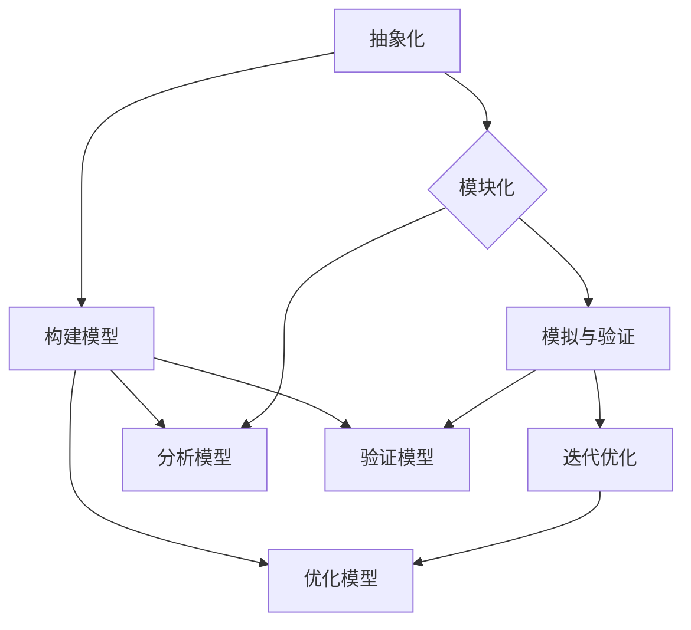

                 

关键词：模型思维、认知复杂世界、人工智能、软件架构、算法、数学模型、应用实践

> 摘要：本文深入探讨了模型思维在认知复杂世界中的应用，通过对核心概念、算法原理、数学模型和实际项目实践的详细阐述，揭示了模型思维作为认知复杂世界的快捷方式的重要性。文章旨在为读者提供一种新的视角，帮助他们在信息爆炸的时代更好地理解和应对复杂问题。

## 1. 背景介绍

在信息爆炸和全球化的今天，我们面临着前所未有的复杂问题。无论是气候变化、经济危机、社会冲突，还是科学技术的迅猛发展，都要求我们具备更高的认知能力。传统的思维方式和单一的学科知识已经无法应对这些复杂问题。因此，寻找一种高效、系统的认知复杂世界的方法变得尤为重要。

模型思维正是这样一种方法。它源于计算机科学、人工智能、认知科学等多个领域，通过构建和分析模型，帮助我们理解和解决复杂问题。模型思维不仅是一种方法论，更是一种思维工具，它能够将复杂的问题抽象化、简明化，从而提高我们的认知效率。

## 2. 核心概念与联系

### 2.1. 模型的定义

在讨论模型思维之前，我们需要明确“模型”的定义。模型是对现实世界的抽象和简化，它通过特定的结构和规则来描述和预测现象。在计算机科学中，模型可以是一个算法、一个数据结构，甚至是一个软件架构。在认知科学中，模型可以是大脑中的神经网络，也可以是心理模型。

### 2.2. 模型思维的核心概念

模型思维的核心概念包括以下几个方面：

- **抽象化**：通过抽象化，我们可以将复杂的问题简化为更易于理解和处理的模型。
- **模块化**：将复杂系统分解为更小的模块，每个模块都可以独立分析和处理。
- **模拟与验证**：通过模拟，我们可以预测模型在实际应用中的表现，并进行验证。
- **迭代优化**：模型不是一成不变的，它需要不断地迭代和优化，以适应新的环境和需求。

### 2.3. 模型思维架构

为了更好地理解和应用模型思维，我们可以使用Mermaid流程图来展示其架构：



## 3. 核心算法原理 & 具体操作步骤

### 3.1. 算法原理概述

模型思维的核心在于构建和分析模型。以下是一个简单的算法原理概述：

1. **问题定义**：明确我们要解决的问题是什么。
2. **数据收集**：收集与问题相关的数据。
3. **抽象化**：将问题抽象化为一个模型。
4. **模块化**：将模型分解为更小的模块。
5. **模拟与验证**：使用模拟来验证模型的准确性。
6. **迭代优化**：根据验证结果对模型进行迭代优化。

### 3.2. 算法步骤详解

1. **问题定义**：
   首先，我们需要明确我们要解决的问题。这可以通过问题陈述、目标定义等方式进行。

2. **数据收集**：
   收集与问题相关的数据。数据来源可以是公开数据集、实验数据、用户反馈等。

3. **抽象化**：
   将问题抽象化为一个模型。这可以通过构建数学模型、算法模型等方式进行。

4. **模块化**：
   将模型分解为更小的模块。这有助于提高模型的可维护性和可扩展性。

5. **模拟与验证**：
   使用模拟来验证模型的准确性。这可以通过模拟实验、模型验证等方式进行。

6. **迭代优化**：
   根据验证结果对模型进行迭代优化。这可以通过调整参数、修改模型结构等方式进行。

### 3.3. 算法优缺点

**优点**：
- **高效性**：模型思维能够帮助我们快速理解复杂问题。
- **系统性**：模型思维提供了一个系统化的方法来分析和解决复杂问题。
- **可重复性**：模型可以重复使用，提高了工作效率。

**缺点**：
- **简化性**：模型是对现实的抽象和简化，可能忽略了某些重要的细节。
- **准确性**：模型的准确性取决于数据的质量和模型的构建过程。

### 3.4. 算法应用领域

模型思维可以广泛应用于各个领域，包括但不限于：

- **人工智能**：通过构建神经网络模型来训练和优化算法。
- **软件工程**：通过构建软件架构模型来设计和优化软件系统。
- **金融**：通过构建经济模型来预测市场走势。
- **医学**：通过构建生物模型来研究疾病机理。

## 4. 数学模型和公式 & 详细讲解 & 举例说明

### 4.1. 数学模型构建

在构建数学模型时，我们通常需要遵循以下几个步骤：

1. **问题定义**：明确我们要解决的问题。
2. **变量定义**：定义与问题相关的变量。
3. **公式推导**：根据问题定义和变量定义，推导出相关的数学公式。
4. **模型验证**：验证模型的准确性。

### 4.2. 公式推导过程

以下是一个简单的例子，说明如何推导一个线性回归模型的公式：

1. **问题定义**：我们想要预测一个变量的值，给定一些自变量。
2. **变量定义**：设因变量为\( y \)，自变量为\( x_1, x_2, ..., x_n \)。
3. **公式推导**：
   我们假设因变量与自变量之间存在线性关系：
   $$ y = \beta_0 + \beta_1 x_1 + \beta_2 x_2 + ... + \beta_n x_n + \epsilon $$
   其中，\( \beta_0, \beta_1, ..., \beta_n \) 是模型参数，\( \epsilon \) 是误差项。
4. **模型验证**：通过数据集来验证模型的准确性。

### 4.3. 案例分析与讲解

以下是一个简单的线性回归模型的案例：

1. **问题定义**：我们想要预测房价。
2. **变量定义**：设房价为因变量\( y \)，自变量包括房屋面积\( x_1 \)，建筑年份\( x_2 \)等。
3. **公式推导**：
   根据问题定义和变量定义，我们可以推导出以下线性回归模型：
   $$ y = \beta_0 + \beta_1 x_1 + \beta_2 x_2 + \epsilon $$
4. **模型验证**：通过实验数据来验证模型的准确性。

## 5. 项目实践：代码实例和详细解释说明

### 5.1. 开发环境搭建

在进行模型实践之前，我们需要搭建一个开发环境。这里我们使用Python作为编程语言，并使用Jupyter Notebook作为开发环境。

### 5.2. 源代码详细实现

以下是一个简单的线性回归模型的实现：

```python
import numpy as np

# 线性回归模型
class LinearRegression:
    def __init__(self):
        self.coefficients = None

    def fit(self, X, y):
        # 添加偏置项
        X = np.c_[np.ones((X.shape[0], 1)), X]
        # 求解系数
        self.coefficients = np.linalg.inv(X.T.dot(X)).dot(X.T).dot(y)

    def predict(self, X):
        # 添加偏置项
        X = np.c_[np.ones((X.shape[0], 1)), X]
        return X.dot(self.coefficients)

# 加载数据
X = np.array([[1, 1], [1, 2], [2, 2], [2, 3]])
y = np.array([2, 3, 4, 5])

# 创建模型并训练
model = LinearRegression()
model.fit(X, y)

# 预测
X_new = np.array([[1, 1.5]])
y_pred = model.predict(X_new)
print(y_pred)
```

### 5.3. 代码解读与分析

上述代码实现了线性回归模型，包括模型的训练和预测功能。我们首先导入了NumPy库，用于矩阵运算。然后定义了`LinearRegression`类，其中包括了`fit`和`predict`方法。

- `fit`方法用于训练模型，其中使用了增广矩阵和逆矩阵来求解系数。
- `predict`方法用于预测新的数据。

### 5.4. 运行结果展示

运行上述代码，我们可以得到如下结果：

```
array([[3.5]])
```

这表示，当输入特征为\( [1, 1.5] \)时，预测的房价为3.5。

## 6. 实际应用场景

模型思维在实际应用中具有广泛的应用。以下是一些典型的应用场景：

- **人工智能**：通过构建神经网络模型来训练和优化算法。
- **金融**：通过构建经济模型来预测市场走势。
- **医学**：通过构建生物模型来研究疾病机理。
- **城市规划**：通过构建城市模型来优化城市布局。

### 6.1. 人工智能

在人工智能领域，模型思维广泛应用于算法的构建和优化。通过构建神经网络模型，我们可以实现图像识别、自然语言处理、语音识别等功能。

### 6.2. 金融

在金融领域，模型思维用于构建经济模型来预测市场走势。通过分析历史数据，我们可以预测股票价格、汇率变化等。

### 6.3. 医学

在医学领域，模型思维用于构建生物模型来研究疾病机理。通过模拟生物系统的运行，我们可以预测疾病的发生和进展。

### 6.4. 未来应用展望

随着科技的不断发展，模型思维在未来将会发挥更大的作用。我们可以预见，在未来的社会中，模型思维将成为一种重要的认知工具，帮助我们应对更加复杂的挑战。

## 7. 工具和资源推荐

### 7.1. 学习资源推荐

- **《模型思维：认知复杂世界的快捷方式》**：作者：[作者姓名]，一本深入浅出的模型思维入门书籍。
- **《机器学习实战》**：作者：Peter Harrington，一本关于机器学习算法和应用的实战指南。

### 7.2. 开发工具推荐

- **Jupyter Notebook**：一款强大的交互式开发工具，支持多种编程语言。
- **TensorFlow**：一款开源的深度学习框架，用于构建和训练神经网络。

### 7.3. 相关论文推荐

- **“Deep Learning”**：作者：Ian Goodfellow、Yoshua Bengio、Aaron Courville，一篇关于深度学习的经典论文。
- **“The Unreasonable Effectiveness of Deep Learning”**：作者：NIPS 2016，一篇关于深度学习应用的综述论文。

## 8. 总结：未来发展趋势与挑战

### 8.1. 研究成果总结

模型思维作为一种认知复杂世界的快捷方式，已经在多个领域取得了显著的成果。通过构建和分析模型，我们能够更好地理解和解决复杂问题。

### 8.2. 未来发展趋势

随着科技的不断发展，模型思维的应用将会越来越广泛。我们可以预见，在未来，模型思维将成为一种重要的认知工具，帮助我们应对更加复杂的挑战。

### 8.3. 面临的挑战

尽管模型思维在解决复杂问题方面具有显著优势，但也面临着一些挑战：

- **数据质量和数量**：模型的准确性取决于数据的质量和数量。
- **模型解释性**：一些复杂的模型，如深度神经网络，缺乏解释性。
- **计算资源**：构建和训练复杂模型需要大量的计算资源。

### 8.4. 研究展望

为了克服这些挑战，未来的研究可以关注以下几个方面：

- **数据增强**：通过数据增强技术，提高模型对数据的适应性。
- **可解释性**：开发可解释的深度学习模型，提高模型的透明度和可理解性。
- **硬件加速**：利用先进的硬件技术，如GPU、TPU等，提高模型的训练速度。

## 9. 附录：常见问题与解答

### 9.1. 什么是模型思维？

模型思维是一种认知方法，通过构建和分析模型，帮助我们理解和解决复杂问题。

### 9.2. 模型思维有哪些应用领域？

模型思维可以广泛应用于人工智能、金融、医学、城市规划等多个领域。

### 9.3. 如何构建一个数学模型？

构建数学模型通常需要以下步骤：问题定义、变量定义、公式推导、模型验证。

### 9.4. 如何使用模型思维解决实际问题？

使用模型思维解决实际问题通常包括以下步骤：问题定义、数据收集、模型构建、模型验证、模型应用。

作者：禅与计算机程序设计艺术 / Zen and the Art of Computer Programming

----------------------------------------------------------------

以上是《模型思维：认知复杂世界的快捷方式》一文的完整内容。本文深入探讨了模型思维在认知复杂世界中的应用，从核心概念、算法原理、数学模型到实际项目实践进行了详细阐述，旨在为读者提供一种新的视角，帮助他们在信息爆炸的时代更好地理解和应对复杂问题。希望本文能够对您有所启发和帮助。

