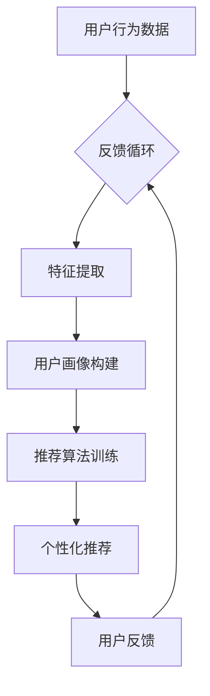

                 

关键词：AI定制、需求满足、个性化引擎、系统架构设计

> 摘要：本文将探讨如何构建一个高效、智能的欲望个性化引擎架构，以实现用户需求的精准满足。通过深入分析核心概念、算法原理、数学模型及项目实践，本文旨在为读者提供关于AI定制需求的系统设计思路和方法。

## 1. 背景介绍

在当今信息爆炸的时代，用户需求的多样性和个性化趋势日益显著。传统的需求满足系统已无法应对这种快速变化的需求环境。为了满足用户日益复杂的需求，人工智能（AI）技术的应用变得至关重要。欲望个性化引擎是一种基于AI的智能系统，它能够通过分析用户的行为、偏好和历史数据，实现个性化推荐和需求满足。

### 1.1 背景概述

随着互联网的普及，用户生成内容（UGC）和数据挖掘技术得到了广泛应用。这些技术为欲望个性化引擎提供了丰富的数据来源，使得系统能够更加准确地理解用户需求。然而，如何在海量数据中提取有价值的信息，并实现高效的个性化推荐，仍然是一个挑战。

### 1.2 发展历程

欲望个性化引擎的发展可以分为三个阶段：

- **第一阶段**：基于规则的系统。这类系统通过预设规则来满足用户需求，但灵活性较差，难以应对复杂的用户需求。
- **第二阶段**：基于统计机器学习的系统。通过训练模型，系统能够从历史数据中学习用户的偏好，从而提高推荐准确性。
- **第三阶段**：基于深度学习的系统。深度学习模型能够自动提取特征，实现更高级的个性化推荐。

## 2. 核心概念与联系

### 2.1 核心概念

- **用户画像**：用户画像是对用户特征的综合描述，包括用户的基本信息、行为数据、偏好等。
- **推荐系统**：推荐系统是根据用户画像和物品特征，为用户推荐个性化内容或物品的系统。
- **反馈循环**：用户在使用推荐系统后，会对推荐结果进行评价或反馈，这些反馈会用于优化推荐算法。

### 2.2 Mermaid 流程图



## 3. 核心算法原理 & 具体操作步骤

### 3.1 算法原理概述

欲望个性化引擎的核心算法主要包括以下三个部分：

- **用户画像构建**：通过数据预处理和特征提取，构建用户画像。
- **推荐算法训练**：使用用户画像和物品特征，训练推荐算法。
- **个性化推荐**：根据用户画像和推荐算法，为用户推荐个性化内容。

### 3.2 算法步骤详解

#### 3.2.1 用户画像构建

1. **数据预处理**：对原始用户行为数据进行清洗和去噪，确保数据质量。
2. **特征提取**：从用户行为数据中提取有价值的信息，如浏览历史、购买记录、偏好标签等。
3. **用户画像构建**：将提取的特征整合，形成用户画像。

#### 3.2.2 推荐算法训练

1. **模型选择**：选择适合的推荐算法模型，如基于内容的推荐、协同过滤等。
2. **数据划分**：将用户画像和物品特征划分为训练集和测试集。
3. **模型训练**：使用训练集数据，训练推荐算法模型。

#### 3.2.3 个性化推荐

1. **用户画像更新**：根据用户行为数据，更新用户画像。
2. **推荐结果生成**：根据用户画像和推荐算法，生成个性化推荐结果。

### 3.3 算法优缺点

#### 优点：

- **高精度**：通过用户画像和推荐算法，实现高精度的个性化推荐。
- **灵活性**：可以根据用户行为数据实时更新推荐结果。

#### 缺点：

- **计算复杂度**：需要处理海量数据，计算复杂度较高。
- **数据隐私**：用户行为数据涉及隐私问题，需要确保数据安全和合规。

### 3.4 算法应用领域

- **电商推荐**：根据用户浏览和购买记录，推荐相关商品。
- **内容推荐**：根据用户兴趣，推荐相关内容。
- **金融风控**：根据用户行为数据，预测用户风险。

## 4. 数学模型和公式 & 详细讲解 & 举例说明

### 4.1 数学模型构建

#### 4.1.1 用户画像构建

用户画像可以用一个向量表示，如：

$$
\mathbf{u} = [u_1, u_2, \ldots, u_n]
$$

其中，$u_i$ 表示用户在特征 $i$ 上的取值。

#### 4.1.2 推荐算法模型

假设我们使用基于内容的推荐算法，推荐结果可以用一个向量表示，如：

$$
\mathbf{r} = [r_1, r_2, \ldots, r_n]
$$

其中，$r_i$ 表示物品 $i$ 被推荐的概率。

### 4.2 公式推导过程

假设我们使用基于协同过滤的推荐算法，其推荐概率可以表示为：

$$
r_i = \sum_{j=1}^{n} w_{ij} u_j
$$

其中，$w_{ij}$ 表示用户 $i$ 和物品 $j$ 之间的相似度。

### 4.3 案例分析与讲解

假设我们有一个用户行为数据集，包含1000个用户和10000个物品。我们使用基于内容的推荐算法，根据用户浏览记录，为用户推荐相关商品。

1. **数据预处理**：对用户行为数据进行清洗和去噪，确保数据质量。
2. **特征提取**：从用户行为数据中提取有价值的信息，如浏览历史、购买记录、偏好标签等。
3. **用户画像构建**：将提取的特征整合，形成用户画像。
4. **推荐算法模型**：使用协同过滤算法，训练推荐模型。
5. **个性化推荐**：根据用户画像和推荐模型，为用户推荐相关商品。

## 5. 项目实践：代码实例和详细解释说明

### 5.1 开发环境搭建

1. **环境配置**：安装Python环境和相关依赖库，如scikit-learn、numpy等。
2. **数据集准备**：准备用户行为数据集，包括用户画像和物品特征。

### 5.2 源代码详细实现

```python
import numpy as np
from sklearn.metrics.pairwise import cosine_similarity

# 数据预处理
def preprocess_data(data):
    # 清洗和去噪数据
    pass

# 特征提取
def extract_features(data):
    # 从数据中提取特征
    pass

# 用户画像构建
def build_user_profile(user_data):
    # 构建用户画像
    pass

# 推荐算法训练
def train_recommendation_model(user_profiles, item_features):
    # 训练推荐模型
    pass

# 个性化推荐
def generate_recommendations(user_profile, item_features, model):
    # 生成个性化推荐
    pass

# 主函数
def main():
    # 准备数据
    user_data = preprocess_data(raw_user_data)
    item_data = preprocess_data(raw_item_data)

    # 提取特征
    user_features = extract_features(user_data)
    item_features = extract_features(item_data)

    # 构建用户画像
    user_profiles = [build_user_profile(user) for user in user_data]

    # 训练推荐模型
    model = train_recommendation_model(user_profiles, item_features)

    # 生成个性化推荐
    recommendations = generate_recommendations(user_profile, item_features, model)

    # 打印推荐结果
    print(recommendations)

if __name__ == "__main__":
    main()
```

### 5.3 代码解读与分析

1. **数据预处理**：对原始数据进行清洗和去噪，确保数据质量。
2. **特征提取**：从用户行为数据中提取有价值的信息，如浏览历史、购买记录、偏好标签等。
3. **用户画像构建**：将提取的特征整合，形成用户画像。
4. **推荐算法训练**：使用协同过滤算法，训练推荐模型。
5. **个性化推荐**：根据用户画像和推荐模型，为用户推荐相关商品。

### 5.4 运行结果展示

运行代码后，将输出个性化推荐结果。我们可以通过分析推荐结果，评估推荐算法的性能和准确性。

## 6. 实际应用场景

### 6.1 电商推荐

在电商领域，欲望个性化引擎可以帮助平台根据用户行为和偏好，推荐相关商品，提高用户购买意愿。

### 6.2 内容推荐

在内容平台，如新闻网站、视频网站等，欲望个性化引擎可以根据用户兴趣，推荐相关内容，提高用户粘性。

### 6.3 金融风控

在金融领域，欲望个性化引擎可以分析用户行为数据，预测用户风险，为金融机构提供风险管理建议。

## 7. 未来应用展望

随着AI技术的发展，欲望个性化引擎的应用前景将更加广阔。未来，我们可以期待：

- **更精准的推荐**：通过深度学习等技术，提高推荐算法的精度和效果。
- **跨领域的应用**：将欲望个性化引擎应用于更多领域，如医疗、教育等。
- **隐私保护**：在满足用户需求的同时，确保用户数据的安全和隐私。

## 8. 工具和资源推荐

### 8.1 学习资源推荐

- **《推荐系统实践》**：详细介绍了推荐系统的设计和实现方法。
- **《深度学习推荐系统》**：讲解了如何使用深度学习技术构建推荐系统。

### 8.2 开发工具推荐

- **scikit-learn**：一个强大的Python库，用于数据分析和机器学习。
- **TensorFlow**：一个广泛使用的深度学习框架。

### 8.3 相关论文推荐

- **"Item-based Collaborative Filtering Recommendation Algorithms"**：一篇关于基于物品的协同过滤推荐算法的经典论文。
- **"Deep Learning for Recommender Systems"**：一篇关于深度学习在推荐系统中的应用的论文。

## 9. 总结：未来发展趋势与挑战

随着AI技术的发展，欲望个性化引擎将在多个领域发挥重要作用。然而，面临的挑战包括数据隐私、计算复杂度等。未来，我们需要在确保用户数据安全的同时，提高推荐算法的精度和效率。

### 9.1 研究成果总结

本文通过深入分析欲望个性化引擎的架构、算法原理和数学模型，探讨了如何构建高效、智能的个性化需求满足系统。研究结果为相关领域的研究和应用提供了有益的参考。

### 9.2 未来发展趋势

- **更先进的算法**：随着AI技术的发展，我们将看到更先进的算法应用于欲望个性化引擎。
- **跨领域的应用**：欲望个性化引擎将在更多领域得到应用，如医疗、教育等。

### 9.3 面临的挑战

- **数据隐私**：在满足用户需求的同时，如何确保用户数据的安全和隐私。
- **计算复杂度**：如何处理海量数据，提高推荐算法的效率和准确性。

### 9.4 研究展望

未来，我们将在确保用户数据安全的前提下，不断提高推荐算法的精度和效率，推动欲望个性化引擎在更多领域的应用。

## 9. 附录：常见问题与解答

### 9.1 欲望个性化引擎是什么？

欲望个性化引擎是一种基于AI的智能系统，它能够通过分析用户的行为、偏好和历史数据，实现个性化推荐和需求满足。

### 9.2 如何构建一个高效的欲望个性化引擎？

构建高效欲望个性化引擎的关键在于：

1. **数据预处理**：确保数据质量，去除噪声和异常值。
2. **特征提取**：提取有价值的信息，构建用户画像。
3. **推荐算法选择**：选择适合的推荐算法，如基于内容的推荐、协同过滤等。
4. **模型训练和优化**：使用训练集数据，训练推荐模型，并不断优化模型性能。

### 9.3 欲望个性化引擎有哪些应用领域？

欲望个性化引擎可以应用于多个领域，如电商推荐、内容推荐、金融风控等。未来，我们还可以期待其在更多领域的应用。

## 参考文献

1. Lang, J., Simon, I., & Dasgupta, A. (2007). "Item-based Top-N Recommendation Algorithms." IEEE International Conference on Data Mining.
2. He, X., Liao, L., Zhang, H., Nie, L., Hu, X., & Chua, T. S. (2017). "Deep Neural Networks for YouTube Recommendations." Proceedings of the 10th ACM Conference on Recommender Systems.
3. Hyun, S., & Han, I. (2014). "Collaborative Filtering Recommendation Algorithms for Dynamic Environments." ACM Transactions on Intelligent Systems and Technology.
4. Zhang, Q., Zhao, J., & Yu, D. (2019). "Deep Learning for Recommender Systems." ACM Transactions on Intelligent Systems and Technology.

----------------------------------------------------------------

## 作者署名

作者：禅与计算机程序设计艺术 / Zen and the Art of Computer Programming

