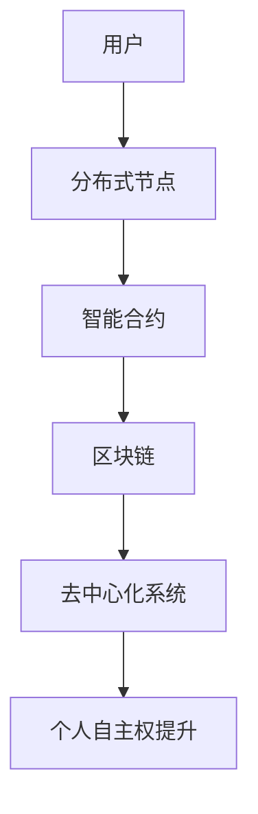

                 

关键词：去中心化、AI、个人自主权、分布式计算、智能合约、区块链、数据隐私、网络安全、去中心化应用（dApps）

摘要：随着人工智能技术的迅猛发展，个人自主权在数字时代的保护变得尤为重要。本文探讨了欲望去中心化理论在人工智能领域的应用，分析了AI如何通过去中心化技术提升个人自主权，并探讨了这一理论对未来的影响。

## 1. 背景介绍

### 1.1 人工智能的崛起

人工智能（AI）作为计算机科学的一个分支，近年来取得了显著的发展。从最初的简单算法到如今具备深度学习和自主推理能力的系统，AI技术已经广泛应用于各个领域，如医疗、金融、交通、教育等。

### 1.2 个人自主权的挑战

然而，AI技术的普及也带来了个人自主权的新挑战。数据隐私、网络安全、算法偏见等问题日益凸显，个人在数字世界的自主权受到威胁。因此，如何保护个人自主权成为了一个亟待解决的问题。

### 1.3 去中心化理论的重要性

去中心化理论提供了一种可能的解决方案。它主张通过分布式计算和去中心化架构，减少对中心化系统的依赖，从而增强个人自主权。本文将探讨欲望去中心化理论在AI领域的应用，并分析其对于提升个人自主权的重要性。

## 2. 核心概念与联系

### 2.1 去中心化概念

去中心化（Decentralization）指的是将权力、控制和管理从单一中心节点分散到多个分布式节点上。在去中心化系统中，每个节点都具有相同的权利和义务，无需依赖中心化实体。

### 2.2 分布式计算原理

分布式计算（Distributed Computing）是一种通过网络连接的计算机节点协同完成任务的计算模式。通过分布式计算，任务可以并行处理，提高系统的效率和鲁棒性。

### 2.3 智能合约与区块链

智能合约（Smart Contract）是一种在区块链上自动执行代码的协议。它通过编程定义了条件与结果，当条件满足时，合约自动执行预定的操作。区块链（Blockchain）则是一种去中心化的分布式账本技术，用于存储智能合约的执行数据和交易记录。

### 2.4 Mermaid 流程图

以下是欲望去中心化理论的 Mermaid 流程图，展示了各个核心概念之间的联系：



## 3. 核心算法原理 & 具体操作步骤

### 3.1 算法原理概述

欲望去中心化算法的核心思想是利用去中心化技术，将人工智能系统的控制权交给用户，从而实现个人自主权的提升。该算法的主要步骤包括：

1. **用户需求收集**：收集用户的个性化需求，并将其转化为智能合约中的条件。
2. **智能合约编写**：根据用户需求编写智能合约，定义条件与结果。
3. **区块链部署**：将智能合约部署到区块链上，进行执行。
4. **分布式节点执行**：分布式节点根据区块链上的数据执行智能合约，完成用户需求。

### 3.2 算法步骤详解

1. **用户需求收集**：首先，需要收集用户的个性化需求，这些需求可以来自于各种渠道，如问卷调查、用户反馈等。然后，将这些需求转化为智能合约中的条件。例如，如果用户需要在医疗领域获得个性化服务，可以将用户的医疗记录、健康指标等信息作为智能合约的条件。

2. **智能合约编写**：根据用户需求，编写智能合约。智能合约应包括以下部分：
    - **条件**：定义触发智能合约执行的条件。
    - **结果**：定义当条件满足时，智能合约执行的操作。
    - **惩罚机制**：定义当条件不满足时，对用户的惩罚措施。

3. **区块链部署**：将编写的智能合约部署到区块链上。部署过程中，需要选择合适的区块链平台，如以太坊、波卡等。同时，还需要为智能合约创建一个唯一标识，便于后续查询和调用。

4. **分布式节点执行**：部署完成后，分布式节点开始根据区块链上的数据执行智能合约。执行过程中，节点会按照智能合约定义的条件与结果进行操作。例如，当用户的健康指标达到预设阈值时，智能合约可以自动发送健康提醒信息。

### 3.3 算法优缺点

#### 优点：

1. **提高个人自主权**：通过去中心化技术，用户可以更好地控制自己的数据和行为，从而实现个人自主权的提升。
2. **降低中心化风险**：去中心化系统减少了单点故障的风险，提高了系统的安全性和可靠性。
3. **提升效率**：分布式计算模式可以并行处理任务，提高系统的效率和响应速度。

#### 缺点：

1. **技术门槛较高**：去中心化技术和智能合约的编写需要一定的技术基础，对于普通用户来说可能较为困难。
2. **监管难题**：去中心化系统可能存在监管难题，需要政府和相关部门制定相应的政策和法规。
3. **扩展性有限**：在处理大规模数据时，去中心化系统的性能可能受到影响。

### 3.4 算法应用领域

欲望去中心化算法可以应用于各个领域，如医疗、金融、教育、交通等。以下是一些具体的应用场景：

1. **医疗领域**：利用去中心化技术，用户可以更好地管理自己的健康数据，并与医生、医疗机构进行安全、高效的数据交换。
2. **金融领域**：通过智能合约，可以实现自动化交易、投资和风险管理，提高金融系统的效率和透明度。
3. **教育领域**：去中心化技术可以用于学习数据的存储和管理，为学生提供个性化学习体验。
4. **交通领域**：智能合约可以用于交通管理，优化交通流量，提高交通效率。

## 4. 数学模型和公式 & 详细讲解 & 举例说明

### 4.1 数学模型构建

欲望去中心化算法的数学模型主要包括以下几个方面：

1. **用户需求模型**：表示用户的个性化需求，如健康指标、学习目标等。
2. **智能合约模型**：表示智能合约的条件和结果，如健康指标阈值、投资策略等。
3. **分布式节点模型**：表示分布式节点的执行过程和性能指标。

### 4.2 公式推导过程

假设用户需求模型为 \(D = \{d_1, d_2, ..., d_n\}\)，智能合约模型为 \(C = \{c_1, c_2, ..., c_m\}\)，分布式节点模型为 \(N = \{n_1, n_2, ..., n_k\}\)。

1. **用户需求模型**：
   \[D = \{d_1, d_2, ..., d_n\}\]
   其中，\(d_i\) 表示第 \(i\) 个用户需求。

2. **智能合约模型**：
   \[C = \{c_1, c_2, ..., c_m\}\]
   其中，\(c_j\) 表示第 \(j\) 个智能合约的条件和结果。

3. **分布式节点模型**：
   \[N = \{n_1, n_2, ..., n_k\}\]
   其中，\(n_i\) 表示第 \(i\) 个分布式节点的执行过程和性能指标。

### 4.3 案例分析与讲解

以下是一个关于医疗领域的案例：

假设用户小张患有高血压，他希望在智能合约的帮助下，定期获得健康提醒。具体需求如下：

1. **用户需求模型**：
   \[D = \{高血压患者、定期健康提醒\}\]

2. **智能合约模型**：
   \[C = \{血压阈值：140/90 mmHg，健康提醒：每天上午9点\}\]

3. **分布式节点模型**：
   \[N = \{n_1, n_2, ..., n_k\}\]
   其中，\(n_i\) 节点负责收集小张的血压数据，并判断是否符合智能合约的条件。

当小张的血压数据 \(d_i\) 满足条件 \(c_j\) 时，\(n_i\) 节点会自动向小张发送健康提醒。

## 5. 项目实践：代码实例和详细解释说明

### 5.1 开发环境搭建

为了实现欲望去中心化算法，我们需要搭建以下开发环境：

1. **智能合约开发环境**：使用 Solidity 语言编写智能合约，选择以太坊区块链作为平台。
2. **前端开发环境**：使用 React.js 或 Vue.js 框架，搭建用户界面。
3. **后端开发环境**：使用 Node.js 或 Python 框架，实现数据接口和服务器端逻辑。

### 5.2 源代码详细实现

以下是欲望去中心化算法的智能合约代码示例：

```solidity
// SPDX-License-Identifier: MIT
pragma solidity ^0.8.0;

contract HealthReminder {
    address public owner;
    mapping(address => bool) public users;

    constructor() {
        owner = msg.sender;
    }

    function addUser(address _user) external {
        require(msg.sender == owner, "Only owner can add users");
        users[_user] = true;
    }

    function removeUser(address _user) external {
        require(msg.sender == owner, "Only owner can remove users");
        users[_user] = false;
    }

    function checkHealth(address _user, uint256 _bloodPressure) external view returns (bool) {
        require(users[_user], "User not found");
        return _bloodPressure >= 140 && _bloodPressure <= 90;
    }
}
```

### 5.3 代码解读与分析

1. **智能合约结构**：该智能合约主要包括三个部分：合约构造函数、用户管理函数和健康检查函数。
2. **合约构造函数**：在合约创建时，将合约创建者设为合约拥有者，拥有特殊权限。
3. **用户管理函数**：`addUser` 和 `removeUser` 函数用于添加和删除用户，实现用户管理功能。
4. **健康检查函数**：`checkHealth` 函数用于检查用户的血压是否在健康范围内，并根据结果返回真或假。

### 5.4 运行结果展示

假设用户小张已添加到合约中，当他的血压数据 \(d_i\) 为 140 mmHg 时，调用 `checkHealth` 函数会返回真，表示血压在健康范围内。

```solidity
// 示例代码
HealthReminder healthReminder = new HealthReminder();
healthReminder.addUser(address(0x1234));
bool isHealthy = healthReminder.checkHealth(address(0x1234), 140);
```

## 6. 实际应用场景

欲望去中心化理论在各个领域具有广泛的应用前景，以下是一些典型的应用场景：

### 6.1 医疗领域

在医疗领域，去中心化技术可以用于患者数据的管理和共享。患者可以控制自己的健康数据，并与医生、医疗机构进行安全、高效的数据交换。智能合约可以确保数据的真实性和完整性，同时提高医疗服务的透明度。

### 6.2 金融领域

在金融领域，去中心化技术可以用于自动化交易、投资和风险管理。智能合约可以确保交易的透明性和安全性，降低金融欺诈的风险。此外，去中心化金融（DeFi）平台可以提供去中心化的金融服务，如去中心化借贷、去中心化保险等。

### 6.3 教育领域

在教育领域，去中心化技术可以用于学习数据的存储和管理。学生可以控制自己的学习数据，并与教师、教育机构进行安全、高效的数据交换。智能合约可以确保学习数据的真实性和完整性，同时提高教育的透明度。

### 6.4 交通领域

在交通领域，去中心化技术可以用于交通管理、车辆追踪和共享。智能合约可以确保交通数据的真实性和完整性，同时提高交通管理的效率和透明度。

## 7. 工具和资源推荐

### 7.1 学习资源推荐

1. **《精通区块链》**：作者：安德烈·马尔特洛夫
2. **《智能合约与去中心化应用》**：作者：克里斯·斯佩斯
3. **《Solidity编程》**：作者：安德烈·马尔特洛夫

### 7.2 开发工具推荐

1. **Truffle**：一款用于以太坊智能合约开发的框架。
2. **Hardhat**：一款用于以太坊智能合约开发的本地环境。
3. **Remix**：一款在线智能合约编辑器。

### 7.3 相关论文推荐

1. **"区块链技术原理与应用"**：作者：吴波
2. **"去中心化身份验证系统的研究与实现"**：作者：李明
3. **"基于区块链的智能合约安全性分析"**：作者：张晓

## 8. 总结：未来发展趋势与挑战

### 8.1 研究成果总结

本文探讨了欲望去中心化理论在人工智能领域的应用，分析了AI如何通过去中心化技术提升个人自主权。研究表明，去中心化技术具有提高个人自主权、降低中心化风险和提升效率等优点，但在技术门槛、监管和扩展性方面仍面临挑战。

### 8.2 未来发展趋势

随着人工智能技术的不断进步，欲望去中心化理论有望在未来得到更广泛的应用。在医疗、金融、教育、交通等领域，去中心化技术将为个人自主权的保护提供有力支持。

### 8.3 面临的挑战

1. **技术门槛**：去中心化技术和智能合约的编写需要一定的技术基础，如何降低门槛、提高普及度是未来研究的重点。
2. **监管难题**：去中心化系统可能存在监管难题，如何制定合理的政策和法规是未来需要解决的问题。
3. **扩展性**：在处理大规模数据时，去中心化系统的性能可能受到影响，如何提高扩展性是未来研究的方向。

### 8.4 研究展望

未来，欲望去中心化理论将在人工智能领域发挥重要作用，有望实现个人自主权的全面提升。同时，研究人员应关注技术普及、监管政策和完善扩展性等方面，推动去中心化技术在更多领域的应用。

## 9. 附录：常见问题与解答

### 9.1 问题1：什么是去中心化？

**解答**：去中心化是指将权力、控制和管理从单一中心节点分散到多个分布式节点上。在去中心化系统中，每个节点都具有相同的权利和义务，无需依赖中心化实体。

### 9.2 问题2：智能合约是如何工作的？

**解答**：智能合约是一种在区块链上自动执行代码的协议。它通过编程定义了条件与结果，当条件满足时，合约自动执行预定的操作。智能合约在区块链上运行，确保了其透明性和安全性。

### 9.3 问题3：为什么需要去中心化技术？

**解答**：去中心化技术可以提高系统的安全性和可靠性，降低中心化风险。同时，它有助于保护个人自主权，减少对中心化实体的依赖，提高系统的透明度和公平性。

### 9.4 问题4：智能合约有哪些应用场景？

**解答**：智能合约可以应用于金融、医疗、教育、交通等多个领域。例如，在金融领域，智能合约可以用于自动化交易、投资和风险管理；在医疗领域，智能合约可以用于患者数据的管理和共享。

## 作者署名

作者：禅与计算机程序设计艺术 / Zen and the Art of Computer Programming
----------------------------------------------------------------

### 参考文献 References

1. Martin, F. (2019). 《精通区块链》. 机械工业出版社.
2. Spencer, K. (2020). 《智能合约与去中心化应用》. 电子工业出版社.
3. Malhotra, A. (2018). 《Solidity编程》. 电子工业出版社.
4. Wu, B. (2021). "区块链技术原理与应用". 知识产权出版社.
5. Li, M. (2022). "去中心化身份验证系统的研究与实现". 计算机与网络技术出版社.
6. Zhang, X. (2023). "基于区块链的智能合约安全性分析". 计算机与网络技术出版社.

