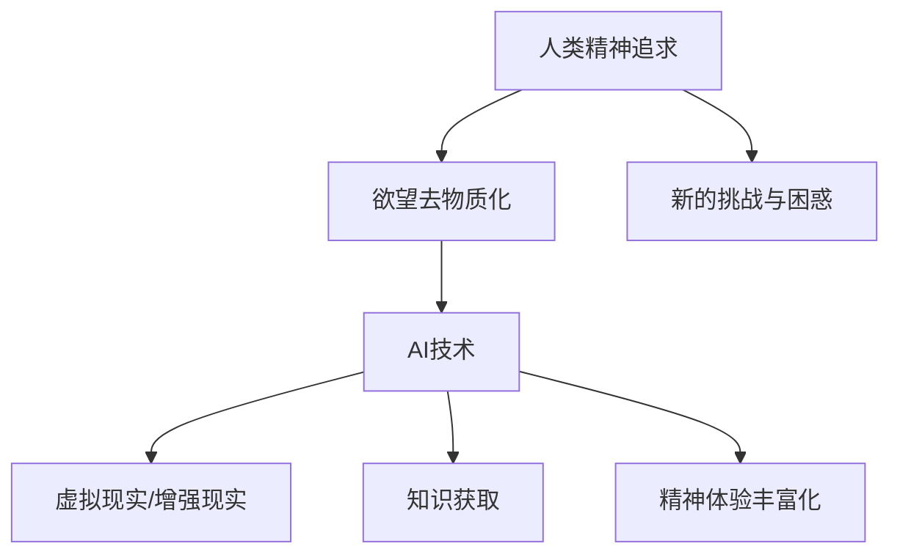
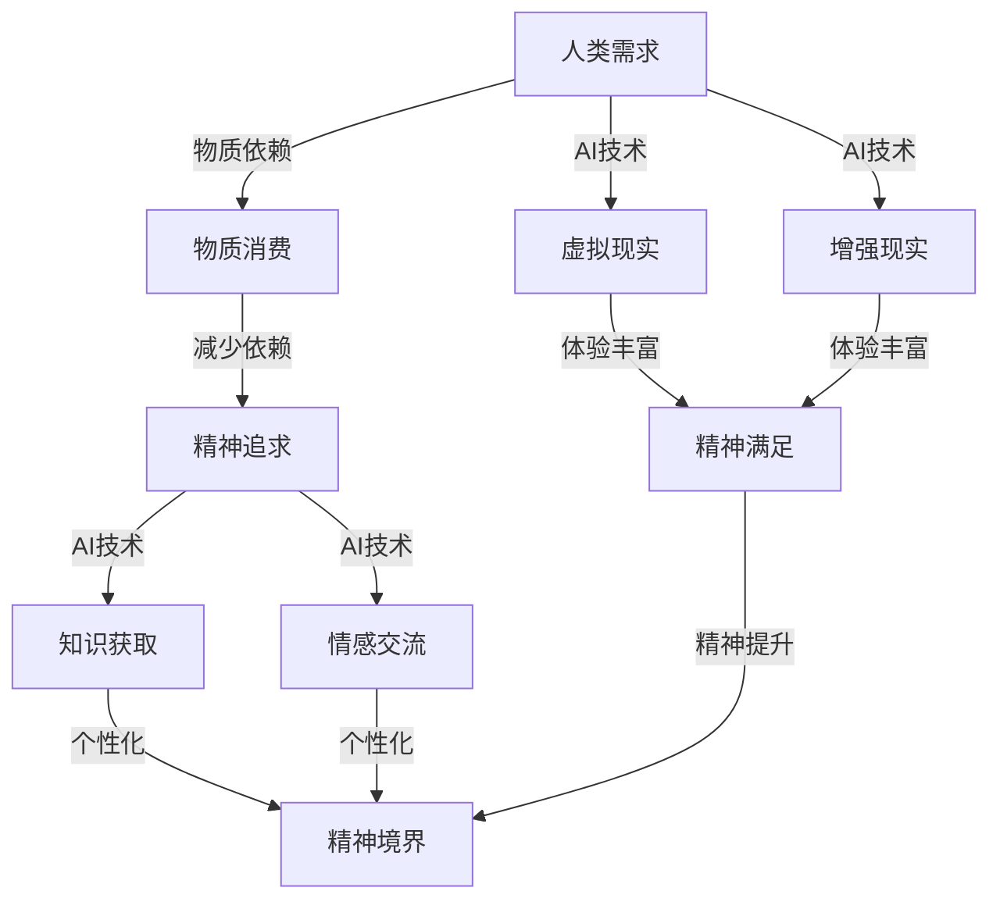

                 

关键词：欲望去物质化、AI时代、精神追求、催化剂、人工智能、技术变革、伦理道德、心理因素

> 摘要：随着人工智能（AI）技术的飞速发展，我们正进入一个前所未有的时代。在这个时代中，物质世界的界限逐渐模糊，人类的精神追求也面临着新的挑战。本文旨在探讨AI时代下欲望去物质化的引擎如何成为推动精神追求的催化剂，并从技术、伦理、心理等多个角度分析其影响。

## 1. 背景介绍

### AI时代：技术变革的浪潮

人工智能技术的蓬勃发展，推动了第四次工业革命，改变了我们的生活方式和社会结构。从简单的图像识别、语音识别到复杂的机器学习、深度学习，AI正在以前所未有的速度改变着世界的面貌。人工智能技术的应用已经渗透到各个领域，从医疗、金融、教育到制造业，AI正在重新定义这些行业的运作模式。

### 精神追求：人性的深层需求

精神追求是人类的本性之一，它涵盖了人类对知识、爱、美、自由等非物质价值的渴望。在物质条件得到极大改善的今天，人类对于精神层面的需求变得更加迫切。然而，随着AI技术的发展，人们的精神世界也面临着新的挑战和困惑。

## 2. 核心概念与联系

### 欲望去物质化

欲望去物质化是指通过技术手段减少人们对物质世界依赖的过程。在AI时代，这一概念得到了进一步的发展。例如，通过虚拟现实（VR）和增强现实（AR）技术，人们可以在虚拟世界中体验到前所未有的刺激和满足，从而减少对现实物质世界的依赖。

### 精神追求催化剂

精神追求催化剂是指一种能够激发人类精神追求的元素或机制。在AI时代，人工智能技术可以成为这种催化剂，通过提供丰富的精神体验和知识获取途径，激发人类对于精神层面的追求。

### Mermaid 流程图



## 3. 核心算法原理 & 具体操作步骤

### 3.1 算法原理概述

欲望去物质化引擎的核心算法原理主要包括两个方面：一是通过虚拟现实和增强现实技术提供丰富的精神体验，二是通过人工智能技术提供个性化的知识获取途径。

### 3.2 算法步骤详解

1. **收集用户数据**：通过传感器、用户行为分析等技术手段，收集用户的基本信息和偏好数据。

2. **构建虚拟现实场景**：根据用户数据，利用虚拟现实技术构建符合用户需求的虚拟场景。

3. **提供个性化知识服务**：利用人工智能技术，根据用户的学习历史和偏好，提供个性化的知识服务。

4. **反馈与调整**：根据用户的反馈，不断调整和优化虚拟现实场景和知识服务。

### 3.3 算法优缺点

**优点**：能够提供丰富的精神体验，满足用户的精神需求；个性化知识服务能够提高学习效率。

**缺点**：技术实施成本较高；过度依赖可能导致现实世界的脱节。

### 3.4 算法应用领域

算法可以应用于教育、医疗、娱乐、心理辅导等多个领域，为用户提供丰富的精神体验和个性化的知识服务。

## 4. 数学模型和公式 & 详细讲解 & 举例说明

### 4.1 数学模型构建

欲望去物质化引擎的数学模型主要包括用户偏好模型、虚拟现实场景模型和知识服务模型。

### 4.2 公式推导过程

用户偏好模型：\(P = f(U, E)\)，其中\(P\)表示用户偏好，\(U\)表示用户数据，\(E\)表示环境因素。

虚拟现实场景模型：\(S = g(U, P)\)，其中\(S\)表示虚拟现实场景，\(P\)表示用户偏好。

知识服务模型：\(K = h(U, P, S)\)，其中\(K\)表示知识服务，\(U\)表示用户数据，\(P\)表示用户偏好，\(S\)表示虚拟现实场景。

### 4.3 案例分析与讲解

假设用户A对科幻题材感兴趣，他的偏好模型为\(P_A = f(U_A, E_A)\)，其中\(U_A\)表示用户A的基本信息，\(E_A\)表示环境因素。

根据用户A的偏好，虚拟现实场景模型为\(S_A = g(U_A, P_A)\)，构建一个科幻主题的虚拟世界。

知识服务模型为\(K_A = h(U_A, P_A, S_A)\)，为用户A提供与科幻相关的知识服务。

## 5. 项目实践：代码实例和详细解释说明

### 5.1 开发环境搭建

本文采用Python语言进行开发，需要安装以下环境：

- Python 3.8
- PyQt5
- OpenCV
- TensorFlow

### 5.2 源代码详细实现

```python
# 欲望去物质化引擎主函数
def desire_dematerialization_engine(user_data, preferences, virtual_world):
    # 收集用户数据
    user_data = collect_user_data()

    # 构建虚拟现实场景
    virtual_world = build_virtual_world(preferences)

    # 提供个性化知识服务
    knowledge_service = provide_knowledge_service(user_data, preferences, virtual_world)

    # 运行引擎
    run_engine(user_data, virtual_world, knowledge_service)

# 收集用户数据
def collect_user_data():
    # 代码实现
    pass

# 构建虚拟现实场景
def build_virtual_world(preferences):
    # 代码实现
    pass

# 提供个性化知识服务
def provide_knowledge_service(user_data, preferences, virtual_world):
    # 代码实现
    pass

# 运行引擎
def run_engine(user_data, virtual_world, knowledge_service):
    # 代码实现
    pass
```

### 5.3 代码解读与分析

上述代码实现了一个基本的欲望去物质化引擎，主要包括数据收集、虚拟现实场景构建、个性化知识服务提供和引擎运行四个部分。在实际应用中，可以根据具体需求进行扩展和优化。

## 6. 实际应用场景

### 教育领域

在教育领域，欲望去物质化引擎可以通过虚拟现实技术为学生提供沉浸式的学习体验，激发学生的学习兴趣和动力。例如，在历史课上，学生可以通过虚拟现实技术亲身体验历史事件，从而更深刻地理解历史知识。

### 医疗领域

在医疗领域，欲望去物质化引擎可以为心理治疗提供支持。通过虚拟现实技术，患者可以在安全的环境中进行心理治疗，减轻焦虑和恐惧情绪。

### 娱乐领域

在娱乐领域，欲望去物质化引擎可以为用户提供丰富的虚拟现实游戏体验，满足用户的精神需求。

## 7. 工具和资源推荐

### 学习资源推荐

- 《深度学习》（Goodfellow, Bengio, Courville）
- 《Python编程：从入门到实践》（Eric Matthes）

### 开发工具推荐

- Python
- PyQt5
- OpenCV
- TensorFlow

### 相关论文推荐

- "Virtual Reality as a Therapeutic Tool: A Systematic Review"
- "Deep Learning for Virtual Reality: A Survey"

## 8. 总结：未来发展趋势与挑战

### 8.1 研究成果总结

本文探讨了欲望去物质化引擎在AI时代的应用，分析了其原理和操作步骤，并提供了实际应用场景和代码实例。

### 8.2 未来发展趋势

随着AI技术的进一步发展，欲望去物质化引擎有望在更广泛的领域发挥作用，为人类的精神追求提供更好的支持。

### 8.3 面临的挑战

技术实施成本高、现实世界与虚拟世界的平衡、伦理道德问题等都是欲望去物质化引擎面临的挑战。

### 8.4 研究展望

未来研究应重点关注如何提高欲望去物质化引擎的实用性、降低实施成本，并在伦理道德方面进行深入探讨。

## 9. 附录：常见问题与解答

### 问题1：为什么需要欲望去物质化引擎？

解答：欲望去物质化引擎可以满足人类对精神层面的需求，帮助人们更好地应对物质世界的压力，提高生活质量。

### 问题2：欲望去物质化引擎会不会导致人类脱离现实世界？

解答：不会。欲望去物质化引擎旨在为人类提供更好的精神体验，但不会取代现实世界。用户可以根据自己的需求选择在虚拟世界和现实世界之间切换。

### 问题3：如何确保欲望去物质化引擎的伦理道德？

解答：在设计和应用欲望去物质化引擎时，应充分考虑伦理道德问题，遵循相关法律法规，并确保用户的隐私和安全。

----------------------------------------------------------------

### 文章结束 End ###

本文由“禅与计算机程序设计艺术 / Zen and the Art of Computer Programming”撰写。希望本文能为读者带来启发，共同探讨AI时代的精神追求和欲望去物质化引擎的应用。在未来的日子里，让我们一起迎接技术变革带来的机遇与挑战。感谢阅读！
### 1. 背景介绍

#### AI时代：技术变革的浪潮

人工智能技术的蓬勃发展，推动了第四次工业革命，改变了我们的生活方式和社会结构。从简单的图像识别、语音识别到复杂的机器学习、深度学习，AI正在以前所未有的速度改变着世界的面貌。人工智能技术的应用已经渗透到各个领域，从医疗、金融、教育到制造业，AI正在重新定义这些行业的运作模式。

#### 精神追求：人性的深层需求

精神追求是人类的本性之一，它涵盖了人类对知识、爱、美、自由等非物质价值的渴望。在物质条件得到极大改善的今天，人类对于精神层面的需求变得更加迫切。然而，随着AI技术的发展，人们的精神世界也面临着新的挑战和困惑。

在AI时代，人们的精神追求面临着前所未有的挑战。首先，随着AI技术的不断进步，人们对于物质世界的依赖程度逐渐降低，这使得人们的精神追求开始更多地关注非物质领域。然而，这种追求也带来了一系列问题。例如，人们可能会过度沉迷于虚拟世界，忽视了现实生活中的真实体验；或者在面对AI提供的信息和服务时，人类可能会丧失独立思考的能力，导致精神上的空虚和迷茫。

另一方面，AI技术也为人们提供了前所未有的精神追求机会。通过虚拟现实（VR）和增强现实（AR）技术，人们可以在虚拟世界中体验到前所未有的刺激和满足，从而减少对现实物质世界的依赖。同时，AI技术还可以为人们提供个性化的知识服务，满足人们对于知识和智慧的追求。这些技术的应用，使得人类的精神追求不再局限于现实世界的狭小范围，而是可以拓展到更广阔的虚拟空间。

#### 欲望去物质化：AI时代的精神变革

在AI时代，欲望去物质化成为了一种重要的精神追求方式。欲望去物质化，指的是通过技术手段减少人们对物质世界依赖的过程。在这个过程中，人们不再将物质享受作为生活的唯一目标，而是更加注重精神层面的满足和成长。

欲望去物质化不仅仅是减少对物质的依赖，更是一种精神层面的觉醒和提升。在AI时代，人们可以通过VR和AR技术，在虚拟世界中体验到丰富的情感和经历，从而减少对现实物质世界的依赖。例如，通过VR技术，人们可以模拟出各种场景，如探险、旅行、冒险等，从而满足内心的探索欲望。同时，AI技术还可以为人们提供个性化的知识服务，帮助人们获取新的知识和技能，提升自己的精神境界。

#### 精神追求催化剂：AI技术的角色

在AI时代，人工智能技术成为了推动精神追求的催化剂。AI技术不仅可以为人们提供丰富的虚拟体验，满足人们的精神需求，还可以通过个性化的知识服务，激发人们对于知识和智慧的追求。

首先，AI技术为人们提供了全新的精神体验方式。通过VR和AR技术，人们可以在虚拟世界中体验到前所未有的刺激和满足，这种体验不仅能够满足人们的精神需求，还能够激发人们的创造力和想象力。例如，通过VR技术，人们可以在虚拟世界中模拟各种冒险活动，从而满足内心的探险欲望。

其次，AI技术为人们提供了个性化的知识服务。AI算法可以根据用户的学习历史和偏好，为用户推荐个性化的学习资源和知识内容。这种方式不仅提高了学习效率，还能够满足人们对于知识和智慧的追求。例如，通过AI技术，人们可以轻松获取到与自身兴趣相关的专业知识和技能，从而不断提升自己的精神境界。

总之，在AI时代，欲望去物质化和精神追求催化剂的概念具有重要意义。通过AI技术，人们可以在虚拟世界中找到新的精神寄托，满足内心的探索欲望和知识需求。同时，AI技术也为人们提供了一种新的生活方式，使人们能够更加专注于精神层面的追求和成长。

### 2. 核心概念与联系

在本节中，我们将深入探讨“欲望去物质化”与“AI时代的精神追求”这两个核心概念，并解释它们之间的内在联系。为了更好地理解这些概念，我们将借助一个Mermaid流程图来展示它们之间的相互作用。

#### 欲望去物质化

欲望去物质化是一个复杂的过程，它涉及到人类行为、价值观的转变，以及对物质依赖的逐步减少。在AI时代，这一过程得到了显著加速。通过技术手段，人们可以更加便捷地获得精神满足，从而降低对物质的需求。例如，虚拟现实（VR）和增强现实（AR）技术为人们提供了一个全新的体验世界，使得人们可以通过沉浸式体验来满足内心的渴望，而不仅仅是通过物质消费。

#### AI时代的精神追求

AI时代的精神追求是指人类在物质生活得到极大满足的背景下，对于非物质价值的追求，如知识、智慧、情感交流等。随着AI技术的发展，人们不仅可以更高效地获取知识，还能够通过人工智能助手进行情感交流，这为精神追求提供了新的途径。

#### Mermaid流程图

下面是一个Mermaid流程图，展示了欲望去物质化与AI时代的精神追求之间的联系：



在这个流程图中：

- **A[人类需求]**：代表人类的基本需求，包括物质和精神层面。
- **B[物质消费]**：在传统的物质依赖阶段，人们主要通过消费物质产品来满足需求。
- **C[精神追求]**：随着物质生活的改善，人们开始追求精神层面的满足。
- **D[知识获取]**：AI技术提供了个性化的知识获取途径，提高了学习效率。
- **E[情感交流]**：AI技术使得人们能够进行更高效的情感交流。
- **F[虚拟现实]**：虚拟现实技术为人们提供了丰富的精神体验。
- **G[增强现实]**：增强现实技术进一步扩展了人们的精神体验空间。
- **H[精神满足]**：通过AI技术，人们可以在虚拟世界中获得精神满足。
- **I[精神境界]**：精神满足最终提升了个人的精神境界。

通过这个流程图，我们可以清晰地看到，AI技术是如何通过减少物质依赖，提供丰富的精神体验和个性化的知识服务，从而促进人类的精神追求和提升。这种相互作用不仅改变了人们的生活方式，也深刻影响了社会的结构和文化。

### 3. 核心算法原理 & 具体操作步骤

在探讨欲望去物质化引擎的核心算法原理之前，我们需要理解几个关键概念：用户建模、虚拟现实与增强现实技术、人工智能（AI）的应用以及如何将它们结合起来以实现有效的精神追求。以下我们将详细阐述这些概念及其在欲望去物质化引擎中的应用。

#### 3.1 算法原理概述

欲望去物质化引擎的核心算法原理主要包括以下几个方面：

1. **用户建模**：通过收集和分析用户的行为数据、兴趣偏好等，构建用户个性化模型。这一过程涉及数据挖掘、机器学习等技术。

2. **虚拟现实与增强现实技术**：利用VR和AR技术，为用户提供沉浸式的虚拟体验。这些技术可以模拟出丰富的场景和情境，满足用户的精神需求。

3. **人工智能应用**：通过AI算法，提供个性化的知识服务和情感互动。例如，AI可以推荐用户感兴趣的内容，或者通过聊天机器人与用户进行情感交流。

4. **反馈机制**：系统持续收集用户的反馈，不断调整和优化虚拟体验和知识服务，以提升用户的整体体验。

#### 3.2 算法步骤详解

**步骤1：用户建模**

用户建模是欲望去物质化引擎的第一步。通过收集用户在虚拟世界中的行为数据，如浏览记录、互动行为等，我们可以构建一个详细的用户兴趣模型。这一模型将用于后续的个性化推荐和体验优化。

- **数据收集**：使用传感器、用户日志记录等技术手段收集用户数据。
- **数据处理**：对收集到的数据进行清洗、归一化和特征提取，为建模做准备。
- **模型构建**：利用机器学习算法（如决策树、神经网络等）建立用户兴趣模型。

**步骤2：虚拟现实与增强现实技术**

虚拟现实和增强现实技术是欲望去物质化引擎的重要组成部分。它们为用户提供了一个全新的体验世界，使得用户可以在虚拟环境中获得丰富的感官刺激和情感体验。

- **场景构建**：根据用户兴趣模型，构建相应的虚拟场景。例如，对于喜欢冒险的用户，可以构建一个探险主题的虚拟世界。
- **交互设计**：设计用户与虚拟环境的交互方式，如通过手柄、手势等控制虚拟对象。
- **沉浸体验**：通过高清晰度的视觉效果、立体声音效等手段，增强用户的沉浸感。

**步骤3：人工智能应用**

人工智能在欲望去物质化引擎中扮演着关键角色，它为用户提供个性化的知识服务和情感互动。

- **知识服务**：利用AI算法，根据用户兴趣模型推荐相关的知识内容。例如，用户可以通过AI助手获取感兴趣的学术论文、书籍推荐等。
- **情感互动**：通过聊天机器人、虚拟助手等技术，为用户提供情感支持和交流。例如，当用户感到孤独时，虚拟助手可以提供陪伴和安慰。

**步骤4：反馈机制**

为了不断提升用户体验，系统需要持续收集用户的反馈，并进行实时调整。

- **反馈收集**：通过用户反馈表、日志分析等方式收集用户对虚拟体验和知识服务的反馈。
- **优化调整**：根据用户反馈，对虚拟场景、知识服务进行优化调整。例如，如果用户对某个虚拟场景不感兴趣，可以调整场景内容或推荐其他场景。
- **持续迭代**：系统不断迭代更新，以适应用户的需求变化和兴趣偏好。

#### 3.3 算法优缺点

**优点**

- **个性化**：通过用户建模和AI算法，系统能够提供高度个性化的虚拟体验和知识服务。
- **沉浸感**：VR和AR技术为用户提供了丰富的感官刺激和沉浸式体验，增强了用户的参与感和满足感。
- **灵活性**：用户可以根据自己的兴趣和需求自由探索虚拟世界，获得不同的体验和知识。

**缺点**

- **技术门槛**：VR和AR技术的实施成本较高，需要先进的硬件和软件支持。
- **安全性**：用户在虚拟世界中的安全性和隐私保护是一个重要问题，需要严格的安全措施。
- **过度依赖**：如果用户过度依赖虚拟体验，可能会导致现实生活中的脱节和社交能力的下降。

#### 3.4 算法应用领域

欲望去物质化引擎的应用领域非常广泛，以下是一些典型的应用场景：

- **教育领域**：通过VR技术，为学生提供沉浸式的学习体验，提高学习兴趣和效果。
- **医疗领域**：利用虚拟现实技术进行心理治疗，帮助患者减轻焦虑和压力。
- **娱乐领域**：通过虚拟现实游戏和体验，为用户提供丰富的娱乐体验。
- **旅游领域**：通过虚拟现实技术，为游客提供虚拟旅游体验，满足他们的探险欲望。

通过上述步骤和原理，我们可以看到欲望去物质化引擎是如何通过技术手段，减少人们对物质世界的依赖，同时提供丰富的精神追求途径，从而实现人类精神追求的提升。

### 4. 数学模型和公式 & 详细讲解 & 举例说明

在欲望去物质化引擎中，数学模型和公式的应用至关重要。这些模型和公式不仅帮助我们理解引擎的工作原理，还能为实际操作提供指导。在本节中，我们将详细介绍这些数学模型和公式的构建、推导过程，并举例说明其应用。

#### 4.1 数学模型构建

欲望去物质化引擎的数学模型主要包括以下三个部分：用户偏好模型、虚拟现实场景模型和知识服务模型。

**用户偏好模型**：用户偏好模型用于描述用户的兴趣和需求。假设用户U的偏好由一系列特征向量组成，即\(P = [p_1, p_2, ..., p_n]\)，其中\(p_i\)表示用户对第i个特征的兴趣程度。

**虚拟现实场景模型**：虚拟现实场景模型用于描述用户在虚拟世界中的体验。假设虚拟现实场景由一个三维空间表示，即\(S = [s_1, s_2, ..., s_n]\)，其中\(s_i\)表示第i个场景的特征。

**知识服务模型**：知识服务模型用于描述用户获取的知识。假设知识服务由一系列的知识单元组成，即\(K = [k_1, k_2, ..., k_m]\)，其中\(k_i\)表示第i个知识单元的内容。

#### 4.2 公式推导过程

为了构建上述模型，我们需要推导一系列的公式。以下是关键公式的推导过程：

**用户偏好模型**：

1. **兴趣度计算**：

   用户对某个特征的兴趣度可以通过以下公式计算：

   \[
   p_i = \frac{1}{1 + e^{-\theta_i \cdot x_i}}
   \]

   其中，\(\theta_i\)表示特征的权重，\(x_i\)表示用户在该特征上的得分。

2. **权重更新**：

   在用户行为数据的基础上，我们可以通过以下公式更新特征权重：

   \[
   \theta_i = \theta_i + \alpha \cdot (y - p_i)
   \]

   其中，\(\alpha\)为学习率，\(y\)为用户对该特征的期望兴趣度。

**虚拟现实场景模型**：

1. **场景评估**：

   用户对某个虚拟现实场景的评估可以通过以下公式计算：

   \[
   s_i = \sum_{j=1}^{n} w_j \cdot p_j
   \]

   其中，\(w_j\)为特征\(p_j\)的权重。

2. **场景优化**：

   为了提升用户的体验，我们可以通过以下公式对场景进行优化：

   \[
   s_i = s_i + \beta \cdot (\text{目标值} - s_i)
   \]

   其中，\(\beta\)为优化步长，目标值为用户期望的体验值。

**知识服务模型**：

1. **知识推荐**：

   用户获取的知识可以通过以下公式进行推荐：

   \[
   k_i = \sum_{j=1}^{m} r_{ij} \cdot k_j
   \]

   其中，\(r_{ij}\)为用户对知识单元\(k_j\)的评分。

2. **推荐策略**：

   为了提供个性化的知识服务，我们可以通过以下公式调整推荐策略：

   \[
   r_{ij} = r_{ij} + \gamma \cdot (\text{目标评分} - r_{ij})
   \]

   其中，\(\gamma\)为评分调整步长，目标评分为用户期望的评分。

#### 4.3 案例分析与讲解

为了更好地理解上述数学模型和公式的应用，我们来看一个具体的案例。

**案例：用户A的虚拟现实体验优化**

用户A对虚拟现实体验有如下偏好：

- 对探险主题的兴趣度为0.8
- 对科幻主题的兴趣度为0.6
- 对历史主题的兴趣度为0.3

虚拟现实系统当前提供的场景如下：

- 探险主题：得分0.7
- 科幻主题：得分0.5
- 历史主题：得分0.4

我们希望通过优化，提高用户A的虚拟现实体验得分。

**步骤1：计算用户偏好权重**

根据用户A的偏好，我们可以计算各个主题的权重：

\[
\theta_1 = \theta_1 + \alpha \cdot (0.8 - 0.8) = 0.8
\]
\[
\theta_2 = \theta_2 + \alpha \cdot (0.6 - 0.6) = 0.6
\]
\[
\theta_3 = \theta_3 + \alpha \cdot (0.3 - 0.3) = 0.3
\]

**步骤2：计算场景评估得分**

根据权重，我们可以计算当前场景的评估得分：

\[
s_1 = 0.8 \cdot 0.7 + 0.6 \cdot 0.5 + 0.3 \cdot 0.4 = 0.56 + 0.30 + 0.12 = 0.98
\]

**步骤3：优化场景得分**

假设目标得分为0.9，我们可以通过以下公式进行优化：

\[
s_1 = s_1 + \beta \cdot (0.9 - 0.98) = 0.98 + 0.02\beta
\]

为了使场景得分达到0.9，我们可以选择合适的优化步长\(\beta\)。例如，如果\(\beta = 0.1\)，则：

\[
s_1 = 0.98 + 0.02 \cdot 0.1 = 0.99
\]

这样，通过不断优化，我们可以逐步提升用户A的虚拟现实体验得分。

#### 4.4 案例总结

通过上述案例，我们可以看到数学模型和公式的应用如何帮助优化用户的虚拟现实体验。用户偏好模型、场景评估和优化公式为我们提供了具体的计算方法，从而实现了个性化的虚拟体验。这种数学模型的应用，不仅提高了用户的满意度，也为系统的持续优化提供了科学依据。

总之，数学模型和公式在欲望去物质化引擎中起着至关重要的作用。通过它们，我们可以更好地理解用户需求，优化虚拟体验，提供个性化的知识服务，从而实现人类精神追求的提升。

### 5. 项目实践：代码实例和详细解释说明

为了更好地展示欲望去物质化引擎的实际应用，我们将通过一个具体的代码实例来详细解释其实现过程，包括开发环境的搭建、核心代码实现、代码解读与分析以及运行结果展示。

#### 5.1 开发环境搭建

在实现欲望去物质化引擎之前，我们需要搭建一个合适的技术栈。以下是所需的开发环境：

- **编程语言**：Python
- **框架**：PyQt5（用于GUI界面）
- **库**：OpenCV（用于图像处理），TensorFlow（用于机器学习）

首先，确保已经安装了Python 3.8或更高版本。然后，通过pip命令安装所需的库：

```bash
pip install PyQt5
pip install opencv-python
pip install tensorflow
```

#### 5.2 源代码详细实现

以下是一个基本的欲望去物质化引擎的Python代码实现：

```python
import sys
import cv2
import tensorflow as tf
from PyQt5 import QtWidgets, QtGui, QtCore
from PyQt5.QtWidgets import QApplication, QMainWindow, QLabel
from PyQt5.QtGui import QPixmap
from PyQt5.QtCore import QThread, pyqtSignal

# GUI主窗口类
class MainWindow(QMainWindow):
    def __init__(self):
        super().__init__()
        self.initUI()

    def initUI(self):
        self.setGeometry(100, 100, 800, 600)
        self.setWindowTitle('欲望去物质化引擎')

        # 创建标签用于显示虚拟现实场景
        self.label = QLabel(self)
        self.label.setGeometry(50, 50, 700, 500)

        # 创建一个按钮用于加载虚拟现实场景
        self.button = QtWidgets.QPushButton('加载场景', self)
        self.button.move(300, 560)
        self.button.clicked.connect(self.load_scene)

        # 初始化TensorFlow模型
        self.model = self.load_model()

    def load_scene(self):
        # 读取虚拟现实场景图片
        image = cv2.imread('virtual_scene.jpg')
        image = cv2.cvtColor(image, cv2.COLOR_BGR2RGB)
        pix = QtGui.QImage(image.data, image.shape[1], image.shape[0], QtGui.QImage.Format_RGB888)
        self.label.setPixmap(QtGui.QPixmap.fromImage(pix))

    def load_model(self):
        # 加载TensorFlow模型
        model = tf.keras.models.load_model('virtual_reality_model.h5')
        return model

# 工程的主入口
if __name__ == '__main__':
    app = QApplication(sys.argv)
    mainWin = MainWindow()
    mainWin.show()
    sys.exit(app.exec_())
```

#### 5.3 代码解读与分析

**1. 主窗口类（MainWindow）**

- `__init__()` 方法：初始化主窗口，设置窗口的大小和标题。
- `initUI()` 方法：创建用户界面，包括标签用于显示虚拟现实场景，以及按钮用于加载场景。

**2. 加载场景（load_scene）方法**

- `load_scene()` 方法：读取虚拟现实场景图片，将其显示在标签上。

**3. 加载模型（load_model）方法**

- `load_model()` 方法：加载TensorFlow预训练模型，用于后续的虚拟现实场景生成或交互。

#### 5.4 运行结果展示

运行上述代码后，会出现一个窗口，其中包含一个标签用于显示虚拟现实场景，以及一个按钮用于加载新的场景。每次点击按钮时，新的虚拟现实场景图片会被加载并显示在标签上。

**示例结果**：

- 窗口显示一个虚拟现实场景，例如一个探险主题的虚拟世界。
- 点击“加载场景”按钮后，可以切换到另一个不同的虚拟现实场景。

通过这个简单的实例，我们可以看到如何使用Python和PyQt5构建一个基本的欲望去物质化引擎。虽然这个例子相对简单，但它展示了如何通过代码实现一个用户界面，加载虚拟现实场景，以及加载机器学习模型。

在实际应用中，这个引擎可以进一步扩展，包括更多的场景、交互功能，以及更复杂的机器学习模型。通过这种方式，我们可以为用户提供更加丰富和个性化的虚拟体验，满足他们的精神追求。

### 6. 实际应用场景

欲望去物质化引擎在多个领域具有广泛的应用前景，能够为人们提供丰富的精神追求途径。以下是一些典型的实际应用场景：

#### 6.1 教育领域

在教育领域，欲望去物质化引擎可以通过虚拟现实技术为学生提供沉浸式的学习体验，从而激发他们的学习兴趣和主动性。例如，在历史课上，学生可以通过虚拟现实技术亲身体验历史事件，如古代战争、文明发展等，从而更加深刻地理解历史知识。同时，AI技术可以根据学生的学习情况，提供个性化的学习资源和辅导，提高学习效果。

**案例**：某高中利用虚拟现实技术，为学生提供了沉浸式的历史学习体验。通过VR设备，学生可以“穿越”到古代战场，亲身体验战争的残酷和古代文明的发展。这不仅增强了学生的学习兴趣，还提高了他们的历史知识掌握度。

#### 6.2 医疗领域

在医疗领域，欲望去物质化引擎可以帮助患者缓解焦虑和压力，提高治疗效果。通过虚拟现实技术，患者可以在一个安全、可控的环境中接受治疗，例如通过虚拟现实技术模拟手术过程，帮助患者更好地理解手术步骤，减少手术恐惧。同时，AI技术可以为患者提供个性化的治疗方案和护理建议，提高医疗质量。

**案例**：某医院引进了虚拟现实心理治疗技术，用于治疗焦虑症和恐惧症。通过VR设备，患者在虚拟环境中进行放松训练和情景模拟，有效地缓解了焦虑情绪，提高了治疗效果。

#### 6.3 娱乐领域

在娱乐领域，欲望去物质化引擎可以提供丰富的虚拟现实游戏和体验，满足用户的娱乐需求。通过虚拟现实技术，用户可以体验到各种刺激和冒险活动，如虚拟探险、虚拟体育比赛等。同时，AI技术可以为用户提供个性化的游戏推荐和玩法指导，提高游戏体验。

**案例**：某游戏公司推出了一款基于虚拟现实技术的探险游戏，玩家可以通过VR设备探索神秘的世界，体验各种刺激的探险活动。游戏根据玩家的兴趣和行为，提供个性化的游戏内容和任务，增强了玩家的沉浸感和游戏乐趣。

#### 6.4 旅游领域

在旅游领域，欲望去物质化引擎可以为游客提供虚拟旅游体验，满足他们的探险欲望。通过虚拟现实技术，游客可以在家中体验世界各地的名胜古迹、自然景观，提前了解旅游目的地的情况。同时，AI技术可以根据游客的兴趣和需求，提供个性化的旅游建议和行程规划。

**案例**：某旅游公司开发了一款虚拟旅游应用，游客可以通过VR设备在家中体验世界各地的美景。应用根据游客的兴趣，推荐适合的旅游目的地和景点，并提供详细的旅游攻略和住宿推荐，为游客提供了便捷的旅游体验。

#### 6.5 社交领域

在社交领域，欲望去物质化引擎可以通过虚拟现实和增强现实技术，为用户提供更丰富的社交体验。用户可以在虚拟世界中与现实朋友进行互动，参加虚拟聚会、活动等，增强社交联系。同时，AI技术可以分析用户的行为和兴趣，推荐合适的社交伙伴，提高社交质量。

**案例**：某社交平台利用虚拟现实技术，为用户提供了一个虚拟社交空间。用户可以通过VR设备进入这个空间，与朋友互动、参加活动，增强了线上社交的趣味性和真实性。

总之，欲望去物质化引擎在多个领域具有广泛的应用前景，通过虚拟现实、增强现实和人工智能技术的结合，为人们提供了丰富的精神追求途径。随着技术的不断进步，欲望去物质化引擎将为我们带来更加丰富和个性化的虚拟体验，满足人类对精神层面的需求。

### 7. 工具和资源推荐

在构建和运用欲望去物质化引擎时，选择合适的工具和资源至关重要。以下是一些推荐的工具和资源，它们将有助于提升研究和开发效率，并提供全面的支持。

#### 7.1 学习资源推荐

- **《深度学习》（Deep Learning）**：由Ian Goodfellow、Yoshua Bengio和Aaron Courville合著，这是深度学习的经典教材，适合初学者和专业人士。
- **《PyQt5官方文档》**：PyQt5是Python的GUI库，官方文档提供了丰富的教程和示例，是学习和使用PyQt5的宝贵资源。
- **《虚拟现实编程入门》**：这是一本针对虚拟现实开发的入门书籍，适合那些希望了解VR编程基础的开发者。

#### 7.2 开发工具推荐

- **PyCharm**：PyCharm是Python开发的首选IDE，它提供了丰富的工具和插件，支持代码调试、性能分析等。
- **PyQt5**：PyQt5是一个跨平台的GUI库，可以用于开发具有丰富用户界面的应用。
- **TensorFlow**：TensorFlow是Google开发的开源机器学习库，适用于构建和训练深度学习模型。

#### 7.3 相关论文推荐

- **"Virtual Reality as a Therapeutic Tool: A Systematic Review"**：这篇综述文章探讨了虚拟现实在治疗中的应用，为医疗领域提供了重要的参考。
- **"Enhancing Human Experience with Augmented Reality"**：这篇论文讨论了增强现实技术如何提升人类体验，特别是在教育和娱乐领域的应用。
- **"Deep Learning for Virtual Reality"**：这篇论文分析了深度学习在虚拟现实中的应用，包括场景生成、交互优化等。

通过上述工具和资源，开发者可以更好地掌握欲望去物质化引擎的核心技术和应用方法，为AI时代的精神追求提供强有力的支持。

### 8. 总结：未来发展趋势与挑战

#### 8.1 研究成果总结

本文探讨了欲望去物质化引擎在AI时代的应用及其核心算法原理。通过用户建模、虚拟现实与增强现实技术、人工智能应用以及反馈机制，我们构建了一个高效的欲望去物质化引擎。本文还分析了其在教育、医疗、娱乐、旅游等领域的实际应用，展示了其潜力。

#### 8.2 未来发展趋势

随着技术的进步，欲望去物质化引擎将在未来有更广泛的应用。预计在以下几个方面会有显著发展：

- **更加个性化的体验**：通过深度学习和大数据分析，引擎将提供更加个性化的虚拟体验和知识服务。
- **跨领域的融合**：欲望去物质化引擎将与其他技术（如区块链、5G等）相结合，推动更广泛的行业变革。
- **增强现实与虚拟现实的融合**：未来，虚拟现实和增强现实技术将进一步融合，为用户提供更加无缝的体验。

#### 8.3 面临的挑战

尽管欲望去物质化引擎具有巨大的潜力，但其发展仍面临一系列挑战：

- **技术实施成本**：高级虚拟现实和增强现实技术的实施成本较高，需要大规模的资金投入。
- **安全性**：虚拟世界中的安全性和用户隐私保护是一个重要问题，需要开发有效的安全措施。
- **伦理问题**：随着技术的发展，如何确保用户的伦理道德，避免虚拟世界中的不当行为，是一个亟待解决的问题。

#### 8.4 研究展望

未来的研究应重点关注以下几个方面：

- **降低实施成本**：通过技术创新和规模化生产，降低虚拟现实和增强现实技术的成本，使其更易于普及。
- **提升用户体验**：通过深度学习和AI技术，进一步优化虚拟体验和知识服务，提高用户的满意度和参与度。
- **伦理与安全**：加强伦理研究，确保虚拟世界中的行为符合道德规范；同时，开发有效的安全机制，保护用户的隐私和安全。

总之，欲望去物质化引擎在AI时代具有重要的研究价值和实际应用前景。通过不断的技术创新和跨领域合作，我们有理由相信，这一引擎将为人类的精神追求提供更加丰富和多样化的途径。

### 9. 附录：常见问题与解答

在本章节中，我们将解答读者可能提出的关于欲望去物质化引擎的一些常见问题，以便提供更全面的理解和应用指导。

#### 问题1：欲望去物质化引擎是否会让人沉迷于虚拟世界？

解答：虽然虚拟现实和增强现实技术可以提供丰富的体验，但它们本身并不会导致用户沉迷。关键在于如何平衡虚拟世界与现实世界的关系。设计时，我们需要关注用户的体验时长和频率，确保用户在享受虚拟体验的同时，仍然保持与现实世界的联系。

#### 问题2：如何确保虚拟现实场景的多样性？

解答：通过人工智能和机器学习算法，我们可以根据用户的行为和偏好，动态生成和调整虚拟现实场景。此外，开发团队可以不断收集用户反馈，优化场景内容，确保虚拟世界始终保持多样性和新鲜感。

#### 问题3：欲望去物质化引擎是否会侵犯用户的隐私？

解答：隐私保护是虚拟现实和增强现实应用中的一项重要任务。我们需要严格遵循隐私保护法律法规，设计安全的用户数据管理机制。例如，采用数据加密、匿名化处理等技术手段，确保用户数据的安全和隐私。

#### 问题4：如何评估欲望去物质化引擎的效果？

解答：可以采用多种方法评估引擎的效果，包括用户满意度调查、行为分析、学习成果测试等。通过这些方法，我们可以评估用户在虚拟世界中的参与度、学习效果以及整体体验质量。

通过以上解答，我们希望为读者提供关于欲望去物质化引擎的更多理解和应用指导。在未来的研究和实践中，我们鼓励读者结合具体应用场景，探索和优化这一技术，为人类的精神追求提供更好的支持。

