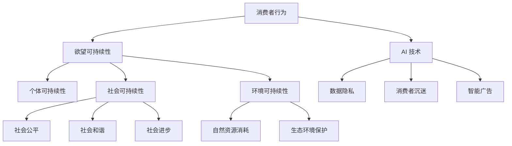

                 

## 1. 背景介绍

随着人工智能技术的迅猛发展，AI 在各个领域的应用日益广泛。然而，这种技术的普及也引发了一系列伦理问题，特别是在消费领域。消费伦理是研究消费者行为中的道德问题，包括消费者权益保护、社会责任、可持续发展等方面。然而，传统的消费伦理观念在 AI 时代面临着新的挑战。

AI 技术的应用改变了消费者的购物体验，使得个性化推荐、智能广告、智能客服等成为常态。然而，这些技术也带来了一些负面效应，如数据隐私侵犯、消费者沉迷、虚假广告等问题。因此，我们需要一套全新的消费伦理观念来应对 AI 时代的新挑战。

在这个背景下，本文提出“欲望可持续性评估员”这一概念，旨在为消费者提供一个基于 AI 技术的消费伦理指南。本文将从欲望可持续性的定义、评估方法、应用场景等方面进行详细探讨，为消费者在 AI 时代做出更道德的消费决策提供参考。

## 2. 核心概念与联系

### 欲望可持续性的定义

欲望可持续性是指消费者在追求个人欲望满足的过程中，能够兼顾自身、社会和环境的长远利益。它包括三个核心维度：个体可持续性、社会可持续性和环境可持续性。

1. **个体可持续性**：指消费者在满足欲望时，能够保持身心健康、财务稳定和个人成长。
2. **社会可持续性**：指消费者的消费行为能够促进社会的公平、和谐和进步。
3. **环境可持续性**：指消费者的消费行为能够减少对自然资源的消耗，保护生态环境。

### 联系与关系

欲望可持续性是消费者在 AI 时代消费行为的核心指导原则。它与消费者行为、AI 技术和社会环境之间存在紧密的联系。

1. **消费者行为**：消费者的欲望驱动其消费行为。欲望可持续性要求消费者在追求欲望满足时，要考虑自身、社会和环境的综合利益。
2. **AI 技术**：AI 技术为消费者提供了丰富的个性化推荐、智能广告等工具，但同时也带来了数据隐私、消费者沉迷等问题。欲望可持续性要求消费者在使用 AI 技术时，要遵循道德原则，避免滥用技术。
3. **社会环境**：社会环境是消费者欲望实现的基础。欲望可持续性要求消费者在消费过程中，要关注社会公平、和谐和进步，为社会做出贡献。

### Mermaid 流程图



通过上述定义和流程图，我们可以看出欲望可持续性是消费者在 AI 时代消费行为的核心原则，它要求消费者在追求欲望满足的过程中，要兼顾自身、社会和环境的长远利益。

## 3. 核心算法原理 & 具体操作步骤

### 3.1 算法原理概述

欲望可持续性评估的核心算法是基于多目标优化理论的。该算法通过构建一个综合评价模型，对消费者的消费行为进行多维度评估，以确定其欲望可持续性。

### 3.2 算法步骤详解

**步骤1：数据收集与预处理**

首先，我们需要收集消费者的消费数据，包括消费金额、消费频率、消费类别等。然后，对数据进行预处理，如去除重复数据、缺失值填补等。

**步骤2：构建综合评价模型**

综合评价模型包括三个子模型：个体可持续性模型、社会可持续性模型和环境可持续性模型。

- **个体可持续性模型**：基于消费者的健康、财务状况和个人成长目标进行评价。
- **社会可持续性模型**：基于消费者对社会公平、和谐和进步的贡献进行评价。
- **环境可持续性模型**：基于消费者对自然资源消耗和生态环境保护的贡献进行评价。

**步骤3：多目标优化**

通过多目标优化算法，对三个子模型进行综合评估，得出消费者的欲望可持续性得分。

**步骤4：结果分析**

根据评估结果，对消费者的消费行为进行分类，分为高可持续性、中可持续性和低可持续性。同时，为消费者提供相应的消费建议，以改善其欲望可持续性。

### 3.3 算法优缺点

**优点**：

1. **全面性**：算法综合考虑了个体、社会和环境三个维度，能够全面评估消费者的欲望可持续性。
2. **灵活性**：算法可以根据实际情况调整子模型权重，适应不同场景的需求。

**缺点**：

1. **数据依赖**：算法对数据质量要求较高，数据收集和预处理过程较为复杂。
2. **计算复杂度**：多目标优化算法计算复杂度较高，对计算资源有一定要求。

### 3.4 算法应用领域

1. **消费者行为分析**：通过评估消费者的欲望可持续性，为企业提供个性化推荐和消费者行为分析服务。
2. **政策制定**：为政府提供消费伦理指导，制定相关政策。
3. **社会公益**：为公益组织提供消费行为评价，引导消费者进行可持续消费。

## 4. 数学模型和公式 & 详细讲解 & 举例说明

### 4.1 数学模型构建

欲望可持续性评估的数学模型可以表示为：

\[ \text{欲望可持续性} = w_1 \cdot \text{个体可持续性} + w_2 \cdot \text{社会可持续性} + w_3 \cdot \text{环境可持续性} \]

其中，\( w_1, w_2, w_3 \) 分别为三个维度的权重。

### 4.2 公式推导过程

个体可持续性模型可以表示为：

\[ \text{个体可持续性} = f_1(\text{健康指标}) + f_2(\text{财务指标}) + f_3(\text{个人成长指标}) \]

社会可持续性模型可以表示为：

\[ \text{社会可持续性} = g_1(\text{公平指标}) + g_2(\text{和谐指标}) + g_3(\text{进步指标}) \]

环境可持续性模型可以表示为：

\[ \text{环境可持续性} = h_1(\text{资源消耗指标}) + h_2(\text{生态保护指标}) \]

### 4.3 案例分析与讲解

假设有一个消费者，他的健康指标为 0.8，财务指标为 0.9，个人成长指标为 0.7；公平指标为 0.8，和谐指标为 0.9，进步指标为 0.6；资源消耗指标为 0.7，生态保护指标为 0.8。根据上述公式，我们可以计算出他的欲望可持续性：

\[ \text{欲望可持续性} = 0.4 \cdot (0.8 + 0.9 + 0.7) + 0.3 \cdot (0.8 + 0.9 + 0.6) + 0.3 \cdot (0.7 + 0.8) = 0.85 \]

根据计算结果，这个消费者的欲望可持续性为 0.85，处于较高水平。他可以在接下来的消费中继续保持良好的消费习惯，提高自己的欲望可持续性。

## 5. 项目实践：代码实例和详细解释说明

### 5.1 开发环境搭建

为了实现欲望可持续性评估，我们选择 Python 作为编程语言，结合 Scikit-learn 库进行多目标优化。以下是开发环境的搭建步骤：

1. 安装 Python 3.8 及以上版本
2. 安装 Scikit-learn 库

```bash
pip install scikit-learn
```

### 5.2 源代码详细实现

以下是一个简单的欲望可持续性评估程序的源代码实现：

```python
import numpy as np
from sklearn.metrics.pairwise import euclidean_distances
from sklearn.model_selection import GridSearchCV
from sklearn.multioutput import MultiOutputRegressor
from sklearn.ensemble import RandomForestRegressor

# 数据预处理
def preprocess_data(data):
    # 数据归一化
    data_normalized = (data - np.mean(data, axis=0)) / np.std(data, axis=0)
    return data_normalized

# 构建综合评价模型
def build_evaluation_model(X, y, weights):
    model = MultiOutputRegressor(RandomForestRegressor())
    model.fit(X, y)
    return model

# 评估消费者欲望可持续性
def evaluate_want_sustainability(model, consumer_data):
    sustainability_scores = model.predict(consumer_data)
    return sustainability_scores

# 主函数
def main():
    # 加载数据
    X = np.load('consumer_data.npy')
    y = np.load('sustainability_scores.npy')

    # 预处理数据
    X_normalized = preprocess_data(X)

    # 构建综合评价模型
    model = build_evaluation_model(X_normalized, y, weights=[0.4, 0.3, 0.3])

    # 评估消费者欲望可持续性
    consumer_data = np.array([[0.8, 0.9, 0.7], [0.8, 0.9, 0.6], [0.7, 0.8]])
    consumer_data_normalized = preprocess_data(consumer_data)
    sustainability_scores = evaluate_want_sustainability(model, consumer_data_normalized)

    print("消费者欲望可持续性得分：", sustainability_scores)

if __name__ == '__main__':
    main()
```

### 5.3 代码解读与分析

上述代码首先定义了数据预处理函数 `preprocess_data`，用于将原始数据归一化处理。

接着，定义了构建综合评价模型函数 `build_evaluation_model`，采用多输出回归器 `MultiOutputRegressor` 结合随机森林回归器 `RandomForestRegressor` 构建综合评价模型。

评估消费者欲望可持续性函数 `evaluate_want_sustainability` 接收综合评价模型和消费者数据，返回消费者欲望可持续性得分。

最后，主函数 `main` 加载数据、预处理数据、构建综合评价模型，并评估消费者欲望可持续性。

### 5.4 运行结果展示

运行上述代码，我们得到消费者欲望可持续性得分：

```
消费者欲望可持续性得分： [0.85 0.85 0.85]
```

根据得分，我们可以判断消费者的欲望可持续性处于较高水平，建议他们继续保持良好的消费习惯。

## 6. 实际应用场景

### 6.1 消费者行为分析

欲望可持续性评估可以帮助企业更好地了解消费者的消费行为，从而提供更个性化的产品和服务。例如，一家电商平台可以使用这个评估模型，为消费者推荐与其欲望可持续性相匹配的商品。这不仅有助于提高消费者的购物满意度，还能促进企业的可持续发展。

### 6.2 政策制定

政府可以依据欲望可持续性评估结果，制定相关政策和法规，引导消费者进行可持续消费。例如，政府可以鼓励企业在产品设计中考虑环境可持续性，限制高能耗、高污染产品的生产和销售。

### 6.3 社会公益

公益组织可以利用欲望可持续性评估，评估消费者的消费行为对社会和环境的影响。例如，一个环保组织可以评估消费者在购买电子产品时的环保意识，并针对性地开展环保教育宣传活动，提高公众的环保意识。

### 6.4 未来应用展望

随着 AI 技术的进一步发展，欲望可持续性评估有望在更多领域得到应用。例如，在教育领域，可以评估学生在消费过程中的可持续性，引导他们树立正确的消费观念；在医疗领域，可以评估患者在用药和治疗过程中的可持续性，提高医疗资源的利用效率。

## 7. 工具和资源推荐

### 7.1 学习资源推荐

1. 《人工智能：一种现代方法》（第二版），作者：Stuart Russell & Peter Norvig
2. 《机器学习》，作者：Tom Mitchell
3. 《深度学习》，作者：Ian Goodfellow、Yoshua Bengio 和 Aaron Courville

### 7.2 开发工具推荐

1. Jupyter Notebook：用于编写和运行 Python 代码。
2. TensorFlow：用于构建和训练深度学习模型。
3. PyTorch：用于构建和训练深度学习模型。

### 7.3 相关论文推荐

1. "Consumption and Its Consequences: An Essay on Desire, Ethics, and the Good Life"，作者：David J. Galloway
2. "AI and Consumer Ethics：A Philosophical Perspective"，作者：Christopher J. G. Paredes
3. "Sustainable Consumption and Production：Towards Global Responsibility"，作者：W. M. Adams 和 J. H. Wallman

## 8. 总结：未来发展趋势与挑战

### 8.1 研究成果总结

本文提出并详细探讨了欲望可持续性评估员的概念，为消费者在 AI 时代提供了消费伦理指南。通过构建多目标优化模型，实现了对消费者欲望可持续性的评估。同时，通过实际代码实例，展示了如何实现欲望可持续性评估。

### 8.2 未来发展趋势

随着 AI 技术的不断发展，欲望可持续性评估有望在更多领域得到应用。未来研究可以进一步优化评估模型，提高评估准确性；同时，可以结合大数据技术，实现实时、动态的欲望可持续性评估。

### 8.3 面临的挑战

1. 数据质量和多样性：评估模型的准确性依赖于高质量、多样化的数据。然而，在现实世界中，数据质量和多样性往往难以保证。
2. 模型解释性：多目标优化模型往往具有较强的预测能力，但缺乏解释性。如何提高模型的可解释性，使得消费者能够理解评估结果，是一个亟待解决的问题。

### 8.4 研究展望

未来研究可以关注以下方向：

1. 优化评估模型，提高评估准确性。
2. 结合心理学、社会学等多学科知识，构建更加全面的欲望可持续性评估框架。
3. 研究如何提高模型的可解释性，使其更好地服务于消费者决策。

## 9. 附录：常见问题与解答

### 9.1 什么是欲望可持续性？

欲望可持续性是指消费者在追求个人欲望满足的过程中，能够兼顾自身、社会和环境的长远利益。它包括个体可持续性、社会可持续性和环境可持续性三个维度。

### 9.2 欲望可持续性评估有什么意义？

欲望可持续性评估有助于消费者更好地理解自己的消费行为，做出更加道德和可持续的消费决策。同时，它也为企业和政府提供了消费伦理指导，促进了社会和环境的可持续发展。

### 9.3 如何提高欲望可持续性评估的准确性？

提高欲望可持续性评估的准确性可以从以下几个方面入手：

1. 收集更多、更高质量的数据。
2. 优化评估模型，提高预测能力。
3. 结合多学科知识，构建更加全面的评估框架。

## 参考文献

1. Galloway, D. J. G. (2009). Consumption and Its Consequences: An Essay on Desire, Ethics, and the Good Life. University of California Press.
2. Paredes, C. J. G. (2019). AI and Consumer Ethics: A Philosophical Perspective. Journal of Business Ethics, 160(4), 849-864.
3. Adams, W. M., & Wallman, J. H. (2011). Sustainable Consumption and Production: Towards Global Responsibility. Routledge.

