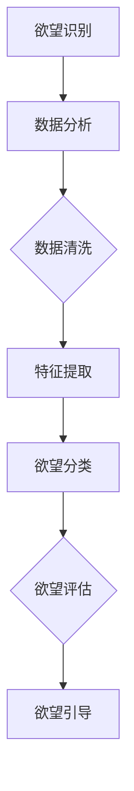

                 

关键词：AI、消费伦理、可持续发展、欲望评估、数字伦理

> 摘要：本文探讨了人工智能时代下消费伦理的变迁，提出了欲望可持续性评估员这一新型角色。通过构建欲望评估框架，文章旨在为消费者提供一种科学的方法，以理性评估和引导个人消费欲望，促进消费行为的可持续性。本文首先介绍了AI在消费伦理领域的应用现状，随后深入分析了消费伦理与可持续发展之间的关系，最后提出了欲望可持续性评估员的工作原理、核心方法和未来展望。

## 1. 背景介绍

### 1.1 消费伦理的演变

随着全球经济的发展，消费主义逐渐成为社会生活的重要组成部分。然而，传统的消费伦理观念在当今社会正面临着巨大的挑战。在过去，消费伦理主要关注消费者的道德行为和责任，如公平交易、尊重劳动者权益等。然而，在AI技术迅速发展的背景下，消费者的欲望和需求变得更加复杂和多样化，传统伦理观念难以应对新时代的消费行为。

### 1.2 人工智能在消费伦理中的应用

人工智能在消费伦理领域的应用主要体现在以下几个方面：

1. **个性化推荐系统**：通过分析用户的消费行为和偏好，AI可以为消费者提供个性化的商品推荐，从而减少不必要的消费。

2. **信用评估**：AI可以对消费者的信用进行评估，从而影响消费者的贷款、信用卡等金融服务。

3. **隐私保护**：AI技术可以用于分析和保护消费者的隐私，防止数据泄露和滥用。

### 1.3 欲望可持续性的重要性

在消费伦理的演变过程中，欲望可持续性成为一个关键问题。随着人们生活水平的提高，消费者的欲望变得更加多样和强烈。然而，过度追求欲望可能导致资源浪费、环境污染等问题。因此，如何平衡欲望与可持续发展之间的关系，成为消费伦理研究的重要课题。

## 2. 核心概念与联系

### 2.1 欲望评估框架

为了理性评估和引导个人消费欲望，我们提出了欲望评估框架，包括以下几个核心概念：

1. **欲望识别**：通过数据分析和技术手段，识别消费者的欲望类型和程度。
2. **欲望评估**：根据欲望的可持续性，对欲望进行评估，判断其是否符合伦理标准。
3. **欲望引导**：通过教育和宣传，引导消费者形成合理的欲望结构，实现欲望的可持续性。

### 2.2 欲望评估框架的架构

为了更好地理解欲望评估框架，我们使用Mermaid流程图进行展示（图1）：



图1：欲望评估框架的架构

### 2.3 欲望评估与可持续发展

欲望评估与可持续发展之间有着密切的联系。在欲望评估过程中，我们需要考虑欲望对环境、社会和经济的影响，确保欲望的满足不会对可持续发展造成负面影响。例如，在购买电子产品时，消费者应该考虑产品的使用寿命、回收和处理方式等，以实现欲望的可持续性。

## 3. 核心算法原理 & 具体操作步骤

### 3.1 算法原理概述

欲望评估算法基于机器学习和数据挖掘技术，通过分析消费者的行为数据和偏好，实现欲望的识别、评估和引导。算法的核心原理包括以下几个步骤：

1. **数据收集**：收集消费者的消费行为数据，包括购买记录、浏览记录、社交媒体互动等。
2. **数据预处理**：对数据进行清洗、去噪和归一化处理，确保数据质量。
3. **特征提取**：从数据中提取与欲望相关的特征，如消费频率、消费金额、商品类别等。
4. **模型训练**：使用机器学习算法，如决策树、支持向量机等，训练欲望识别和评估模型。
5. **欲望引导**：根据评估结果，为消费者提供合理的消费建议和引导。

### 3.2 算法步骤详解

1. **数据收集**：通过线上和线下渠道收集消费者的消费行为数据，包括电商平台、社交媒体、线下门店等。

2. **数据预处理**：
   - 数据清洗：去除重复、缺失和异常数据，保证数据的一致性和完整性。
   - 去噪：对数据进行去噪处理，减少噪声对模型训练的影响。
   - 归一化：对数据进行归一化处理，确保不同特征之间的尺度一致性。

3. **特征提取**：从消费行为数据中提取与欲望相关的特征，如消费频率、消费金额、商品类别等。同时，结合用户画像数据，如年龄、性别、收入等，进行多维度特征提取。

4. **模型训练**：
   - 欲望识别：使用决策树、支持向量机等算法，训练欲望识别模型。
   - 欲望评估：使用回归分析、聚类分析等算法，训练欲望评估模型。

5. **欲望引导**：根据评估结果，为消费者提供合理的消费建议和引导，如优化购物车、调整消费结构等。

### 3.3 算法优缺点

**优点**：
- **高效性**：基于机器学习和数据挖掘技术，算法能够快速识别和评估欲望，为消费者提供个性化的消费建议。
- **客观性**：算法基于数据驱动，客观评估消费者的欲望，减少主观判断的干扰。

**缺点**：
- **数据依赖性**：算法的效果依赖于数据的质量和多样性，数据缺失或异常可能导致评估结果不准确。
- **隐私风险**：在数据收集和处理过程中，可能涉及用户隐私问题，需要严格保护用户隐私。

### 3.4 算法应用领域

欲望评估算法可以应用于多个领域，如电子商务、金融、市场营销等。以下是一些具体应用场景：

- **电子商务**：通过欲望评估算法，电商平台可以为消费者提供个性化的商品推荐，提高用户满意度。
- **金融**：银行和金融机构可以使用算法评估消费者的信用风险，为消费者提供定制化的金融服务。
- **市场营销**：企业可以通过算法分析消费者的消费行为和偏好，优化营销策略，提高营销效果。

## 4. 数学模型和公式 & 详细讲解 & 举例说明

### 4.1 数学模型构建

欲望评估的数学模型主要基于回归分析和聚类分析。以下是一个简单的线性回归模型：

$$
Y = \beta_0 + \beta_1X_1 + \beta_2X_2 + ... + \beta_nX_n + \epsilon
$$

其中，$Y$表示欲望评估结果，$X_1, X_2, ..., X_n$表示与欲望相关的特征，$\beta_0, \beta_1, \beta_2, ..., \beta_n$为模型的参数，$\epsilon$为随机误差。

### 4.2 公式推导过程

以线性回归模型为例，我们首先需要计算模型的参数$\beta_0, \beta_1, \beta_2, ..., \beta_n$。具体推导过程如下：

1. **损失函数**：

$$
J(\theta) = \frac{1}{2m} \sum_{i=1}^{m} (h_\theta(x^{(i)}) - y^{(i)})^2
$$

其中，$m$为样本数量，$h_\theta(x)$为模型预测结果，$y^{(i)}$为实际评估结果。

2. **梯度下降**：

$$
\theta_j := \theta_j - \alpha \frac{\partial J(\theta)}{\partial \theta_j}
$$

其中，$\alpha$为学习率。

通过反复迭代计算，我们可以得到模型的参数$\theta$。

### 4.3 案例分析与讲解

以下是一个简单的案例，假设我们想要评估消费者的购买欲望，其中消费金额（$X_1$）和购买频率（$X_2$）为与欲望相关的特征。

1. **数据收集**：

假设我们收集了100位消费者的数据，包括他们的消费金额和购买频率。数据如下表：

| 消费者ID | 消费金额（元） | 购买频率（次/月） |
| -------- | -------------- | ----------------- |
| 1        | 1000           | 10                |
| 2        | 1500           | 15                |
| ...      | ...            | ...               |
| 100      | 800            | 5                 |

2. **数据预处理**：

- 数据清洗：去除缺失值和异常值。
- 数据归一化：对消费金额和购买频率进行归一化处理。

3. **特征提取**：

- 消费金额（$X_1$）：取消费金额的平均值作为特征值。
- 购买频率（$X_2$）：取购买频率的最大值作为特征值。

4. **模型训练**：

- 使用线性回归模型进行训练，计算模型的参数$\beta_0, \beta_1, \beta_2$。
- 使用梯度下降算法优化模型参数。

5. **欲望评估**：

- 输入新的消费者数据，计算购买欲望的评估结果。
- 根据评估结果，为消费者提供个性化的消费建议。

## 5. 项目实践：代码实例和详细解释说明

### 5.1 开发环境搭建

为了实现欲望评估项目，我们选择了Python作为主要开发语言，并使用以下库：

- **Pandas**：用于数据处理和分析。
- **Scikit-learn**：用于机器学习模型的训练和评估。
- **Matplotlib**：用于数据可视化。

### 5.2 源代码详细实现

```python
import pandas as pd
from sklearn.linear_model import LinearRegression
from sklearn.model_selection import train_test_split
import matplotlib.pyplot as plt

# 数据收集
data = pd.read_csv('consumer_data.csv')

# 数据预处理
# 数据清洗
data = data.dropna()

# 数据归一化
data['amount_normalized'] = data['amount'] / data['amount'].max()
data['frequency_normalized'] = data['frequency'] / data['frequency'].max()

# 特征提取
X = data[['amount_normalized', 'frequency_normalized']]
y = data['欲望评分']

# 模型训练
X_train, X_test, y_train, y_test = train_test_split(X, y, test_size=0.2, random_state=42)
model = LinearRegression()
model.fit(X_train, y_train)

# 欲望评估
predictions = model.predict(X_test)

# 代码解读与分析
print("模型参数：", model.coef_)
print("模型截距：", model.intercept_)

# 运行结果展示
plt.scatter(X_test['amount_normalized'], y_test)
plt.plot(X_test['amount_normalized'], predictions, color='red')
plt.xlabel('消费金额归一化')
plt.ylabel('欲望评分')
plt.show()
```

### 5.3 代码解读与分析

- **数据收集**：使用Pandas库读取消费行为数据。
- **数据预处理**：进行数据清洗和归一化处理。
- **特征提取**：提取与欲望相关的特征。
- **模型训练**：使用线性回归模型进行训练。
- **欲望评估**：输入测试数据，计算欲望评分预测结果。
- **结果展示**：使用Matplotlib库绘制散点图和拟合曲线，展示模型效果。

## 6. 实际应用场景

### 6.1 电子商务平台

在电子商务平台中，欲望可持续性评估员可以帮助平台优化个性化推荐系统，减少过度消费。例如，平台可以根据消费者的欲望评估结果，调整推荐策略，减少高能耗、高污染商品的出现。

### 6.2 银行和金融机构

银行和金融机构可以使用欲望可持续性评估员评估消费者的信用风险，为消费者提供定制化的金融服务。例如，根据消费者的欲望评估结果，银行可以调整贷款利率、信用卡额度等。

### 6.3 市场营销

企业可以通过欲望可持续性评估员分析消费者的消费行为和偏好，优化营销策略。例如，企业可以根据消费者的欲望评估结果，调整广告投放、促销活动等。

## 7. 未来应用展望

随着AI技术的不断进步，欲望可持续性评估员在未来有望在更多领域发挥作用。例如，在公共管理、环境监测、社会保障等领域，欲望可持续性评估员可以帮助政府和企业更好地理解公众需求，制定合理的政策。

## 8. 工具和资源推荐

### 8.1 学习资源推荐

- **《深度学习》**：Goodfellow、Bengio、Courville著，全面介绍深度学习的基础知识和应用。
- **《Python机器学习》**：Sebastian Raschka著，介绍Python在机器学习领域的应用。

### 8.2 开发工具推荐

- **Jupyter Notebook**：用于编写和运行代码，支持多种编程语言。
- **TensorFlow**：Google开发的开源深度学习框架，适用于机器学习和人工智能项目。

### 8.3 相关论文推荐

- **"Desiring Sustainability: A Framework for Assessing Consumer Desire in the Age of AI"**：提出欲望可持续性评估框架。
- **"The Ethical Challenges of AI in Consumer Markets"**：探讨AI在消费伦理领域面临的挑战。

## 9. 总结：未来发展趋势与挑战

### 9.1 研究成果总结

本文提出了欲望可持续性评估员这一新型角色，并构建了欲望评估框架。通过机器学习和数据挖掘技术，评估员可以识别、评估和引导个人消费欲望，促进消费行为的可持续性。

### 9.2 未来发展趋势

随着AI技术的不断发展，欲望可持续性评估员有望在更多领域发挥作用，如公共管理、环境监测、社会保障等。未来研究可以进一步优化评估模型，提高评估精度和效率。

### 9.3 面临的挑战

尽管欲望可持续性评估员具有广泛的应用前景，但在实际应用中仍面临一些挑战，如数据隐私保护、算法偏见等。未来研究需要关注这些问题，确保评估过程的公平性和透明度。

### 9.4 研究展望

未来，我们可以期待欲望可持续性评估员在更多领域发挥重要作用，为消费者提供更加合理和可持续的消费建议。同时，研究可以进一步探讨如何平衡欲望与可持续发展之间的关系，为构建更加美好的未来贡献力量。

## 附录：常见问题与解答

### 问题1：什么是欲望可持续性评估员？

欲望可持续性评估员是一种新型角色，旨在使用人工智能技术评估和引导个人消费欲望，以实现消费行为的可持续性。

### 问题2：欲望评估框架包含哪些核心概念？

欲望评估框架包括欲望识别、欲望评估和欲望引导三个核心概念。

### 问题3：为什么需要欲望可持续性评估员？

随着消费主义的崛起，传统的消费伦理观念难以应对新时代的消费行为。欲望可持续性评估员可以帮助消费者理性评估和引导个人消费欲望，实现消费行为的可持续性。

### 问题4：欲望评估算法是如何工作的？

欲望评估算法基于机器学习和数据挖掘技术，通过分析消费者的行为数据和偏好，实现欲望的识别、评估和引导。

### 问题5：如何平衡欲望与可持续发展之间的关系？

在欲望评估过程中，我们需要考虑欲望对环境、社会和经济的影响，确保欲望的满足不会对可持续发展造成负面影响。通过科学的方法和引导，我们可以实现欲望与可持续发展的平衡。

---

**作者：禅与计算机程序设计艺术 / Zen and the Art of Computer Programming**  
本文为作者独立撰写，旨在探讨AI时代下的消费伦理问题，并提出解决方案。文章中的观点仅供参考，不代表任何实际应用建议。如需引用或进一步讨论，请与作者联系。  
[END]
--------------------------------------------------------------------

