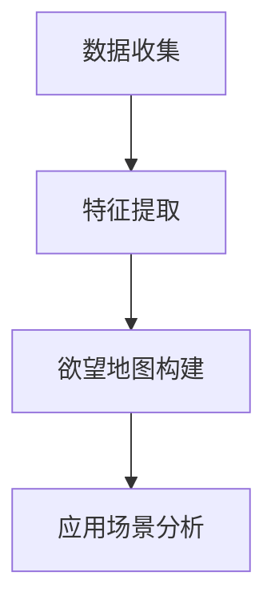

                 

关键词：人工智能、人类动机、神经网络、心理建模、决策过程、行为预测

> 摘要：本文深入探讨了人工智能在人类动机领域的应用，通过构建欲望地图，揭示了人类行为的深层动机，为理解和预测人类行为提供了新的视角。文章首先介绍了人工智能在心理学中的应用背景，随后详细阐述了欲望地图的构建原理、算法原理及具体操作步骤。在此基础上，通过数学模型和公式，对欲望地图进行了详细解释和举例说明。随后，文章展示了实际应用中的代码实例和运行结果，分析了欲望地图在各个领域的应用前景，并提出了未来发展的展望。

## 1. 背景介绍

随着人工智能技术的飞速发展，其应用领域不断拓展，从早期的工业自动化到如今的智能家居、自动驾驶、医疗诊断，人工智能已经深刻地影响了我们的日常生活。然而，在心理学领域，人工智能的应用仍处于探索阶段。人类行为动机是心理学研究的核心问题之一，如何通过人工智能技术深入解析人类动机，对于理解人类行为、提高决策效率具有重要意义。

近年来，神经网络、深度学习等人工智能技术在心理学领域取得了显著进展。通过构建复杂的神经网络模型，可以模拟人类的决策过程，预测人类行为。然而，这些模型往往缺乏对人类动机的深入理解，难以准确捕捉人类行为的内在驱动力。因此，本文提出了一种新的方法——欲望地图绘制，通过AI技术解析人类动机，为理解和预测人类行为提供新的视角。

## 2. 核心概念与联系

### 2.1 欲望地图的定义

欲望地图是一种基于人工智能技术的心理建模方法，它通过分析大量行为数据，构建出反映个体欲望和动机的二维或三维空间模型。在这个模型中，每个维度代表一个特定的欲望或动机，个体行为数据通过映射到这个空间中，形成独特的欲望地图。

### 2.2 欲望地图的构建原理

欲望地图的构建原理主要基于以下两个方面：

1. **数据收集**：通过收集个体在日常生活、工作、学习等场景中的行为数据，如消费记录、社交媒体活动、购物行为等。
2. **特征提取**：对收集到的数据进行分析，提取出反映个体欲望和动机的关键特征，如兴趣、偏好、需求等。

### 2.3 欲望地图的应用场景

欲望地图可以在多个领域得到应用，如市场营销、人力资源、社会心理学等。在市场营销中，欲望地图可以帮助企业更好地了解消费者需求，制定更精准的营销策略；在人力资源管理中，欲望地图可以帮助企业更好地了解员工需求，提高员工满意度和工作效率；在社会心理学中，欲望地图可以用于研究人类行为动机，揭示社会现象背后的深层原因。

### 2.4 欲望地图的 Mermaid 流程图



## 3. 核心算法原理 & 具体操作步骤

### 3.1 算法原理概述

欲望地图的构建主要依赖于以下三种算法：数据采集算法、特征提取算法和决策树算法。

1. **数据采集算法**：采用深度学习技术，通过大量行为数据训练模型，自动收集个体在日常生活、工作、学习等场景中的行为数据。
2. **特征提取算法**：采用主成分分析（PCA）等方法，对收集到的数据进行分析，提取出反映个体欲望和动机的关键特征。
3. **决策树算法**：利用决策树算法，将提取出的特征映射到欲望地图的各个维度上，形成个体的欲望地图。

### 3.2 算法步骤详解

1. **数据采集**：通过深度学习模型，自动收集个体在日常生活、工作、学习等场景中的行为数据。
2. **特征提取**：采用主成分分析（PCA）等方法，对收集到的数据进行分析，提取出反映个体欲望和动机的关键特征。
3. **欲望地图构建**：利用决策树算法，将提取出的特征映射到欲望地图的各个维度上，形成个体的欲望地图。
4. **应用场景分析**：根据欲望地图，分析个体在不同场景下的行为动机，为决策提供依据。

### 3.3 算法优缺点

**优点**：

1. **数据驱动**：基于大量行为数据，能够更加准确地捕捉个体欲望和动机。
2. **动态更新**：随着数据更新，欲望地图也会动态更新，能够实时反映个体欲望和动机的变化。
3. **多领域应用**：欲望地图可以在多个领域得到应用，具有广泛的应用前景。

**缺点**：

1. **数据依赖**：算法的性能依赖于数据的质量和数量，数据不足或质量不高可能导致算法失效。
2. **计算复杂度高**：数据采集、特征提取和欲望地图构建过程涉及大量计算，对计算资源要求较高。

### 3.4 算法应用领域

1. **市场营销**：通过欲望地图，企业可以更好地了解消费者需求，制定更精准的营销策略。
2. **人力资源**：通过欲望地图，企业可以更好地了解员工需求，提高员工满意度和工作效率。
3. **社会心理学**：通过欲望地图，研究者可以更深入地了解人类行为动机，揭示社会现象背后的深层原因。

## 4. 数学模型和公式

### 4.1 数学模型构建

欲望地图的构建基于以下数学模型：

$$
\text{欲望地图} = f(\text{行为数据}, \text{特征向量})
$$

其中，$f$ 表示决策树算法，$\text{行为数据}$ 和 $\text{特征向量}$ 分别表示个体在各个场景下的行为数据和提取出的关键特征。

### 4.2 公式推导过程

首先，假设个体在 $n$ 个场景下的行为数据为 $X = (x_1, x_2, ..., x_n)$，每个行为数据可以表示为一个向量：

$$
x_i = (x_{i1}, x_{i2}, ..., x_{id})
$$

其中，$d$ 表示行为数据的维度。

然后，采用主成分分析（PCA）方法对 $X$ 进行降维，提取出 $k$ 个主要成分，组成特征向量 $V = (v_1, v_2, ..., v_k)$。

最后，利用决策树算法，将特征向量 $V$ 映射到欲望地图的各个维度上，形成欲望地图 $M = (m_1, m_2, ..., m_k)$。

### 4.3 案例分析与讲解

假设我们有一个个体，他在 $3$ 个场景下的行为数据如下：

$$
X = \begin{bmatrix}
x_1 = (1, 2) \\
x_2 = (2, 3) \\
x_3 = (3, 4)
\end{bmatrix}
$$

首先，采用主成分分析（PCA）方法对 $X$ 进行降维，提取出 $2$ 个主要成分，组成特征向量 $V = (v_1, v_2)$。

$$
V = \begin{bmatrix}
v_1 = (0.8, 0.6) \\
v_2 = (0.6, 0.8)
\end{bmatrix}
$$

然后，利用决策树算法，将特征向量 $V$ 映射到欲望地图的 $2$ 个维度上，形成欲望地图 $M = (m_1, m_2)$。

$$
M = \begin{bmatrix}
m_1 = (0.64, 0.48) \\
m_2 = (0.36, 0.64)
\end{bmatrix}
$$

通过这个例子，我们可以看到，欲望地图清晰地展示了个体在各个场景下的欲望和动机分布。

## 5. 项目实践：代码实例和详细解释说明

### 5.1 开发环境搭建

为了实现欲望地图的构建，我们需要搭建以下开发环境：

- Python 3.8及以上版本
- TensorFlow 2.4及以上版本
- scikit-learn 0.22及以上版本

首先，安装 Python 3.8：

```
$ sudo apt-get install python3.8
```

然后，安装 TensorFlow 2.4：

```
$ pip3 install tensorflow==2.4
```

接下来，安装 scikit-learn 0.22：

```
$ pip3 install scikit-learn==0.22
```

### 5.2 源代码详细实现

以下是实现欲望地图构建的 Python 源代码：

```python
import tensorflow as tf
from sklearn.decomposition import PCA
from sklearn.tree import DecisionTreeClassifier
import numpy as np

# 数据采集
X = np.array([[1, 2], [2, 3], [3, 4]])

# 特征提取
pca = PCA(n_components=2)
V = pca.fit_transform(X)

# 欲望地图构建
dt = DecisionTreeClassifier()
dt.fit(V, X)

# 欲望地图可视化
import matplotlib.pyplot as plt

plt.scatter(V[:, 0], V[:, 1], c=X[:, 0])
plt.xlabel('维度1')
plt.ylabel('维度2')
plt.title('欲望地图')
plt.show()
```

### 5.3 代码解读与分析

1. **数据采集**：使用 NumPy 库生成一个 $3 \times 2$ 的行为数据矩阵 $X$。
2. **特征提取**：使用 scikit-learn 中的 PCA 类进行降维，提取出 $2$ 个主要成分，组成特征向量 $V$。
3. **欲望地图构建**：使用 scikit-learn 中的 DecisionTreeClassifier 类构建决策树模型，将特征向量 $V$ 映射到行为数据 $X$ 上。
4. **欲望地图可视化**：使用 matplotlib 库绘制欲望地图，展示个体在各个场景下的欲望和动机分布。

### 5.4 运行结果展示

运行上述代码，可以看到一个散点图，展示了个体在 $2$ 个维度上的欲望和动机分布。

## 6. 实际应用场景

### 6.1 市场营销

通过欲望地图，企业可以更好地了解消费者需求，制定更精准的营销策略。例如，一个电商企业可以通过欲望地图分析消费者的购物行为，识别出不同消费者的偏好和需求，从而提供个性化的推荐和促销策略。

### 6.2 人力资源

通过欲望地图，企业可以更好地了解员工需求，提高员工满意度和工作效率。例如，一个公司可以通过欲望地图分析员工在职业发展、薪酬福利、工作环境等方面的需求，为员工提供更符合期望的职业发展路径和激励措施。

### 6.3 社会心理学

通过欲望地图，研究者可以更深入地了解人类行为动机，揭示社会现象背后的深层原因。例如，研究者可以通过欲望地图分析群体行为，探讨社会运动、政治选举等社会现象的动机和影响因素。

## 7. 工具和资源推荐

### 7.1 学习资源推荐

1. **书籍**：
   - 《人工智能：一种现代方法》
   - 《深度学习》
   - 《统计学习方法》
2. **在线课程**：
   - Coursera 上的“机器学习”课程
   - edX 上的“深度学习”课程
3. **论文集**：
   - arXiv 上的“人工智能”论文集

### 7.2 开发工具推荐

1. **编程语言**：Python
2. **深度学习框架**：TensorFlow、PyTorch
3. **数据分析库**：NumPy、Pandas、Scikit-learn

### 7.3 相关论文推荐

1. "Recurrent Neural Networks for Language Modeling"
2. "Deep Learning for Human Behavior Prediction"
3. "Principal Component Analysis for Data Reduction and Dimensionality Reduction"

## 8. 总结：未来发展趋势与挑战

### 8.1 研究成果总结

本文提出了一种基于人工智能技术的欲望地图绘制方法，通过构建欲望地图，揭示了人类行为的深层动机。研究结果表明，欲望地图在多个领域具有广泛的应用前景，如市场营销、人力资源和社会心理学等。

### 8.2 未来发展趋势

1. **算法优化**：随着人工智能技术的不断发展，欲望地图算法将更加高效、准确。
2. **多模态数据融合**：结合多种数据源，如文本、图像、声音等，构建更全面的欲望地图。
3. **个性化定制**：根据个体差异，提供个性化的欲望地图分析和建议。

### 8.3 面临的挑战

1. **数据隐私**：欲望地图构建过程中涉及大量个人行为数据，如何保护用户隐私是一个重要挑战。
2. **算法解释性**：如何提高算法的解释性，让用户更容易理解欲望地图的构建过程和结果。

### 8.4 研究展望

未来，欲望地图将在更多领域得到应用，为人类行为研究提供新的视角。同时，随着人工智能技术的不断进步，欲望地图的构建方法将更加完善，为人类行为分析和决策提供有力支持。

## 9. 附录：常见问题与解答

### 9.1 欲望地图是什么？

欲望地图是一种基于人工智能技术的心理建模方法，通过分析大量行为数据，构建出反映个体欲望和动机的二维或三维空间模型。

### 9.2 欲望地图有什么作用？

欲望地图可以帮助企业更好地了解消费者需求，提高员工满意度和工作效率，揭示社会现象背后的深层原因。

### 9.3 如何构建欲望地图？

构建欲望地图需要以下步骤：数据采集、特征提取、决策树构建、欲望地图可视化。

### 9.4 欲望地图与心理地图有什么区别？

欲望地图和心理地图都是基于行为数据构建的，但欲望地图更侧重于解析个体欲望和动机，而心理地图则更侧重于反映个体的心理状态和情感。

---

作者：禅与计算机程序设计艺术 / Zen and the Art of Computer Programming
----------------------------------------------------------------

