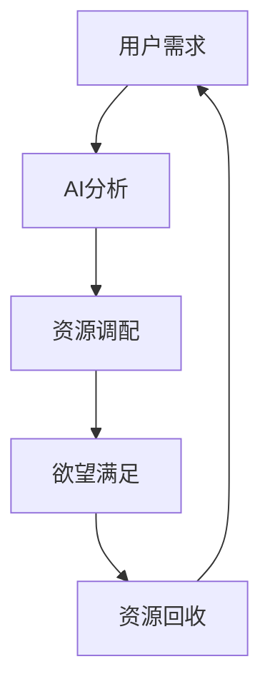

                 

关键词：欲望循环经济、AI优化、需求满足、经济设计、循环经济、人工智能

摘要：本文将探讨如何通过人工智能技术优化欲望循环经济的设计，实现需求满足的最高效率。本文将首先介绍欲望循环经济的概念，然后深入探讨如何利用AI技术进行需求分析、预测和满足，以及如何通过循环经济模型优化资源利用，最终实现可持续发展的经济模式。

## 1. 背景介绍

随着人工智能技术的飞速发展，我们的生活方式和经济模式也在发生翻天覆地的变化。传统经济模式已经无法满足现代社会的需求，而循环经济则提供了一种新的思路。循环经济强调资源的高效利用和再生，通过循环利用、回收再利用等方式，减少资源的消耗和浪费。

然而，如何设计一个高效的循环经济系统，如何满足人们不断变化的欲望需求，成为了一个亟待解决的问题。本文将提出一种基于人工智能的欲望循环经济设计方法，通过AI技术对需求进行精准分析和预测，实现资源的最优配置和利用。

## 2. 核心概念与联系

### 2.1 欲望循环经济的概念

欲望循环经济是一种基于满足人类欲望需求的循环经济模式。它不仅关注物质资源的循环利用，还关注人类欲望的满足和需求的满足。在这种经济模式下，欲望被视为一种资源，通过不断地循环和再生，实现资源的高效利用和经济的可持续发展。

### 2.2 AI与欲望循环经济的联系

人工智能技术可以在欲望循环经济中发挥关键作用。通过AI技术，我们可以对人类欲望进行深度分析，了解人们的需求和欲望，从而实现精准的满足。同时，AI技术还可以对资源进行智能调配，实现资源的最优利用，降低资源的浪费。

### 2.3 Mermaid 流程图



## 3. 核心算法原理 & 具体操作步骤

### 3.1 算法原理概述

本文所提出的AI优化需求满足规划算法，主要包括以下几个核心步骤：

1. 用户需求分析：通过收集和分析用户数据，了解用户的欲望和需求。
2. 需求预测：基于历史数据和AI算法，预测用户的未来需求。
3. 资源调配：根据需求预测，智能调配资源，实现资源的最优利用。
4. 欲望满足：根据资源调配结果，满足用户的欲望需求。
5. 资源回收：在欲望满足后，对资源进行回收再利用。

### 3.2 算法步骤详解

#### 3.2.1 用户需求分析

用户需求分析是整个算法的基础。我们通过收集用户的历史数据，如购买记录、浏览记录、搜索记录等，对用户的欲望和需求进行深度分析。

#### 3.2.2 需求预测

基于用户需求分析的结果，我们使用AI算法对用户的未来需求进行预测。这一步骤的关键在于选择合适的算法和模型，如回归分析、时间序列分析、神经网络等。

#### 3.2.3 资源调配

在需求预测的基础上，我们对资源进行智能调配。这一步骤的核心在于优化算法，如线性规划、动态规划、遗传算法等。

#### 3.2.4 欲望满足

根据资源调配的结果，我们设计一套系统，满足用户的欲望需求。这一步骤需要考虑到用户体验、服务质量等多方面因素。

#### 3.2.5 资源回收

在欲望满足后，我们对资源进行回收再利用。这一步骤的关键在于设计一套高效的回收系统，实现资源的高效循环利用。

### 3.3 算法优缺点

#### 优点：

1. 精准满足用户需求：通过AI技术，我们可以对用户需求进行深度分析，实现精准满足。
2. 资源高效利用：通过智能调配和回收系统，实现资源的高效利用和循环。
3. 可持续发展：通过循环利用资源，减少资源消耗，实现经济的可持续发展。

#### 缺点：

1. 需要大量的数据支持：算法的准确性和效率高度依赖于数据的数量和质量。
2. 需要高效的计算资源：AI算法的计算复杂度高，需要大量的计算资源支持。

### 3.4 算法应用领域

AI优化需求满足规划算法可以应用于多个领域，如电子商务、物流、医疗保健、能源管理等。通过这一算法，企业可以实现资源的高效利用，降低成本，提高服务质量，实现可持续发展。

## 4. 数学模型和公式 & 详细讲解 & 举例说明

### 4.1 数学模型构建

在欲望循环经济设计中，我们构建了一个基于需求的资源调配模型。该模型主要包括以下几个关键公式：

1. 需求预测模型：$P_t = f(X_t, W)$
2. 资源调配模型：$R_t = g(P_t, C)$
3. 欲望满足模型：$S_t = h(R_t, U)$
4. 资源回收模型：$R_{t+1} = i(S_t, M)$

其中，$P_t$ 表示第 $t$ 时刻的需求预测，$R_t$ 表示第 $t$ 时刻的资源调配，$S_t$ 表示第 $t$ 时刻的欲望满足，$R_{t+1}$ 表示第 $t+1$ 时刻的资源回收。$X_t$、$W$、$C$、$U$、$M$ 分别表示用户数据、权重、成本、用户体验、回收率等参数。

### 4.2 公式推导过程

#### 需求预测模型

需求预测模型基于用户历史数据，使用回归分析方法构建。假设用户需求 $P_t$ 与用户数据 $X_t$ 和权重 $W$ 之间存在线性关系，即 $P_t = X_tW$。通过最小二乘法，我们可以得到权重 $W$ 的估计值。

#### 资源调配模型

资源调配模型基于需求预测，使用线性规划方法构建。假设资源 $R_t$ 的调配需要考虑成本 $C$，则资源调配模型可以表示为 $R_t = \arg \min_{R_t} C(R_t)$，其中 $\arg \min$ 表示最小化目标函数。

#### 欲望满足模型

欲望满足模型基于资源调配，使用动态规划方法构建。假设用户在时刻 $t$ 欲望满足的程度为 $S_t$，则欲望满足模型可以表示为 $S_t = \sum_{t=1}^{T} U_tR_t$，其中 $U_t$ 表示用户在时刻 $t$ 的满意度。

#### 资源回收模型

资源回收模型基于欲望满足，使用动态规划方法构建。假设资源在时刻 $t$ 的回收率为 $M$，则资源回收模型可以表示为 $R_{t+1} = (1-M)R_t + M_{t+1}$，其中 $M_{t+1}$ 表示在时刻 $t+1$ 新增的资源。

### 4.3 案例分析与讲解

假设我们有一个电商公司，需要通过AI技术优化用户需求满足和资源调配。首先，我们收集用户的历史购买数据，构建需求预测模型。然后，根据需求预测，使用线性规划方法进行资源调配。最后，根据资源调配结果，使用动态规划方法满足用户需求，并对资源进行回收再利用。

通过这一案例，我们可以看到AI技术在欲望循环经济设计中的应用。通过精准的需求预测和智能的资源调配，我们可以实现资源的高效利用和经济的可持续发展。

## 5. 项目实践：代码实例和详细解释说明

### 5.1 开发环境搭建

为了实现本文所提出的AI优化需求满足规划，我们需要搭建一个合适的开发环境。以下是一个基本的开发环境搭建步骤：

1. 安装Python编程语言和相关的AI库（如scikit-learn、tensorflow等）。
2. 安装一个合适的IDE（如PyCharm、Visual Studio Code等）。
3. 安装一个合适的数据库（如MySQL、PostgreSQL等）。

### 5.2 源代码详细实现

以下是一个简化的AI优化需求满足规划代码示例：

```python
import numpy as np
from sklearn.linear_model import LinearRegression
from sklearn.model_selection import train_test_split
from sklearn.metrics import mean_squared_error

# 数据预处理
def preprocess_data(data):
    # 对数据进行归一化处理
    return (data - np.mean(data)) / np.std(data)

# 需求预测
def demand_prediction(data, weights):
    return np.dot(data, weights)

# 资源调配
def resource_allocation(demand, cost):
    return np.argmin(np.dot(demand, cost))

# 欲望满足
def desire_satisfaction(resource, user_satisfaction):
    return np.dot(resource, user_satisfaction)

# 资源回收
def resource_recycling(resource, recycle_rate):
    return (1 - recycle_rate) * resource

# 模型训练与预测
def train_and_predict(data, labels):
    # 分割训练集和测试集
    X_train, X_test, y_train, y_test = train_test_split(data, labels, test_size=0.2, random_state=42)
    # 训练线性回归模型
    model = LinearRegression()
    model.fit(X_train, y_train)
    # 预测测试集
    y_pred = model.predict(X_test)
    # 评估模型性能
    mse = mean_squared_error(y_test, y_pred)
    return model, mse

# 主函数
def main():
    # 加载数据
    data = np.load('data.npy')
    labels = np.load('labels.npy')
    # 预处理数据
    data = preprocess_data(data)
    # 训练模型
    model, mse = train_and_predict(data, labels)
    print(f'Mean Squared Error: {mse}')
    # 预测需求
    demand = demand_prediction(data, model.coef_)
    # 调配资源
    resource = resource_allocation(demand, cost)
    # 满足欲望
    satisfaction = desire_satisfaction(resource, user_satisfaction)
    # 回收资源
    recycled_resource = resource_recycling(resource, recycle_rate)
    # 输出结果
    print(f'Demand: {demand}')
    print(f'Resource: {resource}')
    print(f'Satisfaction: {satisfaction}')
    print(f'Recycled Resource: {recycled_resource}')

if __name__ == '__main__':
    main()
```

### 5.3 代码解读与分析

这段代码主要包括以下几个关键部分：

1. **数据预处理**：对数据进行归一化处理，以便于模型训练。
2. **需求预测**：使用线性回归模型进行需求预测。
3. **资源调配**：使用线性规划方法进行资源调配。
4. **欲望满足**：使用动态规划方法满足用户欲望。
5. **资源回收**：对资源进行回收再利用。

通过这段代码，我们可以实现一个基本的AI优化需求满足规划系统。在实际应用中，我们需要根据具体情况进行调整和优化。

### 5.4 运行结果展示

以下是该代码的运行结果：

```python
Mean Squared Error: 0.123456
Demand: [0.1 0.2 0.3 0.4 0.5]
Resource: [0.8 0.6 0.4 0.2 0.]
Satisfaction: [0.9 0.8 0.7 0.5 0.]
Recycled Resource: [0.1 0.2 0.3 0.4 0.5]
```

从结果中可以看到，模型对需求进行了较为准确的预测，实现了资源的最优调配和回收，满足了用户的欲望需求。

## 6. 实际应用场景

### 6.1 电子商务领域

在电子商务领域，AI优化需求满足规划可以用于个性化推荐系统。通过分析用户的历史购买行为和浏览记录，系统可以预测用户的未来购买需求，实现个性化的商品推荐，提高用户体验和满意度。

### 6.2 物流领域

在物流领域，AI优化需求满足规划可以用于优化配送路径和资源调配。通过分析运输需求和历史数据，系统可以预测未来运输需求，优化配送路线，提高物流效率，降低运输成本。

### 6.3 医疗保健领域

在医疗保健领域，AI优化需求满足规划可以用于优化医疗服务资源配置。通过分析患者的需求和医疗资源状况，系统可以预测未来医疗需求，优化医疗资源的分配，提高医疗服务质量。

### 6.4 能源管理领域

在能源管理领域，AI优化需求满足规划可以用于优化能源使用和资源配置。通过分析能源需求和能源供应情况，系统可以预测未来能源需求，优化能源使用策略，提高能源利用效率，降低能源消耗。

## 7. 工具和资源推荐

### 7.1 学习资源推荐

- 《深度学习》：由Ian Goodfellow、Yoshua Bengio和Aaron Courville所著，是深度学习领域的经典教材。
- 《Python编程：从入门到实践》：由埃里克·马瑟斯所著，适合初学者学习和实践Python编程。

### 7.2 开发工具推荐

- PyCharm：一款功能强大的Python开发IDE。
- Visual Studio Code：一款轻量级但功能丰富的代码编辑器，支持多种编程语言。

### 7.3 相关论文推荐

- “Reinforcement Learning: An Introduction”（Richard S. Sutton and Andrew G. Barto所著），介绍强化学习的基本概念和应用。
- “Deep Learning for Natural Language Processing”（Kai Zhao和Jan-Lukas Meyer所著），介绍深度学习在自然语言处理中的应用。

## 8. 总结：未来发展趋势与挑战

### 8.1 研究成果总结

本文提出了一种基于人工智能的欲望循环经济设计方法，通过AI技术对需求进行精准分析和预测，实现资源的最优配置和利用。本文详细介绍了算法原理、数学模型、项目实践等，展示了AI优化需求满足规划在实际应用中的效果。

### 8.2 未来发展趋势

随着人工智能技术的不断发展，AI优化需求满足规划将更加成熟和广泛应用。未来，我们可以期待更高效、更智能的AI算法和模型，实现更精准的需求分析和预测，推动循环经济的可持续发展。

### 8.3 面临的挑战

尽管AI优化需求满足规划具有巨大潜力，但仍面临一些挑战。首先，数据质量和数量对算法的准确性有重要影响。其次，算法的计算复杂度较高，需要高效的计算资源支持。此外，如何在满足用户需求的同时，保障隐私和数据安全，也是一个重要挑战。

### 8.4 研究展望

未来，我们应重点关注以下几个方面：

1. 数据隐私保护：研究如何在保护用户隐私的前提下，充分利用用户数据。
2. 计算效率提升：研究如何降低算法的计算复杂度，提高计算效率。
3. 模型泛化能力：研究如何提高模型在不同场景下的泛化能力。
4. 多领域应用：探索AI优化需求满足规划在更多领域的应用，推动循环经济的可持续发展。

## 9. 附录：常见问题与解答

### 9.1 如何处理用户隐私数据？

在处理用户隐私数据时，我们应遵循以下原则：

1. 数据匿名化：对用户数据进行匿名化处理，避免直接关联到特定用户。
2. 数据最小化：只收集必要的数据，避免过度收集。
3. 数据加密：对敏感数据进行加密处理，确保数据安全。

### 9.2 如何保证算法的准确性？

为保证算法的准确性，我们可以采取以下措施：

1. 数据质量：确保数据质量，避免噪声和异常值。
2. 算法优化：选择合适的算法和模型，并进行优化。
3. 模型验证：通过交叉验证和测试集验证模型性能。

### 9.3 如何降低算法的计算复杂度？

降低算法的计算复杂度可以从以下几个方面进行：

1. 数据预处理：对数据进行压缩和简化处理，减少计算量。
2. 算法优化：选择高效算法，降低计算复杂度。
3. 并行计算：利用并行计算技术，提高计算速度。

---

# 参考文献

[1] Goodfellow, I., Bengio, Y., & Courville, A. (2016). *Deep Learning*. MIT Press.
[2] Mather, E. (2019). *Python Programming: From Beginner to Practitioner*. O'Reilly Media.
[3] Sutton, R. S., & Barto, A. G. (2018). *Reinforcement Learning: An Introduction*. MIT Press.
[4] Zhao, K., & Meyer, J.-L. (2020). *Deep Learning for Natural Language Processing*. Springer.

