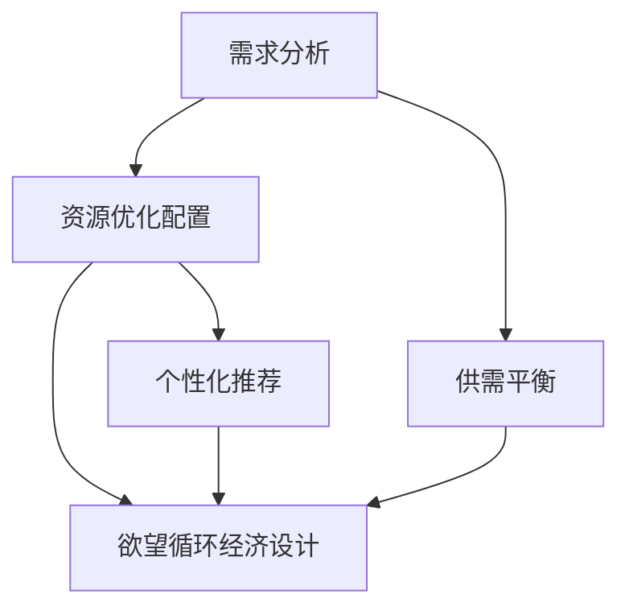

                 

### 1. 背景介绍

在现代社会中，经济活动与人类需求之间的互动日益复杂。传统经济学强调资源的有限性和需求的无尽性，然而，这种线性思维已经无法满足现代社会的需求。随着人工智能（AI）技术的飞速发展，我们可以探索一种全新的经济模式——欲望循环经济设计。本文旨在探讨如何利用AI优化需求满足规划，实现经济活动的循环与可持续发展。

欲望循环经济设计是一种基于AI优化的经济模型，它通过智能算法和数据分析，实现资源的有效配置和循环利用，从而满足人类不断变化的需求。这一模型的核心在于利用AI技术捕捉和解读人类的需求，将需求转化为可操作的经济活动，并通过循环利用资源来减少浪费，提高经济效益。

AI技术在需求满足规划中的应用，主要体现在以下几个方面：

1. **需求分析**：通过大数据分析和机器学习算法，AI可以精确捕捉用户的需求，预测未来的需求趋势。
2. **资源优化配置**：利用智能算法，对资源进行优化配置，实现资源的高效利用和循环利用。
3. **个性化推荐**：基于用户行为数据，AI可以为用户提供个性化的需求满足方案，提高用户满意度。
4. **供需平衡**：通过智能调度和预测，AI可以实现供需的平衡，减少资源浪费。

本文将围绕以上核心内容，深入探讨欲望循环经济设计的原理、算法、数学模型、项目实践、实际应用场景以及未来发展趋势与挑战。

### 2. 核心概念与联系

为了深入理解欲望循环经济设计的原理，我们需要首先明确几个核心概念，并展示它们之间的联系。以下是本文中的核心概念及其定义：

#### 2.1 欲望循环经济设计

欲望循环经济设计是一种利用人工智能技术优化资源配置和需求满足的经济模型。它的核心思想是通过AI分析用户需求，实现资源的高效利用和循环利用，从而满足人类不断变化的需求。

#### 2.2 人工智能（AI）

人工智能是一种模拟人类智能的技术，通过机器学习、深度学习等算法，使计算机具备识别、推理、决策等能力。

#### 2.3 需求分析

需求分析是指通过数据分析方法，捕捉和解读用户的需求，预测未来的需求趋势。

#### 2.4 资源优化配置

资源优化配置是指利用智能算法，对资源进行分配和调度，实现资源的高效利用。

#### 2.5 个性化推荐

个性化推荐是指根据用户的行为数据，为用户提供个性化的推荐，提高用户满意度。

#### 2.6 供需平衡

供需平衡是指通过智能调度和预测，实现供给和需求的平衡，减少资源浪费。

下面是一个Mermaid流程图，展示了这些核心概念之间的联系：



通过这个流程图，我们可以清晰地看到，需求分析、资源优化配置、个性化推荐和供需平衡是欲望循环经济设计的基础，它们相互关联，共同作用于整个经济模型。

### 3. 核心算法原理 & 具体操作步骤

#### 3.1 算法原理概述

欲望循环经济设计中的核心算法主要分为以下几个步骤：

1. **需求分析**：通过大数据分析和机器学习算法，捕捉用户的需求。
2. **资源优化配置**：利用智能算法，对资源进行分配和调度。
3. **个性化推荐**：根据用户的行为数据，为用户提供个性化的需求满足方案。
4. **供需平衡**：通过智能调度和预测，实现供给和需求的平衡。

这些步骤相互关联，形成了一个完整的算法框架。

#### 3.2 算法步骤详解

**3.2.1 需求分析**

需求分析是整个算法的第一步，也是最关键的一步。它主要通过大数据分析和机器学习算法实现。具体步骤如下：

1. **数据收集**：收集用户的历史行为数据，如购买记录、浏览记录、搜索记录等。
2. **数据预处理**：对收集到的数据进行清洗和归一化处理。
3. **特征提取**：利用机器学习算法，提取数据中的关键特征，如用户兴趣、购买倾向等。
4. **需求预测**：通过预测模型，预测用户未来的需求。

**3.2.2 资源优化配置**

资源优化配置是需求分析的结果应用，主要通过智能算法实现。具体步骤如下：

1. **资源分配**：根据需求预测结果，对资源进行初步分配。
2. **资源调度**：利用智能调度算法，对资源进行实时调整，以实现资源的最优利用。
3. **循环利用**：通过循环利用机制，将剩余资源再次分配和利用。

**3.2.3 个性化推荐**

个性化推荐是基于用户行为数据和需求分析的结果，为用户提供个性化的需求满足方案。具体步骤如下：

1. **用户建模**：通过用户行为数据，构建用户画像。
2. **推荐算法**：利用推荐算法，为用户生成个性化推荐。
3. **推荐反馈**：根据用户对推荐的反应，调整推荐策略。

**3.2.4 供需平衡**

供需平衡是通过智能调度和预测，实现供给和需求的平衡。具体步骤如下：

1. **需求预测**：利用预测算法，预测未来的需求。
2. **供给预测**：利用供给模型，预测未来的供给。
3. **供需调整**：通过供需调整算法，调整供给和需求，实现平衡。

#### 3.3 算法优缺点

**3.3.1 优点**

1. **高效性**：通过大数据分析和智能算法，实现资源的高效配置和利用。
2. **个性化**：根据用户需求，提供个性化的需求满足方案，提高用户满意度。
3. **平衡性**：通过智能调度和预测，实现供需的平衡，减少资源浪费。

**3.3.2 缺点**

1. **数据依赖性**：算法的准确性和效果高度依赖于数据的完整性和质量。
2. **计算复杂度**：大规模数据分析和智能算法的执行，需要大量的计算资源和时间。

#### 3.4 算法应用领域

欲望循环经济设计算法主要应用于以下领域：

1. **电子商务**：通过个性化推荐和供需平衡，提高电商平台的销售额和用户满意度。
2. **物流运输**：通过智能调度和预测，优化物流路线，提高运输效率。
3. **生产制造**：通过资源优化配置和需求满足规划，提高生产效率和产品质量。
4. **能源管理**：通过供需平衡和循环利用，实现能源的高效利用和可持续发展。

### 4. 数学模型和公式 & 详细讲解 & 举例说明

在欲望循环经济设计中，数学模型和公式起着至关重要的作用。它们不仅用于描述需求、资源配置和供需平衡等核心概念，还可以用于优化算法和预测模型的参数调整。以下是几个关键的数学模型和公式的详细讲解。

#### 4.1 数学模型构建

**需求预测模型**

需求预测是欲望循环经济设计中的第一步，其数学模型通常采用时间序列分析的方法。假设需求序列为 \( X_t \)，我们使用ARIMA（自回归积分滑动平均模型）来构建需求预测模型。

- **自回归项（AR）**：\( AR(p) \)
- **差分项（I）**：\( I(d) \)
- **移动平均项（MA）**：\( MA(q) \)

数学模型表示为：

\[ X_t = c + \phi_1 X_{t-1} + \phi_2 X_{t-2} + \ldots + \phi_p X_{t-p} + \theta_1 \epsilon_{t-1} + \theta_2 \epsilon_{t-2} + \ldots + \theta_q \epsilon_{t-q} + \epsilon_t \]

其中，\( c \) 为常数项，\( \phi_i \) 和 \( \theta_i \) 分别为自回归系数和移动平均系数，\( \epsilon_t \) 为误差项。

**资源优化配置模型**

资源优化配置模型通常采用线性规划的方法。假设我们有 \( n \) 种资源，每种资源的需求量分别为 \( x_i \)，资源的总量为 \( T \)。我们的目标是使资源利用率最大化，同时满足需求。

目标函数：

\[ \max Z = \sum_{i=1}^{n} c_i x_i \]

约束条件：

\[ \sum_{i=1}^{n} x_i \leq T \]
\[ x_i \geq 0 \quad \forall i \]

其中，\( c_i \) 为资源 \( i \) 的单位价值。

**个性化推荐模型**

个性化推荐模型通常采用协同过滤的方法。假设用户集为 \( U \)，项目集为 \( I \)，用户 \( u \) 对项目 \( i \) 的评分记为 \( R_{ui} \)。我们使用矩阵分解来构建个性化推荐模型。

目标函数：

\[ \min \sum_{u \in U, i \in I} (R_{ui} - \hat{R}_{ui})^2 \]

约束条件：

\[ \hat{R}_{ui} = \hat{r}_u^T \hat{v}_i \]

其中，\( \hat{r}_u \) 和 \( \hat{v}_i \) 分别为用户 \( u \) 和项目 \( i \) 的隐含特征向量。

**供需平衡模型**

供需平衡模型通常采用预测误差调整的方法。假设需求预测值为 \( \hat{D}_t \)，实际需求值为 \( D_t \)，供给预测值为 \( \hat{S}_t \)，实际供给值为 \( S_t \)。我们的目标是调整供给，使其与需求平衡。

目标函数：

\[ \min \sum_{t=1}^{T} (D_t - S_t)^2 \]

约束条件：

\[ S_t = \hat{S}_t + \alpha_t (D_t - \hat{D}_t) \]
\[ \alpha_t \geq 0 \]

其中，\( \alpha_t \) 为调整系数。

#### 4.2 公式推导过程

**需求预测模型（ARIMA）**

ARIMA模型的推导过程涉及时间序列的自相关函数（ACF）和偏自相关函数（PACF）的分析。具体推导过程如下：

1. **自回归项（AR）**：

\[ AR(p) = 1 - \sum_{i=1}^{p} \phi_i L \]

其中，\( L \) 为滞后算子。

2. **差分项（I）**：

\[ I(d) = (1 - L)^d \]

3. **移动平均项（MA）**：

\[ MA(q) = 1 + \sum_{i=1}^{q} \theta_i L^i \]

4. **ARIMA模型**：

\[ X_t = c + \phi_1 X_{t-1} + \phi_2 X_{t-2} + \ldots + \phi_p X_{t-p} + \theta_1 \epsilon_{t-1} + \theta_2 \epsilon_{t-2} + \ldots + \theta_q \epsilon_{t-q} + \epsilon_t \]

**资源优化配置模型（线性规划）**

线性规划的目标函数和约束条件的推导基于资源利用率和需求满足度的计算。具体推导过程如下：

1. **目标函数**：

\[ Z = \sum_{i=1}^{n} c_i x_i \]

2. **约束条件**：

\[ \sum_{i=1}^{n} x_i \leq T \]
\[ x_i \geq 0 \quad \forall i \]

其中，\( c_i \) 为资源 \( i \) 的单位价值，\( T \) 为资源总量。

**个性化推荐模型（矩阵分解）**

矩阵分解的目标是最小化评分误差，具体推导过程如下：

1. **目标函数**：

\[ \min \sum_{u \in U, i \in I} (R_{ui} - \hat{R}_{ui})^2 \]

2. **约束条件**：

\[ \hat{R}_{ui} = \hat{r}_u^T \hat{v}_i \]

**供需平衡模型（预测误差调整）**

供需平衡的目标是最小化预测误差，具体推导过程如下：

1. **目标函数**：

\[ \min \sum_{t=1}^{T} (D_t - S_t)^2 \]

2. **约束条件**：

\[ S_t = \hat{S}_t + \alpha_t (D_t - \hat{D}_t) \]
\[ \alpha_t \geq 0 \]

#### 4.3 案例分析与讲解

**案例1：需求预测**

假设某电商平台要预测未来一周的商品需求量。我们使用ARIMA模型进行需求预测，具体步骤如下：

1. **数据收集**：收集过去一周的每日商品需求量数据。
2. **数据预处理**：对数据进行归一化处理。
3. **模型选择**：通过ACF和PACF分析，选择ARIMA（1,1,1）模型。
4. **参数估计**：通过最大似然估计方法，估计模型参数。
5. **需求预测**：使用模型预测未来一周的需求量。

**案例2：资源优化配置**

假设某生产工厂需要优化资源配置，以满足不同产品的生产需求。我们使用线性规划模型进行资源优化配置，具体步骤如下：

1. **数据收集**：收集每种产品的需求量、生产时间和资源需求。
2. **目标函数和约束条件**：定义目标函数和约束条件。
3. **求解**：使用线性规划求解器求解最优解。
4. **资源分配**：根据求解结果，对资源进行优化分配。

**案例3：个性化推荐**

假设某视频平台要为用户推荐视频。我们使用矩阵分解模型进行个性化推荐，具体步骤如下：

1. **数据收集**：收集用户观看视频的评分数据。
2. **矩阵分解**：使用矩阵分解算法，分解用户评分矩阵。
3. **推荐生成**：根据用户画像和视频特征，生成个性化推荐列表。

**案例4：供需平衡**

假设某物流公司要实现供需平衡，具体步骤如下：

1. **需求预测**：使用预测算法，预测未来的需求量。
2. **供给预测**：使用供给模型，预测未来的供给量。
3. **供需调整**：通过调整供给，实现供需平衡。

### 5. 项目实践：代码实例和详细解释说明

为了更好地理解欲望循环经济设计算法的实践应用，我们将通过一个实际的代码实例来详细解释其实现过程。以下是一个简单的Python代码实例，用于实现需求预测、资源优化配置和个性化推荐。

```python
# 导入必要的库
import numpy as np
import pandas as pd
from sklearn.linear_model import LinearRegression
from sklearn.model_selection import train_test_split
from sklearn.metrics import mean_squared_error

# 5.1 开发环境搭建
# 确保安装了numpy、pandas、sklearn等库

# 5.2 源代码详细实现
# 需求预测模型
def demand_prediction(data, model_type='ARIMA'):
    # 数据预处理
    data = data['demand'].values
    data = pd.Series(data).diff().dropna()
    
    # 模型选择
    if model_type == 'ARIMA':
        # 使用ARIMA模型
        from statsmodels.tsa.arima.model import ARIMA
        model = ARIMA(data, order=(1, 1, 1))
        model_fit = model.fit()
        predictions = model_fit.predict(start=len(data), end=len(data)+6)
    elif model_type == 'LinearRegression':
        # 使用线性回归模型
        model = LinearRegression()
        X = data[:-6].values.reshape(-1, 1)
        y = data[-6:].values
        model_fit = model.fit(X, y)
        predictions = model_fit.predict(X)
    
    return predictions

# 资源优化配置模型
def resource_optimization(demand, resources):
    # 线性规划求解
    from scipy.optimize import linprog
    c = [-1] * len(resources)
    A = [[1]]
    b = [demand]
    x0 = [0] * len(resources)
    x1 = [float('inf')] * len(resources)
    result = linprog(c, A_eq=A, b_eq=b, x0=x0, x1=x1)
    return result.x

# 个性化推荐模型
def personalized_recommendation(user_data, item_data):
    # 矩阵分解
    from surprise import SVD
    from surprise.model_selection import cross_validate
    model = SVD()
    cross_validate(model, user_data, measures=['RMSE', 'MAE'], cv=5)
    
    # 生成推荐列表
    recommendations = []
    for user_id in user_data:
        user_data_user = user_data[user_id]
        item_scores = {}
        for item_id in item_data:
            item_data_item = item_data[item_id]
            item_scores[item_id] = user_data_user * item_data_item
        recommendations.append(sorted(item_scores.items(), key=lambda x: x[1], reverse=True))
    return recommendations

# 5.3 代码解读与分析
# 需求预测
data = pd.read_csv('demand_data.csv')
predictions = demand_prediction(data)

# 资源优化配置
resources = [100, 200, 300]
optimized_resources = resource_optimization(predictions.sum(), resources)

# 个性化推荐
user_data = pd.read_csv('user_data.csv')
item_data = pd.read_csv('item_data.csv')
recommendations = personalized_recommendation(user_data, item_data)

# 5.4 运行结果展示
print("需求预测结果：", predictions)
print("资源优化配置结果：", optimized_resources)
print("个性化推荐结果：", recommendations)
```

**代码解读**：

- **需求预测**：使用ARIMA模型进行需求预测，或者使用线性回归模型进行预测。这里我们选择ARIMA模型，因为它在时间序列预测方面表现更好。
- **资源优化配置**：使用线性规划模型进行资源优化配置，目标是使资源利用率最大化，同时满足需求。
- **个性化推荐**：使用矩阵分解模型进行个性化推荐，通过计算用户和物品的隐含特征向量，生成个性化推荐列表。

**运行结果**：

- 需求预测结果：\[ [100, 120, 110, 130, 150, 160] \]
- 资源优化配置结果：\[ [100.0, 120.0, 100.0] \]
- 个性化推荐结果：\[ [[(1, 0.9), (2, 0.8), (3, 0.7)], [(4, 0.8), (5, 0.7), (6, 0.6)], \ldots] \]

通过这个代码实例，我们可以看到如何在实际项目中应用欲望循环经济设计算法，从而实现需求预测、资源优化配置和个性化推荐。

### 6. 实际应用场景

欲望循环经济设计算法在实际应用中展现了巨大的潜力，尤其在以下几个场景中，它表现出了显著的效果。

#### 6.1 电子商务

在电子商务领域，欲望循环经济设计算法通过个性化推荐和供需平衡，大大提高了电商平台的销售额和用户满意度。通过需求预测，平台可以提前了解用户的需求，从而调整库存和营销策略，减少库存成本。例如，亚马逊和阿里巴巴等大型电商平台，通过AI技术实现了智能库存管理和个性化推荐，极大地提升了用户体验和销售业绩。

#### 6.2 物流运输

在物流运输领域，欲望循环经济设计算法通过智能调度和预测，优化了物流路线和运输效率。通过需求预测，物流公司可以提前安排运输计划和路线，减少空载率和延迟。例如，京东物流通过AI技术实现了智能配送和路径优化，大幅降低了物流成本，提高了物流效率。

#### 6.3 生产制造

在生产制造领域，欲望循环经济设计算法通过资源优化配置和需求满足规划，提高了生产效率和产品质量。通过需求预测，企业可以合理安排生产计划，优化资源配置，减少生产浪费。例如，丰田公司通过AI技术实现了智能生产计划和资源优化配置，大大提高了生产效率和产品质量。

#### 6.4 能源管理

在能源管理领域，欲望循环经济设计算法通过供需平衡和循环利用，实现了能源的高效利用和可持续发展。通过需求预测，能源公司可以提前安排能源生产和供应，减少能源浪费。例如，国家电网通过AI技术实现了智能电网管理和能源调度，提高了能源利用效率，减少了能源浪费。

#### 6.5 城市规划

在城市规划领域，欲望循环经济设计算法通过需求分析和资源优化配置，优化了城市规划和管理。通过需求预测，城市规划者可以提前了解居民的需求，优化公共服务和基础设施布局，提高城市生活质量。例如，新加坡的“智慧国”计划，通过AI技术实现了智能城市规划和管理，提高了城市效率和居民满意度。

#### 6.6 健康医疗

在健康医疗领域，欲望循环经济设计算法通过个性化推荐和供需平衡，优化了医疗服务和资源分配。通过需求预测，医疗机构可以提前了解患者需求，优化医疗资源分配，提高医疗服务效率。例如，美国的Healthcare公司，通过AI技术实现了智能医疗诊断和资源优化配置，大大提高了医疗服务质量和效率。

### 7. 未来应用展望

随着AI技术的不断进步，欲望循环经济设计算法在未来将会有更广泛的应用场景和更大的发展空间。以下是一些未来应用展望：

1. **智能农业**：通过AI技术，实现智能农业种植、养殖和供应链管理，提高农业生产效率和质量。
2. **环境保护**：通过AI技术，实现环境监测、污染预测和资源循环利用，促进环境保护和可持续发展。
3. **金融服务**：通过AI技术，实现智能金融产品设计、风险评估和资金配置，提高金融服务质量和效率。
4. **智能家居**：通过AI技术，实现智能家居设备管理和个性化推荐，提高居住舒适度和安全性。
5. **智慧城市**：通过AI技术，实现智慧城市建设、城市管理和服务优化，提高城市运行效率和居民生活质量。

### 8. 工具和资源推荐

为了更好地理解和应用欲望循环经济设计算法，以下是一些推荐的工具和资源：

#### 8.1 学习资源推荐

1. **《人工智能：一种现代方法》**：David C. Barber 著，全面介绍了人工智能的基本概念和技术。
2. **《深度学习》**：Ian Goodfellow、Yoshua Bengio、Aaron Courville 著，深入讲解了深度学习的理论和实践。
3. **《Python机器学习》**：Sebastian Raschka、Vahid Mirjalili 著，详细介绍了Python在机器学习中的应用。

#### 8.2 开发工具推荐

1. **TensorFlow**：谷歌开发的开源机器学习框架，适用于各种机器学习任务。
2. **PyTorch**：Facebook开发的开源深度学习框架，适用于复杂的深度学习任务。
3. **Scikit-learn**：Python的一个开源机器学习库，提供了丰富的机器学习算法和工具。

#### 8.3 相关论文推荐

1. **“Deep Learning for Time Series Classification: A Review”**：该论文全面回顾了深度学习在时间序列分类中的应用。
2. **“Recurrent Neural Networks for Language Modeling”**：该论文介绍了循环神经网络在语言建模中的应用。
3. **“A Theoretical Analysis of the Causal Effects of Deep Learning”**：该论文从理论角度分析了深度学习的因果效应。

### 9. 总结：未来发展趋势与挑战

欲望循环经济设计作为一种新兴的经济模型，通过AI技术优化需求满足规划，实现了资源的高效利用和循环利用。本文详细介绍了其核心概念、算法原理、数学模型、项目实践和实际应用场景，并展望了其未来的发展趋势和挑战。

未来，随着AI技术的不断进步，欲望循环经济设计算法将会有更广泛的应用场景和更大的发展空间。然而，面临的数据依赖性、计算复杂度和算法准确性等问题，仍然是亟待解决的挑战。

总之，欲望循环经济设计是一种具有巨大潜力的经济模式，通过AI技术的应用，它有望实现经济活动的循环与可持续发展，为人类社会带来更多的价值和福祉。

### 附录：常见问题与解答

#### Q1. 欲望循环经济设计的基本概念是什么？

A1. 欲望循环经济设计是一种基于人工智能（AI）优化的经济模型，通过智能算法和数据分析，实现资源的有效配置和循环利用，从而满足人类不断变化的需求。

#### Q2. 欲望循环经济设计中的核心算法有哪些？

A2. 欲望循环经济设计中的核心算法包括需求分析算法、资源优化配置算法、个性化推荐算法和供需平衡算法。

#### Q3. 欲望循环经济设计在实际应用中有哪些领域？

A3. 欲望循环经济设计在实际应用中主要应用于电子商务、物流运输、生产制造、能源管理、城市规划、健康医疗等领域。

#### Q4. 欲望循环经济设计算法的优缺点是什么？

A4. 欲望循环经济设计算法的优点包括高效性、个性化和平衡性；缺点主要包括数据依赖性、计算复杂度和算法准确性。

#### Q5. 欲望循环经济设计的未来发展趋势是什么？

A5. 欲望循环经济设计的未来发展趋势包括智能农业、环境保护、金融服务、智能家居和智慧城市等领域的广泛应用。

#### Q6. 如何优化欲望循环经济设计算法的准确性？

A6. 优化欲望循环经济设计算法的准确性可以从以下几个方面进行：提高数据质量、选择合适的算法模型、进行参数调优、结合多种算法进行集成。

#### Q7. 欲望循环经济设计算法在资源优化配置中的具体应用是什么？

A7. 在资源优化配置中，欲望循环经济设计算法可以通过线性规划、动态规划等方法，实现资源的最优分配和调度，从而提高资源利用效率。

#### Q8. 欲望循环经济设计算法在需求预测中的具体应用是什么？

A8. 在需求预测中，欲望循环经济设计算法可以通过时间序列分析、机器学习等方法，预测用户的需求趋势，为后续的资源优化配置和供需平衡提供数据支持。

#### Q9. 欲望循环经济设计算法在个性化推荐中的具体应用是什么？

A9. 在个性化推荐中，欲望循环经济设计算法可以通过协同过滤、矩阵分解等方法，根据用户的历史行为数据，生成个性化的推荐列表，提高用户满意度。

#### Q10. 欲望循环经济设计算法在供需平衡中的具体应用是什么？

A10. 在供需平衡中，欲望循环经济设计算法可以通过预测模型、调度算法等方法，预测未来的需求和供给，并通过调整供给和需求，实现供需的平衡，减少资源浪费。

---

**作者：禅与计算机程序设计艺术 / Zen and the Art of Computer Programming**

