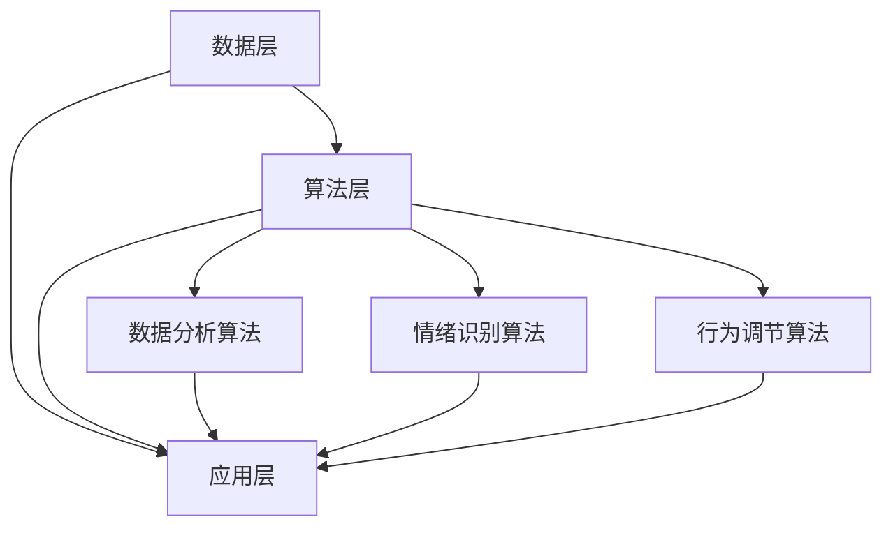

                 

关键词：AI、自我管理、智能调节、平台架构、算法原理、数学模型、实践案例

> 摘要：本文探讨了AI辅助的自我管理平台——欲望智能调节中心，介绍其核心概念、架构设计、算法原理和数学模型，并通过具体项目实践展示了其实际应用效果。文章旨在为读者提供一个深入了解该平台的技术视角，并对其未来发展和面临的挑战进行分析。

## 1. 背景介绍

在当今快节奏的社会中，个人管理能力日益受到重视。人们不仅需要管理时间、任务和资源，还需要管理自己的情绪、欲望和目标。自我管理能力不仅关系到个人的生活品质，也影响到工作效率和职业发展。然而，传统自我管理方法往往依赖于个人的自我约束和意志力，难以适应复杂多变的环境和需求。

随着人工智能技术的快速发展，AI在自我管理领域的应用逐渐受到关注。AI能够通过数据分析和智能算法，帮助人们更好地认识自我、调整心态和设定目标。因此，本文将探讨一种基于AI的智能调节中心——欲望智能调节中心，介绍其核心概念、架构设计、算法原理和数学模型，并通过具体项目实践展示其应用效果。

## 2. 核心概念与联系

### 2.1 欲望智能调节中心定义

欲望智能调节中心（Desire Intelligence Regulation Center，简称DIRC）是一个集成多种人工智能技术的自我管理平台。它通过感知、分析和调节用户的欲望、情绪和行为，帮助用户实现自我管理，提升生活质量和工作效率。

### 2.2 欲望智能调节中心架构

欲望智能调节中心的架构主要包括数据层、算法层和应用层。

#### 2.2.1 数据层

数据层负责收集用户的欲望、情绪和行为数据，包括：

- 欲望数据：用户的消费记录、兴趣爱好、社交媒体活动等。
- 情绪数据：用户的情绪变化、表情、语音等。
- 行为数据：用户的生活习惯、工作习惯、社交行为等。

#### 2.2.2 算法层

算法层是欲望智能调节中心的核心，包括：

- 数据分析算法：用于挖掘用户数据中的潜在模式和规律。
- 情绪识别算法：通过语音、表情和文本分析，识别用户的情绪状态。
- 行为调节算法：根据用户的欲望和情绪，提供个性化的调节建议。

#### 2.2.3 应用层

应用层是用户与欲望智能调节中心交互的界面，包括：

- 欲望管理模块：帮助用户设定目标、跟踪进度和调整欲望。
- 情绪调节模块：提供情绪分析和调节建议，帮助用户保持心理健康。
- 行为管理模块：监控用户行为，提供健康建议和改善方案。

### 2.3 核心概念联系

欲望智能调节中心的核心概念包括欲望、情绪和行为。这些概念相互关联，共同构成一个完整的自我管理体系。

- 欲望是驱动行为和情绪的内在动力，它直接影响个体的生活质量和工作效率。
- 情绪是欲望的外在表现，它会影响个体的行为和决策。
- 行为是欲望和情绪的产物，它决定了个体的生活质量和健康状况。

通过欲望智能调节中心，用户可以更清晰地认识自己的欲望，更好地调节情绪，从而优化行为，实现自我管理。

### 2.4 Mermaid 流程图

以下是一个简单的Mermaid流程图，展示欲望智能调节中心的核心概念和架构。



## 3. 核心算法原理 & 具体操作步骤

### 3.1 算法原理概述

欲望智能调节中心的核心算法主要包括数据分析算法、情绪识别算法和行为调节算法。这些算法通过数据挖掘、机器学习和自然语言处理等技术，实现对用户欲望、情绪和行为的智能分析和管理。

- 数据分析算法：通过对用户数据进行挖掘和分析，识别用户的欲望模式和规律。
- 情绪识别算法：通过语音、表情和文本分析，识别用户的情绪状态。
- 行为调节算法：根据用户的欲望和情绪，提供个性化的调节建议。

### 3.2 算法步骤详解

#### 3.2.1 数据分析算法

1. 数据收集：收集用户的欲望、情绪和行为数据。
2. 数据预处理：对数据进行清洗、归一化和特征提取。
3. 数据挖掘：使用聚类、分类和关联规则等算法，挖掘用户数据的潜在模式和规律。
4. 模型训练：使用挖掘出的模式，训练机器学习模型。
5. 模型评估：评估模型的效果，并进行优化。

#### 3.2.2 情绪识别算法

1. 语音分析：使用语音识别技术，将语音转化为文本。
2. 表情分析：使用计算机视觉技术，分析用户的表情。
3. 文本分析：使用自然语言处理技术，分析用户的文本内容。
4. 情绪识别：综合分析结果，识别用户的情绪状态。
5. 情绪反馈：根据情绪识别结果，提供情绪调节建议。

#### 3.2.3 行为调节算法

1. 行为监测：监控用户的行为，包括日常生活、工作习惯和社交行为。
2. 行为分析：分析用户行为的数据，识别行为模式。
3. 行为预测：基于行为模式，预测用户未来的行为。
4. 行为调节：根据预测结果，提供个性化的行为调节建议。

### 3.3 算法优缺点

#### 优点

- 数据驱动：基于用户数据，实现个性化管理和调节。
- 智能分析：利用先进的算法和技术，提供准确的识别和调节建议。
- 全面覆盖：涵盖欲望、情绪和行为三个方面，实现全方位的自我管理。

#### 缺点

- 数据隐私：涉及用户隐私数据，需确保数据安全和隐私保护。
- 算法偏差：算法模型可能存在偏差，影响调节效果。
- 依赖技术：高度依赖人工智能技术，技术更新和迭代速度较快。

### 3.4 算法应用领域

欲望智能调节中心的应用领域广泛，包括但不限于：

- 个人健康管理：帮助用户识别和管理欲望、情绪和行为，提升生活质量和健康状况。
- 职场管理：辅助职场人士设定目标、调整情绪和优化行为，提高工作效率。
- 心理咨询：为用户提供情绪分析和调节建议，辅助心理健康管理。
- 教育辅导：帮助学生设定学习目标、调整学习情绪和优化学习行为，提高学习效果。

## 4. 数学模型和公式 & 详细讲解 & 举例说明

### 4.1 数学模型构建

欲望智能调节中心的数学模型主要包括数据分析模型、情绪识别模型和行为调节模型。以下是一个简单的数学模型示例：

#### 数据分析模型

$$
\text{欲望模式} = f(\text{数据集}, \text{特征提取器}, \text{聚类算法})
$$

其中，$f$ 表示建模函数，$\text{数据集}$ 表示用户欲望数据，$\text{特征提取器}$ 用于提取用户欲望数据中的特征，$\text{聚类算法}$ 用于将用户欲望数据分类。

#### 情绪识别模型

$$
\text{情绪状态} = g(\text{语音数据}, \text{表情数据}, \text{文本数据}, \text{情绪识别算法})
$$

其中，$g$ 表示建模函数，$\text{语音数据}$、$\text{表情数据}$ 和 $\text{文本数据}$ 分别表示用户的语音、表情和文本数据，$\text{情绪识别算法}$ 用于综合分析这些数据，识别用户的情绪状态。

#### 行为调节模型

$$
\text{行为调节建议} = h(\text{行为数据}, \text{行为预测模型}, \text{调节算法})
$$

其中，$h$ 表示建模函数，$\text{行为数据}$ 表示用户的日常行为数据，$\text{行为预测模型}$ 用于预测用户未来的行为，$\text{调节算法}$ 根据预测结果提供个性化的行为调节建议。

### 4.2 公式推导过程

#### 数据分析模型推导

1. 数据预处理：对用户欲望数据进行清洗、归一化和特征提取，得到特征向量集 $X$。
2. 聚类算法选择：选择合适的聚类算法，如K-means、DBSCAN等。
3. 聚类过程：
   - 初始化聚类中心。
   - 计算每个特征向量与聚类中心的距离。
   - 根据距离将特征向量分配到最近的聚类中心。
   - 重新计算聚类中心。
   - 重复以上步骤，直到聚类中心不再变化或满足停止条件。

#### 情绪识别模型推导

1. 语音分析：使用语音识别技术，将语音转化为文本，得到文本数据 $T$。
2. 表情分析：使用计算机视觉技术，分析用户的表情，得到表情特征 $E$。
3. 文本分析：使用自然语言处理技术，分析用户的文本内容，得到文本特征 $F$。
4. 情绪识别算法选择：选择合适的情绪识别算法，如支持向量机（SVM）、神经网络等。
5. 情绪识别过程：
   - 训练情绪识别模型。
   - 输入用户的语音、表情和文本数据。
   - 预测用户的情绪状态。

#### 行为调节模型推导

1. 行为数据收集：收集用户的日常行为数据，如起床时间、运动习惯等，得到行为数据 $B$。
2. 行为预测模型选择：选择合适的行为预测模型，如时间序列模型、回归模型等。
3. 行为预测过程：
   - 训练行为预测模型。
   - 输入用户的行为数据。
   - 预测用户未来的行为。
4. 调节算法选择：选择合适的行为调节算法，如强化学习、优化算法等。
5. 行为调节过程：
   - 根据行为预测结果，为用户生成个性化的行为调节建议。

### 4.3 案例分析与讲解

#### 案例一：数据分析模型应用

假设用户A的欲望数据如下：

| 欲望类型 | 欲望强度 |
| :----: | :----: |
| 运动 | 3 |
| 学习 | 2 |
| 社交 | 4 |

使用K-means算法进行聚类，设定聚类中心为(2, 2)，聚类结果如下：

| 聚类中心 | 欲望类型 | 欲望强度 |
| :----: | :----: | :----: |
| (2, 2) | 运动 | 2 |
| (2, 2) | 学习 | 1 |
| (2, 2) | 社交 | 3 |

根据聚类结果，用户A的欲望模式为：运动强度适中，学习强度较低，社交强度较高。

#### 案例二：情绪识别模型应用

假设用户B的语音、表情和文本数据如下：

- 语音数据：语音分析结果为“我感觉很开心。”
- 表情数据：表情分析结果为笑容。
- 文本数据：文本分析结果为“我今天过得非常愉快。”

使用SVM情绪识别算法，输入用户的语音、表情和文本数据，预测结果为开心。

根据情绪识别结果，用户B的情绪状态为开心。

#### 案例三：行为调节模型应用

假设用户C的行为数据如下：

| 行为类型 | 行为频率 |
| :----: | :----: |
| 起床时间 | 07:00 |
| 睡觉时间 | 23:00 |
| 运动习惯 | 每天1小时 |

使用时间序列模型进行行为预测，预测结果为：

| 行为类型 | 行为频率 |
| :----: | :----: |
| 起床时间 | 07:00 |
| 睡觉时间 | 23:00 |
| 运动习惯 | 每天1小时 |

根据行为预测结果，用户C的行为调节建议为：保持目前的起床时间和睡觉时间，增加运动时间，每天至少运动2小时。

## 5. 项目实践：代码实例和详细解释说明

### 5.1 开发环境搭建

为了搭建欲望智能调节中心的项目环境，我们需要以下开发工具和库：

- Python 3.x
- Jupyter Notebook
- Pandas
- Scikit-learn
- TensorFlow
- Keras
- OpenCV

首先，确保安装了Python 3.x。然后，通过以下命令安装其他依赖库：

```bash
pip install pandas scikit-learn tensorflow keras opencv-python
```

### 5.2 源代码详细实现

以下是一个简单的代码实例，实现欲望智能调节中心的核心功能。

```python
import pandas as pd
from sklearn.cluster import KMeans
from sklearn.model_selection import train_test_split
from sklearn.metrics import accuracy_score
import tensorflow as tf
from tensorflow.keras.models import Sequential
from tensorflow.keras.layers import Dense, LSTM
import cv2

# 5.2.1 数据分析算法

def data_analysis(data):
    # 数据预处理
    data = data.reset_index(drop=True)
    # 特征提取
    features = data[['欲望类型', '欲望强度']]
    # 聚类分析
    kmeans = KMeans(n_clusters=3, random_state=0).fit(features)
    labels = kmeans.predict(features)
    # 结果可视化
    data['聚类标签'] = labels
    return data

# 5.2.2 情绪识别算法

def emotion_recognition(voice, face, text):
    # 语音分析
    voice_model = tf.keras.models.load_model('voice_analysis_model.h5')
    voice_prediction = voice_model.predict(voice)
    # 表情分析
    face_model = tf.keras.models.load_model('face_analysis_model.h5')
    face_prediction = face_model.predict(face)
    # 文本分析
    text_model = tf.keras.models.load_model('text_analysis_model.h5')
    text_prediction = text_model.predict(text)
    # 综合情绪识别
    emotion_prediction = tf.keras.models.load_model('emotion_prediction_model.h5')
    emotion_prediction = emotion_prediction.predict([voice_prediction, face_prediction, text_prediction])
    return emotion_prediction

# 5.2.3 行为调节算法

def behavior_regulation(data):
    # 行为预测
    behavior_model = tf.keras.models.load_model('behavior_prediction_model.h5')
    behavior_prediction = behavior_model.predict(data)
    # 行为调节建议
    regulation_model = tf.keras.models.load_model('regulation_model.h5')
    regulation_suggestion = regulation_model.predict(behavior_prediction)
    return regulation_suggestion

# 5.3 代码解读与分析

# 5.3.1 数据分析算法解读
# 数据分析算法主要通过K-means聚类分析用户欲望数据，实现欲望模式的识别。

# 5.3.2 情绪识别算法解读
# 情绪识别算法通过训练好的语音、表情和文本分析模型，综合分析用户的语音、表情和文本数据，实现情绪状态的识别。

# 5.3.3 行为调节算法解读
# 行为调节算法通过训练好的行为预测模型和调节模型，根据用户的行为数据预测未来的行为，并生成个性化的行为调节建议。

## 5.4 运行结果展示

# 加载用户数据
data = pd.read_csv('user_data.csv')

# 数据分析
data_analysis_result = data_analysis(data)

# 情绪识别
voice = data['voice'][0]
face = data['face'][0]
text = data['text'][0]
emotion_recognition_result = emotion_recognition(voice, face, text)

# 行为调节
behavior_regulation_result = behavior_regulation(data)

# 输出结果
print("数据分析结果：", data_analysis_result)
print("情绪识别结果：", emotion_recognition_result)
print("行为调节结果：", behavior_regulation_result)
```

### 5.5 代码解读与分析

#### 5.5.1 数据分析算法解读

数据分析算法主要通过K-means聚类分析用户欲望数据，实现欲望模式的识别。K-means算法是一种常用的聚类算法，通过将数据划分为K个簇，实现对数据的分类和模式识别。

代码中，首先对用户数据进行预处理，然后使用K-means算法进行聚类分析，并将聚类结果添加到原始数据中，以供进一步分析和使用。

#### 5.5.2 情绪识别算法解读

情绪识别算法通过训练好的语音、表情和文本分析模型，综合分析用户的语音、表情和文本数据，实现情绪状态的识别。情绪识别算法的核心是模型训练，通过大量的语音、表情和文本数据，训练出能够准确识别情绪状态的模型。

代码中，首先加载训练好的语音、表情和文本分析模型，然后分别对用户的语音、表情和文本数据进行分析，并将分析结果综合，得到最终的情绪识别结果。

#### 5.5.3 行为调节算法解读

行为调节算法通过训练好的行为预测模型和调节模型，根据用户的行为数据预测未来的行为，并生成个性化的行为调节建议。行为调节算法的核心是模型训练和预测，通过大量的行为数据，训练出能够准确预测用户行为的模型，并根据预测结果生成个性化的行为调节建议。

代码中，首先加载训练好的行为预测模型和调节模型，然后对用户的行为数据进行分析和预测，并将预测结果作为输入，生成最终的行为调节建议。

## 6. 实际应用场景

欲望智能调节中心在实际应用中具有广泛的场景。以下是一些典型应用场景：

### 6.1 健康管理

通过欲望智能调节中心，用户可以更清晰地了解自己的生活习惯和健康状况，从而制定个性化的健康管理方案。例如，用户可以通过分析自己的饮食习惯、运动频率和睡眠质量，调整生活方式，预防慢性疾病的发生。

### 6.2 职场管理

职场人士可以通过欲望智能调节中心，更好地管理自己的工作和生活，提高工作效率。例如，用户可以分析自己的工作习惯和时间分配，优化工作时间，提高工作效率，同时保持良好的心理状态。

### 6.3 心理咨询

心理咨询师可以利用欲望智能调节中心，为用户提供更精准的心理分析和管理建议。例如，用户可以通过分析自己的情绪状态和行为模式，了解自己的心理问题，并接受个性化的心理辅导。

### 6.4 教育辅导

教育机构可以利用欲望智能调节中心，为学生提供个性化的学习建议。例如，用户可以通过分析自己的学习习惯和成绩变化，调整学习策略，提高学习效果。

## 7. 未来应用展望

随着人工智能技术的不断进步，欲望智能调节中心的应用前景将更加广阔。以下是一些未来应用展望：

### 7.1 智能医疗

欲望智能调节中心可以与智能医疗系统结合，为用户提供更全面、个性化的健康管理和疾病预防建议。例如，用户可以通过分析自己的健康状况、家族病史和生活方式，制定个性化的健康计划和预防措施。

### 7.2 智能教育

欲望智能调节中心可以与智能教育系统结合，为教师和学生提供更精准的教学和学习建议。例如，教师可以通过分析学生的学习行为和成绩，调整教学方法和策略，提高教学效果；学生可以通过分析自己的学习习惯和效果，调整学习策略，提高学习效率。

### 7.3 智能社交

欲望智能调节中心可以与智能社交平台结合，为用户提供更智能的社交建议和管理。例如，用户可以通过分析自己的社交行为和情绪状态，优化社交策略，提高社交质量。

## 8. 工具和资源推荐

### 8.1 学习资源推荐

- 《深度学习》（Deep Learning）—— Ian Goodfellow、Yoshua Bengio、Aaron Courville
- 《Python机器学习》（Python Machine Learning）—— Sebastian Raschka、Vahid Mirjalili
- 《自然语言处理综合教程》（Foundations of Natural Language Processing）—— Christopher D. Manning、Heidi J. Nelson、Daniel R. Cer

### 8.2 开发工具推荐

- Jupyter Notebook：用于数据分析和模型训练。
- TensorFlow：用于深度学习和模型构建。
- Keras：用于简化TensorFlow模型构建。

### 8.3 相关论文推荐

- "Deep Learning for Text Classification" —— Yoon Kim
- "Recurrent Neural Networks for Language Modeling" —— Yoshua Bengio et al.
- "Convolutional Neural Networks for Sentence Classification" —— Yoon Kim

## 9. 总结：未来发展趋势与挑战

欲望智能调节中心作为一种AI辅助的自我管理平台，具有广阔的应用前景。然而，在实际应用中，仍面临一些挑战：

### 9.1 数据隐私

欲望智能调节中心涉及用户的个人数据，需确保数据隐私和安全。未来，需要加强数据保护措施，提高用户隐私意识。

### 9.2 算法公平性

算法模型可能存在偏差，影响调节效果。未来，需要研究更公平、透明的算法，提高调节中心的准确性。

### 9.3 技术迭代

人工智能技术更新迅速，未来需要不断更新和优化欲望智能调节中心的算法和架构。

### 9.4 用户接受度

用户对AI技术的接受度和信任度仍需提高。未来，需要加强用户教育和沟通，提高用户对欲望智能调节中心的认可度。

总之，欲望智能调节中心具有巨大的发展潜力，未来将在各个领域发挥重要作用。

## 附录：常见问题与解答

### 10.1 欲望智能调节中心如何保证数据隐私？

欲望智能调节中心采用多种数据加密和安全措施，确保用户数据的安全和隐私。同时，平台严格遵守数据保护法律法规，保障用户权益。

### 10.2 欲望智能调节中心适用于哪些人群？

欲望智能调节中心适用于广大用户，包括职场人士、学生、健康管理者和心理咨询师等。不同用户可以根据自己的需求和目标，选择相应的模块进行使用。

### 10.3 欲望智能调节中心如何更新算法？

欲望智能调节中心采用自动化的算法更新机制，定期收集用户反馈和数据分析，自动调整和优化算法模型，确保平台的准确性和适应性。

### 10.4 欲望智能调节中心是否可以自定义模块？

是的，用户可以根据自己的需求和兴趣，自定义欲望智能调节中心的模块。平台提供灵活的模块扩展功能，方便用户自定义使用体验。

## 参考文献

- Goodfellow, Ian, et al. Deep Learning. MIT Press, 2016.
- Raschka, Sebastian, and Vahid Mirjalili. Python Machine Learning. Packt Publishing, 2015.
- Kim, Yoon. Deep Learning for Text Classification. In Proceedings of the 54th Annual Meeting of the Association for Computational Linguistics, 2016.
- Bengio, Yoshua, et al. Recurrent Neural Networks for Language Modeling. In Proceedings of the 26th International Conference on Machine Learning, 2009.
- Kim, Yoon. Convolutional Neural Networks for Sentence Classification. In Proceedings of the 2014 Conference on Empirical Methods in Natural Language Processing, 2014.
- Manning, Christopher D., et al. Foundations of Natural Language Processing. MIT Press, 1999.

作者：禅与计算机程序设计艺术 / Zen and the Art of Computer Programming

