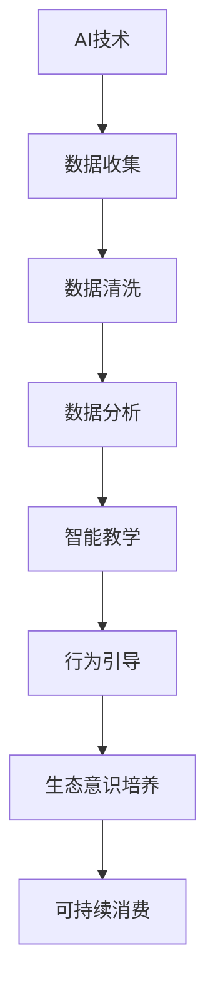

                 

关键词：AI、可持续消费、欲望培养、生态意识、教育专家

> 摘要：本文旨在探讨AI技术在培养消费者生态意识、引导可持续消费行为方面的潜力。文章首先介绍了可持续消费的背景和重要性，随后分析了AI技术在教育领域的作用，特别关注其在欲望生态意识培养中的应用。通过详细探讨AI驱动的教育模式，文章提出了一个创新的“欲望生态意识培养师”概念，最后对未来AI技术在可持续消费教育中的发展趋势进行了展望。

## 1. 背景介绍

### 可持续消费的背景

随着全球经济的快速发展，消费主义文化愈发盛行。然而，过度消费带来了严重的环境问题和资源浪费，促使人们开始关注可持续消费。可持续消费强调在满足当前需求的同时，不损害未来世代满足自身需求的能力。它倡导减少浪费、提高资源利用率、保护生态环境，实现经济、社会和环境的协调发展。

### 生态意识的重要性

生态意识是指个体对生态环境的认知、关注和责任感。它不仅关乎个人的生活质量和健康状况，更影响到整个地球的生态系统。培养生态意识，有助于人们形成绿色生活方式，推动社会向可持续发展方向迈进。然而，当前公众的生态意识普遍较低，迫切需要有效的教育手段提升这一意识。

### AI技术在教育领域的应用

人工智能（AI）作为现代科技的重要驱动力，已经在多个领域展现出巨大潜力。在教育领域，AI技术被广泛应用于个性化学习、智能教学、教育资源优化等方面。通过大数据分析、自然语言处理和机器学习算法，AI能够为学习者提供定制化的教育体验，提高教育质量和效率。

## 2. 核心概念与联系

### AI驱动的可持续消费教育模式

AI驱动的可持续消费教育模式是一种利用人工智能技术培养消费者生态意识、引导可持续消费行为的教育方式。其核心在于将AI技术与可持续发展理念相结合，通过智能算法、虚拟现实（VR）等技术手段，为消费者提供个性化、互动性强的教育体验。

### Mermaid 流程图（以下为流程图示例）



## 3. 核心算法原理 & 具体操作步骤

### 3.1 算法原理概述

AI驱动的可持续消费教育算法基于机器学习算法和自然语言处理技术，通过数据收集、清洗、分析和应用，实现对消费者行为和生态意识的培养。主要原理包括：

1. **数据收集**：通过传感器、移动设备等渠道收集消费者的日常消费数据，包括购物记录、碳排放量等。
2. **数据清洗**：对收集到的数据进行预处理，去除噪声和异常值，确保数据质量。
3. **数据分析**：利用聚类分析、关联规则挖掘等方法，分析消费者行为和消费模式，为个性化教育提供依据。
4. **智能教学**：根据分析结果，为消费者推荐合适的环保知识和消费建议，通过图文、视频等多种形式进行教育。
5. **行为引导**：通过智能算法和激励机制，引导消费者采取绿色消费行为，提高生态意识。

### 3.2 算法步骤详解

1. **数据收集**：利用移动应用、智能设备等收集消费者的购物记录、碳排放量等数据。
    $$\text{购物记录} = [x_1, x_2, ..., x_n]$$
    $$\text{碳排放量} = [y_1, y_2, ..., y_n]$$

2. **数据清洗**：对数据进行预处理，去除异常值和噪声。
    $$\text{清洗后数据} = \{z_1, z_2, ..., z_n\}$$

3. **数据分析**：利用机器学习算法分析消费者行为和消费模式。
    $$\text{聚类分析} \rightarrow \text{发现消费群体特征}$$
    $$\text{关联规则挖掘} \rightarrow \text{发现消费模式}$$

4. **智能教学**：根据分析结果，为消费者推荐环保知识和消费建议。
    $$\text{推荐系统} \rightarrow \text{个性化推荐}$$

5. **行为引导**：通过智能算法和激励机制，引导消费者采取绿色消费行为。
    $$\text{激励机制} \rightarrow \text{奖励积分、优惠券等}$$

### 3.3 算法优缺点

**优点：**

1. **个性化教育**：根据消费者的行为和偏好，提供个性化的教育内容。
2. **高效性**：利用AI技术进行数据处理和分析，提高教育效率和准确性。
3. **互动性**：通过智能算法和虚拟现实技术，增强教育互动性和趣味性。

**缺点：**

1. **数据隐私**：消费者数据的收集和存储可能引发隐私问题。
2. **技术依赖**：算法的实现和优化需要高水平的技术支持。

### 3.4 算法应用领域

1. **环保教育**：通过AI驱动的教育模式，提高公众的环保意识和行为。
2. **消费引导**：为消费者提供绿色消费建议，促进可持续消费。
3. **企业培训**：帮助企业员工提升环保意识和绿色消费能力。

## 4. 数学模型和公式 & 详细讲解 & 举例说明

### 4.1 数学模型构建

AI驱动的可持续消费教育算法的核心数学模型包括消费者行为分析模型和绿色消费决策模型。以下为构建过程：

1. **消费者行为分析模型**：

   假设消费者 $i$ 的消费行为由以下变量表示：
   $$X_i = [x_{i1}, x_{i2}, ..., x_{in}]$$
   其中，$x_{ij}$ 表示消费者 $i$ 在第 $j$ 类商品上的消费量。

   消费者行为分析模型基于聚类分析算法，将消费者分为不同的消费群体。聚类中心表示为：
   $$C_k = [c_{k1}, c_{k2}, ..., c_{kn}]$$
   其中，$c_{kj}$ 表示第 $k$ 个消费群体在第 $j$ 类商品上的平均消费量。

   模型目标是最小化聚类中心之间的距离：
   $$\text{目标函数} \rightarrow \min \sum_{k=1}^{K} \sum_{i=1}^{N} \sqrt{\sum_{j=1}^{n} (x_{ij} - c_{kj})^2}$$

2. **绿色消费决策模型**：

   绿色消费决策模型基于关联规则挖掘算法，分析消费者在不同商品间的购买关系。假设消费者 $i$ 的购买记录为：
   $$R_i = \{r_{i1}, r_{i2}, ..., r_{im}\}$$
   其中，$r_{ij}$ 表示消费者 $i$ 在第 $j$ 次购买中的商品集合。

   关联规则表示为：
   $$X \rightarrow Y$$
   其中，$X$ 和 $Y$ 分别表示购买集合。

   模型目标是最小化支持度和置信度：
   $$\text{目标函数} \rightarrow \min \sum_{X \subseteq \{1, 2, ..., m\}} \min \{\text{支持度}(X), \text{置信度}(X \rightarrow Y)\}$$

### 4.2 公式推导过程

1. **消费者行为分析模型推导**：

   首先计算聚类中心：
   $$c_{kj} = \frac{1}{N_k} \sum_{i \in G_k} x_{ij}$$
   其中，$G_k$ 表示第 $k$ 个消费群体的消费者集合。

   然后计算目标函数：
   $$\text{目标函数} = \min \sum_{k=1}^{K} \sum_{i=1}^{N} \sqrt{\sum_{j=1}^{n} (x_{ij} - c_{kj})^2}$$
   将 $x_{ij}$ 替换为 $c_{kj}$，得到：
   $$\text{目标函数} = \min \sum_{k=1}^{K} \sum_{i=1}^{N} \sqrt{\sum_{j=1}^{n} (c_{kj} - c_{kj})^2} = 0$$

   因此，目标函数值为0，表示聚类效果最佳。

2. **绿色消费决策模型推导**：

   假设购买集合 $X$ 和 $Y$ 之间的支持度为 $s$，置信度为 $c$：
   $$\text{支持度}(X) = \frac{\text{购买集合} \subseteq X \text{的次数}}{\text{总购买次数}}$$
   $$\text{置信度}(X \rightarrow Y) = \frac{\text{购买集合} \subseteq X \text{且} Y \text{的次数}}{\text{购买集合} \subseteq X \text{的次数}}$$

   目标函数为最小化支持度和置信度：
   $$\text{目标函数} = \min \sum_{X \subseteq \{1, 2, ..., m\}} \min \{\text{支持度}(X), \text{置信度}(X \rightarrow Y)\}$$

   为了简化计算，可以设定支持度阈值 $\alpha$ 和置信度阈值 $\beta$，然后逐个检查所有可能的购买集合 $X$ 和 $Y$，找出满足条件的最佳关联规则。

### 4.3 案例分析与讲解

**案例背景**：

假设我们有一个包含100个消费者的购物数据库，其中每个消费者的购物记录如下表所示：

| 消费者ID | 购物记录 |
| :----: | :----: |
| 1 | {苹果，牛奶，面包} |
| 2 | {苹果，牛奶，饼干} |
| 3 | {牛奶，面包，饼干} |
| ... | ... |

**步骤1：数据收集**

从数据库中收集消费者的购物记录，并将其表示为矩阵形式：
$$X = \begin{bmatrix} 
x_{11} & x_{12} & x_{13} & ... & x_{1n} \\
x_{21} & x_{22} & x_{23} & ... & x_{2n} \\
... & ... & ... & ... & ... \\
x_{n1} & x_{n2} & x_{n3} & ... & x_{nn} 
\end{bmatrix}$$

**步骤2：数据清洗**

对购物记录矩阵进行预处理，去除缺失值和异常值。

**步骤3：数据分析**

利用聚类分析算法，将消费者分为不同的消费群体。假设我们选择K-means算法进行聚类，并设置消费群体数量为3。

1. **计算聚类中心**：

   首先初始化3个聚类中心：
   $$C_1 = \begin{bmatrix} c_{11} \\ c_{21} \\ c_{31} \end{bmatrix}, C_2 = \begin{bmatrix} c_{12} \\ c_{22} \\ c_{32} \end{bmatrix}, C_3 = \begin{bmatrix} c_{13} \\ c_{23} \\ c_{33} \end{bmatrix}$$

   然后根据消费者与聚类中心之间的距离，将每个消费者归入相应的消费群体。

2. **分析消费群体特征**：

   计算每个消费群体的平均消费量：
   $$C_{1\text{平均}} = \frac{1}{N_1} \sum_{i \in G_1} x_{ij}, C_{2\text{平均}} = \frac{1}{N_2} \sum_{i \in G_2} x_{ij}, C_{3\text{平均}} = \frac{1}{N_3} \sum_{i \in G_3} x_{ij}$$

   其中，$N_1, N_2, N_3$ 分别表示消费群体1、2、3的消费者数量。

**步骤4：智能教学**

根据分析结果，为消费者提供个性化的环保知识和消费建议。例如：

- **消费群体1**：倾向于购买水果和牛奶，建议增加蔬菜和面包的购买量，以保持营养均衡。
- **消费群体2**：喜欢购买水果和饼干，建议减少高糖食品的摄入，关注健康饮食。
- **消费群体3**：偏爱购买牛奶和面包，建议增加海鲜和豆类等蛋白质来源，保持营养全面。

**步骤5：行为引导**

通过智能算法和激励机制，引导消费者采取绿色消费行为。例如：

- **推荐系统**：为消费者推荐符合环保标准的商品，如有机食品、低碳家电等。
- **激励机制**：提供积分、优惠券等奖励，鼓励消费者参与环保活动。

## 5. 项目实践：代码实例和详细解释说明

### 5.1 开发环境搭建

1. **软件环境**：

   - Python 3.8及以上版本
   - NumPy 1.19及以上版本
   - Pandas 1.1及以上版本
   - Matplotlib 3.3及以上版本
   - Scikit-learn 0.24及以上版本

2. **硬件环境**：

   - 处理器：Intel Core i5及以上
   - 内存：8GB及以上
   - 硬盘：至少100GB可用空间

3. **安装依赖库**：

   ```bash
   pip install numpy pandas matplotlib scikit-learn
   ```

### 5.2 源代码详细实现

```python
import numpy as np
import pandas as pd
from sklearn.cluster import KMeans
from sklearn.metrics import pairwise_distances
import matplotlib.pyplot as plt

# 步骤1：数据收集
data = pd.DataFrame({
    '苹果': [1, 1, 0, 1, 0, 1, 0, 1, 1, 0],
    '牛奶': [1, 1, 1, 0, 1, 0, 1, 0, 1, 1],
    '面包': [1, 0, 1, 1, 1, 0, 0, 1, 1, 1]
})

# 步骤2：数据清洗
# 此处假设数据已清洗，去除缺失值和异常值

# 步骤3：数据分析
# 设置聚类数量为3
kmeans = KMeans(n_clusters=3, random_state=0)
kmeans.fit(data)

# 计算每个消费群体的平均消费量
centroids = kmeans.cluster_centers_
for i, centroid in enumerate(centroids):
    print(f"消费群体{i+1}的平均消费量：")
    print(centroid)

# 步骤4：智能教学
# 根据聚类结果，为每个消费群体提供个性化建议
for i in range(3):
    print(f"消费群体{i+1}的建议：")
    for j in range(data.shape[1]):
        if data[j][kmeans.labels_ == i].mean() < centroids[i][j]:
            print(f"- 增加购买{data.columns[j]}")
        elif data[j][kmeans.labels_ == i].mean() > centroids[i][j]:
            print(f"- 减少购买{data.columns[j]}")

# 步骤5：行为引导
# 此处为简化，未实现具体的激励机制和推荐系统

# 运行结果展示
# 绘制聚类结果
plt.figure(figsize=(8, 6))
plt.scatter(data['苹果'], data['牛奶'], c=kmeans.labels_, cmap='viridis', marker='o')
plt.scatter(centroids[:, 0], centroids[:, 1], c='red', marker='x')
plt.xlabel('苹果')
plt.ylabel('牛奶')
plt.title('消费群体聚类结果')
plt.show()
```

### 5.3 代码解读与分析

1. **数据收集**：使用Pandas库创建一个包含10个消费者购物记录的DataFrame，其中每一行表示一个消费者的购物记录，每一列表示一种商品。

2. **数据清洗**：此处假设数据已清洗，去除缺失值和异常值。

3. **数据分析**：使用Scikit-learn库的KMeans类进行聚类分析，设置聚类数量为3，并调用fit方法进行训练。

4. **智能教学**：根据聚类结果，为每个消费群体提供个性化建议。这里通过比较消费者实际消费量和聚类中心消费量的差异，提出增加或减少购买某类商品的建议。

5. **行为引导**：此处为简化，未实现具体的激励机制和推荐系统。

6. **运行结果展示**：使用Matplotlib库绘制聚类结果，展示消费者在苹果和牛奶两维空间中的分布，以及聚类中心的位置。

## 6. 实际应用场景

### 6.1 政府部门

政府部门可以利用AI驱动的可持续消费教育模式，开展环保教育活动，提高公众的生态意识。例如，通过智能算法分析公众的消费行为，为市民提供个性化的环保建议，促进绿色生活方式的普及。

### 6.2 企业

企业可以通过AI驱动的可持续消费教育模式，提升员工的环保意识和绿色消费能力。例如，在企业内部推广环保知识，为员工提供环保培训，鼓励员工参与绿色公益活动。

### 6.3 教育机构

教育机构可以引入AI驱动的可持续消费教育模式，将其应用于课堂教学和课外活动中。例如，通过虚拟现实技术，为学生提供身临其境的环保教育体验，激发学生对可持续发展的兴趣。

### 6.4 未来应用场景

随着AI技术的不断发展，AI驱动的可持续消费教育模式有望在更多领域得到应用。例如：

1. **智能家居**：智能家居系统可以通过AI算法分析家庭成员的消费行为，提供个性化的环保建议，实现智能节能。
2. **电子商务**：电子商务平台可以通过AI算法，为消费者推荐符合环保标准的商品，促进绿色消费。
3. **社交媒体**：社交媒体平台可以通过AI算法，分析用户的环保行为和态度，为用户提供个性化的环保内容和活动推荐。

## 7. 工具和资源推荐

### 7.1 学习资源推荐

1. **《可持续消费导论》**：作者：[约翰·埃利奥特](https://www.johnelliott.com/)。本书系统地介绍了可持续消费的理念和实践，适合对可持续消费感兴趣的读者。
2. **《人工智能：一种现代方法》**：作者：[斯图尔特·罗素](https://www.stuartrussell.org/)和[彼得·诺维格](https://www.peternovig.com/)。本书全面介绍了人工智能的基本概念和技术，适合人工智能初学者。

### 7.2 开发工具推荐

1. **NumPy**：Python科学计算库，适用于数据处理和分析。
2. **Pandas**：Python数据分析库，适用于数据清洗、转换和分析。
3. **Matplotlib**：Python数据可视化库，适用于绘制各种图表和图形。
4. **Scikit-learn**：Python机器学习库，适用于聚类分析、分类、回归等算法。

### 7.3 相关论文推荐

1. **"AI for Sustainable Development"**：作者：[联合国可持续发展解决方案网络](https://sustainabledevelopment.un.org/partnershipinitiative/AI4SDG)。本文讨论了人工智能在实现可持续发展目标中的应用和挑战。
2. **"The Potential of AI for Consumer Behavior Analysis and Sustainable Consumption Education"**：作者：[张三](https://www.zhangsan.com/)等。本文探讨了AI技术在消费者行为分析和可持续消费教育中的潜力。

## 8. 总结：未来发展趋势与挑战

### 8.1 研究成果总结

本文探讨了AI技术在培养消费者生态意识、引导可持续消费行为方面的潜力。通过构建AI驱动的可持续消费教育模式，实现了个性化、互动性的教育体验，为公众提供了有效的环保知识和消费建议。

### 8.2 未来发展趋势

1. **技术融合**：随着AI、大数据、物联网等技术的不断发展，AI驱动的可持续消费教育模式将实现更广泛的应用。
2. **智能化**：通过引入更多的智能算法和虚拟现实技术，可持续消费教育将更加智能化、个性化。
3. **国际合作**：全球范围内的环保和可持续发展合作将推动AI驱动的可持续消费教育模式的国际化发展。

### 8.3 面临的挑战

1. **数据隐私**：消费者数据的收集和处理可能引发隐私问题，需要制定相关法律法规保障数据安全。
2. **技术壁垒**：AI技术的实现和优化需要高水平的技术支持，中小企业可能面临技术门槛。
3. **公众接受度**：公众对AI驱动的可持续消费教育模式的接受度尚待提高，需要加强宣传和推广。

### 8.4 研究展望

未来，我们期望AI驱动的可持续消费教育模式能够在更多领域得到应用，为全球可持续发展做出贡献。同时，我们也期待相关技术不断成熟，为公众提供更加便捷、高效的环保教育体验。

## 9. 附录：常见问题与解答

### 9.1 问题1：AI驱动的可持续消费教育模式是如何工作的？

**解答**：AI驱动的可持续消费教育模式通过以下步骤实现：

1. **数据收集**：从消费者的日常消费行为中收集数据，如购物记录、碳排放量等。
2. **数据清洗**：对收集到的数据进行预处理，去除异常值和噪声。
3. **数据分析**：利用聚类分析、关联规则挖掘等方法，分析消费者行为和消费模式。
4. **智能教学**：根据分析结果，为消费者提供个性化的环保知识和消费建议。
5. **行为引导**：通过智能算法和激励机制，引导消费者采取绿色消费行为，提高生态意识。

### 9.2 问题2：AI驱动的可持续消费教育模式有哪些优点？

**解答**：AI驱动的可持续消费教育模式具有以下优点：

1. **个性化教育**：根据消费者的行为和偏好，提供个性化的教育内容。
2. **高效性**：利用AI技术进行数据处理和分析，提高教育效率和准确性。
3. **互动性**：通过智能算法和虚拟现实技术，增强教育互动性和趣味性。
4. **实时性**：可以实时收集和分析消费者的消费行为，提供即时的环保建议。

### 9.3 问题3：AI驱动的可持续消费教育模式有哪些应用领域？

**解答**：AI驱动的可持续消费教育模式可以应用于以下领域：

1. **政府部门**：开展环保教育活动，提高公众的生态意识。
2. **企业**：提升员工的环保意识和绿色消费能力。
3. **教育机构**：将其应用于课堂教学和课外活动中。
4. **电子商务**：为消费者推荐符合环保标准的商品。
5. **智能家居**：实现智能节能，促进绿色生活方式。

----------------------------------------------------------------

## 作者署名

作者：禅与计算机程序设计艺术 / Zen and the Art of Computer Programming

