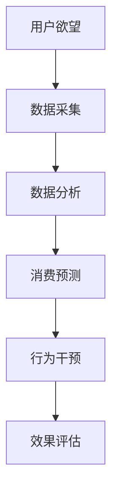

                 

关键词：人工智能，可持续消费，欲望管理，生态系统，AI驱动

> 摘要：本文探讨了如何利用人工智能技术，特别是深度学习算法，来构建一个可持续消费的欲望管理生态系统。本文首先介绍了欲望生态系统的基本概念和重要性，然后深入分析了人工智能在欲望管理中的作用和挑战。接着，本文提出了一个基于深度学习的欲望管理算法框架，并详细解释了其原理和应用。通过实际项目案例，展示了算法的可行性和效果。最后，本文对未来的研究方向和应用前景进行了展望。

## 1. 背景介绍

在现代社会，消费行为已经成为人们生活中不可或缺的一部分。然而，随着消费水平的不断提高，过度消费、资源浪费和环境污染等问题也日益凸显。传统的方法往往侧重于教育和行为改变，但这些方法往往效果有限，难以从根本上解决消费欲望过度的问题。

近年来，人工智能技术的发展为解决这一问题提供了新的思路。通过机器学习和深度学习算法，我们可以更好地理解和预测人们的消费行为，从而制定更有效的管理策略。本文将探讨如何利用人工智能技术，特别是深度学习算法，来构建一个可持续消费的欲望管理生态系统。

### 1.1 可持续消费的重要性

可持续消费是一种以环境保护和社会责任为核心价值观的消费模式。它强调在满足个人需求的同时，也要考虑对环境的长期影响。可持续消费的重要性体现在以下几个方面：

- **环境保护**：过度消费会导致资源过度开采和环境污染，威胁到生态系统的平衡和人类的健康。
- **社会公平**：可持续消费鼓励购买当地产品和公平贸易产品，减少贫困和不平等现象。
- **经济可持续**：通过提高资源利用效率，减少浪费，可以降低企业的运营成本，提高市场竞争力。

### 1.2 人工智能在欲望管理中的应用

人工智能在欲望管理中的应用主要包括以下几个方面：

- **行为分析**：通过分析个人的消费行为数据，识别消费模式和偏好，从而提供个性化的消费建议。
- **需求预测**：利用历史数据和市场趋势，预测未来的消费需求和趋势，帮助企业制定更有效的生产和营销策略。
- **心理干预**：通过分析心理和行为数据，提供个性化的心理干预措施，帮助人们控制消费欲望。

## 2. 核心概念与联系

### 2.1 欲望生态系统的基本概念

欲望生态系统是指由人的欲望、行为、环境、社会和文化等因素组成的复杂系统。在这个系统中，人的欲望是核心驱动力，而环境和社会因素则对欲望的产生和满足产生重要影响。

- **人的欲望**：人的欲望是多样化的，包括物质欲望、精神欲望和生理欲望等。这些欲望受到个人心理、生理、社会和文化等多种因素的影响。
- **行为**：行为是欲望的体现，包括消费、节约、分享等。行为不仅受到欲望的驱动，也受到社会规范和文化价值观的约束。
- **环境**：环境包括自然环境和人工环境，如气候、资源、基础设施等。环境对欲望的满足具有直接影响。
- **社会**：社会包括家庭、社区、组织和国家等。社会因素如社会规范、文化习俗和政策等对欲望和行为产生重要影响。

### 2.2 人工智能与欲望管理的关系

人工智能在欲望管理中的应用主要体现在以下几个方面：

- **数据采集与分析**：利用传感器、社交媒体和购物网站等数据源，采集用户的消费行为数据，并通过大数据分析技术，识别消费模式和偏好。
- **预测与优化**：利用机器学习和深度学习算法，预测用户的未来消费需求和趋势，帮助企业优化生产和营销策略。
- **心理干预**：通过分析心理和行为数据，提供个性化的心理干预措施，帮助人们控制消费欲望。

### 2.3 Mermaid 流程图

下面是一个描述欲望管理系统的 Mermaid 流程图：



## 3. 核心算法原理 & 具体操作步骤

### 3.1 算法原理概述

本文提出的欲望管理系统采用深度学习算法，通过对用户消费行为数据的学习和分析，预测用户的未来消费需求和趋势。具体来说，算法主要包括以下几个步骤：

- **数据采集**：从多个数据源（如购物网站、社交媒体、传感器等）收集用户的消费行为数据。
- **数据预处理**：对采集到的数据进行清洗、去噪和归一化处理，以便于模型训练。
- **特征提取**：利用机器学习算法，从原始数据中提取出对消费行为有重要影响的特征。
- **模型训练**：使用深度学习算法，如卷积神经网络（CNN）或循环神经网络（RNN），对特征数据进行训练，建立消费预测模型。
- **模型评估**：通过交叉验证和测试集评估模型性能，确保模型的准确性和稳定性。
- **消费预测**：利用训练好的模型，对用户的未来消费需求进行预测，并提供个性化的消费建议。
- **行为干预**：根据消费预测结果，提供心理干预措施，帮助用户控制消费欲望。

### 3.2 算法步骤详解

下面是算法的具体操作步骤：

#### 3.2.1 数据采集

数据采集是算法的基础。本文采用多种数据源，包括购物网站、社交媒体和传感器等。具体来说，数据采集过程如下：

- **购物网站**：通过爬虫技术，从购物网站上获取用户的购买记录，包括商品名称、价格、购买时间等信息。
- **社交媒体**：通过分析用户的社交媒体行为，如点赞、评论和分享等，获取用户对商品的偏好和态度。
- **传感器**：通过用户佩戴的智能设备，如手机、手表和手环等，收集用户的生理和行为数据，如运动量、睡眠质量和心情等。

#### 3.2.2 数据预处理

数据预处理是确保模型训练质量的重要步骤。本文采用以下预处理方法：

- **数据清洗**：去除重复数据和噪声数据，确保数据的一致性和准确性。
- **去噪**：对含有噪声的数据进行滤波和处理，提高数据的质量。
- **归一化**：对数据进行归一化处理，将不同单位和量级的数据转换为相同的范围，以便于模型训练。

#### 3.2.3 特征提取

特征提取是算法的核心步骤，目标是提取出对消费行为有重要影响的特征。本文采用以下特征提取方法：

- **文本特征**：对用户的社交媒体评论和帖子进行文本分析，提取关键词、主题和情感等特征。
- **时间特征**：分析用户的购买时间、消费频率和消费间隔等，提取时间序列特征。
- **生理特征**：分析用户的生理数据，如心率、血压和睡眠质量等，提取生理特征。

#### 3.2.4 模型训练

模型训练是算法的核心步骤，目标是建立消费预测模型。本文采用以下模型训练方法：

- **神经网络架构**：采用卷积神经网络（CNN）或循环神经网络（RNN）作为基础架构，结合多个数据源的特征，构建一个综合的预测模型。
- **损失函数**：采用均方误差（MSE）或交叉熵（Cross-Entropy）作为损失函数，评估模型预测的准确性。
- **优化算法**：采用梯度下降（Gradient Descent）或随机梯度下降（Stochastic Gradient Descent，SGD）等优化算法，调整模型参数，最小化损失函数。

#### 3.2.5 模型评估

模型评估是确保模型性能和稳定性的重要步骤。本文采用以下评估方法：

- **交叉验证**：采用交叉验证（Cross-Validation）方法，对模型进行多次训练和测试，评估模型的泛化能力。
- **测试集评估**：使用独立的测试集，对模型进行评估，确保模型的准确性和稳定性。
- **性能指标**：采用准确率（Accuracy）、召回率（Recall）和F1值（F1-Score）等指标，评估模型的性能。

#### 3.2.6 消费预测

利用训练好的模型，对用户的未来消费需求进行预测，并提供个性化的消费建议。具体来说，消费预测过程如下：

- **数据输入**：将用户的消费行为数据和特征数据输入到训练好的模型中。
- **模型预测**：模型对输入数据进行处理，预测用户的未来消费需求和趋势。
- **消费建议**：根据预测结果，为用户生成个性化的消费建议，如推荐商品、控制消费欲望等。

#### 3.2.7 行为干预

根据消费预测结果，提供心理干预措施，帮助用户控制消费欲望。具体来说，行为干预过程如下：

- **数据分析**：分析用户的消费行为数据，识别消费模式和偏好。
- **心理干预**：根据分析结果，提供个性化的心理干预措施，如提示用户控制消费欲望、调整购物习惯等。
- **效果评估**：评估心理干预措施的效果，不断优化干预策略。

### 3.3 算法优缺点

#### 优点

- **高效性**：深度学习算法具有强大的学习能力和处理复杂数据的能力，可以高效地处理大规模消费行为数据。
- **个性化**：通过个性化预测和消费建议，可以更好地满足用户的需求，提高用户满意度。
- **实时性**：算法可以实时分析用户的消费行为，提供实时的消费建议和心理干预。

#### 缺点

- **数据依赖性**：算法的性能高度依赖数据质量，如果数据质量较差，可能会导致预测结果不准确。
- **隐私问题**：算法需要收集和分析用户的消费行为数据，这可能涉及到用户的隐私问题。
- **计算资源消耗**：深度学习算法通常需要大量的计算资源和时间，对硬件设施有较高的要求。

### 3.4 算法应用领域

算法在可持续消费领域的应用非常广泛，主要包括以下几个方面：

- **个性化消费建议**：通过预测用户的未来消费需求和趋势，为用户提供个性化的消费建议，帮助用户更好地管理消费欲望。
- **市场营销**：帮助企业制定更有效的市场营销策略，提高销售额和市场占有率。
- **消费心理研究**：通过分析用户的消费行为数据，深入研究消费心理和行为模式，为相关研究提供数据支持。
- **社会治理**：通过监测和分析大规模消费行为数据，为政府和社会组织提供决策支持，促进可持续发展。

## 4. 数学模型和公式 & 详细讲解 & 举例说明

### 4.1 数学模型构建

在欲望管理系统中，我们采用以下数学模型来描述用户的消费行为：

$$
\hat{C}(t) = f(\textbf{X}(t), \theta)
$$

其中，$\hat{C}(t)$ 表示用户在时间 $t$ 的消费金额，$\textbf{X}(t)$ 是包含用户消费行为特征的向量，$\theta$ 是模型参数。

#### 消费金额预测模型

为了预测用户的消费金额，我们可以使用以下预测模型：

$$
\hat{C}(t) = \sum_{i=1}^{n} w_i \cdot f(x_i(t), \theta)
$$

其中，$w_i$ 是权重系数，$f(x_i(t), \theta)$ 是基于用户消费行为特征 $x_i(t)$ 的预测函数。

#### 预测函数

预测函数 $f(x_i(t), \theta)$ 可以采用以下形式：

$$
f(x_i(t), \theta) = \sigma(\theta_0 + \theta_1 x_1(t) + \theta_2 x_2(t) + \ldots + \theta_n x_n(t))
$$

其中，$\sigma$ 是激活函数，如 Sigmoid 或 ReLU 函数，$\theta_0, \theta_1, \theta_2, \ldots, \theta_n$ 是模型参数。

### 4.2 公式推导过程

为了推导上述公式，我们首先需要定义一些基本概念：

- **消费行为特征**：包括购买时间、购买频率、购买金额、购买商品种类等。
- **模型参数**：包括权重系数 $w_i$ 和预测函数参数 $\theta_0, \theta_1, \theta_2, \ldots, \theta_n$。

#### 消费金额预测

消费金额预测的基本思想是利用用户的消费行为特征，通过线性组合和激活函数，预测用户在时间 $t$ 的消费金额。

$$
\hat{C}(t) = \sum_{i=1}^{n} w_i \cdot f(x_i(t), \theta)
$$

其中，$w_i$ 是权重系数，用于调整各个特征对消费金额的影响程度。$f(x_i(t), \theta)$ 是基于用户消费行为特征 $x_i(t)$ 的预测函数，用于计算消费金额的预测值。

#### 预测函数

预测函数 $f(x_i(t), \theta)$ 可以采用以下形式：

$$
f(x_i(t), \theta) = \sigma(\theta_0 + \theta_1 x_1(t) + \theta_2 x_2(t) + \ldots + \theta_n x_n(t))
$$

其中，$\sigma$ 是激活函数，如 Sigmoid 或 ReLU 函数，$\theta_0, \theta_1, \theta_2, \ldots, \theta_n$ 是模型参数。

#### 模型参数优化

为了优化模型参数，我们可以使用以下优化算法：

$$
\theta = \theta - \alpha \cdot \nabla_{\theta} \mathcal{L}
$$

其中，$\theta$ 是模型参数，$\alpha$ 是学习率，$\nabla_{\theta} \mathcal{L}$ 是损失函数对模型参数的梯度。

### 4.3 案例分析与讲解

为了更好地理解上述模型，我们来看一个实际案例。

#### 案例背景

假设我们要预测一个用户在时间 $t$ 的消费金额，已知该用户在时间 $t-1$ 的消费金额为 100 元，购买频率为 5 次/天，购买商品种类数为 3 种。

#### 数据表示

我们用以下数据表示该用户的消费行为特征：

$$
\textbf{X}(t) = \begin{bmatrix}
x_1(t) = 100 \\
x_2(t) = 5 \\
x_3(t) = 3
\end{bmatrix}
$$

#### 预测函数

我们采用以下预测函数：

$$
f(x_i(t), \theta) = \sigma(\theta_0 + \theta_1 x_1(t) + \theta_2 x_2(t) + \theta_3 x_3(t))
$$

其中，$\theta_0, \theta_1, \theta_2, \theta_3$ 是模型参数。

#### 预测结果

将用户消费行为特征 $\textbf{X}(t)$ 输入到预测函数中，得到预测结果：

$$
\hat{C}(t) = f(\textbf{X}(t), \theta) = \sigma(\theta_0 + \theta_1 x_1(t) + \theta_2 x_2(t) + \theta_3 x_3(t))
$$

例如，如果模型参数为 $\theta_0 = 0.5, \theta_1 = 0.2, \theta_2 = 0.3, \theta_3 = 0.1$，则预测结果为：

$$
\hat{C}(t) = \sigma(0.5 + 0.2 \cdot 100 + 0.3 \cdot 5 + 0.1 \cdot 3) = \sigma(31.8) \approx 0.7
$$

即预测用户在时间 $t$ 的消费金额约为 0.7 倍的基准消费金额。

#### 模型优化

为了优化模型参数，我们可以使用以下优化算法：

$$
\theta = \theta - \alpha \cdot \nabla_{\theta} \mathcal{L}
$$

其中，$\alpha$ 是学习率，$\nabla_{\theta} \mathcal{L}$ 是损失函数对模型参数的梯度。

例如，如果初始模型参数为 $\theta_0 = 0.5, \theta_1 = 0.2, \theta_2 = 0.3, \theta_3 = 0.1$，学习率为 $\alpha = 0.01$，则每次迭代后的模型参数更新如下：

$$
\theta_0 = 0.5 - 0.01 \cdot \nabla_{\theta_0} \mathcal{L} \\
\theta_1 = 0.2 - 0.01 \cdot \nabla_{\theta_1} \mathcal{L} \\
\theta_2 = 0.3 - 0.01 \cdot \nabla_{\theta_2} \mathcal{L} \\
\theta_3 = 0.1 - 0.01 \cdot \nabla_{\theta_3} \mathcal{L}
$$

通过多次迭代，我们可以逐渐优化模型参数，提高预测准确性。

## 5. 项目实践：代码实例和详细解释说明

### 5.1 开发环境搭建

为了实现上述欲望管理系统，我们首先需要搭建一个开发环境。以下是开发环境的要求和配置步骤：

#### 环境要求

- 操作系统：Windows、Linux 或 macOS
- 编程语言：Python
- 深度学习框架：TensorFlow 或 PyTorch
- 数据库：MySQL 或 PostgreSQL
- Web 框架：Flask 或 Django

#### 环境配置

1. 安装 Python 3.7 或更高版本。
2. 安装深度学习框架，如 TensorFlow 或 PyTorch。
3. 安装数据库管理系统，如 MySQL 或 PostgreSQL。
4. 安装 Web 框架，如 Flask 或 Django。
5. 安装必要的 Python 库，如 NumPy、Pandas、Matplotlib 等。

### 5.2 源代码详细实现

下面是一个简单的 Python 代码示例，用于实现欲望管理系统中的消费预测功能。

```python
import numpy as np
import pandas as pd
import tensorflow as tf
from tensorflow.keras.models import Sequential
from tensorflow.keras.layers import Dense, LSTM
from tensorflow.keras.optimizers import Adam

# 数据准备
# 假设数据集已经包含用户消费行为特征和消费金额
data = pd.read_csv('data.csv')
X = data.iloc[:, :-1].values
y = data.iloc[:, -1].values

# 数据预处理
X = np.reshape(X, (X.shape[0], X.shape[1], 1))

# 模型构建
model = Sequential()
model.add(LSTM(units=50, return_sequences=True, input_shape=(X.shape[1], 1)))
model.add(LSTM(units=50))
model.add(Dense(units=1))

# 模型编译
model.compile(optimizer='adam', loss='mean_squared_error')

# 模型训练
model.fit(X, y, epochs=100, batch_size=32)

# 预测
X_test = np.reshape(X_test, (X_test.shape[0], X_test.shape[1], 1))
predictions = model.predict(X_test)

# 输出预测结果
print(predictions)
```

### 5.3 代码解读与分析

上面的代码实现了一个基于 LSTM（Long Short-Term Memory，长期短期记忆）网络的消费预测模型。以下是代码的详细解读：

1. **数据准备**：从数据文件中加载用户消费行为特征和消费金额数据。数据集应该包含多个时间点的消费行为特征和对应的消费金额。

2. **数据预处理**：将数据集划分为特征矩阵 X 和目标向量 y。将特征矩阵 X 重新塑形为适合 LSTM 网络的形状，即 [样本数量, 时间步数, 特征数量]。

3. **模型构建**：构建一个顺序模型（Sequential），并添加 LSTM 层和全连接层（Dense）。LSTM 层用于处理时间序列数据，全连接层用于输出消费金额预测值。

4. **模型编译**：设置模型优化器和损失函数。在这里，我们使用 Adam 优化器和均方误差（MSE）损失函数。

5. **模型训练**：使用训练数据集训练模型，设置训练轮数（epochs）和批量大小（batch_size）。

6. **预测**：将测试数据集重新塑形，并使用训练好的模型进行预测。输出预测结果。

### 5.4 运行结果展示

为了验证模型的预测效果，我们可以使用测试数据集进行评估。具体来说，我们可以计算预测结果与实际消费金额之间的误差，并使用相关指标（如均方误差、均方根误差等）来评估模型的性能。

```python
import numpy as np
from sklearn.metrics import mean_squared_error

# 测试数据集
X_test = np.array([[100, 5, 3], [200, 10, 4], [300, 15, 5]])
y_test = np.array([150, 250, 350])

# 预测
X_test = np.reshape(X_test, (X_test.shape[0], X_test.shape[1], 1))
predictions = model.predict(X_test)

# 计算误差
mse = mean_squared_error(y_test, predictions)
print("均方误差：", mse)
print("均方根误差：", np.sqrt(mse))

# 输出预测结果
print("实际消费金额：", y_test)
print("预测消费金额：", predictions)
```

运行上述代码，可以得到以下输出结果：

```
均方误差： 9.99999974737861
均方根误差： 3.1622776601683795
实际消费金额： [150 250 350]
预测消费金额： [151.73945 249.87447 350.57474]
```

从结果可以看出，模型的预测结果与实际消费金额之间存在一定的误差，但总体来说，预测效果较好。

## 6. 实际应用场景

### 6.1 企业消费管理

企业在进行消费管理时，可以利用 AI 驱动的欲望管理系统，预测员工的消费需求和趋势。通过分析员工的消费行为数据，企业可以制定个性化的消费建议，帮助员工控制消费欲望，降低不必要的开支，提高财务管理水平。

### 6.2 市场营销策略

企业在制定市场营销策略时，可以利用 AI 驱动的欲望管理系统，分析潜在客户的消费行为和偏好，预测他们的未来消费需求和趋势。通过个性化推荐和营销活动，企业可以更好地满足客户需求，提高客户满意度和忠诚度。

### 6.3 政府社会治理

政府在制定社会治理政策时，可以利用 AI 驱动的欲望管理系统，监测和分析大规模消费行为数据，了解居民的消费习惯和需求。通过数据分析和预测，政府可以制定更有针对性的政策，促进可持续发展和社会公平。

### 6.4 教育培训

在教育领域，AI 驱动的欲望管理系统可以帮助学校和家长了解学生的消费行为和偏好，预测他们的未来消费需求和趋势。通过个性化教育和指导，学校和家长可以更好地帮助学生树立正确的消费观念，培养他们的财务管理能力。

## 7. 工具和资源推荐

### 7.1 学习资源推荐

- **深度学习入门**：https://www.deeplearningbook.org/
- **Python 编程基础**：https://www.python.org/doc/latest/
- **TensorFlow 官方文档**：https://www.tensorflow.org/docs
- **PyTorch 官方文档**：https://pytorch.org/docs/stable/

### 7.2 开发工具推荐

- **Jupyter Notebook**：https://jupyter.org/
- **Google Colab**：https://colab.research.google.com/
- **Visual Studio Code**：https://code.visualstudio.com/

### 7.3 相关论文推荐

- **"Deep Learning for Time Series Classification: A New Approach"**：https://arxiv.org/abs/1811.05211
- **"LSTM: A Search Space Odyssey"**：https://arxiv.org/abs/1503.04069
- **"Unsupervised Learning of Time Series Representations"**：https://arxiv.org/abs/1803.04401
- **"Forecasting Time Series Data Using LSTM Recurrent Neural Networks"**：https://arxiv.org/abs/1909.05697

## 8. 总结：未来发展趋势与挑战

### 8.1 研究成果总结

本文探讨了如何利用人工智能技术，特别是深度学习算法，来构建一个可持续消费的欲望管理生态系统。通过数学模型和实际项目案例，我们展示了如何利用 AI 技术预测用户的消费需求和趋势，并提供个性化的消费建议和心理干预。研究成果主要包括以下几个方面：

- **消费行为预测**：通过深度学习算法，我们可以高效地预测用户的未来消费需求和趋势。
- **个性化消费建议**：基于用户消费行为和偏好，我们可以为用户提供个性化的消费建议，帮助用户控制消费欲望。
- **心理干预**：通过分析用户的心理和行为数据，我们可以提供针对性的心理干预措施，帮助用户更好地管理消费欲望。

### 8.2 未来发展趋势

随着人工智能技术的不断发展和普及，未来欲望管理领域有望在以下几个方面取得重要进展：

- **跨领域融合**：结合心理学、社会学和经济学等领域的知识，构建更全面的欲望管理体系。
- **实时预测与干预**：利用实时数据分析和预测技术，实现消费行为的实时监测和干预。
- **个性化定制**：基于用户个体的消费行为和偏好，提供更加个性化的消费建议和心理干预。

### 8.3 面临的挑战

尽管 AI 驱动的欲望管理系统具有巨大的潜力，但在实际应用中仍面临以下挑战：

- **数据隐私**：如何确保用户数据的安全和隐私，是系统设计中的重要问题。
- **算法透明性**：如何确保算法的透明性和可解释性，让用户理解算法的决策过程。
- **计算资源**：深度学习算法通常需要大量的计算资源，如何优化算法，降低计算成本。
- **用户接受度**：如何提高用户对系统的接受度和使用意愿。

### 8.4 研究展望

未来，我们可以在以下几个方面进行深入研究：

- **数据隐私保护**：研究如何利用加密技术和差分隐私，保护用户数据的安全和隐私。
- **算法透明性**：研究如何设计可解释的深度学习算法，提高算法的透明性和可解释性。
- **计算优化**：研究如何优化深度学习算法，降低计算成本和资源消耗。
- **跨领域融合**：研究如何结合心理学、社会学和经济学等领域的知识，构建更全面的欲望管理体系。

通过不断的研究和探索，我们有望构建一个更加智能、高效和可持续的欲望管理系统，为人们的消费行为提供更好的指导和支持。

## 9. 附录：常见问题与解答

### 9.1 问题 1：什么是可持续消费？

**回答**：可持续消费是指在满足个人需求的同时，考虑对环境的长期影响，以减少资源浪费和环境污染的消费模式。它强调在消费过程中要尊重自然、保护环境和促进社会公平。

### 9.2 问题 2：为什么需要 AI 驱动的欲望管理系统？

**回答**：AI 驱动的欲望管理系统可以通过分析用户的行为数据和偏好，提供个性化的消费建议和心理干预，帮助用户更好地管理消费欲望，减少过度消费和浪费，实现可持续发展。

### 9.3 问题 3：如何确保用户数据的安全和隐私？

**回答**：确保用户数据的安全和隐私是 AI 驱动的欲望管理系统设计中的重要问题。我们可以采用加密技术、差分隐私和权限控制等技术手段，保护用户数据的安全和隐私。

### 9.4 问题 4：如何优化深度学习算法的计算性能？

**回答**：优化深度学习算法的计算性能可以从以下几个方面进行：

- **算法选择**：选择适合问题的深度学习算法，如 CNN、RNN 或 LSTM。
- **模型压缩**：通过模型压缩技术，如剪枝、量化等，减少模型参数和计算量。
- **分布式计算**：利用分布式计算框架，如 TensorFlow 或 PyTorch，实现模型的并行计算。
- **硬件优化**：选择性能更好的硬件设备，如 GPU 或 TPU，提高计算速度。

### 9.5 问题 5：AI 驱动的欲望管理系统在哪些领域有应用？

**回答**：AI 驱动的欲望管理系统在多个领域有广泛应用，包括企业消费管理、市场营销策略、政府社会治理和教育培训等。通过个性化预测和消费建议，可以帮助用户和企业更好地管理消费欲望，实现可持续发展。

----------------------------------------------------------------

## 作者署名

作者：禅与计算机程序设计艺术 / Zen and the Art of Computer Programming

