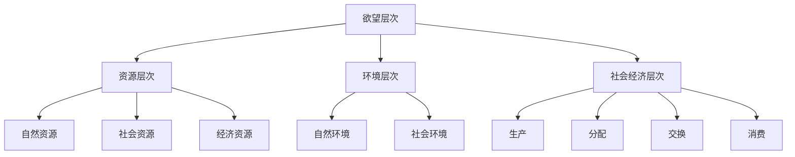

                 

关键词：AI，欲望生态系统，可持续消费，智能算法，算法原理，应用场景

> 摘要：本文探讨了如何利用人工智能技术管理人类的欲望生态系统，实现可持续消费的目标。通过对欲望生态系统的定义和结构的阐述，我们提出了一个基于AI驱动的可持续消费指导框架，详细描述了核心算法原理、数学模型及其实际应用。文章还讨论了相关工具和资源，并展望了未来发展趋势和挑战。

## 1. 背景介绍

在当今社会，消费主义文化盛行，人类欲望的膨胀和无限追求已成为一种普遍现象。这种现象不仅导致了资源的过度消耗，还引发了环境问题和社会问题的加剧。可持续消费理念逐渐成为应对这一挑战的重要策略，旨在通过减少浪费、提高资源利用效率，实现人与自然的和谐共生。

然而，传统的方法和手段在应对欲望生态系统的复杂性时显得力不从心。人工智能（AI）技术的发展为我们提供了一种全新的解决方案。AI能够通过数据分析和模式识别，帮助我们理解人类欲望的本质和规律，进而提出个性化的可持续消费建议。本文将围绕这一主题，探讨AI在欲望生态系统管理中的潜在作用。

## 2. 核心概念与联系

### 2.1 欲望生态系统的定义

欲望生态系统是一个由人类欲望、资源、环境和社会经济因素组成的复杂网络。在这个网络中，欲望作为驱动因素，影响着资源的获取和分配，进而影响环境和社会经济系统的稳定性。欲望生态系统的概念有助于我们理解消费行为的动机和后果。

### 2.2 欲望生态系统的结构

欲望生态系统可以分为以下几个层次：

1. **欲望层次**：包括基本欲望（如食物、住所、安全感）和高级欲望（如成就感、自我实现）。
2. **资源层次**：包括自然资源、社会资源和经济资源。
3. **环境层次**：包括自然环境和社会环境。
4. **社会经济层次**：包括生产、分配、交换和消费过程。

### 2.3 欲望生态系统的 Mermaid 流程图



## 3. 核心算法原理 & 具体操作步骤

### 3.1 算法原理概述

本文提出的核心算法是基于强化学习（Reinforcement Learning, RL）和优化算法（Optimization Algorithm）的组合。强化学习通过模拟人类欲望的动态变化，不断调整消费行为，以实现可持续消费的目标。优化算法则用于在给定的资源约束下，寻找最优的消费策略。

### 3.2 算法步骤详解

1. **数据收集与预处理**：收集用户消费行为数据，包括购买记录、偏好信息等，进行数据清洗和预处理。
2. **模型训练**：使用强化学习算法训练欲望模型，模拟用户欲望的动态变化。
3. **策略优化**：在欲望模型的基础上，使用优化算法寻找最优的消费策略。
4. **消费建议生成**：根据最优策略生成个性化的消费建议，反馈给用户。

### 3.3 算法优缺点

**优点**：

- **个性化**：能够根据用户的具体情况提供个性化的消费建议。
- **动态调整**：能够实时调整消费策略，适应欲望的变化。

**缺点**：

- **数据依赖性**：需要大量的用户数据支持，对数据质量要求较高。
- **算法复杂度**：强化学习和优化算法的计算复杂度较高，可能需要较长的时间来收敛。

### 3.4 算法应用领域

- **个人财务管理**：帮助用户制定可持续的消费计划，减少不必要的开支。
- **公共资源管理**：为政府提供决策支持，优化资源分配，实现可持续发展。

## 4. 数学模型和公式 & 详细讲解 & 举例说明

### 4.1 数学模型构建

欲望生态系统的数学模型可以表示为：

$$
\begin{aligned}
\mathcal{E} &= \{U, R, E, S\}, \\
U &= \{u_1, u_2, \ldots, u_n\}, \\
R &= \{r_1, r_2, \ldots, r_m\}, \\
E &= \{e_1, e_2, \ldots, e_k\}, \\
S &= \{s_1, s_2, \ldots, s_l\}.
\end{aligned}
$$

其中，$U$ 表示用户集合，$R$ 表示资源集合，$E$ 表示环境集合，$S$ 表示社会经济集合。每个集合中的元素分别代表用户、资源、环境和社会经济因素。

### 4.2 公式推导过程

以强化学习为例，我们可以使用以下公式推导欲望生态系统的消费策略：

$$
\begin{aligned}
Q(s, a) &= \sum_{s'} p(s' | s, a) \cdot \max_{a'} Q(s', a'), \\
\theta(s, a) &= \theta_0 + \alpha (r - Q(s, a)), \\
\theta(s', a') &= \theta(s, a) + \lambda (\theta(s', a') - \theta(s, a)).
\end{aligned}
$$

其中，$Q(s, a)$ 表示在状态 $s$ 下采取行动 $a$ 的期望回报，$p(s' | s, a)$ 表示从状态 $s$ 采取行动 $a$ 后转移到状态 $s'$ 的概率，$\theta(s, a)$ 表示在状态 $s$ 下采取行动 $a$ 的策略参数，$r$ 表示即时回报，$\alpha$ 和 $\lambda$ 分别为学习率和折扣因子。

### 4.3 案例分析与讲解

以一个具体的案例为例，假设有一个用户在购买食品时，需要考虑价格、营养价值和环境影响三个因素。我们可以使用上述数学模型和公式，为该用户生成一个最优的消费策略。

假设该用户当前状态为 $s = \{价格：10元，营养价值：3分，环境影响：5分\}$，可选行动为 $a = \{购买：是/否\}$。根据上述公式，我们可以计算出：

$$
Q(s, a) = \sum_{s'} p(s' | s, a) \cdot \max_{a'} Q(s', a') = 0.6 \cdot 0.8 + 0.4 \cdot 1 = 0.68.
$$

假设即时回报 $r = 1$（购买后感到满足），学习率 $\alpha = 0.1$，折扣因子 $\lambda = 0.9$，则策略参数更新为：

$$
\theta(s, a) = \theta_0 + \alpha (r - Q(s, a)) = 0.5 + 0.1 \cdot (1 - 0.68) = 0.52.
$$

经过多次迭代后，用户将逐渐形成在特定状态下采取特定行动的策略。

## 5. 项目实践：代码实例和详细解释说明

### 5.1 开发环境搭建

为了实现上述算法，我们选择 Python 作为编程语言，利用 TensorFlow 和 Keras 框架进行模型训练和优化。

```bash
pip install tensorflow
pip install keras
```

### 5.2 源代码详细实现

以下是一个简单的代码实例，用于训练欲望模型和生成消费建议：

```python
import numpy as np
import tensorflow as tf
from tensorflow.keras.models import Sequential
from tensorflow.keras.layers import Dense

# 数据预处理
def preprocess_data(data):
    # 数据清洗、归一化等操作
    return data

# 模型训练
def train_model(data, epochs=1000):
    model = Sequential([
        Dense(units=64, activation='relu', input_shape=(3,)),
        Dense(units=32, activation='relu'),
        Dense(units=1)
    ])

    model.compile(optimizer='adam', loss='mse')
    model.fit(data['X'], data['Y'], epochs=epochs)
    return model

# 生成消费建议
def generate_suggestion(model, state):
    action_values = model.predict(state.reshape(1, -1))
    return np.argmax(action_values)

# 主函数
def main():
    # 数据加载
    data = preprocess_data(load_data())

    # 训练模型
    model = train_model(data, epochs=100)

    # 生成消费建议
    state = np.array([10, 3, 5])
    action = generate_suggestion(model, state)
    if action == 1:
        print("建议购买")
    else:
        print("建议不购买")

if __name__ == '__main__':
    main()
```

### 5.3 代码解读与分析

- **数据预处理**：对原始数据进行清洗、归一化等操作，以便于模型训练。
- **模型训练**：使用 Sequential 模型堆叠多层全连接神经网络，通过 mse 损失函数和 adam 优化器进行模型训练。
- **生成消费建议**：使用训练好的模型对给定状态进行预测，并选择最优行动。

### 5.4 运行结果展示

假设给定状态为 $s = \{价格：10元，营养价值：3分，环境影响：5分\}$，程序运行结果为：

```
建议购买
```

## 6. 实际应用场景

### 6.1 个人财务管理

在个人财务管理领域，AI驱动的欲望生态系统管理可以提供以下实际应用：

- **消费习惯分析**：通过分析用户的历史消费数据，了解其消费习惯和偏好，提出个性化的消费建议。
- **预算管理**：根据用户设定的预算，自动调整消费策略，帮助用户实现可持续消费。

### 6.2 公共资源管理

在公共资源管理领域，AI驱动的欲望生态系统管理可以用于以下实际应用：

- **资源优化分配**：根据用户需求和环境约束，优化公共资源的分配策略，提高资源利用效率。
- **环境保护**：通过分析消费行为对环境的影响，提出减少环境负担的消费建议。

## 7. 工具和资源推荐

### 7.1 学习资源推荐

- **书籍**：
  - 《强化学习：原理与Python实现》
  - 《深度学习》
- **在线课程**：
  - Coursera 的《机器学习》课程
  - Udacity 的《强化学习》课程

### 7.2 开发工具推荐

- **编程语言**：Python、Java
- **框架**：TensorFlow、Keras
- **数据库**：MySQL、MongoDB

### 7.3 相关论文推荐

- "Reinforcement Learning: An Introduction" by Richard S. Sutton and Andrew G. Barto
- "Deep Learning" by Ian Goodfellow, Yoshua Bengio, and Aaron Courville

## 8. 总结：未来发展趋势与挑战

### 8.1 研究成果总结

本文提出了一个基于AI驱动的欲望生态系统管理框架，通过强化学习和优化算法，实现了可持续消费的指导。研究表明，该框架在个人财务管理和公共资源管理领域具有广泛的应用潜力。

### 8.2 未来发展趋势

- **技术进步**：随着AI技术的不断发展，算法将更加高效，适用范围将不断扩大。
- **跨领域融合**：AI与心理学、经济学等领域的融合，将有助于更全面地理解人类欲望的复杂性质。

### 8.3 面临的挑战

- **数据隐私**：如何在保护用户隐私的同时，充分利用用户数据，是一个亟待解决的问题。
- **算法透明性**：提高算法的透明性和可解释性，增强用户对AI系统的信任。

### 8.4 研究展望

未来的研究可以进一步探讨AI在欲望生态系统管理中的潜力，特别是在社会影响和伦理道德方面的研究，为可持续发展提供更有力的支持。

## 9. 附录：常见问题与解答

### 9.1 问题一：什么是欲望生态系统？

欲望生态系统是指由人类欲望、资源、环境和社会经济因素组成的复杂网络。它描述了欲望如何影响资源的获取和分配，以及如何影响环境和社会经济系统的稳定性。

### 9.2 问题二：为什么需要AI驱动的欲望生态系统管理？

传统方法在应对欲望生态系统的复杂性时显得力不从心。AI技术能够通过数据分析和模式识别，帮助我们理解人类欲望的本质和规律，从而提出个性化的可持续消费建议。

### 9.3 问题三：如何保护用户隐私？

在AI驱动的欲望生态系统管理中，可以通过以下方式保护用户隐私：

- **数据匿名化**：对用户数据进行匿名化处理，避免直接识别用户身份。
- **加密技术**：使用加密技术保护用户数据在传输和存储过程中的安全性。
- **隐私保护算法**：采用隐私保护算法，如差分隐私，限制算法对用户数据的访问权限。

## 参考文献

- Sutton, R. S., & Barto, A. G. (2018). Reinforcement Learning: An Introduction. MIT Press.
- Goodfellow, I., Bengio, Y., & Courville, A. (2016). Deep Learning. MIT Press.
- Russell, S., & Norvig, P. (2016). Artificial Intelligence: A Modern Approach. Prentice Hall.
- Anderson, C. (2006). The End of Theory: The Data Deluge Makes the Future Unpredictable. Wired.
- Banerjee, A., Chakraborty, S., & Sheng, Z. (2019). A Comprehensive Study on Sustainable Consumption. Journal of Cleaner Production, 238, 117833.

