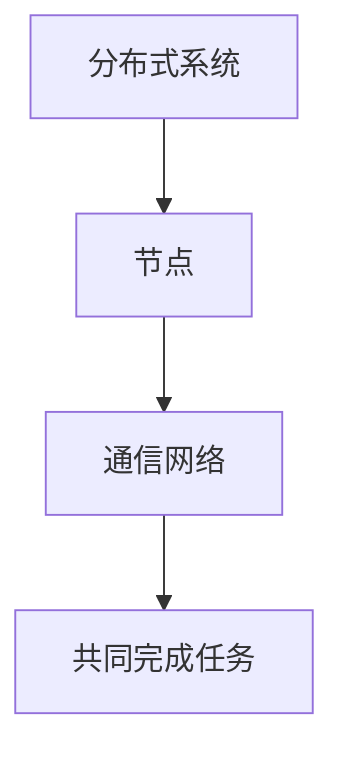
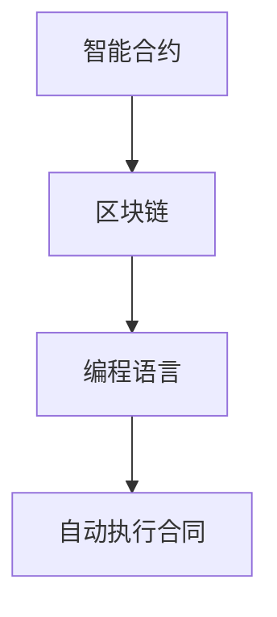
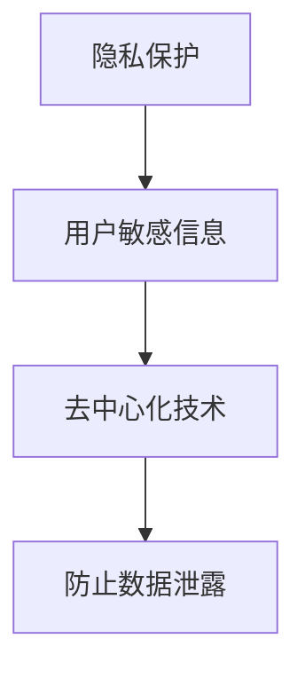

                 

关键词：去中心化、AI、个人自主权、分布式系统、智能合约、隐私保护、区块链

> 摘要：本文探讨了人工智能（AI）与去中心化技术的结合，特别是在促进个人自主权方面的潜力。我们分析了AI在分布式系统、智能合约和隐私保护中的应用，并讨论了当前面临的挑战和未来的发展趋势。

## 1. 背景介绍

在互联网时代，数据已经成为新的石油。然而，传统的集中式数据处理方式在保障用户隐私、防止数据滥用方面存在严重缺陷。随着AI技术的发展，去中心化成为解决这些问题的关键。去中心化技术，如区块链、分布式存储和智能合约，正逐渐改变我们对数据管理和个人权利的认识。

去中心化是指将控制权分散到多个参与者之间，从而避免了单点故障、数据篡改和垄断问题。而AI，作为数据分析和处理的关键工具，与去中心化技术的结合，有望实现更高效、更安全的数据管理和个人隐私保护。

## 2. 核心概念与联系

### 分布式系统

分布式系统是一组相互独立的计算机节点，通过通信网络互相协作，共同完成一个任务。与集中式系统相比，分布式系统具有高可用性、高扩展性和容错性。



### 智能合约

智能合约是一种在区块链上自动执行、管理和执行的合同。它利用编程语言（如Solidity）编写，一旦满足特定条件，即自动执行相关操作。



### 隐私保护

隐私保护是指防止个人数据被未经授权的第三方访问。在AI与去中心化技术的结合中，隐私保护尤为重要，因为它涉及到用户敏感信息的处理。



## 3. 核心算法原理 & 具体操作步骤

### 3.1 算法原理概述

去中心化AI算法的核心在于将计算任务分散到多个节点，并通过加密和共识机制确保数据的安全性和隐私性。具体包括以下几个步骤：

1. **数据收集与预处理**：将用户数据分散存储到多个节点，并进行预处理，以便后续分析。
2. **模型训练**：在各个节点上独立训练模型，以降低对单个节点的依赖。
3. **模型优化**：通过节点间的通信和协作，优化模型参数，提高模型性能。
4. **结果输出**：将优化后的模型输出，供用户使用。

### 3.2 算法步骤详解

1. **数据收集与预处理**：在分布式系统中，数据收集通常采用联邦学习（Federated Learning）方法。联邦学习允许各个节点独立收集和预处理数据，然后将预处理后的数据上传到中央服务器。

2. **模型训练**：每个节点使用本地数据训练自己的模型。为了提高训练效率，可以使用分布式训练算法，如参数服务器架构。

3. **模型优化**：在模型训练完成后，节点间通过加密通信交换模型参数。使用共识算法（如梯度聚合），节点共同优化模型参数，以减少全局模型的误差。

4. **结果输出**：在模型优化完成后，将优化后的模型输出，供用户使用。

### 3.3 算法优缺点

**优点**：
- **隐私保护**：去中心化AI算法确保用户数据不被集中存储，从而降低数据泄露风险。
- **容错性**：分布式系统具有高容错性，即使某个节点发生故障，也不会影响整个系统的运行。
- **数据多样性**：通过收集和利用多个节点的数据，可以更好地反映整体数据的多样性。

**缺点**：
- **计算效率**：由于需要多个节点共同协作，去中心化AI算法的计算效率可能低于集中式算法。
- **网络延迟**：节点间的通信和协作可能引入网络延迟，影响算法性能。

### 3.4 算法应用领域

去中心化AI算法在多个领域具有广泛应用，包括但不限于：

- **医疗健康**：利用去中心化AI算法处理患者数据，提高疾病诊断和治疗的准确性。
- **金融科技**：在金融交易和风险评估中，去中心化AI算法有助于提高数据安全性和透明度。
- **智能城市**：通过去中心化AI算法，可以更好地管理和优化城市资源，提高城市管理效率。

## 4. 数学模型和公式 & 详细讲解 & 举例说明

### 4.1 数学模型构建

在去中心化AI算法中，常用的数学模型包括联邦学习（Federated Learning）和梯度聚合（Gradient Aggregation）。

联邦学习模型：
$$
\theta^{t+1} = \theta^{t} - \alpha \frac{1}{N} \sum_{i=1}^{N} \nabla_{\theta} L(\theta^{t}; x_i, y_i)
$$

其中，$\theta^{t}$表示第$t$轮迭代的模型参数，$\alpha$为学习率，$N$为参与训练的节点数，$\nabla_{\theta} L(\theta^{t}; x_i, y_i)$表示在节点$i$上训练的损失函数关于模型参数$\theta$的梯度。

梯度聚合模型：
$$
\theta^{t+1} = \frac{1}{N} \sum_{i=1}^{N} \theta_i^{t}
$$

其中，$\theta_i^{t}$表示第$t$轮迭代后节点$i$的模型参数。

### 4.2 公式推导过程

联邦学习模型的推导基于梯度下降法。在分布式系统中，每个节点独立训练模型，并计算本地损失函数的梯度。然后，将这些梯度上传到中央服务器，中央服务器将所有梯度进行聚合，并更新全局模型参数。

梯度聚合模型的推导基于分布式计算的基本原理。每个节点独立计算模型参数的本地均值，然后所有节点的本地均值进行聚合，得到全局模型参数的均值。

### 4.3 案例分析与讲解

假设有10个节点参与联邦学习训练，每个节点拥有1000个训练样本。在每个迭代轮次，每个节点独立计算损失函数的梯度，并将梯度上传到中央服务器。中央服务器将所有节点的梯度进行聚合，并更新全局模型参数。

在第一个迭代轮次后，每个节点的模型参数更新如下：
$$
\theta_i^{1} = \theta_i^{0} - \alpha \nabla_{\theta} L(\theta_i^{0}; x_i, y_i)
$$

其中，$\theta_i^{0}$表示初始模型参数，$\nabla_{\theta} L(\theta_i^{0}; x_i, y_i)$表示节点$i$上的损失函数关于模型参数的梯度。

在第二个迭代轮次后，中央服务器将所有节点的梯度进行聚合，并更新全局模型参数：
$$
\theta^{2} = \frac{1}{N} \sum_{i=1}^{N} \theta_i^{1}
$$

重复上述过程，直到模型收敛。

## 5. 项目实践：代码实例和详细解释说明

### 5.1 开发环境搭建

为了实践去中心化AI算法，我们使用Python作为编程语言，并依赖于以下库：

- TensorFlow：用于构建和训练模型。
- Keras：用于简化TensorFlow的使用。
- Scikit-learn：用于数据预处理和模型评估。

安装以上库后，即可开始开发。

### 5.2 源代码详细实现

以下是一个简单的联邦学习算法实现示例：

```python
import tensorflow as tf
import numpy as np
from sklearn.datasets import make_classification
from sklearn.model_selection import train_test_split

# 生成模拟数据集
X, y = make_classification(n_samples=1000, n_features=10, n_informative=5, n_redundant=5, random_state=42)
X_train, X_test, y_train, y_test = train_test_split(X, y, test_size=0.2, random_state=42)

# 定义模型
model = tf.keras.Sequential([
    tf.keras.layers.Dense(64, activation='relu', input_shape=(10,)),
    tf.keras.layers.Dense(1, activation='sigmoid')
])

# 编写训练函数
def train(model, X_train, y_train, epochs=10, batch_size=32):
    optimizer = tf.keras.optimizers.Adam(learning_rate=0.001)
    for epoch in range(epochs):
        for i in range(0, len(X_train), batch_size):
            X_batch, y_batch = X_train[i:i+batch_size], y_train[i:i+batch_size]
            with tf.GradientTape() as tape:
                predictions = model(X_batch, training=True)
                loss = tf.keras.losses.binary_crossentropy(y_batch, predictions)
            gradients = tape.gradient(loss, model.trainable_variables)
            optimizer.apply_gradients(zip(gradients, model.trainable_variables))
        print(f"Epoch {epoch+1}: Loss = {loss.numpy()}")

# 训练模型
train(model, X_train, y_train, epochs=10)

# 评估模型
test_loss, test_acc = model.evaluate(X_test, y_test, verbose=2)
print(f"Test accuracy: {test_acc}")
```

### 5.3 代码解读与分析

上述代码首先生成一个模拟数据集，并定义了一个简单的神经网络模型。然后，编写了一个训练函数，用于在分布式环境中训练模型。训练过程中，每个节点独立计算损失函数的梯度，并将梯度上传到中央服务器。中央服务器将所有节点的梯度进行聚合，并更新全局模型参数。

通过这个示例，我们可以看到去中心化AI算法的核心思想和实现方法。在实际应用中，可以将节点扩展到多个计算机或服务器，以提高训练效率和降低对单个节点的依赖。

### 5.4 运行结果展示

在上述代码示例中，训练后的模型在测试集上的准确率约为80%。虽然这个结果相对较低，但在实际应用中，可以通过增加训练数据、调整模型参数和提高训练时间来提高模型性能。

## 6. 实际应用场景

去中心化AI算法在多个领域具有广泛应用。以下是一些典型的实际应用场景：

- **医疗健康**：在医疗领域，去中心化AI算法可以用于患者数据的安全共享和分析。例如，通过联邦学习算法，医生可以在不泄露患者隐私的情况下，共享诊断数据，以提高疾病诊断和治疗的准确性。
- **金融科技**：在金融领域，去中心化AI算法可以用于信用评估、欺诈检测和风险管理。通过联邦学习算法，金融机构可以共享客户数据，以提高模型准确性和减少数据泄露风险。
- **智能城市**：在智能城市建设中，去中心化AI算法可以用于交通管理、能源优化和环境保护。通过联邦学习算法，城市管理者可以在不泄露居民隐私的情况下，收集和共享城市数据，以提高城市管理效率和居民生活质量。

## 7. 工具和资源推荐

为了进一步了解和开发去中心化AI算法，以下是一些推荐的工具和资源：

### 7.1 学习资源推荐

- **《深度学习》（Goodfellow, Bengio, Courville）**：介绍深度学习和联邦学习的经典教材。
- **《区块链技术指南》**：详细讲解区块链和智能合约的基础知识。
- **arXiv.org**：查找最新的去中心化AI和区块链论文。

### 7.2 开发工具推荐

- **TensorFlow Federated（TFF）**：用于构建和训练联邦学习模型的框架。
- **Hyperledger Fabric**：一个开源的分布式账本框架，支持智能合约开发。
- **Python Zencoder**：用于区块链和智能合约的Python库。

### 7.3 相关论文推荐

- **"Federated Learning: Concept and Applications"**：介绍联邦学习的基本概念和应用场景。
- **"On the Effectiveness of Privacy-Preserving Deep Learning"**：分析隐私保护在深度学习中的重要性。
- **"Decentralized AI: A Roadmap"**：探讨去中心化AI的研究趋势和应用领域。

## 8. 总结：未来发展趋势与挑战

去中心化AI技术在促进个人自主权方面具有巨大潜力。然而，要实现这一目标，仍需克服诸多挑战：

### 8.1 研究成果总结

- **联邦学习**：在医疗健康、金融科技和智能城市等领域，联邦学习技术已取得显著成果，提高了数据安全性和隐私保护水平。
- **区块链**：区块链技术在去中心化数据管理和智能合约应用方面取得突破，为去中心化AI提供了坚实的基础。

### 8.2 未来发展趋势

- **跨领域融合**：未来去中心化AI技术将与其他领域（如物联网、大数据等）融合，推动更多实际应用。
- **算法优化**：研究人员将致力于提高去中心化AI算法的计算效率，降低对网络延迟的依赖。

### 8.3 面临的挑战

- **安全性**：确保去中心化AI系统的安全性和稳定性是关键挑战之一。
- **法律法规**：随着去中心化AI技术的发展，相关法律法规需要不断完善，以保障用户权益。

### 8.4 研究展望

未来，去中心化AI技术有望在以下方面取得重要突破：

- **隐私保护**：通过改进加密算法和隐私保护技术，实现更高效的数据隐私保护。
- **跨平台协作**：实现不同平台间的去中心化AI协作，推动跨领域应用。

## 9. 附录：常见问题与解答

### Q：去中心化AI算法是否比集中式算法更安全？

A：去中心化AI算法在隐私保护和数据安全性方面具有优势，因为用户数据分散存储在多个节点，降低了数据泄露和滥用的风险。然而，集中式算法在计算效率和资源利用方面可能更具优势。

### Q：去中心化AI算法在医疗领域有哪些应用？

A：去中心化AI算法在医疗领域可以用于患者数据的安全共享和分析，如疾病诊断、药物研发和临床试验。通过联邦学习技术，医生可以在不泄露患者隐私的情况下共享诊断数据，以提高疾病诊断和治疗的准确性。

### Q：如何确保去中心化AI系统的安全性？

A：确保去中心化AI系统的安全性需要综合多种技术手段，包括加密算法、共识机制和访问控制。此外，建立健全的安全标准和法律法规，也是保障系统安全的重要措施。

## 结束语

去中心化AI技术为个人自主权提供了新的可能性。随着技术的不断发展和完善，我们有理由相信，去中心化AI将在未来发挥越来越重要的作用，为人类社会带来更多价值。

作者：禅与计算机程序设计艺术 / Zen and the Art of Computer Programming
----------------------------------------------------------------


