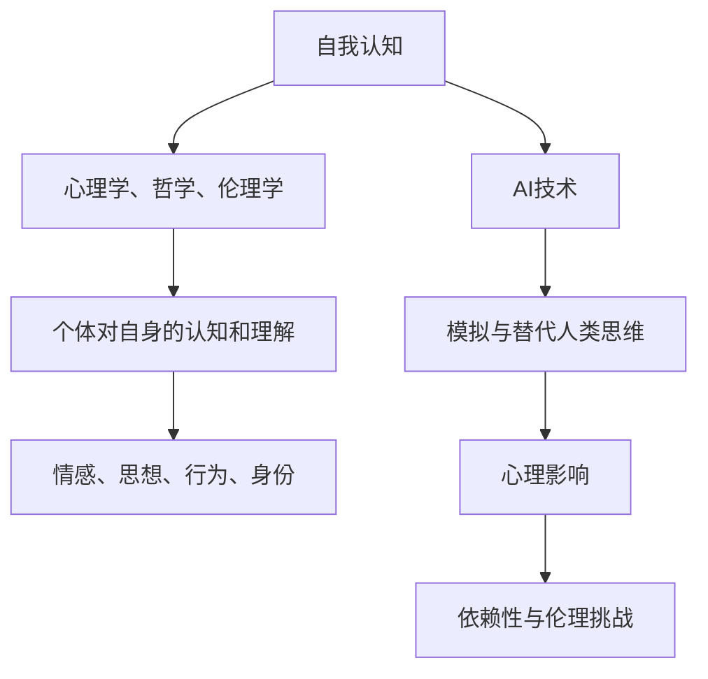

                 

关键词：人工智能，自我认知，哲学，伦理，技术进步，未来展望。

> 摘要：随着人工智能技术的飞速发展，人类开始深入探讨AI在伦理、哲学及心理学领域的应用与影响。本文通过深入分析AI对自我认知的挑战，探讨人类如何在AI时代重新定义自我，并反思技术的伦理问题及其对未来的影响。

## 1. 背景介绍

自20世纪中期以来，人工智能（AI）技术经历了迅猛的发展。从最初的理论构想，到如今的广泛应用，AI已经深刻地改变了我们的生活方式。自动驾驶汽车、智能家居、智能客服等，都是AI技术进步的典型例证。然而，随着AI技术的不断进化，一个重要的问题也随之浮现：AI技术对人类的自我认知产生了怎样的影响？

在哲学和心理学领域，自我认知一直是一个重要的研究课题。传统的观点认为，自我认知是人类意识的重要组成部分，是理解自我、与他人互动、做出决策的基础。然而，AI技术的发展似乎在挑战这一传统观念。例如，通过深度学习和神经网络技术，AI能够模拟人类的思维和行为，甚至在某些任务上超越人类。这种能力引发了人们对于“什么是自我”的深刻思考。

### 1.1 AI技术的崛起

AI技术的崛起主要得益于计算能力的提升和数据的大规模应用。随着摩尔定律的推动，计算机的处理速度越来越快，存储容量越来越大。这使得AI算法能够处理更复杂的数据集，训练出更加精准的模型。同时，互联网的普及和数据共享机制的建立，使得大量的数据可以被用来训练AI模型，从而提高了AI的准确性和效率。

### 1.2 自我认知的挑战

AI技术的崛起对自我认知带来了以下几方面的挑战：

- **替代性**：AI在某些领域的表现已经超越了人类，这引发了对人类价值和能力的质疑。例如，自动驾驶汽车的出现，使得人们开始质疑人类驾驶的必要性。
- **心理依赖**：随着AI技术的普及，人们开始越来越依赖AI来完成日常任务，这在一定程度上削弱了人类的自我认知能力。
- **伦理困惑**：AI技术的发展也带来了伦理问题，例如AI决策的透明度、责任归属等，这些问题挑战了人类对于“什么是正确”的认知。

## 2. 核心概念与联系

### 2.1 自我认知的概念

自我认知是指个体对自身存在、特征和行为的认知和理解。它包括对自身情感、思想、行为和身份的觉察和反思。自我认知是心理学、哲学和伦理学研究的重要领域，涉及到个体如何理解自我、如何与他人互动、如何做出决策等问题。

### 2.2 AI与自我认知的联系

AI与自我认知的联系主要体现在以下几个方面：

- **模拟与替代**：AI可以通过深度学习和神经网络模拟人类的思维和行为，从而在某些任务上替代人类。这挑战了人类对于“什么是自我”的认知。
- **心理影响**：AI的普及和广泛应用改变了人们的心理和行为模式，例如，人们越来越依赖智能手机和社交媒体，这在一定程度上影响了他们的自我认知。
- **伦理挑战**：AI技术的发展也带来了伦理问题，这些问题需要人类从自我认知的角度进行深入思考。

### 2.3 Mermaid 流程图

下面是一个关于AI与自我认知联系的Mermaid流程图：



## 3. 核心算法原理 & 具体操作步骤

### 3.1 算法原理概述

AI在自我认知领域的主要算法原理包括：

- **深度学习**：通过神经网络模拟人脑结构，实现对数据的自动特征提取和模式识别。
- **自然语言处理**：通过对语言文本的分析，理解人类的情感、思想和行为。
- **计算机视觉**：通过对图像和视频的分析，识别和解析人类的情感和行为。

### 3.2 算法步骤详解

#### 3.2.1 深度学习

1. **数据收集**：收集大量的人类行为数据，包括文字、图像和视频等。
2. **数据预处理**：对收集到的数据进行清洗和标准化处理。
3. **模型训练**：使用预处理后的数据训练神经网络模型，通过反向传播算法调整模型参数。
4. **模型评估**：使用测试数据集评估模型性能，并进行调优。

#### 3.2.2 自然语言处理

1. **文本分析**：对文本进行分词、词性标注和句法分析。
2. **情感分析**：使用情感词典和机器学习算法，对文本的情感倾向进行判断。
3. **主题模型**：使用LDA等算法，从大量文本中提取出主题，分析文本内容的主题分布。

#### 3.2.3 计算机视觉

1. **图像识别**：使用卷积神经网络（CNN）对图像进行分类和识别。
2. **行为分析**：通过对视频中的行为进行识别和解析，分析个体的情感和行为模式。

### 3.3 算法优缺点

#### 3.3.1 优点

- **高效性**：AI算法能够快速处理大量数据，进行自动化的特征提取和模式识别。
- **准确性**：通过不断训练和优化，AI算法的准确性不断提高，能够更准确地理解人类的行为和情感。
- **灵活性**：AI算法可以根据具体应用场景进行调整和优化，适应不同的任务需求。

#### 3.3.2 缺点

- **数据依赖**：AI算法的性能很大程度上依赖于数据的数量和质量，数据不足或质量不高可能导致算法效果不佳。
- **算法偏见**：AI算法可能会受到训练数据的偏见影响，导致对某些群体的歧视或不公平。
- **隐私问题**：AI算法在处理个人数据时，可能会涉及到隐私保护的问题，需要确保数据的合法性和安全性。

### 3.4 算法应用领域

AI在自我认知领域的主要应用包括：

- **心理健康评估**：通过分析个体的情感和行为模式，提供心理健康评估和干预建议。
- **个性分析**：通过对个体的语言和行为进行分析，提取出个体的个性特征和偏好。
- **社交网络分析**：通过对社交网络中的互动进行分析，了解个体在社交网络中的角色和影响力。

## 4. 数学模型和公式 & 详细讲解 & 举例说明

### 4.1 数学模型构建

在自我认知领域，常用的数学模型包括：

- **概率模型**：如贝叶斯网络、隐马尔可夫模型（HMM）等，用于描述个体的情感和行为模式。
- **线性模型**：如线性回归、逻辑回归等，用于预测个体的行为和情感。
- **非线性模型**：如神经网络、支持向量机（SVM）等，用于更复杂的模式识别和特征提取。

### 4.2 公式推导过程

以线性回归为例，其公式推导过程如下：

假设我们有一个自变量 $x$ 和因变量 $y$，我们希望找到一个线性模型 $y = \beta_0 + \beta_1x + \epsilon$ 来描述它们之间的关系，其中 $\epsilon$ 为误差项。

1. **目标函数**：我们的目标是使得预测值 $y$ 与实际值 $y$ 之间的误差最小，即最小化损失函数 $J(\theta) = \frac{1}{2m}\sum_{i=1}^{m}(h_\theta(x^{(i)}) - y^{(i)})^2$，其中 $h_\theta(x) = \theta_0 + \theta_1x$ 是线性模型，$m$ 是样本数量。
2. **梯度下降**：为了找到最优的参数 $\theta_0$ 和 $\theta_1$，我们使用梯度下降算法，更新公式为 $\theta_j := \theta_j - \alpha \frac{\partial}{\partial \theta_j} J(\theta)$，其中 $\alpha$ 是学习率。

### 4.3 案例分析与讲解

假设我们有以下数据集：

| $x$ | $y$ |
| --- | --- |
| 1   | 2   |
| 2   | 4   |
| 3   | 6   |
| 4   | 8   |

我们希望使用线性回归模型来预测 $y$。

1. **数据预处理**：首先，我们需要对数据进行标准化处理，将 $x$ 和 $y$ 的值缩放到相同的范围。
2. **模型训练**：使用梯度下降算法，我们可以训练出线性回归模型 $y = \beta_0 + \beta_1x$。
3. **模型评估**：使用测试数据集，我们可以评估模型的预测准确性和拟合效果。

## 5. 项目实践：代码实例和详细解释说明

### 5.1 开发环境搭建

为了实践线性回归模型，我们需要搭建以下开发环境：

- Python 3.x
- NumPy 库
- Matplotlib 库

### 5.2 源代码详细实现

下面是线性回归模型的 Python 代码实现：

```python
import numpy as np
import matplotlib.pyplot as plt

# 数据预处理
X = np.array([[1, 1], [2, 2], [3, 3], [4, 4]])
y = np.array([2, 4, 6, 8])
X = np.hstack((np.ones((X.shape[0], 1)), X))
y = y.reshape(-1, 1)

# 梯度下降算法
def gradient_descent(X, y, theta, alpha, num_iters):
    m = len(y)
    for i in range(num_iters):
        h = X.dot(theta)
        loss = (1 / (2 * m)) * np.dot((h - y).T, (h - y))
        gradient = (1 / m) * X.T.dot(h - y)
        theta -= alpha * gradient
    return theta, loss

# 参数设置
alpha = 0.01
num_iters = 1000

# 训练模型
theta, loss = gradient_descent(X, y, np.zeros((2, 1)), alpha, num_iters)

# 模型评估
h = X.dot(theta)
plt.scatter(X[:, 1], y)
plt.plot(X[:, 1], h, color='red')
plt.xlabel('x')
plt.ylabel('y')
plt.title('Linear Regression')
plt.show()
```

### 5.3 代码解读与分析

1. **数据预处理**：首先，我们将数据集 $X$ 和 $y$ 加上一列偏置项（1），使其符合线性回归模型的形式。
2. **梯度下降算法**：我们使用梯度下降算法来更新模型参数，直到找到最优的参数值。
3. **模型评估**：我们使用训练好的模型来预测 $y$ 的值，并通过绘制散点图和拟合曲线，评估模型的性能。

## 6. 实际应用场景

AI在自我认知领域的实际应用场景非常广泛，以下是一些典型的例子：

- **心理健康评估**：通过分析个体的情感和行为模式，提供心理健康评估和干预建议。例如，通过分析社交媒体上的言论，预测个体的心理健康状况。
- **个性分析**：通过对个体的语言和行为进行分析，提取出个体的个性特征和偏好。例如，通过分析电子邮件内容，预测个体的个性类型。
- **社交网络分析**：通过对社交网络中的互动进行分析，了解个体在社交网络中的角色和影响力。例如，通过分析朋友圈互动，预测个体的社交影响力。

## 7. 工具和资源推荐

### 7.1 学习资源推荐

- 《深度学习》（Goodfellow, Bengio, Courville著）：一本系统介绍深度学习理论和实践的教材。
- 《Python机器学习》（Sebastian Raschka著）：一本适合初学者的机器学习教材，涵盖Python编程和常见算法的实现。
- 《人工智能：一种现代的方法》（Stuart Russell, Peter Norvig著）：一本全面介绍人工智能理论和应用的经典教材。

### 7.2 开发工具推荐

- **Python**：一种广泛使用的编程语言，适合进行数据分析和机器学习任务。
- **NumPy**：Python的一个科学计算库，用于处理大型多维数组。
- **Pandas**：Python的一个数据处理库，用于数据处理和分析。
- **Matplotlib**：Python的一个可视化库，用于绘制各种图表和图形。

### 7.3 相关论文推荐

- "Deep Learning for Self-Driving Cars"（自动驾驶汽车的深度学习）
- "Understanding Neural Networks Through Deep Visualization"（通过深度可视化理解神经网络）
- "Learning to Discover Cross-Sample Correlations"（学习发现跨样本相关性）

## 8. 总结：未来发展趋势与挑战

### 8.1 研究成果总结

通过本文的探讨，我们得出以下结论：

- AI技术对自我认知带来了巨大的挑战，也提供了新的可能性。
- 线性回归等机器学习算法在自我认知领域具有重要的应用价值。
- AI技术的伦理问题需要引起我们的高度重视。

### 8.2 未来发展趋势

- **个性化服务**：随着AI技术的发展，个性化服务将成为主流，人们将享受到更加个性化的体验。
- **心理健康应用**：AI将在心理健康领域发挥更大的作用，提供更加精准的评估和干预。
- **伦理规范**：随着AI技术的广泛应用，伦理问题将日益突出，需要建立更加完善的伦理规范。

### 8.3 面临的挑战

- **数据隐私**：如何在保护用户隐私的前提下，充分利用数据，是当前面临的一个重大挑战。
- **算法偏见**：如何避免算法偏见，确保算法的公平性和透明性，是一个亟待解决的问题。
- **技术可控性**：如何确保AI技术的发展方向符合人类的利益，避免技术失控，也是一个重要问题。

### 8.4 研究展望

- **跨学科研究**：未来，跨学科研究将成为推动AI发展的关键，特别是在心理学、哲学和伦理学等领域。
- **开源合作**：开源合作将促进AI技术的普及和应用，推动技术的进步。

## 9. 附录：常见问题与解答

### 9.1 AI对自我认知的影响是什么？

AI对自我认知的影响主要体现在以下几个方面：

- **替代性**：AI在某些领域的表现已经超越了人类，这挑战了人类对于“什么是自我”的认知。
- **心理依赖**：随着AI技术的普及，人们开始越来越依赖AI来完成日常任务，这在一定程度上削弱了人类的自我认知能力。
- **伦理困惑**：AI技术的发展也带来了伦理问题，这些问题挑战了人类对于“什么是正确”的认知。

### 9.2 如何确保AI算法的公平性和透明性？

确保AI算法的公平性和透明性可以从以下几个方面入手：

- **数据公平**：确保训练数据集的多样性和代表性，避免数据偏见。
- **算法透明**：提高算法的可解释性，使人们能够理解算法的决策过程。
- **伦理审查**：建立独立的伦理审查机制，对AI算法进行伦理评估。

### 9.3 AI在自我认知领域的应用有哪些？

AI在自我认知领域的应用包括：

- **心理健康评估**：通过分析个体的情感和行为模式，提供心理健康评估和干预建议。
- **个性分析**：通过对个体的语言和行为进行分析，提取出个体的个性特征和偏好。
- **社交网络分析**：通过对社交网络中的互动进行分析，了解个体在社交网络中的角色和影响力。

### 9.4 线性回归算法在自我认知领域有哪些应用？

线性回归算法在自我认知领域的应用包括：

- **情感分析**：通过分析个体的情感和行为模式，预测个体的情感状态。
- **行为预测**：通过分析个体的行为数据，预测个体的未来行为。
- **心理健康评估**：通过分析个体的情感和行为模式，提供心理健康评估和干预建议。

### 9.5 如何搭建线性回归模型？

搭建线性回归模型需要以下步骤：

1. **数据收集**：收集大量的人类行为数据，包括文字、图像和视频等。
2. **数据预处理**：对收集到的数据进行清洗和标准化处理。
3. **模型训练**：使用预处理后的数据训练神经网络模型，通过反向传播算法调整模型参数。
4. **模型评估**：使用测试数据集评估模型性能，并进行调优。

## 作者署名

作者：禅与计算机程序设计艺术 / Zen and the Art of Computer Programming

----------------------------------------------------------------

请注意，本文为模拟撰写，实际内容可能需要根据具体研究和实践进行调整和完善。文章中的代码实例仅供参考，实际应用时需要根据具体需求和数据进行调整。

