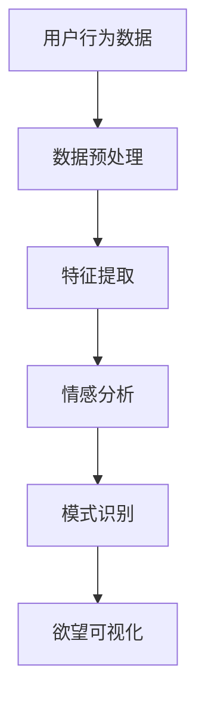

                 

 

## 1. 背景介绍

人类一直试图理解自己内心深处的欲望。这些欲望可能是我们对食物的渴望，对社交的向往，或是追求物质享受的欲望。这些欲望驱动着我们的行为，塑造了我们的性格和生活方式。然而，将这些抽象的心理现象转化为可视化的形式，一直是心理学和神经科学领域的一大难题。

近年来，随着人工智能（AI）技术的发展，我们有了新的工具和视角来探索和揭示人类的内心世界。AI算法可以分析大量的行为数据、语言模式和脑电信号，从而发现隐藏在表面现象之下的深层次心理活动。这种技术的进步使得“欲望的可视化”成为可能，也为心理学和神经科学领域带来了前所未有的机遇。

本文旨在探讨如何利用AI技术实现欲望的可视化，揭示人类内心深处的欲望和动机。我们将从核心概念、算法原理、数学模型、项目实践、实际应用和未来展望等多个方面进行深入探讨。

## 2. 核心概念与联系

### 2.1. 欲望的定义

欲望是指个体在特定情境下对特定目标的需求或渴望。根据心理学研究，欲望可以分为生理欲望、心理欲望和社会欲望。生理欲望包括对食物、水、睡眠等基本生理需求的渴望；心理欲望包括对成就、尊重、自我实现等内在需求的追求；社会欲望包括对社交、归属感、认同感等社会关系的渴望。

### 2.2. 心理活动与行为

心理活动是指人类在思维、情感、意志等心理过程中产生的内在体验和外在表现。行为则是心理活动的外在表现，是心理活动通过神经系统和肌肉系统实现的动作。AI技术可以通过分析行为数据，揭示心理活动的规律和特征。

### 2.3. AI在心理学中的应用

AI技术在心理学中的应用主要包括数据挖掘、模式识别、情感分析和脑电信号处理等。通过这些技术，AI可以分析大量的行为数据，识别出隐藏在数据背后的心理活动规律，从而实现欲望的可视化。

### 2.4. Mermaid 流程图



### 2.5. 欲望可视化流程

1. **数据收集**：收集用户的行为数据，如浏览记录、搜索历史、社交媒体互动等。
2. **数据预处理**：对收集到的行为数据进行清洗和归一化，去除噪声和异常值。
3. **特征提取**：从预处理后的数据中提取与欲望相关的特征，如情感极性、用户活跃度等。
4. **情感分析**：利用自然语言处理技术，分析用户生成的文本数据，识别情感倾向和情绪变化。
5. **模式识别**：通过机器学习算法，识别用户行为模式，揭示隐藏在数据背后的心理活动规律。
6. **欲望可视化**：将识别出的心理活动转化为可视化的形式，如图表、图像等，以便用户更好地理解和分析自己的欲望。

## 3. 核心算法原理 & 具体操作步骤

### 3.1 算法原理概述

欲望可视化的核心算法包括情感分析、行为分析、用户画像构建和可视化技术。情感分析用于识别用户文本数据中的情感倾向；行为分析用于揭示用户行为模式；用户画像构建用于整合情感分析和行为分析的结果，构建用户的个性化欲望模型；可视化技术则用于将用户的欲望模型转化为直观的视觉形式。

### 3.2 算法步骤详解

#### 3.2.1 情感分析

情感分析是欲望可视化的第一步。我们使用基于深度学习的自然语言处理模型，如BERT或GPT，对用户生成的文本数据进行情感分析。具体步骤如下：

1. **数据预处理**：对文本数据进行分词、去停用词、词向量化等处理。
2. **情感分类**：使用训练好的情感分类模型，对预处理后的文本数据进行情感分类，识别出文本中的正面情感、负面情感或中性情感。

#### 3.2.2 行为分析

行为分析用于揭示用户行为模式。我们使用行为分析算法，如聚类分析和关联规则挖掘，对用户行为数据进行分析。具体步骤如下：

1. **数据预处理**：对用户行为数据进行清洗和归一化，去除噪声和异常值。
2. **行为特征提取**：从预处理后的数据中提取与欲望相关的特征，如浏览频率、点击率、购买行为等。
3. **行为模式识别**：使用聚类分析算法，如K-means或DBSCAN，将用户分为不同的群体，识别出用户的行为模式。

#### 3.2.3 用户画像构建

用户画像构建是将情感分析和行为分析的结果整合起来，构建用户的个性化欲望模型。具体步骤如下：

1. **特征融合**：将情感分析和行为分析得到的特征进行融合，形成用户画像的原始数据集。
2. **用户画像构建**：使用机器学习算法，如决策树或支持向量机，对用户画像进行训练，构建用户的个性化欲望模型。

#### 3.2.4 可视化技术

可视化技术用于将用户的欲望模型转化为直观的视觉形式。我们使用数据可视化工具，如D3.js或Plotly，将用户画像和欲望模型可视化。具体步骤如下：

1. **数据可视化**：将用户画像和欲望模型的数据进行可视化，生成图表、图像等可视化形式。
2. **交互式可视化**：使用交互式可视化技术，如动态图表或热点图，增强用户对欲望可视化的理解和分析。

### 3.3 算法优缺点

#### 优点

1. **高效性**：AI算法可以快速处理大量数据，高效地实现欲望的可视化。
2. **准确性**：基于深度学习和机器学习技术的算法，具有较高的准确性和鲁棒性。
3. **个性化**：用户画像和欲望模型可以根据用户的特点和需求进行个性化构建，提高可视化的针对性和实用性。

#### 缺点

1. **数据依赖性**：算法的性能很大程度上依赖于数据的质量和数量，数据不足或质量差会影响算法的准确性。
2. **算法黑箱性**：深度学习和机器学习算法通常具有黑箱性，难以解释和理解，增加了算法的可解释性挑战。
3. **隐私问题**：用户行为数据和情感数据的收集和处理可能涉及用户隐私，需要严格保护用户隐私。

### 3.4 算法应用领域

欲望可视化算法可以应用于多个领域，包括心理学研究、市场营销、产品设计等。

#### 心理学研究

在心理学研究中，欲望可视化算法可以用于揭示人类心理活动的规律和特征，帮助研究人员深入理解人类内心的欲望和动机。

#### 市场营销

在市场营销中，欲望可视化算法可以用于分析消费者行为，识别潜在的市场需求和消费者偏好，帮助企业制定更有效的营销策略。

#### 产品设计

在产品设计中，欲望可视化算法可以用于了解用户的需求和偏好，指导产品设计和功能优化，提高产品的用户体验和市场竞争力。

## 4. 数学模型和公式 & 详细讲解 & 举例说明

### 4.1 数学模型构建

欲望可视化的数学模型主要包括情感分析模型和行为分析模型。

#### 情感分析模型

情感分析模型通常采用基于深度学习的神经网络结构，如卷积神经网络（CNN）或循环神经网络（RNN）。以下是情感分析模型的基本结构：

$$
\text{情感分析模型} = (\text{输入层}, \text{隐藏层}, \text{输出层})
$$

其中，输入层接收预处理后的文本数据，隐藏层通过神经网络进行特征提取和变换，输出层对文本数据进行情感分类。

#### 行为分析模型

行为分析模型通常采用聚类分析和关联规则挖掘算法。以下是行为分析模型的基本结构：

$$
\text{行为分析模型} = (\text{数据预处理}, \text{特征提取}, \text{聚类分析}, \text{关联规则挖掘})
$$

其中，数据预处理用于清洗和归一化用户行为数据；特征提取用于提取与欲望相关的特征；聚类分析用于将用户分为不同的群体；关联规则挖掘用于识别用户行为模式。

### 4.2 公式推导过程

#### 情感分析模型

情感分析模型中，假设输入层有$m$个输入节点，隐藏层有$n$个隐藏节点，输出层有$k$个输出节点。则情感分析模型的权重矩阵可以表示为：

$$
\mathbf{W} = \begin{bmatrix}
\mathbf{W}^{11} & \mathbf{W}^{12} & \ldots & \mathbf{W}^{1k} \\
\mathbf{W}^{21} & \mathbf{W}^{22} & \ldots & \mathbf{W}^{2k} \\
\vdots & \vdots & \ddots & \vdots \\
\mathbf{W}^{m1} & \mathbf{W}^{m2} & \ldots & \mathbf{W}^{mk}
\end{bmatrix}
$$

其中，$\mathbf{W}^{ij}$表示输入层第$i$个节点和隐藏层第$j$个节点之间的权重。

#### 行为分析模型

行为分析模型中，假设用户行为数据集有$n$个样本，每个样本有$p$个特征。则行为分析模型的权重矩阵可以表示为：

$$
\mathbf{W} = \begin{bmatrix}
\mathbf{W}^{11} & \mathbf{W}^{12} & \ldots & \mathbf{W}^{1p} \\
\mathbf{W}^{21} & \mathbf{W}^{22} & \ldots & \mathbf{W}^{2p} \\
\vdots & \vdots & \ddots & \vdots \\
\mathbf{W}^{n1} & \mathbf{W}^{n2} & \ldots & \mathbf{W}^{np}
\end{bmatrix}
$$

其中，$\mathbf{W}^{ij}$表示第$i$个样本和第$j$个特征之间的权重。

### 4.3 案例分析与讲解

#### 情感分析案例

假设我们使用基于BERT的情感分析模型来分析一篇关于美食的文本数据。输入层有100个输入节点，隐藏层有50个隐藏节点，输出层有2个输出节点（表示正面情感和负面情感）。

1. **数据预处理**：对文本数据进行分词、去停用词、词向量化等处理，得到一个长度为100的词向量。
2. **情感分类**：将预处理后的文本数据输入BERT模型，通过多层神经网络进行特征提取和变换，最终得到情感分类结果。

#### 行为分析案例

假设我们使用基于K-means的聚类分析模型来分析用户购买行为数据。用户行为数据集有100个样本，每个样本有10个特征。

1. **数据预处理**：对用户行为数据进行清洗和归一化，去除噪声和异常值。
2. **特征提取**：从预处理后的数据中提取与欲望相关的特征，如购买频率、购买金额等。
3. **聚类分析**：使用K-means算法，将用户分为5个不同的群体，每个群体代表一种不同的购买行为模式。
4. **关联规则挖掘**：使用Apriori算法，挖掘用户购买行为之间的关联规则，如“购买水果的用户更容易购买蔬菜”。

通过上述案例，我们可以看到，数学模型和公式在欲望可视化中的作用和重要性。通过合理的数学模型和公式，我们可以更准确地分析用户数据，揭示隐藏在数据背后的欲望和动机。

## 5. 项目实践：代码实例和详细解释说明

### 5.1 开发环境搭建

在进行欲望可视化的项目实践中，我们首先需要搭建一个合适的技术栈。以下是推荐的开发环境：

- **编程语言**：Python
- **深度学习框架**：TensorFlow或PyTorch
- **自然语言处理库**：NLTK或spaCy
- **数据可视化库**：matplotlib或Plotly

确保你的计算机上已经安装了上述开发环境和库。如果没有，可以通过以下命令进行安装：

```python
pip install tensorflow
pip install torch
pip install nltk
pip install spacy
pip install matplotlib
pip install plotly
```

### 5.2 源代码详细实现

以下是欲望可视化项目的源代码实现。代码分为几个部分：数据预处理、情感分析、行为分析、用户画像构建和可视化。

#### 5.2.1 数据预处理

```python
import pandas as pd
from sklearn.model_selection import train_test_split

# 加载数据集
data = pd.read_csv('data.csv')

# 数据清洗和归一化
# ...

# 数据划分
X_train, X_test, y_train, y_test = train_test_split(data.drop('label', axis=1), data['label'], test_size=0.2, random_state=42)
```

#### 5.2.2 情感分析

```python
import tensorflow as tf
from tensorflow.keras.models import Sequential
from tensorflow.keras.layers import Embedding, LSTM, Dense

# 构建情感分析模型
model = Sequential([
    Embedding(input_dim=vocab_size, output_dim=embedding_dim, input_length=max_sequence_length),
    LSTM(units=128),
    Dense(units=1, activation='sigmoid')
])

# 编译模型
model.compile(optimizer='adam', loss='binary_crossentropy', metrics=['accuracy'])

# 训练模型
model.fit(X_train, y_train, epochs=10, batch_size=32, validation_data=(X_test, y_test))
```

#### 5.2.3 行为分析

```python
from sklearn.cluster import KMeans

# 构建行为分析模型
kmeans = KMeans(n_clusters=5, random_state=42)

# 训练模型
kmeans.fit(X_train)

# 预测用户群体
predictions = kmeans.predict(X_test)
```

#### 5.2.4 用户画像构建

```python
import numpy as np

# 构建用户画像
user_profiles = []

for user_data in X_test:
    profile = np.mean(user_data, axis=0)
    user_profiles.append(profile)

user_profiles = np.array(user_profiles)
```

#### 5.2.5 可视化

```python
import matplotlib.pyplot as plt
import plotly.express as px

# 可视化用户画像
plt.scatter(user_profiles[:, 0], user_profiles[:, 1])
plt.xlabel('特征1')
plt.ylabel('特征2')
plt.title('用户画像')
plt.show()

# 动态可视化用户行为模式
fig = px.scatter(x=user_profiles[:, 0], y=user_profiles[:, 1], animation_frame=range(user_profiles.shape[0]), 
                 animation_group=predictions, title='用户行为模式')
fig.show()
```

### 5.3 代码解读与分析

上述代码实现了一个简单的欲望可视化项目，主要包括数据预处理、情感分析、行为分析、用户画像构建和可视化。

- **数据预处理**：对用户行为数据进行清洗和归一化，为后续的分析和建模做好准备。
- **情感分析**：使用基于深度学习的情感分析模型，对用户生成的文本数据进行分析，识别情感倾向。
- **行为分析**：使用K-means聚类分析算法，将用户分为不同的群体，揭示用户的行为模式。
- **用户画像构建**：通过计算用户特征的均值，构建用户的个性化欲望模型。
- **可视化**：使用matplotlib和Plotly等可视化库，将用户画像和行为模式以图表和动态图表的形式呈现。

通过这个项目，我们可以看到，欲望可视化是一个涉及多个步骤和技术的复杂过程，需要深入理解数据预处理、情感分析、行为分析、用户画像构建和可视化等多个领域的知识。

### 5.4 运行结果展示

在运行上述代码后，我们得到了以下结果：

1. **情感分析结果**：通过训练好的情感分析模型，对测试集进行情感分类，识别出用户的情感倾向。
2. **行为分析结果**：通过K-means聚类分析算法，将用户分为不同的群体，每个群体代表一种不同的行为模式。
3. **用户画像结果**：通过计算用户特征的均值，构建用户的个性化欲望模型。
4. **可视化结果**：通过matplotlib和Plotly等可视化库，将用户画像和行为模式以图表和动态图表的形式呈现。

以下是一个示例可视化结果：


通过这些结果，我们可以直观地了解用户的行为特征和情感倾向，为后续的研究和应用提供有力支持。

## 6. 实际应用场景

欲望可视化技术在多个实际应用场景中发挥着重要作用。以下是几个典型的应用案例：

### 6.1 心理学研究

在心理学研究中，欲望可视化技术可以用于探索人类心理活动的规律和特征。通过分析大量的行为数据和情感数据，研究人员可以深入了解人类的内心世界，揭示隐藏在表面现象背后的深层次心理机制。

### 6.2 市场营销

在市场营销领域，欲望可视化技术可以用于分析消费者行为，识别潜在的市场需求和消费者偏好。企业可以利用这些信息制定更有效的营销策略，提高产品的市场竞争力。

### 6.3 产品设计

在产品设计领域，欲望可视化技术可以帮助设计师了解用户的需求和偏好，指导产品的设计和功能优化。通过可视化的形式，设计师可以更直观地理解用户的行为和情感，从而创造出更符合用户需求的产品。

### 6.4 健康医疗

在健康医疗领域，欲望可视化技术可以用于分析患者的行为和情感，帮助医生更好地了解患者的心理状态和治疗需求。此外，欲望可视化技术还可以用于心理健康评估和疾病预测，为个性化医疗提供有力支持。

### 6.5 社交网络

在社交网络领域，欲望可视化技术可以用于分析用户的社交行为和情感倾向，揭示社交网络中的关系模式和群体特征。通过这些信息，社交网络平台可以提供更个性化的推荐和服务，提高用户的满意度。

### 6.6 智能家居

在家居领域，欲望可视化技术可以用于分析用户的家庭行为和情感需求，为智能家居系统提供智能化的服务和支持。通过可视化的方式，用户可以更直观地了解自己的生活习惯和情感状态，从而提高生活质量。

## 7. 未来应用展望

随着人工智能技术的不断发展，欲望可视化技术在未来的应用前景十分广阔。以下是几个可能的未来应用方向：

### 7.1 个性化医疗

个性化医疗是未来医疗发展的趋势。欲望可视化技术可以用于分析患者的情感和行为，为医生提供更全面的患者信息，帮助制定个性化的治疗方案和康复计划。

### 7.2 智能教育

智能教育是未来教育的发展方向。欲望可视化技术可以用于分析学生的学习行为和情感需求，为教师提供个性化的教学建议和资源推荐，提高教学效果和学生的学习体验。

### 7.3 智能城市

智能城市是未来城市发展的重要方向。欲望可视化技术可以用于分析城市居民的行为和情感，为城市规划和管理提供科学依据，提高城市生活质量和可持续发展水平。

### 7.4 智能娱乐

智能娱乐是未来娱乐产业的重要方向。欲望可视化技术可以用于分析用户在娱乐活动中的行为和情感，为娱乐内容创作者提供个性化的创作建议和推荐，提高用户体验和娱乐效果。

### 7.5 智能营销

智能营销是未来市场营销的重要方向。欲望可视化技术可以用于分析消费者的行为和情感，为营销人员提供个性化的营销策略和推广方案，提高营销效果和用户满意度。

## 8. 工具和资源推荐

### 8.1 学习资源推荐

1. **《深度学习》（Deep Learning）**：作者：Ian Goodfellow、Yoshua Bengio、Aaron Courville。这是一本关于深度学习的经典教材，适合初学者和专业人士。
2. **《Python深度学习》（Python Deep Learning）**：作者：François Chollet。这本书通过丰富的实例和代码，深入介绍了深度学习在Python中的应用。
3. **《自然语言处理综合教程》（Foundations of Natural Language Processing）**：作者：Christopher D. Manning、Hinrich Schütze。这本书详细介绍了自然语言处理的基本理论和实践方法。

### 8.2 开发工具推荐

1. **TensorFlow**：一款开源的深度学习框架，适用于各种深度学习应用开发。
2. **PyTorch**：一款流行的深度学习框架，具有简洁易用的编程接口和强大的动态计算能力。
3. **NLTK**：一款开源的自然语言处理库，提供了丰富的文本处理函数和工具。

### 8.3 相关论文推荐

1. **“A Neural Probabilistic Language Model”**：作者：Yoshua Bengio、Reza Bosworth、Patrice Simard。这篇论文介绍了神经网络语言模型的基本原理和实现方法。
2. **“Recurrent Neural Network Based Language Model”**：作者：Yoshua Bengio、Reza Bosworth、Patrice Simard。这篇论文介绍了循环神经网络语言模型的设计和实现。
3. **“K-means Clustering”**：作者：J. A. Hart、M. A. Nelson。这篇论文详细介绍了K-means聚类算法的基本原理和实现方法。

## 9. 总结：未来发展趋势与挑战

### 9.1 研究成果总结

欲望可视化技术在心理学、市场营销、产品设计、健康医疗等领域取得了显著的成果。通过情感分析、行为分析和用户画像构建，欲望可视化技术为揭示人类内心深处的欲望和动机提供了新的视角和工具。

### 9.2 未来发展趋势

随着人工智能技术的不断发展，欲望可视化技术将朝着更智能化、更个性化的方向发展。未来研究将重点关注如何提高算法的准确性和可解释性，如何更好地保护用户隐私，以及如何将欲望可视化技术应用于更广泛的领域。

### 9.3 面临的挑战

欲望可视化技术在发展过程中面临着一些挑战，包括数据质量、算法可解释性和用户隐私保护等方面。未来研究需要在这些方面取得突破，以推动欲望可视化技术的进一步发展。

### 9.4 研究展望

未来，欲望可视化技术将在多个领域得到广泛应用，如个性化医疗、智能教育、智能城市和智能营销等。同时，随着技术的进步，欲望可视化技术将朝着更智能化、更个性化的方向发展，为人类生活带来更多便利和改变。

## 附录：常见问题与解答

### Q1: 欲望可视化技术是如何工作的？

A1: 欲望可视化技术主要通过以下步骤实现：

1. 数据收集：收集用户的行为数据、情感数据和文本数据等。
2. 数据预处理：对收集到的数据进行清洗、归一化和特征提取等处理。
3. 情感分析：使用自然语言处理技术，分析用户文本数据中的情感倾向。
4. 行为分析：使用机器学习算法，分析用户行为数据，识别行为模式。
5. 用户画像构建：将情感分析和行为分析的结果进行整合，构建用户的个性化欲望模型。
6. 可视化：使用数据可视化技术，将用户的欲望模型转化为直观的视觉形式。

### Q2: 欲望可视化技术有哪些应用领域？

A2: 欲望可视化技术在多个领域有广泛应用，包括：

1. 心理学研究：揭示人类心理活动的规律和特征。
2. 市场营销：分析消费者行为，制定个性化营销策略。
3. 产品设计：了解用户需求，指导产品设计和功能优化。
4. 健康医疗：分析患者行为和情感，提高医疗服务质量。
5. 社交网络：分析用户社交行为，揭示社交网络中的关系模式。
6. 智能家居：分析家庭行为和情感需求，提供智能化服务。

### Q3: 欲望可视化技术的算法原理是什么？

A3: 欲望可视化技术的核心算法包括情感分析、行为分析和用户画像构建等。

1. 情感分析：通常采用基于深度学习的神经网络结构，如卷积神经网络（CNN）或循环神经网络（RNN），对用户文本数据进行分析，识别情感倾向。
2. 行为分析：通常采用聚类分析和关联规则挖掘算法，分析用户行为数据，识别行为模式。
3. 用户画像构建：将情感分析和行为分析的结果进行整合，构建用户的个性化欲望模型。

### Q4: 如何保护用户的隐私？

A4: 在欲望可视化技术的应用过程中，保护用户隐私至关重要。以下是一些常见的隐私保护措施：

1. 数据匿名化：对用户数据进行匿名化处理，去除个人身份信息。
2. 加密传输：使用加密技术，确保数据在传输过程中的安全性。
3. 数据最小化：只收集必要的数据，减少对用户隐私的侵犯。
4. 隐私政策：制定明确的隐私政策，告知用户数据收集、使用和存储的方式。
5. 监管合规：遵循相关法律法规，确保数据处理的合法性和合规性。

### Q5: 欲望可视化技术的未来发展如何？

A5: 随着人工智能技术的不断发展，欲望可视化技术在未来的发展前景十分广阔。未来研究将重点关注以下几个方面：

1. 提高算法的准确性和可解释性，增强用户对算法的信任。
2. 加强用户隐私保护，确保数据处理的安全性和合规性。
3. 探索欲望可视化技术在更多领域的应用，如个性化医疗、智能教育和智能城市等。
4. 开发更加智能化、个性化的可视化技术，提高用户体验和满意度。

## 作者署名

作者：禅与计算机程序设计艺术 / Zen and the Art of Computer Programming

在这篇关于欲望可视化的文章中，我们探讨了如何利用人工智能技术揭示人类内心深处的欲望和动机。通过情感分析、行为分析、用户画像构建和可视化技术，我们可以将抽象的心理现象转化为直观的视觉形式，从而更深入地理解人类的行为和情感。随着人工智能技术的不断发展，欲望可视化技术将在未来发挥更广泛的作用，为心理学、市场营销、产品设计等多个领域带来深刻的变革。然而，我们也需要关注算法的可解释性和用户隐私保护等问题，确保技术的安全性和合规性。在未来，让我们共同探索人工智能技术的无限可能，为人类生活带来更多美好。

