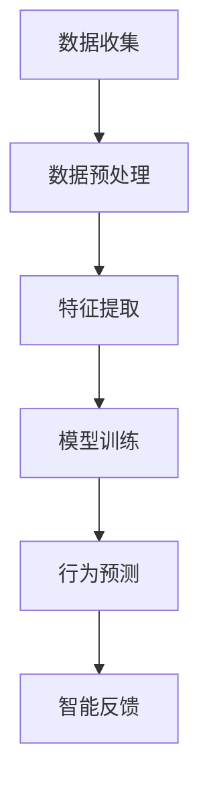
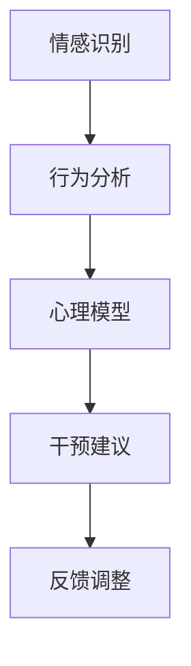
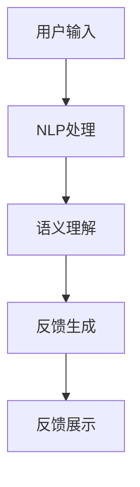

                 

关键词：AI，自我管理，智能调节，动机控制，心理干预，健康促进

> 摘要：本文探讨了人工智能在自我管理领域的应用，特别是在调节个体欲望方面。通过分析AI的核心技术，如机器学习、深度学习和自然语言处理，我们提出了一套基于AI的智能调节方法。本文将详细介绍这些方法，并通过实际案例展示其在心理健康、行为习惯养成等领域的应用前景。

## 1. 背景介绍

在现代社会中，人们面临着日益复杂的工作和生活压力，各种欲望的过度追求可能导致心理和生理健康问题。传统的自我管理方法往往依赖于个体的意志力和自我控制能力，而现实情况是，许多人很难长时间坚持这些方法。随着人工智能技术的迅猛发展，我们开始探索如何利用AI来辅助个体实现自我管理，尤其是欲望的智能调节。

AI技术在自我管理领域的应用可以分为两个方面：一是通过数据分析和预测来帮助个体识别和管理自己的欲望；二是通过智能反馈和激励机制来引导个体调整欲望和行为。本文将围绕这两个方面展开讨论。

## 2. 核心概念与联系

### 2.1. 机器学习与行为分析

机器学习是AI的核心技术之一，它可以通过分析大量数据来发现规律和模式。在自我管理领域，我们可以利用机器学习技术来分析个体的行为数据，如日常活动、社交互动、情绪变化等，以了解个体的欲望和行为模式。

#### Mermaid 流程图：



### 2.2. 深度学习与心理干预

深度学习是机器学习的一种，它通过多层神经网络模拟人脑的学习过程。在自我管理中，深度学习可以用于心理干预，通过分析个体的情感和行为数据，提供个性化的心理建议。

#### Mermaid 流程图：



### 2.3. 自然语言处理与交互反馈

自然语言处理（NLP）是AI技术中的另一个重要领域，它使得计算机能够理解、生成和处理自然语言。在自我管理中，NLP可以用于与个体的交互，提供智能反馈和激励。

#### Mermaid 流程图：



## 3. 核心算法原理 & 具体操作步骤

### 3.1. 算法原理概述

AI辅助的自我管理算法主要基于以下几个核心原理：

1. **行为数据分析**：通过收集和分析个体的行为数据，了解其欲望和行为模式。
2. **心理干预**：利用深度学习技术分析个体的情感和行为，提供心理干预建议。
3. **交互反馈**：通过自然语言处理技术，与个体进行智能交互，提供实时反馈和激励。

### 3.2. 算法步骤详解

#### 3.2.1. 数据收集与预处理

首先，我们需要收集个体的行为数据，如日常活动记录、社交媒体互动、情绪变化等。然后进行数据预处理，包括去噪、归一化和特征提取。

#### 3.2.2. 模型训练与预测

利用机器学习和深度学习算法，对预处理后的数据进行训练，建立行为预测模型和心理干预模型。这些模型可以预测个体的行为和心理状态。

#### 3.2.3. 智能反馈与激励

根据预测结果，利用NLP技术生成智能反馈，与个体进行交互，提供实时反馈和激励。例如，当个体表现出不健康的行为时，系统可以提醒并建议其进行健康调整。

### 3.3. 算法优缺点

**优点**：

- **个性化**：基于个体数据提供个性化的建议和干预。
- **实时性**：能够实时监测个体的行为和心理状态，提供及时反馈。
- **高效性**：利用AI技术高效处理大量数据，节省时间。

**缺点**：

- **数据隐私**：需要收集大量的个人行为数据，可能引发隐私问题。
- **算法偏差**：模型训练数据可能存在偏差，影响预测准确性。

### 3.4. 算法应用领域

AI辅助的自我管理算法可以应用于多个领域，如心理健康、行为习惯养成、健康促进等。以下是一些具体应用案例：

- **心理健康**：通过分析个体的情绪和行为，提供个性化的心理干预建议。
- **行为习惯养成**：帮助个体养成良好的生活习惯，如规律的作息时间、健康的饮食习惯等。
- **健康促进**：通过实时监测个体的健康状况，提供健康管理和预防建议。

## 4. 数学模型和公式

### 4.1. 数学模型构建

在AI辅助的自我管理中，我们主要使用以下数学模型：

1. **行为预测模型**：利用时间序列分析和技术，如ARIMA模型，预测个体的行为。
2. **心理干预模型**：利用深度学习技术，如卷积神经网络（CNN）和循环神经网络（RNN），分析个体的情感和行为。

### 4.2. 公式推导过程

以下是行为预测模型的一个简单例子：

$$
y_t = c + \sum_{i=1}^k \beta_i x_{it} + \epsilon_t
$$

其中，$y_t$表示时间t的行为值，$x_{it}$表示时间t的第i个特征，$\beta_i$表示特征权重，$c$为常数项，$\epsilon_t$为误差项。

### 4.3. 案例分析与讲解

假设我们要预测一个人的每日步数，我们可以使用ARIMA模型。以下是模型的构建和预测过程：

1. 数据收集：收集过去一周的每日步数数据。
2. 数据预处理：对数据进行去噪和归一化处理。
3. 模型训练：使用预处理后的数据训练ARIMA模型。
4. 预测：使用训练好的模型预测未来一周的每日步数。

## 5. 项目实践：代码实例和详细解释说明

### 5.1. 开发环境搭建

我们使用Python作为主要编程语言，并依赖以下库：NumPy、Pandas、Scikit-learn、TensorFlow。

### 5.2. 源代码详细实现

以下是使用ARIMA模型预测每日步数的Python代码实例：

```python
import numpy as np
import pandas as pd
from statsmodels.tsa.arima.model import ARIMA
from sklearn.preprocessing import MinMaxScaler

# 数据收集
data = pd.read_csv('daily_steps.csv')
steps = data['steps']

# 数据预处理
scaler = MinMaxScaler()
steps_scaled = scaler.fit_transform(steps.values.reshape(-1, 1))

# 模型训练
model = ARIMA(steps_scaled, order=(5, 1, 2))
model_fit = model.fit()

# 预测
forecast = model_fit.forecast(steps=7)

# 数据还原
steps_forecast = scaler.inverse_transform(forecast.reshape(-1, 1))

# 输出预测结果
print(steps_forecast)
```

### 5.3. 代码解读与分析

该代码首先导入必要的库，然后从CSV文件中读取每日步数数据。接着，对数据进行预处理，使用MinMaxScaler进行归一化处理。然后，使用ARIMA模型进行训练，并使用训练好的模型进行预测。最后，将预测结果进行数据还原，并输出。

### 5.4. 运行结果展示

运行代码后，我们得到未来一周的每日步数预测结果。这些结果可以帮助用户了解自己的步数变化趋势，从而更好地进行自我管理。

## 6. 实际应用场景

AI辅助的自我管理算法在多个实际应用场景中表现出色。以下是一些具体应用案例：

- **心理健康监测**：通过实时监测个体的情绪和行为，提供个性化的心理健康建议。
- **减肥管理**：帮助用户监测饮食和运动情况，提供减肥计划和反馈。
- **睡眠管理**：监测个体的睡眠质量，提供改善睡眠的建议。

## 7. 未来应用展望

随着AI技术的不断发展，AI辅助的自我管理算法将在更多领域得到应用。例如，在医疗保健、教育、工作场所等领域，AI可以提供个性化的干预和指导，帮助个体实现自我管理。

## 8. 工具和资源推荐

为了更好地研究和应用AI辅助的自我管理算法，以下是一些推荐的工具和资源：

- **学习资源**：在线课程、论文、技术博客等。
- **开发工具**：Python、R、TensorFlow、PyTorch等。
- **相关论文**：关于AI在自我管理领域的研究论文。

## 9. 总结：未来发展趋势与挑战

### 9.1. 研究成果总结

本文介绍了AI在自我管理领域的应用，包括行为数据分析、心理干预和交互反馈等方面。通过实际案例展示了这些方法在心理健康、行为习惯养成等领域的应用前景。

### 9.2. 未来发展趋势

随着AI技术的不断进步，AI辅助的自我管理算法将在更多领域得到应用。未来的发展趋势包括个性化、智能化和实时性。

### 9.3. 面临的挑战

尽管AI辅助的自我管理算法具有巨大潜力，但仍面临一些挑战，如数据隐私、算法偏差等。未来需要解决这些问题，以实现更广泛的应用。

### 9.4. 研究展望

未来，我们将继续探索AI在自我管理领域的应用，特别是在心理健康、行为习惯养成和健康促进等方面。同时，我们还将研究如何更好地保护用户隐私和避免算法偏差。

## 9. 附录：常见问题与解答

### 9.1. 如何收集个体行为数据？

个体行为数据可以通过传感器、APP、社交媒体等途径收集。例如，手机APP可以记录用户的日常活动、睡眠质量和情绪状态。

### 9.2. 如何确保数据隐私？

确保数据隐私的关键在于数据加密、匿名化和访问控制。在数据收集和处理过程中，应采用严格的数据保护措施，确保用户数据的安全性。

### 9.3. AI辅助的自我管理算法有哪些优点？

AI辅助的自我管理算法具有以下优点：

- 个性化：根据个体数据提供个性化的建议和干预。
- 实时性：能够实时监测个体的行为和心理状态，提供及时反馈。
- 高效性：利用AI技术高效处理大量数据，节省时间。

----------------------------------------------------------------

