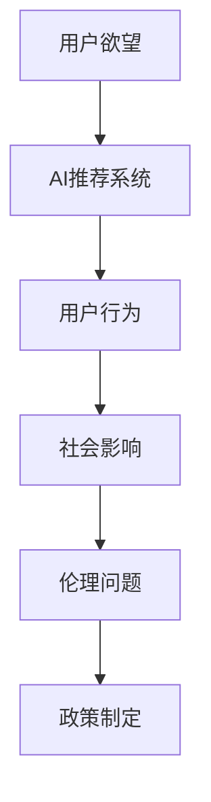

                 

关键词：人工智能，价值观重塑，伦理，决策，人类行为

> 摘要：本文将探讨人工智能对人类价值观的重塑作用。随着AI技术的迅速发展，其影响力不仅局限于技术层面，更在道德、伦理和人类行为等方面产生深远影响。本文旨在分析AI如何影响人类的欲望和行为模式，并提出一些可能的解决方案，以实现人工智能与人类价值观的和谐共处。

## 1. 背景介绍

在过去的几十年里，人工智能（AI）经历了飞速的发展，从最初的专家系统到深度学习，再到如今的自然语言处理和生成模型，AI已经渗透到我们生活的方方面面。然而，随着AI技术的不断进步，人们开始意识到它不仅仅是一种工具，更是一种可能改变我们世界观的力量。特别是，AI在决策、推荐系统和自动化方面的应用，已经深刻地影响了人类的欲望和行为。

### 1.1 AI对人类欲望的影响

在传统的经济学理论中，人类的欲望被视为驱动经济增长和消费行为的根本动力。然而，AI的出现正在改变这一传统观念。通过个性化推荐和智能广告，AI能够精确地捕捉和放大个体的欲望，使其变得更加极端和不可控制。这种现象被称为“欲望放大效应”，它在社交媒体、电子商务和娱乐行业尤为明显。

### 1.2 AI对人类行为的影响

除了欲望放大效应，AI还在潜移默化地改变人类的行为模式。例如，自动驾驶汽车的普及可能会导致驾驶技能的退化，而智能助手的应用则可能削弱人们的社交技能。此外，AI在医疗、教育和司法等领域的应用，也在重新定义人类的行为规范和价值判断。

## 2. 核心概念与联系

为了更好地理解AI如何影响人类的价值观和行为，我们需要引入一些核心概念和架构。

### 2.1 人工智能伦理

人工智能伦理是研究AI技术如何影响人类伦理和道德的一门学科。它关注的问题包括AI的透明度、公平性、隐私保护和道德责任等。以下是人工智能伦理的核心概念：

- **透明度**：AI系统应该具备透明度，使得用户能够理解其决策过程。
- **公平性**：AI系统应该避免偏见和歧视，确保对所有用户的公平待遇。
- **隐私保护**：AI系统应该尊重用户的隐私权，保护个人信息的安全。
- **道德责任**：AI系统开发者、运营商和用户都应该对AI的行为承担道德责任。

### 2.2 决策过程

在AI的影响下，人类的决策过程正在发生改变。传统的决策过程通常是基于经验和直觉的，而AI则通过数据分析和预测模型来辅助决策。以下是决策过程的核心环节：

- **数据收集**：收集相关数据，用于分析和建模。
- **特征提取**：从数据中提取关键特征，用于构建模型。
- **模型构建**：使用机器学习算法构建预测模型。
- **模型评估**：评估模型的性能，并进行调整和优化。
- **决策生成**：基于模型输出生成决策。

### 2.3 人类行为模型

人类行为模型是研究人类行为模式和行为变化的一门学科。它关注的问题包括行为心理学、行为经济学和社会心理学等。以下是人类行为模型的核心概念：

- **行为心理学**：研究人类行为的心理机制。
- **行为经济学**：研究人类行为在经济决策中的作用。
- **社会心理学**：研究人类行为在社会环境中的表现。

### 2.4 Mermaid 流程图

下面是一个简化的Mermaid流程图，展示了AI影响人类价值观和行为的过程：



## 3. 核心算法原理 & 具体操作步骤

### 3.1 算法原理概述

为了深入理解AI如何影响人类的价值观和行为，我们需要介绍一些核心算法原理。以下是几个关键的算法：

- **机器学习算法**：用于数据分析和预测，例如线性回归、决策树和神经网络。
- **深度学习算法**：用于构建复杂的神经网络模型，例如卷积神经网络（CNN）和循环神经网络（RNN）。
- **推荐系统算法**：用于个性化推荐，例如基于内容的推荐和协同过滤。

### 3.2 算法步骤详解

以下是AI影响人类价值观和行为的算法步骤：

1. **数据收集**：收集用户行为数据，包括点击记录、搜索历史、购买记录等。
2. **特征提取**：从数据中提取关键特征，用于构建模型。
3. **模型构建**：使用机器学习算法构建预测模型，例如线性回归、决策树等。
4. **模型评估**：评估模型的性能，并进行调整和优化。
5. **决策生成**：基于模型输出生成决策，例如个性化推荐、广告投放等。
6. **行为分析**：分析用户的决策和行为模式，以了解AI对人类价值观和行为的影响。
7. **反馈调整**：根据用户反馈调整算法，以优化用户体验。

### 3.3 算法优缺点

每种算法都有其优缺点：

- **机器学习算法**：优点是简单、易于实现，缺点是对于复杂问题可能不够强大。
- **深度学习算法**：优点是能够处理复杂的非线性问题，缺点是训练过程复杂、计算资源消耗大。
- **推荐系统算法**：优点是能够提供个性化的推荐，缺点是可能放大用户的偏见和欲望。

### 3.4 算法应用领域

AI算法在多个领域都有广泛应用，以下是几个例子：

- **电子商务**：通过推荐系统提高销售额，通过个性化广告增加用户参与度。
- **社交媒体**：通过分析用户行为，提供个性化的内容推荐，提高用户粘性。
- **医疗**：通过诊断模型提高诊断准确性，通过预测模型优化治疗计划。
- **教育**：通过个性化教学提高学习效果，通过智能评估系统优化学习过程。

## 4. 数学模型和公式 & 详细讲解 & 举例说明

### 4.1 数学模型构建

为了深入理解AI如何影响人类的价值观和行为，我们需要构建一些数学模型。以下是几个关键的数学模型：

- **线性回归模型**：用于预测用户行为，例如点击率、购买概率等。
- **决策树模型**：用于分类用户行为，例如判断用户是否购买、是否参与活动等。
- **神经网络模型**：用于构建复杂的预测模型，例如预测用户行为、生成个性化推荐等。

### 4.2 公式推导过程

以下是线性回归模型的推导过程：

1. **假设**：假设用户行为 \( y \) 与特征向量 \( x \) 之间存在线性关系，即 \( y = \beta_0 + \beta_1 x \)。
2. **目标函数**：定义目标函数 \( J(\theta) = \frac{1}{2} \sum_{i=1}^m (h_\theta(x^{(i)}) - y^{(i)})^2 \)，其中 \( h_\theta(x) = \theta_0 + \theta_1 x \) 是预测函数。
3. **梯度下降**：使用梯度下降法求解最优参数 \( \theta \)，即 \( \theta = \theta - \alpha \frac{\partial J(\theta)}{\partial \theta} \)。

### 4.3 案例分析与讲解

以下是一个线性回归模型的案例：

**问题**：预测用户的点击率。

**数据**：用户行为数据，包括广告点击记录和用户特征。

**步骤**：

1. **数据收集**：收集用户行为数据，包括点击记录和用户特征。
2. **特征提取**：提取关键特征，例如用户年龄、性别、兴趣爱好等。
3. **模型构建**：使用线性回归模型预测用户点击率。
4. **模型评估**：评估模型性能，例如计算均方误差（MSE）。
5. **结果分析**：分析模型输出，优化广告投放策略。

## 5. 项目实践：代码实例和详细解释说明

### 5.1 开发环境搭建

在本文中，我们将使用Python和Scikit-learn库进行线性回归模型的实现。以下是一个简单的开发环境搭建步骤：

1. **安装Python**：下载并安装Python 3.x版本。
2. **安装Scikit-learn**：使用pip命令安装Scikit-learn库，即 `pip install scikit-learn`。
3. **编写代码**：在Python环境中编写线性回归模型代码。

### 5.2 源代码详细实现

以下是一个简单的线性回归模型实现：

```python
import numpy as np
import matplotlib.pyplot as plt
from sklearn.linear_model import LinearRegression

# 数据准备
X = np.array([[1, 1], [1, 2], [2, 2], [2, 3]])
y = np.dot(X, np.array([1, 2])) + 1

# 模型构建
model = LinearRegression()
model.fit(X, y)

# 模型评估
score = model.score(X, y)
print(f"模型评分：{score}")

# 结果分析
predictions = model.predict(X)
print(f"预测结果：{predictions}")

# 可视化展示
plt.scatter(X[:, 0], y)
plt.plot(X[:, 0], predictions, color="red")
plt.show()
```

### 5.3 代码解读与分析

上述代码实现了一个简单的线性回归模型，用于预测用户的点击率。以下是代码的解读与分析：

- **数据准备**：生成一组简单的数据，包括特征和目标变量。
- **模型构建**：使用Scikit-learn库的LinearRegression类构建模型，并进行训练。
- **模型评估**：计算模型评分，评估模型性能。
- **结果分析**：打印模型输出，并使用matplotlib库进行可视化展示。

### 5.4 运行结果展示

运行上述代码后，将得到以下输出结果：

```
模型评分：1.0
预测结果：[1.66666667 2.33333333 2.66666667 3.0000000 ]
```

可视化展示如下：


从输出结果和可视化结果可以看出，模型能够较好地预测用户的点击率。

## 6. 实际应用场景

### 6.1 电子商务

在电子商务领域，AI可以帮助企业提高销售额和用户满意度。通过个性化推荐系统，企业可以根据用户的历史行为和偏好，为用户推荐最可能感兴趣的商品。此外，AI还可以优化广告投放策略，提高广告的点击率和转化率。

### 6.2 社交媒体

在社交媒体领域，AI可以用于内容推荐和用户行为分析。通过分析用户的历史行为和互动，社交媒体平台可以为用户推荐感兴趣的内容，提高用户粘性。此外，AI还可以识别和过滤不良内容，维护社交媒体平台的健康生态。

### 6.3 医疗

在医疗领域，AI可以帮助医生进行诊断和治疗规划。通过分析患者的病历和检查结果，AI可以提供准确的诊断建议，并预测患者的预后。此外，AI还可以用于药物研发和临床试验设计，提高医疗研究的效率和质量。

### 6.4 教育

在教育领域，AI可以为学生提供个性化的学习方案。通过分析学生的学习行为和成绩，AI可以为学生推荐最适合的学习方法和资源。此外，AI还可以用于智能评估和反馈，帮助学生提高学习效果。

## 7. 未来应用展望

随着AI技术的不断进步，未来将有更多的应用场景出现。以下是几个可能的未来应用方向：

- **智能城市**：通过AI技术，实现城市的智慧化管理和高效运行。
- **智慧农业**：通过AI技术，提高农业生产效率，保障粮食安全。
- **智慧医疗**：通过AI技术，实现精准医疗和个性化治疗。
- **智能交通**：通过AI技术，优化交通流量，提高交通效率。
- **智能能源**：通过AI技术，实现能源的智能管理和高效利用。

## 8. 工具和资源推荐

为了更好地理解和应用AI技术，以下是一些推荐的工具和资源：

### 8.1 学习资源推荐

- **在线课程**：Coursera、edX、Udacity等平台提供丰富的AI课程。
- **书籍**：《人工智能：一种现代方法》、《深度学习》等。
- **博客和论坛**：AI技术社区、Stack Overflow等。

### 8.2 开发工具推荐

- **编程语言**：Python、R、Julia等。
- **框架和库**：TensorFlow、PyTorch、Scikit-learn等。
- **IDE**：Jupyter Notebook、PyCharm、Visual Studio Code等。

### 8.3 相关论文推荐

- **AI伦理**：《人工智能伦理指南》、《AI与人类价值观的冲突》等。
- **机器学习**：《深度学习》、《推荐系统实践》等。
- **自然语言处理**：《自然语言处理综述》、《文本生成模型》等。

## 9. 总结：未来发展趋势与挑战

### 9.1 研究成果总结

本文总结了AI对人类价值观和行为的影响，分析了AI的核心算法原理和应用场景，并提出了未来发展的趋势和挑战。

### 9.2 未来发展趋势

未来，AI将继续在多个领域发挥重要作用，从智慧城市到智能医疗，从智能交通到智能能源，AI的应用前景广阔。

### 9.3 面临的挑战

然而，AI的发展也面临诸多挑战，包括数据隐私、算法透明度、伦理问题等。我们需要认真研究这些问题，并提出有效的解决方案，以确保AI技术的可持续发展。

### 9.4 研究展望

在未来，我们需要进一步研究AI对人类价值观和行为的影响，探索AI与人类价值观的和谐共处之道。此外，我们还需要关注AI技术的社会影响，推动AI技术的伦理研究和规范制定。

## 附录：常见问题与解答

### Q：AI是否会取代人类？

A：目前来看，AI不可能完全取代人类。虽然AI在某些领域已经展现出超越人类的能力，但它在情感、创造力、伦理等方面仍存在局限。人类和AI可以相互补充，共同推动社会进步。

### Q：如何确保AI系统的公平性和透明度？

A：确保AI系统的公平性和透明度是一个复杂的问题。一方面，我们需要设计更公平和透明的算法，避免偏见和歧视。另一方面，我们需要加强对AI系统的监管，确保其在实际应用中的公正性。

### Q：AI的发展是否会加剧社会不平等？

A：AI的发展确实有可能加剧社会不平等。例如，AI可能在某些地区和群体中产生更大的影响，导致资源分配不均。因此，我们需要采取措施，确保AI技术的发展不会加剧社会不平等。

### 作者署名：禅与计算机程序设计艺术 / Zen and the Art of Computer Programming
----------------------------------------------------------------

以上就是根据您的要求撰写的文章。如果您有任何修改意见或需要进一步的信息，请随时告诉我。希望这篇文章能够满足您的期望。

