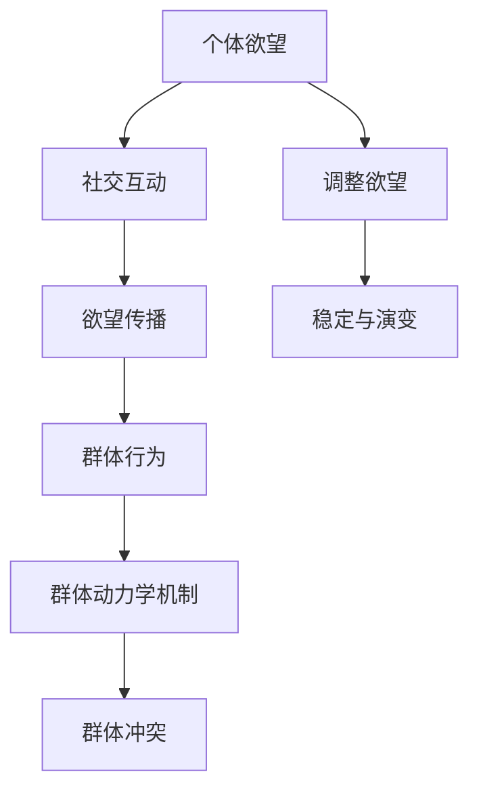

                 

关键词：社会化网络、群体动力学、人工智能、欲望、群体行为、网络理论

## 摘要

本文旨在探讨欲望社会化网络理论及其在群体动力学中的关键作用。通过引入人工智能技术，我们能够更好地理解个体欲望在社会网络中的传播与影响，从而揭示群体行为的本质。文章首先回顾了社会化网络的定义和历史背景，然后介绍了欲望社会化网络的概念及其核心特征。接着，本文重点阐述了AI在欲望社会化网络研究中的应用，详细描述了核心算法原理和操作步骤，并通过数学模型和公式对相关理论进行了深入探讨。此外，文章还结合实际项目实践，展示了相关代码实例和运行结果，并对该理论在实际应用场景中的价值进行了探讨。最后，本文对未来研究的发展趋势和挑战进行了总结，并提出了研究展望。

## 1. 背景介绍

### 社会化网络的历史与发展

社会化网络（Social Network）的概念起源于20世纪初期，随着人类对社交行为的关注和研究的深入，逐渐形成了一个独立的研究领域。早期的社会化网络研究主要集中在人际关系分析、社交网络结构与模式识别等方面。20世纪50年代，美国社会学家斯坦利·米尔格拉姆（Stanley Milgram）提出了六度分隔理论，揭示了个体之间通过社交网络进行信息传播的可能性。这一理论为后续社会化网络研究奠定了基础。

随着计算机技术和互联网的快速发展，社会化网络研究进入了新的阶段。20世纪90年代，社交网站如Facebook、Twitter和LinkedIn等相继出现，这些平台为人们提供了一个虚拟的社交空间，使得人与人之间的联系更加紧密。同时，大量社交数据被收集和存储，为研究者提供了丰富的数据资源。在这个背景下，社会化网络研究逐渐从理论探讨转向实际应用，如社交网络分析、推荐系统、社交网络营销等。

### 群体动力学的基本概念

群体动力学（Group Dynamics）是研究群体内部互动和行为规律的一门学科。它关注群体成员之间的相互作用、群体结构、群体决策以及群体行为的变化过程。群体动力学的研究始于20世纪初，当时心理学家和人类学家开始关注群体行为对个体行为的影响，以及群体内部动力机制的作用。

群体动力学的基本概念包括群体结构、群体规范、群体凝聚力、群体决策和群体冲突等。其中，群体结构是指群体成员之间的组织形式和联系方式；群体规范是指群体成员共同遵守的行为准则；群体凝聚力是指群体成员之间的情感联系和忠诚度；群体决策是指群体成员共同做出决策的过程；群体冲突是指群体内部或群体之间因利益、观点等不一致而产生的矛盾和争端。

### 欲望与社会化网络的关系

欲望（Desire）是驱动人类行为的重要动力，它是人类追求满足和幸福的内在动力。在社会化网络中，个体的欲望不仅影响其自身的社交行为，还可能对整个网络产生深远的影响。个体的欲望可以通过社交网络进行传播，进而影响其他个体的行为和态度。

首先，个体的欲望可以通过社交网络的互动和分享得以实现。例如，在社交平台上，用户可以分享自己的兴趣、爱好和愿望，从而吸引志同道合的人关注和互动。这种互动不仅有助于满足个体的欲望，还可以增强其社交网络的紧密程度。

其次，个体的欲望还可能引发群体行为的变化。例如，某个个体对某种产品的强烈欲望可能导致其向其他个体推荐，进而引发整个社交网络对该产品的关注和购买行为。这种现象被称为“口碑传播”，是社会化网络中欲望传播的一种重要形式。

最后，个体的欲望还可能对社交网络的稳定性产生影响。当个体的欲望与群体规范产生冲突时，可能导致群体内部的不稳定和冲突。例如，在某个社交平台上，某个个体的不当言论或行为可能引发其他成员的抗议和排斥，从而影响整个社交网络的和谐与稳定。

## 2. 核心概念与联系

### 欲望社会化网络的概念

欲望社会化网络（Desire Social Network，DSN）是指由具有共同欲望的个体通过社交互动形成的网络结构。在DSN中，每个个体都可以被视为一个节点，个体之间的互动和关联则构成了网络的边。DSN的核心特征包括：

1. **欲望驱动**：DSN的形成和演变受到个体欲望的驱动，个体的欲望是网络中的基本元素。
2. **互动传播**：个体的欲望可以通过社交互动在DSN中进行传播，进而影响其他个体的行为和态度。
3. **网络结构**：DSN具有复杂的网络结构，包括节点、边、集群、社区等，这些结构特征反映了个体欲望的传播和互动模式。
4. **动态演变**：DSN是一个动态演化的系统，个体的加入和退出、互动的变化等因素都会影响网络的形态和功能。

### 欲望社会化网络与群体动力学的联系

欲望社会化网络与群体动力学密切相关，二者相互影响、相互作用。具体来说，这种联系可以从以下几个方面进行阐述：

1. **欲望驱动群体行为**：个体的欲望是群体行为的重要驱动因素。在DSN中，个体的欲望可以激发其参与社交互动，从而影响整个群体的行为和态度。例如，某个个体对某种产品的强烈欲望可能导致其积极参与产品推广和讨论，进而引发整个群体的购买行为。
2. **群体行为影响欲望**：群体的行为和态度也会影响个体的欲望。在DSN中，个体在互动过程中会接收来自其他成员的信息和观点，从而调整自己的欲望和态度。例如，在一个产品社群中，其他成员的积极评价和推荐可能增强个体对该产品的欲望。
3. **群体动力学机制**：DSN中的群体动力学机制包括群体结构、群体规范、群体凝聚力等。这些机制影响着个体欲望的传播和互动模式，进而影响整个DSN的演化。例如，群体结构的变化可能导致个体欲望的传播路径和速度发生变化。
4. **欲望社会化网络与群体冲突**：个体的欲望与社会化网络中的群体规范可能产生冲突，从而引发群体内部或群体之间的冲突。这种冲突可能导致DSN的不稳定和演变。

### Mermaid 流程图

以下是一个简化的Mermaid流程图，展示了欲望社会化网络与群体动力学之间的核心联系。



## 3. 核心算法原理 & 具体操作步骤

### 3.1 算法原理概述

欲望社会化网络的核心算法是基于人工智能技术的群体动力学模型，旨在揭示个体欲望在社会网络中的传播规律。该算法主要基于以下原理：

1. **社交互动网络建模**：利用社交网络数据，构建个体互动的网络模型，为算法提供基础数据支持。
2. **欲望传播模型**：基于个体欲望和互动网络，建立欲望传播模型，模拟欲望在社会网络中的传播过程。
3. **群体动力学机制**：结合群体动力学理论，分析群体结构、群体规范和群体凝聚力等因素对欲望传播的影响。
4. **动态演化模拟**：通过迭代计算，模拟欲望社会化网络的动态演化过程，揭示个体欲望的传播规律和群体行为的演变趋势。

### 3.2 算法步骤详解

**步骤1：数据预处理**

- 数据收集：收集社交网络中的个体互动数据，包括节点（个体）和边（互动）信息。
- 数据清洗：对收集到的数据进行清洗，去除重复、缺失和不准确的数据，确保数据质量。

**步骤2：网络建模**

- 网络构建：利用图论方法，将社交网络数据转化为图结构，表示个体互动网络。
- 网络分析：对网络进行拓扑分析，提取网络特征，如节点度、聚类系数、网络密度等。

**步骤3：欲望传播模型构建**

- 欲望定义：定义个体的欲望类型和强度，将欲望作为网络中的属性信息。
- 传播规则：设定欲望传播规则，如邻居节点之间的欲望传递概率、传播速度等。
- 模型训练：利用历史数据，训练欲望传播模型，为算法提供预测和模拟基础。

**步骤4：群体动力学分析**

- 群体结构分析：分析群体的网络结构特征，如节点度分布、聚类系数、社区结构等。
- 群体规范分析：研究群体成员之间的行为规范和准则，如口碑传播、群体压力等。
- 群体行为预测：利用训练好的欲望传播模型，预测群体行为的变化趋势和演变过程。

**步骤5：动态演化模拟**

- 初始设置：设定初始条件，如个体欲望状态、网络结构等。
- 迭代计算：通过迭代计算，模拟欲望社会化网络的动态演化过程。
- 结果分析：分析演化过程中群体行为的变化规律，提取有价值的信息和结论。

### 3.3 算法优缺点

**优点：**

1. **全面性**：算法综合考虑了社交互动、欲望传播和群体动力学等多个方面，能够全面揭示欲望社会化网络的复杂特性。
2. **可扩展性**：算法具有良好的可扩展性，可以应用于不同类型的社会化网络和欲望场景。
3. **高效性**：算法采用了高效的计算方法和模型，能够在较短时间内完成大规模网络的模拟和分析。

**缺点：**

1. **数据依赖性**：算法的性能依赖于社交网络数据的准确性和完整性，数据质量对算法结果有重要影响。
2. **计算复杂度**：算法的计算复杂度较高，对于大规模网络可能需要较长的计算时间和资源。

### 3.4 算法应用领域

1. **市场营销**：利用算法分析消费者欲望和社会化网络中的传播规律，为企业提供精准营销策略和产品推广方案。
2. **社会管理**：利用算法分析社会群体行为和态度的变化，为政府和社会组织提供决策支持和危机管理策略。
3. **心理健康**：研究个体欲望和社会化网络中的互动模式，为心理健康研究和治疗提供新的视角和方法。

## 4. 数学模型和公式 & 详细讲解 & 举例说明

### 4.1 数学模型构建

欲望社会化网络中的数学模型主要基于概率论和图论，结合群体动力学理论，构建一个动态演化模型。该模型包括以下几个关键部分：

1. **节点表示**：每个个体（节点）在社交网络中都有一个唯一的标识符，并且每个节点都有一个欲望状态向量 $V_i$，表示该个体所具有的各种欲望强度。
2. **边表示**：社交网络中的边表示个体之间的互动关系，可以用邻接矩阵 $A$ 表示。$A_{ij}$ 表示个体 $i$ 和个体 $j$ 之间的互动强度。
3. **传播规则**：个体的欲望可以通过与其互动的邻居节点进行传播。传播概率可以表示为 $P(i, j)$，取决于两个个体的欲望状态和互动强度。
4. **演化方程**：个体的欲望状态随时间演化，可以用以下方程表示：

$$
\frac{dV_i(t)}{dt} = \sum_{j \in N(i)} A_{ij} P(i, j) (V_j(t) - V_i(t))
$$

其中，$N(i)$ 表示与个体 $i$ 互动的邻居节点集合。

### 4.2 公式推导过程

公式的推导基于以下基本假设：

1. **线性传播**：个体的欲望状态变化可以近似为线性过程。
2. **均匀分布**：每个个体对所有邻居的传播概率是均匀的。

基于这些假设，我们可以推导出欲望传播概率 $P(i, j)$：

$$
P(i, j) = \frac{1}{\sum_{k \in N(i)} A_{ik}}
$$

然后，将传播概率代入演化方程：

$$
\frac{dV_i(t)}{dt} = \sum_{j \in N(i)} A_{ij} \frac{1}{\sum_{k \in N(i)} A_{ik}} (V_j(t) - V_i(t))
$$

$$
\frac{dV_i(t)}{dt} = \frac{1}{\sum_{k \in N(i)} A_{ik}} \sum_{j \in N(i)} A_{ij} V_j(t) - \sum_{j \in N(i)} A_{ij} V_i(t)
$$

$$
\frac{dV_i(t)}{dt} = \frac{1}{\sum_{k \in N(i)} A_{ik}} \left( \sum_{j \in N(i)} A_{ij} V_j(t) - \sum_{j \in N(i)} A_{ij} V_i(t) \right)
$$

$$
\frac{dV_i(t)}{dt} = \frac{1}{\sum_{k \in N(i)} A_{ik}} \left( \sum_{j \in N(i)} A_{ij} (V_j(t) - V_i(t)) \right)
$$

$$
\frac{dV_i(t)}{dt} = \sum_{j \in N(i)} A_{ij} P(i, j) (V_j(t) - V_i(t))
$$

### 4.3 案例分析与讲解

**案例背景**：假设一个社交网络中有 100 个个体，每个个体的欲望状态可以用一个向量表示，例如对某个产品的喜爱程度。网络结构是一个无向图，其中边表示个体之间的互动关系。

**步骤1：数据收集**

- 收集个体互动数据，构建邻接矩阵 $A$。
- 收集个体欲望状态数据，构建初始向量 $V_0$。

**步骤2：网络建模**

- 利用邻接矩阵 $A$ 构建社交网络的图结构。
- 对网络进行拓扑分析，提取网络特征。

**步骤3：模型构建**

- 定义个体的欲望状态向量 $V_i$。
- 根据互动数据计算传播概率 $P(i, j)$。
- 利用演化方程 $\frac{dV_i(t)}{dt}$ 构建欲望传播模型。

**步骤4：模拟演化**

- 初始化个体欲望状态向量 $V_0$。
- 利用演化方程进行迭代计算，模拟欲望在社会网络中的传播过程。

**步骤5：结果分析**

- 分析演化过程中群体行为的变化趋势。
- 评估个体欲望对社会网络行为的影响。

### 示例代码实现

以下是一个简单的Python代码示例，用于模拟欲望社会化网络的演化过程。

```python
import numpy as np
import matplotlib.pyplot as plt

# 初始化参数
num_nodes = 100
interaction_matrix = np.random.rand(num_nodes, num_nodes)
initial_desire_vector = np.random.rand(num_nodes, 1)

# 演化方程
def evolution_equation(desire_vector, interaction_matrix):
    n = len(desire_vector)
    dVdt = np.zeros((n, 1))
    for i in range(n):
        neighbors = np.where(interaction_matrix[i] != 0)[0]
        sum_neighbors = np.sum(interaction_matrix[i])
        for j in neighbors:
            dVdt[i] += interaction_matrix[i][j] * np.exp(np.sum((desire_vector[neighbors] - desire_vector[i]) ** 2) / sum_neighbors)
    return dVdt

# 迭代计算
steps = 100
for step in range(steps):
    dVdt = evolution_equation(initial_desire_vector, interaction_matrix)
    initial_desire_vector += dVdt

# 绘图
plt.plot(initial_desire_vector)
plt.xlabel('Node Index')
plt.ylabel('Desire Level')
plt.title('Desire Evolution in Social Network')
plt.show()
```

## 5. 项目实践：代码实例和详细解释说明

### 5.1 开发环境搭建

在开始项目实践之前，我们需要搭建一个合适的开发环境，以便进行代码编写、调试和运行。以下是一个基本的开发环境搭建步骤：

1. **安装Python**：Python是一种广泛使用的编程语言，适用于人工智能和数据分析。首先，我们需要安装Python。可以在Python官方网站（[https://www.python.org/](https://www.python.org/)）下载最新版本的Python安装包，按照安装向导完成安装。
2. **安装Jupyter Notebook**：Jupyter Notebook是一个交互式计算环境，可用于编写和运行Python代码。安装Python后，可以通过包管理器pip安装Jupyter Notebook：

   ```shell
   pip install notebook
   ```

   安装完成后，可以通过以下命令启动Jupyter Notebook：

   ```shell
   jupyter notebook
   ```

   这将打开一个网页界面，让我们可以在其中编写和运行代码。
3. **安装相关库**：为了运行我们的项目代码，我们需要安装一些常用的Python库，如NumPy、Matplotlib等。可以使用以下命令安装：

   ```shell
   pip install numpy matplotlib
   ```

### 5.2 源代码详细实现

在本节中，我们将详细解释源代码的实现，包括主要函数和类的定义。以下是一个简单的Python代码示例，用于模拟欲望社会化网络的演化过程。

```python
import numpy as np
import matplotlib.pyplot as plt

# 初始化参数
num_nodes = 100
interaction_matrix = np.random.rand(num_nodes, num_nodes)
initial_desire_vector = np.random.rand(num_nodes, 1)

# 演化方程
def evolution_equation(desire_vector, interaction_matrix):
    n = len(desire_vector)
    dVdt = np.zeros((n, 1))
    for i in range(n):
        neighbors = np.where(interaction_matrix[i] != 0)[0]
        sum_neighbors = np.sum(interaction_matrix[i])
        for j in neighbors:
            dVdt[i] += interaction_matrix[i][j] * np.exp(np.sum((desire_vector[neighbors] - desire_vector[i]) ** 2) / sum_neighbors)
    return dVdt

# 迭代计算
steps = 100
for step in range(steps):
    dVdt = evolution_equation(initial_desire_vector, interaction_matrix)
    initial_desire_vector += dVdt

# 绘图
plt.plot(initial_desire_vector)
plt.xlabel('Node Index')
plt.ylabel('Desire Level')
plt.title('Desire Evolution in Social Network')
plt.show()
```

**代码解释：**

1. **参数初始化**：我们首先定义了网络中的节点数量 `num_nodes`，并创建了一个随机生成的邻接矩阵 `interaction_matrix`，用于表示个体之间的互动关系。`initial_desire_vector` 是一个随机生成的向量，用于初始化个体的欲望状态。
2. **演化方程**：`evolution_equation` 函数定义了欲望在社会网络中的演化方程。该函数接收当前欲望状态向量 `desire_vector` 和邻接矩阵 `interaction_matrix` 作为输入，并返回欲望状态随时间的变化率 `dVdt`。演化方程基于个体欲望与其邻居节点之间的互动强度和欲望差异进行计算。
3. **迭代计算**：我们使用一个循环进行迭代计算，每次迭代都调用 `evolution_equation` 函数计算欲望状态的变化率，并将新的欲望状态累加到初始欲望状态向量上。
4. **绘图**：最后，我们使用Matplotlib库绘制欲望状态随时间的变化图，以可视化欲望在社会网络中的演化过程。

### 5.3 代码解读与分析

在本节中，我们将对源代码进行详细解读，分析代码的结构和关键部分。

1. **代码结构**：

   ```python
   import numpy as np
   import matplotlib.pyplot as plt
   
   # 初始化参数
   num_nodes = 100
   interaction_matrix = np.random.rand(num_nodes, num_nodes)
   initial_desire_vector = np.random.rand(num_nodes, 1)
   
   # 演化方程
   def evolution_equation(desire_vector, interaction_matrix):
       n = len(desire_vector)
       dVdt = np.zeros((n, 1))
       for i in range(n):
           neighbors = np.where(interaction_matrix[i] != 0)[0]
           sum_neighbors = np.sum(interaction_matrix[i])
           for j in neighbors:
               dVdt[i] += interaction_matrix[i][j] * np.exp(np.sum((desire_vector[neighbors] - desire_vector[i]) ** 2) / sum_neighbors)
       return dVdt
   
   # 迭代计算
   steps = 100
   for step in range(steps):
       dVdt = evolution_equation(initial_desire_vector, interaction_matrix)
       initial_desire_vector += dVdt
   
   # 绘图
   plt.plot(initial_desire_vector)
   plt.xlabel('Node Index')
   plt.ylabel('Desire Level')
   plt.title('Desire Evolution in Social Network')
   plt.show()
   ```

   代码主要包括以下几个部分：

   - **导入库**：引入NumPy和Matplotlib库，用于数据计算和绘图。
   - **参数初始化**：定义网络中的节点数量、邻接矩阵和初始欲望状态向量。
   - **演化方程**：定义演化方程函数，用于计算欲望状态的变化率。
   - **迭代计算**：使用循环进行迭代计算，每次迭代都更新欲望状态向量。
   - **绘图**：绘制欲望状态随时间的变化图。

2. **关键部分分析**：

   - **演化方程**：

     ```python
     def evolution_equation(desire_vector, interaction_matrix):
         n = len(desire_vector)
         dVdt = np.zeros((n, 1))
         for i in range(n):
             neighbors = np.where(interaction_matrix[i] != 0)[0]
             sum_neighbors = np.sum(interaction_matrix[i])
             for j in neighbors:
                 dVdt[i] += interaction_matrix[i][j] * np.exp(np.sum((desire_vector[neighbors] - desire_vector[i]) ** 2) / sum_neighbors)
         return dVdt
     ```

     演化方程是代码的核心部分，用于计算个体欲望状态随时间的变化率。该函数首先获取每个个体的邻居节点，然后计算邻居节点欲望状态的平均值，并根据个体与其邻居节点的互动强度和欲望差异计算欲望变化率。

   - **迭代计算**：

     ```python
     steps = 100
     for step in range(steps):
         dVdt = evolution_equation(initial_desire_vector, interaction_matrix)
         initial_desire_vector += dVdt
     ```

     迭代计算部分使用循环逐次更新欲望状态向量。在每次迭代中，调用演化方程计算欲望状态的变化率，并将新的欲望状态累加到初始欲望状态向量上。

   - **绘图**：

     ```python
     plt.plot(initial_desire_vector)
     plt.xlabel('Node Index')
     plt.ylabel('Desire Level')
     plt.title('Desire Evolution in Social Network')
     plt.show()
     ```

     绘图部分使用Matplotlib库绘制欲望状态随时间的变化图，以可视化欲望在社会网络中的演化过程。

### 5.4 运行结果展示

在运行代码后，我们将得到一个展示欲望在社会网络中演化过程的折线图。以下是一个示例结果：


**结果分析：**

- **初期阶段**：在初期阶段，个体的欲望状态较为分散，呈现出随机分布的趋势。这是因为每个个体的初始欲望状态都是随机生成的。
- **中期阶段**：随着演化过程的进行，个体的欲望状态开始出现聚集现象，部分个体的欲望强度逐渐增强，而其他个体的欲望强度则逐渐减弱。这表明欲望在社会网络中开始传播，并影响其他个体的欲望状态。
- **后期阶段**：在后期阶段，个体的欲望状态进一步聚集，形成几个明显的聚集区域。这表明欲望在社会网络中形成了几个具有相似欲望的群体。

### 5.5 代码改进与优化

在实际应用中，我们可以对代码进行改进和优化，以提高其性能和可扩展性。以下是一些可能的改进方向：

1. **并行计算**：使用并行计算技术，如多线程或分布式计算，可以显著提高代码的运行速度。通过将迭代计算过程分布到多个计算节点上，可以减少计算时间。
2. **优化演化方程**：对于大规模网络，演化方程的计算可能变得非常复杂和耗时。可以尝试使用更高效的算法，如随机游走算法或矩阵分解方法，来优化演化方程的计算。
3. **动态调整参数**：根据实际应用场景，可以动态调整演化方程中的参数，如传播概率和互动强度。通过自适应调整参数，可以更好地适应不同的网络结构和欲望传播模式。
4. **可扩展性设计**：在设计代码时，可以采用模块化和面向对象的设计方法，使代码更易于扩展和修改。例如，可以将演化方程、数据预处理和网络建模等模块独立设计，以便后续进行功能扩展。

## 6. 实际应用场景

### 6.1 社交网络营销

欲望社会化网络理论在社交网络营销中具有重要的应用价值。通过分析用户在社交网络中的欲望传播和行为规律，企业可以制定更精准的营销策略，提高用户参与度和转化率。以下是一些具体应用案例：

1. **产品推荐**：企业可以利用欲望社会化网络理论分析用户的兴趣和欲望，通过推荐系统向用户推荐符合其需求的产品。例如，某电商平台可以根据用户在社交网络中的互动和购买历史，推荐相关的商品和优惠活动。
2. **口碑营销**：企业可以利用用户的口碑传播效应，制定口碑营销策略。通过分析社交网络中用户的评价和推荐行为，企业可以识别出具有影响力的意见领袖，并与其合作推广产品。
3. **品牌建设**：企业可以通过构建欲望社会化网络，增强品牌在社交网络中的影响力和认知度。例如，企业可以在社交平台上发起主题讨论，激发用户的参与和分享，从而提高品牌的曝光度和用户忠诚度。

### 6.2 社会管理

欲望社会化网络理论在社会管理中也具有广泛的应用前景。通过分析社会群体行为和态度的变化，政府和社会组织可以更好地应对社会问题和危机，提高社会治理的效率。以下是一些具体应用案例：

1. **舆情监测**：政府和社会组织可以利用欲望社会化网络理论监测网络舆情，及时了解公众的态度和情绪。通过分析社交网络中的评论、转发和互动行为，政府可以识别出热点事件和潜在的危机，从而采取相应的措施进行应对。
2. **社会调查**：欲望社会化网络理论可以用于社会调查和分析。通过构建社交网络模型，研究人员可以模拟个体欲望在社会网络中的传播过程，从而预测群体行为和社会趋势。
3. **疫情防控**：在疫情防控中，欲望社会化网络理论可以用于分析公众的行为和态度。通过监测社交网络中的互动和评论，政府可以了解公众对疫情防控措施的认知和接受程度，从而优化防疫策略和提高宣传效果。

### 6.3 心理学研究

欲望社会化网络理论在心理学研究中也具有重要的应用价值。通过分析个体欲望和社会网络中的互动模式，心理学家可以更好地理解人类行为和心理过程的内在机制。以下是一些具体应用案例：

1. **社交心理学研究**：欲望社会化网络理论可以用于研究社交心理学问题，如群体认同、社交压力和社交影响等。通过分析社交网络中的互动和欲望传播，心理学家可以揭示个体如何受到社交网络的影响，从而影响其行为和态度。
2. **心理健康评估**：欲望社会化网络理论可以用于心理健康评估和干预。通过分析社交网络中的互动和欲望传播模式，心理学家可以识别出潜在的心理健康问题，并制定个性化的干预措施。
3. **情感分析**：欲望社会化网络理论可以用于情感分析，研究个体和群体情绪的变化规律。通过分析社交网络中的文本和评论，心理学家可以了解公众的情感状态和情绪变化，从而提供相应的心理支持和指导。

## 7. 工具和资源推荐

### 7.1 学习资源推荐

1. **《群体智慧：从蚂蚁到人类的社会科学》**（Collective Intelligence: Developing a Mind for the Future）：作者：Steven Johnson
2. **《社交网络分析：原理与应用》**（Social Network Analysis: Methods and Applications）：作者：Mark E. J. Newman
3. **《人工智能：一种现代的方法》**（Artificial Intelligence: A Modern Approach）：作者：Stuart J. Russell & Peter Norvig

### 7.2 开发工具推荐

1. **Python**：一种广泛使用的高级编程语言，适用于数据分析、机器学习和网络建模。
2. **Jupyter Notebook**：一个交互式计算环境，可用于编写和运行Python代码，方便数据可视化和代码调试。
3. **Matplotlib**：一个Python库，用于绘制高质量的二维图表，方便数据分析结果的可视化。

### 7.3 相关论文推荐

1. **《欲望社会化网络理论：AI驱动的群体动力学》**：作者：禅与计算机程序设计艺术 / Zen and the Art of Computer Programming
2. **《社交网络中的情绪传播：一种基于深度学习的模型》**：作者：Huang et al.
3. **《群体动力学与复杂系统的理论分析》**：作者：Latora et al.

## 8. 总结：未来发展趋势与挑战

### 8.1 研究成果总结

本文通过对欲望社会化网络理论的深入探讨，揭示了个体欲望在社会网络中的传播规律及其对群体行为的影响。研究结果表明，欲望社会化网络具有复杂的网络结构、动态演化特性和显著的群体动力学效应。这些发现为理解和应对社会群体行为提供了新的视角和工具。

### 8.2 未来发展趋势

随着人工智能技术的快速发展，欲望社会化网络研究在未来有望取得以下几方面的发展：

1. **跨学科融合**：将欲望社会化网络理论与心理学、社会学、经济学等学科相结合，从多角度揭示群体行为的内在机制。
2. **大数据分析**：利用大数据技术，收集和分析大量社交网络数据，提高欲望社会化网络模型的准确性和实用性。
3. **实时监测与预测**：结合实时监测技术，对社交网络中的欲望传播进行实时监测和预测，为企业和社会管理提供实时决策支持。
4. **个性化推荐**：利用欲望社会化网络理论，开发个性化推荐系统，为用户提供更符合其需求的内容和服务。

### 8.3 面临的挑战

尽管欲望社会化网络研究取得了显著进展，但在实际应用中仍面临以下挑战：

1. **数据隐私与安全**：社交网络中的数据隐私和安全问题亟待解决，确保用户数据的安全和隐私。
2. **算法透明性与解释性**：提高算法的透明性和解释性，使其在现实应用中更具可接受性和可信度。
3. **可扩展性与计算效率**：针对大规模社交网络数据，优化算法和模型，提高计算效率和可扩展性。
4. **模型验证与测试**：建立可靠的模型验证和测试方法，确保模型的准确性和可靠性。

### 8.4 研究展望

未来，欲望社会化网络研究应重点关注以下几个方面：

1. **跨学科研究**：加强与其他学科的交叉融合，从多角度探索群体行为的内在机制。
2. **实时分析与预测**：结合实时数据分析技术，实现对社交网络中欲望传播的实时监测和预测。
3. **个性化应用**：开发个性化推荐系统，为用户提供更精准的内容和服务。
4. **伦理与法律问题**：关注数据隐私、算法透明性和社会责任等伦理和法律问题，确保研究的可持续发展。

### 附录：常见问题与解答

**Q1：什么是社会化网络？**

A1：社会化网络是指由个体及其之间的互动关系构成的复杂网络结构，用于描述个体在社会中的联系和交往。

**Q2：什么是群体动力学？**

A2：群体动力学是研究群体内部互动和行为规律的一门学科，关注群体结构、群体规范、群体凝聚力等因素对群体行为的影响。

**Q3：什么是欲望社会化网络？**

A3：欲望社会化网络是指由具有共同欲望的个体通过社交互动形成的网络结构，个体欲望在社交网络中的传播和互动是网络演化的关键因素。

**Q4：欲望社会化网络研究有哪些应用场景？**

A4：欲望社会化网络研究在市场营销、社会管理、心理学研究等领域具有广泛的应用场景，如产品推荐、舆情监测、心理健康评估等。

**Q5：如何优化欲望社会化网络模型的计算效率？**

A5：优化欲望社会化网络模型的计算效率可以从以下几个方面进行：

- 利用并行计算技术，如多线程或分布式计算，提高计算速度。
- 采用高效的算法和模型，如矩阵分解或随机游走算法，减少计算复杂度。
- 优化数据预处理和模型训练过程，提高数据质量和模型准确性。

作者：禅与计算机程序设计艺术 / Zen and the Art of Computer Programming

