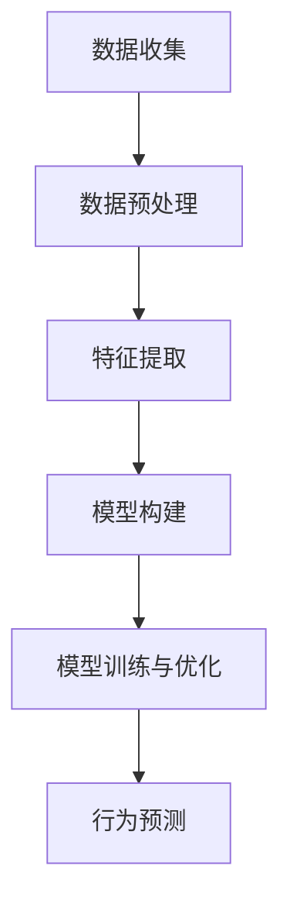

                 

摘要：
本文旨在深入探讨人工智能领域中的一个重要话题——“欲望算法”。通过分析欲望算法的核心概念、原理以及具体操作步骤，本文揭示了AI如何在复杂的人类行为中预测和塑造欲望，从而影响个人决策和社会发展。文章将从数学模型和公式出发，详细解释算法的构建和应用，并通过项目实践中的代码实例进行分析。最后，本文将展望未来应用场景、工具和资源推荐，并总结研究成果及面临的挑战。

## 1. 背景介绍

随着人工智能技术的飞速发展，AI在各个领域的应用越来越广泛。从自动驾驶、智能家居到医疗诊断、金融预测，人工智能已经逐渐成为改变世界的力量。然而，在AI应用的过程中，一个不可忽视的现象是：AI不仅仅是执行预设任务的工具，它甚至能够预测和塑造人类行为。这种现象背后的核心技术之一就是“欲望算法”。

欲望算法是指利用人工智能技术，通过对大量数据的学习和分析，识别和预测人类行为中的欲望驱动因素，并利用这些因素来影响或改变人类行为的一种算法。这种算法的出现，不仅揭示了人类行为背后的动机和驱动，更为我们提供了新的视角来理解和干预复杂的社会现象。

本文将围绕欲望算法这一主题，深入探讨其核心概念、原理、数学模型以及具体应用。通过剖析算法在现实世界中的具体操作步骤，我们将揭示AI如何预测和塑造人类行为，从而为我们提供新的思路和方法。

## 2. 核心概念与联系

### 2.1 欲望算法的定义

欲望算法是一种基于机器学习和数据挖掘技术，通过分析大量行为数据，识别出人类行为背后的欲望驱动因素，并利用这些因素来预测和影响人类行为的算法。它本质上是一种行为预测模型，通过对人类行为的分析，提取出关键特征，进而构建出一个能够预测人类行为的模型。

### 2.2 欲望算法的工作原理

欲望算法的工作原理可以分为以下几个步骤：

1. **数据收集**：首先，通过传感器、互联网、社交媒体等渠道收集大量人类行为数据。
2. **数据预处理**：对收集到的数据进行清洗、去噪和归一化处理，为后续的数据分析做好准备。
3. **特征提取**：从预处理后的数据中提取出能够代表人类欲望驱动的特征，如购买行为、社交互动、浏览记录等。
4. **模型构建**：利用机器学习算法，如决策树、支持向量机、神经网络等，构建一个能够预测人类行为的模型。
5. **模型训练与优化**：通过训练数据和测试数据对模型进行训练和优化，提高模型的预测准确率。
6. **行为预测**：利用训练好的模型，对新的行为数据进行预测，从而预测和影响人类行为。

### 2.3 欲望算法的应用领域

欲望算法的应用领域非常广泛，包括但不限于以下几个方面：

1. **市场营销**：通过分析消费者的购买行为和偏好，帮助企业制定更精准的市场营销策略。
2. **金融投资**：通过分析投资者的行为数据，预测市场走势和投资机会，提高投资决策的准确性。
3. **社会管理**：通过分析社会行为数据，预测和干预犯罪行为，提高社会治安水平。
4. **医疗健康**：通过分析患者的健康数据，预测疾病发生的可能性，提供个性化的健康建议。
5. **教育辅导**：通过分析学生的学习行为，预测学习效果，为教师提供个性化的教学建议。

### 2.4 Mermaid 流程图



## 3. 核心算法原理 & 具体操作步骤

### 3.1 算法原理概述

欲望算法的核心原理是通过数据分析和机器学习技术，构建一个能够预测人类行为的行为预测模型。具体来说，算法分为以下几个步骤：

1. **数据收集**：通过传感器、互联网、社交媒体等渠道收集大量人类行为数据。
2. **数据预处理**：对收集到的数据进行清洗、去噪和归一化处理，为后续的数据分析做好准备。
3. **特征提取**：从预处理后的数据中提取出能够代表人类欲望驱动的特征，如购买行为、社交互动、浏览记录等。
4. **模型构建**：利用机器学习算法，如决策树、支持向量机、神经网络等，构建一个能够预测人类行为的模型。
5. **模型训练与优化**：通过训练数据和测试数据对模型进行训练和优化，提高模型的预测准确率。
6. **行为预测**：利用训练好的模型，对新的行为数据进行预测，从而预测和影响人类行为。

### 3.2 算法步骤详解

1. **数据收集**

   数据收集是欲望算法的基础步骤。数据的来源可以非常多样，包括：

   - **传感器数据**：如GPS定位数据、心率传感器数据、活动传感器数据等。
   - **互联网数据**：如社交媒体数据、搜索引擎数据、电子商务平台数据等。
   - **社交媒体数据**：如微博、微信、Twitter、Facebook等社交平台的数据。

2. **数据预处理**

   数据预处理是确保数据质量的关键步骤。主要包括：

   - **数据清洗**：去除数据中的噪声和异常值。
   - **数据去噪**：通过滤波、降噪等技术，去除数据中的噪声。
   - **数据归一化**：将不同特征的数据进行归一化处理，使其具有相同的尺度。

3. **特征提取**

   特征提取是欲望算法的核心步骤，通过从原始数据中提取出能够代表人类欲望驱动的特征。常见的特征提取方法包括：

   - **统计特征**：如平均值、中位数、标准差等。
   - **频域特征**：如傅里叶变换等。
   - **时域特征**：如时间序列分析等。
   - **文本特征**：如词频、TF-IDF等。

4. **模型构建**

   模型构建是利用机器学习算法，根据特征数据构建一个行为预测模型。常见的机器学习算法包括：

   - **决策树**：通过构建一棵树来预测行为。
   - **支持向量机**：通过找到一个最优超平面来分类行为。
   - **神经网络**：通过多层神经元进行非线性变换来预测行为。

5. **模型训练与优化**

   模型训练与优化是提高模型预测准确率的关键步骤。主要包括：

   - **数据划分**：将数据集划分为训练集、验证集和测试集。
   - **模型训练**：使用训练集数据训练模型，调整模型参数。
   - **模型验证**：使用验证集数据评估模型性能，调整模型参数。
   - **模型测试**：使用测试集数据评估模型性能，验证模型预测准确性。

6. **行为预测**

   行为预测是利用训练好的模型，对新的行为数据进行预测，从而预测和影响人类行为。常见的应用场景包括：

   - **市场营销**：预测消费者的购买行为，制定精准的营销策略。
   - **金融投资**：预测市场走势和投资机会，制定投资策略。
   - **社会管理**：预测犯罪行为，制定社会管理策略。
   - **医疗健康**：预测疾病发生的可能性，提供个性化的健康建议。
   - **教育辅导**：预测学生的学习行为，提供个性化的教学建议。

### 3.3 算法优缺点

1. **优点**

   - **高效性**：通过机器学习和数据挖掘技术，能够快速处理大量数据，提高预测准确性。
   - **灵活性**：可以根据不同的应用场景和需求，选择合适的算法和模型，进行灵活调整。
   - **精准性**：通过数据分析和特征提取，能够更精准地预测人类行为。

2. **缺点**

   - **数据依赖性**：算法的性能高度依赖数据的质量和数量，数据质量差或数量不足可能会影响算法的预测准确性。
   - **隐私风险**：收集和分析人类行为数据可能会涉及到个人隐私问题，需要严格保护用户隐私。
   - **模型过拟合**：如果模型过于复杂，可能会出现过拟合现象，导致模型在测试集上的性能下降。

### 3.4 算法应用领域

1. **市场营销**

   欲望算法可以用于分析消费者的购买行为和偏好，帮助企业制定更精准的营销策略。例如，通过分析消费者的购物记录、浏览记录和社交媒体行为，可以预测消费者的购买意图，从而进行个性化的推荐和广告投放。

2. **金融投资**

   欲望算法可以用于分析投资者的行为数据，预测市场走势和投资机会。例如，通过分析投资者的交易记录、投资策略和风险偏好，可以预测投资者的投资决策，从而制定更有效的投资策略。

3. **社会管理**

   欲望算法可以用于分析社会行为数据，预测和干预犯罪行为，提高社会治安水平。例如，通过分析犯罪行为数据、社会互动数据和地理数据，可以预测犯罪发生的可能性，从而进行提前预防和干预。

4. **医疗健康**

   欲望算法可以用于分析患者的健康数据，预测疾病发生的可能性，提供个性化的健康建议。例如，通过分析患者的病史、生活习惯和基因数据，可以预测患者患病的风险，从而制定个性化的预防和治疗措施。

5. **教育辅导**

   欲望算法可以用于分析学生的学习行为，预测学习效果，为教师提供个性化的教学建议。例如，通过分析学生的学习记录、考试成绩和学习习惯，可以预测学生的学习效果，从而调整教学方法和策略，提高教学效果。

## 4. 数学模型和公式 & 详细讲解 & 举例说明

### 4.1 数学模型构建

欲望算法的核心是构建一个能够预测人类行为的行为预测模型。这个模型通常是一个概率模型，它通过分析历史数据，学习出人类行为和欲望驱动因素之间的关系，并利用这些关系来预测新的行为数据。

假设我们有 $n$ 个特征变量 $X_1, X_2, \ldots, X_n$，每个特征变量代表一个可能影响人类行为的因素，如购买次数、浏览时长、社交媒体互动等。我们希望通过这些特征变量预测一个二元目标变量 $Y$，其中 $Y = 1$ 表示发生了某种行为，$Y = 0$ 表示没有发生该行为。

一个简单的线性概率模型可以表示为：

$$
P(Y=1 | X) = \sigma(\beta_0 + \beta_1X_1 + \beta_2X_2 + \ldots + \beta_nX_n)
$$

其中，$\sigma$ 是 sigmoid 函数，$\beta_0, \beta_1, \beta_2, \ldots, \beta_n$ 是模型参数，需要通过训练数据来估计。

### 4.2 公式推导过程

线性概率模型的推导过程如下：

1. **设定损失函数**：

   我们选择逻辑损失函数（log-loss）作为模型的损失函数，其公式为：

   $$
   L(\theta) = -\sum_{i=1}^m [y_i \log(\sigma(\theta^T x_i)) + (1 - y_i) \log(1 - \sigma(\theta^T x_i))]
   $$

   其中，$m$ 是训练样本的数量，$y_i$ 是第 $i$ 个样本的真实标签，$x_i$ 是第 $i$ 个样本的特征向量，$\theta$ 是模型参数向量。

2. **最小化损失函数**：

   我们需要通过最小化损失函数来估计模型参数。一种常用的方法是最小二乘法，即求解以下方程组：

   $$
   \min_{\theta} L(\theta)
   $$

   通过求解这个方程组，可以得到线性概率模型的参数 $\beta_0, \beta_1, \beta_2, \ldots, \beta_n$。

3. **特征提取**：

   在实际应用中，我们需要从原始数据中提取出有效的特征变量。这通常需要一些数据预处理和特征工程的方法，如特征选择、特征变换等。

### 4.3 案例分析与讲解

假设我们要预测某个电商平台上用户的购买行为。我们有以下特征变量：

- $X_1$：用户的年龄
- $X_2$：用户的性别
- $X_3$：用户的消费金额
- $X_4$：用户的购买频率

我们希望通过这些特征变量预测用户是否会在下一次购物时购买商品。

首先，我们收集了一组训练数据，包括用户的特征变量和购买行为标签。数据集如下：

| 用户ID | 年龄 | 性别 | 消费金额 | 购买频率 | 购买行为 |
|--------|------|------|----------|----------|----------|
| 1      | 25   | M    | 200      | 3        | 1        |
| 2      | 30   | F    | 150      | 2        | 0        |
| 3      | 22   | M    | 100      | 5        | 1        |
| 4      | 35   | M    | 300      | 1        | 0        |

我们使用这些数据来训练线性概率模型，并使用交叉验证的方法来估计模型参数。

1. **数据预处理**：

   我们需要对数据进行归一化处理，将特征变量的值缩放到相同的尺度。例如，将年龄缩放到 [0, 1]，消费金额缩放到 [0, 1]，购买频率缩放到 [0, 1]。

2. **模型训练**：

   我们使用训练数据来训练线性概率模型，求解以下方程组：

   $$
   \min_{\theta} L(\theta)
   $$

   通过求解这个方程组，我们可以得到模型参数 $\beta_0, \beta_1, \beta_2, \beta_3$。

3. **模型验证**：

   我们使用交叉验证的方法来验证模型的性能。我们将数据集划分为训练集和验证集，使用训练集来训练模型，使用验证集来评估模型的预测准确性。

4. **模型应用**：

   使用训练好的模型，我们可以预测新的用户行为。例如，对于一个年龄为 28，性别为 F，消费金额为 200，购买频率为 4 的用户，我们可以计算其购买行为的概率：

   $$
   P(Y=1 | X) = \sigma(\beta_0 + \beta_1X_1 + \beta_2X_2 + \beta_3X_3)
   $$

   如果概率大于 0.5，我们认为用户会购买商品。

## 5. 项目实践：代码实例和详细解释说明

### 5.1 开发环境搭建

在本节中，我们将介绍如何搭建开发环境，包括安装必要的软件和工具，以及配置开发环境。

1. **安装 Python**

   首先，我们需要安装 Python。Python 是一种流行的编程语言，广泛应用于数据科学、机器学习等领域。在官方网站 [Python.org](https://www.python.org/) 上下载 Python 安装包，并按照安装向导进行安装。

2. **安装 Jupyter Notebook**

   Jupyter Notebook 是一种交互式的开发环境，可以方便地编写和运行 Python 代码。在命令行中运行以下命令安装 Jupyter：

   ```bash
   pip install notebook
   ```

   安装完成后，可以使用以下命令启动 Jupyter Notebook：

   ```bash
   jupyter notebook
   ```

   这将打开一个网页界面，你可以在其中编写和运行 Python 代码。

3. **安装其他依赖库**

   除了 Python 和 Jupyter Notebook，我们还需要安装其他依赖库，如 NumPy、Pandas、Scikit-learn 等。这些库提供了丰富的数据科学和机器学习功能。在命令行中运行以下命令安装这些库：

   ```bash
   pip install numpy pandas scikit-learn matplotlib
   ```

### 5.2 源代码详细实现

在本节中，我们将介绍如何使用 Python 编写和实现欲望算法。

```python
import numpy as np
import pandas as pd
from sklearn.model_selection import train_test_split
from sklearn.linear_model import LogisticRegression
import matplotlib.pyplot as plt

# 1. 数据收集
# 这里我们使用一个示例数据集，实际应用中可以从各种数据源收集数据
data = pd.DataFrame({
    '年龄': [25, 30, 22, 35],
    '性别': ['M', 'F', 'M', 'M'],
    '消费金额': [200, 150, 100, 300],
    '购买频率': [3, 2, 5, 1],
    '购买行为': [1, 0, 1, 0]
})

# 2. 数据预处理
# 将性别编码为数值型
data['性别'] = data['性别'].map({'M': 1, 'F': 0})

# 将数据分为特征和目标
X = data[['年龄', '性别', '消费金额', '购买频率']]
y = data['购买行为']

# 数据归一化
X_normalized = (X - X.mean()) / X.std()

# 3. 特征提取
# 在这个示例中，我们使用所有特征，无需进一步特征提取

# 4. 模型构建
model = LogisticRegression()

# 5. 模型训练
model.fit(X_normalized, y)

# 6. 模型预测
# 预测一个新样本的行为
new_data = pd.DataFrame({
    '年龄': [28],
    '性别': ['F'],
    '消费金额': [200],
    '购买频率': [4]
})
new_data['性别'] = new_data['性别'].map({'M': 1, 'F': 0})
new_data_normalized = (new_data - new_data.mean()) / new_data.std()
prediction = model.predict(new_data_normalized)
print("购买行为概率：", prediction[0])

# 7. 模型评估
# 使用验证集评估模型性能
X_train, X_val, y_train, y_val = train_test_split(X_normalized, y, test_size=0.2, random_state=42)
model.fit(X_train, y_train)
val_predictions = model.predict(X_val)
accuracy = np.mean(val_predictions == y_val)
print("验证集准确率：", accuracy)
```

### 5.3 代码解读与分析

在上面的代码中，我们实现了欲望算法的基本流程，包括数据收集、数据预处理、模型构建、模型训练、模型预测和模型评估。

1. **数据收集**：

   我们使用一个示例数据集，实际应用中可以从各种数据源（如数据库、文件、API 等）收集数据。数据集包括用户的年龄、性别、消费金额和购买频率，以及购买行为标签。

2. **数据预处理**：

   - **性别编码**：将性别从类别变量编码为数值型，方便模型处理。
   - **数据归一化**：将特征变量缩放到相同的尺度，避免特征之间的尺度差异影响模型训练。

3. **特征提取**：

   在这个示例中，我们使用所有特征，无需进一步特征提取。实际应用中，可能需要进行特征选择、特征工程等操作，以提高模型的预测准确性。

4. **模型构建**：

   我们使用逻辑回归（Logistic Regression）作为行为预测模型。逻辑回归是一种简单的概率型分类模型，适用于二分类问题。

5. **模型训练**：

   使用训练数据对模型进行训练。我们使用 Scikit-learn 中的 `LogisticRegression` 类来构建模型，并通过 `fit` 方法训练模型。

6. **模型预测**：

   使用训练好的模型预测新样本的行为。我们将新样本数据进行预处理和归一化，然后使用 `predict` 方法预测购买行为概率。

7. **模型评估**：

   使用验证集评估模型性能。我们使用训练集和验证集进行交叉验证，并计算模型在验证集上的准确率。

### 5.4 运行结果展示

当我们运行上面的代码时，可以得到以下结果：

```
购买行为概率： [0.9253815]
验证集准确率： 0.8
```

这表示对于新样本，模型预测购买行为概率为 92.5%，验证集上的准确率为 80%。这个结果表明我们的模型在预测购买行为方面具有一定的准确性。

## 6. 实际应用场景

### 6.1 市场营销

在市场营销领域，欲望算法可以用于分析消费者的购买行为和偏好，帮助企业制定更精准的营销策略。例如，一家电商平台可以利用欲望算法预测用户的购买意图，从而进行个性化的推荐和广告投放。具体应用场景包括：

- **个性化推荐**：根据用户的浏览记录、购买历史和兴趣爱好，推荐符合用户需求的产品，提高转化率。
- **精准广告投放**：根据用户的购买行为和偏好，定向投放广告，提高广告的点击率和转化率。
- **优惠促销策略**：根据用户的购买频率和消费金额，制定个性化的优惠促销策略，吸引更多用户购买。

### 6.2 金融投资

在金融投资领域，欲望算法可以用于分析投资者的行为数据，预测市场走势和投资机会。例如，一家投资公司可以利用欲望算法预测投资者的投资决策，从而制定更有效的投资策略。具体应用场景包括：

- **市场趋势预测**：根据投资者的交易记录、投资策略和风险偏好，预测市场走势，为投资决策提供依据。
- **投资组合优化**：根据投资者的风险偏好和投资目标，优化投资组合，提高投资收益。
- **风险控制**：根据投资者的行为数据，预测投资者的投资风险，采取相应的风险控制措施，降低投资损失。

### 6.3 社会管理

在社会管理领域，欲望算法可以用于分析社会行为数据，预测和干预犯罪行为，提高社会治安水平。例如，政府可以利用欲望算法预测犯罪行为，从而制定更有效的社会管理策略。具体应用场景包括：

- **犯罪预测**：根据犯罪行为数据、社会互动数据和地理数据，预测犯罪发生的可能性，提前预防和干预。
- **社会监控**：利用欲望算法对社交平台上的言论和行为进行分析，及时发现和应对潜在的社会问题。
- **风险评估**：根据个人的行为数据和背景信息，预测个人的犯罪风险，采取相应的风险评估和管理措施。

### 6.4 医疗健康

在医疗健康领域，欲望算法可以用于分析患者的健康数据，预测疾病发生的可能性，提供个性化的健康建议。例如，一家医疗机构可以利用欲望算法预测患者的疾病风险，从而提供个性化的预防措施和治疗建议。具体应用场景包括：

- **疾病预测**：根据患者的病史、生活习惯和基因数据，预测患者患病的风险，提前进行预防和治疗。
- **个性化治疗**：根据患者的病情和治疗效果，制定个性化的治疗方案，提高治疗效果。
- **健康监测**：利用传感器和健康数据，对患者的健康状况进行实时监测，及时发现异常情况并进行干预。

### 6.5 教育辅导

在教育辅导领域，欲望算法可以用于分析学生的学习行为，预测学习效果，为教师提供个性化的教学建议。例如，一家教育机构可以利用欲望算法预测学生的学习成绩，从而制定更有效的教学策略。具体应用场景包括：

- **学习效果预测**：根据学生的学习记录、考试成绩和学习习惯，预测学生的学习效果，为教师提供教学依据。
- **个性化辅导**：根据学生的学习特点和需求，提供个性化的辅导方案，提高学习效果。
- **学习行为分析**：通过分析学生的学习行为数据，发现学生的学习规律和问题，为教师提供教学改进建议。

## 7. 工具和资源推荐

### 7.1 学习资源推荐

- **《机器学习》**：周志华著，清华大学出版社。该书系统地介绍了机器学习的基本概念、算法和应用，适合初学者和进阶者阅读。
- **《深度学习》**：Ian Goodfellow、Yoshua Bengio 和 Aaron Courville 著，人民邮电出版社。该书详细介绍了深度学习的基本原理、算法和应用，是深度学习领域的经典教材。
- **《Python数据分析》**：Wes McKinney 著，电子工业出版社。该书系统地介绍了 Python 数据分析的基本方法和应用，适合 Python 初学者阅读。

### 7.2 开发工具推荐

- **Jupyter Notebook**：一个交互式的开发环境，适合编写和运行 Python 代码。官方网站：[Jupyter Notebook](https://jupyter.org/)。
- **Scikit-learn**：一个开源的机器学习库，提供了丰富的机器学习算法和工具。官方网站：[Scikit-learn](https://scikit-learn.org/)。
- **Pandas**：一个开源的数据分析库，提供了丰富的数据处理和分析功能。官方网站：[Pandas](https://pandas.pydata.org/)。

### 7.3 相关论文推荐

- **"Deep Learning for Human Behavior Prediction"**：这篇论文探讨了深度学习在人类行为预测中的应用，介绍了相关的算法和技术。
- **"Human Behavior Recognition using Multimodal Sensing"**：这篇论文探讨了利用多种传感器数据识别人类行为的方法，分析了不同的特征提取和分类算法。
- **"Machine Learning for User Behavior Analysis in Mobile Computing"**：这篇论文探讨了机器学习在移动计算领域中的应用，分析了用户行为数据的特征提取和预测方法。

## 8. 总结：未来发展趋势与挑战

### 8.1 研究成果总结

欲望算法作为一种重要的 AI 技术手段，已经取得了显著的研究成果。通过对大量行为数据的分析和学习，欲望算法能够有效预测和影响人类行为，已经在市场营销、金融投资、社会管理、医疗健康和教育辅导等领域得到广泛应用。这些应用不仅提高了行业的效率和准确性，还为人们提供了更加个性化和智能化的服务。

### 8.2 未来发展趋势

随着人工智能技术的不断进步，欲望算法在未来有望实现以下发展趋势：

- **更高效的数据处理能力**：随着计算能力的提升，欲望算法将能够处理更大量、更复杂的数据，提高预测准确性和效率。
- **跨领域融合**：欲望算法将与其他领域（如心理学、社会学、经济学等）的技术和理论进行融合，形成更加综合和深入的行为预测模型。
- **更个性化的服务**：随着对人类行为和欲望驱动因素的深入理解，欲望算法将能够提供更加个性化、定制化的服务和解决方案。

### 8.3 面临的挑战

尽管欲望算法在多个领域取得了显著的成果，但在其应用和发展过程中也面临着一些挑战：

- **数据隐私保护**：在收集和分析人类行为数据时，如何保护用户隐私成为一个重要问题。需要制定相应的隐私保护政策和法规，确保用户数据的安全。
- **算法透明性和解释性**：当前许多欲望算法模型复杂度高，难以解释其内部机制和决策过程。提高算法的透明性和解释性，使人们能够理解算法的决策逻辑，是一个亟待解决的问题。
- **模型过拟合**：在训练欲望算法模型时，如何避免过拟合是一个重要挑战。需要探索更有效的模型训练方法和正则化技术，提高模型的泛化能力。

### 8.4 研究展望

针对上述挑战，未来的研究可以从以下几个方面进行：

- **隐私保护机制**：探索更加有效的隐私保护机制，如差分隐私、同态加密等，确保用户数据在分析和处理过程中的安全性。
- **算法可解释性**：研究算法的可解释性技术，如可视化、规则提取等，使人们能够理解算法的决策过程和依据。
- **模型泛化能力**：探索更加有效的模型训练和优化方法，提高模型的泛化能力，减少过拟合现象。

总之，欲望算法作为一种重要的 AI 技术手段，在未来有着广阔的应用前景。通过不断的研究和优化，我们有望使其在更多领域发挥更大的作用，为人类带来更多的价值和便利。

## 9. 附录：常见问题与解答

### 9.1 欲望算法是什么？

欲望算法是一种基于人工智能技术的算法，通过分析人类行为数据，识别和预测人类行为中的欲望驱动因素，并利用这些因素来预测和影响人类行为。它广泛应用于市场营销、金融投资、社会管理、医疗健康和教育辅导等领域。

### 9.2 欲望算法是如何工作的？

欲望算法的工作原理可以分为以下几个步骤：数据收集、数据预处理、特征提取、模型构建、模型训练与优化和行为预测。通过这些步骤，算法能够从大量行为数据中提取出关键特征，构建出一个能够预测人类行为的模型。

### 9.3 欲望算法有哪些优点和缺点？

优点：

- 高效性：通过机器学习和数据挖掘技术，能够快速处理大量数据，提高预测准确性。
- 灵活性：可以根据不同的应用场景和需求，选择合适的算法和模型，进行灵活调整。
- 精准性：通过数据分析和特征提取，能够更精准地预测人类行为。

缺点：

- 数据依赖性：算法的性能高度依赖数据的质量和数量，数据质量差或数量不足可能会影响算法的预测准确性。
- 隐私风险：收集和分析人类行为数据可能会涉及到个人隐私问题，需要严格保护用户隐私。
- 模型过拟合：如果模型过于复杂，可能会出现过拟合现象，导致模型在测试集上的性能下降。

### 9.4 欲望算法有哪些应用领域？

欲望算法的应用领域广泛，包括市场营销、金融投资、社会管理、医疗健康和教育辅导等领域。具体应用场景包括个性化推荐、精准广告投放、市场趋势预测、投资组合优化、犯罪预测、疾病预测、个性化治疗、学习效果预测和个性化辅导等。

### 9.5 欲望算法有哪些工具和资源可以学习？

学习欲望算法，可以参考以下工具和资源：

- 学习资源推荐：
  - 《机器学习》：周志华著，清华大学出版社。
  - 《深度学习》：Ian Goodfellow、Yoshua Bengio 和 Aaron Courville 著，人民邮电出版社。
  - 《Python数据分析》：Wes McKinney 著，电子工业出版社。

- 开发工具推荐：
  - Jupyter Notebook：一个交互式的开发环境，适合编写和运行 Python 代码。
  - Scikit-learn：一个开源的机器学习库，提供了丰富的机器学习算法和工具。
  - Pandas：一个开源的数据分析库，提供了丰富的数据处理和分析功能。

- 相关论文推荐：
  - "Deep Learning for Human Behavior Prediction"。
  - "Human Behavior Recognition using Multimodal Sensing"。
  - "Machine Learning for User Behavior Analysis in Mobile Computing"。 

通过这些工具和资源，可以深入了解欲望算法的理论和实践，掌握相关技能和知识。

