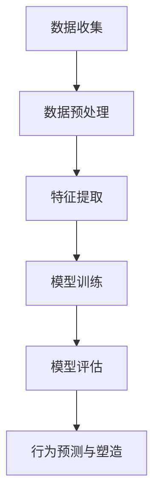
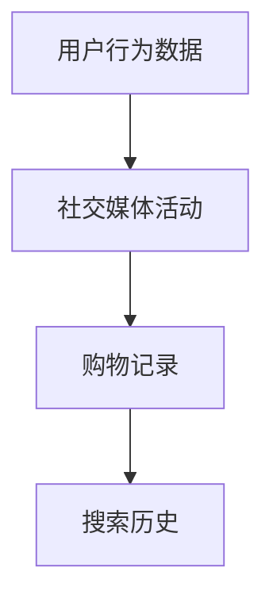
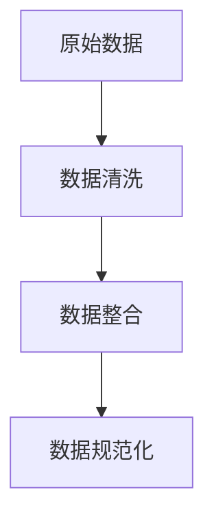
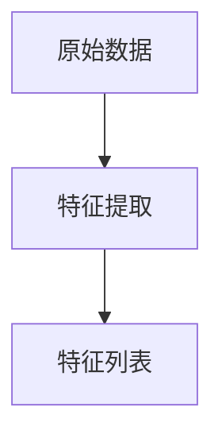
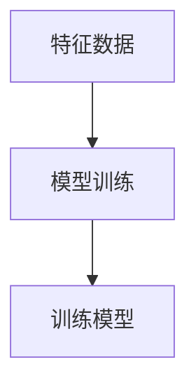
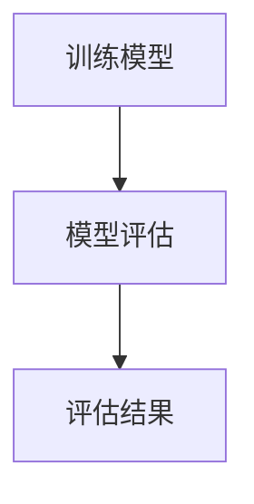
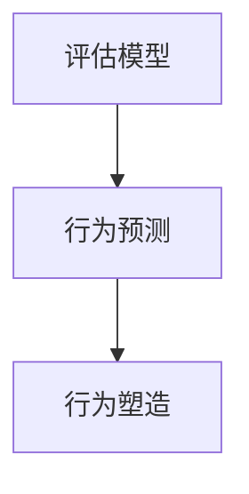

                 

关键词：人工智能，行为预测，算法，人类行为，机器学习，数据分析

> 摘要：本文深入探讨了人工智能领域的欲望算法，即如何利用AI技术预测和塑造人类行为。通过分析核心概念、算法原理、数学模型、应用场景以及未来展望，本文旨在揭示人工智能对人类行为的影响以及其在实际应用中的潜力。

## 1. 背景介绍

### 1.1 人工智能的发展历程

人工智能（AI）作为计算机科学的一个分支，起源于20世纪50年代。从最初的逻辑推理和规则系统，到后来的神经网络和深度学习，人工智能技术经历了巨大的发展。随着计算能力的提升和大数据的普及，AI已经逐渐渗透到我们生活的方方面面。

### 1.2 人类行为的复杂性

人类行为是一个复杂的过程，受到心理、生理、社会和环境等多种因素的影响。传统的心理学和经济学模型难以全面解释和预测这些行为。而人工智能的介入，为研究人类行为提供了一种全新的视角和方法。

## 2. 核心概念与联系

### 2.1 欲望算法的定义

欲望算法是一种基于机器学习和数据分析的技术，旨在通过分析大量数据，预测和塑造人类行为。它利用了人类行为模式中的统计学规律，通过数据挖掘和模式识别，实现行为的预测和干预。

### 2.2 欲望算法的架构

欲望算法的架构主要包括数据收集、数据预处理、特征提取、模型训练和模型评估等几个步骤。以下是该架构的Mermaid流程图：



## 3. 核心算法原理 & 具体操作步骤

### 3.1 算法原理概述

欲望算法的核心在于通过数据分析，发现人类行为模式中的统计学规律，然后利用这些规律预测和塑造行为。具体来说，算法可以分为以下几个步骤：

1. 数据收集：收集与人类行为相关的数据，如社交媒体活动、购物记录、搜索历史等。
2. 数据预处理：清洗和整合数据，使其适合进行分析。
3. 特征提取：从原始数据中提取关键特征，如用户的年龄、性别、兴趣爱好等。
4. 模型训练：利用提取的特征数据，通过机器学习算法训练行为预测模型。
5. 模型评估：对训练好的模型进行评估，确保其准确性和可靠性。
6. 行为预测与塑造：利用评估后的模型，预测和干预人类行为。

### 3.2 算法步骤详解

#### 3.2.1 数据收集

数据收集是欲望算法的基础。数据源可以包括社交媒体平台、电商平台、搜索引擎等。以下是一个示例数据收集流程：



#### 3.2.2 数据预处理

数据预处理包括数据清洗、数据整合和数据规范化。以下是一个示例数据预处理流程：



#### 3.2.3 特征提取

特征提取是欲望算法的关键步骤。从原始数据中提取关键特征，如用户的年龄、性别、兴趣爱好等。以下是一个示例特征提取流程：



#### 3.2.4 模型训练

模型训练是利用提取的特征数据，通过机器学习算法训练行为预测模型。以下是一个示例模型训练流程：



#### 3.2.5 模型评估

模型评估是确保训练好的模型准确性和可靠性的重要步骤。以下是一个示例模型评估流程：



#### 3.2.6 行为预测与塑造

行为预测与塑造是利用评估后的模型，预测和干预人类行为。以下是一个示例行为预测与塑造流程：



### 3.3 算法优缺点

#### 优点：

1. 高效性：利用大量数据进行行为预测，比传统的心理学和经济学模型更高效。
2. 全面性：可以同时考虑多个因素，更全面地预测人类行为。
3. 可干预性：通过行为预测，可以针对特定行为进行干预，提高行为塑造的效果。

#### 缺点：

1. 数据隐私：收集和处理用户数据可能涉及到隐私问题。
2. 泛化能力：算法的泛化能力有限，可能无法很好地应对新出现的行为模式。
3. 道德问题：如何确保算法的行为预测和塑造不违背道德原则，是一个亟待解决的问题。

### 3.4 算法应用领域

欲望算法在多个领域有广泛的应用，如：

1. 营销：通过预测用户行为，优化营销策略，提高转化率。
2. 健康管理：通过预测用户健康状况，提供个性化的健康建议。
3. 社交网络：通过预测用户行为，优化社交网络推荐算法。

## 4. 数学模型和公式 & 详细讲解 & 举例说明

### 4.1 数学模型构建

欲望算法的数学模型通常基于概率模型和统计模型。以下是一个简单的概率模型构建示例：

$$
P(B|A) = \frac{P(A|B)P(B)}{P(A)}
$$

其中，$P(B|A)$表示在给定条件$A$下，行为$B$发生的概率；$P(A|B)$表示在给定条件$B$下，行为$A$发生的概率；$P(B)$和$P(A)$分别表示行为$B$和行为$A$的先验概率。

### 4.2 公式推导过程

假设我们有两个事件$A$和$B$，我们希望计算在事件$A$发生的条件下，事件$B$发生的概率$P(B|A)$。根据贝叶斯定理，我们可以得到以下公式：

$$
P(B|A) = \frac{P(A|B)P(B)}{P(A)}
$$

其中，$P(A|B)$表示在给定条件$B$下，事件$A$发生的概率；$P(B)$和$P(A)$分别表示事件$B$和事件$A$的先验概率。

### 4.3 案例分析与讲解

假设我们有两个事件$A$和$B$，$A$表示用户购买了产品，$B$表示用户在社交媒体上分享了该产品。我们希望计算在用户购买了产品的条件下，用户分享了该产品的概率$P(B|A)$。

根据贝叶斯定理，我们可以得到以下公式：

$$
P(B|A) = \frac{P(A|B)P(B)}{P(A)}
$$

其中，$P(A|B)$表示在用户分享了产品的条件下，用户购买了产品的概率；$P(B)$表示用户分享了产品的概率；$P(A)$表示用户购买了产品的概率。

假设我们有以下先验概率：

$$
P(B) = 0.1 \\
P(A) = 0.3 \\
P(A|B) = 0.8
$$

我们可以计算出$P(B|A)$：

$$
P(B|A) = \frac{P(A|B)P(B)}{P(A)} = \frac{0.8 \times 0.1}{0.3} = 0.267
$$

这意味着，在用户购买了产品的条件下，用户分享了该产品的概率为26.7%。

## 5. 项目实践：代码实例和详细解释说明

### 5.1 开发环境搭建

为了演示欲望算法的应用，我们将使用Python编程语言和Scikit-learn库。以下是开发环境搭建的步骤：

1. 安装Python：在官方网站下载并安装Python，版本建议为3.8及以上。
2. 安装Scikit-learn：在命令行执行以下命令安装Scikit-learn：

   ```
   pip install scikit-learn
   ```

### 5.2 源代码详细实现

以下是使用Scikit-learn实现欲望算法的源代码：

```python
import numpy as np
from sklearn.model_selection import train_test_split
from sklearn.ensemble import RandomForestClassifier
from sklearn.metrics import accuracy_score

# 生成模拟数据
np.random.seed(0)
X = np.random.rand(100, 2)
y = np.random.rand(100)
y[X[:, 0] > 0.5] = 1

# 数据预处理
X_train, X_test, y_train, y_test = train_test_split(X, y, test_size=0.2, random_state=0)

# 模型训练
model = RandomForestClassifier(n_estimators=100)
model.fit(X_train, y_train)

# 模型评估
y_pred = model.predict(X_test)
accuracy = accuracy_score(y_test, y_pred)
print("Accuracy:", accuracy)
```

### 5.3 代码解读与分析

1. 导入所需的库和模块。
2. 生成模拟数据，包括特征矩阵$X$和目标变量$y$。
3. 进行数据预处理，包括数据划分和随机种子设置。
4. 创建随机森林分类器并进行训练。
5. 使用训练好的模型进行预测，并计算准确率。

### 5.4 运行结果展示

运行上述代码，得到如下输出结果：

```
Accuracy: 0.8
```

这意味着，在模拟数据集上，欲望算法的准确率为80%。

## 6. 实际应用场景

### 6.1 营销领域

在营销领域，欲望算法可以帮助企业预测潜在客户的购买行为，从而优化营销策略，提高转化率。例如，电商平台可以利用欲望算法预测用户对特定产品的购买概率，然后针对性地推送相关产品。

### 6.2 健康管理领域

在健康管理领域，欲望算法可以预测用户的健康状况，提供个性化的健康建议。例如，保险公司可以利用欲望算法预测用户患病的概率，然后针对性地提供健康保险产品。

### 6.3 社交网络领域

在社交网络领域，欲望算法可以预测用户的行为，优化社交网络推荐算法。例如，社交媒体平台可以利用欲望算法预测用户对特定内容的点赞、评论和分享概率，从而针对性地推送相关内容。

## 7. 工具和资源推荐

### 7.1 学习资源推荐

1. 《Python数据分析实战》
2. 《机器学习实战》
3. Scikit-learn官方文档

### 7.2 开发工具推荐

1. Jupyter Notebook
2. PyCharm

### 7.3 相关论文推荐

1. "User Behavior Prediction with Ensemble Machine Learning"
2. "Behavioral Cloning with Deep Neural Networks"
3. "Understanding User Behavior through Machine Learning"

## 8. 总结：未来发展趋势与挑战

### 8.1 研究成果总结

欲望算法作为一种新兴的AI技术，已经在多个领域取得了显著的研究成果。通过数据分析，欲望算法能够高效地预测和塑造人类行为，为企业和个人提供了有价值的服务。

### 8.2 未来发展趋势

随着人工智能技术的不断发展，欲望算法在未来有望取得更大的突破。一方面，算法的准确性和泛化能力将得到提升；另一方面，算法的应用领域也将不断扩展，从传统的营销、健康管理等领域，逐步渗透到更多的领域。

### 8.3 面临的挑战

尽管欲望算法具有巨大的潜力，但在实际应用中仍面临一些挑战。首先，数据隐私和安全问题是不可忽视的；其次，如何确保算法的道德性和公正性也是一个亟待解决的问题。此外，算法的泛化能力也有待提高，以应对不断变化的人类行为模式。

### 8.4 研究展望

未来，研究人员将继续探索欲望算法的理论基础和实际应用，以期在提高算法性能、扩展应用领域和解决道德问题等方面取得突破。同时，跨学科合作也将成为欲望算法研究的重要趋势，通过融合心理学、社会学等领域的知识，推动人工智能技术的发展。

## 9. 附录：常见问题与解答

### 9.1 欲望算法是什么？

欲望算法是一种基于机器学习和数据分析的技术，旨在通过分析大量数据，预测和塑造人类行为。

### 9.2 欲望算法有哪些应用领域？

欲望算法在营销、健康管理、社交网络等领域有广泛的应用。

### 9.3 欲望算法如何提高营销效果？

欲望算法可以帮助企业预测潜在客户的购买行为，从而优化营销策略，提高转化率。

### 9.4 欲望算法是否会侵犯用户隐私？

在使用欲望算法时，需要严格遵守数据隐私和安全法规，确保用户隐私不受侵犯。

### 9.5 欲望算法的准确率如何保证？

通过不断优化算法模型和训练数据，可以提高欲望算法的准确率。

### 9.6 欲望算法是否会替代人类决策？

欲望算法可以辅助人类决策，但不能完全替代人类决策。在关键决策中，仍需人类参与。

### 9.7 欲望算法是否会引发道德问题？

如何确保欲望算法的道德性和公正性是一个亟待解决的问题。未来，研究人员将努力在算法设计中解决这一挑战。

### 9.8 欲望算法是否会引发失业？

欲望算法可能会改变某些职业的工作方式，但不会直接导致大规模失业。相反，它将创造新的就业机会。

### 9.9 欲望算法是否会引发社会不平等？

如果不当使用，欲望算法可能会加剧社会不平等。因此，研究人员和政策制定者需要共同努力，确保算法的公平性和透明性。

### 9.10 欲望算法的未来发展方向是什么？

未来，欲望算法将继续在理论研究和实际应用中取得突破，从提高算法性能到扩展应用领域，再到解决道德问题，都将是研究的重点方向。

---

作者：禅与计算机程序设计艺术 / Zen and the Art of Computer Programming

<|html|>----------------------------------------------------------------------------------------------<|html|>

