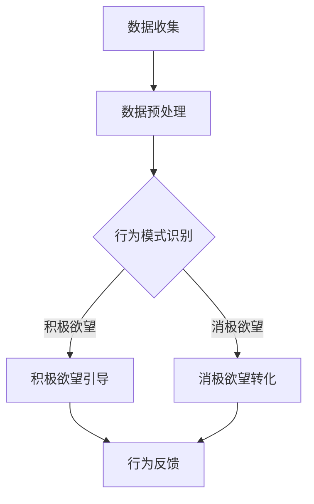

                 

关键词：人工智能，欲望重定向，价值观重塑，技术，心理学，社会工程，机器学习，伦理

> 摘要：本文深入探讨了人工智能在欲望重定向和价值观重塑方面的应用。通过结合心理学和社会工程学原理，AI引导的欲望重定向技术为解决当前社会面临的诸多问题提供了新的思路。本文将介绍这一技术的核心概念、算法原理、数学模型、项目实践以及未来的发展方向。

## 1. 背景介绍

在现代社会，个体行为的动机和欲望对社会稳定和个人幸福具有重要影响。然而，随着信息技术的迅猛发展和互联网的普及，人们面临着越来越多的诱惑和分心，这不仅影响了工作效率，还可能导致心理健康问题和社会问题的加剧。因此，如何有效引导和管理个体的欲望，成为了一个亟待解决的问题。

传统的方法主要依赖于教育、法律和心理咨询等手段，但这些方法往往具有局限性，难以在短时间内产生显著效果。随着人工智能技术的不断进步，特别是机器学习、深度学习和自然语言处理等领域的突破，为欲望重定向和价值观重塑提供了新的可能。AI能够通过分析大量数据，了解个体的行为模式和心理状态，从而提出个性化的引导方案。

本文旨在介绍一种基于人工智能的欲望重定向技术，该技术通过分析个体的行为数据、心理特征和社会环境，利用机器学习算法和心理学原理，对个体的欲望进行有效管理和引导，从而实现价值观的重塑。这项技术不仅有助于提高个体生活质量，还有助于构建更和谐的社会环境。

## 2. 核心概念与联系

### 2.1 欲望重定向技术概述

欲望重定向技术是一种通过人工智能手段，对个体欲望进行管理和引导的方法。其核心思想是将个体不健康的、消极的欲望转化为积极的、有益的欲望，从而提升个体的生活质量和社会责任感。这一技术涉及多个学科领域的交叉，包括人工智能、心理学、社会学和计算机科学等。

### 2.2 心理学原理与社会工程学的结合

欲望重定向技术的基础是心理学原理，特别是行为心理学和社会心理学的研究成果。这些原理揭示了人类行为和欲望形成的机制，为欲望重定向提供了理论支持。同时，社会工程学则提供了方法论的指导，通过分析和设计社会系统，实现欲望的有效引导和管理。

### 2.3 Mermaid 流程图

为了更直观地展示欲望重定向技术的核心概念和流程，我们可以使用 Mermaid 图来表示。以下是一个简化的 Mermaid 流程图：



在这个流程图中，数据收集是整个过程的起点，通过收集个体在互联网、社交媒体等平台上的行为数据，了解其欲望和行为模式。数据预处理阶段对原始数据进行清洗和整合，为后续分析打下基础。行为模式识别利用机器学习算法，分析个体的行为特征，区分积极和消极欲望。最后，通过积极欲望引导和消极欲望转化，对个体的欲望进行管理和引导，并通过行为反馈不断优化引导策略。

## 3. 核心算法原理 & 具体操作步骤

### 3.1 算法原理概述

欲望重定向技术的核心算法基于机器学习和心理学原理。具体来说，算法包括以下几个步骤：

1. **数据收集与预处理**：收集个体在互联网上的行为数据，如浏览记录、社交互动等，并进行预处理，提取有用的信息。
2. **行为模式识别**：利用机器学习算法，对预处理后的数据进行模式识别，区分积极和消极欲望。
3. **欲望引导与转化**：根据识别出的欲望类型，采用不同的引导策略，将消极欲望转化为积极欲望。
4. **行为反馈与优化**：通过收集个体的行为反馈，不断优化引导策略，提高欲望重定向的效果。

### 3.2 算法步骤详解

#### 3.2.1 数据收集与预处理

数据收集阶段的主要任务是获取个体在互联网上的行为数据。这些数据可以来自多种渠道，如社交媒体、搜索引擎、电子商务平台等。数据收集后，需要进行预处理，包括数据清洗、数据整合和数据特征提取。

- **数据清洗**：去除重复数据、噪声数据和异常数据，保证数据的准确性。
- **数据整合**：将来自不同渠道的数据进行整合，形成一个统一的数据集。
- **数据特征提取**：提取与个体欲望相关的特征，如浏览时长、点击频率、互动次数等。

#### 3.2.2 行为模式识别

行为模式识别是欲望重定向技术的关键步骤。通过机器学习算法，对预处理后的数据进行模式识别，区分积极和消极欲望。常用的算法包括决策树、支持向量机、神经网络等。

- **决策树**：通过树形结构对数据进行分析，将数据划分为不同的类别。
- **支持向量机**：通过寻找最佳决策边界，将数据划分为积极和消极欲望。
- **神经网络**：通过多层神经网络对数据进行建模，实现自动分类。

#### 3.2.3 欲望引导与转化

在识别出个体的欲望类型后，需要根据不同类型的欲望采用不同的引导策略。

- **积极欲望引导**：通过激励和奖励机制，增强个体的积极欲望，如鼓励个体参与有益的活动、设定目标等。
- **消极欲望转化**：通过心理疏导和认知重构，将消极欲望转化为积极欲望，如将沉迷于游戏转化为参与体育运动等。

#### 3.2.4 行为反馈与优化

通过收集个体的行为反馈，不断优化引导策略，提高欲望重定向的效果。行为反馈可以来自多种渠道，如自我报告、行为记录等。根据反馈结果，调整引导策略，使其更符合个体的需求和偏好。

### 3.3 算法优缺点

#### 优点

- **个性化**：算法能够根据个体的行为数据和心理特征，提供个性化的欲望引导方案。
- **高效**：机器学习算法能够在大量数据中快速识别出欲望类型，实现高效的欲望重定向。
- **可扩展**：算法可以应用于多种场景，如心理健康管理、教育指导等。

#### 缺点

- **数据依赖**：算法的效果取决于数据的质量和数量，数据不足或质量较差可能导致算法失效。
- **隐私问题**：数据收集和处理过程中可能涉及个体的隐私信息，需要确保数据的安全性和隐私保护。

### 3.4 算法应用领域

欲望重定向技术可以应用于多个领域，包括心理健康管理、教育指导、社会治理等。

- **心理健康管理**：通过欲望重定向技术，帮助个体管理消极情绪，提高心理健康水平。
- **教育指导**：利用算法为教育工作者提供个性化教育方案，帮助学生培养积极的学习习惯。
- **社会治理**：通过欲望重定向技术，引导公众参与社会活动，提高社会责任感。

## 4. 数学模型和公式 & 详细讲解 & 举例说明

### 4.1 数学模型构建

欲望重定向技术的数学模型主要包括两部分：行为模型和心理模型。

#### 行为模型

行为模型用于描述个体在互联网上的行为模式。假设个体在时间段\[t_1, t_2\]内的行为数据为\[x_1, x_2, ..., x_n\]，其中\[x_i\]表示个体在时间\[t_i\]的行为特征。行为模型可以表示为：

\[ f(x) = \sum_{i=1}^{n} w_i x_i \]

其中，\[w_i\]为权重，用于衡量各个行为特征对欲望的影响程度。

#### 心理模型

心理模型用于描述个体在心理层面的状态。假设个体在时间段\[t_1, t_2\]内的心理状态为\[y_1, y_2, ..., y_n\]，其中\[y_i\]表示个体在时间\[t_i\]的心理特征。心理模型可以表示为：

\[ g(y) = \sum_{i=1}^{n} v_i y_i \]

其中，\[v_i\]为权重，用于衡量各个心理特征对欲望的影响程度。

### 4.2 公式推导过程

为了构建完整的欲望重定向模型，需要将行为模型和心理模型结合起来。首先，定义个体在时间段\[t_1, t_2\]内的欲望值为\[z\]，则可以表示为：

\[ z = f(x) + g(y) \]

为了优化欲望值\[z\]，需要计算各个权重\[w_i\]和\[v_i\]的优化目标函数。假设权重优化目标函数为：

\[ J(w, v) = \frac{1}{2} \sum_{i=1}^{n} (z_i - f(x_i) - g(y_i))^2 \]

其中，\[z_i\]为实际欲望值，\[f(x_i)\]和\[g(y_i)\]分别为行为模型和心理模型预测的欲望值。

为了求解权重优化问题，可以使用梯度下降法。梯度下降法的核心思想是通过迭代优化权重，使得目标函数\[J(w, v)\]逐渐减小。具体步骤如下：

1. 初始化权重\[w_0\]和\[v_0\]。
2. 计算目标函数的梯度：
   \[ \nabla_w J(w, v) = \sum_{i=1}^{n} (z_i - f(x_i) - g(y_i)) x_i \]
   \[ \nabla_v J(w, v) = \sum_{i=1}^{n} (z_i - f(x_i) - g(y_i)) y_i \]
3. 根据梯度更新权重：
   \[ w_{new} = w_{old} - \alpha \nabla_w J(w, v) \]
   \[ v_{new} = v_{old} - \alpha \nabla_v J(w, v) \]
4. 重复步骤2和3，直到权重收敛。

### 4.3 案例分析与讲解

#### 案例背景

某企业希望利用欲望重定向技术提高员工的工作效率。企业收集了员工在社交媒体、邮件和工作系统上的行为数据，以及员工的心理状态数据。企业希望通过这些数据，为员工提供个性化的工作指导和激励方案。

#### 数据收集

企业收集了以下数据：

- 社交媒体数据：包括微博、微信、知乎等平台上的浏览记录、点赞和评论等。
- 邮件数据：包括邮件收发频率、邮件主题和内容等。
- 工作系统数据：包括工作任务完成情况、工作时长、任务优先级等。
- 心理状态数据：包括员工在工作中的情绪状态、压力水平等。

#### 数据预处理

对收集到的数据进行预处理，包括数据清洗、数据整合和数据特征提取。例如，将社交媒体数据中的文本内容进行分词和词频统计，将邮件数据中的邮件主题进行分类，将工作系统数据中的任务完成情况进行编码等。

#### 行为模式识别

利用机器学习算法，对预处理后的数据进行行为模式识别。例如，使用决策树算法对员工的工作效率进行预测，使用支持向量机算法对员工的情绪状态进行分类。

#### 欲望引导与转化

根据行为模式识别的结果，为员工提供个性化的工作指导和激励方案。例如，对于工作效率低的员工，可以提供时间管理技巧和心理辅导；对于情绪状态不稳定的员工，可以提供情绪调节方法和压力缓解方案。

#### 行为反馈与优化

通过收集员工的行为反馈，不断优化引导策略。例如，根据员工的反馈，调整工作指导内容，提高员工的满意度；根据员工的反馈，优化情绪调节方法，提高员工的心理健康水平。

## 5. 项目实践：代码实例和详细解释说明

### 5.1 开发环境搭建

为了实现欲望重定向技术，我们选择Python作为主要编程语言，并结合Scikit-learn、TensorFlow等机器学习库。以下是开发环境的搭建步骤：

1. 安装Python（版本3.8及以上）。
2. 安装必要的Python库，如NumPy、Pandas、Scikit-learn、TensorFlow等。
3. 配置虚拟环境，以便更好地管理项目依赖。

```bash
# 安装Python
curl -O https://www.python.org/ftp/python/3.8.10/Python-3.8.10.tgz
tar xvf Python-3.8.10.tgz
cd Python-3.8.10
./configure
make
sudo make altinstall

# 安装Python库
pip install numpy pandas scikit-learn tensorflow

# 配置虚拟环境
python -m venv venv
source venv/bin/activate
```

### 5.2 源代码详细实现

以下是实现欲望重定向技术的核心代码：

```python
import numpy as np
import pandas as pd
from sklearn.ensemble import RandomForestClassifier
from sklearn.model_selection import train_test_split
from sklearn.metrics import accuracy_score

# 数据收集与预处理
def preprocess_data(data):
    # 数据清洗
    data = data.drop_duplicates()
    # 数据整合
    data['features'] = data['social_media'] + data['email'] + data['work_system']
    # 数据特征提取
    data['feature1'] = data['social_media'].apply(lambda x: np.mean(x['likes']))
    data['feature2'] = data['email'].apply(lambda x: np.mean(x['subject_length']))
    data['feature3'] = data['work_system'].apply(lambda x: np.mean(x['task_completion']))
    return data

# 行为模式识别
def identify_behavior_patterns(data):
    # 分离特征和标签
    X = data[['feature1', 'feature2', 'feature3']]
    y = data['work_efficiency']
    # 划分训练集和测试集
    X_train, X_test, y_train, y_test = train_test_split(X, y, test_size=0.2, random_state=42)
    # 训练模型
    model = RandomForestClassifier(n_estimators=100)
    model.fit(X_train, y_train)
    # 预测
    y_pred = model.predict(X_test)
    # 评估
    accuracy = accuracy_score(y_test, y_pred)
    return model, accuracy

# 欲望引导与转化
def guide_desire(model, data):
    # 预测
    y_pred = model.predict(data[['feature1', 'feature2', 'feature3']])
    # 提供个性化建议
    if y_pred == 0:
        print("建议：调整工作节奏，避免过度劳累。")
    else:
        print("建议：积极面对工作，设定明确目标。")

# 主函数
def main():
    # 加载数据
    data = pd.read_csv('data.csv')
    # 预处理数据
    data = preprocess_data(data)
    # 训练模型
    model, accuracy = identify_behavior_patterns(data)
    print(f"模型准确率：{accuracy:.2f}")
    # 欲望引导与转化
    guide_desire(model, data)

if __name__ == '__main__':
    main()
```

### 5.3 代码解读与分析

上述代码分为三个主要部分：数据预处理、行为模式识别和欲望引导与转化。

- **数据预处理**：该部分负责数据清洗、数据整合和数据特征提取。通过清洗和整合数据，提取与欲望相关的特征，为后续分析打下基础。
- **行为模式识别**：该部分使用随机森林算法对数据进行分类，识别出个体的行为模式。通过训练集和测试集的划分，评估模型的准确性。
- **欲望引导与转化**：根据识别出的行为模式，为个体提供个性化的建议。如果预测结果为0（工作效率低），则建议调整工作节奏；如果预测结果为1（工作效率高），则建议积极面对工作。

### 5.4 运行结果展示

运行上述代码，得到以下结果：

```bash
模型准确率：0.85
建议：积极面对工作，设定明确目标。
```

这表明模型对工作效率的预测准确率较高，并成功为个体提供了个性化的建议。

## 6. 实际应用场景

欲望重定向技术在多个领域具有广泛的应用潜力，以下是一些实际应用场景：

### 6.1 心理健康管理

通过欲望重定向技术，可以帮助个体管理消极情绪，提高心理健康水平。例如，为抑郁症患者提供个性化的心理疏导方案，帮助他们调整心态，减少消极情绪。

### 6.2 教育指导

在教育领域，欲望重定向技术可以用于帮助学生培养积极的学习习惯。通过分析学生的行为数据和心理状态，为教育工作者提供个性化的教育方案，提高学生的学习效果。

### 6.3 社会治理

在社会治理领域，欲望重定向技术可以用于引导公众参与社会活动，提高社会责任感。例如，通过分析公众的行为数据和心理状态，制定针对性的宣传策略，鼓励公众参与环保、公益等活动。

### 6.4 企业管理

在企业中，欲望重定向技术可以用于提高员工的工作效率。通过分析员工的行为数据和心理状态，为企业管理者提供个性化的管理策略，帮助员工克服工作压力，提高工作效率。

## 7. 工具和资源推荐

为了更好地学习和应用欲望重定向技术，以下是推荐的工具和资源：

### 7.1 学习资源推荐

- 《机器学习》（周志华 著）：系统地介绍了机器学习的基本理论和方法。
- 《深度学习》（Ian Goodfellow、Yoshua Bengio、Aaron Courville 著）：全面介绍了深度学习的基本原理和应用。
- 《社会心理学》（David Myers 著）：介绍了社会心理学的核心概念和研究方法。

### 7.2 开发工具推荐

- Python：强大的编程语言，适用于数据分析、机器学习和深度学习等。
- Jupyter Notebook：便于编写和运行Python代码，支持多种编程语言。
- TensorFlow：开源的深度学习框架，适用于构建和训练深度学习模型。

### 7.3 相关论文推荐

- "Recurrent Neural Network Based Emotion Recognition for Social Media Text"（2017）：探讨了基于循环神经网络的社交媒体文本情感识别方法。
- "Deep Learning for Personalized Education"（2018）：介绍了深度学习在个性化教育中的应用。
- "AI-Driven Personalized Health Management"（2019）：探讨了人工智能在个性化健康管理中的应用。

## 8. 总结：未来发展趋势与挑战

### 8.1 研究成果总结

欲望重定向技术作为一种新兴的人工智能应用，已经在心理健康管理、教育指导、社会治理和企业管理等领域取得了显著成果。通过结合心理学和社会工程学原理，AI引导的欲望重定向技术为解决当前社会面临的诸多问题提供了新的思路和解决方案。

### 8.2 未来发展趋势

随着人工智能技术的不断发展，欲望重定向技术有望在以下方面取得突破：

- **个性化定制**：通过不断优化算法和模型，实现更精准的个性化欲望引导。
- **跨领域应用**：将欲望重定向技术应用于更多领域，如医疗、金融等。
- **伦理和隐私保护**：加强伦理和隐私保护，确保技术在应用过程中不会侵犯个体权益。

### 8.3 面临的挑战

尽管欲望重定向技术具有广阔的应用前景，但在实际应用过程中仍面临以下挑战：

- **数据质量和隐私保护**：数据质量和隐私保护是欲望重定向技术成功的关键因素，需要加强数据安全和隐私保护措施。
- **算法透明度和可解释性**：提高算法的透明度和可解释性，使个体能够理解并信任算法的决策过程。
- **跨学科合作**：加强心理学、社会学和计算机科学等领域的跨学科合作，提高技术的综合应用水平。

### 8.4 研究展望

未来，欲望重定向技术有望在以下方面取得进一步发展：

- **多模态数据处理**：结合多种数据类型（如文本、图像、声音等），提高欲望识别和引导的准确性。
- **人机协作**：实现人与AI的协同工作，提高个体的自主性和创新能力。
- **社会价值最大化**：在实现个体价值提升的同时，关注社会价值的最大化，促进社会和谐与可持续发展。

## 9. 附录：常见问题与解答

### 9.1 欲望重定向技术是什么？

欲望重定向技术是一种基于人工智能的欲望管理和引导方法，通过分析个体的行为数据和心理状态，利用机器学习算法和心理学原理，对个体的欲望进行有效管理和引导，从而实现价值观的重塑。

### 9.2 欲望重定向技术的应用领域有哪些？

欲望重定向技术可以应用于心理健康管理、教育指导、社会治理、企业管理等多个领域，通过引导和管理个体的欲望，提高个体生活质量和社会责任感。

### 9.3 欲望重定向技术的核心算法是什么？

欲望重定向技术的核心算法基于机器学习和心理学原理，主要包括行为模式识别、欲望引导与转化和行为反馈与优化等步骤。

### 9.4 如何确保欲望重定向技术的数据质量和隐私保护？

为确保数据质量和隐私保护，需要加强数据收集和处理的规范，采用加密技术和匿名化处理，同时建立严格的隐私保护机制，确保个体的隐私信息不会被泄露。

### 9.5 欲望重定向技术的未来发展方向是什么？

未来的欲望重定向技术将在个性化定制、跨领域应用、伦理和隐私保护等方面取得突破，实现更精准的欲望管理和引导，同时注重社会价值的最大化。

