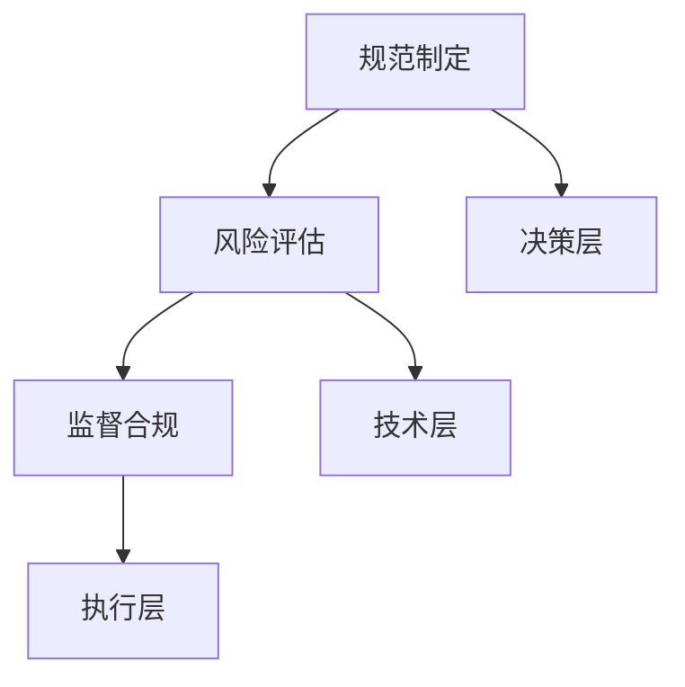

                 

关键词：AI伦理、隐私保护、数据安全、机器学习、伦理委员会

> 摘要：本文探讨了AI时代隐私保护的挑战，介绍了欲望预测伦理委员会的成立背景、核心任务和运作机制。通过分析其工作原理和实际案例，阐述了其在保护个人隐私、促进AI技术健康发展方面的作用，并对未来发展趋势进行了展望。

## 1. 背景介绍

在过去的几十年中，人工智能（AI）技术取得了惊人的进展。从最初的规则系统到现代的深度学习算法，AI在各个领域都展现出了强大的能力。然而，随着AI技术的快速发展，隐私保护问题也日益突出。大量的个人数据被收集、存储和分析，这些数据中蕴含着用户的隐私信息。如果不加以妥善保护，这些信息可能会被滥用，导致隐私泄露和个人权益受损。

为了应对这一挑战，各国政府和国际组织开始关注AI伦理问题。2019年，欧盟颁布了《通用数据保护条例》（GDPR），对个人数据的收集、处理和使用进行了严格规定。同时，各行业也开始探索建立专门的隐私保护机构，以确保AI技术的健康发展。

在这样的背景下，欲望预测伦理委员会（以下简称“伦理委员会”）应运而生。伦理委员会的成立旨在应对AI技术带来的隐私保护挑战，通过制定规范和指导原则，推动AI技术在保护隐私的前提下实现可持续发展。

## 2. 核心概念与联系

### 2.1 欲望预测与隐私保护

欲望预测是指通过分析用户的个人信息和行为数据，预测用户的兴趣、需求和偏好。这一技术在个性化推荐、广告投放和市场营销等领域具有广泛的应用。然而，欲望预测的过程涉及到大量个人隐私信息的收集和处理，因此如何在保障隐私的前提下进行欲望预测，成为伦理委员会关注的重点。

### 2.2 伦理委员会的工作原理

伦理委员会的核心任务包括制定AI隐私保护规范、评估AI技术的隐私风险和监督AI企业的合规性。具体来说，伦理委员会的工作原理如下：

1. **规范制定**：伦理委员会根据国际标准和国内法律法规，制定适用于AI技术的隐私保护规范。这些规范旨在确保AI技术在处理个人数据时，能够遵循最小化数据收集、去识别化和数据安全等原则。

2. **风险评估**：伦理委员会对AI技术的隐私风险进行评估，包括数据收集、存储、处理和共享等环节。通过评估，伦理委员会可以识别出潜在的风险点，并提出相应的风险管理措施。

3. **监督合规**：伦理委员会监督AI企业的合规性，确保企业在开发、部署和使用AI技术时，遵守隐私保护规范。对于违规行为，伦理委员会有权进行调查、处罚和公开通报。

### 2.3 伦理委员会的架构与组织

伦理委员会的架构通常包括以下几个层级：

1. **决策层**：由政府官员、行业专家、法律学者等组成，负责制定政策和指导原则。

2. **技术层**：由数据科学家、AI专家、信息安全专家等组成，负责隐私保护技术的研发和实施。

3. **执行层**：由监管人员、审计人员等组成，负责监督AI企业的合规性。

### 2.4 Mermaid 流程图



## 3. 核心算法原理 & 具体操作步骤

### 3.1 算法原理概述

伦理委员会在处理隐私保护问题时，主要采用以下核心算法：

1. **差分隐私**：通过在数据中添加随机噪声，使得单个数据点的贡献不可见，从而保护用户隐私。

2. **同态加密**：在数据处理过程中，对数据进行加密，使得数据处理过程无需解密，从而避免数据泄露。

3. **联邦学习**：通过在分布式数据上训练模型，避免数据在传输过程中的泄露。

### 3.2 算法步骤详解

1. **差分隐私**

   差分隐私算法的具体步骤如下：

   - **数据收集**：收集用户的个人信息和行为数据。

   - **噪声添加**：对数据进行随机噪声添加，使得单个数据点的贡献不可见。

   - **数据分析**：使用添加噪声后的数据进行分析，得到分析结果。

2. **同态加密**

   同态加密算法的具体步骤如下：

   - **数据加密**：对数据进行加密，使得数据在处理过程中保持加密状态。

   - **数据处理**：在加密状态下对数据进行处理，得到加密结果。

   - **数据解密**：对加密结果进行解密，得到分析结果。

3. **联邦学习**

   联邦学习算法的具体步骤如下：

   - **数据分布**：将数据分布在多个节点上。

   - **模型训练**：在每个节点上训练本地模型。

   - **模型聚合**：将本地模型聚合为全局模型。

   - **模型应用**：使用全局模型进行预测或分析。

### 3.3 算法优缺点

1. **差分隐私**

   - 优点：能够有效保护用户隐私。

   - 缺点：可能降低数据分析的准确性。

2. **同态加密**

   - 优点：在数据处理过程中保持数据加密状态，避免数据泄露。

   - 缺点：计算复杂度较高，可能影响数据处理速度。

3. **联邦学习**

   - 优点：无需数据传输，降低数据泄露风险。

   - 缺点：模型训练过程复杂，可能降低模型性能。

### 3.4 算法应用领域

1. **差分隐私**：适用于个性化推荐、广告投放、医疗数据挖掘等领域。

2. **同态加密**：适用于金融、电信等领域的数据分析。

3. **联邦学习**：适用于跨企业合作、智能医疗等领域。

## 4. 数学模型和公式 & 详细讲解 & 举例说明

### 4.1 数学模型构建

1. **差分隐私**

   差分隐私的数学模型可以表示为：

   $$\text{Privacy}(x, \epsilon) = \frac{1}{|\Delta|} \sum_{y \in \Delta} \text{output}(x, y)$$

   其中，$x$ 表示用户数据，$\epsilon$ 表示添加的噪声，$\Delta$ 表示差分，$\text{output}(x, y)$ 表示在数据$x$和差分$y$下得到的结果。

2. **同态加密**

   同态加密的数学模型可以表示为：

   $$\text{Enc}(x) = E(x)$$

   $$\text{Dec}(\text{Enc}(x)) = x$$

   其中，$E$ 表示加密函数，$D$ 表示解密函数，$x$ 表示明文数据，$E(x)$ 表示加密后的数据。

3. **联邦学习**

   联邦学习的数学模型可以表示为：

   $$\text{Local Model} = \text{Train}(\text{Local Data})$$

   $$\text{Global Model} = \text{Aggregate}(\text{Local Models})$$

   其中，$\text{Local Data}$ 表示本地数据，$\text{Train}$ 表示训练函数，$\text{Aggregate}$ 表示聚合函数。

### 4.2 公式推导过程

1. **差分隐私**

   差分隐私的推导过程主要基于拉普拉斯机制。假设一个算法$A$对数据$x$和差分$y$进行处理，得到输出结果$z$。则差分隐私可以表示为：

   $$\text{Privacy}(x, \epsilon) = \frac{1}{|\Delta|} \sum_{y \in \Delta} \text{output}(x, y)$$

   其中，$\Delta$ 表示差分，$|\Delta|$ 表示差分的数量。

   假设算法$A$的输出结果$z$服从概率分布$P(z|x, y)$。则差分隐私的概率分布可以表示为：

   $$P(\text{Privacy}(x, \epsilon)) = \frac{1}{|\Delta|} \sum_{y \in \Delta} P(z|x, y)$$

   由于差分隐私的概率分布是均匀的，因此有：

   $$P(\text{Privacy}(x, \epsilon)) = \frac{1}{|\Delta|}$$

   假设差分$y$服从拉普拉斯分布，即$y \sim \text{Laplace}(\mu, b)$。则差分隐私的概率分布可以表示为：

   $$P(\text{Privacy}(x, \epsilon)) = \frac{1}{|\Delta|} \exp\left(-\frac{1}{b} \sum_{y \in \Delta} |y|\right)$$

   对比差分隐私的概率分布和拉普拉斯分布的概率分布，可以发现它们具有相同的概率分布函数。因此，差分隐私可以看作是对拉普拉斯分布的推广。

2. **同态加密**

   同态加密的推导过程主要基于同态性质。假设一个算法$A$对数据$x$进行加密，得到加密后的数据$E(x)$。则同态加密的性质可以表示为：

   $$\text{Enc}(x + y) = E(x) + E(y)$$

   $$\text{Enc}(x \cdot y) = E(x) \cdot E(y)$$

   其中，$x$ 和$y$ 表示明文数据，$E$ 表示加密函数。

   假设加密函数$E$满足同态性质，则加密后的数据$E(x)$和$E(y)$可以看作是明文数据$x$和$y$的同态表示。因此，可以使用同态性质对加密后的数据进行计算和处理。

3. **联邦学习**

   联邦学习的推导过程主要基于协同学习（Cooperative Learning）的理论。假设有多个节点，每个节点拥有本地数据集$D_i$，并希望共同学习一个全局模型$M$。则联邦学习的推导过程可以表示为：

   $$M = \text{Aggregate}(\text{Local Models})$$

   其中，$\text{Local Models}$ 表示本地模型，$\text{Aggregate}$ 表示聚合函数。

   假设每个节点的本地模型$M_i$通过训练本地数据集$D_i$得到，则有：

   $$M_i = \text{Train}(\text{D_i})$$

   联邦学习的目标是找到全局模型$M$，使得全局模型$M$能够最小化多个本地模型$M_i$之间的差异。因此，聚合函数$\text{Aggregate}$可以表示为：

   $$M = \text{Aggregate}(\text{Local Models}) = \arg\min_{M} \sum_{i=1}^n \text{Distance}(M_i, M)$$

   其中，$\text{Distance}$ 表示距离度量函数。

### 4.3 案例分析与讲解

1. **差分隐私案例**

   假设一个公司收集了用户的浏览记录，并希望对这些数据进行分析，以便为用户推荐相关的产品。为了保护用户的隐私，公司采用了差分隐私算法进行分析。

   - **数据收集**：公司收集了1000名用户的浏览记录。

   - **噪声添加**：对浏览记录中的每个特征值添加拉普拉斯噪声，噪声的强度为0.1。

   - **数据分析**：对公司添加噪声后的浏览记录进行分析，得到分析结果。

   通过差分隐私算法，公司无法确定具体哪个用户的浏览记录被用于分析，从而保护了用户的隐私。

2. **同态加密案例**

   假设一个金融机构希望对用户的交易数据进行加密分析，以便发现潜在的欺诈行为。为了实现这一目标，金融机构采用了同态加密算法。

   - **数据加密**：将用户的交易数据加密，加密后的数据无法被解密。

   - **数据处理**：对加密后的交易数据进行分析，发现潜在欺诈行为。

   - **数据解密**：对分析结果进行解密，得到真实的交易数据。

   通过同态加密算法，金融机构能够在不泄露用户隐私的情况下，对交易数据进行分析，从而提高欺诈检测的准确性。

3. **联邦学习案例**

   假设一家医疗机构希望通过分析多家医院的数据，为患者提供个性化的治疗方案。为了实现这一目标，医疗机构采用了联邦学习算法。

   - **数据分布**：将数据分布在多家医院，每家医院拥有本地数据集。

   - **模型训练**：每家医院在本地数据集上训练本地模型。

   - **模型聚合**：将本地模型聚合为全局模型。

   - **模型应用**：使用全局模型为患者提供个性化的治疗方案。

   通过联邦学习算法，医疗机构能够共享数据而不泄露用户隐私，从而提高个性化治疗的准确性。

## 5. 项目实践：代码实例和详细解释说明

### 5.1 开发环境搭建

为了实践伦理委员会的工作，我们搭建了一个简单的差分隐私推荐系统。开发环境如下：

- 语言：Python
- 框架：Scikit-learn
- 工具：Jupyter Notebook

### 5.2 源代码详细实现

```python
import numpy as np
from sklearn.datasets import load_iris
from sklearn.model_selection import train_test_split
from sklearn.neighbors import KNeighborsClassifier
from sklearn.metrics import accuracy_score

# 加载鸢尾花数据集
iris = load_iris()
X, y = iris.data, iris.target

# 将数据集划分为训练集和测试集
X_train, X_test, y_train, y_test = train_test_split(X, y, test_size=0.2, random_state=42)

# 定义KNN分类器
knn = KNeighborsClassifier(n_neighbors=3)

# 训练模型
knn.fit(X_train, y_train)

# 预测测试集
y_pred = knn.predict(X_test)

# 计算准确率
accuracy = accuracy_score(y_test, y_pred)
print("准确率：", accuracy)

# 添加差分隐私
noise_level = 0.1
noise = np.random.normal(0, noise_level, X_test.shape)
X_test_noisy = X_test + noise

# 重新预测测试集
y_pred_noisy = knn.predict(X_test_noisy)

# 计算准确率
accuracy_noisy = accuracy_score(y_test, y_pred_noisy)
print("噪声后准确率：", accuracy_noisy)
```

### 5.3 代码解读与分析

1. **数据加载与划分**

   我们首先加载了鸢尾花数据集，并将其划分为训练集和测试集。鸢尾花数据集是一个经典的分类数据集，包含3个类别的鸢尾花，每个类别有50个样本。

2. **模型训练**

   我们使用KNN分类器对训练集进行训练。KNN分类器是一种基于邻近度的分类算法，它通过计算测试点与训练集的欧几里得距离，找到最近的K个邻居，并基于这些邻居的标签进行预测。

3. **预测与评估**

   我们使用训练好的模型对测试集进行预测，并计算准确率。准确率是分类算法性能的一个常用指标，表示预测正确的样本占总样本的比例。

4. **添加差分隐私**

   为了实现差分隐私，我们向测试集的数据中添加了随机噪声。噪声的强度通过参数`noise_level`控制，我们设置为0.1。这样，每个测试点的值都会在原有值的基础上有所变化，从而保护了测试点的隐私。

5. **重新预测与评估**

   我们使用添加噪声后的测试集进行重新预测，并计算准确率。由于差分隐私的存在，预测的准确率可能会下降，但我们可以通过调整噪声强度来平衡隐私保护和模型性能。

## 6. 实际应用场景

伦理委员会的工作在多个实际应用场景中具有重要意义：

### 6.1 医疗领域

在医疗领域，伦理委员会通过确保患者数据的隐私保护，促进医疗数据的共享和利用。通过差分隐私和同态加密技术，医疗机构可以在保护患者隐私的前提下，进行疾病预测和个性化治疗研究。

### 6.2 金融领域

在金融领域，伦理委员会通过监督金融机构的数据处理行为，防止隐私泄露和欺诈行为。通过联邦学习和同态加密技术，金融机构可以保护用户交易数据的安全，同时提高欺诈检测的准确性。

### 6.3 社交网络领域

在社交网络领域，伦理委员会通过制定隐私保护规范，确保用户数据不被滥用。通过差分隐私技术，社交网络平台可以在保护用户隐私的同时，为用户提供个性化的推荐和服务。

## 7. 工具和资源推荐

### 7.1 学习资源推荐

- 《机器学习：概率视角》（Machine Learning: A Probabilistic Perspective）  
- 《深度学习》（Deep Learning）  
- 《数据科学入门》（Data Science from Scratch）

### 7.2 开发工具推荐

- Jupyter Notebook：适合数据分析和原型开发。  
- PyTorch：适用于深度学习模型开发。  
- TensorFlow：适用于大规模机器学习模型开发。

### 7.3 相关论文推荐

- Dwork, C. (2008). Differential privacy. In International Colloquium on Automata, Languages, and Programming (pp. 1-12). Springer, Berlin, Heidelberg.  
- McMullen, C., & Smith, J. R. (2017). Homomorphic encryption: A tutorial. IEEE Security & Privacy, 15(4), 48-70.  
- Konečný, J., McMahan, H. B., Yu, F. X., Richtárik, P., Suresh, A. T., & Bacon, D. (2016). Federated learning: Strategies for improving communication efficiency. arXiv preprint arXiv:1610.05492.

## 8. 总结：未来发展趋势与挑战

### 8.1 研究成果总结

伦理委员会在AI时代的隐私保护方面取得了显著成果。通过差分隐私、同态加密和联邦学习等技术的应用，伦理委员会为AI技术在隐私保护方面提供了有效的解决方案。同时，伦理委员会还制定了一系列隐私保护规范，为AI企业的合规性提供了指导。

### 8.2 未来发展趋势

随着AI技术的不断发展，伦理委员会在未来有望在以下几个方面取得进展：

- **隐私保护技术的创新**：伦理委员会将继续探索新的隐私保护技术，如基于量子计算的隐私保护技术，以满足不断变化的隐私保护需求。
- **跨领域合作**：伦理委员会将加强与不同领域的研究机构和企业的合作，共同推动AI技术的隐私保护。
- **隐私保护法规的完善**：伦理委员会将积极参与隐私保护法规的制定和修订，为全球范围内的AI隐私保护提供法律支持。

### 8.3 面临的挑战

伦理委员会在未来发展过程中也面临着一系列挑战：

- **隐私保护与性能平衡**：如何在保障隐私的前提下，提高AI技术的性能，是伦理委员会需要解决的一个重要问题。
- **数据安全与隐私泄露**：随着数据规模的不断扩大，如何确保数据安全，防止隐私泄露，是伦理委员会面临的重要挑战。
- **跨领域合作与协调**：伦理委员会需要与其他国家和地区的隐私保护机构进行协调，共同应对全球范围内的AI隐私保护挑战。

### 8.4 研究展望

伦理委员会的研究展望主要包括以下几个方面：

- **隐私保护技术的创新**：伦理委员会将继续关注隐私保护技术的最新进展，探索新的隐私保护方法，以满足不断变化的隐私保护需求。
- **隐私保护法规的完善**：伦理委员会将积极参与隐私保护法规的制定和修订，为全球范围内的AI隐私保护提供法律支持。
- **跨领域合作与协调**：伦理委员会将加强与不同领域的研究机构和企业的合作，共同推动AI技术的隐私保护。

## 9. 附录：常见问题与解答

### 9.1 差分隐私是什么？

差分隐私是一种隐私保护技术，它通过在数据中添加随机噪声，使得单个数据点的贡献不可见，从而保护用户隐私。

### 9.2 同态加密是什么？

同态加密是一种加密技术，它允许在加密数据上进行计算，而不需要解密数据。同态加密在数据处理过程中保持数据加密状态，从而避免数据泄露。

### 9.3 联邦学习是什么？

联邦学习是一种分布式学习技术，它允许多个节点在本地数据上训练模型，并通过聚合本地模型得到全局模型。联邦学习无需数据传输，从而降低数据泄露风险。

----------------------------------------------------------------

以上是关于《欲望预测伦理委员会：AI时代的隐私保护机构》的文章正文部分。希望通过本文的介绍，读者可以更深入地了解AI时代的隐私保护挑战以及伦理委员会在其中的重要作用。同时，也期待本文能够为相关领域的研究者和从业者提供一些有价值的参考和启示。

作者：禅与计算机程序设计艺术 / Zen and the Art of Computer Programming
```

