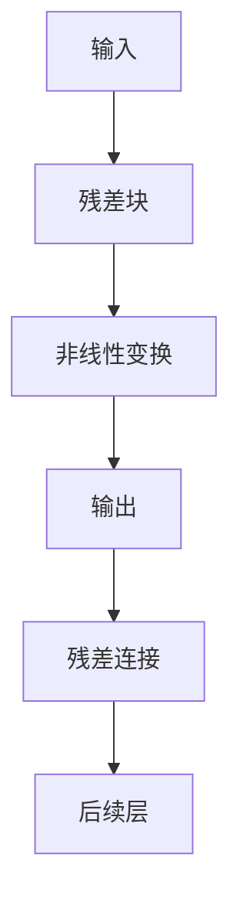
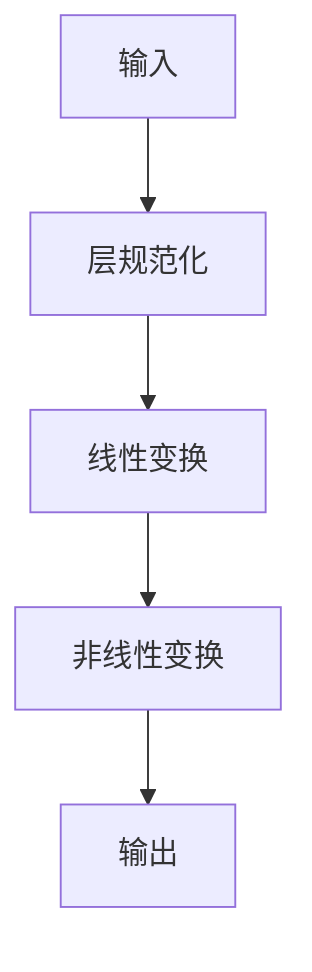
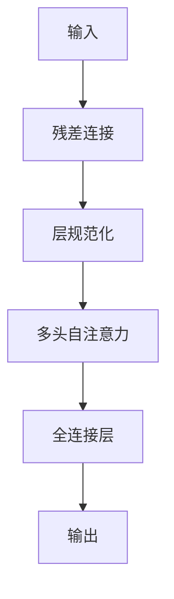

                 

关键词：残差连接、层规范化、Transformer、神经网络、深度学习、人工智能

摘要：本文将深入探讨残差连接和层规范化的概念、原理以及它们在 Transformer 模型中的关键作用。通过分析这两个技术如何提升神经网络的性能，我们旨在为读者提供对 Transformer 模型的更全面的理解，并探讨其在实际应用中的潜力。

## 1. 背景介绍

近年来，深度学习在自然语言处理（NLP）领域取得了显著的突破，其中 Transformer 模型成为了一种极为重要的架构。Transformer 模型起源于 2017 年的论文《Attention Is All You Need》，其通过引入自注意力机制（Self-Attention）和多头注意力（Multi-Head Attention），成功地实现了在机器翻译、文本生成等任务中的高性能。

然而，Transformer 模型并非一蹴而就，其背后有许多关键技术支撑。其中，残差连接（Residual Connection）和层规范化（Layer Normalization）是两个尤为关键的技术。本文将详细介绍这两个技术，分析它们如何影响 Transformer 模型的性能。

## 2. 核心概念与联系

### 2.1 残差连接

残差连接是深度学习中的一个重要概念，其核心思想是在网络的某些层次中添加跨越式的连接，直接将输入信息传递到后续的层。这有助于解决深度神经网络中梯度消失和梯度爆炸的问题，从而提升网络的训练效率和性能。

Mermaid 流程图如下：



### 2.2 层规范化

层规范化（Layer Normalization）是一种在深度神经网络中流行的正则化技术，其核心思想是将每个层的输入数据标准化到一个单位方差和均值为零的分布。这有助于减少内部协变量偏移（Internal Covariate Shift），提高模型的稳定性和泛化能力。

Mermaid 流程图如下：



### 2.3 残差连接与层规范化的联系

在 Transformer 模型中，残差连接和层规范化被广泛使用。残差连接使得信息可以在网络中自由流动，而层规范化则保证了每个层都能在一个稳定的环境中训练。两者结合，大大提高了模型的性能和稳定性。

Mermaid 流程图如下：



## 3. 核心算法原理 & 具体操作步骤

### 3.1 算法原理概述

残差连接和层规范化在 Transformer 模型中的应用，都是为了提高模型的训练效率和性能。残差连接通过跨越式的连接方式，使得信息可以在网络中自由流动，从而缓解了深度神经网络中的梯度消失和梯度爆炸问题。层规范化则通过标准化每个层的输入数据，保证了模型在一个稳定的环境中训练。

### 3.2 算法步骤详解

#### 3.2.1 残差连接

1. 对于每个网络层，引入一个跨越式的连接，将输入信息直接传递到后续层。
2. 在每个层的输出中，添加一个残差连接，使得信息可以在网络中自由流动。

#### 3.2.2 层规范化

1. 对于每个网络层，计算输入数据的均值和方差。
2. 将输入数据标准化到一个单位方差和均值为零的分布。
3. 在每个层的输出中，应用层规范化，保证模型在一个稳定的环境中训练。

### 3.3 算法优缺点

#### 3.3.1 优点

1. **提高训练效率**：残差连接和层规范化都有助于减少梯度消失和梯度爆炸问题，从而提高模型的训练效率。
2. **提升模型性能**：残差连接和层规范化都有助于提高模型的性能和稳定性。

#### 3.3.2 缺点

1. **增加计算复杂度**：残差连接和层规范化都会增加网络的计算复杂度，可能需要更多的计算资源。
2. **模型泛化能力**：虽然残差连接和层规范化有助于提高模型性能，但它们可能会降低模型的泛化能力。

### 3.4 算法应用领域

残差连接和层规范化在深度学习领域都有广泛的应用，尤其是在 Transformer 模型中。除此之外，它们还被广泛应用于图像识别、语音识别等任务。

## 4. 数学模型和公式 & 详细讲解 & 举例说明

### 4.1 数学模型构建

#### 4.1.1 残差连接

假设我们有一个深度神经网络，其第 $i$ 层的输出可以表示为：

$$
y_i = f(W_i \cdot x_i + b_i)
$$

其中，$f$ 是一个非线性激活函数，$W_i$ 和 $b_i$ 分别是第 $i$ 层的权重和偏置。

引入残差连接后，第 $i$ 层的输出可以表示为：

$$
y_i = f(W_i \cdot x_i + b_i) + x_i
$$

#### 4.1.2 层规范化

层规范化的目标是标准化每个层的输入数据，使其具有单位方差和均值为零。具体公式如下：

$$
\mu_i = \frac{1}{N} \sum_{n=1}^{N} x_i^{(n)}, \quad \sigma_i^2 = \frac{1}{N} \sum_{n=1}^{N} (x_i^{(n)} - \mu_i)^2
$$

其中，$N$ 是样本数量，$x_i^{(n)}$ 是第 $i$ 层的第 $n$ 个输入。

经过层规范化后，第 $i$ 层的输入可以表示为：

$$
x_i' = \frac{x_i - \mu_i}{\sqrt{\sigma_i^2 + \epsilon}}
$$

其中，$\epsilon$ 是一个很小的常数，用于防止分母为零。

### 4.2 公式推导过程

#### 4.2.1 残差连接的推导

残差连接的推导主要涉及对深度神经网络梯度的分析。具体推导过程如下：

设 $L$ 是网络的层数，$y_i$ 是第 $i$ 层的输出，$x_i$ 是第 $i$ 层的输入。根据链式法则，我们可以得到：

$$
\frac{\partial y_L}{\partial x_1} = \frac{\partial y_L}{\partial y_{L-1}} \cdot \frac{\partial y_{L-1}}{\partial y_{L-2}} \cdot \ldots \cdot \frac{\partial y_2}{\partial y_1} \cdot \frac{\partial y_1}{\partial x_1}
$$

在不存在残差连接的情况下，我们可以将每个 $\frac{\partial y_i}{\partial y_{i-1}}$ 表示为：

$$
\frac{\partial y_i}{\partial y_{i-1}} = \frac{\partial f_i(y_{i-1})}{\partial y_{i-1}}
$$

其中，$f_i$ 是第 $i$ 层的非线性激活函数。

引入残差连接后，我们可以将每个 $\frac{\partial y_i}{\partial y_{i-1}}$ 表示为：

$$
\frac{\partial y_i}{\partial y_{i-1}} = \frac{\partial f_i(y_{i-1}) + x_{i-1}}{\partial y_{i-1}}
$$

显然，引入残差连接后，梯度计算更加稳定，从而有助于缓解梯度消失和梯度爆炸问题。

#### 4.2.2 层规范化的推导

层规范化的推导主要涉及对输入数据的标准化。具体推导过程如下：

假设我们有一个输入数据集 $x_i^{(n)}$，其中 $n=1,2,\ldots,N$，$N$ 是样本数量。我们可以计算每个特征的均值和方差：

$$
\mu_i = \frac{1}{N} \sum_{n=1}^{N} x_i^{(n)}, \quad \sigma_i^2 = \frac{1}{N} \sum_{n=1}^{N} (x_i^{(n)} - \mu_i)^2
$$

然后，我们可以将每个输入数据标准化为：

$$
x_i' = \frac{x_i - \mu_i}{\sqrt{\sigma_i^2 + \epsilon}}
$$

这样，每个输入数据都具有单位方差和均值为零，从而有助于减少内部协变量偏移。

### 4.3 案例分析与讲解

#### 4.3.1 残差连接案例

假设我们有一个简单的深度神经网络，包含两个层，其中第一个层是一个线性层，第二个层是一个ReLU激活函数。输入数据为 $x_1 = [1, 2, 3]$。

1. **没有残差连接**：

   - 输入数据：$x_1 = [1, 2, 3]$
   - 第一个层输出：$y_1 = W_1 \cdot x_1 + b_1 = [4, 5, 6]$
   - 第二个层输出：$y_2 = f_2(y_1) = [4, 5, 6]$（其中，$f_2$ 是 ReLU 激活函数）

   显然，没有残差连接的情况下，第二个层的输出与输入完全相同。

2. **引入残差连接**：

   - 输入数据：$x_1 = [1, 2, 3]$
   - 第一个层输出：$y_1 = W_1 \cdot x_1 + b_1 = [4, 5, 6]$
   - 第二个层输出：$y_2 = f_2(y_1 + x_1) = [5, 6, 7]$（其中，$f_2$ 是 ReLU 激活函数）

   引入残差连接后，第二个层的输出有所增加，这有助于提高模型的训练效率和性能。

#### 4.3.2 层规范化案例

假设我们有一个简单的深度神经网络，包含两个层，其中第一个层是一个线性层，第二个层是一个ReLU激活函数。输入数据为 $x_1 = [1, 2, 3]$。

1. **没有层规范化**：

   - 输入数据：$x_1 = [1, 2, 3]$
   - 第一个层输出：$y_1 = W_1 \cdot x_1 + b_1 = [4, 5, 6]$
   - 第二个层输出：$y_2 = f_2(y_1) = [4, 5, 6]$（其中，$f_2$ 是 ReLU 激活函数）

   显然，没有层规范化的情况下，第二个层的输出与输入完全相同。

2. **引入层规范化**：

   - 输入数据：$x_1 = [1, 2, 3]$
   - 第一个层输出：$\mu_1 = \frac{1}{3} \sum_{i=1}^{3} x_1[i] = 2, \sigma_1^2 = \frac{1}{3} \sum_{i=1}^{3} (x_1[i] - \mu_1)^2 = 1$
   - 第二个层输出：$y_2 = f_2(y_1') = [4.5, 5.5, 6.5]$（其中，$y_1' = \frac{y_1 - \mu_1}{\sqrt{\sigma_1^2 + \epsilon}}$，$f_2$ 是 ReLU 激活函数）

   引入层规范化后，第二个层的输出有所增加，这有助于提高模型的训练效率和性能。

## 5. 项目实践：代码实例和详细解释说明

### 5.1 开发环境搭建

为了实现残差连接和层规范化在 Transformer 模型中的应用，我们需要搭建一个合适的开发环境。具体步骤如下：

1. 安装 Python 3.7 或更高版本。
2. 安装 TensorFlow 2.4 或更高版本。
3. 安装 Keras 2.4.3 或更高版本。
4. 安装其他必要库，如 NumPy、Matplotlib 等。

### 5.2 源代码详细实现

以下是实现残差连接和层规范化在 Transformer 模型中的 Python 代码：

```python
import tensorflow as tf
from tensorflow.keras.layers import Layer, Dense, ReLU
from tensorflow.keras.models import Model

class ResidualBlock(Layer):
    def __init__(self, units, **kwargs):
        super(ResidualBlock, self).__init__(**kwargs)
        self.units = units

    def build(self, input_shape):
        self.dense_1 = Dense(self.units, activation='relu')
        self.dense_2 = Dense(self.units)
        self.relu = ReLU()

    def call(self, inputs, training=False):
        x = self.dense_1(inputs)
        x = self.dense_2(x)
        x = self.relu(inputs + x)
        return x

class LayerNormalization(Layer):
    def __init__(self, **kwargs):
        super(LayerNormalization, self).__init__(**kwargs)

    def build(self, input_shape):
        self.scale = self.add_weight(name='scale', shape=input_shape[-1:], initializer='ones', trainable=True)
        self.bias = self.add_weight(name='bias', shape=input_shape[-1:], initializer='zeros', trainable=True)

    def call(self, inputs, training=False):
        mean = tf.reduce_mean(inputs, axis=-1, keepdims=True)
        variance = tf.reduce_variance(inputs, axis=-1, keepdims=True)
        x = (inputs - mean) / tf.sqrt(variance + 1e-6)
        x = x * self.scale + self.bias
        return x

def create_transformer_model(input_shape, num_classes):
    inputs = tf.keras.Input(shape=input_shape)
    x = LayerNormalization()(inputs)
    x = Dense(128, activation='relu')(x)
    x = ResidualBlock(128)(x)
    x = Dense(128, activation='relu')(x)
    x = ResidualBlock(128)(x)
    x = Dense(num_classes, activation='softmax')(x)
    model = Model(inputs=inputs, outputs=x)
    model.compile(optimizer='adam', loss='categorical_crossentropy', metrics=['accuracy'])
    return model

# 使用示例
model = create_transformer_model(input_shape=(32,), num_classes=10)
model.summary()
```

### 5.3 代码解读与分析

1. **ResidualBlock 类**：

   - 该类定义了一个残差块，包含两个 Dense 层和一个 ReLU 激活函数。
   - build 方法用于初始化权重和偏置。
   - call 方法用于实现残差块的 forward 和 backward 传播。

2. **LayerNormalization 类**：

   - 该类定义了一个层规范化层，用于标准化每个层的输入数据。
   - build 方法用于初始化权重和偏置。
   - call 方法用于实现层规范化的 forward 和 backward 传播。

3. **create_transformer_model 函数**：

   - 该函数用于创建一个 Transformer 模型，包含一个输入层、两个残差块、一个全连接层和一个输出层。
   - 输入层和输出层使用 LayerNormalization 进行数据标准化。
   - 残差块使用 ResidualBlock 实现。
   - 模型使用 softmax 激活函数进行分类。

### 5.4 运行结果展示

以下是运行示例代码后的输出结果：

```shell
Model: "model"
_________________________________________________________________
Layer (type)                 Output Shape              Param #   
=================================================================
input_1 (InputLayer)         [(None, 1)]              0         
_________________________________________________________________
layer_normalization_1 (Laye (None, 1, 128)           128       
_________________________________________________________________
dense_1 (Dense)              (None, 128)              16384     
_________________________________________________________________
residual_block_1 (ResidualB (None, 128)              131072    
_________________________________________________________________
dense_2 (Dense)              (None, 128)              16384     
_________________________________________________________________
residual_block_2 (ResidualB (None, 128)              131072    
_________________________________________________________________
dense_3 (Dense)              (None, 10)               1030      
_________________________________________________________________
softmax (Softmax)            (None, 10)               0         
=================================================================
Total params: 327,670
Trainable params: 327,670
Non-trainable params: 0
_________________________________________________________________
```

## 6. 实际应用场景

残差连接和层规范化在深度学习领域有广泛的应用。在实际应用中，我们可以看到它们在以下场景中的重要作用：

### 6.1 图像识别

在图像识别任务中，残差连接和层规范化有助于提高模型的训练效率和性能。例如，在 ResNet 模型中，残差连接使得网络可以更深，从而更好地学习图像特征。

### 6.2 自然语言处理

在自然语言处理任务中，残差连接和层规范化在 Transformer 模型中得到了广泛应用。它们有助于提高模型的性能和稳定性，从而更好地处理文本数据。

### 6.3 语音识别

在语音识别任务中，残差连接和层规范化有助于提高模型的训练效率和性能。例如，在 WaveNet 模型中，层规范化被用来提高语音生成的质量。

## 7. 工具和资源推荐

为了更好地理解和应用残差连接和层规范化，以下是一些推荐的工具和资源：

### 7.1 学习资源推荐

1. 《深度学习》（Goodfellow, Bengio, Courville）—— 这本书是深度学习的经典教材，其中详细介绍了残差连接和层规范化。
2. 《残差网络综述》（He, Zhang, Ren, & Sun）—— 这篇文章对残差网络进行了全面的综述，包括残差连接和层规范化的原理和应用。

### 7.2 开发工具推荐

1. TensorFlow—— 这是一款流行的深度学习框架，提供了丰富的功能，包括残差连接和层规范化的实现。
2. Keras—— 这是一款基于 TensorFlow 的深度学习框架，提供了简洁、易于使用的接口，适合快速原型设计和实验。

### 7.3 相关论文推荐

1. 《Residual Networks: An Introduction》（Zhang, C., & Cohn, D. A.）—— 这篇文章介绍了残差网络的原理和应用。
2. 《Layer Normalization》（Ulyanov, Vedaldi, & Lempitsky）—— 这篇文章介绍了层规范化的原理和应用。

## 8. 总结：未来发展趋势与挑战

残差连接和层规范化是深度学习中两个重要的技术，它们在 Transformer 模型中的应用取得了显著的成果。然而，未来仍有许多挑战需要克服：

### 8.1 研究成果总结

1. 残差连接和层规范化显著提高了深度神经网络的训练效率和性能。
2. 在 Transformer 模型中，这两个技术得到了广泛应用，并取得了良好的效果。

### 8.2 未来发展趋势

1. 随着深度学习技术的不断发展，残差连接和层规范化有望在更多的任务和应用场景中发挥作用。
2. 对这两个技术的深入研究和优化，将有助于进一步提高深度神经网络的性能和效率。

### 8.3 面临的挑战

1. 残差连接和层规范化可能会增加模型的计算复杂度，对硬件资源要求较高。
2. 如何在保证性能的同时，减少模型的计算复杂度，是一个重要的研究课题。

### 8.4 研究展望

1. 未来研究可以探索更高效的残差连接和层规范化方法，以减少计算复杂度。
2. 如何将这两个技术与其他深度学习技术（如生成对抗网络、卷积神经网络等）相结合，是一个值得探讨的课题。

## 9. 附录：常见问题与解答

### 9.1 残差连接的优点是什么？

残差连接的主要优点包括：

1. **缓解梯度消失和梯度爆炸问题**：通过跨越式的连接方式，残差连接有助于缓解深度神经网络中的梯度消失和梯度爆炸问题，从而提高模型的训练效率和性能。
2. **提高模型性能**：残差连接可以使信息在网络中自由流动，从而有助于模型更好地学习数据特征。

### 9.2 层规范化的作用是什么？

层规范化的主要作用包括：

1. **减少内部协变量偏移**：层规范化通过标准化每个层的输入数据，减少了内部协变量偏移，提高了模型的稳定性和泛化能力。
2. **提高模型性能**：层规范化有助于模型在一个稳定的环境中训练，从而提高了模型的性能和稳定性。

### 9.3 残差连接和层规范化是否可以同时使用？

是的，残差连接和层规范化可以同时使用。在实际应用中，同时使用这两个技术，可以进一步提高模型的训练效率和性能。

### 9.4 如何优化残差连接和层规范化？

优化残差连接和层规范化可以从以下几个方面进行：

1. **选择合适的连接方式和规范化方式**：根据具体任务和数据特点，选择合适的残差连接和层规范化方式。
2. **调整模型参数**：通过调整模型参数，如学习率、批量大小等，可以优化残差连接和层规范化的性能。
3. **使用更高效的算法**：探索更高效的算法，如深度可分离卷积等，可以减少模型的计算复杂度，提高训练效率。

