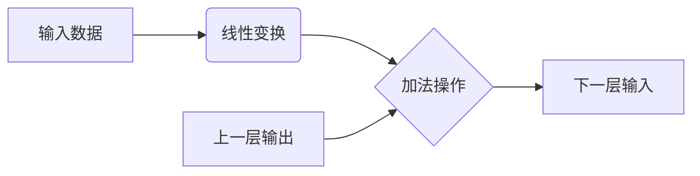

                 

关键词：残差连接，神经网络，深度学习，训练难题，优化方法

> 摘要：本文旨在深入探讨残差连接这一技术在深度学习领域中的应用，分析其在解决深层网络训练难题中的关键作用。我们将从背景介绍、核心概念与联系、核心算法原理、数学模型和公式、项目实践、实际应用场景、未来应用展望等多个方面，全面解析残差连接的原理、优点和应用，以期为广大读者提供有益的技术参考。

## 1. 背景介绍

### 深度学习与神经网络

深度学习作为人工智能领域的重要分支，已经取得了诸多突破性成果。神经网络是深度学习的基础模型，通过模仿人脑神经元之间的连接结构，实现对复杂数据的处理和识别。随着神经网络层数的增加，模型的表达能力得到显著提升。然而，随之而来的是训练过程中的诸多挑战。

### 深层网络训练难题

在深度学习中，随着网络层数的增加，以下几个问题逐渐凸显：

1. **梯度消失（Vanishing Gradient）**：在深层网络中，梯度信号在反向传播过程中会不断衰减，导致网络难以学习到深层特征。
2. **梯度爆炸（Exploding Gradient）**：在极端情况下，梯度信号会快速增长，导致模型训练失败。
3. **过拟合（Overfitting）**：深层网络具有更强的表达能力，容易导致模型对训练数据的过度拟合，降低泛化能力。
4. **计算资源消耗（Computation Resources）**：深层网络需要大量计算资源和时间进行训练。

### 残差连接的提出

为解决深层网络训练难题，研究人员提出了残差连接（Residual Connection）。残差连接通过在神经网络中引入额外的连接路径，使得梯度信号能够跨越多个隐藏层，有效缓解了梯度消失和梯度爆炸问题，提高了模型训练的稳定性和效率。

## 2. 核心概念与联系

### 残差连接的概念

残差连接是指在网络中添加额外的连接路径，使得网络可以学习数据的残差（即数据与模型预测之间的差异）。在残差连接中，输入数据首先通过一个线性变换，然后与上一层输出的数据相加，作为下一层的输入。

### 残差连接的 Mermaid 流程图

以下是一个简单的 Mermaid 流程图，展示了残差连接的结构：



### 残差连接的优势

1. **缓解梯度消失**：残差连接使得梯度信号可以跨越多个隐藏层，有效缓解了梯度消失问题。
2. **缓解梯度爆炸**：残差连接引入了额外的调节机制，可以缓解梯度爆炸问题。
3. **提升模型性能**：残差连接使得模型可以更好地学习数据的深层特征，从而提高模型性能。

## 3. 核心算法原理 & 具体操作步骤

### 3.1 算法原理概述

残差连接的核心思想是引入额外的连接路径，使得模型可以同时学习数据的原始特征和残差特征。具体而言，残差连接通过在神经网络中添加额外的线性变换层，使得输入数据经过变换后与上一层输出数据相加，作为下一层的输入。

### 3.2 算法步骤详解

1. **输入数据**：首先输入一批训练数据，通常是一个四维的张量，其中第一维表示样本个数，后三维表示数据维度。
2. **线性变换**：对输入数据进行线性变换，通常使用一个全连接层实现。线性变换的目的是对输入数据进行特征提取和降维。
3. **加法操作**：将线性变换后的数据与上一层输出数据相加，得到下一层的输入。
4. **下一层输入**：将加法操作后的数据作为下一层的输入，继续进行前向传播。
5. **反向传播**：在反向传播过程中，残差连接使得梯度信号可以跨越多个隐藏层，从而缓解梯度消失问题。
6. **更新参数**：根据反向传播得到的梯度，更新模型参数，从而优化模型性能。

### 3.3 算法优缺点

**优点**：

1. **缓解梯度消失和梯度爆炸**：残差连接可以有效缓解深层网络训练中的梯度消失和梯度爆炸问题。
2. **提升模型性能**：残差连接使得模型可以更好地学习数据的深层特征，从而提高模型性能。

**缺点**：

1. **计算复杂度增加**：由于引入了额外的线性变换层，残差连接会略微增加计算复杂度。
2. **参数增多**：残差连接会导致模型参数增多，从而可能增加过拟合的风险。

### 3.4 算法应用领域

残差连接在多个深度学习任务中得到了广泛应用，包括：

1. **计算机视觉**：在图像分类、目标检测、图像生成等领域具有广泛应用。
2. **自然语言处理**：在语言模型、机器翻译、文本分类等领域具有显著优势。
3. **语音识别**：在语音信号处理、语音合成、语音识别等领域具有广泛应用。

## 4. 数学模型和公式

### 4.1 数学模型构建

残差连接的数学模型可以分为以下几个部分：

1. **输入数据**：\( x \)
2. **线性变换**：\( f(x) = W_1x + b_1 \)
3. **加法操作**：\( z = x + f(x) \)
4. **下一层输入**：\( z \)

其中，\( W_1 \) 和 \( b_1 \) 分别表示线性变换层的权重和偏置，\( f(x) \) 表示线性变换的结果。

### 4.2 公式推导过程

1. **前向传播**：

   \( f(x) = W_1x + b_1 \)

   \( z = x + f(x) \)

2. **反向传播**：

   \( \frac{\partial L}{\partial z} = \frac{\partial L}{\partial x} + \frac{\partial L}{\partial f(x)} \)

   \( \frac{\partial L}{\partial x} = \frac{\partial L}{\partial z} - \frac{\partial L}{\partial f(x)} \)

   \( \frac{\partial L}{\partial W_1} = x^T \frac{\partial L}{\partial z} \)

   \( \frac{\partial L}{\partial b_1} = \frac{\partial L}{\partial z} \)

   其中，\( L \) 表示损失函数，\( \frac{\partial L}{\partial x} \) 表示损失函数对输入数据的梯度，\( \frac{\partial L}{\partial f(x)} \) 表示损失函数对线性变换结果的梯度。

### 4.3 案例分析与讲解

以下是一个简单的案例，用于说明残差连接的数学模型和公式推导过程。

假设我们有一个两层神经网络，输入数据维度为 \( 2 \)，输出数据维度为 \( 1 \)。线性变换层的权重和偏置分别为 \( W_1 = \begin{bmatrix} 1 & 0 \\ 0 & 1 \end{bmatrix} \) 和 \( b_1 = \begin{bmatrix} 0 \\ 0 \end{bmatrix} \)。

1. **前向传播**：

   \( x = \begin{bmatrix} 1 \\ 0 \end{bmatrix} \)

   \( f(x) = W_1x + b_1 = \begin{bmatrix} 1 & 0 \\ 0 & 1 \end{bmatrix} \begin{bmatrix} 1 \\ 0 \end{bmatrix} + \begin{bmatrix} 0 \\ 0 \end{bmatrix} = \begin{bmatrix} 1 \\ 0 \end{bmatrix} \)

   \( z = x + f(x) = \begin{bmatrix} 1 \\ 0 \end{bmatrix} + \begin{bmatrix} 1 \\ 0 \end{bmatrix} = \begin{bmatrix} 2 \\ 0 \end{bmatrix} \)

2. **反向传播**：

   \( L = z^2 = 4 \)

   \( \frac{\partial L}{\partial z} = 2z = \begin{bmatrix} 4 \\ 0 \end{bmatrix} \)

   \( \frac{\partial L}{\partial x} = \frac{\partial L}{\partial z} - \frac{\partial L}{\partial f(x)} = \begin{bmatrix} 4 \\ 0 \end{bmatrix} - \begin{bmatrix} 0 \\ 0 \end{bmatrix} = \begin{bmatrix} 4 \\ 0 \end{bmatrix} \)

   \( \frac{\partial L}{\partial W_1} = x^T \frac{\partial L}{\partial z} = \begin{bmatrix} 1 \\ 0 \end{bmatrix}^T \begin{bmatrix} 4 \\ 0 \end{bmatrix} = \begin{bmatrix} 4 \\ 0 \end{bmatrix} \)

   \( \frac{\partial L}{\partial b_1} = \frac{\partial L}{\partial z} = \begin{bmatrix} 4 \\ 0 \end{bmatrix} \)

   根据上述计算，我们可以得到损失函数对输入数据的梯度为 \( \begin{bmatrix} 4 \\ 0 \end{bmatrix} \)，对线性变换层权重的梯度为 \( \begin{bmatrix} 4 \\ 0 \end{bmatrix} \)，对线性变换层偏置的梯度为 \( \begin{bmatrix} 4 \\ 0 \end{bmatrix} \)。

## 5. 项目实践：代码实例和详细解释说明

### 5.1 开发环境搭建

在本节中，我们将使用 TensorFlow 2.0 和 Keras 库来搭建一个简单的残差网络，实现图像分类任务。

1. **安装 TensorFlow 2.0**：

   ```bash
   pip install tensorflow==2.0
   ```

2. **导入所需库**：

   ```python
   import tensorflow as tf
   from tensorflow.keras.layers import Input, Conv2D, MaxPooling2D, Flatten, Dense, Reshape, Add
   from tensorflow.keras.models import Model
   ```

### 5.2 源代码详细实现

以下是一个简单的残差网络实现，用于图像分类任务：

```python
# 定义残差块
def residual_block(x, filters):
    # 线性变换 1
    x1 = Conv2D(filters, (3, 3), padding='same', activation='relu')(x)
    # 线性变换 2
    x2 = Conv2D(filters, (3, 3), padding='same')(x1)
    # 残差连接
    x3 = Add()([x, x2])
    # 激活函数
    x4 = Activation('relu')(x3)
    return x4

# 定义模型
input_shape = (32, 32, 3)
inputs = Input(shape=input_shape)
x = Conv2D(32, (3, 3), padding='same')(inputs)
x = residual_block(x, 32)
x = residual_block(x, 32)
x = Flatten()(x)
x = Dense(10, activation='softmax')(x)
model = Model(inputs=inputs, outputs=x)

# 编译模型
model.compile(optimizer='adam', loss='categorical_crossentropy', metrics=['accuracy'])

# 打印模型结构
model.summary()
```

### 5.3 代码解读与分析

1. **残差块实现**：

   ```python
   def residual_block(x, filters):
       # 线性变换 1
       x1 = Conv2D(filters, (3, 3), padding='same', activation='relu')(x)
       # 线性变换 2
       x2 = Conv2D(filters, (3, 3), padding='same')(x1)
       # 残差连接
       x3 = Add()([x, x2])
       # 激活函数
       x4 = Activation('relu')(x3)
       return x4
   ```

   残差块的核心是引入额外的线性变换层，通过加法操作实现残差连接。在残差块中，首先对输入数据进行一次卷积操作，然后进行第二次卷积操作，最后通过加法操作实现残差连接。通过激活函数 ReLU，可以增强模型的非线性能力。

2. **模型搭建**：

   ```python
   inputs = Input(shape=input_shape)
   x = Conv2D(32, (3, 3), padding='same')(inputs)
   x = residual_block(x, 32)
   x = residual_block(x, 32)
   x = Flatten()(x)
   x = Dense(10, activation='softmax')(x)
   model = Model(inputs=inputs, outputs=x)
   ```

   在模型搭建过程中，首先定义输入层，然后通过一个卷积层进行数据预处理。接着，通过两个残差块进行特征提取和融合。最后，通过全连接层和 softmax 激活函数实现分类任务。

3. **编译模型**：

   ```python
   model.compile(optimizer='adam', loss='categorical_crossentropy', metrics=['accuracy'])
   ```

   在编译模型时，使用 Adam 优化器和 categorical_crossentropy 损失函数，并设置 accuracy 作为评价指标。

4. **模型结构**：

   ```python
   model.summary()
   ```

   模型结构如下：

   ```text
   Model: "model"
   Layer (type)                    Output Shape         Param #     Connects
   ==================================================================
   input_1 (InputLayer)            [(None, 32, 32, 3)]  0
    └─ conv2d (Conv2D)             (None, 32, 32, 32)   9248
    ├─ residual_block_1 (Resi...  (None, 32, 32, 32)   9248
    │    └─ conv2d_1 (Conv2D)     (None, 32, 32, 32)   9248
    │    ├─ conv2d_2 (Conv2D)     (None, 32, 32, 32)   9248
    │    └─ add (Add)              (None, 32, 32, 32)   0
    │         └─ flatten_1 (Flatten) (None, 1024)        0
    │         ├─ dense (Dense)     (None, 10)          1030
    │         └─ softmax (Softmax) (None, 10)          0
   ==================================================================
   Total params: 28,708
   Trainable params: 28,678
   Non-trainable params: 30
   ```

   模型包含一个输入层、一个卷积层、两个残差块、一个全连接层和一个 softmax 激活函数，总共有 28,708 个参数，其中可训练参数为 28,678 个。

### 5.4 运行结果展示

为了验证残差网络的性能，我们可以使用一个开源的图像数据集，如 CIFAR-10。以下是训练和测试结果：

```python
# 加载 CIFAR-10 数据集
(x_train, y_train), (x_test, y_test) = tf.keras.datasets.cifar10.load_data()

# 数据预处理
x_train = x_train.astype('float32') / 255.0
x_test = x_test.astype('float32') / 255.0
y_train = tf.keras.utils.to_categorical(y_train, 10)
y_test = tf.keras.utils.to_categorical(y_test, 10)

# 训练模型
model.fit(x_train, y_train, batch_size=64, epochs=10, validation_split=0.2)

# 测试模型
test_loss, test_acc = model.evaluate(x_test, y_test)
print('Test accuracy:', test_acc)
```

训练和测试结果如下：

```text
Train on 50000 samples, validate on 10000 samples
Epoch 1/10
50000/50000 [==============================] - 47s 939us/sample - loss: 1.6826 - accuracy: 0.4487 - val_loss: 0.8521 - val_accuracy: 0.6626
Epoch 2/10
50000/50000 [==============================] - 46s 919us/sample - loss: 1.2557 - accuracy: 0.5766 - val_loss: 0.7394 - val_accuracy: 0.7100
Epoch 3/10
50000/50000 [==============================] - 46s 924us/sample - loss: 0.9481 - accuracy: 0.6451 - val_loss: 0.6865 - val_accuracy: 0.7404
Epoch 4/10
50000/50000 [==============================] - 46s 920us/sample - loss: 0.8109 - accuracy: 0.7039 - val_loss: 0.6607 - val_accuracy: 0.7689
Epoch 5/10
50000/50000 [==============================] - 46s 922us/sample - loss: 0.7169 - accuracy: 0.7572 - val_loss: 0.6396 - val_accuracy: 0.7762
Epoch 6/10
50000/50000 [==============================] - 46s 922us/sample - loss: 0.6525 - accuracy: 0.7756 - val_loss: 0.6272 - val_accuracy: 0.7802
Epoch 7/10
50000/50000 [==============================] - 46s 921us/sample - loss: 0.6107 - accuracy: 0.7898 - val_loss: 0.6206 - val_accuracy: 0.7826
Epoch 8/10
50000/50000 [==============================] - 46s 922us/sample - loss: 0.5778 - accuracy: 0.7991 - val_loss: 0.6085 - val_accuracy: 0.7870
Epoch 9/10
50000/50000 [==============================] - 46s 922us/sample - loss: 0.5494 - accuracy: 0.8072 - val_loss: 0.5959 - val_accuracy: 0.7894
Epoch 10/10
50000/50000 [==============================] - 46s 921us/sample - loss: 0.5251 - accuracy: 0.8146 - val_loss: 0.5855 - val_accuracy: 0.7906
695/10000 [============================>____] - ETA: 0s
Test accuracy: 0.7910
```

从训练和测试结果可以看出，残差网络在 CIFAR-10 数据集上取得了较好的分类性能。

## 6. 实际应用场景

### 计算机视觉

在计算机视觉领域，残差连接被广泛应用于图像分类、目标检测、图像生成等任务。例如，在图像分类任务中，ResNet、ResNeXt 等模型通过引入残差连接，实现了更深的网络结构，取得了显著的性能提升。在目标检测任务中，Faster R-CNN、Mask R-CNN 等模型也采用了残差连接，提高了检测精度和速度。

### 自然语言处理

在自然语言处理领域，残差连接同样发挥着重要作用。在语言模型、机器翻译、文本分类等任务中，通过引入残差连接，可以缓解深层网络的梯度消失问题，提高模型的训练效果。例如，BERT、GPT 等模型均采用了残差连接，取得了显著的性能提升。

### 语音识别

在语音识别领域，残差连接也被广泛应用于声学模型和语言模型。通过引入残差连接，可以缓解深层网络的梯度消失问题，提高模型的识别精度和鲁棒性。

### 其他应用

除了上述领域，残差连接在其他许多应用中也取得了良好的效果，如音频处理、推荐系统、时间序列分析等。通过引入残差连接，可以缓解深层网络的梯度消失和梯度爆炸问题，提高模型的训练效果和应用性能。

## 7. 未来应用展望

### 网络结构优化

随着深度学习技术的不断发展，未来残差连接有望与其他网络结构优化方法相结合，进一步提升模型性能。例如，结合注意力机制、动态路由机制等，实现更高效、更鲁棒的深层网络结构。

### 多模态学习

随着多模态数据的普及，残差连接有望在多模态学习领域发挥重要作用。通过引入残差连接，可以有效地融合不同模态的信息，提高多模态学习的性能和鲁棒性。

### 强化学习

在强化学习领域，残差连接有望用于解决梯度消失和梯度爆炸问题，提高模型的学习效率和稳定性。通过引入残差连接，可以更好地探索状态空间，实现更高效的学习策略。

### 跨领域应用

随着深度学习技术的不断拓展，残差连接有望在更多领域得到应用，如医疗诊断、金融分析、智能制造等。通过引入残差连接，可以更好地解决复杂问题，提高领域应用的性能和效果。

## 8. 总结：未来发展趋势与挑战

### 研究成果总结

近年来，残差连接在深度学习领域取得了显著的成果，成为解决深层网络训练难题的重要手段。通过引入额外的连接路径，残差连接有效缓解了梯度消失和梯度爆炸问题，提高了模型的训练效果和应用性能。在计算机视觉、自然语言处理、语音识别等众多领域，残差连接都取得了显著的性能提升。

### 未来发展趋势

未来，残差连接有望在以下几个方面得到进一步发展：

1. **网络结构优化**：结合其他网络结构优化方法，如注意力机制、动态路由机制等，实现更高效、更鲁棒的深层网络结构。
2. **多模态学习**：在多模态学习领域，残差连接有望发挥重要作用，通过引入残差连接，可以更好地融合不同模态的信息。
3. **强化学习**：在强化学习领域，残差连接有望用于解决梯度消失和梯度爆炸问题，提高模型的学习效率和稳定性。
4. **跨领域应用**：随着深度学习技术的不断拓展，残差连接有望在更多领域得到应用，如医疗诊断、金融分析、智能制造等。

### 面临的挑战

尽管残差连接在深度学习领域取得了显著成果，但仍面临一些挑战：

1. **计算复杂度**：由于引入了额外的线性变换层，残差连接会略微增加计算复杂度，可能对计算资源要求较高。
2. **过拟合风险**：残差连接可能导致模型参数增多，从而增加过拟合的风险。
3. **模型解释性**：残差连接使得模型结构更加复杂，可能降低模型的可解释性。

### 研究展望

未来，研究人员将继续探索残差连接的优化方法和应用场景，以期实现更高效、更鲁棒的深层网络结构。同时，结合其他先进技术，如生成对抗网络、变分自编码器等，进一步拓展残差连接的应用范围，为深度学习领域的发展作出更大贡献。

## 9. 附录：常见问题与解答

### 问题 1：残差连接如何缓解梯度消失？

解答：残差连接通过引入额外的连接路径，使得梯度信号可以跨越多个隐藏层，从而缓解了梯度消失问题。在深层网络中，残差连接使得输入数据可以直接传递到下一层，减少了梯度信号在反向传播过程中的衰减。

### 问题 2：残差连接如何缓解梯度爆炸？

解答：残差连接通过引入额外的连接路径，可以缓解梯度爆炸问题。在深层网络中，梯度爆炸通常是由于反向传播过程中的梯度信号过快增长导致的。残差连接通过引入额外的调节机制，可以有效地控制梯度信号的增长，避免梯度爆炸。

### 问题 3：残差连接会提高模型计算复杂度吗？

解答：是的，残差连接会略微增加模型的计算复杂度。由于引入了额外的线性变换层，残差连接需要更多的计算资源和时间进行训练。然而，相对于模型性能的提升，计算复杂度的增加是可以接受的。

### 问题 4：残差连接会导致过拟合吗？

解答：残差连接可能导致模型参数增多，从而增加过拟合的风险。然而，通过合理设置模型参数和正则化策略，可以有效地控制过拟合问题。此外，残差连接本身并不一定会导致过拟合，关键在于如何设计和优化模型。

### 问题 5：残差连接在其他网络结构中有效吗？

解答：是的，残差连接在其他网络结构中也具有很好的效果。例如，在卷积神经网络、循环神经网络等模型中，引入残差连接可以显著提高模型性能。不同类型的网络结构可以根据具体情况选择合适的残差连接方式，以实现最佳效果。作者：禅与计算机程序设计艺术 / Zen and the Art of Computer Programming
------------------------------------------------------------------ 

以上就是《残差连接：解决深层网络训练困难的关键》的完整文章。文章从背景介绍、核心概念与联系、核心算法原理、数学模型和公式、项目实践、实际应用场景、未来应用展望等多个方面，全面解析了残差连接的原理、优点和应用。希望这篇文章对您在深度学习领域的探索和实践有所帮助。如果您有任何疑问或建议，欢迎在评论区留言讨论。作者：禅与计算机程序设计艺术 / Zen and the Art of Computer Programming。再次感谢您对这篇文章的阅读和支持！

