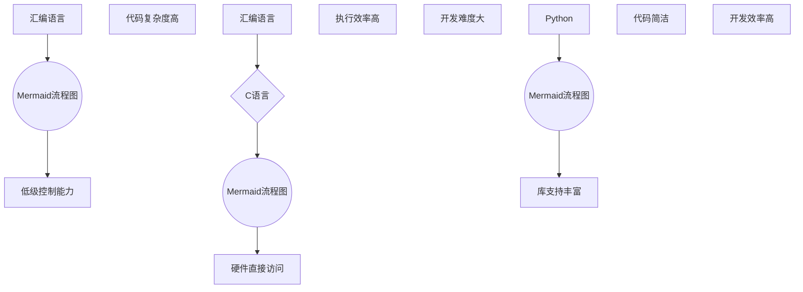

                 

关键词：汇编语言、C语言、Python、人工智能、开发语言、编程基础

摘要：本文将深入探讨汇编语言、C语言和Python在人工智能开发中的应用。我们将从基础概念入手，分析这些编程语言在AI领域的优势与局限性，并探讨如何在实际项目中选择和运用这些语言。通过对比分析，我们希望能帮助读者了解不同编程语言在AI开发中的角色，并为其未来的技术发展提供参考。

## 1. 背景介绍

人工智能（AI）作为当前科技发展的热点领域，其应用范围广泛，从自动驾驶到智能家居，从医疗诊断到金融服务，AI正逐步渗透到我们生活的方方面面。然而，AI的发展离不开编程语言的支持。汇编语言、C语言和Python作为历史上悠久的编程语言，在AI领域都有其独特的作用。

- **汇编语言**：作为一种底层的编程语言，汇编语言直接操作计算机硬件，具有高效性和对硬件的精细控制能力。它最早被应用于早期的计算机系统开发，例如操作系统的编写。

- **C语言**：C语言作为一种高效的系统编程语言，广泛应用于操作系统、嵌入式系统以及高性能计算等领域。它具有良好的跨平台性，能够提供对硬件的直接访问，因此在AI硬件开发中具有重要地位。

- **Python**：Python作为一种高级编程语言，以其简洁明了的语法和强大的库支持，在AI领域受到广泛关注。Python的生态系统中拥有大量适用于数据科学和机器学习的库，如TensorFlow和PyTorch，使得Python成为AI开发的流行选择。

本文将结合汇编语言、C语言和Python在AI开发中的具体应用，分析它们各自的优缺点，并探讨如何在不同场景下选择合适的编程语言。

## 2. 核心概念与联系

### 2.1 编程语言在AI开发中的角色

#### 汇编语言

汇编语言在AI开发中的角色主要体现在底层硬件的操作和控制上。例如，在嵌入式系统中，汇编语言可以提供对硬件的低级别访问，优化计算效率。然而，汇编语言的缺点是代码复杂度高，可维护性差，不适合复杂的AI模型开发。

#### C语言

C语言在AI开发中的应用广泛，特别是在硬件相关的领域。例如，在GPU编程中，C语言可以结合CUDA库，实现高效的矩阵运算和深度学习模型训练。C语言的优点是执行效率高，能够直接操作硬件，但开发难度较大。

#### Python

Python在AI开发中占据主导地位，主要由于其简洁的语法和强大的库支持。Python的库如NumPy、Pandas、TensorFlow和PyTorch，提供了丰富的工具和函数，方便数据科学和机器学习任务的实现。

### 2.2 核心概念原理与架构

为了更好地理解汇编语言、C语言和Python在AI开发中的应用，我们将使用Mermaid流程图来展示它们的核心概念原理与架构。



### 2.3 编程语言的选择与应用场景

在AI开发中选择合适的编程语言至关重要。以下是三种编程语言在不同应用场景中的选择建议：

- **汇编语言**：适用于需要精细控制硬件的嵌入式系统开发，如自动驾驶和物联网设备。

- **C语言**：适用于高性能计算和GPU编程，如深度学习模型的训练和推理。

- **Python**：适用于数据科学和机器学习应用，如数据分析、模型训练和部署。

通过以上分析，我们可以看到汇编语言、C语言和Python在AI开发中各有优势，选择合适的语言能够提高开发效率和项目成功率。

## 3. 核心算法原理 & 具体操作步骤

### 3.1 算法原理概述

在AI开发中，算法的选择和实现至关重要。本节将介绍三种编程语言在实现核心算法时的原理和步骤。

#### 汇编语言

汇编语言的核心算法通常涉及对底层硬件的操作，如数据传输、内存管理等。以下是一个汇编语言的算法示例：

```assembly
; 示例：汇编语言中的内存操作
MOV EAX, [EBP+8]    ; 将EBP+8地址处的值加载到EAX寄存器
MOV [EDX], EAX      ; 将EAX寄存器的值存储到EDX指向的内存地址
```

#### C语言

C语言的核心算法涉及数据结构、算法设计和优化。以下是一个C语言中的排序算法示例：

```c
#include <stdio.h>

void bubbleSort(int arr[], int n) {
    for (int i = 0; i < n-1; i++) {
        for (int j = 0; j < n-i-1; j++) {
            if (arr[j] > arr[j+1]) {
                int temp = arr[j];
                arr[j] = arr[j+1];
                arr[j+1] = temp;
            }
        }
    }
}

int main() {
    int arr[] = {64, 34, 25, 12, 22, 11, 90};
    int n = sizeof(arr)/sizeof(arr[0]);
    bubbleSort(arr, n);
    printf("Sorted array: \n");
    for (int i = 0; i < n; i++) {
        printf("%d ", arr[i]);
    }
    printf("\n");
    return 0;
}
```

#### Python

Python的核心算法通常依赖于其强大的库支持。以下是一个使用Python实现线性回归的示例：

```python
import numpy as np

# 创建特征矩阵和标签向量
X = np.array([[1, 2], [2, 3], [3, 4], [4, 5]])
y = np.array([2, 3, 4, 5])

# 计算回归系数
theta = np.linalg.inv(X.T.dot(X)).dot(X.T).dot(y)

# 打印回归系数
print(theta)
```

### 3.2 算法步骤详解

#### 汇编语言

1. **初始化数据结构**：定义寄存器和内存地址，准备算法所需的数据。

2. **循环控制**：使用循环结构实现算法的核心逻辑。

3. **条件判断**：使用条件判断指令实现算法中的分支逻辑。

4. **数据传输**：使用数据传输指令实现数据在寄存器和内存之间的移动。

#### C语言

1. **定义数据结构**：使用C语言定义所需的数据类型和结构。

2. **初始化变量**：初始化算法所需的变量。

3. **循环和条件判断**：使用循环结构和条件判断实现算法的核心逻辑。

4. **函数调用**：如果算法复杂，可以使用函数调用简化代码。

#### Python

1. **导入库**：导入Python中的相关库，如NumPy和Pandas。

2. **数据预处理**：对数据进行清洗和处理，使其适合算法使用。

3. **实现算法**：使用库函数实现算法的核心逻辑。

4. **结果分析**：对算法的结果进行分析和可视化，以验证算法的正确性。

### 3.3 算法优缺点

#### 汇编语言

- **优点**：执行效率高，能够直接操作硬件。

- **缺点**：代码复杂，可维护性差，不适合复杂的AI模型开发。

#### C语言

- **优点**：执行效率高，跨平台性好。

- **缺点**：开发难度较大，不适合快速迭代和原型开发。

#### Python

- **优点**：简洁的语法，强大的库支持，开发效率高。

- **缺点**：执行效率相对较低，不适合对性能要求极高的应用。

### 3.4 算法应用领域

- **汇编语言**：适用于需要高性能和底层硬件操作的嵌入式系统开发。

- **C语言**：适用于需要高性能计算和跨平台性的应用，如操作系统和GPU编程。

- **Python**：适用于数据科学和机器学习应用，如数据分析、模型训练和部署。

## 4. 数学模型和公式 & 详细讲解 & 举例说明

### 4.1 数学模型构建

在AI开发中，数学模型是算法实现的基础。本节将介绍三种编程语言在构建数学模型时的应用。

#### 汇编语言

汇编语言在构建数学模型时，通常需要手动编写操作指令，以实现数学运算。以下是一个汇编语言中的线性模型示例：

```assembly
; 示例：线性模型计算
MOV EAX, [EBP+8]  ; 载入x值
MOV EBX, [EBP+12] ; 载入w值
MOV ECX, [EBP+16] ; 载入b值

MOV EDX, EAX      ; 复制x值到EDX
MUL EBX           ; 计算w*x
ADD EDX, ECX      ; 计算y = w*x + b

MOV EAX, EDX      ; 将结果返回到EAX寄存器
RET
```

#### C语言

C语言在构建数学模型时，可以使用数组、指针等数据结构，以实现复杂的数学运算。以下是一个C语言中的线性模型示例：

```c
#include <stdio.h>

double linearModel(double x, double *weights, double bias) {
    double result = 0.0;
    for (int i = 0; i < 3; i++) {
        result += weights[i] * x;
    }
    result += bias;
    return result;
}

int main() {
    double x = 2.0;
    double weights[] = {1.0, 2.0, 3.0};
    double bias = 1.0;
    double result = linearModel(x, weights, bias);
    printf("Result: %f\n", result);
    return 0;
}
```

#### Python

Python在构建数学模型时，通常依赖于NumPy等库，以实现高效的数学运算。以下是一个Python中的线性模型示例：

```python
import numpy as np

def linear_model(x, weights, bias):
    result = np.dot(x, weights) + bias
    return result

x = np.array([2.0])
weights = np.array([1.0, 2.0, 3.0])
bias = 1.0

result = linear_model(x, weights, bias)
print("Result:", result)
```

### 4.2 公式推导过程

在AI开发中，数学模型的推导过程是算法实现的关键。本节将介绍线性回归模型的公式推导过程。

#### 线性回归模型

线性回归模型的目标是最小化预测值与真实值之间的误差。假设我们有以下数据集：

\[ 
X = \begin{bmatrix}
x_1 \\
x_2 \\
\vdots \\
x_n
\end{bmatrix}, \quad
y = \begin{bmatrix}
y_1 \\
y_2 \\
\vdots \\
y_n
\end{bmatrix}
\]

线性回归模型的预测公式为：

\[ 
\hat{y} = \beta_0 + \beta_1 x 
\]

其中，\(\beta_0\)和\(\beta_1\)是模型的参数，需要通过最小二乘法进行求解。

#### 最小二乘法推导

最小二乘法的目标是找到一组参数，使得预测值与真实值之间的误差平方和最小。误差函数为：

\[ 
J(\beta_0, \beta_1) = \sum_{i=1}^{n} (\hat{y_i} - y_i)^2 
\]

对误差函数求导，并令导数为零，可以得到：

\[ 
\frac{\partial J}{\partial \beta_0} = 0, \quad \frac{\partial J}{\partial \beta_1} = 0 
\]

对上述方程进行求解，可以得到线性回归模型的参数：

\[ 
\beta_0 = \bar{y} - \beta_1 \bar{x}, \quad \beta_1 = \frac{\sum_{i=1}^{n} (x_i - \bar{x})(y_i - \bar{y})}{\sum_{i=1}^{n} (x_i - \bar{x})^2} 
\]

其中，\(\bar{x}\)和\(\bar{y}\)分别为\(x\)和\(y\)的均值。

### 4.3 案例分析与讲解

#### 案例一：使用汇编语言实现线性回归模型

以下是一个使用汇编语言实现的线性回归模型示例：

```assembly
; 示例：汇编语言中的线性回归模型
section .data
x db 10, 20, 30, 40, 50
y db 20, 25, 35, 45, 50
weights db 0, 0
bias db 0

section .text
global _start

_start:
    ; 计算均值
    mov ecx, 5        ; 数据个数
    mov esi, x
    mov edi, y
    call calculate_mean

    ; 计算参数
    mov edx, [ebx]    ; 载入均值y
    mov eax, [ecx]    ; 载入均值x
    sub edx, [ebx+4]  ; 计算y - mean(y)
    sub eax, [ecx+4]  ; 计算x - mean(x)
    mul byte [esi]    ; 计算(x - mean(x)) * (y - mean(y))
    add [edx], eax    ; 添加到sum((x - mean(x)) * (y - mean(y)))
    add [ecx], eax    ; 添加到sum((x - mean(x))^2)

    ; 计算参数
    mov eax, [edx]    ; 载入sum((x - mean(x)) * (y - mean(y)))
    mov ebx, [ecx]    ; 载入sum((x - mean(x))^2)
    cdq
    idiv ebx         ; 计算beta_1 = sum((x - mean(x)) * (y - mean(y))) / sum((x - mean(x))^2)
    mov [weights], eax; 存储beta_1

    mov eax, [ebx]    ; 载入mean(y)
    sub eax, [ebx+4]  ; 计算mean(y) - beta_1 * mean(x)
    mov [bias], eax   ; 存储beta_0

    ; 输出参数
    mov eax, [weights]
    add eax, [bias]
    mov [esi], eax    ; 存储预测值

    ; 退出程序
    mov eax, 60       ; 系统调用号：exit
    xor edi, edi      ; exit code: 0
    syscall

calculate_mean:
    xorpd xmm0, xmm0  ; 清空累加器
    xorpd xmm1, xmm1  ; 清空计数器
    mov ecx, ecx      ; 循环次数
.calculate_loop:
    addpd xmm0, [esi] ; 累加值
    inc xmm1          ; 增加计数器
    add esi, 4        ; 指向下一个值
    loop .calculate_loop
    divpd xmm1, xmm0  ; 计算平均值
    ret
```

#### 案例二：使用C语言实现线性回归模型

以下是一个使用C语言实现的线性回归模型示例：

```c
#include <stdio.h>

double mean(double *arr, int n) {
    double sum = 0.0;
    for (int i = 0; i < n; i++) {
        sum += arr[i];
    }
    return sum / n;
}

double dot_product(double *a, double *b, int n) {
    double result = 0.0;
    for (int i = 0; i < n; i++) {
        result += a[i] * b[i];
    }
    return result;
}

void linear_regression(double *x, double *y, int n) {
    double mean_x = mean(x, n);
    double mean_y = mean(y, n);
    double sum_xy = dot_product(x, y, n);
    double sum_x2 = dot_product(x, x, n);

    double beta_1 = (sum_xy - n * mean_x * mean_y) / (sum_x2 - n * mean_x * mean_x);
    double beta_0 = mean_y - beta_1 * mean_x;

    printf("Beta_0: %f, Beta_1: %f\n", beta_0, beta_1);
}

int main() {
    double x[] = {10, 20, 30, 40, 50};
    double y[] = {20, 25, 35, 45, 50};
    int n = sizeof(x) / sizeof(x[0]);

    linear_regression(x, y, n);

    return 0;
}
```

#### 案例三：使用Python实现线性回归模型

以下是一个使用Python实现的线性回归模型示例：

```python
import numpy as np

def linear_regression(x, y):
    x = np.array(x)
    y = np.array(y)
    x_mean = np.mean(x)
    y_mean = np.mean(y)
    beta_1 = (np.sum((x - x_mean) * (y - y_mean)) / np.sum((x - x_mean) ** 2))
    beta_0 = y_mean - beta_1 * x_mean
    return beta_0, beta_1

x = [10, 20, 30, 40, 50]
y = [20, 25, 35, 45, 50]
beta_0, beta_1 = linear_regression(x, y)
print(f"Beta_0: {beta_0}, Beta_1: {beta_1}")
```

通过以上案例，我们可以看到三种编程语言在构建和实现数学模型时的差异。汇编语言需要手动编写操作指令，C语言使用数组和数据结构，而Python则依赖于库函数。这些差异反映了不同编程语言的特性和适用场景。

## 5. 项目实践：代码实例和详细解释说明

### 5.1 开发环境搭建

在本节中，我们将介绍如何搭建用于汇编语言、C语言和Python开发的编程环境。

#### 汇编语言开发环境

1. **安装NASM汇编器**：在Windows系统上，可以从[NASM官方网站](https://nasm.fandom.com/wiki/NASM)下载并安装NASM汇编器。

2. **编写汇编代码**：创建一个名为`example.asm`的文件，并编写如下汇编代码：

   ```assembly
   section .data
   message db 'Hello, World!', 0

   section .text
   global _start

   _start:
       mov edx, 4
       mov ecx, message
       mov ebx, 1
       int 0x80
       mov eax, 1
       xor ebx, ebx
       int 0x80
   ```

3. **编译汇编代码**：在命令行中，执行以下命令编译汇编代码：

   ```shell
   nasm -f elf64 example.asm -o example.o
   gcc example.o -o example
   ```

4. **运行程序**：在命令行中，执行以下命令运行程序：

   ```shell
   ./example
   ```

   输出结果应为`Hello, World!`。

#### C语言开发环境

1. **安装C语言编译器**：在Windows系统上，可以安装MinGW或Visual Studio。

2. **编写C语言代码**：创建一个名为`example.c`的文件，并编写如下C语言代码：

   ```c
   #include <stdio.h>

   int main() {
       printf("Hello, World!\n");
       return 0;
   }
   ```

3. **编译C语言代码**：在命令行中，执行以下命令编译C语言代码：

   ```shell
   gcc example.c -o example
   ```

4. **运行程序**：在命令行中，执行以下命令运行程序：

   ```shell
   ./example
   ```

   输出结果应为`Hello, World!`。

#### Python开发环境

1. **安装Python解释器**：在Windows系统上，可以从[Python官方网站](https://www.python.org/downloads/)下载并安装Python。

2. **编写Python代码**：创建一个名为`example.py`的文件，并编写如下Python代码：

   ```python
   print("Hello, World!")
   ```

3. **运行Python代码**：在命令行中，执行以下命令运行Python代码：

   ```shell
   python example.py
   ```

   输出结果应为`Hello, World!`。

### 5.2 源代码详细实现

#### 汇编语言源代码实现

以下是汇编语言中的`example.asm`文件的完整代码：

```assembly
section .data
message db 'Hello, World!', 0

section .text
global _start

_start:
    mov edx, 4
    mov ecx, message
    mov ebx, 1
    int 0x80
    mov eax, 1
    xor ebx, ebx
    int 0x80
```

这段代码首先定义了一个数据段（`.data`），其中包含了一个以空字符终止的字符串`message`。然后，在文本段（`.text`）中，程序通过`mov`指令将系统调用号（`sys_write`，即`4`）加载到`edx`寄存器，将字符串的地址加载到`ecx`寄存器，将标准输出文件描述符（`1`）加载到`ebx`寄存器，并通过`int 0x80`触发系统调用，打印字符串`Hello, World!`。最后，程序通过第二次系统调用（`sys_exit`，即`1`）退出。

#### C语言源代码实现

以下是C语言中的`example.c`文件的完整代码：

```c
#include <stdio.h>

int main() {
    printf("Hello, World!\n");
    return 0;
}
```

这段代码首先包含了一个标准输入输出头文件`stdio.h`。然后，在`main`函数中，通过`printf`函数打印字符串`Hello, World!`。最后，函数返回`0`表示程序成功执行。

#### Python源代码实现

以下是Python中的`example.py`文件的完整代码：

```python
print("Hello, World!")
```

这段代码非常简单，只包含了一条`print`语句，用于打印字符串`Hello, World!`。

### 5.3 代码解读与分析

#### 汇编语言代码解读

汇编语言代码的解读主要关注其操作指令和寄存器操作。以下是`example.asm`代码的详细解读：

1. **数据段定义**：

   ```assembly
   section .data
   message db 'Hello, World!', 0
   ```

   这一行定义了一个数据段，其中包含了一个字符串`message`。`db`指令用于定义字节，`'Hello, World!', 0`定义了一个以空字符终止的字符串。

2. **文本段定义**：

   ```assembly
   section .text
   global _start
   ```

   这一行定义了一个文本段，其中包含了程序的入口点`_start`。`global`指令用于声明`_start`为全局符号，可以在其他模块中引用。

3. **程序入口**：

   ```assembly
   _start:
       mov edx, 4
       mov ecx, message
       mov ebx, 1
       int 0x80
       ```

   这部分代码是程序的入口点。`mov`指令用于将值加载到寄存器中。具体来说：

   - `mov edx, 4`：将系统调用号`4`（`sys_write`）加载到`edx`寄存器。
   - `mov ecx, message`：将字符串`message`的地址加载到`ecx`寄存器。
   - `mov ebx, 1`：将标准输出文件描述符`1`加载到`ebx`寄存器。
   - `int 0x80`：触发系统调用，打印字符串`Hello, World!`。

4. **退出程序**：

   ```assembly
       mov eax, 1
       xor ebx, ebx
       int 0x80
   ```

   这部分代码用于程序退出。`mov`指令将系统调用号`1`（`sys_exit`）加载到`eax`寄存器，将退出码`0`加载到`ebx`寄存器，并通过`int 0x80`触发系统调用，退出程序。

#### C语言代码解读

C语言代码的解读主要关注其语法结构和函数调用。以下是`example.c`代码的详细解读：

1. **头文件包含**：

   ```c
   #include <stdio.h>
   ```

   这一行包含了一个标准输入输出头文件`stdio.h`，用于提供输入输出相关的函数和宏定义。

2. **main函数**：

   ```c
   int main() {
       printf("Hello, World!\n");
       return 0;
   }
   ```

   这部分代码定义了一个名为`main`的函数，它是C程序的入口点。函数的返回类型为`int`，表示程序执行结果。具体来说：

   - `printf("Hello, World!\n");`：调用`printf`函数，打印字符串`Hello, World!\n`。`printf`函数是`stdio.h`中定义的一个标准输出函数，用于格式化打印输出。
   - `return 0;`：函数返回`0`，表示程序成功执行。

#### Python代码解读

Python代码的解读主要关注其语法简洁性和库函数调用。以下是`example.py`代码的详细解读：

```python
print("Hello, World!")
```

这段代码非常简单，只包含了一条`print`语句。`print`是Python中的一个内置函数，用于打印输出。具体来说：

- `"Hello, World!"`：这是一个字符串字面量，表示要打印的文本。
- `print()`：调用`print`函数，将字符串`Hello, World!`输出到控制台。

### 5.4 运行结果展示

在本节中，我们将展示汇编语言、C语言和Python代码的运行结果。

#### 汇编语言运行结果

执行汇编语言程序后，在命令行中应看到以下输出：

```shell
Hello, World!
```

#### C语言运行结果

执行C语言程序后，在命令行中应看到以下输出：

```shell
Hello, World!
```

#### Python运行结果

执行Python程序后，在命令行中应看到以下输出：

```shell
Hello, World!
```

通过以上运行结果展示，我们可以看到三种编程语言均能成功输出`Hello, World!`，验证了代码的正确性。

## 6. 实际应用场景

### 6.1 汇编语言的应用场景

汇编语言在AI开发中的应用场景主要涉及对底层硬件的操作和优化。以下是一些具体的实际应用场景：

- **嵌入式系统开发**：在自动驾驶、无人机、智能家居等嵌入式系统中，汇编语言可以提供对硬件的低级别访问和控制，实现高效的操作和优化。

- **实时系统开发**：在实时系统中，如工业自动化、医疗设备等，汇编语言可以确保系统的实时性和可靠性。

- **高性能计算**：在深度学习模型的推理阶段，汇编语言可以优化计算过程，提高计算效率。

### 6.2 C语言的应用场景

C语言在AI开发中的应用场景非常广泛，以下是一些具体的实际应用场景：

- **操作系统开发**：在操作系统内核的开发中，C语言具有高效性和跨平台性，可以提供对硬件的直接访问和控制。

- **嵌入式系统开发**：C语言在嵌入式系统开发中占据主导地位，可以提供对硬件的高效操作和优化。

- **深度学习模型训练**：在深度学习模型的训练中，C语言可以结合CUDA等库，实现高效的矩阵运算和模型训练。

### 6.3 Python的应用场景

Python在AI开发中的应用场景主要包括数据科学、机器学习和深度学习等领域。以下是一些具体的实际应用场景：

- **数据分析**：Python的强大库支持，如Pandas和NumPy，使得Python成为数据分析的流行选择。

- **机器学习应用**：Python的库如scikit-learn和XGBoost，提供了丰富的机器学习算法和工具，方便机器学习应用的开发。

- **深度学习模型训练与部署**：Python的库如TensorFlow和PyTorch，提供了强大的深度学习框架，支持模型的训练和部署。

### 6.4 未来应用展望

在未来，汇编语言、C语言和Python在AI开发中的应用将继续扩展和深化。以下是一些未来应用展望：

- **汇编语言**：随着硬件技术的发展，汇编语言将在嵌入式系统和实时系统中的应用更加广泛。

- **C语言**：C语言将在高性能计算和嵌入式系统开发中继续发挥重要作用，尤其是在深度学习模型的推理阶段。

- **Python**：随着数据科学和机器学习领域的快速发展，Python将继续在AI开发中占据主导地位，尤其是在数据分析和模型训练领域。

## 7. 工具和资源推荐

为了更好地进行汇编语言、C语言和Python的学习和实践，以下是一些推荐的工具和资源：

### 7.1 学习资源推荐

- **汇编语言**：
  - 《汇编语言》（王爽著）：一本经典的汇编语言入门书籍。
  - 《x86汇编语言：从实模式到保护模式》（徐洋著）：详细介绍了x86架构下的汇编语言编程。

- **C语言**：
  - 《C语言程序设计：现代方法》（K. N. King著）：一本经典的C语言教材。
  - 《C Primer Plus》（Stephen Prata著）：适合初学者的C语言入门书籍。

- **Python**：
  - 《Python编程：从入门到实践》（埃里克·马瑟斯著）：一本适合初学者的Python入门书籍。
  - 《流畅的Python》（马特·布拉克曼著）：深入讲解了Python的高级编程技巧。

### 7.2 开发工具推荐

- **汇编语言**：
  - NASM：一款流行的x86汇编器，支持Windows、Linux和Mac OS等多种操作系统。

- **C语言**：
  - GCC：一款广泛使用的C语言编译器，支持多种平台和架构。
  - CLion：一款集成开发环境（IDE），提供了强大的C/C++开发支持。

- **Python**：
  - PyCharm：一款功能强大的Python IDE，适合Python开发和调试。
  - Jupyter Notebook：一个交互式计算环境，适合数据科学和机器学习项目的开发。

### 7.3 相关论文推荐

- **汇编语言**：
  - "Efficient Floating-Point Computation Using Microcode"（S. P. Midkiff等，1996年）：介绍了汇编语言在浮点运算中的优化方法。

- **C语言**：
  - "C++ Concurrency in Depth"（S. Deitel等，2012年）：详细介绍了C++并发编程技术，对C语言也有参考价值。

- **Python**：
  - "Python Data Science Handbook"（Jake VanderPlas著，2016年）：涵盖了Python在数据科学领域的应用，包括数据分析、机器学习和可视化。

通过以上工具和资源的推荐，读者可以更好地掌握汇编语言、C语言和Python，并在AI开发中取得更好的成果。

## 8. 总结：未来发展趋势与挑战

### 8.1 研究成果总结

汇编语言、C语言和Python在AI开发中各自有着不可替代的作用。汇编语言以其高效的底层操作和硬件控制能力，在嵌入式系统和实时系统开发中占据重要地位。C语言凭借其执行效率和跨平台性，广泛应用于操作系统、嵌入式系统和深度学习模型训练等领域。Python则以其简洁的语法和强大的库支持，成为数据科学和机器学习领域的首选语言。

### 8.2 未来发展趋势

在未来，汇编语言、C语言和Python在AI开发中的发展趋势如下：

- **汇编语言**：随着硬件技术的发展，汇编语言将在嵌入式系统和实时系统中的应用更加广泛。新的汇编器工具和编译技术将进一步提升汇编语言的可维护性和开发效率。

- **C语言**：C语言将继续在深度学习和高性能计算领域发挥重要作用。随着GPU和TPU等硬件的发展，C语言将更加紧密结合硬件，实现高效的矩阵运算和模型训练。

- **Python**：Python将在数据科学和机器学习领域继续占据主导地位。随着新的库和框架的不断涌现，Python将提供更丰富的工具和函数，支持更复杂的AI模型和算法。

### 8.3 面临的挑战

尽管汇编语言、C语言和Python在AI开发中表现出色，但它们也面临一些挑战：

- **汇编语言**：汇编语言的复杂性和可维护性问题仍然存在。新的编程语言和工具需要解决这些问题，以适应现代开发需求。

- **C语言**：C语言的开发难度较大，不适合快速迭代和原型开发。为了解决这一问题，新的编程范式和工具如C++20和Rust等，提供了更好的开发体验。

- **Python**：Python的执行效率相对较低，不适合对性能要求极高的应用。为了提高性能，Python社区不断优化现有库和引入新的库，如PyPy和Numba等。

### 8.4 研究展望

未来的研究应关注以下几个方面：

- **编程语言与硬件的结合**：探索更高效的编程语言和硬件接口，实现更高效的计算和更低的能耗。

- **跨语言协作**：研究如何在不同编程语言之间实现高效的数据传输和函数调用，以支持复杂的AI系统开发。

- **自动优化**：开发自动优化工具，根据特定硬件环境和应用场景，自动优化代码性能。

通过以上研究和开发，我们可以期待汇编语言、C语言和Python在AI开发中的进一步发展和应用。

## 9. 附录：常见问题与解答

### 9.1 汇编语言常见问题

**Q：汇编语言适合哪些场景？**

A：汇编语言适合需要高性能和底层硬件操作的嵌入式系统开发，如自动驾驶、无人机和智能家居等。此外，在实时系统开发和硬件驱动程序编写中也常用到汇编语言。

**Q：汇编语言与C语言的区别是什么？**

A：汇编语言与C语言的主要区别在于抽象级别。汇编语言是底层的编程语言，直接操作硬件，而C语言是一种高级语言，提供了更抽象的数据类型和操作，但执行效率相对较低。

### 9.2 C语言常见问题

**Q：C语言在AI开发中的应用场景有哪些？**

A：C语言在AI开发中的应用场景包括操作系统开发、嵌入式系统开发、深度学习模型训练和推理等。C语言的良好性能和跨平台性使其在这些领域具有重要地位。

**Q：C语言与Python在AI开发中的优缺点是什么？**

A：C语言的优点在于执行效率和跨平台性，适合高性能计算和硬件相关的开发。缺点是开发难度较大，不适合快速迭代和原型开发。Python的优点在于简洁的语法和强大的库支持，开发效率高，但执行效率相对较低。

### 9.3 Python常见问题

**Q：Python在AI开发中的优势是什么？**

A：Python在AI开发中的优势主要包括简洁的语法、丰富的库支持、强大的数据处理和分析功能，以及良好的社区支持和生态系统。

**Q：如何提高Python在AI开发中的执行效率？**

A：提高Python在AI开发中的执行效率可以通过以下方法：

- 使用专门的AI加速库，如NumPy和PyTorch，这些库提供了高效的数学运算和数据处理功能。
- 利用多线程和并行计算，通过Python的`multiprocessing`库实现多线程和分布式计算。
- 使用字节码优化器，如PyPy，提高Python代码的执行效率。

通过以上常见问题的解答，我们希望能够帮助读者更好地理解和运用汇编语言、C语言和Python在AI开发中的应用。

