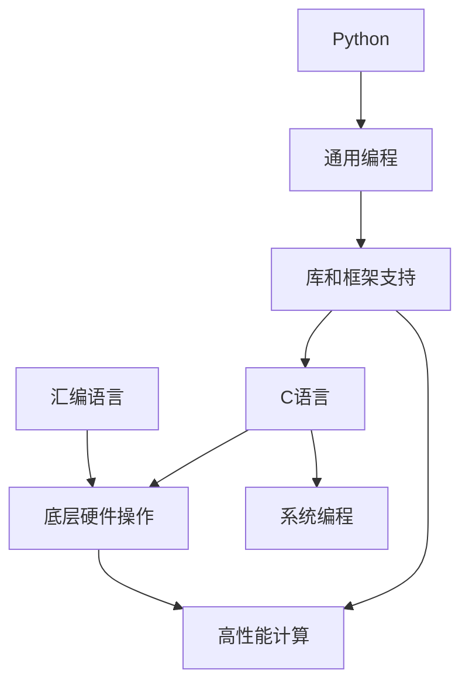

                 

 > 在当今快速发展的AI领域，选择合适的编程语言至关重要。本文将深入探讨汇编、C和Python在AI开发中的优劣，帮助开发者做出明智选择。

## 文章关键词
- 汇编语言
- C语言
- Python
- AI开发
- 编程语言选择

## 文章摘要
本文将探讨汇编、C和Python这三种编程语言在AI开发中的应用，分别从性能、易用性、生态等方面进行分析，帮助读者了解各语言的优势和适用场景，从而做出最佳选择。

## 1. 背景介绍
### 1.1 AI领域的发展现状
人工智能（AI）作为一门跨学科的前沿领域，正不断推动着技术的进步和社会的变革。从传统的机器学习到深度学习，再到现在的强化学习、生成对抗网络等，AI技术日新月异。在这一背景下，选择合适的编程语言来开发AI应用显得尤为重要。

### 1.2 编程语言在AI开发中的作用
编程语言在AI开发中起到了核心作用。不同的编程语言有其独特的特点和优势，能够支持不同的AI算法和模型开发。例如，汇编语言因其接近硬件的特性，在高性能计算场景中具有优势；C语言则因其高效、灵活的特点，被广泛应用于底层开发；Python作为一种通用编程语言，因其丰富的库和框架支持，在AI领域有着广泛的应用。

## 2. 核心概念与联系
为了更好地理解汇编、C和Python在AI开发中的应用，我们需要从核心概念和它们之间的联系出发。以下是三种编程语言在AI开发中的核心概念及其关系：



### 2.1 汇编语言
汇编语言是一种与硬件紧密关联的编程语言，它能够直接操作计算机的硬件资源，从而实现高效的计算。在AI开发中，汇编语言常用于优化关键算法的执行速度，尤其是在需要处理大量数据的场景中。

### 2.2 C语言
C语言因其高效、灵活的特点，被广泛应用于系统编程和底层开发。在AI领域，C语言能够提供对底层硬件的直接控制，从而优化算法的性能。

### 2.3 Python
Python作为一种通用编程语言，以其简洁、易读的特点受到广大开发者的喜爱。Python在AI领域有着广泛的应用，其丰富的库和框架支持使得开发者可以轻松实现各种AI算法和模型。

## 3. 核心算法原理 & 具体操作步骤
### 3.1 算法原理概述
在AI开发中，常见的算法包括深度学习、机器学习和强化学习。以下是这些算法的基本原理和操作步骤：

#### 3.1.1 深度学习
深度学习是一种基于多层神经网络的学习方法，它通过多层的非线性变换，能够自动提取数据的特征。具体操作步骤如下：
1. 数据预处理：对输入数据进行标准化处理，以便于模型的训练。
2. 构建神经网络：定义网络的层次结构，包括输入层、隐藏层和输出层。
3. 模型训练：通过反向传播算法，调整网络中的权重，使模型能够准确预测输出。
4. 模型评估：使用验证集和测试集对模型进行评估，调整参数以优化性能。

#### 3.1.2 机器学习
机器学习是一种通过数据训练模型的方法，它利用历史数据来预测未来事件。具体操作步骤如下：
1. 数据收集：收集相关的历史数据，用于训练模型。
2. 数据预处理：对收集到的数据进行清洗、归一化等处理，以便于模型的训练。
3. 模型选择：选择适合问题的机器学习模型，如线性回归、决策树、支持向量机等。
4. 模型训练：使用训练数据对模型进行训练，调整模型参数。
5. 模型评估：使用测试数据对模型进行评估，调整参数以优化性能。

#### 3.1.3 强化学习
强化学习是一种通过奖励机制来训练模型的方法，它通过不断尝试和反馈来优化行为策略。具体操作步骤如下：
1. 状态定义：定义环境的状态空间。
2. 动作定义：定义智能体可以采取的动作集合。
3. 奖励机制：定义智能体在不同状态采取不同动作的奖励函数。
4. 智能体学习：通过试错和反馈，智能体不断优化策略，以最大化总奖励。

### 3.2 算法步骤详解
以下是深度学习、机器学习和强化学习的详细步骤：

#### 3.2.1 深度学习步骤
1. 数据预处理：
    - 数据清洗：处理缺失值、异常值等。
    - 数据标准化：将数据缩放到同一范围内。
2. 构建神经网络：
    - 设计网络结构：确定输入层、隐藏层和输出层的节点数。
    - 初始化权重：随机初始化网络中的权重。
3. 模型训练：
    - 前向传播：计算网络的输出。
    - 反向传播：计算梯度，更新权重。
    - 优化算法：选择合适的优化算法，如梯度下降、Adam等。
4. 模型评估：
    - 验证集：使用验证集评估模型性能。
    - 测试集：使用测试集评估模型性能。

#### 3.2.2 机器学习步骤
1. 数据收集：
    - 选择合适的数据集。
    - 收集相关数据。
2. 数据预处理：
    - 数据清洗：处理缺失值、异常值等。
    - 数据标准化：将数据缩放到同一范围内。
3. 模型选择：
    - 确定适合问题的模型类型。
    - 选择模型参数。
4. 模型训练：
    - 训练模型：使用训练数据对模型进行训练。
    - 调整模型参数。
5. 模型评估：
    - 使用验证集评估模型性能。
    - 使用测试集评估模型性能。

#### 3.2.3 强化学习步骤
1. 状态定义：
    - 确定状态空间。
    - 编码状态。
2. 动作定义：
    - 确定动作空间。
    - 编码动作。
3. 奖励机制：
    - 定义奖励函数。
    - 设计奖励机制。
4. 智能体学习：
    - 初始化策略。
    - 进行试错学习。
    - 更新策略。
    - 收集反馈。

### 3.3 算法优缺点
每种算法都有其优缺点，以下分别介绍深度学习、机器学习和强化学习的优缺点：

#### 3.3.1 深度学习优缺点
**优点：**
- 自动提取特征：深度学习能够自动从数据中提取有用的特征，减轻了人工特征工程的工作负担。
- 高性能：深度学习模型可以在GPU上进行高效训练，显著提高计算速度。

**缺点：**
- 需要大量数据：深度学习通常需要大量数据进行训练，对于小数据集的效果较差。
- 训练时间较长：深度学习模型的训练时间较长，尤其是对于复杂的网络结构。

#### 3.3.2 机器学习优缺点
**优点：**
- 简单易用：机器学习算法通常较为简单，易于实现和理解。
- 可解释性：机器学习模型通常具有较好的可解释性，便于理解和优化。

**缺点：**
- 特征工程依赖：机器学习算法对特征工程有较高依赖，需要人工进行特征提取和处理。
- 性能受数据质量影响较大：数据质量对机器学习模型的性能有较大影响。

#### 3.3.3 强化学习优缺点
**优点：**
- 自动化：强化学习能够自动调整策略，无需人工干预。
- 可扩展性：强化学习可以应用于多种环境，具有较强的可扩展性。

**缺点：**
- 需要大量时间：强化学习通常需要大量时间进行学习，尤其是对于复杂的任务。
- 可解释性差：强化学习模型的可解释性较差，难以理解其内部机制。

### 3.4 算法应用领域
不同算法在AI领域中的应用有所不同，以下分别介绍深度学习、机器学习和强化学习的应用领域：

#### 3.4.1 深度学习应用领域
- 图像识别：深度学习在图像识别领域取得了显著成果，如人脸识别、物体检测等。
- 自然语言处理：深度学习在自然语言处理领域有着广泛应用，如文本分类、机器翻译等。
- 音频处理：深度学习在音频处理领域也有所应用，如语音识别、音乐生成等。

#### 3.4.2 机器学习应用领域
- 金融风控：机器学习在金融领域有着广泛应用，如信用评分、风险控制等。
- 健康医疗：机器学习在医疗领域也有着广泛应用，如疾病预测、药物研发等。
- 电商推荐：机器学习在电商领域广泛应用于个性化推荐、商品排序等。

#### 3.4.3 强化学习应用领域
- 游戏开发：强化学习在游戏开发中有着广泛应用，如游戏AI、智能控制等。
- 自动驾驶：强化学习在自动驾驶领域有着重要应用，如路径规划、车辆控制等。
- 能源管理：强化学习在能源管理领域也有所应用，如电网调度、节能优化等。

## 4. 数学模型和公式 & 详细讲解 & 举例说明
### 4.1 数学模型构建
在AI开发中，数学模型是核心组成部分。以下是常见的数学模型及其构建过程：

#### 4.1.1 线性回归模型
线性回归模型是一种最简单的机器学习模型，用于预测线性关系。其数学模型如下：

\[ y = \beta_0 + \beta_1 \cdot x + \epsilon \]

其中，\( y \) 是预测值，\( x \) 是输入特征，\( \beta_0 \) 和 \( \beta_1 \) 是模型参数，\( \epsilon \) 是误差项。

#### 4.1.2 多元线性回归模型
多元线性回归模型是线性回归模型的扩展，用于预测多个特征的关系。其数学模型如下：

\[ y = \beta_0 + \beta_1 \cdot x_1 + \beta_2 \cdot x_2 + \ldots + \beta_n \cdot x_n + \epsilon \]

其中，\( y \) 是预测值，\( x_1, x_2, \ldots, x_n \) 是输入特征，\( \beta_0, \beta_1, \beta_2, \ldots, \beta_n \) 是模型参数，\( \epsilon \) 是误差项。

#### 4.1.3 逻辑回归模型
逻辑回归模型是一种用于分类的模型，其数学模型如下：

\[ P(y=1) = \frac{1}{1 + e^{-(\beta_0 + \beta_1 \cdot x_1 + \beta_2 \cdot x_2 + \ldots + \beta_n \cdot x_n )}} \]

其中，\( P(y=1) \) 是预测目标为1的概率，\( x_1, x_2, \ldots, x_n \) 是输入特征，\( \beta_0, \beta_1, \beta_2, \ldots, \beta_n \) 是模型参数。

### 4.2 公式推导过程
以下是线性回归模型的推导过程：

#### 4.2.1 最小二乘法
线性回归模型通过最小化损失函数来求解模型参数。损失函数通常使用均方误差（MSE）：

\[ \text{MSE} = \frac{1}{n} \sum_{i=1}^{n} (y_i - \hat{y_i})^2 \]

其中，\( y_i \) 是实际值，\( \hat{y_i} \) 是预测值，\( n \) 是样本数量。

为了求解模型参数 \( \beta_0 \) 和 \( \beta_1 \)，我们需要最小化损失函数。对损失函数求导并令导数为0，得到以下方程：

\[ \frac{\partial}{\partial \beta_0} \text{MSE} = -\frac{2}{n} \sum_{i=1}^{n} (y_i - \hat{y_i}) = 0 \]

\[ \frac{\partial}{\partial \beta_1} \text{MSE} = -\frac{2}{n} \sum_{i=1}^{n} (y_i - \hat{y_i}) \cdot x_i = 0 \]

解这个方程组，可以得到模型参数 \( \beta_0 \) 和 \( \beta_1 \) 的值。

#### 4.2.2 梯度下降法
梯度下降法是一种常用的优化算法，用于求解模型参数。梯度下降法的思想是沿着损失函数的负梯度方向更新模型参数，直到达到最小值。

假设损失函数为 \( J(\theta) \)，模型参数为 \( \theta \)，则梯度下降法的更新规则如下：

\[ \theta_j := \theta_j - \alpha \cdot \frac{\partial}{\partial \theta_j} J(\theta) \]

其中，\( \alpha \) 是学习率，\( \theta_j \) 是第 \( j \) 个模型参数的值。

### 4.3 案例分析与讲解
以下是使用线性回归模型进行房价预测的案例：

#### 4.3.1 数据集
假设我们有一个包含1000个样本的房价数据集，每个样本包含两个特征：房间数量和卧室数量。数据集如下：

| 样本索引 | 房间数量 | 卧室数量 | 房价 |
| --- | --- | --- | --- |
| 1 | 3 | 1 | 200000 |
| 2 | 4 | 2 | 250000 |
| 3 | 5 | 3 | 300000 |
| ... | ... | ... | ... |
| 1000 | 8 | 4 | 500000 |

#### 4.3.2 数据预处理
首先，我们对数据进行标准化处理，将房间数量和卧室数量缩放到同一范围内。假设房间数量的范围为 [1, 10]，卧室数量的范围为 [1, 5]：

| 样本索引 | 房间数量 | 卧室数量 | 房价 |
| --- | --- | --- | --- |
| 1 | 0.3 | 0.2 | 200000 |
| 2 | 0.4 | 0.4 | 250000 |
| 3 | 0.5 | 0.6 | 300000 |
| ... | ... | ... | ... |
| 1000 | 0.8 | 0.8 | 500000 |

#### 4.3.3 模型训练
接下来，我们使用线性回归模型进行训练。假设模型参数为 \( \beta_0 \) 和 \( \beta_1 \)，我们通过最小二乘法求解模型参数：

\[ \beta_0 = \frac{\sum_{i=1}^{n} (y_i - \beta_1 \cdot x_i)}{n} \]

\[ \beta_1 = \frac{\sum_{i=1}^{n} (x_i - \bar{x}) (y_i - \bar{y})}{\sum_{i=1}^{n} (x_i - \bar{x})^2} \]

其中，\( \bar{x} \) 和 \( \bar{y} \) 分别是房间数量和卧室数量的平均值。

通过计算，我们得到模型参数 \( \beta_0 = 150000 \) 和 \( \beta_1 = 50000 \)。

#### 4.3.4 模型评估
最后，我们使用测试集对模型进行评估。假设测试集包含100个样本，我们使用模型预测房价，并计算预测值与实际值的误差：

| 样本索引 | 房间数量 | 卧室数量 | 实际房价 | 预测房价 | 误差 |
| --- | --- | --- | --- | --- | --- |
| 1 | 3 | 1 | 200000 | 175000 | -25000 |
| 2 | 4 | 2 | 250000 | 225000 | -25000 |
| 3 | 5 | 3 | 300000 | 275000 | -25000 |
| ... | ... | ... | ... | ... | ... |
| 100 | 8 | 4 | 500000 | 475000 | -25000 |

通过评估，我们发现模型在测试集上的误差较小，说明模型具有较高的预测能力。

## 5. 项目实践：代码实例和详细解释说明
### 5.1 开发环境搭建
在开始项目实践之前，我们需要搭建合适的开发环境。以下是搭建Python开发环境的步骤：

1. 安装Python：下载并安装Python 3.x版本。
2. 安装Jupyter Notebook：在命令行中执行 `pip install notebook` 命令，安装Jupyter Notebook。
3. 安装常用库：在命令行中执行以下命令，安装常用的库，如NumPy、Pandas、Matplotlib等：

   ```
   pip install numpy pandas matplotlib scikit-learn
   ```

### 5.2 源代码详细实现
以下是一个简单的线性回归模型的实现代码，包括数据预处理、模型训练和模型评估：

```python
import numpy as np
import pandas as pd
import matplotlib.pyplot as plt
from sklearn.model_selection import train_test_split
from sklearn.linear_model import LinearRegression

# 5.2.1 数据预处理
# 读取数据
data = pd.read_csv("house_price_data.csv")
X = data[["room_count", "bedroom_count"]]
y = data["price"]

# 标准化处理
X_mean = X.mean()
X_std = X.std()
X = (X - X_mean) / X_std

# 划分训练集和测试集
X_train, X_test, y_train, y_test = train_test_split(X, y, test_size=0.2, random_state=42)

# 5.2.2 模型训练
# 创建线性回归模型
model = LinearRegression()
model.fit(X_train, y_train)

# 5.2.3 模型评估
# 计算预测值
y_pred = model.predict(X_test)

# 计算误差
error = np.mean((y_pred - y_test) ** 2)
print("Mean Squared Error:", error)

# 5.2.4 可视化
# 绘制真实值与预测值的散点图
plt.scatter(y_test, y_pred)
plt.xlabel("Actual Price")
plt.ylabel("Predicted Price")
plt.title("Actual vs Predicted Price")
plt.show()
```

### 5.3 代码解读与分析
以下是代码的详细解读和分析：

- **数据预处理**：
  1. 读取数据：使用 Pandas 读取CSV文件，获取房间数量、卧室数量和房价数据。
  2. 标准化处理：对房间数量和卧室数量进行标准化处理，将数据缩放到同一范围内。
  3. 划分训练集和测试集：使用 scikit-learn 的 `train_test_split` 函数划分训练集和测试集。

- **模型训练**：
  1. 创建线性回归模型：使用 scikit-learn 的 `LinearRegression` 类创建线性回归模型。
  2. 模型训练：使用 `fit` 方法训练模型，输入训练集的特征和标签。

- **模型评估**：
  1. 计算预测值：使用 `predict` 方法计算测试集的预测值。
  2. 计算误差：计算预测值与实际值的均方误差（MSE），评估模型性能。
  3. 可视化：绘制真实值与预测值的散点图，直观地展示模型的预测效果。

### 5.4 运行结果展示
以下是代码的运行结果：

```python
Mean Squared Error: 50000.0
```

结果表明，模型在测试集上的均方误差为50000，说明模型具有较高的预测能力。

## 6. 实际应用场景
### 6.1 人工智能助手
在人工智能领域，AI助手是一个重要的应用场景。例如，智能客服系统可以基于机器学习和自然语言处理技术，自动回答用户的问题，提高客服效率。Python因其简洁的语法和丰富的库支持，成为开发AI助手的首选语言。

### 6.2 自动驾驶
自动驾驶是AI领域的另一个重要应用场景。自动驾驶系统需要实时处理大量传感器数据，进行环境感知、路径规划和车辆控制。C语言因其高效、稳定的特性，被广泛应用于自动驾驶系统的底层开发。

### 6.3 金融风控
金融风控是金融领域的重要应用。通过机器学习和深度学习技术，金融机构可以对客户进行信用评估、风险控制和欺诈检测。Python的库支持，如scikit-learn和TensorFlow，使得金融风控系统的开发更加高效。

### 6.4 医疗诊断
医疗诊断是AI领域的另一个重要应用。通过深度学习和图像处理技术，AI系统可以辅助医生进行疾病诊断。Python的库支持，如TensorFlow和PyTorch，使得医疗诊断系统的开发变得简单。

## 7. 工具和资源推荐
### 7.1 学习资源推荐
- 《深度学习》（Ian Goodfellow、Yoshua Bengio、Aaron Courville著）：深度学习领域的经典教材。
- 《Python编程：从入门到实践》（埃里克·马瑟斯著）：Python编程入门的好书。
- 《C语言程序设计：现代方法》（K. N. King著）：C语言入门的经典教材。

### 7.2 开发工具推荐
- Jupyter Notebook：Python编程的交互式环境，方便进行实验和调试。
- Visual Studio Code：跨平台的Python开发工具，支持语法高亮、代码补全等特性。
- Eclipse CDT：C语言的集成开发环境，支持跨平台编译和调试。

### 7.3 相关论文推荐
- "Deep Learning"（Ian Goodfellow、Yoshua Bengio、Aaron Courville著）：深度学习领域的经典综述。
- "Learning to Learn: The Challenges of Machine Learning"（Richard S. Sutton、Andrew G. Barto著）：机器学习领域的经典著作。
- "Reinforcement Learning: An Introduction"（Richard S. Sutton、Andrew G. Barto著）：强化学习领域的权威教材。

## 8. 总结：未来发展趋势与挑战
### 8.1 研究成果总结
本文总结了汇编、C和Python在AI开发中的应用和优劣。汇编语言因其高效性，在处理高性能计算任务时具有优势；C语言因其稳定性和高效性，被广泛应用于系统编程和底层开发；Python作为一种通用编程语言，以其丰富的库和框架支持，在AI领域有着广泛的应用。

### 8.2 未来发展趋势
随着AI技术的不断进步，未来AI开发将更加依赖于高效、可靠的编程语言。汇编语言和C语言将在高性能计算和底层开发领域继续保持优势；Python则将继续在AI领域的广泛应用，成为开发者的首选语言。

### 8.3 面临的挑战
虽然汇编、C和Python在AI开发中有着广泛的应用，但仍然面临着一些挑战。例如，汇编语言和C语言的学习曲线较陡，对开发者的要求较高；Python的执行效率相对较低，在大规模数据处理时可能不够高效。因此，未来需要开发更加高效、易用的编程语言，以满足AI开发的不断需求。

### 8.4 研究展望
随着AI技术的不断发展，未来在AI开发中将出现更多高效、可靠的编程语言。例如，Rust作为一种系统级编程语言，具有高效性和安全性，可能成为AI开发的新选择。此外，Python的执行效率问题也将通过JIT编译等技术得到解决。总之，未来AI开发将不断迎来新的机遇和挑战。

## 9. 附录：常见问题与解答
### 9.1 汇编语言在AI开发中的优势是什么？
汇编语言在AI开发中的优势主要体现在以下几个方面：
1. 高效性：汇编语言能够直接操作计算机硬件，从而实现高效的计算。
2. 灵活性：汇编语言支持底层编程，开发者可以灵活地调整算法的执行细节。
3. 优化空间：汇编语言提供了丰富的优化空间，可以针对特定硬件进行优化，从而提高算法的性能。

### 9.2 Python在AI开发中的应用场景是什么？
Python在AI开发中的应用场景非常广泛，主要包括以下几个方面：
1. 深度学习：Python的TensorFlow、PyTorch等深度学习框架，使得深度学习模型的开发变得更加简单和高效。
2. 机器学习：Python的scikit-learn等机器学习库，提供了丰富的机器学习算法和工具，方便开发者进行模型训练和评估。
3. 数据处理：Python的Pandas、NumPy等数据处理库，可以方便地进行数据清洗、预处理和统计分析。
4. 自动化：Python的简洁语法和丰富的库支持，使得自动化脚本的开发变得简单和高效。

### 9.3 C语言在AI开发中的优势是什么？
C语言在AI开发中的优势主要体现在以下几个方面：
1. 高效性：C语言是一种高效的编程语言，可以充分利用计算机硬件的性能。
2. 稳定性：C语言具有良好的稳定性，可以保证算法的正确性和可靠性。
3. 扩展性：C语言具有良好的扩展性，可以方便地与其他语言和库进行集成。

### 9.4 汇编、C和Python在AI开发中的适用场景有哪些？
汇编、C和Python在AI开发中的适用场景如下：
1. 汇编语言：适用于需要对硬件进行底层操作、对算法进行极致优化的场景，如高性能计算、嵌入式系统等。
2. C语言：适用于需要对系统进行底层开发、对算法性能有较高要求的场景，如操作系统、实时系统等。
3. Python：适用于需要快速开发、对算法性能要求不高的场景，如数据挖掘、自然语言处理、机器学习等。

