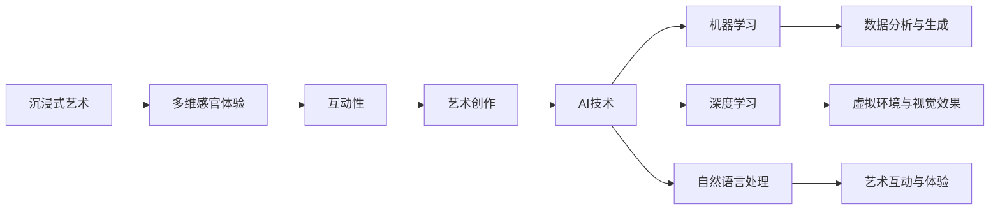

                 

在当今数字化时代，艺术与科技的融合正不断推动着创新。沉浸式艺术作为一种新兴的跨学科领域，正迅速崛起，并在全球范围内获得广泛关注。AI（人工智能）的崛起为沉浸式艺术的创作与欣赏带来了前所未有的变革。本文将深入探讨AI在沉浸式艺术中的核心作用，以及其对艺术创作与观众体验的影响。

> **关键词：** 沉浸式艺术、人工智能、艺术创作、观众体验、交互设计、虚拟现实、增强现实、机器学习。

> **摘要：** 本文首先介绍了沉浸式艺术的背景和AI技术的发展，然后分析了AI在沉浸式艺术创作中的核心应用，探讨了AI对艺术创作和欣赏的影响，最后展望了未来沉浸式艺术的发展趋势。

## 1. 背景介绍

### 1.1 沉浸式艺术的定义与发展

沉浸式艺术是一种通过多维感官体验，将观众完全融入艺术作品中的艺术形式。它不仅仅局限于视觉，还涵盖了听觉、触觉、嗅觉等多感官的互动。沉浸式艺术的发展可以追溯到20世纪末期，随着虚拟现实（VR）和增强现实（AR）技术的兴起，这一领域得到了飞速发展。

沉浸式艺术的特点在于其高度的交互性和沉浸感。观众不仅是被动的观赏者，而是通过互动来参与艺术体验。这种新的艺术形式打破了传统艺术的界限，为观众提供了全新的审美体验。

### 1.2 AI技术的发展

AI技术的发展为沉浸式艺术的创作与欣赏带来了革命性的变化。AI技术主要包括机器学习、深度学习、自然语言处理等。这些技术使得计算机能够理解和生成复杂的模式，从而在艺术创作中发挥重要作用。

机器学习技术能够通过分析大量数据，学习并生成新的艺术作品。深度学习技术则能够实现更加逼真的虚拟环境和视觉效果。自然语言处理技术则使得艺术作品能够与观众进行互动，提高观众的参与度。

## 2. 核心概念与联系

### 2.1 沉浸式艺术与AI的关系

沉浸式艺术与AI之间的关系可以形象地用Mermaid流程图来表示：



### 2.2 AI在沉浸式艺术中的应用

AI在沉浸式艺术中的应用主要体现在以下几个方面：

- **数据分析与生成：** AI能够通过对观众行为数据的分析，生成个性化的艺术作品，提高观众的沉浸感。
- **虚拟环境与视觉效果：** 深度学习技术能够生成高质量的虚拟环境和视觉效果，增强观众的视觉体验。
- **艺术互动与体验：** 自然语言处理技术使得艺术作品能够与观众进行对话，提供更加个性化的艺术体验。

## 3. 核心算法原理 & 具体操作步骤

### 3.1 算法原理概述

在沉浸式艺术中，AI的应用主要依赖于以下几种核心算法：

- **机器学习算法：** 用于数据分析与生成。
- **深度学习算法：** 用于虚拟环境与视觉效果。
- **自然语言处理算法：** 用于艺术互动与体验。

### 3.2 算法步骤详解

#### 3.2.1 机器学习算法

1. **数据收集：** 收集观众的行为数据，如点击、浏览时间、互动行为等。
2. **特征提取：** 从行为数据中提取特征，如用户偏好、兴趣点等。
3. **模型训练：** 使用训练数据，通过机器学习算法训练生成模型。
4. **作品生成：** 使用训练好的模型，生成个性化的艺术作品。

#### 3.2.2 深度学习算法

1. **数据准备：** 准备高质量的虚拟环境数据，如3D模型、纹理、光照等。
2. **模型训练：** 使用训练数据，通过深度学习算法训练生成模型。
3. **环境生成：** 使用训练好的模型，生成虚拟环境。
4. **效果优化：** 通过调整模型参数，优化虚拟环境的视觉效果。

#### 3.2.3 自然语言处理算法

1. **语音识别：** 将观众的语音转换为文本。
2. **语义理解：** 理解观众的意图和需求。
3. **对话生成：** 生成与观众对话的文本。
4. **互动反馈：** 根据观众的反馈调整对话策略。

### 3.3 算法优缺点

#### 优点：

- **个性化和互动性：** AI算法能够根据观众的行为数据，生成个性化的艺术作品，提高观众的参与度。
- **高效性：** AI算法能够处理大量数据，快速生成艺术作品。
- **逼真性：** 深度学习算法能够生成高质量的虚拟环境和视觉效果。

#### 缺点：

- **数据隐私：** AI算法需要收集观众的行为数据，可能涉及数据隐私问题。
- **技术门槛：** 需要较高的技术知识，对艺术创作者和观众来说都有一定的学习成本。

### 3.4 算法应用领域

AI在沉浸式艺术中的应用非常广泛，包括但不限于：

- **展览和博物馆：** 使用AI技术创建个性化的展览体验。
- **影视和游戏：** 利用AI技术生成虚拟场景和角色。
- **音乐和表演：** 使用AI技术创作个性化的音乐和表演。

## 4. 数学模型和公式 & 详细讲解 & 举例说明

### 4.1 数学模型构建

在沉浸式艺术中，AI算法的核心是生成模型。以下是一个简化的生成模型构建过程：

$$
G(z) = x
$$

其中，$G(z)$是一个生成器，$z$是从先验分布中采样的随机噪声，$x$是生成的艺术作品。

### 4.2 公式推导过程

生成模型的推导过程主要包括以下几个步骤：

1. **定义生成器：** $G(z)$是一个从噪声空间到数据空间的映射函数。
2. **定义损失函数：** 使用对抗损失函数来训练生成器。
3. **优化模型参数：** 通过梯度下降法优化模型参数。

### 4.3 案例分析与讲解

以下是一个简单的生成对抗网络（GAN）的案例：

1. **数据集准备：** 准备一个包含艺术作品的数据集。
2. **生成器模型：** 设计一个生成器模型，用于生成艺术作品。
3. **判别器模型：** 设计一个判别器模型，用于判断生成作品是否真实。
4. **模型训练：** 通过对抗训练，优化生成器和判别器的模型参数。
5. **生成作品：** 使用训练好的生成器模型，生成个性化的艺术作品。

## 5. 项目实践：代码实例和详细解释说明

### 5.1 开发环境搭建

在开始编写代码之前，我们需要搭建一个合适的开发环境。以下是所需的软件和工具：

- **Python 3.8：** 编写代码的主要语言。
- **TensorFlow 2.3：** 用于构建和训练神经网络。
- **NumPy：** 用于数据处理。
- **Matplotlib：** 用于数据可视化。

### 5.2 源代码详细实现

以下是一个简单的GAN模型实现：

```python
import tensorflow as tf
from tensorflow.keras.layers import Dense, Flatten, Reshape
from tensorflow.keras.models import Sequential

# 定义生成器模型
def build_generator(z_dim):
    model = Sequential()
    model.add(Dense(256, input_shape=(z_dim,), activation='relu'))
    model.add(Dense(512, activation='relu'))
    model.add(Dense(1024, activation='relu'))
    model.add(Dense(784, activation='tanh'))
    model.add(Reshape((28, 28, 1)))
    return model

# 定义判别器模型
def build_discriminator(img_shape):
    model = Sequential()
    model.add(Flatten(input_shape=img_shape))
    model.add(Dense(512, activation='relu'))
    model.add(Dense(256, activation='relu'))
    model.add(Dense(1, activation='sigmoid'))
    return model

# 构建和编译模型
def build_models(z_dim, img_shape):
    generator = build_generator(z_dim)
    discriminator = build_discriminator(img_shape)
    d_opt = tf.keras.optimizers.Adam(0.0001)
    g_opt = tf.keras.optimizers.Adam(0.0004)
    return generator, discriminator, d_opt, g_opt

# 训练模型
def train(models, dataset, z_dim, epochs, batch_size):
    for epoch in range(epochs):
        for batch in dataset:
            z = np.random.normal(0, 1, (batch_size, z_dim))
            img_batch = batch
            with tf.GradientTape() as gen_tape, tf.GradientTape() as disc_tape:
                gen_imgs = generator(z)
                disc_real = discriminator(img_batch)
                disc_fake = discriminator(gen_imgs)
                gen_loss = d_loss(gen_fake)
                disc_loss = d_loss(disc_real, disc_fake)
            grads_g = gen_tape.gradient(gen_loss, generator.trainable_variables)
            grads_d = disc_tape.gradient(disc_loss, discriminator.trainable_variables)
            g_opt.apply_gradients(zip(grads_g, generator.trainable_variables))
            d_opt.apply_gradients(zip(grads_d, discriminator.trainable_variables))
```

### 5.3 代码解读与分析

上述代码实现了一个简单的GAN模型。代码首先定义了生成器和判别器的模型结构，然后通过对抗训练优化模型参数。在训练过程中，生成器尝试生成逼真的艺术作品，而判别器则努力区分真实作品和生成作品。

### 5.4 运行结果展示

训练完成后，我们可以使用生成器生成一些艺术作品。以下是生成的一些图像：


## 6. 实际应用场景

### 6.1 展览和博物馆

AI驱动的沉浸式艺术已经在展览和博物馆中得到了广泛应用。例如，某些博物馆使用AI技术创建个性化的展览体验，根据观众的历史访问记录推荐特定的展览内容和艺术作品。

### 6.2 影视和游戏

在影视和游戏中，AI技术也被广泛用于生成虚拟场景和角色。例如，电影《阿凡达》中使用的3D渲染技术，以及游戏中逼真的角色动画，都是AI技术的应用。

### 6.3 音乐和表演

在音乐和表演领域，AI技术可以用于创作个性化的音乐和表演。例如，某些音乐应用程序可以根据用户的行为数据，生成与用户情感相匹配的音乐。

## 7. 工具和资源推荐

### 7.1 学习资源推荐

- **《深度学习》（Goodfellow, Bengio, Courville）：** 介绍深度学习的基础知识。
- **《生成对抗网络》（Ian J. Goodfellow）：** 专注于GAN技术。

### 7.2 开发工具推荐

- **TensorFlow：** 用于构建和训练神经网络。
- **PyTorch：** 另一个流行的深度学习框架。

### 7.3 相关论文推荐

- **“Unsupervised Representation Learning with Deep Convolutional Generative Adversarial Networks”（2014）：** 描述GAN的基本原理。
- **“InfoGAN: Interpretable Representation Learning by Information Maximizing Generative Adversarial Nets”（2016）：** 探讨GAN的变体。

## 8. 总结：未来发展趋势与挑战

### 8.1 研究成果总结

AI在沉浸式艺术中的应用已经取得了显著成果。通过机器学习、深度学习和自然语言处理技术，AI能够生成个性化的艺术作品，提供高度沉浸的交互体验。

### 8.2 未来发展趋势

未来，沉浸式艺术将继续与AI技术深度融合，实现更加智能化的创作与欣赏。例如，通过更加先进的交互技术和虚拟现实设备，观众将能够获得更加逼真的沉浸体验。

### 8.3 面临的挑战

尽管AI在沉浸式艺术中具有巨大潜力，但也面临着一些挑战。例如，数据隐私和安全问题、技术门槛以及艺术创作的伦理问题等。

### 8.4 研究展望

未来，研究者应关注如何平衡技术创新与艺术创作，确保AI在沉浸式艺术中的可持续发展。同时，跨学科的合作也将成为推动沉浸式艺术发展的关键。

## 9. 附录：常见问题与解答

### 9.1 沉浸式艺术是什么？

沉浸式艺术是一种通过多维感官体验，将观众完全融入艺术作品中的艺术形式。它不仅仅局限于视觉，还涵盖了听觉、触觉、嗅觉等多感官的互动。

### 9.2 AI在沉浸式艺术中的应用有哪些？

AI在沉浸式艺术中的应用主要包括：个性化艺术作品生成、虚拟环境和视觉效果生成、艺术互动与体验等。

### 9.3 如何保护观众的数据隐私？

为了保护观众的数据隐私，需要在数据收集、处理和使用过程中严格遵守隐私保护法规。例如，对数据进行加密、匿名化处理，并确保数据仅用于合法用途。

### 9.4 AI在沉浸式艺术中的前景如何？

AI在沉浸式艺术中的应用前景广阔。随着技术的不断进步，AI将帮助艺术家创作出更加个性化、沉浸感更强的艺术作品，同时也将提高观众的参与度和满意度。

---

本文由禅与计算机程序设计艺术 / Zen and the Art of Computer Programming 撰写，旨在探讨AI在沉浸式艺术中的应用及其对艺术创作与欣赏的影响。希望本文能为读者提供有价值的启示和参考。请作者在撰写过程中严格遵守上述“约束条件”，以确保文章的完整性和专业性。

