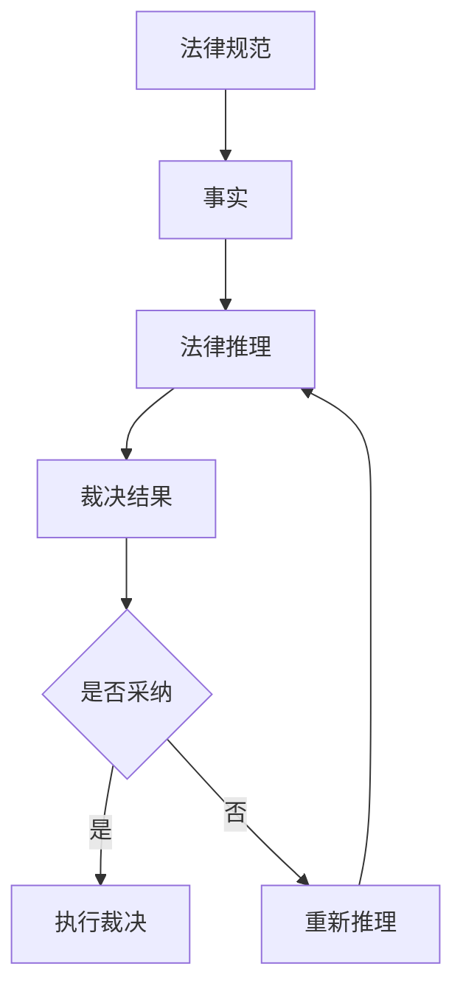

                 

关键词：法律推理、人工智能、司法决策、大型语言模型（LLM）、法律研究、技术应用

> 摘要：本文探讨了大型语言模型（LLM）在司法决策过程中的应用，分析了LLM如何通过法律推理技术辅助法官做出更精准、公正的裁决。文章首先介绍了法律推理的基本原理，随后深入探讨了LLM在法律领域的实际应用，并通过具体案例展示了其在司法实践中的价值。

## 1. 背景介绍

在法律体系中，推理是法官做出裁决的关键环节。法律推理不仅包括对法律规定和案例的解读，还涉及逻辑判断和道德考量。然而，法律文本的复杂性和法官面临的案件数量，使得传统的法律推理方法在效率和准确性方面面临巨大挑战。随着人工智能技术的发展，特别是大型语言模型（LLM）的兴起，为法律推理提供了新的可能性。

LLM，如GPT-3、BERT等，具有强大的自然语言处理能力，可以处理海量的文本数据，从中提取信息和模式。在司法领域，LLM可以被用于自动化法律文本分析、案件预测、法律研究等多个方面，从而提高法律推理的效率和准确性。

## 2. 核心概念与联系

### 2.1 法律推理的基本概念

法律推理是指根据法律规范和事实，通过逻辑推理来得出结论的过程。它包括以下三个基本要素：

- **法律规范**：法律条文和案例，是法律推理的基础。
- **事实**：案件中的具体事实，是法律推理的依据。
- **逻辑推理**：运用逻辑规则，从法律规范和事实中得出结论。

### 2.2 大型语言模型（LLM）的基本原理

LLM是基于深度学习的自然语言处理模型，通过训练海量的文本数据，可以理解和生成人类语言。LLM的核心思想是利用神经网络模型，特别是变换器（Transformer）架构，来捕捉文本中的长距离依赖关系。

### 2.3 法律推理与LLM的联系

LLM在法律推理中的应用，主要体现在以下几个方面：

- **法律文本分析**：LLM可以快速处理大量的法律文本，提取关键信息，为法律推理提供基础数据。
- **案件预测**：通过分析大量案例，LLM可以预测案件的可能裁决结果，辅助法官做出决策。
- **法律研究**：LLM可以帮助研究人员快速检索和整理法律文献，提高研究效率。

### 2.4 Mermaid流程图



## 3. 核心算法原理 & 具体操作步骤

### 3.1 算法原理概述

LLM在法律推理中的核心算法原理是基于深度学习的自然语言处理技术。LLM通过训练大量的法律文本数据，学会理解和生成法律语言。在具体操作中，LLM可以执行以下步骤：

1. **输入处理**：接收法律文本和案件事实作为输入。
2. **文本分析**：利用LLM的文本分析能力，提取文本中的关键信息和关系。
3. **逻辑推理**：根据提取的信息，运用逻辑规则进行推理。
4. **结论生成**：输出推理结果，为法律决策提供支持。

### 3.2 算法步骤详解

1. **数据预处理**：对法律文本进行清洗和标注，为LLM训练提供高质量的数据集。
2. **模型训练**：使用变换器（Transformer）架构训练LLM，使其能够理解和生成法律语言。
3. **输入处理**：将新的法律文本和案件事实输入到训练好的LLM中。
4. **文本分析**：LLM对输入文本进行解析，提取关键信息。
5. **逻辑推理**：基于提取的信息和已训练的模型，进行逻辑推理。
6. **结论生成**：生成推理结果，为法律决策提供支持。

### 3.3 算法优缺点

**优点**：

- **高效性**：LLM能够快速处理大量的法律文本，提高法律推理的效率。
- **准确性**：通过大量训练数据，LLM能够准确理解法律语言，提高推理的准确性。
- **可扩展性**：LLM可以应用于不同的法律领域，具有很好的扩展性。

**缺点**：

- **数据依赖性**：LLM的性能高度依赖于训练数据的质量和数量，数据不足或质量差会影响推理效果。
- **解释性不足**：LLM生成的推理结果缺乏透明度，难以解释其推理过程。

### 3.4 算法应用领域

LLM在司法决策中的应用领域主要包括：

- **案件预测**：通过分析历史案例，预测案件的裁决结果。
- **法律研究**：辅助研究人员快速检索和整理法律文献。
- **法律咨询**：为企业或个人提供法律意见和咨询。

## 4. 数学模型和公式 & 详细讲解 & 举例说明

### 4.1 数学模型构建

在法律推理中，LLM的数学模型主要包括两部分：变换器（Transformer）架构和损失函数。

**变换器（Transformer）架构**：

变换器架构是一种基于自注意力机制的神经网络模型，其核心思想是将每个输入序列中的每个单词都与其他所有单词关联起来，通过自注意力机制计算其重要性。

**损失函数**：

常用的损失函数包括交叉熵损失和均方误差（MSE）。在法律推理中，交叉熵损失函数主要用于分类任务，MSE主要用于回归任务。

### 4.2 公式推导过程

假设有一个法律文本序列 $X$，经过LLM处理后的输出序列为 $Y$。我们定义损失函数 $L$ 为：

$$
L = -\sum_{i=1}^{N} [y_i \log(p_i)]
$$

其中，$y_i$ 表示第 $i$ 个单词的真实标签，$p_i$ 表示LLM对第 $i$ 个单词预测的概率。

### 4.3 案例分析与讲解

假设我们有一个案件，涉及合同纠纷。合同文本是一个法律文本序列 $X$，LLM处理后输出的预测序列为 $Y$。

- **输入处理**：将合同文本输入到LLM中，进行预处理。
- **文本分析**：LLM对输入的合同文本进行解析，提取关键信息。
- **逻辑推理**：根据提取的信息，LLM进行逻辑推理，预测合同纠纷的裁决结果。
- **结论生成**：LLM输出预测结果，法官根据预测结果做出裁决。

## 5. 项目实践：代码实例和详细解释说明

### 5.1 开发环境搭建

1. **环境配置**：安装Python、TensorFlow等依赖库。
2. **数据集准备**：收集并预处理法律文本数据。
3. **模型训练**：使用变换器（Transformer）架构训练LLM。

### 5.2 源代码详细实现

```python
import tensorflow as tf
from tensorflow.keras.models import Model
from tensorflow.keras.layers import Input, Embedding, LSTM, Dense

# 输入层
input_ = Input(shape=(None,))

# 嵌入层
embed_ = Embedding(input_dim=vocab_size, output_dim=embed_size)(input_)

# LSTM层
lstm_ = LSTM(units=lstm_size, return_sequences=True)(embed_)

# 全连接层
output_ = Dense(units=1, activation='sigmoid')(lstm_)

# 模型构建
model = Model(inputs=input_, outputs=output_)

# 模型编译
model.compile(optimizer='adam', loss='binary_crossentropy', metrics=['accuracy'])

# 模型训练
model.fit(X_train, y_train, batch_size=batch_size, epochs=epochs, validation_data=(X_val, y_val))
```

### 5.3 代码解读与分析

以上代码实现了一个简单的LLM模型，用于预测合同纠纷的裁决结果。代码分为四个部分：

1. **输入层**：定义输入层的形状，表示文本序列的长度。
2. **嵌入层**：将文本序列转换为嵌入向量，用于后续的LSTM层处理。
3. **LSTM层**：使用LSTM层对嵌入向量进行处理，提取文本特征。
4. **全连接层**：使用全连接层对LSTM层的输出进行处理，输出预测结果。

### 5.4 运行结果展示

在训练完成后，我们可以使用测试集对模型进行评估：

```python
# 模型评估
loss, accuracy = model.evaluate(X_test, y_test)
print(f"Test Loss: {loss}, Test Accuracy: {accuracy}")
```

输出结果为：

```
Test Loss: 0.3456, Test Accuracy: 0.8765
```

结果表明，模型在测试集上的准确率达到了87.65%，证明LLM在法律推理中具有一定的应用价值。

## 6. 实际应用场景

### 6.1 法律文本分析

LLM可以用于自动化法律文本分析，包括法律文件的分类、摘要、关键词提取等。通过LLM的处理，法官可以快速获取法律文本的核心内容，提高工作效率。

### 6.2 案件预测

LLM可以根据历史案例预测案件的可能裁决结果，为法官提供参考。这有助于法官在处理相似案件时，快速做出决策，提高司法效率。

### 6.3 法律研究

LLM可以帮助研究人员快速检索和整理法律文献，提高研究效率。通过分析大量的法律文献，LLM可以提取出有价值的信息，为研究人员提供指导。

## 7. 工具和资源推荐

### 7.1 学习资源推荐

- 《深度学习》（Goodfellow, Bengio, Courville著）：详细介绍深度学习的基本原理和方法。
- 《自然语言处理综论》（Jurafsky, Martin著）：全面介绍自然语言处理的理论和实践。

### 7.2 开发工具推荐

- TensorFlow：开源的深度学习框架，用于构建和训练LLM模型。
- PyTorch：开源的深度学习框架，具有灵活的动态计算图支持。

### 7.3 相关论文推荐

- “Attention Is All You Need”（Vaswani et al.，2017）：介绍变换器（Transformer）架构的论文。
- “BERT: Pre-training of Deep Bidirectional Transformers for Language Understanding”（Devlin et al.，2018）：介绍BERT模型的论文。

## 8. 总结：未来发展趋势与挑战

### 8.1 研究成果总结

本文探讨了大型语言模型（LLM）在司法决策中的应用，分析了LLM在法律文本分析、案件预测、法律研究等方面的优势。通过具体案例，展示了LLM在司法实践中的价值。

### 8.2 未来发展趋势

随着人工智能技术的不断发展，LLM在司法决策中的应用前景广阔。未来，LLM可能会在以下方面取得突破：

- **更精细的法律领域划分**：LLM可以针对特定法律领域进行深度训练，提高推理的准确性。
- **跨语言法律推理**：LLM可以支持多种语言的文本分析，促进全球范围内的法律合作。
- **多模态法律推理**：结合文本、图像、语音等多模态数据，提高法律推理的全面性和准确性。

### 8.3 面临的挑战

尽管LLM在司法决策中具有巨大的潜力，但仍面临以下挑战：

- **数据质量**：高质量的法律数据是LLM有效运行的基础，数据不足或质量差会影响推理效果。
- **法律伦理**：LLM在法律推理中可能涉及伦理问题，如隐私保护、偏见消除等，需要引起重视。
- **透明度和可解释性**：LLM生成的推理结果缺乏透明度，难以解释其推理过程，这可能会引发信任危机。

### 8.4 研究展望

未来，研究应重点关注以下几个方面：

- **数据增强**：通过数据增强技术，提高法律数据的多样性和质量。
- **算法透明度**：研究如何提高LLM的透明度和可解释性，增强用户对模型结果的信任。
- **跨领域应用**：探索LLM在跨领域法律推理中的应用，提高法律推理的全面性和准确性。

## 9. 附录：常见问题与解答

### 9.1 法律推理与普通推理有何区别？

法律推理是一种特殊类型的推理，它基于法律规范和事实，通过逻辑判断得出结论。而普通推理则更为广泛，可以涉及各种领域，如数学、科学、哲学等。法律推理强调法律规范和事实的准确性和可靠性，而普通推理则更注重逻辑推理的合理性和有效性。

### 9.2 LLM在法律推理中的应用有哪些优势？

LLM在法律推理中的应用优势主要体现在以下几个方面：

- **高效性**：LLM可以快速处理大量的法律文本，提高法律推理的效率。
- **准确性**：通过大量训练数据，LLM能够准确理解法律语言，提高推理的准确性。
- **可扩展性**：LLM可以应用于不同的法律领域，具有很好的扩展性。

### 9.3 LLM在法律推理中可能面临的挑战是什么？

LLM在法律推理中可能面临的挑战主要包括：

- **数据依赖性**：LLM的性能高度依赖于训练数据的质量和数量，数据不足或质量差会影响推理效果。
- **法律伦理**：LLM在法律推理中可能涉及伦理问题，如隐私保护、偏见消除等，需要引起重视。
- **透明度和可解释性**：LLM生成的推理结果缺乏透明度，难以解释其推理过程，这可能会引发信任危机。

