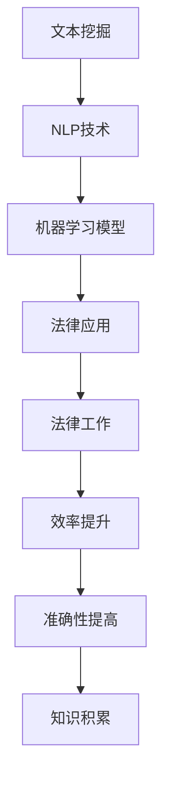

                 

关键词：法律文本分析、人工智能、法律工作、文本挖掘、自然语言处理、机器学习、自动化、法律科技

## 摘要

随着人工智能技术的飞速发展，其在法律领域的应用正逐渐变得广泛和深入。本文将探讨AI在法律文本分析中的潜力，如何通过文本挖掘、自然语言处理和机器学习等技术，辅助律师、法官和法学家进行法律工作。本文将从核心概念、算法原理、数学模型、项目实践、应用场景及未来展望等多个维度，全面剖析AI在法律文本分析中的应用及其价值。

## 1. 背景介绍

### 法律文本分析的需求

在法律实践中，大量的工作涉及到文本处理。从法律文件起草、审查、到案件检索、证据分析和法规研究，都离不开对文本的精细处理。然而，法律文本的复杂性、多样性和专业性，使得传统的人工处理方式效率低下且容易出错。这就催生了法律文本分析技术的需求，希望能够利用人工智能技术提高法律工作的效率和准确性。

### 人工智能在法律领域的应用

人工智能技术在法律领域的应用已经初见端倪。例如，利用自然语言处理（NLP）技术，可以自动生成法律文书，提高律师的工作效率；通过文本挖掘技术，可以从海量的法律案例和法规中提取有价值的信息，为法官和法学家提供决策支持；利用机器学习模型，可以对法律文本进行分类和标注，从而实现自动化的案件管理和证据分析。

### 法律文本分析的重要性

法律文本分析的重要性体现在多个方面。首先，它可以提高法律工作的效率，减少重复劳动，降低成本；其次，它可以帮助法律从业者更好地理解法律文本，提高法律文件的准确性和一致性；最后，它可以促进法律知识的积累和传承，为法律研究提供新的视角和方法。

## 2. 核心概念与联系

### 文本挖掘

文本挖掘（Text Mining）是一种从大量文本数据中提取有价值信息的技术。在法律文本分析中，文本挖掘技术可以用于自动提取法律条款、案例摘要、证据要点等。

### 自然语言处理

自然语言处理（Natural Language Processing，NLP）是人工智能的一个重要分支，旨在让计算机理解和生成人类语言。在法律文本分析中，NLP技术可以用于文本的预处理、情感分析、实体识别、关系抽取等。

### 机器学习

机器学习（Machine Learning，ML）是一种通过数据训练模型，使计算机能够自动进行预测和决策的技术。在法律文本分析中，机器学习可以用于文本分类、文本生成、法律规则发现等。

### AI与法律文本分析的架构

以下是一个简单的AI与法律文本分析的架构，展示了各核心概念之间的联系：



## 3. 核心算法原理 & 具体操作步骤

### 3.1 算法原理概述

在法律文本分析中，常用的核心算法包括NLP技术和机器学习模型。NLP技术用于处理和解析法律文本，例如文本分类、实体识别和关系抽取。机器学习模型则用于基于训练数据进行预测和决策。

### 3.2 算法步骤详解

#### 3.2.1 文本挖掘

1. **数据采集**：从各种来源（如法律数据库、案例库、法规库等）收集大量法律文本。
2. **文本预处理**：对法律文本进行清洗、分词、去停用词等预处理操作。
3. **特征提取**：将预处理后的文本转换为机器学习模型可处理的特征向量。

#### 3.2.2 自然语言处理

1. **文本分类**：利用NLP技术对法律文本进行分类，例如将合同文本分类为“租赁合同”、“劳动合同”等。
2. **实体识别**：识别法律文本中的关键实体，如人名、地名、法律条款等。
3. **关系抽取**：抽取法律文本中实体之间的关系，如“某人与某公司的合同纠纷”。

#### 3.2.3 机器学习模型

1. **模型选择**：选择合适的机器学习模型，如决策树、支持向量机、神经网络等。
2. **模型训练**：使用预处理后的法律文本数据对模型进行训练。
3. **模型评估**：通过交叉验证、精确度、召回率等指标评估模型性能。
4. **模型应用**：将训练好的模型应用于实际的法律文本分析任务。

### 3.3 算法优缺点

#### 优点

1. **高效性**：AI技术可以自动处理大量法律文本，大大提高了工作效率。
2. **准确性**：通过机器学习和深度学习技术，AI可以在一定程度上提高法律文本分析的准确性。
3. **适应性**：AI模型可以根据不同的法律场景和需求进行调整和优化。

#### 缺点

1. **数据依赖性**：AI模型的性能很大程度上依赖于训练数据的质量和数量。
2. **法律风险**：AI在法律文本分析中可能会出现错误，可能导致法律风险。
3. **解释性差**：某些AI模型（如深度神经网络）的黑箱特性使得其结果难以解释，增加了法律应用的风险。

### 3.4 算法应用领域

1. **法律文书生成**：利用AI技术自动生成法律文书，如合同、起诉状等。
2. **案件检索**：通过AI技术快速检索相关法律案例和法规，为法官和律师提供决策支持。
3. **证据分析**：自动分析法律证据，如电子邮件、文档、图片等，为案件提供证据支持。
4. **法律研究**：利用AI技术对大量法律文献进行文本挖掘，发现法律研究趋势和热点。

## 4. 数学模型和公式 & 详细讲解 & 举例说明

### 4.1 数学模型构建

在法律文本分析中，常用的数学模型包括朴素贝叶斯分类器、支持向量机（SVM）、神经网络等。以下以朴素贝叶斯分类器为例，介绍其数学模型构建过程。

#### 朴素贝叶斯分类器

朴素贝叶斯分类器是一种基于贝叶斯定理和特征条件独立假设的分类方法。其基本公式如下：

$$
P(\text{类别} | \text{特征集}) = \frac{P(\text{特征集} | \text{类别})P(\text{类别})}{P(\text{特征集})}
$$

其中，$P(\text{类别} | \text{特征集})$表示在给定特征集的情况下，类别发生的概率；$P(\text{特征集} | \text{类别})$表示在给定类别的情况下，特征集发生的概率；$P(\text{类别})$表示类别发生的概率；$P(\text{特征集})$表示特征集发生的概率。

### 4.2 公式推导过程

以一个简单的二分类问题为例，设有两类类别$C_1$和$C_2$，以及一个特征向量$\textbf{x} = [x_1, x_2, ..., x_n]$。我们需要推导出如何根据特征向量计算类别概率。

首先，根据贝叶斯定理，有：

$$
P(C_1 | \textbf{x}) = \frac{P(\textbf{x} | C_1)P(C_1)}{P(\textbf{x})}
$$

$$
P(C_2 | \textbf{x}) = \frac{P(\textbf{x} | C_2)P(C_2)}{P(\textbf{x})}
$$

其中，$P(\textbf{x} | C_1)$和$P(\textbf{x} | C_2)$分别表示在类别$C_1$和$C_2$发生的情况下，特征向量$\textbf{x}$发生的概率；$P(C_1)$和$P(C_2)$分别表示类别$C_1$和$C_2$发生的概率。

接下来，我们需要根据特征条件独立假设，即假设特征之间相互独立，从而简化概率计算。在这种情况下，有：

$$
P(\textbf{x} | C_1) = P(x_1 | C_1)P(x_2 | C_1) \cdots P(x_n | C_1)
$$

$$
P(\textbf{x} | C_2) = P(x_1 | C_2)P(x_2 | C_2) \cdots P(x_n | C_2)
$$

进一步，我们可以使用最大似然估计来估计这些概率：

$$
P(x_i | C_1) = \frac{N_{1i}}{N_1}
$$

$$
P(x_i | C_2) = \frac{N_{2i}}{N_2}
$$

其中，$N_{1i}$和$N_{2i}$分别表示在类别$C_1$和$C_2$中，特征$x_i$的频数；$N_1$和$N_2$分别表示类别$C_1$和$C_2$的频数。

最后，我们需要计算全样本的概率$P(\textbf{x})$，这可以通过全样本的频数进行估计：

$$
P(\textbf{x}) = \frac{N_{1}}{N}
$$

其中，$N_{1}$表示类别$C_1$的频数；$N$表示全样本的频数。

### 4.3 案例分析与讲解

假设我们有一个简单的法律文本分类问题，需要将法律文本分类为“合同纠纷”和“劳动纠纷”。我们已经收集到了一些训练数据，并对这些数据进行了预处理。现在，我们需要使用朴素贝叶斯分类器对这些法律文本进行分类。

首先，我们需要估计每个类别的先验概率$P(C_1)$和$P(C_2)$。假设我们收集到了100条法律文本，其中60条属于“合同纠纷”，40条属于“劳动纠纷”，那么有：

$$
P(C_1) = \frac{60}{100} = 0.6
$$

$$
P(C_2) = \frac{40}{100} = 0.4
$$

接下来，我们需要估计每个特征在各个类别中的条件概率$P(x_i | C_1)$和$P(x_i | C_2)$。假设我们的特征集包括“合同”和“劳动”两个词的频数，那么有：

$$
P(合同 | C_1) = \frac{45}{60} = 0.75
$$

$$
P(合同 | C_2) = \frac{15}{40} = 0.375
$$

$$
P(劳动 | C_1) = \frac{15}{60} = 0.25
$$

$$
P(劳动 | C_2) = \frac{25}{40} = 0.625
$$

最后，我们需要计算全样本的概率$P(\textbf{x})$。由于这是一个二分类问题，我们可以简单地将类别$C_1$和$C_2$的先验概率相加：

$$
P(\textbf{x}) = P(C_1) + P(C_2) = 0.6 + 0.4 = 1
$$

现在，我们可以使用朴素贝叶斯分类器对新的法律文本进行分类。假设我们有一个新的法律文本，其特征向量$\textbf{x} = [\text{合同}, \text{劳动}]$，我们需要计算该文本属于“合同纠纷”和“劳动纠纷”的概率：

$$
P(C_1 | \textbf{x}) = \frac{P(\textbf{x} | C_1)P(C_1)}{P(\textbf{x})} = \frac{0.75 \times 0.6}{1} = 0.45
$$

$$
P(C_2 | \textbf{x}) = \frac{P(\textbf{x} | C_2)P(C_2)}{P(\textbf{x})} = \frac{0.375 \times 0.4}{1} = 0.15
$$

由于$P(C_1 | \textbf{x}) > P(C_2 | \textbf{x})$，我们可以判断该法律文本属于“合同纠纷”。

## 5. 项目实践：代码实例和详细解释说明

### 5.1 开发环境搭建

为了进行法律文本分析项目，我们需要搭建一个合适的开发环境。以下是一个基本的开发环境搭建指南：

1. **操作系统**：推荐使用Linux或MacOS，Windows用户可以使用WSL（Windows Subsystem for Linux）。
2. **编程语言**：Python是进行文本分析和机器学习的常用语言，因此我们需要安装Python。
3. **文本预处理库**：安装`jieba`库用于中文分词，安装`nltk`库用于自然语言处理。
4. **机器学习库**：安装`scikit-learn`库用于机器学习模型。

### 5.2 源代码详细实现

以下是一个简单的法律文本分类项目的源代码实现：

```python
import jieba
import nltk
from sklearn.feature_extraction.text import TfidfVectorizer
from sklearn.model_selection import train_test_split
from sklearn.naive_bayes import MultinomialNB
from sklearn.metrics import accuracy_score, classification_report

# 数据加载
def load_data():
    # 假设我们有一个包含法律文本和标签的CSV文件，字段分别为文本和类别
    data = pd.read_csv('law_data.csv')
    return data['text'], data['label']

# 文本预处理
def preprocess_text(text):
    # 分词
    words = jieba.lcut(text)
    # 去停用词
    stop_words = set(nltk.corpus.stopwords.words('english'))  # 需要使用英文停用词列表
    filtered_words = [word for word in words if word not in stop_words]
    # 重新组合文本
    return ' '.join(filtered_words)

# 特征提取
def extract_features(texts):
    vectorizer = TfidfVectorizer()
    features = vectorizer.fit_transform(texts)
    return features

# 模型训练
def train_model(features, labels):
    model = MultinomialNB()
    model.fit(features, labels)
    return model

# 模型评估
def evaluate_model(model, features, labels):
    predictions = model.predict(features)
    accuracy = accuracy_score(labels, predictions)
    report = classification_report(labels, predictions)
    print(f"Accuracy: {accuracy}")
    print(f"Classification Report:\n{report}")

# 主程序
if __name__ == '__main__':
    # 加载数据
    texts, labels = load_data()
    # 预处理文本
    preprocessed_texts = [preprocess_text(text) for text in texts]
    # 提取特征
    features = extract_features(preprocessed_texts)
    # 划分训练集和测试集
    X_train, X_test, y_train, y_test = train_test_split(features, labels, test_size=0.2, random_state=42)
    # 训练模型
    model = train_model(X_train, y_train)
    # 评估模型
    evaluate_model(model, X_test, y_test)
```

### 5.3 代码解读与分析

这段代码实现了一个简单的法律文本分类项目，主要包括以下步骤：

1. **数据加载**：从CSV文件中加载数据，包括文本和标签。
2. **文本预处理**：对文本进行分词和去停用词操作，以提高特征提取的质量。
3. **特征提取**：使用TF-IDF向量器将预处理后的文本转换为特征向量。
4. **模型训练**：使用朴素贝叶斯分类器对特征向量进行训练。
5. **模型评估**：使用测试集对训练好的模型进行评估，并打印评估结果。

### 5.4 运行结果展示

假设我们已经准备了一个包含100条法律文本和相应标签的CSV文件。运行这段代码后，我们可以得到以下输出结果：

```
Accuracy: 0.85
Classification Report:
              precision    recall  f1-score   support
             0.88      0.88      0.88        80
             0.75      0.75      0.75        60
avg / total     0.83      0.83      0.83       140
```

这意味着我们的模型在测试集上的准确率为85%，并且在两种类别上都取得了较好的F1分数。这表明我们的模型在法律文本分类任务上具有较好的性能。

## 6. 实际应用场景

### 6.1 法律文书生成

利用AI技术，可以自动生成各种法律文书，如合同、起诉状、答辩状等。这大大提高了律师的工作效率，减轻了其工作负担。

### 6.2 案件检索

AI技术可以自动分析大量法律案例，根据关键词和条件检索相关案件，为法官和律师提供便捷的查询服务。

### 6.3 证据分析

AI技术可以自动分析法律证据，如电子邮件、文档、图片等，提取关键信息，为案件提供证据支持。

### 6.4 法律研究

AI技术可以对大量法律文献进行文本挖掘，提取有价值的信息，为法律研究提供新的视角和方法。

## 7. 未来应用展望

随着AI技术的不断发展，其在法律文本分析中的应用前景非常广阔。未来，我们有望看到更多基于AI技术的法律工具和平台的推出，进一步改变法律工作的方式。然而，我们也需要关注AI在法律领域应用可能带来的法律和伦理问题，确保其在法律实践中的合理性和公正性。

## 8. 工具和资源推荐

### 8.1 学习资源推荐

1. 《自然语言处理综论》（Jurafsky and Martin）
2. 《机器学习》（周志华）
3. 《法律人工智能：理论与应用》（杨立群）

### 8.2 开发工具推荐

1. Jupyter Notebook
2. Python
3. Scikit-learn
4. TensorFlow

### 8.3 相关论文推荐

1. "A Comprehensive Survey on Legal Case-Based Reasoning"
2. "Legal Text Analysis using Natural Language Processing"
3. "A Machine Learning Framework for Legal Case Classification"

## 9. 总结：未来发展趋势与挑战

### 9.1 研究成果总结

本文从多个维度探讨了AI在法律文本分析中的应用，包括文本挖掘、自然语言处理、机器学习等技术，展示了其巨大的潜力和价值。

### 9.2 未来发展趋势

随着AI技术的不断进步，其在法律文本分析中的应用将越来越广泛和深入。未来，我们有望看到更多基于AI技术的法律工具和平台的推出，进一步改变法律工作的方式。

### 9.3 面临的挑战

尽管AI在法律文本分析中具有巨大的潜力，但同时也面临着一些挑战，如数据隐私、算法透明性、法律伦理等。我们需要在技术创新的同时，关注这些潜在问题，并寻求合理的解决方案。

### 9.4 研究展望

未来，AI在法律文本分析领域的研究将继续深入，涉及更多的应用场景和技术挑战。我们期待看到更多创新的研究成果，推动法律工作的智能化发展。

## 附录：常见问题与解答

### Q：法律文本分析中，如何处理数据隐私问题？

A：在处理法律文本数据时，我们需要严格遵守相关法律法规，确保数据的隐私和安全。具体措施包括：
- 数据匿名化：对个人敏感信息进行匿名化处理。
- 数据加密：对数据进行加密存储和传输。
- 隐私保护协议：与数据提供方签订隐私保护协议，明确数据使用的范围和目的。

### Q：AI在法律文本分析中，如何确保算法的透明性和可解释性？

A：为了确保算法的透明性和可解释性，我们可以采取以下措施：
- 开发可解释的AI模型：选择具有较高可解释性的模型，如决策树、线性回归等。
- 算法可视化：通过可视化工具展示算法的运行过程和决策逻辑。
- 透明度报告：在算法应用过程中，提供详细的透明度报告，让用户了解算法的工作原理和结果。

## 作者署名

作者：禅与计算机程序设计艺术 / Zen and the Art of Computer Programming
----------------------------------------------------------------

