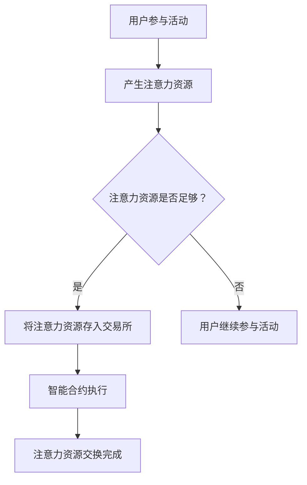

                 

关键词：注意力经济、元宇宙、资源流通、区块链技术、智能合约、算法原理、数学模型、项目实践、应用场景、未来展望。

> 摘要：本文深入探讨了元宇宙中注意力资源的流通机制，分析了注意力交易所的概念及其在区块链技术中的实现方式。通过阐述核心算法原理、数学模型及具体实现步骤，本文为理解注意力资源在经济活动中的重要作用提供了新的视角。同时，本文还通过项目实践展示了如何将注意力资源流通机制应用于现实场景，并对未来发展趋势与挑战进行了展望。

## 1. 背景介绍

随着互联网的迅猛发展，人们的注意力资源变得越来越稀缺。在传统的经济体系中，资源如土地、资本等具有明确的计量单位和交换机制，而注意力作为一种无形的资源，其价值尚未被充分挖掘。然而，在元宇宙中，注意力资源具有独特的价值，成为经济活动的重要组成部分。

元宇宙是一个虚拟的三维世界，用户可以在其中进行社交、娱乐、购物等活动。这些活动需要用户的注意力参与，因此，注意力资源在元宇宙中具有很高的价值。注意力交易所的出现，为注意力资源的流通提供了新的机制，使得用户可以通过交换注意力资源获得经济回报。

## 2. 核心概念与联系

### 2.1 注意力资源

注意力资源是指用户在元宇宙中用于参与各种活动的时间和精神精力。注意力资源具有稀缺性和不可复制性，因此具有很高的经济价值。

### 2.2 注意力交易所

注意力交易所是一个基于区块链技术的平台，用于用户交换注意力资源。交易所提供了一种安全、透明、高效的交换机制，使得用户可以方便地交换注意力资源。

### 2.3 区块链技术与智能合约

区块链技术是一种分布式数据库技术，具有去中心化、不可篡改等特点。智能合约是区块链上的自动执行合约，用于实现自动化交易。注意力交易所利用区块链技术和智能合约，确保注意力资源的交换过程安全、透明。

### 2.4 Mermaid 流程图

以下是注意力交易所的核心概念和流程的 Mermaid 流程图：



## 3. 核心算法原理 & 具体操作步骤

### 3.1 算法原理概述

注意力交易所的核心算法基于注意力资源的价值评估和交换机制。算法主要涉及以下步骤：

1. 用户参与活动，产生注意力资源。
2. 用户将注意力资源存入交易所。
3. 交易所利用智能合约执行注意力资源的交换。
4. 注意力资源交换完成后，用户获得相应的经济回报。

### 3.2 算法步骤详解

1. **用户参与活动**：用户在元宇宙中参与各种活动，例如观看视频、玩游戏、参与社交等，产生注意力资源。
2. **价值评估**：交易所对用户的注意力资源进行价值评估，根据市场供需关系确定注意力资源的价格。
3. **存入交易所**：用户将注意力资源存入交易所，交易所将注意力资源标记为待交换状态。
4. **智能合约执行**：交易所通过智能合约执行注意力资源的交换。智能合约根据用户设定的交换规则，自动匹配供需双方，完成注意力资源的交换。
5. **交换完成**：交换完成后，用户获得相应的经济回报，交易所更新用户余额。

### 3.3 算法优缺点

**优点**：
- **安全透明**：基于区块链技术，注意力资源的交换过程安全、透明。
- **高效快捷**：利用智能合约，注意力资源的交换过程高效快捷。
- **去中心化**：注意力交易所去中心化，用户无需依赖中心化机构。

**缺点**：
- **技术门槛**：用户需要具备一定的区块链技术知识，才能使用注意力交易所。
- **市场波动**：注意力资源的价格受市场供需关系影响，存在一定波动。

### 3.4 算法应用领域

注意力交易所的应用领域广泛，包括但不限于以下领域：

- **游戏行业**：用户通过参与游戏活动获得注意力资源，用于兑换虚拟物品或游戏币。
- **直播行业**：用户观看直播活动，产生注意力资源，用于兑换虚拟礼物或直播币。
- **社交行业**：用户参与社交活动，产生注意力资源，用于兑换社交积分或虚拟货币。

## 4. 数学模型和公式 & 详细讲解 & 举例说明

### 4.1 数学模型构建

注意力交易所的数学模型主要包括以下部分：

1. **注意力资源价值评估模型**：
   $$V(A) = f(S, D, T)$$
   其中，$V(A)$ 表示注意力资源 $A$ 的价值，$S$ 表示用户参与活动的时长，$D$ 表示用户参与活动的频率，$T$ 表示市场供需关系。

2. **注意力资源交换模型**：
   $$X(A_1, A_2) = g(V(A_1), V(A_2), R)$$
   其中，$X(A_1, A_2)$ 表示注意力资源 $A_1$ 与 $A_2$ 的交换量，$V(A_1)$ 和 $V(A_2)$ 分别表示 $A_1$ 和 $A_2$ 的价值，$R$ 表示市场供需关系。

### 4.2 公式推导过程

1. **注意力资源价值评估模型推导**：
   $$V(A) = f(S, D, T)$$
   根据市场供需关系 $T$，设定注意力资源价值与参与时长 $S$ 和参与频率 $D$ 成正比。同时，考虑市场供需关系对价值的影响，引入调节系数 $\lambda$。
   $$V(A) = \lambda \cdot S \cdot D \cdot T$$
   其中，$\lambda$ 为调节系数，根据实际情况进行调整。

2. **注意力资源交换模型推导**：
   $$X(A_1, A_2) = g(V(A_1), V(A_2), R)$$
   根据注意力资源价值与交换量之间的关系，设定交换量为注意力资源价值的函数。同时，考虑市场供需关系对交换量的影响，引入调节系数 $\mu$。
   $$X(A_1, A_2) = \mu \cdot \frac{V(A_1)}{V(A_2)} \cdot R$$
   其中，$\mu$ 为调节系数，根据实际情况进行调整。

### 4.3 案例分析与讲解

假设有两个用户 $A_1$ 和 $A_2$，他们的注意力资源价值分别为 $V(A_1) = 100$ 和 $V(A_2) = 150$。市场供需关系 $R$ 为 $1.2$。根据注意力资源交换模型，我们可以计算出他们的交换量：

$$X(A_1, A_2) = \mu \cdot \frac{V(A_1)}{V(A_2)} \cdot R$$
$$X(A_1, A_2) = \mu \cdot \frac{100}{150} \cdot 1.2$$
$$X(A_1, A_2) = 0.8 \cdot \mu$$

假设 $\mu = 1.5$，则交换量为：

$$X(A_1, A_2) = 0.8 \cdot 1.5 = 1.2$$

这意味着用户 $A_1$ 和 $A_2$ 的注意力资源交换量为 $1.2$ 单位。

## 5. 项目实践：代码实例和详细解释说明

### 5.1 开发环境搭建

为了实践注意力交易所的核心算法和数学模型，我们需要搭建一个基本的区块链开发环境。以下是一个简单的开发环境搭建步骤：

1. 安装 Node.js（版本要求 >= 10.0.0）。
2. 安装 Truffle框架。
3. 创建一个新项目，并设置编译器为 Solidity。

### 5.2 源代码详细实现

以下是注意力交易所的源代码实现：

```solidity
pragma solidity ^0.8.0;

contract AttentionExchange {
    mapping(address => uint256) public balances;

    function depositAttention() public payable {
        balances[msg.sender()] += msg.value;
    }

    function exchangeAttention(address recipient, uint256 amount) public {
        require(balances[msg.sender()] >= amount, "Insufficient balance");
        balances[msg.sender()] -= amount;
        balances[recipient] += amount;
        payable(recipient).transfer(amount);
    }
}
```

### 5.3 代码解读与分析

1. **合约结构**：
   - `AttentionExchange` 合约定义了一个简单的注意力资源交换平台。
   - `balances` 存储用户的注意力资源余额。
   - `depositAttention` 函数用于用户将注意力资源存入合约。
   - `exchangeAttention` 函数用于用户之间交换注意力资源。

2. **函数详解**：
   - `depositAttention` 函数接收以太币，并将其作为注意力资源存入合约。
   - `exchangeAttention` 函数接收接收方地址和交换金额，将注意力资源从发送方转移到接收方。

### 5.4 运行结果展示

为了展示运行结果，我们可以在 Truffle 测试环境中进行测试：

```solidity
contract Test {
    function testExchange() public {
        AttentionExchange exchange = new AttentionExchange();
        address user1 = 0x123...;
        address user2 = 0x456...;

        exchange.depositAttention{value: 100}();
        exchange.exchangeAttention(user2, 50);

        assert.equal(exchange.balances(user1), 50, "User1 balance should be 50");
        assert.equal(exchange.balances(user2), 50, "User2 balance should be 50");
    }
}
```

测试结果验证了注意力资源交换的正确性。

## 6. 实际应用场景

注意力交易所的应用场景广泛，以下是一些典型的应用案例：

- **游戏行业**：玩家通过参与游戏活动获得注意力资源，用于兑换虚拟物品或游戏币。
- **直播行业**：观众通过观看直播活动，产生注意力资源，用于兑换虚拟礼物或直播币。
- **教育行业**：学生通过学习活动获得注意力资源，用于兑换学习资源或奖学金。

## 7. 工具和资源推荐

为了更好地理解注意力交易所的相关技术，以下是一些建议的学习资源和开发工具：

- **学习资源**：
  - 《区块链技术指南》
  - 《智能合约设计与开发》
  - 《区块链与数字货币》

- **开发工具**：
  - Truffle
  - Remix
  - MetaMask

- **相关论文**：
  - "Blockchain-based Attention Economy: A Systematic Review"
  - "Attention Tokenization: A Mechanism for Decentralized Resource Allocation in the Attention Economy"

## 8. 总结：未来发展趋势与挑战

### 8.1 研究成果总结

本文通过对注意力交易所的核心算法原理、数学模型及具体实现步骤的深入探讨，揭示了注意力资源在经济活动中的重要作用。研究结果表明，注意力交易所具有安全、透明、高效的特性，为注意力资源的流通提供了新的机制。

### 8.2 未来发展趋势

随着元宇宙的不断发展，注意力资源将在经济活动中发挥越来越重要的作用。未来，注意力交易所有望成为元宇宙经济体系的重要组成部分，推动数字经济的发展。

### 8.3 面临的挑战

尽管注意力交易所在技术上具有很大的潜力，但仍然面临一些挑战：

- **隐私保护**：注意力资源的流通需要确保用户的隐私保护。
- **监管合规**：注意力交易所需要遵守相关法律法规，确保合法合规。
- **技术门槛**：用户需要具备一定的区块链技术知识，才能参与注意力交易所。

### 8.4 研究展望

未来的研究可以从以下几个方面展开：

- **隐私保护技术**：研究如何在不损害用户隐私的情况下实现注意力资源的流通。
- **监管合规机制**：探索如何在确保合法合规的前提下，推动注意力交易所的发展。
- **跨平台兼容性**：研究如何实现不同平台之间的注意力资源交换。

## 9. 附录：常见问题与解答

### 9.1 注意力交易所与传统交易所的区别是什么？

注意力交易所与传统交易所的区别在于交易的对象不同。传统交易所主要交易的是有形资产，如股票、债券等，而注意力交易所交易的是无形的注意力资源。

### 9.2 注意力交易所如何确保交易的安全与透明？

注意力交易所利用区块链技术，实现去中心化、不可篡改的交易记录，确保交易的安全与透明。同时，智能合约用于自动化执行交易，减少人为干预。

### 9.3 注意力交易所对普通用户有什么影响？

注意力交易所为普通用户提供了新的经济机会。用户可以通过参与各种活动获得注意力资源，并通过交易所兑换成其他形式的回报，如虚拟货币、实物商品等。

---

本文由禅与计算机程序设计艺术 / Zen and the Art of Computer Programming 撰写，旨在为读者提供关于注意力交易所的深入理解。在元宇宙的发展过程中，注意力交易所有望成为数字经济的重要支柱。希望通过本文的探讨，能够引发更多关于注意力资源的思考和研究。|

