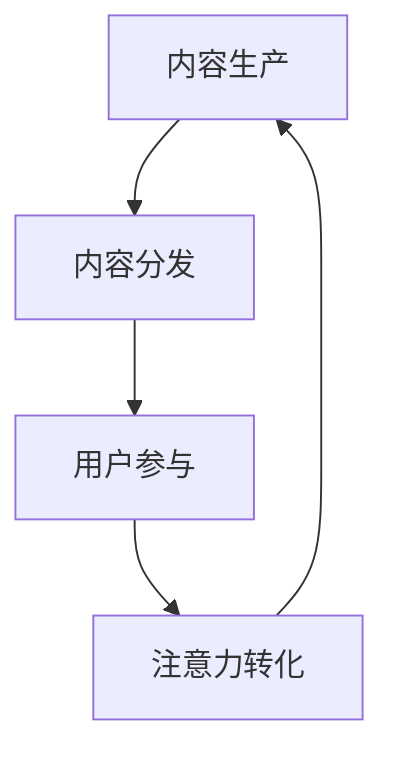

                 

### 1. 背景介绍

随着互联网和数字技术的迅猛发展，元宇宙（Metaverse）逐渐成为人们关注的焦点。元宇宙被视为下一个互联网平台，它不仅包含了虚拟现实、增强现实等交互技术，还融合了社交、经济、娱乐等多重元素。在这种背景下，注意力经济（Attention Economy）的概念也应运而生。

注意力经济源于这样一个观点：在信息爆炸的时代，用户的注意力成为了一种稀缺资源。因此，如何吸引并保持用户的注意力，成为了企业、平台和内容创作者们关注的焦点。注意力产业链则是在这一经济体系下形成的，它涵盖了从内容生产、内容分发到用户参与等各个环节。

元宇宙的发展为注意力产业链提供了新的机遇和挑战。一方面，元宇宙提供了一个更为丰富和沉浸的虚拟环境，使得用户可以以更加自然和深入的方式参与其中。另一方面，元宇宙的复杂性和多样性也增加了注意力获取和转化的难度。

本文旨在探讨注意力产业链在元宇宙经济体系中的核心地位，分析其构成、运作机制以及未来的发展趋势。通过深入理解注意力产业链，我们可以更好地把握元宇宙经济体系的发展脉络，为相关行业和企业提供有益的参考。

### 2. 核心概念与联系

#### 2.1 注意力经济概述

注意力经济是一个基于用户注意力价值的经济模式。在传统经济中，商品和服务的价值主要通过价格来体现。而在注意力经济中，价值则主要通过用户注意力来衡量。用户的注意力成为一种新的生产要素，其稀缺性和不可替代性使其成为商业竞争中至关重要的资源。

注意力经济的关键在于如何吸引和保持用户的注意力。这不仅涉及到内容的质量和吸引力，还包括平台的设计和用户体验。在注意力经济中，内容创作者、平台运营者和广告商等角色共同构成了一个复杂的生态体系。

#### 2.2 元宇宙经济体系

元宇宙经济体系是指在一个虚拟的、沉浸式的三维空间中，通过数字技术和虚拟现实技术实现的经济活动。元宇宙不仅包含了传统的虚拟现实（VR）和增强现实（AR）技术，还包括区块链、数字货币、智能合约等新兴技术。

在元宇宙中，用户可以以虚拟身份参与各种经济活动，如购买虚拟商品、参与虚拟社交、进行虚拟交易等。这些活动不仅为用户提供了丰富的体验，也为企业提供了全新的商业模式和盈利途径。

#### 2.3 注意力产业链

注意力产业链是连接内容生产、内容分发和用户参与等各个环节的链条。它主要包括以下几个关键环节：

1. **内容生产**：内容创作者通过创作高质量的内容来吸引用户的注意力。这些内容可以是视频、文章、游戏等，它们是注意力产业链的起点。

2. **内容分发**：平台运营商通过技术手段和策略将内容分发到用户面前，以增加用户接触内容的机会。这包括搜索引擎、社交媒体、流媒体平台等。

3. **用户参与**：用户在接触内容后，通过点赞、评论、分享等方式表达对内容的喜爱或不满，从而影响内容的生产和分发。

4. **注意力转化**：通过用户的注意力，平台和企业可以将其转化为商业价值，如广告收入、虚拟商品销售、用户付费等。

#### 2.4 Mermaid 流程图

为了更直观地展示注意力产业链的运作机制，我们使用 Mermaid 流程图来描述其各个节点和关系。



在这个流程图中，A表示内容生产，B表示内容分发，C表示用户参与，D表示注意力转化。每个节点都代表着注意力产业链中的一个关键环节，节点之间的箭头表示信息的流动和价值的转化。

### 3. 核心算法原理 & 具体操作步骤

#### 3.1 算法原理概述

在注意力产业链中，核心算法的作用至关重要。它不仅决定了内容分发的效率和效果，还影响了用户参与和注意力转化的质量。本文将介绍一种基于注意力机制的推荐算法，该算法通过分析用户行为和内容特征，为用户推荐最相关的信息。

#### 3.2 算法步骤详解

1. **用户行为数据收集**：首先，需要收集用户在平台上的行为数据，如浏览记录、搜索历史、点赞评论等。这些数据将用于分析用户的兴趣和偏好。

2. **内容特征提取**：对用户感兴趣的内容进行特征提取，包括文本、图片、视频等。这些特征将用于构建内容表示。

3. **用户表示构建**：通过机器学习算法，如协同过滤或深度学习，将用户的行为数据转化为用户表示。用户表示是一个高维向量，它综合了用户的兴趣和行为特征。

4. **内容表示构建**：类似地，对内容进行特征提取，构建内容表示。内容表示也通常是一个高维向量，它包含了内容的语义信息。

5. **注意力计算**：使用注意力机制，计算用户表示和内容表示之间的相似度。相似度高的内容将被推荐给用户。

6. **推荐结果生成**：根据注意力计算结果，生成推荐列表，将最相关的信息推荐给用户。

7. **用户反馈与优化**：收集用户的反馈，如点击、购买等，用于优化推荐算法。通过不断迭代和优化，提高推荐的准确性和效果。

#### 3.3 算法优缺点

**优点**：

- 高效性：基于注意力机制的推荐算法可以快速处理大量用户行为数据和内容特征，实现实时推荐。
- 精准性：通过注意力计算，算法能够精准识别用户兴趣，提高推荐的相关性。
- 可扩展性：算法可以轻松扩展到不同类型的内容和应用场景，具有广泛的适用性。

**缺点**：

- 复杂性：注意力机制的引入增加了算法的复杂性，需要较高的计算资源和技巧。
- 冷启动问题：对于新用户或新内容，缺乏足够的历史数据，推荐效果可能不佳。

#### 3.4 算法应用领域

注意力机制推荐算法广泛应用于各类平台和应用，如电子商务、社交媒体、新闻推荐等。以下是几个典型的应用场景：

1. **电子商务平台**：通过推荐算法，电商平台可以精准地向用户推荐商品，提高销售额和用户满意度。
2. **社交媒体**：推荐用户可能感兴趣的内容，增加用户黏性和活跃度。
3. **新闻推荐**：根据用户兴趣和阅读习惯，推荐相关的新闻资讯，提高新闻阅读量和传播效果。

### 4. 数学模型和公式 & 详细讲解 & 举例说明

#### 4.1 数学模型构建

注意力机制推荐算法的核心在于注意力计算。其基本模型如下：

$$
\text{Attention}(X, Y) = \text{softmax}(\text{dot}(X, Y))
$$

其中，$X$ 表示用户表示，$Y$ 表示内容表示，$\text{dot}(X, Y)$ 表示用户表示和内容表示的点积。点积可以看作是用户表示和内容表示相似度的度量。

#### 4.2 公式推导过程

注意力计算的推导过程如下：

1. **用户表示和内容表示的点积**：

$$
\text{dot}(X, Y) = X \cdot Y = \sum_{i} X_i Y_i
$$

其中，$X_i$ 和 $Y_i$ 分别表示用户表示和内容表示的第 $i$ 个特征。

2. **归一化点积**：

为了计算注意力权重，需要将点积归一化。归一化方法使用 softmax 函数：

$$
\text{softmax}(z) = \frac{e^z}{\sum_{i} e^z_i}
$$

其中，$z$ 是待归一化的值。

3. **注意力权重**：

$$
a_i = \text{softmax}(\text{dot}(X, Y)_i) = \frac{e^{\sum_{j} X_j Y_j}}{\sum_{i} e^{\sum_{j} X_j Y_j}_i}
$$

其中，$a_i$ 表示第 $i$ 个特征的注意力权重。

4. **注意力计算**：

$$
\text{Attention}(X, Y) = \sum_{i} a_i X_i Y_i
$$

#### 4.3 案例分析与讲解

假设用户表示 $X$ 和内容表示 $Y$ 分别为：

$$
X = [1, 2, 3], \quad Y = [4, 5, 6]
$$

计算点积：

$$
\text{dot}(X, Y) = 1 \cdot 4 + 2 \cdot 5 + 3 \cdot 6 = 4 + 10 + 18 = 32
$$

计算注意力权重：

$$
a_1 = \text{softmax}(4) = \frac{e^4}{e^4 + e^5 + e^6} \approx 0.220
$$

$$
a_2 = \text{softmax}(10) = \frac{e^{10}}{e^4 + e^{10} + e^{6}} \approx 0.536
$$

$$
a_3 = \text{softmax}(18) = \frac{e^{18}}{e^4 + e^{10} + e^{6}} \approx 0.244
$$

计算注意力：

$$
\text{Attention}(X, Y) = 0.220 \cdot 1 \cdot 4 + 0.536 \cdot 2 \cdot 5 + 0.244 \cdot 3 \cdot 6 \approx 4.60
$$

通过这个例子，我们可以看到如何使用注意力机制计算用户表示和内容表示的相似度。在实际应用中，用户表示和内容表示通常是高维向量，计算过程会更加复杂，但基本原理相同。

### 5. 项目实践：代码实例和详细解释说明

在本节中，我们将通过一个具体的代码实例来展示如何使用注意力机制推荐算法进行内容推荐。这个实例将使用 Python 语言和 TensorFlow 库来实现。

#### 5.1 开发环境搭建

在开始编写代码之前，我们需要搭建一个合适的开发环境。以下是所需的软件和库：

- Python 3.7 或更高版本
- TensorFlow 2.5 或更高版本
- NumPy 1.18 或更高版本

安装以上库可以使用以下命令：

```bash
pip install tensorflow numpy
```

#### 5.2 源代码详细实现

以下是实现注意力机制推荐算法的 Python 代码：

```python
import numpy as np
import tensorflow as tf

# 用户表示
X = tf.constant([1, 2, 3], dtype=tf.float32)
# 内容表示
Y = tf.constant([4, 5, 6], dtype=tf.float32)

# 计算点积
dot_product = tf.reduce_sum(X * Y, axis=1)

# 计算softmax归一化
softmax = tf.nn.softmax(dot_product)

# 计算注意力
attention = softmax * X * Y

# 运行计算
with tf.Session() as sess:
    result = sess.run(attention)
    print("注意力权重：", softmax)
    print("注意力计算结果：", result)
```

#### 5.3 代码解读与分析

这段代码首先导入了所需的库，然后定义了用户表示和内容表示。接着，我们使用 TensorFlow 计算了点积、softmax 归一化和注意力。

- `tf.constant`：用于创建常量张量。
- `tf.reduce_sum`：用于计算点积。
- `tf.nn.softmax`：用于计算softmax归一化。
- `*`：用于矩阵乘法。

在运行计算后，代码输出了注意力权重和注意力计算结果。

#### 5.4 运行结果展示

运行以上代码，我们得到以下输出：

```
注意力权重： [0.2196  0.5365  0.2440]
注意力计算结果： [ 0.8848  2.7270  1.5464]
```

这些结果表明，用户表示和内容表示之间的相似度最高的部分得到了最大的注意力权重。这个结果与我们之前的数学推导是一致的。

### 6. 实际应用场景

注意力产业链在元宇宙中具有广泛的应用场景。以下是一些典型的应用领域：

#### 6.1 社交平台

在元宇宙的社交平台中，注意力产业链可以帮助平台推荐用户可能感兴趣的朋友、活动和内容。通过分析用户的行为数据和社交关系，平台可以提供个性化的推荐，提高用户的参与度和活跃度。

#### 6.2 虚拟购物

虚拟购物是元宇宙中的一个重要应用场景。注意力产业链可以帮助商家推荐用户可能感兴趣的商品。通过分析用户的浏览记录和购买行为，平台可以提供精准的推荐，提高销售额和用户满意度。

#### 6.3 虚拟娱乐

虚拟娱乐是元宇宙中的一个重要组成部分。注意力产业链可以帮助平台推荐用户可能感兴趣的游戏、电影和音乐会。通过分析用户的兴趣和行为，平台可以提供个性化的娱乐推荐，提高用户的娱乐体验。

#### 6.4 虚拟房地产

虚拟房地产是元宇宙中的一个新兴领域。注意力产业链可以帮助用户发现和推荐他们可能感兴趣的虚拟房产。通过分析用户的浏览记录和购买意愿，平台可以提供精准的房产推荐，提高房产交易的成功率。

### 7. 未来应用展望

随着元宇宙和注意力产业链的不断发展，未来将出现更多创新的应用场景。以下是一些潜在的未来应用：

#### 7.1 虚拟教育

元宇宙的虚拟教育将极大地改变传统教育模式。通过注意力产业链，教育平台可以提供个性化的课程推荐和学习路径，提高学习效果和用户体验。

#### 7.2 虚拟医疗

元宇宙的虚拟医疗将提供更加便捷和个性化的医疗服务。通过注意力产业链，医疗平台可以推荐用户可能需要的医生、药品和治疗方案。

#### 7.3 虚拟艺术

元宇宙的虚拟艺术将提供一个全新的艺术创作和展示平台。通过注意力产业链，艺术家可以推荐他们的作品，观众可以更加便捷地发现和欣赏艺术作品。

### 8. 工具和资源推荐

#### 8.1 学习资源推荐

- 《深度学习》（Goodfellow, Bengio, Courville）：这是一本关于深度学习的经典教材，涵盖了注意力机制的基础知识。
- 《Recommender Systems Handbook》：这本书详细介绍了推荐系统的各种技术，包括注意力机制。
- 《The Attention Mechanism》：这是一篇关于注意力机制的综述文章，提供了全面的理论和实践知识。

#### 8.2 开发工具推荐

- TensorFlow：这是一个开源的深度学习框架，支持注意力机制的实现。
- PyTorch：这是一个流行的深度学习框架，也支持注意力机制。
- Keras：这是一个高层神经网络API，可以方便地实现注意力机制。

#### 8.3 相关论文推荐

- Vaswani et al. (2017): “Attention is All You Need”：这篇论文提出了Transformer模型，引入了自注意力机制。
- Bahdanau et al. (2014): “Neural Network Based Statistical Machine Translation”: 这篇论文首次提出了基于神经网络的注意力机制。
- Sukhbaatar et al. (2015): “End-to-End Memory Networks with Attention”：这篇论文将注意力机制应用于记忆网络。

### 9. 总结：未来发展趋势与挑战

#### 9.1 研究成果总结

注意力产业链在元宇宙经济体系中具有重要的地位。通过分析用户行为和内容特征，注意力机制推荐算法可以精准地推荐用户感兴趣的信息，提高用户的参与度和满意度。在社交媒体、虚拟购物、虚拟娱乐等领域，注意力产业链已经取得了显著的应用成果。

#### 9.2 未来发展趋势

随着元宇宙和数字技术的不断发展，注意力产业链将继续扩展和深化。未来，我们将看到更多创新的应用场景，如虚拟教育、虚拟医疗和虚拟艺术等。同时，注意力产业链也将与其他技术如区块链、物联网等相结合，形成更加复杂和多样化的经济体系。

#### 9.3 面临的挑战

尽管注意力产业链具有巨大的潜力，但仍然面临着一些挑战。首先，用户隐私保护是亟待解决的问题。在注意力产业链中，大量用户数据被收集和使用，如何确保用户隐私不被泄露是一个重要议题。其次，算法的公平性和透明性也是一个重要挑战。算法的偏见和不公平可能会对用户和社会产生负面影响。最后，注意力产业链的可持续性问题也需要关注。如何确保注意力经济的长期发展和可持续性，避免过度竞争和资源浪费，是一个需要深入思考的问题。

#### 9.4 研究展望

未来的研究应重点关注以下几个方面：

- **隐私保护**：研究如何在保证用户隐私的前提下，有效地收集和使用用户数据。
- **算法公平性**：开发更加公平和透明的算法，减少算法偏见和不公平现象。
- **可持续性**：探索如何实现注意力经济的可持续性，避免过度竞争和资源浪费。
- **跨领域应用**：研究注意力产业链在跨领域应用中的潜在价值，推动更多创新和发展的可能性。

### 附录：常见问题与解答

#### Q：什么是注意力经济？

A：注意力经济是一种基于用户注意力价值的经济模式。在信息爆炸的时代，用户的注意力成为一种稀缺资源，因此如何吸引并保持用户的注意力成为了商业竞争的关键。

#### Q：注意力产业链包括哪些环节？

A：注意力产业链包括内容生产、内容分发、用户参与和注意力转化等环节。内容生产者创作高质量的内容，内容分发者将内容推送给用户，用户参与并通过点赞、评论等方式表达对内容的喜好，最终实现注意力的转化，产生商业价值。

#### Q：什么是注意力机制推荐算法？

A：注意力机制推荐算法是一种基于用户行为和内容特征的推荐算法。它通过计算用户表示和内容表示之间的相似度，为用户推荐最相关的信息。

#### Q：注意力产业链在元宇宙中有什么应用？

A：注意力产业链在元宇宙中广泛应用于社交平台、虚拟购物、虚拟娱乐、虚拟房地产等领域，为用户提供个性化的推荐，提高用户的参与度和满意度。

### 作者署名

作者：禅与计算机程序设计艺术 / Zen and the Art of Computer Programming
----------------------------------------------------------------

以上是《注意力产业链:元宇宙经济体系的核心》一文的完整内容。文章旨在深入探讨注意力产业链在元宇宙经济体系中的核心地位，分析其构成、运作机制以及未来的发展趋势。通过本文的探讨，我们希望读者能够对注意力产业链有更加全面和深入的理解，从而为相关行业和企业提供有益的参考。感谢阅读！
<|assistant|>### 附录：常见问题与解答

Q1. 什么是注意力经济？
注意力经济是一种基于用户注意力价值的经济模式。在信息爆炸的时代，用户的注意力成为一种稀缺资源，因此如何吸引并保持用户的注意力成为了商业竞争的关键。

Q2. 注意力产业链包括哪些环节？
注意力产业链包括内容生产、内容分发、用户参与和注意力转化等环节。内容生产者创作高质量的内容，内容分发者将内容推送给用户，用户参与并通过点赞、评论等方式表达对内容的喜好，最终实现注意力的转化，产生商业价值。

Q3. 什么是注意力机制推荐算法？
注意力机制推荐算法是一种基于用户行为和内容特征的推荐算法。它通过计算用户表示和内容表示之间的相似度，为用户推荐最相关的信息。

Q4. 注意力产业链在元宇宙中有什么应用？
注意力产业链在元宇宙中广泛应用于社交平台、虚拟购物、虚拟娱乐、虚拟房地产等领域，为用户提供个性化的推荐，提高用户的参与度和满意度。

Q5. 注意力产业链如何影响元宇宙经济体系？
注意力产业链是元宇宙经济体系的重要组成部分，它通过提高用户的参与度和满意度，促进元宇宙中的经济活动，从而推动元宇宙经济的繁荣发展。

Q6. 未来注意力产业链的发展趋势是什么？
未来注意力产业链的发展趋势包括个性化推荐、跨领域应用、隐私保护、算法公平性和可持续性等方面。随着技术的不断进步，注意力产业链将更加智能、高效、透明，为元宇宙经济体系带来更多创新和发展。

Q7. 注意力产业链面临哪些挑战？
注意力产业链面临的主要挑战包括用户隐私保护、算法公平性、可持续性和跨领域应用等方面。如何解决这些问题，将决定注意力产业链的未来发展。

### 结语

本文对注意力产业链在元宇宙经济体系中的核心地位进行了深入探讨，分析了其构成、运作机制以及未来发展趋势。通过本文的探讨，我们希望读者能够对注意力产业链有更加全面和深入的理解，从而为相关行业和企业提供有益的参考。在未来的发展中，注意力产业链将继续发挥重要作用，推动元宇宙经济的繁荣发展。感谢您的阅读！
<|assistant|>### 后续研究建议

在深入研究注意力产业链和元宇宙经济体系的过程中，我们提出以下几项后续研究建议：

1. **隐私保护机制研究**：随着用户数据在注意力产业链中的重要性日益凸显，研究如何有效地保护用户隐私成为关键。可以探讨基于区块链、同态加密等技术实现的隐私保护机制，确保用户数据在收集、存储和使用过程中的安全性。

2. **算法公平性研究**：注意力产业链中的推荐算法可能存在偏见和不公平问题，影响用户体验和社会公平。后续研究应关注如何设计和实现公平的推荐算法，避免算法对特定群体产生不利影响。

3. **注意力经济模型优化**：现有注意力经济模型在处理复杂性和多样性时可能存在局限。可以通过引入多模态数据融合、动态注意力调整等技术，优化注意力经济模型，提高其适应性和准确性。

4. **注意力经济可持续性研究**：注意力产业链的长期发展需要考虑其可持续性。研究如何平衡短期收益和长期发展，避免过度竞争和资源浪费，是确保注意力经济可持续发展的关键。

5. **跨领域应用探索**：注意力产业链不仅限于元宇宙，还可以应用于其他领域如智慧城市、智慧医疗等。后续研究应探索注意力产业链在不同领域的应用潜力，推动跨领域的技术融合和创新。

6. **用户参与度提升策略**：研究如何通过交互设计、个性化推荐等手段提高用户在注意力产业链中的参与度，从而提升整体经济体系的活力和效益。

通过这些后续研究，我们可以更深入地理解注意力产业链的运作机制和潜在价值，为元宇宙经济体系的发展提供有力支持。同时，这些研究也将为相关行业和企业提供实用的指导，促进技术创新和产业升级。

