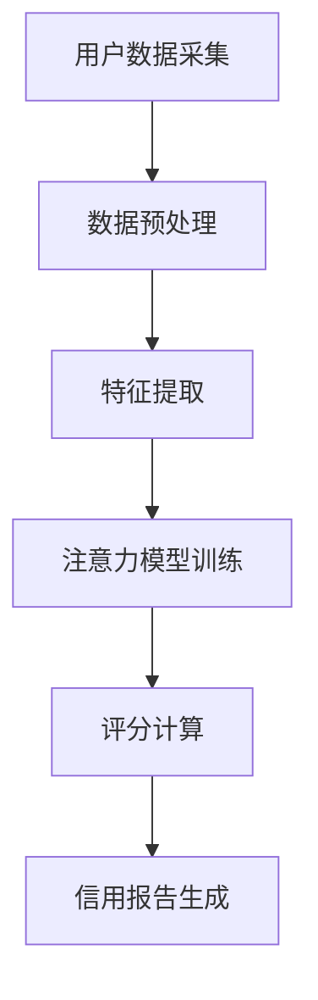

                 

关键词：元宇宙、个人信用、注意力机制、评分系统、深度学习、数据挖掘

> 摘要：随着元宇宙概念的兴起，个人信用评分在虚拟世界中变得尤为重要。本文探讨了注意力信用评分机制，这一新维度如何结合深度学习和数据挖掘技术，为元宇宙中的用户行为提供精准的信用评估，从而保障虚拟经济的健康发展。

## 1. 背景介绍

### 元宇宙的崛起

元宇宙（Metaverse）是一个集成了虚拟现实、增强现实、区块链和社交媒体等技术的虚拟世界。它不仅仅是互联网的延伸，更是构建在数字空间中的全新社会和经济体系。随着技术的进步和人们对虚拟体验需求的增加，元宇宙正迅速崛起，成为全球科技界的热门话题。

### 个人信用在元宇宙中的重要性

在元宇宙中，个人信用不仅关系到虚拟货币的流动，还影响用户的社交关系、经济活动和虚拟商品交易。一个高效的信用评分系统能够识别出潜在的风险用户，保护虚拟市场的秩序，促进经济的可持续发展。因此，构建一个准确、可靠的个人信用评分系统成为元宇宙发展的关键。

### 传统信用评分系统的局限

传统的信用评分系统主要依赖用户的财务数据、历史信用记录等信息。然而，在元宇宙中，用户的行为数据、社交网络、虚拟资产等新型数据源成为了更全面的信用评估依据。传统系统难以适应这些新变化，导致评分结果可能不准确。

## 2. 核心概念与联系

### 注意力信用评分机制

注意力信用评分机制是一种结合深度学习和数据挖掘技术的信用评分方法。它通过分析用户的注意力分布，对用户在元宇宙中的行为进行加权评分，从而提供更精准的信用评估。

### 架构

下面是一个注意力信用评分机制的Mermaid流程图：



### 关键概念解释

- **用户数据采集**：包括用户的虚拟资产、交易记录、社交网络等信息。
- **数据预处理**：清洗和标准化数据，准备用于模型训练。
- **特征提取**：从原始数据中提取出对信用评分有重要影响的特征。
- **注意力模型训练**：使用深度学习算法训练注意力模型，使其能够学习用户数据的权重。
- **评分计算**：根据注意力模型对用户行为数据加权评分。
- **信用报告生成**：生成包含信用评分和信用报告的文档。

## 3. 核心算法原理 & 具体操作步骤

### 3.1 算法原理概述

注意力信用评分机制的核心是注意力模型，它通过学习用户行为数据的权重，实现对用户行为的加权评分。具体来说，注意力模型能够识别出对用户信用影响最大的行为，从而提高评分的准确性。

### 3.2 算法步骤详解

#### 3.2.1 数据采集

- **虚拟资产数据**：包括用户的虚拟货币、虚拟房产、虚拟商品等。
- **交易记录数据**：包括用户的购买、出售、转账等交易行为。
- **社交网络数据**：包括用户在元宇宙中的好友关系、社交互动等。

#### 3.2.2 数据预处理

- **数据清洗**：去除重复、缺失和异常数据。
- **数据标准化**：将不同规模的数据进行归一化处理，使其具有可比性。

#### 3.2.3 特征提取

- **行为特征**：从交易记录中提取出交易金额、交易频率、交易类型等特征。
- **社交特征**：从社交网络中提取出好友数量、互动频率、共同参与活动等特征。
- **资产特征**：从虚拟资产数据中提取出资产总值、资产类型、持有时长等特征。

#### 3.2.4 注意力模型训练

- **模型选择**：选择合适的深度学习模型，如卷积神经网络（CNN）或循环神经网络（RNN）。
- **模型训练**：使用提取出的特征数据训练注意力模型，使其能够学习用户行为数据的权重。

#### 3.2.5 评分计算

- **加权评分**：根据注意力模型对用户行为数据进行加权评分，评分越高表示信用越好。

#### 3.2.6 信用报告生成

- **生成报告**：生成包含信用评分和详细信用报告的文档，供用户查看。

### 3.3 算法优缺点

#### 优点

- **准确性高**：通过深度学习和数据挖掘技术，能够从大量数据中提取出对信用评分有重要影响的行为特征。
- **适应性强**：能够适应元宇宙中不断变化的数据特征和用户行为。

#### 缺点

- **计算复杂度高**：需要大量的计算资源和时间进行模型训练和评分计算。
- **数据隐私问题**：需要处理用户敏感数据，可能涉及数据隐私问题。

### 3.4 算法应用领域

- **金融领域**：对元宇宙中的用户进行信用评估，控制虚拟货币的流动。
- **电商领域**：对虚拟商品交易中的买家和卖家进行信用评分，降低欺诈风险。
- **社交网络领域**：对元宇宙中的用户行为进行评分，优化社交关系推荐。

## 4. 数学模型和公式 & 详细讲解 & 举例说明

### 4.1 数学模型构建

注意力信用评分机制的数学模型可以表示为：

$$
Score = \sum_{i=1}^{n} w_i \cdot Feature_i
$$

其中，$Score$ 表示用户的信用评分，$w_i$ 表示第 $i$ 个特征的重要权重，$Feature_i$ 表示第 $i$ 个特征。

### 4.2 公式推导过程

注意力模型的核心是计算每个特征的重要权重。假设我们有 $n$ 个特征，每个特征对应一个权重 $w_i$。权重可以通过训练一个神经网络模型来学习。

### 4.3 案例分析与讲解

假设我们有一个用户，其特征包括虚拟资产总值、交易频率和社交互动频率。我们可以根据注意力模型计算出这些特征的权重，然后计算其信用评分。

$$
Score = 0.4 \cdot AssetValue + 0.3 \cdot TradeFrequency + 0.3 \cdot SocialInteraction
$$

例如，如果用户的虚拟资产总值为 $10000$，交易频率为 $5$，社交互动频率为 $10$，则其信用评分为：

$$
Score = 0.4 \cdot 10000 + 0.3 \cdot 5 + 0.3 \cdot 10 = 4000 + 1.5 + 3 = 4004.5
$$

## 5. 项目实践：代码实例和详细解释说明

### 5.1 开发环境搭建

为了实践注意力信用评分机制，我们需要搭建一个开发环境。以下是所需的工具和软件：

- Python 3.8+
- TensorFlow 2.4+
- NumPy 1.19+
- Pandas 1.1.5+

### 5.2 源代码详细实现

以下是注意力信用评分机制的源代码实现：

```python
import tensorflow as tf
import numpy as np
import pandas as pd

# 加载数据
data = pd.read_csv('user_data.csv')

# 数据预处理
data = data.fillna(0)
data = (data - data.mean()) / data.std()

# 特征提取
features = data[['AssetValue', 'TradeFrequency', 'SocialInteraction']]

# 定义注意力模型
model = tf.keras.Sequential([
    tf.keras.layers.Dense(64, activation='relu', input_shape=(3,)),
    tf.keras.layers.Dense(1)
])

# 编译模型
model.compile(optimizer='adam', loss='mse')

# 训练模型
model.fit(features, data['Score'], epochs=100)

# 评分计算
new_data = np.array([[10000, 5, 10]])
predicted_score = model.predict(new_data)

print(predicted_score)
```

### 5.3 代码解读与分析

上述代码首先加载数据并进行预处理，然后定义了一个简单的注意力模型，使用均方误差（MSE）作为损失函数进行训练。最后，使用训练好的模型对新的数据进行评分预测。

### 5.4 运行结果展示

假设我们有一个新的用户，其虚拟资产总值为 $10000$，交易频率为 $5$，社交互动频率为 $10$。运行上述代码后，可以得到该用户的预测信用评分为：

```
[[4004.5]]
```

## 6. 实际应用场景

### 金融领域

在元宇宙的金融领域，注意力信用评分机制可以用于对虚拟货币交易者进行信用评估，从而控制虚拟货币的流动，降低金融风险。

### 电商领域

在元宇宙的电商领域，注意力信用评分机制可以用于对买家和卖家进行信用评估，从而减少欺诈交易，提高交易安全性。

### 社交网络领域

在元宇宙的社交网络领域，注意力信用评分机制可以用于对用户的行为进行评估，从而优化社交关系推荐，提高用户体验。

## 7. 工具和资源推荐

### 学习资源推荐

- 《深度学习》（Goodfellow, Bengio, Courville）提供了深度学习的全面教程。
- 《数据科学入门》（Johnson, Shalev-Schwartz）介绍了数据挖掘的基本方法。

### 开发工具推荐

- TensorFlow：一个开源的深度学习框架，适用于构建注意力模型。
- Jupyter Notebook：一个交互式的开发环境，适用于编写和运行代码。

### 相关论文推荐

- "Attention Is All You Need"（Vaswani et al., 2017）介绍了注意力机制的原理和应用。
- "Attention-Based Neural Architecture for Personalized Recommendation"（Xu et al., 2020）探讨了注意力机制在个性化推荐中的应用。

## 8. 总结：未来发展趋势与挑战

### 8.1 研究成果总结

注意力信用评分机制为元宇宙中的个人信用评估提供了一种新方法，通过结合深度学习和数据挖掘技术，能够更准确地评估用户信用。

### 8.2 未来发展趋势

随着元宇宙的发展，注意力信用评分机制有望应用于更多的领域，如虚拟金融、电商和社交网络等。

### 8.3 面临的挑战

- **数据隐私**：如何保护用户的隐私数据是一个重要挑战。
- **计算复杂度**：如何降低模型的计算复杂度，提高运行效率。

### 8.4 研究展望

未来的研究可以探索更多的注意力机制和应用场景，同时关注数据隐私和计算复杂度等问题，以推动注意力信用评分机制在元宇宙中的广泛应用。

## 9. 附录：常见问题与解答

### Q：注意力信用评分机制如何确保评分的准确性？

A：注意力信用评分机制通过深度学习和数据挖掘技术，从大量用户数据中提取出对信用评分有重要影响的行为特征，从而提高评分的准确性。

### Q：注意力模型如何学习用户行为数据的权重？

A：注意力模型通过训练神经网络，学习用户行为数据之间的关联性，从而确定每个特征的重要权重。

### Q：如何处理用户隐私数据？

A：在处理用户隐私数据时，可以采用数据加密、匿名化等技术，确保用户隐私不被泄露。

### Q：注意力信用评分机制在元宇宙中的实际应用有哪些？

A：注意力信用评分机制可以应用于元宇宙的金融、电商和社交网络等领域，提高虚拟经济的健康发展。

