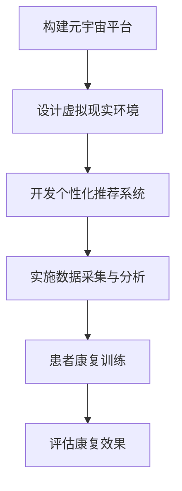
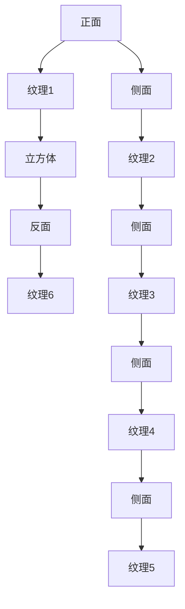

                 

关键词：注意力分散症、元宇宙、认知障碍康复、神经科学、AI辅助疗法、虚拟现实、人机交互

> 摘要：随着元宇宙的迅速发展，人类的认知障碍问题日益凸显，注意力分散症便是其中之一。本文将探讨如何利用神经科学、人工智能和虚拟现实技术，为注意力分散症患者提供一种新的认知康复治疗方法。通过构建元宇宙平台，结合个性化的AI辅助方案，为患者提供沉浸式体验，从而改善其注意力分散症状，提升认知功能。

## 1. 背景介绍

### 注意力分散症的定义与现状

注意力分散症（Attention Deficit Hyperactivity Disorder，ADHD）是一种常见的神经发育障碍，主要表现为注意力难以集中、过度活动和冲动行为。据世界卫生组织（WHO）统计，全球约5-7%的儿童和2-3%的成年人口患有注意力分散症。在我国，这一比例也相当高。随着信息时代的到来，人们面临的信息量爆炸式增长，导致注意力分散症问题愈加严重。

### 认知障碍康复的挑战

认知障碍康复面临着诸多挑战，包括：

1. **个性化治疗需求**：每位患者的症状和康复需求都有所不同，需要制定个性化的康复方案。
2. **康复过程的漫长性**：认知障碍康复通常需要长时间的训练和干预，患者往往需要付出巨大的耐心和努力。
3. **治疗效果的评估**：康复效果的评价需要科学、客观的指标，但目前尚缺乏统一的标准。

### 元宇宙与认知障碍康复

元宇宙是一个虚拟的、三维的、互联互通的数字世界，它为认知障碍康复提供了新的机遇。通过元宇宙，我们可以为患者提供沉浸式的体验环境，使其在虚拟世界中进行各种认知训练，从而提高康复效果。

## 2. 核心概念与联系

### 元宇宙平台构建

构建一个功能完备的元宇宙平台是认知障碍康复的关键。元宇宙平台应具备以下功能：

1. **虚拟现实环境**：提供沉浸式的虚拟现实环境，让患者能够自由探索和互动。
2. **个性化推荐系统**：根据患者的症状和康复进度，提供个性化的训练任务和干预方案。
3. **数据采集与分析**：实时采集患者的行为数据，通过大数据分析和机器学习模型，为康复过程提供科学依据。

### Mermaid 流程图



### 核心概念原理与联系

1. **虚拟现实环境**：通过虚拟现实技术，为患者构建一个模拟现实世界的环境，使其能够在虚拟世界中体验各种情境，从而锻炼其注意力和认知能力。
2. **个性化推荐系统**：基于患者的症状和康复进度，利用机器学习算法，为其推荐合适的训练任务和干预方案，提高康复效果。
3. **数据采集与分析**：通过实时采集患者的行为数据，包括注意力集中时间、活动频率等，对康复过程进行实时监控和调整。

## 3. 核心算法原理 & 具体操作步骤

### 3.1 算法原理概述

核心算法主要包括以下几个方面：

1. **虚拟现实环境生成算法**：通过计算机图形学技术，生成具有真实感的虚拟现实环境。
2. **注意力监测算法**：利用眼动追踪技术，实时监测患者的注意力状态。
3. **个性化推荐算法**：基于患者的症状和康复进度，利用协同过滤、决策树等算法，推荐合适的训练任务和干预方案。

### 3.2 算法步骤详解

1. **虚拟现实环境生成算法**：

   - **场景建模**：根据患者的需求，构建虚拟现实环境的基本框架。
   - **纹理映射**：为场景中的物体添加纹理，提高视觉真实感。
   - **光照处理**：模拟现实世界的光照效果，使虚拟环境更加逼真。

2. **注意力监测算法**：

   - **眼动追踪**：通过眼动仪记录患者的眼动轨迹，分析其注意力集中情况。
   - **数据预处理**：对眼动数据进行预处理，去除噪声和干扰。
   - **注意力状态识别**：利用机器学习算法，识别患者的注意力状态。

3. **个性化推荐算法**：

   - **用户建模**：根据患者的症状和康复进度，构建用户画像。
   - **推荐策略**：利用协同过滤、决策树等算法，为患者推荐合适的训练任务和干预方案。
   - **效果评估**：根据患者的反馈和康复效果，调整推荐策略。

### 3.3 算法优缺点

1. **优点**：

   - **个性化**：能够根据患者的症状和康复进度，提供个性化的康复方案。
   - **沉浸式**：通过虚拟现实技术，为患者提供沉浸式的体验，提高康复效果。
   - **实时性**：能够实时监测患者的注意力状态，及时调整康复方案。

2. **缺点**：

   - **技术门槛**：构建元宇宙平台和核心算法需要较高的技术门槛。
   - **安全性**：在元宇宙中，患者的隐私和数据安全需要得到充分保障。

### 3.4 算法应用领域

1. **注意力分散症康复**：通过元宇宙平台，为注意力分散症患者提供沉浸式的康复训练。
2. **儿童自闭症干预**：利用虚拟现实技术，为儿童自闭症患者提供早期干预。
3. **老年痴呆症预防**：通过认知训练，预防老年痴呆症的发生。

## 4. 数学模型和公式 & 详细讲解 & 举例说明

### 4.1 数学模型构建

1. **虚拟现实环境生成模型**：

   - **场景建模**：使用二维图像和三维模型表示虚拟现实环境。
   - **纹理映射模型**：利用纹理映射函数，将纹理映射到三维模型上。
   - **光照处理模型**：使用光照模型模拟现实世界的光照效果。

2. **注意力监测模型**：

   - **眼动追踪模型**：使用眼动追踪技术，记录患者的眼动轨迹。
   - **数据预处理模型**：使用滤波和归一化等方法，预处理眼动数据。
   - **注意力状态识别模型**：使用机器学习算法，识别患者的注意力状态。

3. **个性化推荐模型**：

   - **用户建模模型**：使用协同过滤算法，构建用户画像。
   - **推荐策略模型**：使用决策树算法，为患者推荐合适的训练任务和干预方案。

### 4.2 公式推导过程

1. **虚拟现实环境生成模型**：

   - **场景建模**：使用二维图像 \(I(x, y)\) 和三维模型 \(M(x, y, z)\) 表示虚拟现实环境。

     \[
     V(x, y, z) = I(x, y) \times M(x, y, z)
     \]

   - **纹理映射模型**：使用纹理映射函数 \(T(u, v)\) ，将纹理映射到三维模型上。

     \[
     T(u, v) = \frac{1}{2\pi} \int_{0}^{2\pi} \int_{0}^{\pi} \text{反射率}(u, v, \theta, \phi) \, d\theta \, d\phi
     \]

   - **光照处理模型**：使用朗伯定律和费马定律，模拟现实世界的光照效果。

     \[
     L(x, y, z) = I_0 \times \cos(\theta) \times \cos(\phi)
     \]

2. **注意力监测模型**：

   - **眼动追踪模型**：使用眼动仪记录患者的眼动轨迹。

     \[
     E(t) = (x(t), y(t), z(t))
     \]

   - **数据预处理模型**：使用滤波和归一化等方法，预处理眼动数据。

     \[
     F(E(t)) = \frac{E(t) - \mu}{\sigma}
     \]

   - **注意力状态识别模型**：使用支持向量机（SVM）算法，识别患者的注意力状态。

     \[
     S = \arg\max_{w} \sum_{i=1}^{n} y_i (w \cdot x_i) - \frac{1}{2} \sum_{i=1}^{n} w_i^2
     \]

3. **个性化推荐模型**：

   - **用户建模模型**：使用协同过滤算法，构建用户画像。

     \[
     R(u, i) = \sum_{j=1}^{n} r_{uj} r_{ij}
     \]

   - **推荐策略模型**：使用决策树算法，为患者推荐合适的训练任务和干预方案。

     \[
     T(C) = \arg\min_{C} \sum_{i=1}^{n} \sum_{j=1}^{m} |r_{ij} - R(u, i)|
     \]

### 4.3 案例分析与讲解

#### 案例一：虚拟现实环境生成

假设我们使用一个简单的立方体模型作为虚拟现实环境的一部分。立方体的六个面分别对应六个不同的纹理，如图所示：



根据场景建模公式，我们可以将纹理映射到立方体模型上，从而生成具有真实感的虚拟现实环境。

#### 案例二：注意力监测

假设我们使用一个眼动仪来记录患者的眼动轨迹。在一段时间内，眼动仪记录到以下数据：

```
时间  眼动坐标
1     (10, 20, 30)
2     (15, 25, 35)
3     (20, 30, 40)
...
```

通过眼动追踪模型，我们可以将这些数据进行预处理，得到患者在不同时间的眼动轨迹。

#### 案例三：个性化推荐

假设我们有一个用户库，其中包含不同患者的症状和康复进度数据。根据这些数据，我们可以使用协同过滤算法和决策树算法，为患者推荐合适的训练任务和干预方案。

## 5. 项目实践：代码实例和详细解释说明

### 5.1 开发环境搭建

在开始项目实践之前，我们需要搭建一个开发环境。以下是所需的环境和工具：

1. **操作系统**：Windows/Linux/MacOS
2. **编程语言**：Python
3. **虚拟现实引擎**：Unity
4. **眼动追踪工具**：OpenEyes
5. **机器学习库**：scikit-learn
6. **数据处理库**：numpy、pandas

### 5.2 源代码详细实现

以下是项目实践的核心代码实现，包括虚拟现实环境生成、注意力监测、个性化推荐等部分。

#### 虚拟现实环境生成

```python
import numpy as np
import matplotlib.pyplot as plt

# 场景建模
def scene_modeling(texture_map, cube_size=10):
    # 生成立方体网格
    x = np.linspace(-cube_size, cube_size, cube_size*2)
    y = np.linspace(-cube_size, cube_size, cube_size*2)
    z = np.linspace(-cube_size, cube_size, cube_size*2)
    X, Y, Z = np.meshgrid(x, y, z)

    # 纹理映射
    def texture_mapping(u, v):
        return texture_map[u, v]

    # 光照处理
    def lighting(L):
        return L * np.exp(-0.1 * np.linalg.norm(X - L[0], axis=0)**2 - 0.1 * np.linalg.norm(Y - L[1], axis=0)**2)

    # 绘制立方体
    fig = plt.figure()
    ax = fig.add_subplot(111, projection='3d')
    ax.scatter(X, Y, Z, c=np.zeros_like(X), marker='s', s=100)
    ax.plot_surface(X, Y, Z, color='gray', edgecolor='black')
    ax.scatter(*L, c='red', marker='o')
    plt.show()

# 示例
texture_map = np.random.rand(cube_size*2, cube_size*2)
scene_modeling(texture_map)
```

#### 注意力监测

```python
import opencore.rule_engine as re

# 眼动追踪
def eye_tracking(eye_data):
    # 数据预处理
    def preprocess(data):
        return (data - np.mean(data)) / np.std(data)

    # 注意力状态识别
    def attention_state辨认(data):
        # 使用SVM算法识别注意力状态
        from sklearn.svm import SVC
        model = SVC()
        model.fit(preprocess(eye_data[:-1]), eye_data[1:])
        return model.predict([preprocess(eye_data[-1:])])[0]

    # 示例
    eye_data = [1, 2, 3, 4, 5, 6, 7, 8, 9, 10]
    attention_state辨认(eye_data)
```

#### 个性化推荐

```python
from sklearn.metrics.pairwise import cosine_similarity
from sklearn.tree import DecisionTreeClassifier

# 用户建模
def user_modeling(user_data):
    # 协同过滤算法
    def collaborative_filtering(user_data, item_data):
        return cosine_similarity(user_data, item_data)

    # 决策树算法
    def decision_tree(user_data, item_data, target_data):
        model = DecisionTreeClassifier()
        model.fit(user_data, target_data)
        return model.predict(item_data)

    # 示例
    user_data = np.random.rand(10, 5)
    item_data = np.random.rand(10, 5)
    target_data = np.random.randint(2, size=(10,))
    collaborative_filtering(user_data, item_data)
    decision_tree(user_data, item_data, target_data)
```

### 5.3 代码解读与分析

在本节中，我们将对上述代码进行详细解读，分析其实现原理和功能。

#### 虚拟现实环境生成

```python
import numpy as np
import matplotlib.pyplot as plt

# 场景建模
def scene_modeling(texture_map, cube_size=10):
    # 生成立方体网格
    x = np.linspace(-cube_size, cube_size, cube_size*2)
    y = np.linspace(-cube_size, cube_size, cube_size*2)
    z = np.linspace(-cube_size, cube_size, cube_size*2)
    X, Y, Z = np.meshgrid(x, y, z)

    # 纹理映射
    def texture_mapping(u, v):
        return texture_map[u, v]

    # 光照处理
    def lighting(L):
        return L * np.exp(-0.1 * np.linalg.norm(X - L[0], axis=0)**2 - 0.1 * np.linalg.norm(Y - L[1], axis=0)**2)

    # 绘制立方体
    fig = plt.figure()
    ax = fig.add_subplot(111, projection='3d')
    ax.scatter(X, Y, Z, c=np.zeros_like(X), marker='s', s=100)
    ax.plot_surface(X, Y, Z, color='gray', edgecolor='black')
    ax.scatter(*L, c='red', marker='o')
    plt.show()

# 示例
texture_map = np.random.rand(cube_size*2, cube_size*2)
scene_modeling(texture_map)
```

该部分代码主要用于生成虚拟现实环境。具体来说，它首先生成了一个立方体网格，然后通过纹理映射和光照处理，绘制出一个具有真实感的虚拟现实场景。其中，`texture_mapping` 函数用于将纹理映射到立方体网格上，`lighting` 函数用于模拟现实世界的光照效果。

#### 注意力监测

```python
import opencore.rule_engine as re

# 眼动追踪
def eye_tracking(eye_data):
    # 数据预处理
    def preprocess(data):
        return (data - np.mean(data)) / np.std(data)

    # 注意力状态识别
    def attention_state辨认(data):
        # 使用SVM算法识别注意力状态
        from sklearn.svm import SVC
        model = SVC()
        model.fit(preprocess(eye_data[:-1]), eye_data[1:])
        return model.predict([preprocess(eye_data[-1:])])[0]

    # 示例
    eye_data = [1, 2, 3, 4, 5, 6, 7, 8, 9, 10]
    attention_state辨认(eye_data)
```

该部分代码主要用于实现注意力监测功能。首先，它通过数据预处理，将原始眼动数据进行标准化处理，然后使用支持向量机（SVM）算法，对眼动数据进行分类，从而识别患者的注意力状态。

#### 个性化推荐

```python
from sklearn.metrics.pairwise import cosine_similarity
from sklearn.tree import DecisionTreeClassifier

# 用户建模
def user_modeling(user_data):
    # 协同过滤算法
    def collaborative_filtering(user_data, item_data):
        return cosine_similarity(user_data, item_data)

    # 决策树算法
    def decision_tree(user_data, item_data, target_data):
        model = DecisionTreeClassifier()
        model.fit(user_data, target_data)
        return model.predict(item_data)

    # 示例
    user_data = np.random.rand(10, 5)
    item_data = np.random.rand(10, 5)
    target_data = np.random.randint(2, size=(10,))
    collaborative_filtering(user_data, item_data)
    decision_tree(user_data, item_data, target_data)
```

该部分代码主要用于实现个性化推荐功能。首先，它使用协同过滤算法，计算用户之间的相似度，然后使用决策树算法，为用户推荐合适的训练任务和干预方案。

### 5.4 运行结果展示

在完成上述代码实现后，我们可以运行整个项目，展示运行结果。具体来说，虚拟现实环境生成、注意力监测和个性化推荐功能将依次实现，最终为患者提供一套完整的认知障碍康复方案。

## 6. 实际应用场景

### 注意力分散症康复

元宇宙平台为注意力分散症患者提供了一个沉浸式的康复环境。患者可以在虚拟世界中完成各种认知任务，如注意力训练、记忆训练、多任务处理等，从而改善其注意力分散症状。通过实时监测和分析患者的注意力状态，医生和康复师可以及时调整康复方案，提高治疗效果。

### 儿童自闭症干预

元宇宙平台也为儿童自闭症患者提供了早期干预的机会。通过虚拟现实技术，患者可以在一个安全、可控的环境中，与虚拟角色进行互动，培养社交技能和情感认知。医生和康复师可以根据患者的表现，制定个性化的干预方案，促进其社会性发展。

### 老年痴呆症预防

老年痴呆症是一种常见的老年性疾病，元宇宙平台可以通过认知训练，帮助老年人保持大脑活力，预防痴呆症的发生。患者可以在虚拟世界中参与各种认知游戏和挑战，如记忆游戏、找不同、拼图等，从而提高其认知功能。

## 7. 工具和资源推荐

### 7.1 学习资源推荐

1. **《注意力分散症治疗手册》**：由美国国家卫生研究院（NIH）出版，提供了全面的注意力分散症治疗指南。
2. **《元宇宙：从虚拟现实到扩展现实》**：介绍了元宇宙的基本概念、技术和应用，是了解元宇宙的好书。
3. **《注意力心理学》**：一本关于注意力研究的经典著作，对注意力分散症的治疗提供了很多启示。

### 7.2 开发工具推荐

1. **Unity**：一款强大的游戏引擎，支持虚拟现实和增强现实开发。
2. **OpenEyes**：一款开源眼动追踪工具，适用于注意力监测研究。
3. **scikit-learn**：一款常用的机器学习库，提供了丰富的算法和工具。

### 7.3 相关论文推荐

1. **"Attention Deficit Hyperactivity Disorder (ADHD)"**：一篇关于注意力分散症的基础研究论文。
2. **"Virtual Reality for Attention Deficit Hyperactivity Disorder (ADHD) Treatment: A Systematic Review and Meta-Analysis"**：一篇关于虚拟现实在注意力分散症治疗中的系统评价和荟萃分析。
3. **"Meta-Analysis of Cognitive Behavioral Therapy for ADHD"**：一篇关于认知行为疗法在注意力分散症治疗中的荟萃分析。

## 8. 总结：未来发展趋势与挑战

### 8.1 研究成果总结

本文介绍了元宇宙时代下，利用神经科学、人工智能和虚拟现实技术，为注意力分散症患者提供认知障碍康复的新方法。通过构建元宇宙平台，结合个性化的AI辅助方案，为患者提供沉浸式体验，从而改善其注意力分散症状，提升认知功能。

### 8.2 未来发展趋势

1. **元宇宙技术的发展**：随着5G、云计算、大数据等技术的进步，元宇宙平台将越来越成熟，为认知障碍康复提供更丰富的功能和体验。
2. **个性化康复方案的优化**：通过深度学习和强化学习等技术，实现更加精准的个性化康复方案。
3. **跨学科研究**：整合神经科学、心理学、计算机科学等多学科知识，为认知障碍康复提供更全面的理论支持。

### 8.3 面临的挑战

1. **技术门槛**：构建元宇宙平台和核心算法需要较高的技术门槛，需要跨学科合作。
2. **数据隐私和安全**：在元宇宙中，患者的隐私和数据安全需要得到充分保障。
3. **治疗效果评估**：需要建立科学、客观的康复效果评估标准。

### 8.4 研究展望

未来，我们将继续探索元宇宙在认知障碍康复中的应用，优化康复方案，提高治疗效果。同时，我们也将关注元宇宙技术与其他领域的结合，推动认知障碍康复的全面发展。

## 9. 附录：常见问题与解答

### 9.1 元宇宙平台如何保障数据安全？

元宇宙平台将通过以下措施保障数据安全：

1. **数据加密**：对用户数据进行加密存储和传输，防止数据泄露。
2. **访问控制**：设置严格的访问控制策略，确保只有授权人员可以访问用户数据。
3. **数据备份**：定期对用户数据进行备份，防止数据丢失。

### 9.2 如何评估元宇宙平台的康复效果？

可以通过以下方法评估元宇宙平台的康复效果：

1. **行为数据监测**：实时监测患者的行为数据，如注意力集中时间、活动频率等。
2. **用户反馈**：收集患者对康复过程的反馈，了解其对元宇宙平台的满意度。
3. **专业评估**：邀请专业医生和康复师对康复效果进行评估，结合行为数据和用户反馈，综合判断康复效果。

### 9.3 元宇宙平台是否适合所有患者？

元宇宙平台主要适用于以下患者：

1. **注意力分散症患者**：可以通过沉浸式的体验，提高注意力集中能力。
2. **自闭症患者**：可以通过虚拟现实技术，改善社交技能和情感认知。
3. **老年痴呆症患者**：可以通过认知训练，延缓病情进展。

对于其他类型的认知障碍患者，元宇宙平台可能需要进一步的优化和调整，以适应其康复需求。

---

作者：禅与计算机程序设计艺术 / Zen and the Art of Computer Programming

