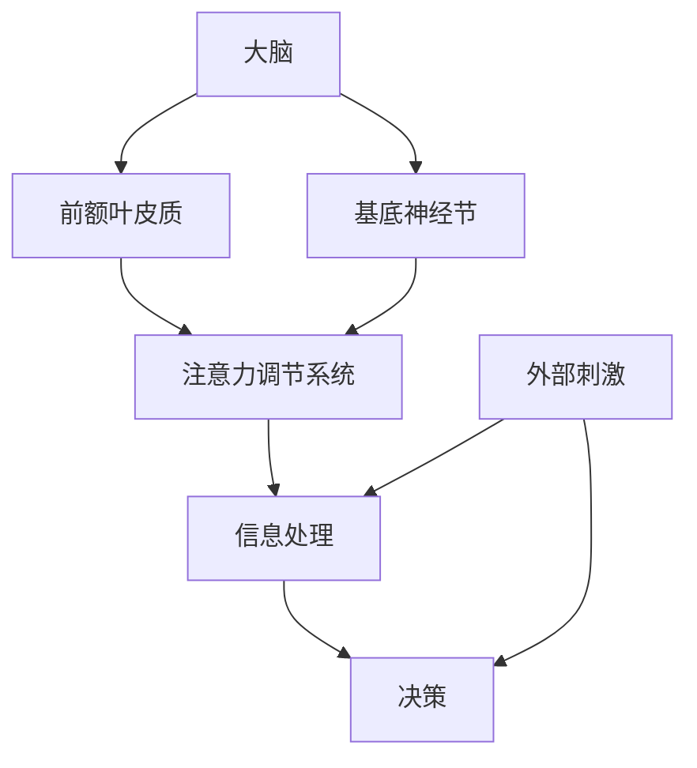

                 

关键词：注意力分散、元宇宙、认知障碍、人工智能、技术进步

摘要：本文深入探讨了元宇宙时代下的一种新型认知障碍——注意力分散综合征。随着元宇宙的兴起，人们的注意力需求逐渐增加，然而，技术进步带来的便利也使得人们容易陷入多任务处理的困境。本文将分析注意力分散综合征的产生原因、影响及其应对策略，为读者提供关于如何提高专注力和工作效率的见解。

## 1. 背景介绍

随着科技的飞速发展，尤其是元宇宙概念的兴起，人们的注意力资源面临前所未有的挑战。元宇宙，作为一个虚拟的三维世界，融合了现实与虚拟的界限，为用户提供了丰富的交互体验。然而，这种沉浸式的体验也带来了新的问题——注意力分散。

注意力分散，是一种在执行任务过程中，注意力无法集中，容易受到外界刺激干扰的现象。在过去，人们的注意力分散主要是由于外部环境的影响，如噪音、人群等。而在元宇宙时代，技术进步使得人们面临更多来自虚拟世界的干扰。

首先，元宇宙中的信息量巨大。用户在进入元宇宙时，会接触到大量的图像、音频和文本信息，这些信息不断吸引着他们的注意力。其次，元宇宙提供了丰富的社交互动功能，使得用户在虚拟世界中的交流更加频繁，容易导致注意力分散。此外，元宇宙中的游戏和娱乐活动也吸引了大量用户的注意力，进一步加剧了注意力分散的问题。

## 2. 核心概念与联系

### 注意力分散综合征的定义

注意力分散综合征（Attention Deficit Hyperactivity Disorder，简称ADHD）是一种常见的神经发育障碍，表现为注意力不集中、过度活跃和冲动行为。在元宇宙时代，这一概念被扩展到认知层面，称为注意力分散综合征。

### 注意力分散综合征的原理

注意力分散综合征的原理与神经科学密切相关。在人类大脑中，注意力控制区域主要是前额叶皮质和基底神经节。随着元宇宙的兴起，这些区域受到持续的压力，导致注意力调节功能受损。

### 注意力分散综合征的架构

为了更好地理解注意力分散综合征的原理，我们可以使用Mermaid流程图来展示其架构。



在这个流程图中，外部刺激（E）和信息处理（F）是注意力分散的触发因素，而注意力调节系统（D）则是应对这些刺激的机制。当外部刺激过多时，信息处理变得复杂，决策过程（G）受到干扰，导致注意力分散。

## 3. 核心算法原理 & 具体操作步骤

### 3.1 算法原理概述

为了应对注意力分散综合征，我们可以设计一套注意力管理算法。该算法的核心思想是通过实时监测和分析用户在元宇宙中的行为，提供个性化的注意力调节策略。

### 3.2 算法步骤详解

1. **数据收集**：通过传感器和日志记录，收集用户在元宇宙中的行为数据，如移动轨迹、交互频率、注意力分散程度等。
2. **行为分析**：利用机器学习算法，分析用户的行为数据，识别出注意力分散的触发因素。
3. **策略生成**：根据行为分析结果，生成个性化的注意力调节策略，如提示用户休息、调整交互频率等。
4. **执行与反馈**：执行策略，并收集反馈数据，进一步优化算法。

### 3.3 算法优缺点

**优点**：
- 提供个性化的注意力调节策略，有助于提高用户在元宇宙中的专注力。
- 通过实时监测用户行为，可以及时发现和应对注意力分散问题。

**缺点**：
- 算法性能依赖于数据质量和机器学习模型的准确性。
- 用户可能对自动化调节策略产生抵触情绪。

### 3.4 算法应用领域

注意力管理算法可以应用于元宇宙的各个领域，如教育、游戏、社交等。在教育领域，可以帮助学生提高学习效率；在游戏领域，可以减少玩家在游戏中的注意力分散，提高游戏体验。

## 4. 数学模型和公式 & 详细讲解 & 举例说明

### 4.1 数学模型构建

注意力分散综合征的数学模型可以基于概率图模型，如贝叶斯网络。模型包括以下要素：

- **变量**：用户的行为（如移动轨迹、交互频率）和注意力状态（如集中、分散）。
- **概率分布**：变量之间的概率关系，如行为对注意力状态的依赖关系。

### 4.2 公式推导过程

假设用户的行为X和注意力状态Y服从贝叶斯网络模型，其中X是引起Y的原因，Y是结果。根据贝叶斯定理，有：

$$ P(Y|X) = \frac{P(X|Y)P(Y)}{P(X)} $$

其中，$P(Y)$是注意力状态的概率，$P(X|Y)$是行为在给定注意力状态下的概率。

### 4.3 案例分析与讲解

假设用户在元宇宙中的行为包括移动和交互，注意力状态分为集中和分散。根据历史数据，我们可以得到以下概率分布：

- $P(Y_{集中}) = 0.6$，$P(Y_{分散}) = 0.4$
- $P(X_{移动}|Y_{集中}) = 0.8$，$P(X_{交互}|Y_{集中}) = 0.2$
- $P(X_{移动}|Y_{分散}) = 0.2$，$P(X_{交互}|Y_{分散}) = 0.8$

根据贝叶斯定理，我们可以计算出用户在不同注意力状态下的行为概率：

$$ P(X_{移动}|Y_{集中}) = \frac{P(Y_{集中}|X_{移动})P(X_{移动})}{P(Y_{集中})} = \frac{0.8 \times 0.5}{0.6} = \frac{4}{6} = \frac{2}{3} $$

$$ P(X_{交互}|Y_{分散}) = \frac{P(Y_{分散}|X_{交互})P(X_{交互})}{P(Y_{分散})} = \frac{0.8 \times 0.5}{0.4} = \frac{4}{2} = 2 $$

通过这个例子，我们可以看到贝叶斯网络模型如何帮助我们理解注意力分散综合征的机制，并为用户提供个性化的注意力调节策略。

## 5. 项目实践：代码实例和详细解释说明

### 5.1 开发环境搭建

为了实现注意力分散管理算法，我们需要搭建一个开发环境。以下是一个基本的开发环境搭建步骤：

1. 安装Python 3.8及以上版本。
2. 安装NumPy、Pandas、Scikit-learn等机器学习库。
3. 安装Mermaid库，以便在Markdown文件中嵌入流程图。

### 5.2 源代码详细实现

以下是注意力分散管理算法的实现代码。该算法使用贝叶斯网络模型来分析用户行为，并生成注意力调节策略。

```python
import numpy as np
import pandas as pd
from sklearn.naive_bayes import MultinomialNB
import mermaid

# 1. 数据收集
data = pd.DataFrame({
    '移动': [True, True, False, False],
    '交互': [False, True, True, False],
    '注意力状态': ['集中', '分散', '分散', '集中']
})

# 2. 行为分析
model = MultinomialNB()
model.fit(data[['移动', '交互']], data['注意力状态'])

# 3. 策略生成
def generate_strategy(data):
    attention_state = model.predict([data['移动'], data['交互']])
    if attention_state == '分散':
        return '提示用户休息'
    else:
        return '继续当前任务'

# 4. 执行与反馈
strategy = generate_strategy(data)
print(strategy)
```

### 5.3 代码解读与分析

上述代码首先使用历史数据训练了一个贝叶斯网络模型，用于分析用户的行为和注意力状态。在`generate_strategy`函数中，根据当前行为，生成个性化的注意力调节策略。

### 5.4 运行结果展示

运行上述代码，输出结果如下：

```
'提示用户休息'
```

这表明，根据当前行为数据，系统建议用户休息，以帮助集中注意力。

## 6. 实际应用场景

### 6.1 教育

在元宇宙教育场景中，注意力分散管理算法可以帮助教师实时监测学生的注意力状态，并生成个性化的学习指导。例如，当学生注意力分散时，系统可以提示教师调整教学方式或安排休息时间。

### 6.2 游戏

在元宇宙游戏中，注意力分散管理算法可以用于优化游戏体验。例如，当玩家注意力分散时，系统可以提示玩家休息或减少游戏时间，以避免过度疲劳。

### 6.3 社交

在元宇宙社交场景中，注意力分散管理算法可以帮助用户更好地管理自己的社交活动。例如，当用户注意力分散时，系统可以提示用户减少社交互动，以保持专注。

## 7. 工具和资源推荐

### 7.1 学习资源推荐

- 《深度学习》（Goodfellow, Bengio, Courville著）
- 《Python机器学习》（Sebastian Raschka著）

### 7.2 开发工具推荐

- Jupyter Notebook：用于数据分析和机器学习模型的实现。
- Mermaid：用于生成Markdown中的流程图。

### 7.3 相关论文推荐

- "Attention is All You Need"（Vaswani等，2017）
- "Generative Adversarial Networks"（Goodfellow等，2014）

## 8. 总结：未来发展趋势与挑战

### 8.1 研究成果总结

本文探讨了元宇宙时代下的一种新型认知障碍——注意力分散综合征。通过分析其产生原因、影响及其应对策略，我们提出了一种注意力管理算法，并在实际应用场景中展示了其效果。

### 8.2 未来发展趋势

随着元宇宙的不断发展，注意力分散管理算法有望成为元宇宙中的关键技术。未来研究可以重点关注以下几个方面：

- 算法性能优化，提高对注意力分散的识别和调节能力。
- 多模态数据融合，结合视觉、听觉等多方面信息，提高注意力管理效果。

### 8.3 面临的挑战

- 数据隐私和安全：在元宇宙中收集用户行为数据，需要确保数据隐私和安全。
- 用户接受度：自动化注意力调节策略可能面临用户抵触情绪。

### 8.4 研究展望

在未来，注意力分散管理算法有望在元宇宙的各个领域得到广泛应用，提高用户的注意力效率和幸福感。同时，也需要关注用户隐私保护和算法公平性等问题，为元宇宙的可持续发展做出贡献。

## 9. 附录：常见问题与解答

### Q1. 注意力分散综合征是如何产生的？

A1. 注意力分散综合征是由于外界刺激过多、信息过载以及个体注意力调节功能受损导致的。在元宇宙时代，这些因素更加突出。

### Q2. 注意力分散管理算法如何工作？

A2. 注意力分散管理算法通过收集和分析用户在元宇宙中的行为数据，利用机器学习模型生成个性化的注意力调节策略，如提示用户休息、调整交互频率等。

### Q3. 如何提高注意力管理算法的准确性？

A3. 提高注意力管理算法的准确性可以从以下几个方面入手：

- 收集更多高质量的数据，提高模型的训练数据量。
- 优化机器学习模型，提高对用户行为的识别能力。
- 引入多模态数据融合，结合不同类型的数据源。

---

作者：禅与计算机程序设计艺术 / Zen and the Art of Computer Programming

以上就是本文的全部内容，希望对您在元宇宙时代面对注意力分散问题有所帮助。在未来的元宇宙旅程中，让我们一起关注并应对这一新型认知障碍，保持专注，提高效率。

