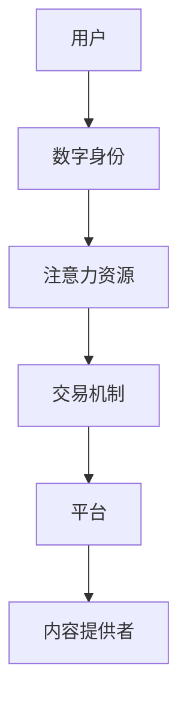

                 

关键词：注意力经济，元宇宙，信息交易，信息市场，数据隐私，数字身份，去中心化，区块链，智能合约，AI技术。

> 摘要：随着元宇宙的兴起，注意力经济成为新时代下信息交易的核心。本文深入探讨了注意力市场的基本概念、核心原理、数学模型及其应用，旨在为读者揭示这一新兴领域的技术潜力和挑战。

## 1. 背景介绍

在互联网时代，注意力成为了一种稀缺资源。用户在信息海洋中游走，注意力被无数弹窗、推送和广告所占据。随着元宇宙的逐步兴起，注意力经济成为数字经济的重要组成部分。元宇宙是一个虚拟的三维空间，用户可以在其中创建自己的数字身份，进行社交互动、消费娱乐等活动。在这个虚拟世界中，注意力成为了可交易的资产。

注意力市场的核心在于信息的有效分配。传统的信息传播模式是自上而下的，由中心化平台控制。而在注意力市场中，信息的传播更加去中心化，用户可以自由选择关注的内容，从而实现信息的有效匹配。这种模式不仅提升了用户的体验，也为信息提供者带来了新的盈利途径。

## 2. 核心概念与联系

### 2.1 注意力市场的基本概念

注意力市场是一个基于区块链技术的去中心化信息交易系统。在这个市场中，用户可以通过数字身份进行交易，购买或出售注意力资源。注意力资源包括用户的时间、点击、评论等行为，这些行为可以转化为数字资产。

### 2.2 注意力市场的架构

注意力市场的架构包括以下几个关键部分：

1. **用户（User）**：在注意力市场中，用户是信息交易的主体。用户通过数字身份进行注册，并在平台上进行注意力资源的交易。

2. **内容提供者（Content Provider）**：内容提供者是信息市场中的信息源。他们通过发布内容吸引用户的注意力，并将注意力转化为收益。

3. **平台（Platform）**：平台是注意力市场的运营方，负责维护市场秩序，确保交易的公正性和透明性。

4. **交易机制（Trading Mechanism）**：交易机制是注意力市场运作的核心。它包括注意力资源的定价、交易流程和结算方式等。

### 2.3 注意力市场的连接图（Mermaid 流程图）



## 3. 核心算法原理 & 具体操作步骤

### 3.1 算法原理概述

注意力市场的核心算法是基于区块链的智能合约。智能合约通过预定的规则自动执行交易，确保交易的透明性和不可篡改性。

### 3.2 算法步骤详解

1. **用户注册**：用户通过数字身份在平台上注册，并获得注意力资源的初始额度。

2. **内容发布**：内容提供者发布内容，并设置注意力资源的定价。

3. **用户购买**：用户根据兴趣购买内容提供者的注意力资源，交易通过智能合约自动执行。

4. **交易结算**：交易完成后，平台根据智能合约的记录进行结算，并将收益分配给内容提供者。

### 3.3 算法优缺点

**优点**：

- **去中心化**：去中心化架构确保了信息交易的自由和公正。
- **透明性**：智能合约的透明性保证了交易的公正性。
- **安全性**：区块链技术确保了数据的不可篡改性。

**缺点**：

- **复杂性**：区块链技术的复杂性可能导致用户使用困难。
- **交易效率**：区块链的共识机制可能导致交易效率较低。

### 3.4 算法应用领域

注意力市场在元宇宙中的应用广泛，包括但不限于以下领域：

- **虚拟商品交易**：用户可以购买虚拟商品，如游戏道具、虚拟房产等。
- **数字广告**：内容提供者可以通过注意力市场投放数字广告。
- **社交媒体**：用户可以在社交媒体上通过注意力市场进行内容分享和互动。

## 4. 数学模型和公式 & 详细讲解 & 举例说明

### 4.1 数学模型构建

注意力市场的数学模型主要涉及注意力资源的定价模型和交易模型。

- **注意力资源定价模型**：

$$
P = f(A, C, T)
$$

其中，$P$ 为注意力资源的定价，$A$ 为用户关注度，$C$ 为内容质量，$T$ 为时间因素。

- **交易模型**：

$$
T = P \times Q
$$

其中，$T$ 为交易总额，$P$ 为注意力资源的定价，$Q$ 为购买数量。

### 4.2 公式推导过程

**注意力资源定价模型**：

假设用户关注度 $A$ 与内容质量 $C$ 成正比，与时间因素 $T$ 成反比，可以得到以下公式：

$$
P = k \times \frac{A}{C} \times T
$$

其中，$k$ 为比例常数。

**交易模型**：

假设交易总额 $T$ 与注意力资源的定价 $P$ 和购买数量 $Q$ 成正比，可以得到以下公式：

$$
T = P \times Q
$$

### 4.3 案例分析与讲解

**案例**：假设一个用户关注度为 100，内容质量为 10，时间为 1 小时。根据注意力资源定价模型，可以得到定价为：

$$
P = k \times \frac{100}{10} \times 1 = 10k
$$

如果用户购买 10 个注意力资源，交易总额为：

$$
T = 10k \times 10 = 100k
$$

## 5. 项目实践：代码实例和详细解释说明

### 5.1 开发环境搭建

本案例使用以太坊智能合约进行开发，开发环境搭建步骤如下：

1. 安装 Node.js 和 npm。
2. 安装 Truffle框架。
3. 配置 Ethereum 钱包，如 MetaMask。

### 5.2 源代码详细实现

```solidity
pragma solidity ^0.8.0;

contract AttentionMarket {
    mapping(address => uint256) public userAttention;
    mapping(address => uint256) public contentPrice;

    function buyAttention(address contentProvider, uint256 amount) public payable {
        require(msg.value == amount * contentPrice[contentProvider], "Invalid payment amount");
        userAttention[msg.sender] += amount;
        payable(contentProvider).transfer(msg.value);
    }

    function setContentPrice(uint256 newPrice) public {
        contentPrice[msg.sender] = newPrice;
    }
}
```

### 5.3 代码解读与分析

1. **用户注意力管理**：使用 `mapping` 结构管理用户的注意力资源。
2. **购买注意力**：用户调用 `buyAttention` 函数购买注意力资源，通过智能合约进行支付和转移。
3. **设置内容定价**：内容提供者调用 `setContentPrice` 函数设置自己的内容定价。

### 5.4 运行结果展示

通过 Truffle 框架，用户可以在本地测试网络中运行智能合约，并进行注意力资源的购买和设置。

## 6. 实际应用场景

### 6.1 虚拟商品交易

用户可以在注意力市场上购买虚拟商品，如游戏道具、虚拟房产等。通过智能合约确保交易的安全性和透明性。

### 6.2 数字广告

内容提供者可以在注意力市场上投放数字广告，通过用户的注意力资源获取收益。

### 6.3 社交媒体

用户在社交媒体上通过注意力市场进行内容分享和互动，提升用户体验和互动性。

## 7. 工具和资源推荐

### 7.1 学习资源推荐

- 《区块链技术指南》
- 《智能合约开发指南》
- 《以太坊开发文档》

### 7.2 开发工具推荐

- Truffle
- Remix
- MetaMask

### 7.3 相关论文推荐

- "Attention, Trust, and Value: A Theory of Social Commerce"
- "Cryptocurrency and Smart Contracts: A Practical Introduction to Bitcoin and Ethereum"
- "Decentralized Applications: Building Blockchains and Smart Contracts"

## 8. 总结：未来发展趋势与挑战

### 8.1 研究成果总结

注意力市场在元宇宙时代展示了巨大的潜力，其去中心化的特性为信息交易提供了新的解决方案。

### 8.2 未来发展趋势

- 注意力市场的应用场景将更加丰富。
- 区块链技术的不断演进将提升注意力市场的效率和安全性。
- AI 技术的融合将使注意力市场更加智能化。

### 8.3 面临的挑战

- 交易效率的提升。
- 用户隐私保护。
- 市场监管的适应性。

### 8.4 研究展望

注意力市场的研究将继续深化，探索更高效的交易机制和更智能的推荐系统，为元宇宙时代下的信息交易提供有力支持。

## 9. 附录：常见问题与解答

### 9.1 注意力市场与传统信息市场的区别是什么？

注意力市场与传统信息市场的主要区别在于信息传播的去中心化和注意力资源的可交易性。

### 9.2 注意力市场的安全性如何保障？

注意力市场通过区块链技术确保交易的透明性和不可篡改性，同时智能合约的执行规则保障了交易的公正性。

### 9.3 注意力市场如何保护用户隐私？

注意力市场采用数字身份进行交易，用户隐私信息得到有效保护。同时，去中心化架构避免了中心化平台的隐私泄露风险。

----------------------------------------------------------------
### 作者署名
作者：禅与计算机程序设计艺术 / Zen and the Art of Computer Programming
----------------------------------------------------------------

请注意，本文档仅提供了一个结构化的文章模板，实际内容需要您根据技术细节和要求进行撰写。本文档中的代码和数学模型仅为示例，您需要根据实际情况进行适当调整和完善。文章中的所有引用和参考都应遵循相应的学术规范和引用标准。

