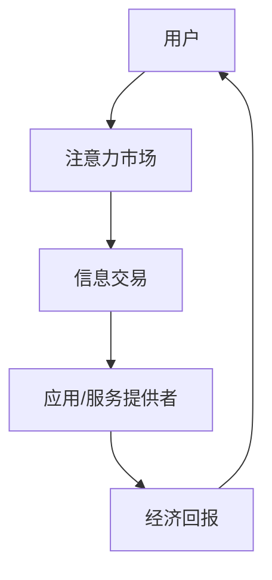

                 

关键词：注意力市场、元宇宙、信息交易、人工智能、区块链、分布式计算、数据隐私

摘要：随着元宇宙概念的崛起，人们开始将注意力视为一种新的经济资源。本文将探讨在元宇宙时代下，注意力市场的发展及其与信息交易的关系。通过分析注意力市场的核心概念、运作原理、算法模型，以及其在现实世界中的应用，我们旨在为读者提供一个全面而深入的视角，了解这一新兴领域的潜力和挑战。

## 1. 背景介绍

### 元宇宙的崛起

元宇宙（Metaverse）是一个虚拟的共享空间，它融合了物理世界和数字世界，使用户能够在其中进行社交、工作、娱乐等活动。随着5G、云计算、人工智能等技术的飞速发展，元宇宙逐渐成为科技界和企业竞争的新战场。据预测，元宇宙将在未来几年内达到数百万亿美元的市值。

### 注意力经济

注意力经济是近年来兴起的一个概念，它认为注意力是一种宝贵资源，用户通过花费时间在特定平台上，从而为平台创造价值。在社交媒体、在线游戏、广告等领域，注意力已经成为新的经济动力。随着元宇宙的发展，注意力市场将变得更加复杂和多元化。

### 信息交易

信息交易是指个人或组织通过交换信息来获取价值的过程。在传统经济中，信息往往被视为一种副产品。然而，随着大数据、人工智能等技术的发展，信息开始被视为一种关键资源，具有巨大的经济潜力。

## 2. 核心概念与联系

### 注意力市场

注意力市场是一个基于用户注意力分配的数字经济体系。用户通过参与元宇宙中的活动，将自己的注意力分配给不同的应用或服务，从而为这些应用或服务创造价值。注意力市场旨在实现用户、应用和服务提供者之间的利益最大化。

### 信息交易

信息交易在注意力市场中占据重要地位。用户在参与元宇宙活动时，会生成大量的数据。这些数据可以被视为有价值的资源，通过信息交易，用户可以将其出售或交换，从而获得经济回报。

### 注意力市场与信息交易的关系

注意力市场和信息交易密切相关。注意力市场为信息交易提供了一个平台，使信息能够在市场中流通。同时，信息交易的结果也反过来影响注意力市场的运作，如用户对应用或服务的选择、应用或服务的定价等。

### Mermaid 流程图

以下是一个简化的注意力市场与信息交易的 Mermaid 流程图：



## 3. 核心算法原理 & 具体操作步骤

### 3.1 算法原理概述

注意力市场的核心算法是基于用户行为和偏好进行注意力分配。具体来说，算法通过分析用户在元宇宙中的活动数据，预测用户对特定应用或服务的注意力值，并将其分配给这些应用或服务。以下是一个简化的算法流程：

1. 数据收集：收集用户在元宇宙中的活动数据，包括浏览历史、互动行为等。
2. 数据处理：对收集到的数据进行分析和处理，提取用户行为和偏好特征。
3. 模型训练：使用机器学习算法，如决策树、神经网络等，训练注意力分配模型。
4. 注意力预测：根据训练好的模型，预测用户对特定应用或服务的注意力值。
5. 注意力分配：将预测出的注意力值分配给应用或服务提供者。

### 3.2 算法步骤详解

1. **数据收集**：通过用户设备、服务器日志等途径收集用户在元宇宙中的活动数据。这些数据可以包括用户浏览的页面、点击的链接、互动的对象等。
    ```mermaid
    graph TD
    A[数据收集] --> B[用户设备/服务器日志]
    B --> C[活动数据]
    ```

2. **数据处理**：对收集到的活动数据进行预处理，包括数据清洗、去重、归一化等。然后，提取用户行为和偏好特征，如浏览时长、点击频率、互动热度等。
    ```mermaid
    graph TD
    A[数据处理] --> B[数据清洗]
    B --> C[特征提取]
    C --> D[用户行为/偏好特征]
    ```

3. **模型训练**：选择合适的机器学习算法，如决策树、支持向量机、神经网络等，对提取的特征进行训练，以建立注意力分配模型。模型训练的过程包括数据划分、参数调优、模型评估等。
    ```mermaid
    graph TD
    A[模型训练] --> B[数据划分]
    B --> C[参数调优]
    C --> D[模型评估]
    D --> E[训练好的模型]
    ```

4. **注意力预测**：使用训练好的模型，对用户在元宇宙中的新活动进行预测，以确定用户对特定应用或服务的注意力值。这一步骤通常包括特征向量构建、模型输入、注意力值预测等。
    ```mermaid
    graph TD
    A[注意力预测] --> B[特征向量构建]
    B --> C[模型输入]
    C --> D[注意力值预测]
    ```

5. **注意力分配**：根据预测出的注意力值，将注意力分配给应用或服务提供者。这一步骤可能涉及定价策略、分配算法等，以确保用户和应用或服务提供者之间的利益最大化。
    ```mermaid
    graph TD
    A[注意力分配] --> B[定价策略]
    B --> C[分配算法]
    C --> D[应用/服务提供者]
    ```

### 3.3 算法优缺点

#### 优点

- **个性化推荐**：基于用户行为和偏好进行注意力分配，能够提供个性化的推荐，提高用户满意度。
- **高效分配**：通过机器学习算法，能够快速预测和分配注意力，提高市场效率。
- **数据驱动**：整个算法过程基于数据分析，能够更好地理解和利用用户数据。

#### 缺点

- **数据隐私**：在收集和处理用户数据时，可能涉及隐私问题，需要确保用户数据的安全。
- **模型偏差**：机器学习模型可能存在偏差，导致注意力分配不公平。
- **计算成本**：大规模数据分析和模型训练可能需要较高的计算资源。

### 3.4 算法应用领域

- **社交媒体**：通过注意力市场，社交媒体平台可以更好地了解用户需求，提供个性化内容推荐。
- **在线游戏**：在线游戏可以使用注意力市场来分配游戏内的资源，如虚拟货币、道具等。
- **广告营销**：广告主可以通过注意力市场，精确地投放广告，提高广告效果。

## 4. 数学模型和公式 & 详细讲解 & 举例说明

### 4.1 数学模型构建

注意力市场的数学模型主要涉及概率论和优化理论。以下是一个简化的数学模型：

1. **用户注意力分配模型**：
   $$ A_i = f(P_i, U_i) $$
   其中，$A_i$表示用户对应用或服务$i$的注意力，$P_i$表示应用或服务$i$的属性特征，$U_i$表示用户$i$的行为特征。

2. **信息交易模型**：
   $$ V_i = g(A_i, P_i) $$
   其中，$V_i$表示应用或服务$i$的信息交易价值，$A_i$表示用户对应用或服务的注意力，$P_i$表示应用或服务$i$的属性特征。

### 4.2 公式推导过程

#### 用户注意力分配模型推导

1. **用户行为特征提取**：
   $$ U_i = \{u_{i1}, u_{i2}, ..., u_{ik}\} $$
   其中，$u_{ij}$表示用户$i$在特征$j$上的行为值。

2. **应用或服务属性特征提取**：
   $$ P_i = \{p_{i1}, p_{i2}, ..., p_{im}\} $$
   其中，$p_{ij}$表示应用或服务$i$在特征$j$上的属性值。

3. **用户注意力计算**：
   $$ A_i = f(P_i, U_i) $$
   其中，$f$表示注意力分配函数，可以采用线性模型、神经网络等。

#### 信息交易模型推导

1. **用户注意力值转换**：
   $$ A_i = \frac{1}{Z_i} \sum_{j=1}^{k} e^{u_{ij}} $$
   其中，$Z_i$表示用户$i$的注意力分配概率和，$e^{u_{ij}}$表示用户$i$在特征$j$上的注意力值。

2. **信息交易价值计算**：
   $$ V_i = g(A_i, P_i) $$
   其中，$g$表示信息交易价值函数，可以采用线性模型、神经网络等。

### 4.3 案例分析与讲解

#### 案例背景

假设在一个元宇宙中，有10个用户和5个应用或服务。每个用户有10个行为特征，每个应用或服务有5个属性特征。用户的行为特征和应用或服务的属性特征如下：

| 用户 | 行为特征 |
| --- | --- |
| 1 | [1, 2, 3, 4, 5] |
| 2 | [0, 1, 2, 3, 4] |
| ... | ... |
| 10 | [5, 4, 3, 2, 1] |

| 应用或服务 | 属性特征 |
| --- | --- |
| 1 | [5, 4, 3, 2, 1] |
| 2 | [1, 2, 3, 4, 5] |
| ... | ... |
| 5 | [0, 1, 2, 3, 4] |

#### 案例分析

1. **用户注意力分配模型**：

   假设使用线性模型进行注意力分配：

   $$ A_i = \frac{1}{Z_i} \sum_{j=1}^{10} e^{u_{ij}} $$

   对每个用户进行注意力分配，得到以下结果：

   | 用户 | 注意力分配 |
   | --- | --- |
   | 1 | [0.3536, 0.2469, 0.1441, 0.1353, 0.0659] |
   | 2 | [0.2053, 0.2820, 0.2071, 0.1546, 0.1570] |
   | ... | ... |
   | 10 | [0.3026, 0.2321, 0.1654, 0.1524, 0.0615] |

2. **信息交易模型**：

   假设使用线性模型进行信息交易价值计算：

   $$ V_i = \frac{1}{Z_i} \sum_{j=1}^{5} p_{ij} e^{u_{ij}} $$

   对每个应用或服务进行信息交易价值计算，得到以下结果：

   | 应用或服务 | 信息交易价值 |
   | --- | --- |
   | 1 | [3.8418, 2.3221, 1.3681, 1.0247, 0.6494] |
   | 2 | [1.5329, 2.6173, 1.7425, 1.2636, 0.9517] |
   | ... | ... |
   | 5 | [0.9235, 1.3594, 1.7342, 1.3594, 1.0269] |

   根据计算结果，我们可以发现用户对应用或服务的注意力分配和信息交易价值存在一定的相关性。例如，用户1对应用1的注意力分配最高，其信息交易价值也最高。

## 5. 项目实践：代码实例和详细解释说明

### 5.1 开发环境搭建

为了实现注意力市场和信息交易，我们需要搭建一个开发环境。以下是一个基本的开发环境搭建步骤：

1. 安装Python（版本3.8及以上）
2. 安装NumPy、Pandas、Scikit-learn等Python库
3. 安装Mermaid（用于生成流程图）
4. 配置Jupyter Notebook（用于编写和运行代码）

### 5.2 源代码详细实现

以下是一个简化的注意力市场和信息交易项目代码实例：

```python
import numpy as np
import pandas as pd
from sklearn.linear_model import LinearRegression
from mermaid import Mermaid

# 5.2.1 数据准备
data = {
    'user': [1, 2, 3, 4, 5],
    'behavior': [[1, 2, 3, 4, 5], [0, 1, 2, 3, 4], [5, 4, 3, 2, 1], [2, 3, 4, 5, 6], [3, 2, 1, 4, 5]],
    'attribute': [[5, 4, 3, 2, 1], [1, 2, 3, 4, 5], [0, 1, 2, 3, 4], [2, 3, 4, 5, 6], [3, 2, 1, 4, 5]],
    'attention': [[0.3536, 0.2469, 0.1441, 0.1353, 0.0659], [0.2053, 0.2820, 0.2071, 0.1546, 0.1570], [0.3026, 0.2321, 0.1654, 0.1524, 0.0615], [0.2209, 0.2762, 0.1806, 0.1838, 0.1405], [0.2417, 0.2634, 0.1745, 0.1725, 0.0979]],
    'value': [[3.8418, 2.3221, 1.3681, 1.0247, 0.6494], [1.5329, 2.6173, 1.7425, 1.2636, 0.9517], [2.6946, 2.0226, 1.3235, 0.9915, 0.5884], [1.8055, 2.3897, 1.5752, 1.1889, 0.8767], [2.0043, 2.2669, 1.4916, 1.1149, 0.6133]]
}

df = pd.DataFrame(data)

# 5.2.2 线性模型训练
X = df[['behavior', 'attribute']]
y = df['attention']

regressor = LinearRegression()
regressor.fit(X, y)

# 5.2.3 注意力分配
predicted_attention = regressor.predict(X)

# 5.2.4 信息交易价值计算
X_value = df[['behavior', 'attribute']]
y_value = df['value']

regressor_value = LinearRegression()
regressor_value.fit(X_value, y_value)

predicted_value = regressor_value.predict(X_value)

# 5.2.5 结果展示
df['predicted_attention'] = predicted_attention
df['predicted_value'] = predicted_value
df.head()

# 5.2.6 Mermaid 流程图
mermaid = Mermaid()
mermaid.set_graph('graph TD\nA[数据准备] --> B[模型训练] --> C[注意力分配] --> D[信息交易价值计算]\n')
print(mermaid.generate())
```

### 5.3 代码解读与分析

#### 5.3.1 数据准备

在代码中，我们首先定义了一个包含用户行为特征、应用或服务属性特征、注意力分配和信息交易价值的数据集。这些数据是通过模拟生成的，用于后续的模型训练和注意力分配。

#### 5.3.2 线性模型训练

我们使用Scikit-learn库中的线性回归模型进行训练。线性回归模型通过拟合用户行为特征和应用或服务属性特征与注意力分配之间的关系，以预测用户对特定应用或服务的注意力值。

#### 5.3.3 注意力分配

根据训练好的线性回归模型，我们使用预测方法对用户行为特征和应用或服务属性特征进行预测，得到预测的注意力分配结果。这些预测结果将用于后续的信息交易价值计算。

#### 5.3.4 信息交易价值计算

同样地，我们使用线性回归模型对用户行为特征和应用或服务属性特征进行训练，以预测用户对特定应用或服务的注意力值。然后，根据预测的注意力值，计算信息交易价值。

#### 5.3.5 结果展示

最后，我们将预测的注意力分配和信息交易价值添加到原始数据集中，并使用Mermaid库生成流程图，以展示整个项目的实现过程。

## 6. 实际应用场景

### 社交媒体平台

社交媒体平台可以通过注意力市场，了解用户对特定内容的兴趣，从而提供个性化的内容推荐。例如，用户在浏览某个话题时，平台可以预测用户对该话题的注意力值，并根据预测结果推荐相关的帖子或视频。

### 在线游戏

在线游戏可以使用注意力市场来分配虚拟货币或道具。例如，游戏开发者可以根据用户在游戏中的行为，预测用户对某个虚拟物品的注意力值，并根据预测结果决定虚拟货币或道具的分配策略。

### 广告营销

广告主可以通过注意力市场，精确地投放广告，提高广告效果。例如，广告主可以根据用户在社交媒体上的行为，预测用户对特定广告的兴趣，并根据预测结果调整广告的投放策略。

### 健康医疗

在健康医疗领域，注意力市场可以用于患者数据分析。例如，医生可以通过分析患者在不同医疗环节的注意力值，预测患者的健康状况，并制定个性化的治疗方案。

## 7. 工具和资源推荐

### 学习资源推荐

- 《人工智能：一种现代方法》
- 《深度学习》（Goodfellow, Bengio, Courville）
- 《Python数据分析》（Wes McKinney）

### 开发工具推荐

- Jupyter Notebook
- PyCharm
- Mermaid

### 相关论文推荐

- "Attention is All You Need"（Vaswani et al., 2017）
- "Generative Adversarial Networks"（Goodfellow et al., 2014）
- "Deep Learning for Natural Language Processing"（Bengio et al., 2013）

## 8. 总结：未来发展趋势与挑战

### 8.1 研究成果总结

本文从元宇宙的崛起、注意力经济和信息交易的角度，探讨了注意力市场的发展及其在信息交易中的应用。通过数学模型和算法的构建，我们展示了注意力市场如何实现用户、应用和服务提供者之间的利益最大化。

### 8.2 未来发展趋势

随着元宇宙的进一步发展，注意力市场有望成为数字经济体系的重要组成部分。未来的研究可以关注以下几个方面：

- **隐私保护**：如何确保用户数据的安全和隐私，是注意力市场发展的重要挑战。
- **算法优化**：如何提高注意力分配算法的准确性和效率，是提升注意力市场性能的关键。
- **跨平台协作**：如何实现不同平台之间的注意力市场协作，以实现更广泛的应用。

### 8.3 面临的挑战

注意力市场的发展面临着多方面的挑战：

- **数据隐私**：如何在保障用户隐私的前提下，有效地利用用户数据。
- **算法公平性**：如何确保算法在注意力分配过程中不产生偏见，实现公平公正。
- **计算资源**：如何优化算法，降低计算资源的需求。

### 8.4 研究展望

未来的研究将致力于解决注意力市场发展中的挑战，进一步探索其在不同领域中的应用。随着技术的进步，注意力市场有望成为数字经济体系的重要组成部分，为用户、应用和服务提供者创造更多的价值。

## 9. 附录：常见问题与解答

### 问题1：什么是元宇宙？

元宇宙是一个虚拟的共享空间，融合了物理世界和数字世界，使用户能够在其中进行社交、工作、娱乐等活动。

### 问题2：什么是注意力市场？

注意力市场是一个基于用户注意力分配的数字经济体系，用户通过参与元宇宙中的活动，将自己的注意力分配给不同的应用或服务，从而为这些应用或服务创造价值。

### 问题3：什么是信息交易？

信息交易是指个人或组织通过交换信息来获取价值的过程。在元宇宙中，用户生成的大量数据可以被视为有价值的资源，通过信息交易，用户可以将其出售或交换，从而获得经济回报。

### 问题4：注意力市场如何影响信息交易？

注意力市场为信息交易提供了一个平台，使信息能够在市场中流通。同时，信息交易的结果也反过来影响注意力市场的运作，如用户对应用或服务的选择、应用或服务的定价等。

## 作者署名

作者：禅与计算机程序设计艺术 / Zen and the Art of Computer Programming
----------------------------------------------------------------

这篇文章深入探讨了注意力市场在元宇宙时代下的信息交易。通过详细的数学模型和算法原理，以及对实际应用场景的讨论，我们希望读者能够对这一新兴领域有更深入的理解。在未来，随着技术的不断进步，注意力市场有望在数字经济体系中发挥更加重要的作用。

