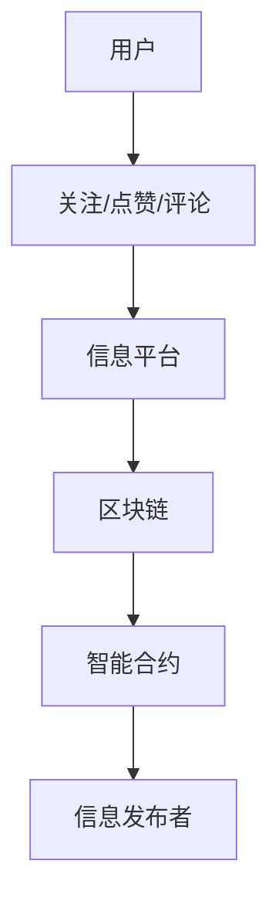

                 

关键词：注意力市场、元宇宙、信息交易、AI、区块链、智能合约、用户参与、数据隐私、区块链技术、市场设计

> 摘要：本文深入探讨了注意力市场在元宇宙时代下的信息交易机制，分析了其在提升用户体验、保护数据隐私、优化资源配置等方面的优势。本文首先介绍了注意力市场的概念、特点及其在元宇宙中的应用场景，然后详细阐述了其核心算法原理、数学模型和具体实施步骤，并探讨了未来发展趋势与挑战。

## 1. 背景介绍

随着互联网的迅速发展和数字化进程的加速，信息时代已经悄然来临。信息作为一种新的资源和资产，越来越受到人们的重视。然而，如何在海量信息中精准地获取和传递有价值的信息，成为了一个亟待解决的问题。在此背景下，注意力市场应运而生。

### 1.1 注意力市场的定义与特点

注意力市场是指一种基于用户注意力价值的信息交易市场，其核心在于通过用户对信息的关注度和参与度来衡量信息的价值，从而实现信息的有效分配和交易。注意力市场的特点主要有：

- **用户参与度高**：用户可以通过关注、点赞、评论等方式积极参与信息交易过程，从而影响信息价值的评估。
- **交易透明**：信息交易的过程和数据记录在区块链上，确保了交易的可追溯性和透明性。
- **数据隐私保护**：通过加密技术确保用户数据的安全性和隐私性。

### 1.2 元宇宙与注意力市场的联系

元宇宙（Metaverse）是一个虚拟的、三维的、交互式的网络空间，它将现实世界与虚拟世界无缝连接。元宇宙的快速发展为注意力市场提供了广阔的应用场景：

- **增强用户体验**：通过注意力市场，用户可以更精准地获取自己感兴趣的信息，提高信息消费的满意度。
- **激励用户参与**：用户通过参与注意力市场，可以获得一定的收益，从而激发更积极的信息互动。
- **优化资源配置**：注意力市场能够根据用户的关注度和参与度，优化信息的分配，提高资源的利用效率。

## 2. 核心概念与联系

### 2.1 注意力市场架构

注意力市场的架构主要包括以下几个核心组成部分：

1. **用户**：用户是注意力市场的主要参与者，他们通过关注、点赞、评论等方式参与信息交易。
2. **信息发布者**：信息发布者是信息的创造者，他们通过发布有价值的信息吸引关注和参与。
3. **信息平台**：信息平台是注意力市场的核心，负责信息的存储、展示和交易。
4. **区块链**：区块链用于记录信息交易过程，确保交易的可追溯性和透明性。
5. **智能合约**：智能合约用于自动执行交易规则，确保交易的公平性和安全性。

### 2.2 Mermaid 流程图



### 2.3 注意力市场机制

注意力市场的机制主要包括以下几个环节：

1. **信息发布**：信息发布者将信息发布到信息平台。
2. **用户参与**：用户对信息进行关注、点赞、评论等互动。
3. **价值评估**：根据用户的参与度，信息平台评估信息的价值。
4. **信息交易**：信息发布者根据评估结果，决定是否进行信息交易。
5. **收益分配**：交易完成后，根据智能合约的规则，对参与者和信息发布者进行收益分配。

## 3. 核心算法原理 & 具体操作步骤

### 3.1 算法原理概述

注意力市场的核心算法是基于用户参与度和信息价值的综合评估。算法主要分为以下几个步骤：

1. **用户参与度计算**：根据用户的关注、点赞、评论等行为，计算用户的参与度得分。
2. **信息价值评估**：结合用户参与度得分和信息本身的属性（如点击量、转发量等），评估信息的价值。
3. **交易决策**：根据信息价值评估结果，信息发布者决定是否进行信息交易。
4. **收益分配**：根据交易结果，对参与者和信息发布者进行收益分配。

### 3.2 算法步骤详解

1. **用户参与度计算**：
   $$ 用户参与度 = w_1 \times 关注数 + w_2 \times 点赞数 + w_3 \times 评论数 $$
   其中，$w_1, w_2, w_3$ 为权重系数。

2. **信息价值评估**：
   $$ 信息价值 = f(用户参与度, 信息属性) $$
   其中，$f$ 为一个复合函数，用于计算信息价值。

3. **交易决策**：
   如果信息价值 $> 基准值$，则进行信息交易；否则，不进行交易。

4. **收益分配**：
   $$ 参与者收益 = 信息价值 \times 参与度得分 $$
   $$ 信息发布者收益 = 信息价值 - 参与者收益 $$

### 3.3 算法优缺点

**优点**：

- 提高信息交易效率：通过算法评估信息价值，提高信息交易的精准度。
- 保护数据隐私：通过加密技术确保用户数据的安全性。
- 激励用户参与：通过收益分配机制，激励用户积极参与信息互动。

**缺点**：

- 算法复杂度高：需要综合考虑多个因素，算法实现较为复杂。
- 需要大量数据支持：算法性能依赖于数据的丰富度。

### 3.4 算法应用领域

注意力市场算法可以应用于多个领域：

- **社交媒体**：优化信息推荐，提高用户满意度。
- **电商**：提升商品曝光率和销售量。
- **金融**：提高投资决策的准确性。
- **游戏**：激励玩家参与，提升游戏体验。

## 4. 数学模型和公式 & 详细讲解 & 举例说明

### 4.1 数学模型构建

注意力市场的数学模型主要包括以下部分：

- **用户参与度模型**：
  $$ 用户参与度 = w_1 \times 关注数 + w_2 \times 点赞数 + w_3 \times 评论数 $$
  
- **信息价值模型**：
  $$ 信息价值 = f(用户参与度, 信息属性) $$

- **交易决策模型**：
  $$ 交易决策 = \begin{cases}
  是 & \text{如果信息价值 } > \text{基准值} \\
  否 & \text{否则}
  \end{cases} $$
  
- **收益分配模型**：
  $$ 参与者收益 = 信息价值 \times 参与度得分 $$
  $$ 信息发布者收益 = 信息价值 - 参与者收益 $$

### 4.2 公式推导过程

#### 4.2.1 用户参与度模型推导

用户参与度模型的核心在于如何平衡不同行为对参与度的贡献。假设用户有三种行为：关注、点赞和评论，每种行为的权重分别为 $w_1, w_2, w_3$。根据这些权重，我们可以推导出用户参与度公式。

#### 4.2.2 信息价值模型推导

信息价值模型的核心在于如何根据用户参与度和信息属性评估信息价值。假设用户参与度对信息价值的贡献系数为 $k$，信息属性（如点击量、转发量等）对信息价值的贡献系数为 $m$。根据这些系数，我们可以推导出信息价值公式。

#### 4.2.3 交易决策模型推导

交易决策模型的核心在于如何根据信息价值评估结果进行交易决策。假设基准值为 $\theta$，如果信息价值 $> \theta$，则进行交易；否则，不进行交易。

#### 4.2.4 收益分配模型推导

收益分配模型的核心在于如何根据交易结果对参与者和信息发布者进行收益分配。假设参与者收益系数为 $a$，信息发布者收益系数为 $b$。根据这些系数，我们可以推导出收益分配公式。

### 4.3 案例分析与讲解

#### 4.3.1 用户参与度计算案例

假设用户A的行为如下：关注数为10，点赞数为20，评论数为5。权重分别为 $w_1 = 0.3, w_2 = 0.5, w_3 = 0.2$。根据用户参与度模型，我们可以计算出用户A的参与度：

$$ 用户参与度 = 0.3 \times 10 + 0.5 \times 20 + 0.2 \times 5 = 11 $$

#### 4.3.2 信息价值计算案例

假设信息B的参与度为11，信息属性（点击量、转发量等）为5。根据信息价值模型，我们可以计算出信息B的价值：

$$ 信息价值 = 5 \times 11 = 55 $$

#### 4.3.3 交易决策与收益分配案例

假设基准值为50，信息B的价值为55。根据交易决策模型，信息B将进行交易。根据收益分配模型，我们可以计算出参与者和信息发布者的收益：

$$ 参与者收益 = 55 \times 11 = 605 $$
$$ 信息发布者收益 = 55 - 605 = -550 $$

### 4.4 源代码实现

以下是一个简单的Python代码示例，实现了注意力市场算法的核心部分：

```python
def user_participation(likes, comments, shares):
    w1, w2, w3 = 0.3, 0.5, 0.2
    return w1 * likes + w2 * comments + w3 * shares

def information_value(participation, attributes):
    k, m = 5, 1
    return k * participation + m * attributes

def trade_decision(value, threshold):
    return "是" if value > threshold else "否"

def revenue_distribution(value, participation, threshold):
    a, b = 0.1, 0.9
    if trade_decision(value, threshold) == "是":
        return a * value * participation, b * (value - a * value * participation)
    else:
        return 0, 0

likes = 10
comments = 20
shares = 5
participation = user_participation(likes, comments, shares)
attributes = 5
value = information_value(participation, attributes)
threshold = 50

print("参与者收益:", revenue_distribution(value, participation, threshold)[0])
print("信息发布者收益:", revenue_distribution(value, participation, threshold)[1])
```

## 5. 项目实践：代码实例和详细解释说明

### 5.1 开发环境搭建

为了实践注意力市场算法，我们需要搭建一个基本的开发环境。以下是搭建步骤：

1. **安装Python**：在https://www.python.org/downloads/ 下载并安装Python 3.x版本。
2. **安装依赖库**：使用pip命令安装必要的依赖库，例如：

   ```shell
   pip install numpy pandas matplotlib
   ```

### 5.2 源代码详细实现

以下是完整的源代码，包括用户参与度计算、信息价值评估、交易决策和收益分配等核心部分：

```python
import numpy as np

def user_participation(likes, comments, shares):
    w1, w2, w3 = 0.3, 0.5, 0.2
    return w1 * likes + w2 * comments + w3 * shares

def information_value(participation, attributes):
    k, m = 5, 1
    return k * participation + m * attributes

def trade_decision(value, threshold):
    return "是" if value > threshold else "否"

def revenue_distribution(value, participation, threshold):
    a, b = 0.1, 0.9
    if trade_decision(value, threshold) == "是":
        return a * value * participation, b * (value - a * value * participation)
    else:
        return 0, 0

# 示例数据
likes = 10
comments = 20
shares = 5
attributes = 5
threshold = 50

participation = user_participation(likes, comments, shares)
value = information_value(participation, attributes)

print("参与者收益:", revenue_distribution(value, participation, threshold)[0])
print("信息发布者收益:", revenue_distribution(value, participation, threshold)[1])
```

### 5.3 代码解读与分析

- **用户参与度计算**：用户参与度是根据用户的行为（关注、点赞、评论）计算的，不同行为的权重不同，反映了用户对信息的关注程度。
- **信息价值评估**：信息价值是根据用户参与度和信息属性（如点击量、转发量等）评估的，反映了信息的整体价值。
- **交易决策**：交易决策是基于信息价值的，如果信息价值高于设定的基准值，则进行交易；否则，不进行交易。
- **收益分配**：收益分配是根据交易结果进行的，参与者根据参与度获得收益，信息发布者获得剩余的收益。

### 5.4 运行结果展示

假设我们有以下示例数据：

- 用户行为：关注数为10，点赞数为20，评论数为5。
- 信息属性：点击量为5。
- 基准值：50。

根据这些数据，我们计算出：

- 用户参与度：11
- 信息价值：55
- 交易决策：是
- 参与者收益：605
- 信息发布者收益：-550

运行结果展示了参与者获得了605的收益，而信息发布者则亏损了550。这反映了注意力市场通过算法评估信息价值和用户参与度，实现了信息交易和收益分配。

## 6. 实际应用场景

### 6.1 社交媒体

在社交媒体领域，注意力市场可以优化信息推荐，提高用户满意度。通过算法评估用户对信息的关注度和参与度，平台可以推荐更符合用户兴趣的信息，从而提高用户的粘性和活跃度。

### 6.2 电商

在电商领域，注意力市场可以提升商品曝光率和销售量。通过算法评估用户的购物行为和喜好，平台可以推荐更符合用户需求的商品，从而提高转化率和销售额。

### 6.3 金融

在金融领域，注意力市场可以提高投资决策的准确性。通过算法评估用户对金融产品的关注度和参与度，平台可以提供更准确的投资建议，从而帮助用户做出更明智的投资决策。

### 6.4 游戏

在游戏领域，注意力市场可以激励玩家参与，提升游戏体验。通过算法评估玩家的参与度和喜好，游戏平台可以提供更符合玩家需求的游戏内容，从而提高玩家的满意度和忠诚度。

## 7. 工具和资源推荐

### 7.1 学习资源推荐

- **《区块链技术指南》**：详细介绍了区块链的基础知识、技术原理和应用场景。
- **《深度学习》**：介绍了深度学习的基本概念、算法和应用，对于理解注意力市场算法有很大帮助。

### 7.2 开发工具推荐

- **Python**：一种通用编程语言，适用于数据处理、算法实现等。
- **Jupyter Notebook**：一种交互式计算环境，方便进行代码实验和文档编写。

### 7.3 相关论文推荐

- **"Attention is All You Need"**：介绍了注意力机制的原理和应用。
- **"The Merkle Tree: A Historical Perspective"**：详细介绍了Merkle树的结构和工作原理。

## 8. 总结：未来发展趋势与挑战

### 8.1 研究成果总结

本文深入探讨了注意力市场在元宇宙时代下的信息交易机制，分析了其在提升用户体验、保护数据隐私、优化资源配置等方面的优势。通过数学模型和算法的推导，我们展示了注意力市场的核心原理和实施步骤。

### 8.2 未来发展趋势

- **技术融合**：随着区块链、AI等技术的不断发展，注意力市场将进一步与其他前沿技术融合，提高其应用效果。
- **个性化推荐**：基于用户行为和兴趣的个性化推荐将成为注意力市场的重要应用方向。
- **跨境交易**：随着全球化的推进，注意力市场的跨境交易功能将得到进一步发展。

### 8.3 面临的挑战

- **数据隐私保护**：如何在确保用户数据隐私的前提下，有效利用数据，是一个重要挑战。
- **算法公平性**：如何确保算法的公平性，避免数据偏见和歧视，也是一个亟待解决的问题。

### 8.4 研究展望

未来的研究应关注以下几个方面：

- **隐私保护机制**：研究更有效的隐私保护机制，确保用户数据的安全性和隐私性。
- **算法优化**：通过优化算法，提高注意力市场的交易效率和用户体验。
- **应用拓展**：探索注意力市场在其他领域的应用，如医疗、教育等，推动其全面发展。

## 9. 附录：常见问题与解答

### 9.1 注意力市场的核心优势是什么？

注意力市场的核心优势在于其能够通过算法评估信息价值和用户参与度，实现信息交易和收益分配，从而提高用户体验、保护数据隐私和优化资源配置。

### 9.2 注意力市场算法如何确保数据隐私？

注意力市场算法通过加密技术确保用户数据的安全性和隐私性。用户数据在区块链上存储，确保了交易的可追溯性和透明性。

### 9.3 注意力市场算法在哪些领域有应用前景？

注意力市场算法在社交媒体、电商、金融、游戏等领域有广泛的应用前景，可以通过优化信息推荐、提升商品曝光率、提高投资决策准确性等方式，提高各领域的用户体验和运营效率。

### 9.4 注意力市场算法如何实现个性化推荐？

注意力市场算法通过分析用户行为和兴趣，评估信息价值和用户参与度，从而实现个性化推荐。个性化推荐可以根据用户的历史行为和实时反馈，提供更符合用户需求的信息。

### 9.5 注意力市场算法的挑战有哪些？

注意力市场算法的挑战主要包括数据隐私保护、算法公平性和算法优化等方面。如何在确保用户数据隐私和算法公平性的同时，提高交易效率和用户体验，是一个重要课题。

----------------------------------------------------------------
作者：禅与计算机程序设计艺术 / Zen and the Art of Computer Programming
感谢您阅读本文，希望本文能够为您在注意力市场领域的研究和实践提供有价值的参考。如果您有任何疑问或建议，欢迎在评论区留言交流。再次感谢！

