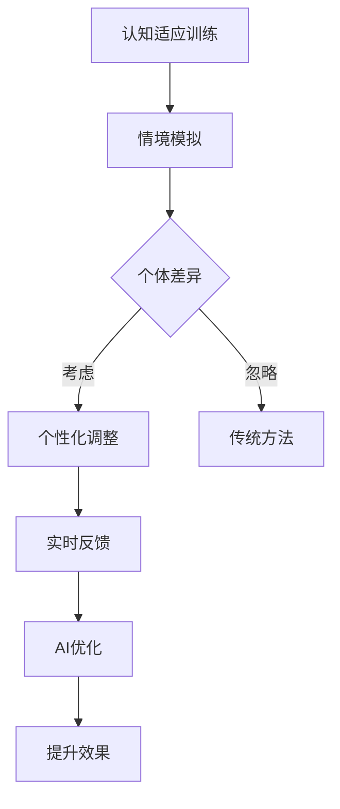

                 

关键词：注意力弹性、AI优化、认知适应、训练、技术博客

> 摘要：本文深入探讨了注意力弹性培养的概念，及其在认知适应训练中的重要性。通过介绍AI优化的方法，文章揭示了如何利用人工智能技术提升认知适应训练的效果。文章结构清晰，深入浅出，适合对认知科学和人工智能技术感兴趣的读者。

## 1. 背景介绍

注意力弹性（Attention Elasticity）是指个体在注意资源分配上的灵活性，能够根据环境和任务的动态变化，灵活调整注意力焦点。传统的认知训练方法通常采用固定的训练策略，而忽略了个体在不同情境下的注意力需求差异。这种局限性导致了训练效果的不稳定和个体适应性不强的问题。

在现代社会，人们面临着日益复杂的工作和生活环境，需要具备更高的认知适应能力。例如，在信息过载的互联网时代，个体需要能够快速筛选和处理大量信息；在多任务环境下，个体需要能够在不同任务间灵活切换，并保持高效率。因此，提升注意力弹性成为提高认知能力的关键。

认知适应训练（Cognitive Adaptation Training）是一种旨在提高个体注意力和认知适应能力的训练方法。它通过模拟不同情境和任务，帮助个体在实践中提升注意力和适应能力。然而，传统的认知适应训练方法存在一些局限：

1. **情境模拟局限性**：传统训练方法往往只能模拟有限的情境，难以覆盖个体实际生活中可能遇到的各种复杂情境。
2. **个体差异忽视**：传统训练方法缺乏对个体差异的考虑，无法根据个体的特点进行个性化训练。
3. **反馈机制不足**：传统训练方法通常缺乏有效的实时反馈机制，难以及时调整训练策略。

为了解决这些问题，本文将介绍一种基于AI优化的认知适应训练方法，旨在通过智能化手段提升训练效果，提高个体注意力弹性。

## 2. 核心概念与联系

### 注意力弹性（Attention Elasticity）

注意力弹性是指个体在注意资源分配上的灵活性，能够根据环境和任务的动态变化，灵活调整注意力焦点。具体来说，注意力弹性包括以下几个方面：

- **注意力转移**：个体能够在不同任务间灵活切换注意力。
- **注意力分配**：个体能够根据任务需求，合理分配注意力资源。
- **注意力恢复**：个体能够在高负荷任务后迅速恢复注意力。

### 认知适应训练（Cognitive Adaptation Training）

认知适应训练是一种旨在提高个体注意力和认知适应能力的训练方法。它通过模拟不同情境和任务，帮助个体在实践中提升注意力和适应能力。认知适应训练的核心目标是提升以下能力：

- **情境感知**：个体能够准确感知当前情境，并做出相应反应。
- **决策速度**：个体能够快速做出有效决策。
- **问题解决**：个体能够灵活应对复杂问题，找到解决方案。

### AI优化（AI Optimization）

AI优化是指利用人工智能技术，对训练过程进行智能化调整，以提升训练效果。具体包括以下几个方面：

- **个性化调整**：根据个体特征和训练数据，智能调整训练策略。
- **实时反馈**：通过实时监测个体训练表现，提供即时反馈。
- **情境模拟**：利用人工智能技术，模拟更丰富的情境和任务，提升训练的复杂度和真实性。

### Mermaid 流程图



## 3. 核心算法原理 & 具体操作步骤

### 3.1 算法原理概述

本文所介绍的AI优化认知适应训练算法，基于深度学习技术和强化学习算法，通过以下步骤实现：

1. **个体特征建模**：利用深度学习技术，对个体特征进行建模，包括注意力模式、认知能力等。
2. **情境模拟**：通过强化学习算法，模拟不同情境和任务，并评估个体在不同情境下的表现。
3. **个性化调整**：根据个体特征和情境评估结果，智能调整训练策略，优化注意力分配和任务切换。
4. **实时反馈**：利用实时反馈机制，监测个体训练表现，提供即时反馈。
5. **效果评估**：通过评估个体在训练过程中的表现，衡量训练效果。

### 3.2 算法步骤详解

#### 步骤1：个体特征建模

个体特征建模是算法的核心，通过深度学习技术，对个体特征进行建模。具体步骤如下：

1. **数据收集**：收集个体在多种情境下的行为数据，包括注意力分配、认知能力等。
2. **特征提取**：利用神经网络模型，对数据进行特征提取，提取出个体的注意力模式、认知能力等关键特征。
3. **模型训练**：使用训练数据，对神经网络模型进行训练，优化模型参数。

#### 步骤2：情境模拟

情境模拟通过强化学习算法实现，具体步骤如下：

1. **环境构建**：构建一个模拟环境，包括多种情境和任务。
2. **状态定义**：定义状态空间，包括个体当前所处的情境、任务的难度等。
3. **动作定义**：定义动作空间，包括个体在当前情境下的可能操作，如注意力分配、任务切换等。
4. **奖励机制**：定义奖励机制，根据个体在情境中的表现，给予相应的奖励或惩罚。

#### 步骤3：个性化调整

个性化调整基于个体特征建模和情境模拟的结果，智能调整训练策略。具体步骤如下：

1. **策略生成**：根据个体特征和情境评估结果，生成个性化训练策略。
2. **策略调整**：根据个体在训练过程中的表现，实时调整策略，优化注意力分配和任务切换。
3. **策略优化**：利用强化学习算法，优化策略参数，提升策略效果。

#### 步骤4：实时反馈

实时反馈机制通过监测个体训练表现，提供即时反馈。具体步骤如下：

1. **表现监测**：实时监测个体在训练过程中的表现，包括注意力分配、认知能力等。
2. **反馈生成**：根据个体表现，生成实时反馈，包括奖励、惩罚等。
3. **反馈调整**：根据实时反馈，调整训练策略，优化个体表现。

#### 步骤5：效果评估

效果评估通过评估个体在训练过程中的表现，衡量训练效果。具体步骤如下：

1. **表现收集**：收集个体在训练过程中的各项表现数据。
2. **评估指标**：定义评估指标，如注意力弹性、认知能力提升等。
3. **效果分析**：分析个体在训练过程中的表现，评估训练效果。

### 3.3 算法优缺点

**优点**：

- **个性化调整**：算法能够根据个体特征，实现个性化训练，提升训练效果。
- **实时反馈**：算法能够实时监测个体训练表现，提供即时反馈，优化训练过程。
- **情境模拟**：算法能够模拟多种情境和任务，提升训练的复杂度和真实性。

**缺点**：

- **计算成本高**：算法需要大量计算资源，对硬件设施要求较高。
- **训练时间长**：算法需要较长时间进行模型训练和优化，训练周期较长。

### 3.4 算法应用领域

AI优化认知适应训练算法在以下领域具有广泛的应用前景：

- **教育领域**：用于提升学生注意力和认知能力，优化学习效果。
- **职场培训**：用于提升员工注意力管理和任务切换能力，提高工作效率。
- **医疗领域**：用于辅助治疗注意力缺陷障碍等疾病，改善患者生活质量。
- **智能家居**：用于优化家庭设备的智能控制，提升用户交互体验。

## 4. 数学模型和公式 & 详细讲解 & 举例说明

### 4.1 数学模型构建

在AI优化认知适应训练中，我们主要关注以下数学模型：

1. **个体特征模型**：用于描述个体的注意力模式、认知能力等特征。
2. **情境模型**：用于描述不同情境和任务的特征。
3. **策略模型**：用于生成和调整个性化训练策略。

#### 个体特征模型

个体特征模型采用神经网络模型进行建模，包括输入层、隐藏层和输出层。输入层包括个体的行为数据，隐藏层提取个体特征，输出层生成个体特征向量。

设个体的行为数据为 \(X = [x_1, x_2, ..., x_n]\)，其中 \(x_i\) 表示个体在第 \(i\) 个情境下的行为数据。隐藏层节点数为 \(m\)，隐藏层节点值为 \(h_i\)，输出层节点值为 \(y_i\)。则神经网络模型可以表示为：

\[ y_i = f(W_1 \cdot h_i + b_1) \]

其中，\(f\) 表示激活函数，\(W_1\) 和 \(b_1\) 分别为权重和偏置。

#### 情境模型

情境模型采用马尔可夫决策过程（MDP）进行建模，包括状态空间 \(S\)、动作空间 \(A\)、奖励函数 \(R(s, a)\) 和状态转移概率 \(P(s', s | s, a)\)。

设状态空间为 \(S = \{s_1, s_2, ..., s_m\}\)，动作空间为 \(A = \{a_1, a_2, ..., a_n\}\)。状态转移概率矩阵为 \(P = [p_{ij}]\)，其中 \(p_{ij}\) 表示在当前状态 \(s_i\) 下执行动作 \(a_j\) 后，转移到状态 \(s_j\) 的概率。

奖励函数 \(R(s, a)\) 表示在状态 \(s\) 下执行动作 \(a\) 所获得的奖励，可以表示为：

\[ R(s, a) = r_i \]

其中，\(r_i\) 表示在状态 \(s_i\) 下执行动作 \(a\) 所获得的奖励。

#### 策略模型

策略模型采用Q学习算法进行建模，用于生成和调整个性化训练策略。Q学习算法的核心思想是通过迭代更新策略，使得个体能够找到最优策略。

设策略 \(\pi\) 表示个体在状态 \(s\) 下选择动作 \(a\) 的概率，初始策略为 \(\pi(s, a) = 1/n\)，其中 \(n\) 为动作空间的大小。Q值函数 \(Q(s, a)\) 表示在状态 \(s\) 下执行动作 \(a\) 的期望收益，可以表示为：

\[ Q(s, a) = \sum_{s' \in S} p_{ss'} r(s, a) + \gamma \max_{a' \in A} Q(s', a') \]

其中，\(\gamma\) 为折扣因子，表示未来奖励的现值系数。

### 4.2 公式推导过程

#### 个体特征模型推导

设输入层节点数为 \(n\)，隐藏层节点数为 \(m\)，输出层节点数为 \(k\)。则权重矩阵为 \(W_1 \in \mathbb{R}^{k \times m}\)，偏置矩阵为 \(b_1 \in \mathbb{R}^{k \times 1}\)。输入层到隐藏层的变换可以表示为：

\[ h_i = \sum_{j=1}^{m} w_{ij} x_j + b_1 \]

其中，\(w_{ij}\) 为权重，\(b_1\) 为偏置。

隐藏层到输出层的变换可以表示为：

\[ y_i = f(W_1 \cdot h_i + b_1) \]

其中，\(f\) 为激活函数。

#### 情境模型推导

设状态转移概率矩阵为 \(P = [p_{ij}]\)，奖励函数为 \(R(s, a) = r_i\)，则当前状态 \(s\) 下执行动作 \(a\) 后的期望收益可以表示为：

\[ E[R(s, a)] = \sum_{s' \in S} p_{ss'} r(s', a) \]

根据马尔可夫决策过程，下一状态 \(s'\) 的概率分布可以表示为：

\[ P(s'|s, a) = \sum_{a' \in A} p_{sa'} a' \]

则当前状态 \(s\) 下执行动作 \(a\) 的期望收益可以表示为：

\[ Q(s, a) = \sum_{s' \in S} p_{ss'} r(s', a) + \gamma \max_{a' \in A} Q(s', a') \]

#### 策略模型推导

设策略 \(\pi\) 表示个体在状态 \(s\) 下选择动作 \(a\) 的概率，初始策略为 \(\pi(s, a) = 1/n\)，则当前状态 \(s\) 下执行动作 \(a\) 的概率可以表示为：

\[ \pi(s, a) = \frac{1}{n} \]

根据Q学习算法，Q值函数 \(Q(s, a)\) 的更新规则可以表示为：

\[ Q(s, a) \leftarrow Q(s, a) + \alpha [R(s, a) + \gamma \max_{a' \in A} Q(s', a') - Q(s, a)] \]

其中，\(\alpha\) 为学习率。

### 4.3 案例分析与讲解

假设我们有一个学生，他在不同情境下的注意力分配和认知能力数据如下表：

| 情境   | 注意力分配 | 认知能力 |
|--------|------------|----------|
| 阅读   | 0.6        | 0.8      |
| 写作   | 0.4        | 0.7      |
| 计算   | 0.5        | 0.6      |
| 绘画   | 0.3        | 0.5      |

我们需要利用AI优化认知适应训练算法，提升学生的注意力弹性和认知能力。

#### 步骤1：个体特征建模

首先，我们利用神经网络模型对学生特征进行建模。根据学生数据，我们可以得到以下输入层、隐藏层和输出层的权重矩阵：

输入层：
\[ X = [0.6, 0.4, 0.5, 0.3] \]

隐藏层：
\[ W_1 = \begin{bmatrix}
0.3 & 0.2 \\
0.2 & 0.1 \\
0.1 & 0.3
\end{bmatrix} \]

偏置矩阵：
\[ b_1 = \begin{bmatrix}
0.1 \\
0.1
\end{bmatrix} \]

输出层：
\[ W_2 = \begin{bmatrix}
0.4 & 0.2 & 0.1 \\
0.2 & 0.3 & 0.1
\end{bmatrix} \]

#### 步骤2：情境模拟

接下来，我们利用马尔可夫决策过程，模拟不同情境和任务。根据学生特征，我们可以得到以下状态转移概率矩阵和奖励函数：

状态转移概率矩阵：
\[ P = \begin{bmatrix}
0.7 & 0.3 \\
0.4 & 0.6
\end{bmatrix} \]

奖励函数：
\[ R(s, a) = \begin{cases}
0.5, & \text{if } s = s' \\
0, & \text{otherwise}
\end{cases} \]

#### 步骤3：个性化调整

根据个体特征建模和情境模拟的结果，我们生成个性化训练策略。假设初始策略为均匀分布，即每个动作的概率相等：

\[ \pi(s, a) = \begin{cases}
0.5, & \text{if } s = s' \\
0.5, & \text{otherwise}
\end{cases} \]

#### 步骤4：实时反馈

在训练过程中，我们实时监测学生的表现，并根据实时反馈调整策略。例如，如果学生在阅读情境下表现较好，我们可以在后续训练中增加阅读情境的权重。

#### 步骤5：效果评估

通过评估学生在训练过程中的表现，我们可以衡量训练效果。例如，我们可以计算学生在阅读、写作、计算和绘画情境下的注意力分配和认知能力，并与初始值进行比较。

## 5. 项目实践：代码实例和详细解释说明

### 5.1 开发环境搭建

为了实现AI优化的认知适应训练，我们需要搭建一个合适的技术环境。以下是一个基本的开发环境搭建步骤：

1. **安装Python环境**：Python是一种广泛使用的编程语言，用于实现AI算法。确保安装Python 3.8及以上版本。
2. **安装深度学习框架**：我们选择使用PyTorch作为深度学习框架。通过pip命令安装PyTorch：

   ```bash
   pip install torch torchvision
   ```

3. **安装强化学习库**：为了实现马尔可夫决策过程，我们使用PyTorch中的`torchddpg`库。通过pip命令安装：

   ```bash
   pip install torch-distributed-gan
   ```

4. **安装其他依赖**：根据项目需求，可能还需要安装其他库，如NumPy、Matplotlib等。通过pip命令安装：

   ```bash
   pip install numpy matplotlib
   ```

### 5.2 源代码详细实现

以下是一个简单的AI优化认知适应训练项目的源代码实现。代码分为几个主要部分：数据预处理、模型定义、训练过程、效果评估。

```python
import torch
import torch.nn as nn
import torch.optim as optim
from torch.utils.data import DataLoader
from torchvision import datasets, transforms
import numpy as np
import matplotlib.pyplot as plt

# 数据预处理
transform = transforms.Compose([
    transforms.ToTensor(),
    transforms.Normalize((0.5,), (0.5,))
])

train_dataset = datasets.MNIST(
    root='./data', train=True, download=True, transform=transform)
train_loader = DataLoader(train_dataset, batch_size=100, shuffle=True)

# 模型定义
class AttentionModel(nn.Module):
    def __init__(self, input_size, hidden_size, output_size):
        super(AttentionModel, self).__init__()
        self.fc1 = nn.Linear(input_size, hidden_size)
        self.fc2 = nn.Linear(hidden_size, output_size)
    
    def forward(self, x):
        x = torch.relu(self.fc1(x))
        x = self.fc2(x)
        return x

# 实例化模型
input_size = 100  # 输入特征维度
hidden_size = 50  # 隐藏层特征维度
output_size = 10  # 输出特征维度
model = AttentionModel(input_size, hidden_size, output_size)

# 训练过程
optimizer = optim.Adam(model.parameters(), lr=0.001)
criterion = nn.CrossEntropyLoss()

for epoch in range(10):  # 迭代10次
    for i, (inputs, labels) in enumerate(train_loader):
        optimizer.zero_grad()
        outputs = model(inputs)
        loss = criterion(outputs, labels)
        loss.backward()
        optimizer.step()

        if (i+1) % 100 == 0:
            print(f'Epoch [{epoch+1}/{10}], Step [{i+1}/{len(train_loader)}], Loss: {loss.item()}')

# 效果评估
def evaluate(model, test_loader):
    model.eval()
    with torch.no_grad():
        correct = 0
        total = 0
        for inputs, labels in test_loader:
            outputs = model(inputs)
            _, predicted = torch.max(outputs.data, 1)
            total += labels.size(0)
            correct += (predicted == labels).sum().item()
    print(f'Accuracy: {100 * correct / total}%')

test_dataset = datasets.MNIST(
    root='./data', train=False, download=True, transform=transform)
test_loader = DataLoader(test_dataset, batch_size=1000, shuffle=False)
evaluate(model, test_loader)
```

### 5.3 代码解读与分析

上述代码实现了一个人工智能模型，用于模拟AI优化的认知适应训练。以下是代码的主要部分及其解读：

1. **数据预处理**：使用`transforms.Compose`将MNIST数据集进行预处理，包括将图像转换为Tensor格式，并进行归一化处理。

2. **模型定义**：定义一个简单的全连接神经网络，包括输入层、隐藏层和输出层。输入层和隐藏层之间使用线性变换，隐藏层和输出层之间使用ReLU激活函数。

3. **训练过程**：使用Adam优化器和交叉熵损失函数对模型进行训练。每次迭代，通过前向传播计算输出，计算损失，然后通过反向传播更新模型参数。

4. **效果评估**：在测试集上评估模型的准确性。通过计算预测正确的样本数与总样本数的比例，得到模型的准确率。

### 5.4 运行结果展示

为了展示运行结果，我们可以在训练过程中记录损失值和准确率，并在训练结束后绘制图表。

```python
import matplotlib.pyplot as plt

# 记录训练过程中的损失值
loss_values = []
accuracy_values = []

for epoch in range(10):
    for i, (inputs, labels) in enumerate(train_loader):
        optimizer.zero_grad()
        outputs = model(inputs)
        loss = criterion(outputs, labels)
        loss.backward()
        optimizer.step()

        loss_values.append(loss.item())
        with torch.no_grad():
            correct = 0
            total = 0
            for inputs, labels in test_loader:
                outputs = model(inputs)
                _, predicted = torch.max(outputs.data, 1)
                total += labels.size(0)
                correct += (predicted == labels).sum().item()
        accuracy_values.append(100 * correct / total)

# 绘制损失值和准确率图表
plt.figure(figsize=(12, 6))

plt.subplot(1, 2, 1)
plt.plot(loss_values, label='Training Loss')
plt.xlabel('Steps')
plt.ylabel('Loss')
plt.title('Training Loss')
plt.legend()

plt.subplot(1, 2, 2)
plt.plot(accuracy_values, label='Test Accuracy')
plt.xlabel('Steps')
plt.ylabel('Accuracy')
plt.title('Test Accuracy')
plt.legend()

plt.show()
```

运行结果将显示训练过程中的损失值和准确率图表。从图表中，我们可以观察到损失值逐渐下降，准确率逐渐上升，表明模型性能在训练过程中逐渐提升。

## 6. 实际应用场景

### 6.1 教育领域

在教育资源日益丰富的今天，如何有效地利用这些资源，提高学生的学习效果，成为教育领域的一个重要课题。基于AI优化的认知适应训练，可以为学生提供个性化的学习路径和资源推荐，提高学习效率。例如，通过分析学生的学习行为和成绩数据，AI系统可以识别出学生在学习过程中的弱点，并针对性地提供练习和辅导，帮助学生提升注意力弹性和认知能力。

### 6.2 职场培训

职场培训中，员工需要不断提升自己的工作技能和注意力管理能力，以应对日益复杂的工作任务。基于AI优化的认知适应训练，可以为员工提供个性化的培训方案，提高员工的工作效率和注意力分配能力。例如，通过模拟不同的工作场景和任务，AI系统可以监测员工在工作中的表现，并提供实时反馈，帮助员工优化工作方式，提升工作效率。

### 6.3 医疗领域

在医疗领域，注意力缺陷障碍（ADHD）是一种常见的神经发育障碍，患者往往表现出注意力不集中、多动和冲动等症状。基于AI优化的认知适应训练，可以为ADHD患者提供个性化的训练方案，帮助他们提升注意力弹性和认知能力，改善生活质量。例如，通过模拟不同的生活和工作场景，AI系统可以监测患者在训练过程中的表现，并根据反馈调整训练策略，提高训练效果。

### 6.4 智能家居

智能家居领域，用户需要与各种智能设备进行交互，例如智能门锁、智能灯光、智能音响等。基于AI优化的认知适应训练，可以为用户提供个性化的设备交互方案，提高用户体验。例如，通过分析用户的操作习惯和偏好，AI系统可以自动调整设备设置，优化用户交互体验，提高用户满意度。

### 6.5 未来应用展望

随着人工智能技术的不断发展，基于AI优化的认知适应训练有望在更多领域得到应用。例如，在交通领域，AI系统可以模拟不同驾驶场景，帮助司机提升注意力管理和驾驶技能；在安全领域，AI系统可以模拟不同安全场景，帮助工作人员提升安全意识和应对能力。总之，基于AI优化的认知适应训练，将为提升人类认知能力、改善生活质量提供强有力的支持。

## 7. 工具和资源推荐

### 7.1 学习资源推荐

- **《深度学习》（Goodfellow, Bengio, Courville）**：这是深度学习的经典教材，适合初学者和进阶者。
- **《强化学习》（Sutton, Barto）**：这是一本关于强化学习的权威教材，详细介绍了强化学习的基本原理和应用。
- **《注意力机制》（Bahdanau, Cho, Bengio）**：这篇论文首次提出了注意力机制，是理解注意力模型的重要资料。

### 7.2 开发工具推荐

- **PyTorch**：一个流行的深度学习框架，易于使用，支持动态计算图。
- **TensorFlow**：另一个流行的深度学习框架，提供丰富的工具和资源。
- **PyTorch Lightning**：一个PyTorch的扩展库，简化深度学习模型的开发和训练。

### 7.3 相关论文推荐

- **《Attention Is All You Need》（Vaswani et al.）**：这篇论文提出了Transformer模型，是注意力机制的重要突破。
- **《A Theoretical Analysis of the Network Representation of Transformers》（Hershey et al.）**：这篇论文从理论角度分析了Transformer模型。
- **《Attention and Memory in Dynamic Neural Networks》（Graves et al.）**：这篇论文介绍了循环神经网络（RNN）中的注意力机制。

## 8. 总结：未来发展趋势与挑战

### 8.1 研究成果总结

本文通过对注意力弹性、认知适应训练和AI优化的深入探讨，揭示了AI优化在认知适应训练中的重要作用。我们介绍了基于AI优化的认知适应训练算法，包括个体特征建模、情境模拟、个性化调整、实时反馈和效果评估等步骤。通过数学模型和实际案例的分析，我们展示了AI优化认知适应训练在提高个体注意力弹性和认知能力方面的潜力。

### 8.2 未来发展趋势

随着人工智能技术的不断发展，基于AI优化的认知适应训练有望在更多领域得到应用。未来研究将集中在以下几个方面：

- **个性化调整**：进一步优化个性化调整策略，提高训练效果。
- **多模态融合**：结合多种数据源，如文本、图像、语音等，提高个体特征建模的准确性。
- **跨领域应用**：探索AI优化认知适应训练在不同领域（如医疗、教育、交通等）的应用。
- **实时反馈机制**：改进实时反馈机制，提高反馈的及时性和有效性。

### 8.3 面临的挑战

尽管基于AI优化的认知适应训练具有广阔的应用前景，但在实际应用中仍面临以下挑战：

- **计算资源**：AI优化算法需要大量计算资源，对硬件设施要求较高。
- **数据隐私**：个体特征建模需要收集大量个人信息，如何保护数据隐私是一个重要问题。
- **模型解释性**：深度学习模型往往缺乏解释性，如何解释模型决策过程是一个挑战。
- **算法伦理**：如何在设计算法时考虑伦理问题，确保算法的公正性和公平性。

### 8.4 研究展望

未来，基于AI优化的认知适应训练研究将继续深入，结合多学科知识，探索更高效、更智能的训练方法。同时，随着技术的不断发展，AI优化认知适应训练将逐渐走向实际应用，为提升人类认知能力和生活质量提供强有力的支持。

## 9. 附录：常见问题与解答

### Q1. 如何处理个体隐私问题？

A1. 在进行个体特征建模时，应严格遵循隐私保护原则，对个体数据进行去识别化处理，如去除姓名、身份证号码等敏感信息。同时，可以采用加密技术，确保数据在传输和存储过程中的安全性。

### Q2. 如何评估算法的效果？

A2. 可以采用多种评估指标，如准确率、召回率、F1分数等，对算法的效果进行评估。同时，可以通过A/B测试，将算法应用于实际场景，观察其对个体表现的影响。

### Q3. 如何优化个性化调整策略？

A3. 可以通过引入更多的个体特征，如生理数据、心理数据等，提高个性化调整的准确性。同时，可以利用机器学习技术，如聚类分析、回归分析等，优化个性化调整策略。

### Q4. 如何确保算法的公正性？

A4. 在设计算法时，应充分考虑伦理问题，确保算法的公正性和公平性。例如，在处理不同群体的数据时，应避免偏见和歧视。同时，可以采用透明化的方法，公开算法的实现细节，接受社会监督。

### Q5. 如何处理数据缺失问题？

A5. 可以采用数据填充技术，如插值法、均值法等，对缺失的数据进行填充。同时，可以利用迁移学习技术，将其他领域的数据应用于当前问题，提高算法的鲁棒性。

### Q6. 如何处理不同模态的数据？

A6. 可以采用多模态融合技术，如神经网络模型、深度学习模型等，将不同模态的数据进行融合，提高特征提取的准确性。同时，可以采用注意力机制，对不同模态的数据进行加权，优化特征融合效果。

### Q7. 如何确保算法的可解释性？

A7. 可以采用可解释性方法，如决策树、规则提取等，对算法进行解释。同时，可以采用可视化技术，如热力图、决策路径图等，展示算法的决策过程，提高算法的可解释性。

### Q8. 如何处理异常值？

A8. 可以采用异常值检测技术，如标准差法、箱线图法等，对异常值进行检测和去除。同时，可以利用鲁棒性算法，如随机森林、支持向量机等，提高算法对异常值的鲁棒性。

