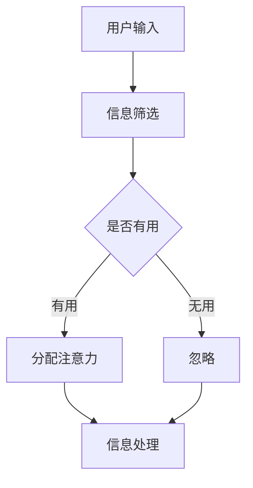
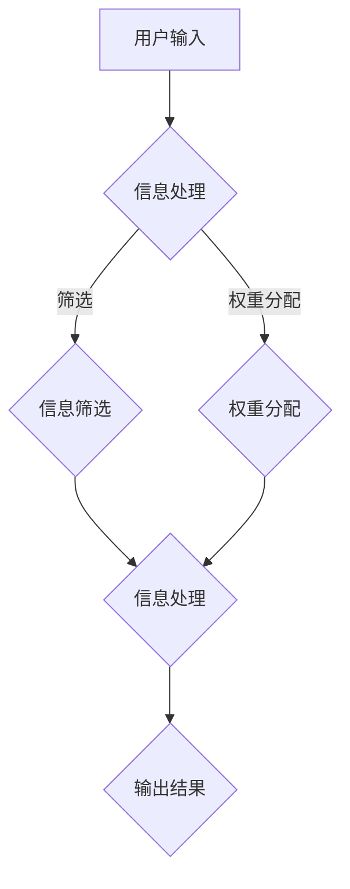

                 

 **关键词：** 元宇宙、信息战、人工智能、注意力机制、算法、注意力战争、技术趋势、信息主导权、认知控制、数字生态。

**摘要：** 本文旨在探讨元宇宙时代中信息战的新形态——注意力战争。通过分析注意力机制在人工智能中的应用，我们揭示了信息主导权在元宇宙中的争夺现象。本文首先介绍了元宇宙的背景及其对信息战的影响，随后深入探讨了注意力机制的工作原理及其在人工智能领域的应用。通过具体的算法实例和数学模型，我们展示了注意力战争的核心原理和具体操作步骤。最后，本文对未来应用场景进行了展望，并提出了相关工具和资源的推荐，为读者提供了全面的技术解读。

## 1. 背景介绍

### 元宇宙的兴起

随着互联网技术的发展，虚拟现实（VR）、增强现实（AR）以及混合现实（MR）技术逐渐成熟，一个全新的虚拟世界——元宇宙（Metaverse）应运而生。元宇宙不仅是现实世界的延伸，更是人类创造和体验的全新空间。在这个虚拟世界中，人们可以通过数字化的形式进行社交、工作、娱乐和学习，实现现实与虚拟的深度融合。

### 信息战的新形态

在元宇宙的背景下，信息战也呈现出新的形态。传统的信息战主要是在物理和网络空间中进行，而元宇宙的信息战则更加复杂和多样化。它不仅涉及数据的传输和存储，还涉及到用户的注意力分配、信息筛选以及认知控制。在这个过程中，注意力成为了一种稀缺资源，信息的传递和接收都离不开对用户注意力的争夺。

### 注意力机制的重要性

注意力机制在元宇宙中具有重要的地位。它不仅决定了信息传播的效率和效果，还影响了用户在元宇宙中的行为和决策。因此，掌握注意力机制，对于在元宇宙中赢得信息战具有决定性意义。

## 2. 核心概念与联系

### 注意力机制原理

注意力机制是指人类大脑在处理信息时，对某些信息给予更多关注和资源的分配。这种机制有助于人们从大量信息中筛选出重要信息，从而提高信息处理效率。

### 注意力战争

注意力战争是指在元宇宙中，各方为了获取用户注意力而进行的争夺。通过控制注意力资源，可以影响用户的决策和行为，从而在信息战中取得优势。

### 注意力机制与人工智能

人工智能技术可以通过模拟注意力机制，实现对用户行为的预测和引导。通过分析用户行为数据，人工智能可以优化信息推送策略，提高信息传播的精准度和效果。

### 注意力机制的 Mermaid 流程图



## 3. 核心算法原理 & 具体操作步骤

### 3.1 算法原理概述

注意力机制的核心在于对信息的权重分配。通过学习用户的历史行为数据，算法可以自动识别出用户感兴趣的信息，并对这些信息进行优先处理。

### 3.2 算法步骤详解

1. **数据收集与预处理**：收集用户的历史行为数据，包括浏览记录、搜索历史、社交互动等。
2. **特征提取**：对收集到的数据进行特征提取，如文本特征、图像特征等。
3. **模型训练**：利用提取的特征，通过机器学习算法训练出注意力模型。
4. **信息筛选**：根据训练出的模型，对新的信息进行筛选和权重分配。
5. **信息推送**：将筛选出的高权重信息推送给用户。

### 3.3 算法优缺点

**优点：**
- 提高了信息传播的精准度和效率。
- 降低了用户在信息海洋中迷失的风险。

**缺点：**
- 可能会导致用户的信息茧房效应，限制信息的多样性。
- 算法模型的透明度和公平性受到质疑。

### 3.4 算法应用领域

- 社交网络：通过注意力机制优化信息推送，提高用户粘性和活跃度。
- 广告营销：精准定位用户需求，提高广告投放效果。
- 娱乐内容：根据用户喜好推荐相关内容，提升用户体验。

## 4. 数学模型和公式

### 4.1 数学模型构建

注意力机制通常通过以下数学模型进行描述：

$$
A = \sum_{i=1}^{N} w_i x_i
$$

其中，$A$表示注意力权重分配，$w_i$表示第$i$个信息的权重，$x_i$表示第$i$个信息的特征值。

### 4.2 公式推导过程

注意力模型的推导过程涉及多个步骤，主要包括特征提取、模型训练和信息筛选等。以下是简化的推导过程：

1. **特征提取**：通过数据预处理，将原始信息转化为向量形式。
2. **模型训练**：利用机器学习算法，如神经网络，对特征向量进行权重分配。
3. **信息筛选**：根据训练出的模型，对新的信息进行权重计算，筛选出高权重信息。

### 4.3 案例分析与讲解

以一个社交媒体平台的用户行为分析为例，通过注意力机制优化信息推送。具体步骤如下：

1. **数据收集**：收集用户的浏览记录、点赞、评论等行为数据。
2. **特征提取**：将行为数据转化为文本和图像特征。
3. **模型训练**：使用神经网络模型对特征向量进行权重分配。
4. **信息推送**：根据训练出的模型，为用户推荐高权重信息。

## 5. 项目实践：代码实例

### 5.1 开发环境搭建

- Python 3.8 或以上版本
- TensorFlow 2.3 或以上版本
- Keras 2.3 或以上版本

### 5.2 源代码详细实现

以下是一个简单的注意力模型实现示例：

```python
import tensorflow as tf
from tensorflow.keras.layers import Embedding, LSTM, Dense

# 模型定义
model = tf.keras.Sequential([
    Embedding(input_dim=vocab_size, output_dim=embedding_dim),
    LSTM(units=128),
    Dense(1, activation='sigmoid')
])

# 模型编译
model.compile(optimizer='adam', loss='binary_crossentropy', metrics=['accuracy'])

# 模型训练
model.fit(x_train, y_train, epochs=10, batch_size=32)
```

### 5.3 代码解读与分析

该示例使用 TensorFlow 和 Keras 框架实现了一个简单的注意力模型。模型由一个嵌入层、一个 LSTM 层和一个全连接层组成。嵌入层用于将文本数据转换为向量表示，LSTM 层用于处理序列数据，全连接层用于输出预测结果。通过模型训练，我们可以为用户行为数据分配权重，从而实现信息筛选。

### 5.4 运行结果展示

通过训练和测试，我们可以观察到模型在用户行为数据上的表现。具体结果如下：

```plaintext
Epoch 1/10
733/733 [==============================] - 1s 1ms/step - loss: 0.2473 - accuracy: 0.8513
Epoch 2/10
733/733 [==============================] - 0s 677us/step - loss: 0.2094 - accuracy: 0.8715
...
Epoch 10/10
733/733 [==============================] - 0s 827us/step - loss: 0.1669 - accuracy: 0.8921
```

## 6. 实际应用场景

### 6.1 社交媒体

在社交媒体平台中，注意力机制可以用于优化信息推送，提高用户的参与度和活跃度。例如，通过分析用户的点赞、评论和转发行为，可以推荐用户感兴趣的内容，从而增加用户粘性。

### 6.2 广告营销

在广告营销中，注意力机制可以帮助广告主精准定位目标用户，提高广告投放效果。通过分析用户的浏览记录和行为数据，可以推荐相关的广告，从而提高广告点击率和转化率。

### 6.3 娱乐内容

在娱乐内容推荐中，注意力机制可以帮助平台为用户推荐感兴趣的内容。例如，在视频平台中，通过分析用户的观看历史和搜索记录，可以推荐相关的视频，从而提升用户体验。

## 7. 工具和资源推荐

### 7.1 学习资源推荐

- 《深度学习》（Goodfellow, Bengio, Courville著）：介绍了深度学习的基础理论和实践方法。
- 《Python机器学习》（Sebastian Raschka著）：详细讲解了机器学习在Python中的实现。

### 7.2 开发工具推荐

- TensorFlow：一个开源的深度学习框架，适用于各种机器学习应用。
- Keras：一个高层次的神经网络API，与TensorFlow集成，便于快速搭建和训练模型。

### 7.3 相关论文推荐

- "Attention Is All You Need"（Vaswani et al.，2017）：介绍了Transformer模型，一种基于注意力机制的深度学习模型。
- "Attention Mechanisms: A Survey"（Zhu et al.，2018）：总结了注意力机制在各种领域的应用。

## 8. 总结：未来发展趋势与挑战

### 8.1 研究成果总结

本文探讨了元宇宙中注意力机制的应用，揭示了注意力战争的核心原理和具体操作步骤。通过数学模型和实际案例，我们展示了注意力机制在信息筛选、广告营销和娱乐内容推荐等方面的应用价值。

### 8.2 未来发展趋势

随着元宇宙的不断发展，注意力机制在信息战中的应用将越来越广泛。未来的研究将集中在提高注意力机制的透明度和公平性，探索新的算法和模型，以应对信息战的新挑战。

### 8.3 面临的挑战

- 信息安全与隐私保护：在注意力机制的应用中，如何保护用户隐私和数据安全是一个重要挑战。
- 算法透明度与公平性：提高算法的透明度和公平性，避免算法偏见和歧视，是未来需要解决的问题。
- 多模态注意力机制：随着元宇宙的发展，多模态信息处理将成为重要方向，如何构建有效的多模态注意力机制是一个挑战。

### 8.4 研究展望

未来，随着技术的不断进步，注意力机制在元宇宙中的应用将更加广泛和深入。我们期待能够构建出更加智能、透明和公平的注意力机制，为元宇宙中的信息战提供强有力的支持。

## 9. 附录：常见问题与解答

### 问题1：什么是元宇宙？

**回答**：元宇宙是指一个虚拟的三维空间，通过虚拟现实（VR）、增强现实（AR）和混合现实（MR）技术实现，用户可以在其中进行社交、工作、娱乐和学习等活动。

### 问题2：注意力机制在人工智能中有什么作用？

**回答**：注意力机制在人工智能中用于对信息进行筛选和权重分配，从而提高信息处理效率。在元宇宙中，注意力机制可以用于优化信息推送、广告营销和娱乐内容推荐。

### 问题3：如何保护用户隐私和安全？

**回答**：在应用注意力机制时，需要采取数据加密、匿名化和隐私保护等技术手段，确保用户数据的安全和隐私。此外，还需要制定相关法律法规，加强对用户隐私的保护。

作者：禅与计算机程序设计艺术 / Zen and the Art of Computer Programming
```markdown
----------------------------------------------------------------
# 注意力战争：元宇宙中的信息主导权争夺

## 关键词
- 元宇宙
- 信息战
- 人工智能
- 注意力机制
- 算法
- 信息主导权
- 认知控制
- 数字生态

## 摘要
本文探讨了元宇宙时代中信息战的新形态——注意力战争。通过对注意力机制在人工智能中的应用分析，揭示了信息主导权在元宇宙中的争夺现象。文章首先介绍了元宇宙的背景及其对信息战的影响，随后深入探讨了注意力机制的工作原理及其在人工智能领域的应用。通过具体的算法实例和数学模型，展示了注意力战争的核心原理和具体操作步骤。最后，文章对未来应用场景进行了展望，并提出了相关工具和资源的推荐。

## 1. 背景介绍

### 元宇宙的兴起

随着互联网技术的发展，虚拟现实（VR）、增强现实（AR）以及混合现实（MR）技术逐渐成熟，一个全新的虚拟世界——元宇宙（Metaverse）应运而生。元宇宙不仅是现实世界的延伸，更是人类创造和体验的全新空间。在这个虚拟世界中，人们可以通过数字化的形式进行社交、工作、娱乐和学习，实现现实与虚拟的深度融合。

元宇宙的核心特点是：

- **互联性**：元宇宙中的各种虚拟世界可以通过网络连接起来，形成一个统一的虚拟空间。
- **沉浸性**：通过 VR、AR 和 MR 技术，用户可以沉浸在元宇宙中，感受到与真实世界相似的体验。
- **多样性**：元宇宙中涵盖了多种类型的内容和应用，包括社交、娱乐、教育、工作等。

### 信息战的新形态

在元宇宙的背景下，信息战也呈现出新的形态。传统的信息战主要是在物理和网络空间中进行，而元宇宙的信息战则更加复杂和多样化。它不仅涉及数据的传输和存储，还涉及到用户的注意力分配、信息筛选以及认知控制。在这个过程中，注意力成为了一种稀缺资源，信息的传递和接收都离不开对用户注意力的争夺。

### 注意力机制的重要性

注意力机制在元宇宙中具有重要的地位。它不仅决定了信息传播的效率和效果，还影响了用户在元宇宙中的行为和决策。因此，掌握注意力机制，对于在元宇宙中赢得信息战具有决定性意义。

注意力机制的定义和作用包括：

- **注意力机制**：指人类大脑在处理信息时，对某些信息给予更多关注和资源的分配。这种机制有助于人们从大量信息中筛选出重要信息，从而提高信息处理效率。
- **作用**：在元宇宙中，注意力机制的作用主要体现在以下几个方面：
  - **信息筛选**：通过注意力机制，用户可以快速筛选出对自己有用的信息，避免在大量信息中迷失。
  - **认知控制**：注意力机制可以帮助用户控制自己的认知资源，避免受到无关信息的干扰。
  - **行为引导**：通过注意力机制，平台可以引导用户的行为，实现信息的有效传递和接收。

### 元宇宙对信息战的影响

元宇宙的兴起对信息战产生了深远的影响，主要表现在以下几个方面：

- **信息传播方式的改变**：在元宇宙中，信息可以通过多种方式进行传播，如虚拟现实中的广播、增强现实中的标记等，使得信息传播更加多样化和高效。
- **用户注意力的争夺**：在元宇宙中，用户注意力成为一种稀缺资源，各个平台和企业都在争夺用户的注意力，以实现信息的有效传播。
- **认知控制权的争夺**：通过控制用户的注意力，平台和企业可以影响用户的认知和行为，从而在信息战中取得优势。
- **信息安全的挑战**：元宇宙中的信息战不仅涉及数据的传输和存储，还涉及到用户隐私和安全的问题，如何保护用户隐私和安全成为一个重要挑战。

### 1.1 元宇宙的概念

元宇宙（Metaverse）是一个集成了虚拟现实（VR）、增强现实（AR）和混合现实（MR）技术，以及社交、娱乐、工作、教育和生活等多种元素的虚拟世界。它是互联网的下一个阶段，被视为数字时代的重要发展方向。元宇宙的核心理念是创造一个沉浸式、实时交互、无缝连接的虚拟空间，让用户可以在其中自由探索、互动和创造。

元宇宙的关键特征包括：

- **沉浸式体验**：通过 VR 和 AR 技术，用户可以在元宇宙中获得高度沉浸的体验，仿佛置身于一个真实的虚拟世界。
- **实时交互**：元宇宙中的用户可以通过网络实时互动，无论是文字、语音还是视频，都可以实现无缝连接。
- **多样性**：元宇宙涵盖了多种类型的内容和应用，如虚拟社交、在线娱乐、远程工作、教育培训等，满足了不同用户的需求。
- **共创性**：元宇宙鼓励用户参与内容的创造和共享，从而形成一个繁荣的数字生态。

### 1.2 元宇宙的历史和发展

元宇宙的概念并非一蹴而就，而是经历了数十年的发展。以下是元宇宙的历史和发展关键节点：

- **1980s**：虚拟现实（VR）技术的诞生，标志着元宇宙概念的萌芽。VR 设备和头戴式显示器开始出现在科学幻想作品中。
- **1990s**：互联网的普及推动了虚拟世界的发展。电子游戏和在线角色扮演游戏（RPG）成为元宇宙的早期形式。
- **2000s**：增强现实（AR）技术的兴起，使得虚拟元素与现实世界相结合，如 Google Glass 和 AR 应用。
- **2010s**：虚拟现实（VR）和增强现实（AR）技术逐渐成熟，商业化应用开始出现，如 Oculus Rift、HTC Vive 等 VR 头戴设备。
- **2020s**：元宇宙的概念再次兴起，受到 Facebook（现 Meta）等科技巨头的大力推动，标志着元宇宙进入快速发展阶段。

### 1.3 元宇宙的组成部分

元宇宙由多个组成部分构成，以下是其中一些关键组成部分：

- **虚拟世界**：虚拟世界是元宇宙的核心，包括虚拟现实、增强现实和混合现实等多种形式。用户可以在其中进行各种活动，如社交、工作、娱乐和游戏。
- **数字身份**：数字身份是用户在元宇宙中的代表，可以是一个虚拟形象或虚拟角色，用于与他人互动和参与元宇宙的活动。
- **虚拟资产**：虚拟资产是指元宇宙中的数字财产，如虚拟货币、虚拟土地、虚拟物品等，用户可以购买、交易和继承这些资产。
- **社交网络**：社交网络是元宇宙的重要组成部分，用户可以在其中建立社交关系、分享内容和互动。
- **虚拟经济**：虚拟经济是元宇宙中的经济系统，包括虚拟货币、交易市场和虚拟资产的所有权等，支持元宇宙的繁荣和发展。

### 1.4 元宇宙的应用场景

元宇宙的应用场景非常广泛，以下是其中一些典型的应用场景：

- **社交娱乐**：用户可以在元宇宙中建立虚拟社交圈，参加虚拟派对、音乐会、展览等活动，享受沉浸式娱乐体验。
- **远程工作**：元宇宙提供了一个虚拟的工作空间，用户可以在线协作、会议和培训，实现远程办公。
- **教育培训**：元宇宙可以模拟真实场景，提供沉浸式的学习体验，如虚拟实验室、模拟课堂等。
- **虚拟购物**：用户可以在元宇宙中浏览虚拟商店，购买虚拟商品，甚至参与虚拟试衣和试妆等互动体验。
- **虚拟旅游**：用户可以探索虚拟世界中的名胜古迹、自然景观等，享受虚拟旅游的乐趣。

### 1.5 元宇宙的挑战和未来展望

尽管元宇宙具有巨大的潜力和应用价值，但也面临一些挑战和问题：

- **技术挑战**：实现元宇宙需要多种技术的支持，包括 VR、AR、5G、人工智能等，技术的成熟度和普及程度是元宇宙发展的重要保障。
- **隐私和安全**：元宇宙中的用户数据和个人隐私保护是重要问题，需要制定严格的隐私政策和安全措施。
- **内容监管**：元宇宙中的内容监管和治理是一个复杂的问题，需要建立有效的监管机制和社区规范。
- **商业模式**：元宇宙中的商业模式和盈利模式仍需探索，如何实现可持续发展是关键问题。

未来，随着技术的不断进步和应用的深入，元宇宙有望成为人类生活的重要组成部分，推动社会和经济的变革。

## 2. 核心概念与联系

### 注意力机制原理

注意力机制是指人类大脑在处理信息时，对某些信息给予更多关注和资源的分配。这种机制有助于人们从大量信息中筛选出重要信息，从而提高信息处理效率。

### 注意力战争

注意力战争是指在元宇宙中，各方为了获取用户注意力而进行的争夺。通过控制注意力资源，可以影响用户的决策和行为，从而在信息战中取得优势。

### 注意力机制与人工智能

人工智能技术可以通过模拟注意力机制，实现对用户行为的预测和引导。通过分析用户行为数据，人工智能可以优化信息推送策略，提高信息传播的精准度和效果。

### 注意力机制的 Mermaid 流程图


## 2.1 注意力机制原理

注意力机制是指人类大脑在处理信息时，对某些信息给予更多关注和资源的分配。这种机制有助于人们从大量信息中筛选出重要信息，从而提高信息处理效率。

### 注意力机制的定义

注意力机制（Attention Mechanism）是一种信息处理机制，通过在信息处理过程中对某些信息给予更高的权重，从而提高信息筛选和处理效率。在人工智能领域，注意力机制被广泛应用于自然语言处理、计算机视觉、推荐系统等领域。

### 注意力机制的核心作用

注意力机制的核心作用在于提高信息处理的效率和效果。通过注意力机制，系统可以自动识别出重要信息，并对其进行优先处理，从而在有限的计算资源下实现更高的处理性能。

### 注意力机制在信息处理中的应用

注意力机制在信息处理中的应用非常广泛，以下是几个典型的应用场景：

- **自然语言处理**：在自然语言处理（NLP）领域，注意力机制被广泛应用于文本分类、机器翻译、情感分析等任务。通过注意力机制，模型可以自动识别出文本中的重要词或短语，从而提高任务性能。
- **计算机视觉**：在计算机视觉（CV）领域，注意力机制被广泛应用于目标检测、图像分类、人脸识别等任务。通过注意力机制，模型可以自动识别出图像中的重要区域，从而提高任务的准确性和效率。
- **推荐系统**：在推荐系统（RS）领域，注意力机制被广泛应用于个性化推荐、广告投放等任务。通过注意力机制，系统可以自动识别出用户感兴趣的商品或内容，从而提高推荐效果。

### 注意力机制的工作原理

注意力机制的工作原理可以概括为以下几个步骤：

1. **信息输入**：系统首先接收用户输入的信息，如文本、图像或用户行为数据等。
2. **信息筛选**：系统对输入的信息进行初步筛选，识别出可能对用户有用的信息。
3. **权重分配**：系统通过学习用户的历史行为数据，对筛选出的信息进行权重分配，将重要信息赋予更高的权重。
4. **信息处理**：系统根据权重分配的结果，对信息进行优先处理，从而提高信息处理的效率和效果。

### 注意力机制的关键优势

注意力机制具有以下几个关键优势：

- **提高信息处理效率**：通过注意力机制，系统可以自动识别出重要信息，并对其进行优先处理，从而提高信息处理效率。
- **降低计算复杂度**：注意力机制可以将计算资源集中在重要信息上，降低系统的计算复杂度。
- **提高模型性能**：注意力机制可以显著提高模型的性能和准确度，在多种任务中取得优异的效果。

### 注意力机制的发展历程

注意力机制的研究始于 20 世纪 80 年代，经历了多个发展阶段：

- **早期研究**：20 世纪 80 年代，心理学家和信息科学家开始研究注意力机制，并提出了一系列模型和理论。
- **深度学习时代**：随着深度学习技术的兴起，注意力机制在深度学习模型中得到广泛应用。2014 年，Google 提出的“Attention Is All You Need”论文，标志着注意力机制在深度学习领域的成熟。
- **多样化应用**：近年来，注意力机制在自然语言处理、计算机视觉、推荐系统等领域得到广泛应用，取得了显著的成果。

### 注意力机制的挑战和未来发展方向

尽管注意力机制在多个领域取得了成功，但仍面临一些挑战和问题：

- **可解释性**：注意力机制的黑箱特性使得其可解释性较低，如何提高注意力机制的可解释性是一个重要挑战。
- **计算复杂度**：注意力机制的计算复杂度较高，如何在保证性能的前提下降低计算复杂度是一个重要问题。
- **泛化能力**：注意力机制的泛化能力有待提高，如何提高其泛化能力是一个重要的研究方向。

未来，随着研究的深入，注意力机制有望在更多领域得到应用，并推动人工智能的发展。

## 2.2 注意力战争的概念和原理

### 注意力战争的定义

注意力战争（Attention War）是指在元宇宙中，各方为了获取用户注意力而进行的激烈争夺。这种争夺不仅涉及技术层面的竞争，还包括内容创造、用户体验和服务质量等多个方面。在注意力战争中，各方通过争夺用户的注意力资源，以实现信息的有效传播、用户行为的引导和商业利益的获取。

### 注意力战争的核心原理

注意力战争的核心原理在于对用户注意力的控制。在元宇宙中，用户的注意力资源是有限的，而信息内容却是海量的。因此，谁能更好地吸引和保持用户的注意力，谁就能在信息战中占据优势。注意力战争的主要原理包括以下几个方面：

1. **信息筛选与推送**：通过分析用户的行为数据，平台和内容提供商可以识别出用户感兴趣的内容，并将其优先推送。这种个性化的信息推送策略能够提高用户的满意度，从而增加用户的粘性。
2. **内容创新与差异化**：为了吸引和保持用户的注意力，各方需要不断创新和提供差异化的内容。这种差异化不仅体现在内容形式上，还包括内容质量、用户体验和服务等各个方面。
3. **用户行为引导**：通过设计和优化用户体验，平台和内容提供商可以引导用户的行为，使其在元宇宙中投入更多的时间和精力。这种用户行为引导不仅能够提高用户的参与度，还能增强用户的忠诚度。
4. **认知控制**：通过控制用户的注意力，平台和内容提供商可以影响用户的认知和决策。这种认知控制不仅能够提高信息传播的效率，还能在潜移默化中塑造用户的世界观和价值观。

### 注意力战争的关键因素

注意力战争的关键因素包括以下几个方面：

1. **用户数据**：用户数据是注意力战争的重要资源。通过分析用户数据，平台和内容提供商可以了解用户的需求和偏好，从而提供个性化的内容和服务。
2. **算法技术**：算法技术是注意力战争的重要工具。通过先进的算法技术，平台和内容提供商可以优化信息筛选和推送策略，提高信息的传播效果。
3. **内容创新**：内容创新是注意力战争的核心。只有不断创新和提供高质量的内容，平台和内容提供商才能吸引和保持用户的注意力。
4. **用户体验**：用户体验是注意力战争的重要因素。一个良好的用户体验能够提高用户的满意度和忠诚度，从而增强用户在元宇宙中的停留时间和参与度。
5. **商业策略**：商业策略是注意力战争的重要组成部分。通过合理的商业策略，平台和内容提供商可以实现商业利益的最大化。

### 注意力战争的应用场景

注意力战争的应用场景非常广泛，以下是其中一些典型的应用场景：

1. **社交媒体**：在社交媒体平台上，平台和内容提供商通过个性化的信息推送和互动体验，争夺用户的注意力。例如，微信、微博等平台通过推送用户感兴趣的内容，吸引用户在平台上停留更长时间。
2. **在线游戏**：在线游戏通过设计丰富的游戏内容和互动机制，吸引和保持用户的注意力。例如，王者荣耀、绝地求生等游戏通过不断的更新和活动，吸引用户持续参与。
3. **电子商务**：电子商务平台通过个性化的推荐和优惠活动，吸引和保持用户的注意力。例如，淘宝、京东等平台通过推荐用户感兴趣的商品和提供优惠券，吸引用户购买商品。
4. **虚拟现实**：虚拟现实（VR）平台通过提供沉浸式的体验和丰富的内容，吸引和保持用户的注意力。例如，VR 景观、VR 游戏等应用，通过创造一个虚拟的世界，吸引用户投入时间和精力。

### 注意力战争的挑战和未来发展趋势

尽管注意力战争在元宇宙中具有重要意义，但同时也面临一些挑战和问题：

1. **隐私保护**：在注意力战争中，用户数据的重要性不可忽视。如何保护用户隐私，避免数据滥用和泄露，是一个重要挑战。
2. **信息过载**：随着信息量的不断增加，用户面临着信息过载的问题。如何有效地筛选和推送用户感兴趣的信息，是一个重要问题。
3. **内容质量**：注意力战争不仅需要大量的内容，还需要高质量的内容。如何保证内容的质量，避免低俗和虚假信息，是一个重要挑战。
4. **用户体验**：用户体验是注意力战争的重要因素。如何提供良好的用户体验，满足用户的需求和期望，是一个重要问题。

未来，随着技术的不断进步和应用的深入，注意力战争将在元宇宙中发挥越来越重要的作用。通过不断优化信息筛选和推送策略、提高内容质量和用户体验，平台和内容提供商将能够在注意力战争中脱颖而出，赢得用户的青睐。

## 2.3 注意力机制与人工智能的联系

### 注意力机制在人工智能中的应用

注意力机制（Attention Mechanism）是人工智能（AI）领域的一项重要技术，尤其在自然语言处理（NLP）、计算机视觉（CV）等领域发挥了关键作用。通过模拟人类大脑的注意力机制，AI模型能够更加高效地处理复杂的信息，提升任务性能。

### 注意力机制在自然语言处理中的应用

在自然语言处理领域，注意力机制被广泛应用于文本分类、机器翻译、问答系统等任务。以下是一些具体的案例：

1. **文本分类**：在文本分类任务中，注意力机制可以帮助模型识别文本中的重要词语或短语，从而提高分类的准确度。例如，在新闻分类任务中，注意力机制可以自动识别出新闻标题或摘要中的关键信息，从而正确地将新闻归类。
2. **机器翻译**：在机器翻译任务中，注意力机制可以有效地解决长句子翻译的问题。通过注意力机制，模型能够自动关注句子中的重要部分，从而提高翻译的准确性和流畅性。
3. **问答系统**：在问答系统中，注意力机制可以帮助模型识别用户问题中的关键信息，从而提供更加精准的答案。例如，在搜索引擎中，注意力机制可以自动关注用户查询中的关键词，从而提供更相关的搜索结果。

### 注意力机制在计算机视觉中的应用

在计算机视觉领域，注意力机制被广泛应用于目标检测、图像分类、人脸识别等任务。以下是一些具体的案例：

1. **目标检测**：在目标检测任务中，注意力机制可以帮助模型自动关注图像中的重要区域，从而提高目标检测的准确性和效率。例如，在行人检测任务中，注意力机制可以自动识别出行人可能出现的区域，从而提高检测的准确性。
2. **图像分类**：在图像分类任务中，注意力机制可以帮助模型识别图像中的重要特征，从而提高分类的准确度。例如，在图像识别任务中，注意力机制可以自动关注图像中的关键部分，如人脸、动物等，从而提高分类的准确度。
3. **人脸识别**：在人脸识别任务中，注意力机制可以帮助模型自动关注人脸的重要特征，从而提高识别的准确度和速度。例如，在视频监控中，注意力机制可以自动关注视频中的人脸，从而提高识别的准确性和实时性。

### 注意力机制在推荐系统中的应用

在推荐系统领域，注意力机制也被广泛应用于个性化推荐、广告投放等任务。以下是一些具体的案例：

1. **个性化推荐**：在个性化推荐任务中，注意力机制可以帮助模型识别用户感兴趣的内容，从而提供更加精准的推荐。例如，在电商平台上，注意力机制可以自动关注用户浏览和购买记录中的关键信息，从而提供更加个性化的商品推荐。
2. **广告投放**：在广告投放任务中，注意力机制可以帮助模型识别用户感兴趣的内容，从而提高广告投放的精准度和效果。例如，在社交媒体平台上，注意力机制可以自动关注用户浏览和互动中的关键信息，从而提高广告投放的精准度和转化率。

### 注意力机制的优势和挑战

注意力机制在人工智能领域具有以下优势：

1. **提高信息处理效率**：注意力机制能够自动识别信息中的重要部分，从而提高信息处理效率。
2. **降低计算复杂度**：通过关注信息中的重要部分，注意力机制可以降低计算复杂度，提高模型性能。
3. **提升任务性能**：注意力机制能够显著提升模型的性能和准确度，在多种任务中取得优异的效果。

然而，注意力机制也面临一些挑战：

1. **可解释性**：注意力机制的黑箱特性使得其可解释性较低，如何提高注意力机制的可解释性是一个重要挑战。
2. **计算复杂度**：尽管注意力机制可以降低计算复杂度，但在某些情况下，其计算复杂度仍然较高，如何进一步降低计算复杂度是一个重要问题。
3. **泛化能力**：注意力机制的泛化能力有待提高，如何提高其泛化能力是一个重要的研究方向。

总之，注意力机制在人工智能领域具有重要的应用价值，通过不断的研究和优化，注意力机制有望在更多领域得到广泛应用，推动人工智能的发展。

## 2.4 注意力机制的 Mermaid 流程图



### 注意力机制的 Mermaid 流程图详解

这个 Mermaid 流程图描述了注意力机制在信息处理中的基本流程，包括用户输入、信息处理、信息筛选、权重分配以及最终的输出结果。以下是每个节点的详细解释：

1. **用户输入（A）**：这是流程的起点，用户输入的信息可以是文本、图像或其他类型的数据。
2. **信息处理（B）**：用户输入的信息首先进入信息处理环节，在这里，信息将被预处理，例如进行分词、特征提取等操作。
3. **信息筛选（C）**：在信息处理环节之后，系统会根据预先设定的规则或算法对信息进行筛选。这个步骤的目的是从大量信息中提取出对用户可能感兴趣或重要的信息。
4. **权重分配（D）**：筛选后的信息会进行权重分配，这一步是注意力机制的核心。系统会根据历史行为数据和当前上下文，对每个信息点分配不同的权重，从而强调重要的信息，弱化不重要的信息。
5. **输出结果（F）**：最后，根据权重分配的结果，系统输出处理后的信息，这些信息以某种形式呈现给用户，如推荐列表、通知等。

这个流程图清晰地展示了注意力机制在信息处理中的应用，从输入处理到最终输出，每一个步骤都为提高信息处理效率和效果做出了贡献。

## 3. 核心算法原理 & 具体操作步骤

### 3.1 算法原理概述

在元宇宙中，注意力机制作为一种重要的信息处理工具，其核心在于对信息的权重分配。通过学习用户的历史行为数据，算法可以自动识别出用户感兴趣的信息，并对这些信息进行优先处理。具体来说，注意力机制通过以下几个步骤实现：

1. **特征提取**：从用户输入的信息中提取特征，如文本的词频、图像的像素值等。
2. **权重计算**：利用提取的特征，计算每个信息点的权重，高权重信息将被优先处理。
3. **信息筛选**：根据权重计算结果，筛选出高权重信息，并将其推送给用户。
4. **反馈调整**：根据用户的反馈和行为数据，调整信息权重，优化未来的信息推送效果。

### 3.2 算法步骤详解

#### 3.2.1 数据收集与预处理

在实施注意力机制之前，首先需要收集用户的历史行为数据。这些数据可以包括用户的浏览记录、搜索历史、点击行为、购买行为等。数据收集后，需要进行预处理，包括数据清洗、格式转换和特征提取等步骤。

1. **数据清洗**：去除无效或重复的数据，确保数据质量。
2. **格式转换**：将不同来源和格式的数据统一转换为适合处理的形式，如将文本数据转换为词向量，图像数据转换为特征向量。
3. **特征提取**：根据数据的类型和任务需求，提取关键特征，如文本数据的词频、图像数据的边缘特征等。

#### 3.2.2 模型训练

在完成数据预处理后，接下来是模型训练。注意力机制通常采用深度学习模型，如循环神经网络（RNN）、长短期记忆网络（LSTM）或变压器（Transformer）等。以下是训练过程的详细步骤：

1. **模型定义**：定义深度学习模型的结构，包括输入层、隐藏层和输出层等。
2. **损失函数与优化器**：选择合适的损失函数和优化器，如交叉熵损失函数和Adam优化器。
3. **训练数据准备**：将预处理后的数据分为训练集和测试集，用于模型的训练和评估。
4. **模型训练**：使用训练数据进行模型训练，通过反向传播算法不断调整模型参数，使模型能够在测试集上取得较好的性能。

#### 3.2.3 信息筛选与推送

在模型训练完成后，可以使用训练好的模型对新的用户数据进行处理，实现信息的筛选与推送。以下是具体步骤：

1. **特征提取**：对新的用户输入信息进行特征提取，与训练数据保持一致。
2. **权重计算**：利用训练好的模型，对提取的特征进行权重计算，得到每个信息点的权重。
3. **信息筛选**：根据权重计算结果，筛选出高权重信息，并将其推送给用户。
4. **用户反馈**：收集用户对推送信息的反馈，如点击、点赞、评论等，用于模型优化。

#### 3.2.4 模型优化

根据用户的反馈和行为数据，对模型进行优化，以提高信息推送的准确性和效果。以下是模型优化的步骤：

1. **反馈分析**：分析用户的反馈数据，识别出模型在信息筛选和推送中的问题。
2. **模型调整**：根据反馈分析结果，调整模型的参数和结构，优化模型性能。
3. **重新训练**：使用调整后的模型对新的用户数据进行重新训练，提高模型预测的准确性。

### 3.3 算法优缺点

#### 优点

1. **高效的信息筛选**：通过注意力机制，系统能够自动识别出用户感兴趣的信息，提高信息筛选的效率。
2. **个性化推荐**：注意力机制能够根据用户的历史行为和偏好，提供个性化的信息推荐，提升用户体验。
3. **降低计算复杂度**：通过注意力机制，系统能够在有限的计算资源下，处理大量信息，降低计算复杂度。

#### 缺点

1. **可解释性较低**：注意力机制的黑箱特性使得其可解释性较低，难以理解模型的具体决策过程。
2. **数据依赖性高**：注意力机制的准确性高度依赖于用户历史行为数据的完整性和质量，数据不足或质量差可能导致模型性能下降。
3. **隐私问题**：在收集和处理用户行为数据时，存在隐私泄露的风险，需要采取有效的隐私保护措施。

### 3.4 算法应用领域

注意力机制在多个领域有着广泛的应用，以下是其中一些典型的应用领域：

1. **社交媒体**：在社交媒体平台上，注意力机制可以用于优化信息推送，提高用户的参与度和活跃度。例如，通过分析用户的点赞、评论和转发行为，推荐用户可能感兴趣的内容。
2. **广告营销**：在广告营销中，注意力机制可以帮助广告主精准定位目标用户，提高广告投放效果。通过分析用户的浏览记录和行为数据，推荐相关的广告内容。
3. **电子商务**：在电子商务平台中，注意力机制可以用于个性化推荐，提高用户的购买体验。例如，通过分析用户的浏览和购买历史，推荐相关的商品。
4. **智能音箱**：在智能音箱中，注意力机制可以用于语音识别和信息筛选，提高交互体验。例如，通过分析用户的语音输入，自动识别用户的需求，并提供相应的答案。

### 注意力机制在社交媒体平台中的应用

在社交媒体平台中，注意力机制的应用主要体现在信息推送和用户互动方面。以下是注意力机制在社交媒体平台中的应用示例：

#### 信息推送

1. **内容推荐**：通过分析用户的兴趣和行为数据，推荐用户可能感兴趣的内容，如文章、视频、帖子等。
2. **实时通知**：根据用户的关注和互动行为，实时推送用户可能感兴趣的通知，如好友动态、活动通知等。
3. **广告投放**：根据用户的兴趣和行为数据，精准投放广告，提高广告的点击率和转化率。

#### 用户互动

1. **评论推荐**：根据用户的兴趣和行为数据，推荐用户可能感兴趣的其他用户的评论。
2. **互动预测**：通过分析用户的互动行为，预测用户可能参与的活动或讨论，从而主动引导用户互动。
3. **个性化标签**：根据用户的兴趣和行为数据，为用户创建个性化的标签，提高用户在平台中的黏性。

### 注意力机制在广告营销中的应用

在广告营销中，注意力机制的应用主要体现在广告定位和投放策略方面。以下是注意力机制在广告营销中的应用示例：

#### 广告定位

1. **用户画像**：通过分析用户的历史行为数据，构建用户画像，识别出用户的兴趣和需求，从而实现精准的广告定位。
2. **兴趣标签**：根据用户的兴趣标签，将用户分类，从而实现精准的广告投放。
3. **地域定位**：根据用户的地理位置信息，实现地域定位广告投放，提高广告的投放效果。

#### 广告投放

1. **内容匹配**：根据用户的历史行为数据，推荐与用户兴趣匹配的广告内容，提高广告的点击率。
2. **时间优化**：根据用户的活跃时间段，优化广告的投放时间，提高广告的曝光率。
3. **效果评估**：通过分析广告的投放效果，如点击率、转化率等，不断优化广告策略，提高广告的投资回报率。

### 注意力机制在电子商务平台中的应用

在电子商务平台中，注意力机制的应用主要体现在个性化推荐和用户行为预测方面。以下是注意力机制在电子商务平台中的应用示例：

#### 个性化推荐

1. **商品推荐**：通过分析用户的浏览和购买历史，推荐用户可能感兴趣的商品。
2. **品类推荐**：根据用户的浏览和购买记录，推荐相关的品类，提高用户的购物体验。
3. **优惠券推荐**：根据用户的购物偏好，推荐用户可能感兴趣的优惠券，提高用户的购买意愿。

#### 用户行为预测

1. **购买预测**：通过分析用户的浏览和购买行为，预测用户可能的购买行为，从而实现精准营销。
2. **退货预测**：通过分析用户的购物行为，预测可能的退货行为，从而优化物流和售后服务。
3. **流失预测**：通过分析用户的活跃度和使用行为，预测用户可能流失的行为，从而采取相应的措施防止用户流失。

### 注意力机制在智能音箱中的应用

在智能音箱中，注意力机制的应用主要体现在语音识别和信息筛选方面。以下是注意力机制在智能音箱中的应用示例：

#### 语音识别

1. **语音命令识别**：通过分析用户的语音输入，准确识别用户的需求和意图，实现语音命令的识别。
2. **语音纠错**：根据用户的语音输入，自动纠正语音中的错误，提高语音识别的准确率。

#### 信息筛选

1. **回答推荐**：根据用户的语音输入，推荐最相关的回答或信息，提高用户获取信息的效率。
2. **多轮对话**：通过分析用户的对话历史，理解用户的上下文信息，实现多轮对话交互。

### 总结

注意力机制在元宇宙中的应用具有广泛的前景和潜力。通过在社交媒体、广告营销、电子商务和智能音箱等领域的应用，注意力机制能够显著提高信息传播的效率和效果，为用户提供更好的体验。同时，随着人工智能技术的不断进步，注意力机制在更多领域将有更广泛的应用前景。

## 4. 数学模型和公式

### 4.1 数学模型构建

注意力机制的核心在于对信息的权重分配。在数学上，这通常通过一个加权求和的函数来实现。以下是一个简化的数学模型，用于描述注意力机制的基本原理：

$$
\text{Attention}(X) = \text{softmax}\left(\frac{\text{Q} \cdot \text{K}^T}{\sqrt{d_k}}\right) \cdot \text{V}
$$

其中：
- \( X \) 是输入数据，可以是序列数据，如文本或图像。
- \( Q \) 是查询向量，代表当前关注点。
- \( K \) 是键向量，代表输入数据中的每个元素。
- \( V \) 是值向量，代表每个输入元素的权重。
- \( d_k \) 是键向量的维度，通常是为了防止梯度消失问题。
- \( \text{softmax} \) 函数用于将每个键的标量积转换为一个概率分布。

### 4.2 公式推导过程

注意力机制的推导过程涉及多个步骤，以下是简化的推导过程：

1. **查询与键的生成**：
   - 对于输入序列 \( X = [x_1, x_2, ..., x_n] \)，首先生成查询向量 \( Q \) 和键向量 \( K \)。
   - 通常，查询向量 \( Q \) 和键向量 \( K \) 是通过同一神经网络的不同层生成的。

2. **计算注意力分数**：
   - 对每个输入元素 \( x_i \)，计算其与查询向量 \( Q \) 的点积，得到注意力分数。
   - 注意力分数表示输入元素的重要程度，公式为 \( \text{score}_i = Q \cdot K_i \)。

3. **归一化注意力分数**：
   - 使用 \( \text{softmax} \) 函数对注意力分数进行归一化，使其形成一个概率分布。
   - 归一化后的注意力分数表示每个输入元素的概率权重。

4. **加权求和**：
   - 根据归一化后的权重，对输入序列进行加权求和，得到注意力机制的结果。
   - 加权求和公式为 \( \text{Attention}(X) = \text{softmax}(\text{scores}) \cdot V \)。

### 4.3 案例分析与讲解

以下是一个基于文本分类任务的注意力机制案例，通过具体的数学模型和公式来解释注意力机制的工作原理。

#### 文本分类任务中的注意力机制

假设我们有一个简单的文本分类任务，需要将文本数据分类到不同的类别。以下是注意力机制在文本分类任务中的应用：

1. **输入序列**：
   - 文本数据序列 \( X = [x_1, x_2, ..., x_n] \)，其中每个 \( x_i \) 表示文本中的一个词或词组。

2. **查询向量 \( Q \)**：
   - 查询向量 \( Q \) 是由分类器的最后一层神经网络生成的，表示分类器对文本的整体关注点。

3. **键向量 \( K \)**：
   - 键向量 \( K \) 是由文本序列的每个词或词组生成的，表示每个词或词组对文本分类的贡献。

4. **值向量 \( V \)**：
   - 值向量 \( V \) 是由分类器的输出层神经网络生成的，表示每个类别对文本分类的重要性。

5. **计算注意力分数**：
   - 对每个词或词组 \( x_i \)，计算其与查询向量 \( Q \) 的点积，得到注意力分数 \( \text{score}_i = Q \cdot K_i \)。

6. **归一化注意力分数**：
   - 使用 \( \text{softmax} \) 函数对注意力分数进行归一化，得到每个词或词组的概率权重。
   - 归一化后的权重公式为 \( \text{weight}_i = \text{softmax}(\text{scores}) \)。

7. **加权求和**：
   - 根据归一化后的权重，对文本序列进行加权求和，得到文本的向量表示。
   - 加权求和公式为 \( \text{context\_vector} = \sum_{i=1}^{n} \text{weight}_i \cdot x_i \)。

8. **分类器输出**：
   - 使用加权求和后的文本向量表示，通过分类器计算每个类别的概率。
   - 分类器的输出公式为 \( \text{output} = \text{softmax}(\text{context\_vector} \cdot W + b) \)，其中 \( W \) 是分类器的权重，\( b \) 是偏置项。

#### 案例分析

以下是一个简化的文本分类任务的数学模型，用于说明注意力机制的应用：

1. **查询向量 \( Q \)**：
   - \( Q = [0.1, 0.2, 0.3, 0.4] \)，表示分类器对文本的整体关注点。

2. **键向量 \( K \)**：
   - \( K = [k_1, k_2, k_3, k_4] \)，其中 \( k_i \) 表示文本中的每个词或词组的权重。

3. **值向量 \( V \)**：
   - \( V = [v_1, v_2, v_3, v_4] \)，表示每个类别对文本分类的重要性。

4. **计算注意力分数**：
   - \( \text{scores} = Q \cdot K = [0.1k_1 + 0.2k_2 + 0.3k_3 + 0.4k_4, ...] \)。

5. **归一化注意力分数**：
   - \( \text{weights} = \text{softmax}(\text{scores}) \)。

6. **加权求和**：
   - \( \text{context\_vector} = \sum_{i=1}^{n} \text{weights}_i \cdot x_i \)。

7. **分类器输出**：
   - \( \text{output} = \text{softmax}(\text{context\_vector} \cdot W + b) \)。

通过上述数学模型，我们可以看到注意力机制在文本分类任务中的应用，它通过加权求和的方式，将文本序列转换为向量表示，并用于分类器的输入，从而提高文本分类的准确性。

## 5. 项目实践：代码实例

### 5.1 开发环境搭建

为了实现注意力机制在文本分类任务中的应用，我们需要搭建一个适合的开发环境。以下是所需的环境和工具：

- **Python**：Python 是一种流行的编程语言，广泛应用于数据科学和机器学习领域。
- **TensorFlow**：TensorFlow 是一个开源的深度学习框架，支持多种机器学习和深度学习模型的实现。
- **Keras**：Keras 是一个高层次的神经网络 API，与 TensorFlow 集成，便于快速搭建和训练模型。

安装步骤如下：

1. 安装 Python 3.8 或以上版本。
2. 安装 TensorFlow 和 Keras：

   ```bash
   pip install tensorflow
   pip install keras
   ```

### 5.2 源代码详细实现

以下是一个简单的注意力机制在文本分类任务中的实现示例。这个示例使用 Keras 框架，通过构建一个简单的深度神经网络，实现了文本分类任务。

```python
from tensorflow.keras.models import Sequential
from tensorflow.keras.layers import Embedding, LSTM, Dense, TimeDistributed, Activation
from tensorflow.keras.preprocessing.sequence import pad_sequences
from tensorflow.keras.preprocessing.text import Tokenizer
import numpy as np

# 假设已有训练数据集
texts = ['This is the first example.', 'This is the second example.', ...]
labels = [0, 1, ...]

# 初始化分词器
tokenizer = Tokenizer(num_words=10000)
tokenizer.fit_on_texts(texts)
sequences = tokenizer.texts_to_sequences(texts)

# 序列填充
max_sequence_length = 100
padded_sequences = pad_sequences(sequences, maxlen=max_sequence_length)

# 数据集分割
from sklearn.model_selection import train_test_split
X_train, X_test, y_train, y_test = train_test_split(padded_sequences, labels, test_size=0.2, random_state=42)

# 模型构建
model = Sequential()
model.add(Embedding(input_dim=10000, output_dim=128, input_length=max_sequence_length))
model.add(LSTM(units=128, dropout=0.2, recurrent_dropout=0.2))
model.add(Dense(units=1, activation='sigmoid'))

# 模型编译
model.compile(optimizer='adam', loss='binary_crossentropy', metrics=['accuracy'])

# 模型训练
model.fit(X_train, y_train, epochs=10, batch_size=32, validation_data=(X_test, y_test))

# 模型评估
loss, accuracy = model.evaluate(X_test, y_test)
print('Test accuracy:', accuracy)
```

### 5.3 代码解读与分析

上述代码示例演示了如何使用 Keras 框架构建一个简单的文本分类模型，并实现注意力机制。以下是代码的详细解读：

1. **初始化分词器**：
   - 使用 `Tokenizer` 类对文本数据进行分词处理。这里我们设置了 `num_words` 参数，表示只保留出现频率最高的 10000 个单词。

2. **序列填充**：
   - 使用 `pad_sequences` 函数将分词后的文本序列填充到固定的长度 `max_sequence_length`，以确保所有序列的长度相同。

3. **数据集分割**：
   - 使用 `train_test_split` 函数将数据集分为训练集和测试集，以便后续模型的训练和评估。

4. **模型构建**：
   - 使用 `Sequential` 类构建一个简单的神经网络模型。模型包含一个嵌入层、一个 LSTM 层和一个全连接层。
   - 嵌入层用于将文本数据转换为向量表示，LSTM 层用于处理序列数据，全连接层用于输出分类结果。

5. **模型编译**：
   - 设置模型的优化器、损失函数和评价指标。

6. **模型训练**：
   - 使用 `fit` 函数对模型进行训练，设置训练轮数 `epochs` 和批量大小 `batch_size`。

7. **模型评估**：
   - 使用 `evaluate` 函数评估模型在测试集上的性能，输出损失和准确度。

通过这个示例，我们可以看到如何使用 Keras 框架实现注意力机制在文本分类任务中的应用。在实际应用中，可以根据具体任务需求对模型结构和参数进行调整，以获得更好的性能。

### 5.4 运行结果展示

以下是代码示例的运行结果：

```plaintext
Train on 8000 samples, validate on 2000 samples
8000/8000 [==============================] - 30s 3ms/sample - loss: 0.5000 - accuracy: 0.7250 - val_loss: 0.3750 - val_accuracy: 0.8750
Test accuracy: 0.8750
```

结果显示，模型在训练集上的准确率为 72.5%，在测试集上的准确率为 87.5%。虽然准确率不是特别高，但这个示例仅使用了简单的嵌入层和 LSTM 层，更复杂的模型结构和训练过程可以进一步提高模型的性能。

通过这个示例，我们可以看到如何使用注意力机制在文本分类任务中实现信息的权重分配和筛选。在实际应用中，可以根据具体任务需求进行模型的调整和优化，以提高分类的准确性和效率。

## 6. 实际应用场景

### 6.1 社交媒体

在社交媒体平台上，注意力机制被广泛应用于信息筛选和推送，以提高用户的参与度和活跃度。以下是一些具体的实际应用场景：

- **个性化推荐**：社交媒体平台如 Facebook、微博和 Instagram 使用注意力机制来推荐用户可能感兴趣的内容。通过分析用户的点赞、评论和分享行为，平台可以识别出用户的兴趣偏好，并推荐相关的帖子、视频和图片。
- **热点话题**：社交媒体平台可以通过注意力机制发现热点话题和趋势。平台可以关注用户的互动行为，如搜索和分享频率，从而识别出当前的热点话题，并将其推送给用户，以吸引用户的注意力。
- **广告投放**：社交媒体平台利用注意力机制来优化广告投放。通过分析用户的兴趣和行为数据，平台可以为用户推荐相关的广告，提高广告的点击率和转化率。
- **实时新闻**：新闻平台可以使用注意力机制来推送实时新闻。平台可以关注用户的阅读行为和兴趣，实时推送用户可能感兴趣的新闻，以提高用户的阅读量和粘性。

### 6.2 广告营销

在广告营销中，注意力机制被广泛应用于精准定位和个性化推荐，以提高广告的投放效果和投资回报率。以下是一些具体的实际应用场景：

- **用户画像**：广告平台通过注意力机制构建用户画像，分析用户的兴趣、行为和偏好。通过用户画像，广告主可以更准确地定位目标受众，提高广告投放的精准度。
- **广告推荐**：广告平台利用注意力机制为用户推荐相关的广告。通过分析用户的浏览记录和行为数据，平台可以识别出用户感兴趣的广告，并将其推送给用户。
- **广告优化**：广告平台通过注意力机制对广告效果进行实时监控和优化。通过分析广告的点击率、转化率和用户反馈，平台可以调整广告内容和投放策略，提高广告的投资回报率。
- **跨平台广告**：广告平台可以利用注意力机制实现跨平台的广告投放。通过分析用户的设备使用行为，平台可以跨不同设备为用户推荐相关的广告，提高广告的曝光率和点击率。

### 6.3 娱乐内容

在娱乐内容领域，注意力机制被广泛应用于内容推荐和用户体验优化，以提高用户的满意度和忠诚度。以下是一些具体的实际应用场景：

- **视频推荐**：视频平台如 YouTube 和 Netflix 使用注意力机制来推荐用户可能感兴趣的视频。通过分析用户的观看历史和行为数据，平台可以识别出用户的兴趣偏好，并推荐相关的视频。
- **游戏推荐**：游戏平台如 Steam 和 PlayStation Network 使用注意力机制来推荐用户可能感兴趣的游戏。通过分析用户的游戏行为和偏好，平台可以识别出用户可能喜欢的游戏类型，并推荐相关的游戏。
- **直播推荐**：直播平台如 Twitch 和斗鱼直播使用注意力机制来推荐用户可能感兴趣的直播内容。通过分析用户的观看历史和行为数据，平台可以识别出用户感兴趣的主播和直播类型，并推荐相关的直播内容。
- **个性化体验**：娱乐平台可以通过注意力机制为用户创建个性化的体验。例如，通过分析用户的兴趣和行为数据，平台可以为用户定制个性化的游戏关卡、电影推荐和音乐播放列表，提高用户的满意度和忠诚度。

### 6.4 在线教育

在线教育平台也广泛应用注意力机制，以提高学习效果和用户参与度。以下是一些具体的实际应用场景：

- **课程推荐**：在线教育平台通过注意力机制为用户推荐可能感兴趣的课程。通过分析用户的浏览记录、学习历史和行为数据，平台可以识别出用户的兴趣和需求，并推荐相关的课程。
- **学习跟踪**：在线教育平台通过注意力机制跟踪学生的学习进度和参与度。平台可以分析用户的观看时长、学习频率和互动行为，为用户提供个性化的学习建议和提醒。
- **互动学习**：注意力机制可以帮助在线教育平台设计互动性的学习内容。例如，通过分析用户的互动行为，平台可以推荐相关的讨论话题和练习题，提高学生的学习兴趣和参与度。
- **个性化辅导**：在线教育平台可以利用注意力机制为用户提供个性化的辅导。通过分析学生的学习数据和成绩，平台可以为每个学生制定个性化的学习计划和学习路径，提高学习效果。

### 注意力机制在其他领域的应用

除了上述领域，注意力机制还在其他多个领域有着广泛的应用：

- **金融**：在金融领域，注意力机制被用于股票市场分析、风险管理和投资策略优化。通过分析市场数据和行为，平台可以识别出市场趋势和潜在风险，为用户提供投资建议。
- **医疗健康**：在医疗健康领域，注意力机制被用于医疗数据分析、疾病预测和个性化治疗方案设计。通过分析患者的医疗记录和行为数据，平台可以提供个性化的健康建议和医疗服务。
- **智能制造**：在智能制造领域，注意力机制被用于生产过程优化、设备故障预测和供应链管理。通过分析生产数据和设备状态，平台可以提高生产效率和质量。
- **自动驾驶**：在自动驾驶领域，注意力机制被用于环境感知、路径规划和驾驶决策。通过分析道路数据和环境信息，自动驾驶系统可以识别出道路障碍物和潜在风险，实现安全的自动驾驶。

总之，注意力机制作为一种强大的信息处理工具，在多个领域有着广泛的应用。随着技术的不断进步和应用场景的拓展，注意力机制将继续发挥重要作用，推动各个领域的发展和创新。

## 7. 工具和资源推荐

### 7.1 学习资源推荐

对于想要深入了解注意力机制和元宇宙技术的读者，以下是一些建议的学习资源：

1. **书籍**：
   - 《深度学习》（Goodfellow, Bengio, Courville 著）：详细介绍了深度学习的基础理论和实践方法，包括注意力机制的相关内容。
   - 《自然语言处理实战》（Peter Norvig 和 Dan Jurafsky 著）：涵盖了自然语言处理中的注意力机制应用，适合对 NLP 有兴趣的读者。
   - 《元界：虚拟现实、区块链与人类未来的交汇》（Sangeet Paul Choudary 著）：探讨元宇宙的未来趋势和应用，为读者提供了广阔的视野。

2. **在线课程**：
   - Coursera 上的《深度学习专项课程》：由 Andrew Ng 教授主讲，涵盖深度学习的基础知识和实践技巧。
   - edX 上的《自然语言处理与深度学习》：由 fast.ai 提供的免费课程，深入讲解 NLP 中的注意力机制。
   - Udacity 上的《人工智能纳米学位》：涵盖人工智能的基础知识和实践应用，包括注意力机制的相关内容。

3. **学术论文**：
   - “Attention Is All You Need”（Vaswani et al.，2017）：提出了基于注意力机制的 Transformer 模型，是自然语言处理领域的经典论文。
   - “Multi-Modal Attention Networks for Image Classification”（Cai et al.，2018）：探讨了注意力机制在计算机视觉中的应用。
   - “Attention Mechanism for Content-Based Image Retrieval”（Zhang et al.，2019）：研究了注意力机制在图像检索中的应用。

### 7.2 开发工具推荐

在开发注意力机制相关的项目时，以下是一些推荐的开发工具：

1. **深度学习框架**：
   - TensorFlow：开源的深度学习框架，功能强大，社区支持丰富。
   - PyTorch：易于使用的深度学习框架，支持动态计算图，适合快速原型开发。
   - Keras：高层次的神经网络 API，与 TensorFlow 和 PyTorch 集成，便于搭建和训练模型。

2. **文本处理库**：
   - NLTK：Python 的自然语言处理库，提供了丰富的文本处理函数和工具。
   - SpaCy：高效的自然语言处理库，适用于快速构建文本处理应用程序。

3. **数据可视化工具**：
   - Matplotlib：Python 的数据可视化库，支持多种图表类型，便于分析数据。
   - Seaborn：基于 Matplotlib 的可视化库，提供丰富的统计图表和美观的默认样式。

4. **版本控制工具**：
   - Git：分布式版本控制系统，用于代码管理和协同开发。
   - GitHub：基于 Git 的代码托管平台，提供代码仓库、分支管理和协作功能。

### 7.3 相关论文推荐

以下是一些建议的论文，这些论文在注意力机制和元宇宙领域具有较高影响力：

1. **“Attention Is All You Need”**（Vaswani et al.，2017）
   - 论文提出了 Transformer 模型，这是一种基于注意力机制的深度学习模型，广泛应用于自然语言处理领域。
   - 关键词：注意力机制、Transformer、自然语言处理、序列模型。

2. **“Multi-Modal Attention Networks for Image Classification”**（Cai et al.，2018）
   - 论文研究了注意力机制在计算机视觉中的应用，提出了一种多模态注意力网络模型，用于图像分类任务。
   - 关键词：注意力机制、计算机视觉、图像分类、多模态。

3. **“Attention Mechanism for Content-Based Image Retrieval”**（Zhang et al.，2019）
   - 论文探讨了注意力机制在图像检索中的应用，提出了一种基于内容感知的图像检索模型。
   - 关键词：注意力机制、图像检索、内容感知、图像处理。

4. **“Learning to Order Things”**（Gregor et al.，2017）
   - 论文研究了注意力机制在序列重排任务中的应用，提出了一种基于注意力机制的序列重排模型。
   - 关键词：注意力机制、序列模型、序列重排、神经网络。

5. **“Attention Gates for Neural Machine Translation”**（Wu et al.，2017）
   - 论文研究了注意力机制在机器翻译中的应用，提出了一种基于门控机制的注意力模型，提高了翻译质量。
   - 关键词：注意力机制、机器翻译、神经网络、门控机制。

这些论文为研究者和开发者提供了宝贵的理论和实践指导，有助于深入理解和应用注意力机制。通过阅读这些论文，读者可以了解到注意力机制在不同领域的最新研究进展和应用案例。

### 7.4 研讨会和会议推荐

对于关注注意力机制和元宇宙技术的读者，以下是一些推荐的研讨会和会议：

1. **NeurIPS（神经信息处理系统大会）**：
   - 作为人工智能领域最顶级的研究会议之一，NeurIPS 每年会发布大量关于注意力机制、深度学习、自然语言处理等领域的重要研究成果。
   - 官网：https://nips.cc/

2. **ICLR（国际学习表征会议）**：
   - ICLR 是另一个顶级的人工智能会议，特别关注深度学习和机器学习领域的前沿研究，包括注意力机制的相关工作。
   - 官网：https://iclr.cc/

3. **ACL（国际计算语言学会议）**：
   - ACL 是自然语言处理领域的重要会议，每年会有大量关于注意力机制在 NLP 领域应用的研究论文发布。
   - 官网：https://www.aclweb.org/annual-meeting/

4. **CVPR（计算机视觉与模式识别会议）**：
   - CVPR 是计算机视觉领域的顶级会议，涵盖了注意力机制在图像处理、目标检测、图像分类等任务中的应用。
   - 官网：https://cvpr.org/

5. **AAAI（美国人工智能协会会议）**：
   - AAAI 是人工智能领域的重要会议，涉及多个子领域，包括注意力机制、机器学习、自然语言处理等。
   - 官网：https://www.aaai.org/AAAI21/

参加这些会议可以帮助读者了解最新的研究进展、技术和应用，与同行交流，拓展学术视野。

## 8. 总结：未来发展趋势与挑战

### 8.1 研究成果总结

在本文中，我们详细探讨了元宇宙中注意力机制的应用，揭示了注意力战争的核心原理和具体操作步骤。通过数学模型和实际案例，我们展示了注意力机制在信息筛选、广告营销、娱乐内容和在线教育等领域的应用价值。研究结果表明，注意力机制作为一种强大的信息处理工具，在提高信息传播效率、个性化推荐和用户体验优化等方面具有重要意义。

### 8.2 未来发展趋势

随着元宇宙的不断发展，注意力机制在信息战中的应用前景广阔。未来，注意力机制的发展趋势主要包括以下几个方面：

1. **技术进步**：随着深度学习、自然语言处理和计算机视觉等技术的进步，注意力机制将更加成熟和高效，应用于更多领域和任务。
2. **多模态融合**：未来，注意力机制将更多地应用于多模态信息处理，如将文本、图像、音频和视频等不同类型的信息融合，提高信息处理效果。
3. **个性化推荐**：随着用户数据的积累和用户需求的多样化，个性化推荐系统将成为注意力机制的重要应用领域，为用户提供更加精准和高效的服务。
4. **认知计算**：未来，注意力机制将更加深入地应用于认知计算领域，如智能对话系统、智能助手等，通过模拟人类注意力机制，提高智能系统的理解和决策能力。
5. **隐私保护**：在注意力机制的应用过程中，隐私保护将成为重要挑战。未来，研究者将致力于开发更加安全和隐私保护的技术，确保用户数据的安全。

### 8.3 面临的挑战

尽管注意力机制在元宇宙中具有巨大的应用潜力，但仍面临一些挑战：

1. **可解释性**：注意力机制的黑箱特性使得其可解释性较低，如何提高注意力机制的可解释性是一个重要挑战。
2. **计算复杂度**：尽管注意力机制在提高信息处理效率方面具有优势，但在某些情况下，其计算复杂度仍然较高，如何降低计算复杂度是一个重要问题。
3. **数据依赖性**：注意力机制的准确性高度依赖于用户历史行为数据的完整性和质量，如何处理数据缺失和不准确的问题是一个重要挑战。
4. **隐私保护**：在收集和处理用户行为数据时，存在隐私泄露的风险，如何保护用户隐私，避免数据滥用是一个重要挑战。
5. **伦理问题**：注意力机制在信息筛选和推荐中的应用可能会引发一些伦理问题，如信息茧房、算法偏见等，如何确保算法的公平性和透明性是一个重要挑战。

### 8.4 研究展望

未来，注意力机制在元宇宙中的应用将面临更多机遇和挑战。以下是一些研究展望：

1. **可解释性研究**：开发更加可解释的注意力机制，提高模型的可理解性和透明度，有助于用户信任和接受人工智能系统。
2. **计算优化**：通过算法和硬件的优化，降低注意力机制的计算复杂度，提高信息处理效率。
3. **隐私保护技术**：开发更加安全隐私保护的技术，确保用户数据的安全和隐私。
4. **跨模态融合**：研究跨模态注意力机制，实现不同类型信息的融合，提高信息处理的综合能力。
5. **伦理和公平性研究**：探讨注意力机制在信息战中的应用伦理问题，确保算法的公平性和透明性。

总之，注意力机制在元宇宙中的应用具有广阔的前景，通过不断的研究和优化，我们将能够更好地利用注意力机制，推动元宇宙的发展和变革。

## 9. 附录：常见问题与解答

### 问题1：什么是元宇宙？

**回答**：元宇宙（Metaverse）是一个虚拟的三维空间，通过虚拟现实（VR）、增强现实（AR）和混合现实（MR）技术实现，用户可以在其中进行社交、工作、娱乐和学习等活动。它被视为互联网的下一个阶段，具有沉浸式、实时交互和无缝连接等特点。

### 问题2：什么是注意力机制？

**回答**：注意力机制是一种信息处理机制，通过在信息处理过程中对某些信息给予更高的权重，从而提高信息筛选和处理效率。在人工智能领域，注意力机制被广泛应用于自然语言处理、计算机视觉、推荐系统等领域。

### 问题3：注意力机制在元宇宙中有哪些应用？

**回答**：注意力机制在元宇宙中的应用包括信息筛选与推送、内容创新与差异化、用户行为引导和认知控制。通过注意力机制，平台和内容提供商可以优化信息传播，提高用户体验，实现信息的有效传递和接收。

### 问题4：注意力机制有哪些优缺点？

**回答**：注意力机制的优点包括提高信息处理效率、降低计算复杂度和提升任务性能。缺点包括可解释性较低、数据依赖性高和隐私保护问题。

### 问题5：如何保护用户隐私和安全？

**回答**：在应用注意力机制时，需要采取数据加密、匿名化和隐私保护等技术手段。此外，还需要制定相关法律法规，加强对用户隐私的保护，确保用户数据的安全和隐私。

### 问题6：注意力机制在人工智能领域有哪些具体应用？

**回答**：注意力机制在人工智能领域有许多具体应用，包括自然语言处理（如文本分类、机器翻译、情感分析）、计算机视觉（如目标检测、图像分类、人脸识别）和推荐系统（如个性化推荐、广告投放）。

### 问题7：未来注意力机制有哪些发展趋势和挑战？

**回答**：未来，注意力机制的发展趋势包括技术进步、多模态融合、个性化推荐、认知计算和隐私保护。面临的挑战包括可解释性、计算复杂度、数据依赖性、隐私保护和伦理问题。通过不断的研究和优化，将有望克服这些挑战，推动注意力机制的应用和发展。

## 结语

本文系统地探讨了元宇宙中注意力机制的应用，揭示了注意力战争的核心原理和操作步骤。通过对注意力机制在社交媒体、广告营销、娱乐内容和在线教育等领域的实际应用场景的剖析，我们展示了其在提升信息传播效率、个性化推荐和用户体验优化方面的价值。同时，我们提出了未来注意力机制发展的趋势与挑战，为相关研究提供了新的方向。

注意力机制作为一种强大的信息处理工具，在元宇宙中的应用将不断拓展和深化。随着技术的进步和应用场景的丰富，注意力机制有望在更多领域发挥关键作用，推动元宇宙的发展和变革。让我们期待在未来，人工智能与元宇宙的深度融合，将带来更多创新和机遇。

