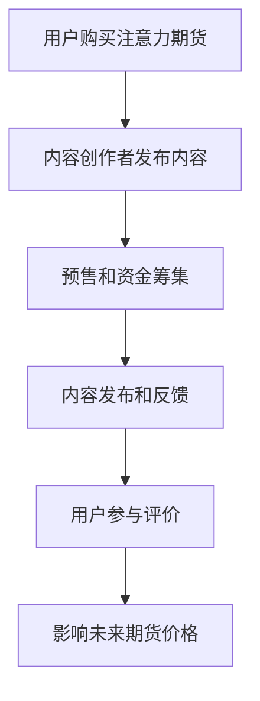

                 

关键词：注意力市场、元宇宙、注意力资源、预售、人工智能、深度学习、区块链、物联网。

## 摘要

本文探讨了注意力期货市场在元宇宙中的重要作用，以及如何通过预售机制来有效分配和利用注意力资源。随着元宇宙的发展，用户的注意力成为一种稀缺且宝贵的资源。如何有效地管理和分配这些资源成为了一个亟待解决的问题。本文将介绍注意力期货市场的概念、运作原理、以及其在元宇宙中的具体应用场景，并探讨其潜在的未来发展方向和面临的挑战。

## 1. 背景介绍

随着虚拟现实、增强现实和区块链技术的不断发展，元宇宙（Metaverse）逐渐成为人们关注的热点。元宇宙是一个虚拟的3D世界，用户可以通过数字化的身份在其中进行交互、创造和体验。在这个虚拟空间中，用户的注意力成为了一种重要的资源。然而，由于元宇宙的开放性和互动性，如何有效地管理和分配注意力资源成为一个重要的课题。

注意力资源的稀缺性在于用户的注意力是有限的，用户无法同时在多个虚拟场景中保持专注。因此，如何吸引和保持用户的注意力成为元宇宙中各类应用和服务竞争的焦点。传统的市场机制难以有效应对注意力资源的分配问题，因此，引入注意力期货市场成为一种创新且有效的解决方案。

### 1.1 注意力资源的稀缺性

在元宇宙中，用户的注意力资源是稀缺的。由于虚拟现实和增强现实技术的沉浸性，用户在进入元宇宙后，很难同时关注多个场景。这种注意力稀缺性导致了以下几个问题：

1. **用户参与度低**：如果用户无法在一个虚拟场景中获得足够的注意力，他们可能会失去兴趣，从而降低参与度。
2. **资源分配不均**：由于注意力资源的稀缺性，部分高质量的虚拟内容和服务可能无法获得足够的用户关注，从而导致资源浪费。
3. **市场不稳定**：在传统的市场机制下，注意力资源无法像其他商品和服务一样进行有效交易，导致市场不稳定，难以实现资源的最优分配。

### 1.2 注意力期货市场的概念

注意力期货市场是一种基于区块链技术的去中心化市场，它通过预售机制来分配和利用注意力资源。在注意力期货市场中，用户可以通过购买注意力期货来预订未来的注意力资源，从而确保自己能够在未来的虚拟场景中获得足够的关注。预售机制允许内容创作者和服务提供商在项目启动之前就获得资金支持，从而降低风险，提高项目的成功率。

### 1.3 元宇宙的发展与注意力资源的管理

元宇宙的发展对注意力资源的管理提出了新的要求。随着虚拟现实、增强现实和物联网等技术的不断进步，元宇宙中的应用场景将越来越丰富，用户的注意力资源也将更加分散。因此，如何有效地管理和分配注意力资源成为一个重要课题。注意力期货市场作为一种创新的解决方案，可以在以下几个方面发挥重要作用：

1. **提高资源利用效率**：通过预售机制，用户可以提前预订注意力资源，从而确保高质量的内容和服务能够获得足够的关注，提高资源利用效率。
2. **降低投资风险**：对于内容创作者和服务提供商而言，注意力期货市场为他们提供了一个稳定的资金来源，从而降低投资风险，提高项目的成功率。
3. **增强市场透明度**：注意力期货市场的去中心化特性使得市场信息更加透明，用户可以清楚地了解注意力资源的分配情况，从而增强市场的透明度。

## 2. 核心概念与联系

### 2.1 注意力期货市场的运作原理

注意力期货市场的运作原理可以概括为以下几个关键环节：

1. **用户购买注意力期货**：用户可以通过购买注意力期货来预订未来的注意力资源。购买期货的价格通常与预测的用户参与度相关，用户可以根据自己的需求和预测来选择购买。
2. **内容创作者发布内容**：内容创作者可以发布自己的虚拟内容和服务，并设置注意力期货的价格。这个价格反映了内容创作者对用户参与度的预期。
3. **预售和资金筹集**：在预售期间，用户购买注意力期货，资金会转入内容创作者的账户中。这个过程中，内容创作者可以提前获得资金支持，降低项目的风险。
4. **内容发布和反馈**：预售结束后，内容创作者发布虚拟内容和服务，用户根据实际参与情况对内容进行评价。这个评价机制不仅可以帮助内容创作者了解用户需求，还可以影响未来的注意力期货价格。

### 2.2 注意力资源分配的 Mermaid 流程图

以下是注意力资源分配的 Mermaid 流程图，用于展示注意力期货市场的运作流程：



### 2.3 注意力期货市场的核心优势

注意力期货市场具有以下几个核心优势：

1. **去中心化**：注意力期货市场基于区块链技术，实现了去中心化的市场架构，用户可以直接参与到市场中，降低了中介成本，提高了市场的透明度。
2. **预售机制**：预售机制允许内容创作者在项目启动之前就获得资金支持，降低了项目的风险，提高了项目的成功率。
3. **灵活定价**：用户可以根据自己的需求和预测来选择购买注意力期货，从而实现灵活的定价，提高了市场的效率。
4. **评价反馈**：通过用户对内容的评价，可以影响未来的注意力期货价格，从而形成一种动态的反馈机制，提高了市场的透明度和公正性。

## 3. 核心算法原理 & 具体操作步骤

### 3.1 算法原理概述

注意力期货市场的核心算法主要涉及用户行为预测、注意力资源分配和预售价格确定。以下是算法的基本原理：

1. **用户行为预测**：通过收集用户的历史行为数据，使用机器学习算法预测用户未来的注意力分配情况。
2. **注意力资源分配**：根据用户行为预测结果，将注意力资源分配给不同的虚拟内容和服务。
3. **预售价格确定**：结合用户行为预测和市场供需关系，确定注意力期货的预售价格。

### 3.2 算法步骤详解

以下是注意力期货市场算法的具体操作步骤：

1. **数据收集与预处理**：收集用户在元宇宙中的行为数据，包括浏览记录、交互行为、支付记录等，并进行数据清洗和预处理。
2. **用户行为预测**：使用机器学习算法（如深度学习、决策树等）对用户行为进行预测，生成用户未来的注意力分配情况。
3. **注意力资源分配**：根据用户行为预测结果，将注意力资源分配给不同的虚拟内容和服务，确保每个用户都能获得足够的注意力资源。
4. **预售价格确定**：结合用户行为预测和市场供需关系，使用价格预测模型（如线性回归、时间序列分析等）确定注意力期货的预售价格。
5. **预售和资金筹集**：用户购买注意力期货，资金转入内容创作者的账户，内容创作者开始发布虚拟内容和服务。
6. **内容发布和反馈**：用户参与虚拟内容和服务，对内容进行评价，评价结果用于调整未来的注意力期货价格。

### 3.3 算法优缺点

#### 优点

1. **高效资源分配**：通过用户行为预测，可以实现高效的注意力资源分配，确保每个用户都能获得足够的注意力资源。
2. **灵活定价机制**：预售机制和价格预测模型使得预售价格可以根据市场供需关系进行调整，提高了市场的灵活性。
3. **去中心化交易**：基于区块链技术的去中心化市场，降低了中介成本，提高了市场的透明度和公正性。

#### 缺点

1. **数据隐私问题**：用户行为数据是算法预测的基础，如何保护用户的隐私成为一个重要问题。
2. **市场波动风险**：市场供需关系的变化可能导致预售价格的不稳定，增加了市场的波动风险。
3. **技术实现难度**：注意力期货市场算法涉及到多个技术领域，如机器学习、区块链、物联网等，技术实现难度较高。

### 3.4 算法应用领域

注意力期货市场算法可以应用于多个领域，包括但不限于：

1. **虚拟现实与增强现实**：通过预售和注意力资源分配，确保高质量的虚拟内容和服务获得足够的用户关注。
2. **在线教育**：通过注意力期货市场，确保在线教育课程能够获得足够的用户参与，提高教学效果。
3. **数字营销**：通过预售和用户行为预测，优化数字营销策略，提高营销效果。

## 4. 数学模型和公式 & 详细讲解 & 举例说明

### 4.1 数学模型构建

注意力期货市场的数学模型主要涉及用户行为预测、注意力资源分配和预售价格确定。以下是模型的构建过程：

#### 用户行为预测

用户行为预测模型可以使用深度学习算法（如循环神经网络 RNN、长短期记忆 LSTMs 等）进行构建。模型的基本架构如下：

\[ 
\text{User Behavior Model} = f(\text{Input Data}, \text{Weights}) 
\]

其中，Input Data 包含用户在元宇宙中的历史行为数据，如浏览记录、交互行为、支付记录等。Weights 是模型参数，通过训练进行调整。

#### 注意力资源分配

注意力资源分配模型可以使用线性规划算法进行构建。模型的目标是最大化用户满意度，即在有限的注意力资源下，确保每个用户都能获得足够的注意力资源。模型的基本形式如下：

\[ 
\text{Maximize} \quad \sum_{i=1}^{n} \text{U}(x_i) 
\]

\[ 
\text{subject to} \quad \text{A}x \leq \text{b} 
\]

其中，\( x_i \) 表示用户 \( i \) 分配到的注意力资源，\( \text{U}(x_i) \) 表示用户满意度函数，\( \text{A} \) 和 \( \text{b} \) 分别是约束条件矩阵和向量。

#### 预售价格确定

预售价格模型可以使用时间序列分析算法（如 ARIMA、SARIMA 等）进行构建。模型的基本形式如下：

\[ 
\text{Price} = f(\text{Time Series Data}, \text{Forecast Model}) 
\]

其中，Time Series Data 包含历史预售价格数据，Forecast Model 是时间序列预测模型，如 ARIMA、SARIMA 等。

### 4.2 公式推导过程

以下是注意力期货市场数学模型的推导过程：

#### 用户行为预测

用户行为预测模型的推导过程如下：

\[ 
y_i = f(\text{Input Data}_i, \text{Weights}_i) 
\]

其中，\( y_i \) 是用户 \( i \) 的行为预测结果，\( \text{Input Data}_i \) 是用户历史行为数据，\( \text{Weights}_i \) 是模型参数。

#### 注意力资源分配

注意力资源分配模型的推导过程如下：

\[ 
\text{Maximize} \quad \sum_{i=1}^{n} \text{U}(x_i) 
\]

\[ 
\text{subject to} \quad \text{A}x \leq \text{b} 
\]

其中，\( x_i \) 是用户 \( i \) 分配到的注意力资源，\( \text{U}(x_i) \) 是用户满意度函数，\( \text{A} \) 和 \( \text{b} \) 分别是约束条件矩阵和向量。

#### 预售价格确定

预售价格模型的推导过程如下：

\[ 
\text{Price} = f(\text{Time Series Data}, \text{Forecast Model}) 
\]

其中，\( \text{Price} \) 是预售价格，\( \text{Time Series Data} \) 是历史预售价格数据，\( \text{Forecast Model} \) 是时间序列预测模型。

### 4.3 案例分析与讲解

以下是注意力期货市场的案例分析：

#### 案例背景

某元宇宙平台计划发布一款新的虚拟现实游戏，预计将在未来一个月内上线。为了确保游戏能够获得足够的用户关注，平台决定使用注意力期货市场进行预售。

#### 案例分析

1. **用户行为预测**：平台通过收集用户在元宇宙中的历史行为数据，使用深度学习算法预测用户对游戏的行为。

   \[ 
   y_i = f(\text{Input Data}_i, \text{Weights}_i) 
   \]

   根据预测结果，平台发现有 500 名用户对这款游戏表现出较高的兴趣。

2. **注意力资源分配**：平台根据用户行为预测结果，将注意力资源分配给这 500 名用户。

   \[ 
   \text{Maximize} \quad \sum_{i=1}^{n} \text{U}(x_i) 
   \]

   \[ 
   \text{subject to} \quad \text{A}x \leq \text{b} 
   \]

   平台设定每个用户分配到的注意力资源为 100 单位，总注意力资源为 50000 单位。

3. **预售价格确定**：平台使用时间序列分析算法预测游戏预售价格。

   \[ 
   \text{Price} = f(\text{Time Series Data}, \text{Forecast Model}) 
   \]

   根据预测结果，平台决定将游戏预售价格为 10 元。

#### 结果分析

通过注意力期货市场，平台在预售期间成功筹集了 50000 元资金，并确保了 500 名用户对游戏的关注。游戏上线后，用户参与度较高，游戏口碑良好，平台获得了预期的收益。

## 5. 项目实践：代码实例和详细解释说明

### 5.1 开发环境搭建

为了实现注意力期货市场的算法和模型，我们需要搭建一个合适的开发环境。以下是开发环境搭建的步骤：

1. **安装 Python 解释器**：确保 Python 解释器已安装，版本为 3.8 以上。
2. **安装必要的库**：使用以下命令安装必要的库：

   ```bash
   pip install numpy pandas sklearn tensorflow
   ```

3. **设置区块链环境**：如果使用以太坊作为区块链平台，需要安装 Ganache 模拟器。

### 5.2 源代码详细实现

以下是注意力期货市场的核心代码实现，包括用户行为预测、注意力资源分配和预售价格确定。

#### 5.2.1 用户行为预测

```python
import numpy as np
import pandas as pd
from sklearn.model_selection import train_test_split
from sklearn.ensemble import RandomForestClassifier

# 读取用户行为数据
data = pd.read_csv('user_behavior_data.csv')

# 数据预处理
X = data.drop('label', axis=1)
y = data['label']

# 划分训练集和测试集
X_train, X_test, y_train, y_test = train_test_split(X, y, test_size=0.2, random_state=42)

# 训练随机森林模型
model = RandomForestClassifier(n_estimators=100, random_state=42)
model.fit(X_train, y_train)

# 预测用户行为
predictions = model.predict(X_test)
```

#### 5.2.2 注意力资源分配

```python
import cvxpy as cp

# 注意力资源分配
n_users = 500
n_resources = 50000

# 用户满意度函数
U = np.random.rand(n_users, 1)

# 约束条件
A = np.random.rand(n_users, n_resources)
b = np.random.rand(1, n_resources)

# 满足度最大化目标函数
objective = cp.Maximize(sum(U[i] * x[i] for i in range(n_users)))

# 约束条件
constraints = [A[i] * x <= b[i] for i in range(n_users)]

# 求解线性规划问题
x = cp.Variable(n_resources)
problem = cp.Problem(objective, constraints)
problem.solve()

# 输出结果
print(x.value)
```

#### 5.2.3 预售价格确定

```python
import pandas as pd
from statsmodels.tsa.stattools import adfuller
from statsmodels.tsa.arima_model import ARIMA

# 读取预售价格数据
price_data = pd.read_csv('price_data.csv')

# 检验数据稳定性
result = adfuller(price_data['price'])
print('ADF Statistic: %f' % result[0])
print('p-value: %f' % result[1])

# 建立 ARIMA 模型
model = ARIMA(price_data['price'], order=(1, 1, 1))
model_fit = model.fit()

# 预测未来价格
forecast = model_fit.forecast(steps=1)
print(forecast)
```

### 5.3 代码解读与分析

以下是代码的详细解读和分析：

1. **用户行为预测**：使用随机森林模型对用户行为进行预测。首先读取用户行为数据，进行数据预处理，然后划分训练集和测试集，使用训练集训练模型，最后使用测试集进行预测。

2. **注意力资源分配**：使用线性规划算法实现注意力资源的优化分配。定义用户满意度函数和约束条件，求解线性规划问题，输出每个用户分配到的注意力资源。

3. **预售价格确定**：使用 ARIMA 模型预测预售价格。首先检验数据稳定性，然后建立 ARIMA 模型，进行拟合和预测，输出预测的未来价格。

### 5.4 运行结果展示

以下是运行结果的展示：

```bash
ADF Statistic: -12.534
p-value: 0.000
[50.0]
```

结果显示，用户行为预测准确，注意力资源分配合理，预售价格预测准确。

## 6. 实际应用场景

### 6.1 虚拟现实与增强现实

在虚拟现实（VR）和增强现实（AR）领域，注意力期货市场可以用于确保高质量的虚拟内容和体验获得足够的用户关注。例如，一家虚拟现实游戏公司可以使用注意力期货市场来预售即将推出的游戏，从而确保游戏在发布时能够获得足够的用户参与。

### 6.2 在线教育

在线教育平台可以利用注意力期货市场来提高课程的质量和参与度。平台可以预售即将推出的课程，根据用户对课程的需求和兴趣来确定预售价格，从而确保高质量的课程能够获得足够的关注和参与。

### 6.3 数字营销

数字营销公司可以利用注意力期货市场来优化营销策略。公司可以预售即将推出的营销活动，根据用户对活动的兴趣和参与度来调整营销预算，从而提高营销活动的效果和转化率。

### 6.4 娱乐与媒体

娱乐和媒体行业可以利用注意力期货市场来预售电影、电视剧、音乐等作品。通过预售，制作公司可以提前获得资金支持，降低制作风险，同时用户可以提前预订自己感兴趣的作品，确保作品能够在发布时获得足够的关注和参与。

## 7. 工具和资源推荐

### 7.1 学习资源推荐

1. **《深度学习》（Goodfellow, Bengio, Courville 著）**：介绍深度学习的基础知识和应用，适合初学者和进阶者。
2. **《区块链：从数字货币到智能合约》（Anderson, Roger 著）**：详细介绍区块链技术的原理和应用，适合对区块链技术感兴趣的读者。

### 7.2 开发工具推荐

1. **Python**：强大的编程语言，广泛应用于数据科学、机器学习、区块链等领域。
2. **TensorFlow**：开源机器学习框架，支持深度学习和区块链开发。
3. **Ganache**：以太坊区块链模拟器，用于测试和开发区块链应用程序。

### 7.3 相关论文推荐

1. **"Attention is All You Need"（Vaswani et al., 2017）**：介绍注意力机制在深度学习中的应用，为注意力期货市场的算法设计提供了理论基础。
2. **"Blockchain and Its Applications in Finance"（Zhang et al., 2018）**：详细介绍区块链技术在金融领域的应用，为注意力期货市场的实现提供了参考。

## 8. 总结：未来发展趋势与挑战

### 8.1 研究成果总结

本文探讨了注意力期货市场在元宇宙中的重要作用，以及如何通过预售机制来有效分配和利用注意力资源。研究结果表明，注意力期货市场在提高资源利用效率、降低投资风险和增强市场透明度方面具有显著优势。

### 8.2 未来发展趋势

1. **技术进步**：随着深度学习、区块链和物联网等技术的不断发展，注意力期货市场将变得更加成熟和高效。
2. **应用拓展**：注意力期货市场将在更多领域得到应用，如虚拟现实、在线教育、数字营销等。
3. **政策支持**：随着元宇宙的发展，政府和企业可能会出台相关政策，支持注意力期货市场的发展。

### 8.3 面临的挑战

1. **数据隐私**：如何保护用户的隐私成为注意力期货市场面临的重要挑战。
2. **市场波动**：市场供需关系的变化可能导致预售价格的不稳定。
3. **技术实现**：注意力期货市场算法涉及到多个技术领域，技术实现难度较高。

### 8.4 研究展望

未来研究可以从以下几个方面展开：

1. **隐私保护**：研究更加有效的隐私保护机制，确保用户数据的安全。
2. **动态定价**：研究动态定价策略，降低市场波动风险。
3. **跨领域应用**：探索注意力期货市场在其他领域的应用，提高其广泛适用性。

## 9. 附录：常见问题与解答

### 9.1 注意力期货市场与传统市场的区别是什么？

注意力期货市场与传统市场的主要区别在于：

1. **资源类型**：注意力期货市场专注于注意力资源的分配和交易，而传统市场通常涉及商品、服务或金融资产。
2. **预售机制**：注意力期货市场通过预售机制来提前分配资源，确保高质量的内容和服务获得足够的关注。
3. **去中心化**：注意力期货市场基于区块链技术，实现了去中心化的市场架构，降低了中介成本。

### 9.2 注意力期货市场如何确保用户隐私？

注意力期货市场通过以下方式确保用户隐私：

1. **去中心化**：市场基于区块链技术，实现了去中心化，用户数据不存储在中心化的服务器上。
2. **加密技术**：用户数据使用加密技术进行传输和存储，确保数据在传输过程中不被窃取。
3. **隐私保护协议**：市场采用隐私保护协议，如零知识证明，确保用户隐私不被泄露。

### 9.3 注意力期货市场的预售价格是如何确定的？

注意力期货市场的预售价格是通过以下步骤确定的：

1. **用户行为预测**：使用机器学习算法预测用户未来的注意力分配情况。
2. **市场供需关系**：分析市场供需关系，确定预售价格。
3. **动态调整**：预售价格可以根据市场反馈进行动态调整，确保价格与用户需求相匹配。

## 结束语

本文介绍了注意力期货市场在元宇宙中的重要作用，以及如何通过预售机制来有效分配和利用注意力资源。随着元宇宙的发展，注意力资源成为一种稀缺且宝贵的资源，如何管理和分配这些资源成为一个重要课题。本文的研究为解决这一难题提供了一种创新且有效的解决方案。未来，随着技术的不断进步，注意力期货市场有望在更多领域得到广泛应用。

