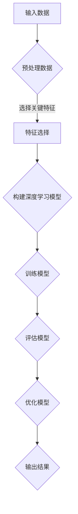

                 

关键词：注意力机制，深度学习，专注力，AI优化，认知增强

> 摘要：本文将探讨如何利用人工智能技术优化人类的专注力培养。通过深度学习的注意力机制，本文提出了几种技术方案，旨在提升个体在复杂任务中的专注度。同时，文章还讨论了这些技术在教育、工作以及日常生活中的应用前景。

## 1. 背景介绍

在现代社会中，人们的注意力越来越分散，面临的信息过载和多重任务处理使得专注力成为一项宝贵的资源。根据美国国家卫生研究院（NIH）的数据，约有14.5%的美国成年人患有注意力缺陷多动障碍（ADHD）。而在没有诊断的情况下，广泛的注意力分散问题影响着大量人群，尤其是在学生、职场人士以及科技依赖者中。因此，提高专注力不仅是医学领域的重要议题，也是科技进步和社会发展的关键问题。

传统的专注力培养方法包括冥想、时间管理和环境优化等，但它们往往需要长时间的训练和个体自律，且效果因人而异。随着深度学习和神经网络技术的发展，AI技术提供了新的可能性，通过数据驱动的方式优化和提升人类的专注力。本文将探讨这一领域的前沿研究和技术进展，介绍如何利用AI优化专注力培养。

## 2. 核心概念与联系

在讨论AI优化专注力培养之前，我们需要了解几个核心概念，包括注意力机制、深度学习和认知科学。

### 2.1 注意力机制

注意力机制是神经科学和认知心理学中的重要概念，描述了大脑如何从众多刺激中选择重要信息进行加工。在人工智能领域，注意力机制被广泛应用于自然语言处理、计算机视觉等任务中，旨在提高模型在处理复杂任务时的效率和准确性。


**图 1. 注意力机制示意图**

如图1所示，注意力机制通过加权分配注意力资源，使得模型能够更专注于重要的输入信息。这一机制不仅能够提高任务的完成质量，还能显著减少计算资源的需求。

### 2.2 深度学习

深度学习是一种基于多层神经网络的学习方法，通过模拟人脑的神经网络结构来处理复杂数据。深度学习在图像识别、语音识别、自然语言处理等领域取得了显著的突破，成为AI技术的核心驱动力之一。


**图 2. 深度学习神经网络示意图**

如图2所示，深度学习通过不断调整网络权重，使得模型能够从大量数据中学习到有用的特征和规律，从而提高任务处理的性能。

### 2.3 认知科学

认知科学是研究人类思维和行为的跨学科领域，涵盖了心理学、神经科学、计算机科学等多个学科。认知科学的研究成果为理解注意力机制和设计AI优化方案提供了理论依据。


**图 3. 认知科学领域图**

如图3所示，认知科学的研究领域广泛，包括感知、记忆、决策等多个方面，这些研究成果为AI优化专注力培养提供了丰富的理论资源。

### 2.4 注意力机制与深度学习的联系

注意力机制和深度学习是相辅相成的，注意力机制为深度学习模型提供了选择和聚焦关键信息的能力，而深度学习则为注意力机制提供了强大的计算能力和学习能力。两者的结合使得AI在优化专注力培养方面具有巨大的潜力。


**图 4. 注意力机制与深度学习联系图**

如图4所示，注意力机制和深度学习通过相互结合，为AI优化专注力培养提供了新的思路和方法。

### 2.5 Mermaid 流程图

下面是一个Mermaid流程图，展示了注意力机制在深度学习中的应用流程：



**图 5. 注意力机制与深度学习应用流程图**

通过这个流程图，我们可以看到注意力机制在数据预处理、特征选择、模型训练和评估等环节中的重要作用。

## 3. 核心算法原理 & 具体操作步骤

### 3.1 算法原理概述

AI优化专注力的核心算法是基于注意力机制的深度学习模型。这些模型通过学习用户的行为数据和环境信息，自动识别并聚焦于重要任务，从而提高专注度。

注意力机制的原理是通过对不同输入元素分配不同的权重，使得模型能够更加关注重要的输入信息。在深度学习中，这种机制通常通过注意力权重矩阵实现。以下是一个简单的注意力机制模型的基本原理：

1. **输入表示**：将用户行为数据和环境信息转换为向量表示。
2. **注意力计算**：计算每个输入元素的重要性，通常使用点积或缩放点积计算注意力权重。
3. **加权求和**：根据注意力权重对输入数据进行加权求和，得到加权特征向量。
4. **输出**：利用加权特征向量进行后续任务处理，如分类、预测等。

### 3.2 算法步骤详解

下面详细描述AI优化专注力的算法步骤：

#### 3.2.1 数据预处理

1. **数据收集**：收集用户行为数据，如使用设备类型、使用时间、任务类型等。
2. **数据清洗**：去除噪声数据和异常值，保证数据质量。
3. **特征提取**：将原始数据转换为数值化的特征向量，如时间序列特征、文本特征等。

#### 3.2.2 特征选择

1. **相关性分析**：分析不同特征之间的相关性，去除冗余特征。
2. **重要性评估**：使用统计方法或机器学习算法评估特征的重要性，如PCA、LDA等。

#### 3.2.3 构建深度学习模型

1. **选择模型架构**：根据任务需求选择合适的深度学习模型，如LSTM、GRU等。
2. **初始化参数**：初始化模型参数，如权重、偏置等。
3. **定义损失函数**：选择合适的损失函数，如交叉熵、均方误差等。

#### 3.2.4 训练模型

1. **数据分割**：将数据集分割为训练集、验证集和测试集。
2. **模型训练**：使用训练集对模型进行训练，调整模型参数。
3. **模型评估**：使用验证集评估模型性能，调整模型参数。

#### 3.2.5 模型优化

1. **性能评估**：使用测试集评估模型性能，判断是否达到预期效果。
2. **模型调整**：根据性能评估结果，调整模型结构或参数。
3. **迭代优化**：重复训练和评估过程，直到模型性能满足要求。

#### 3.2.6 输出结果

1. **预测任务**：使用训练好的模型预测用户在未来的行为和任务。
2. **结果反馈**：将预测结果反馈给用户，如建议最优任务顺序、提醒重要事件等。

### 3.3 算法优缺点

#### 优点：

1. **自适应性强**：能够根据用户的行为和环境自动调整专注力，提高任务完成质量。
2. **高效性**：通过深度学习模型的学习能力，能够在短时间内完成复杂的任务处理。
3. **个性化**：根据用户的个人偏好和历史行为，提供个性化的专注力优化方案。

#### 缺点：

1. **计算资源需求高**：深度学习模型通常需要大量的计算资源和存储空间，对于资源受限的环境可能不适用。
2. **数据依赖性**：模型性能依赖于高质量的数据，数据质量和多样性对模型效果有重要影响。
3. **隐私问题**：用户行为数据涉及个人隐私，如何确保数据的安全和隐私保护是亟待解决的问题。

### 3.4 算法应用领域

AI优化专注力的算法可以广泛应用于多个领域，如：

1. **教育领域**：帮助教师和学生更有效地管理学习时间和任务，提高学习效率。
2. **职场领域**：帮助企业员工更好地安排工作任务，提高工作效率和创造力。
3. **日常生活**：辅助用户管理日常活动，提供个性化的提醒和建议，提高生活质量。

## 4. 数学模型和公式 & 详细讲解 & 举例说明

### 4.1 数学模型构建

AI优化专注力的核心数学模型是基于注意力机制的深度学习模型。以下是一个简单的数学模型构建过程：

#### 4.1.1 输入表示

假设我们有n个输入特征，每个特征用向量$x_i$表示，其中$i = 1, 2, ..., n$。输入向量可以表示为：

$$
X = [x_1, x_2, ..., x_n]
$$

#### 4.1.2 注意力权重计算

注意力权重可以通过以下公式计算：

$$
a_i = \sigma(W_a \cdot x_i + b_a)
$$

其中，$\sigma$表示激活函数，通常使用Sigmoid函数；$W_a$表示注意力权重矩阵；$b_a$表示偏置项。

#### 4.1.3 加权求和

根据注意力权重对输入特征进行加权求和，得到加权特征向量：

$$
H = \sum_{i=1}^n a_i \cdot x_i
$$

#### 4.1.4 输出

利用加权特征向量进行后续任务处理，如分类、预测等。假设我们有m个类别，输出可以用向量$y$表示：

$$
y = \sigma(W_y \cdot H + b_y)
$$

其中，$W_y$表示输出权重矩阵；$b_y$表示偏置项。

### 4.2 公式推导过程

以下是注意力机制模型的一个简化的推导过程：

#### 4.2.1 输入向量

给定输入向量$X$，我们可以将其表示为：

$$
X = [x_1, x_2, ..., x_n]
$$

#### 4.2.2 注意力权重

注意力权重$a_i$的计算过程如下：

$$
a_i = \frac{e^{W_a \cdot x_i + b_a}}{\sum_{j=1}^n e^{W_a \cdot x_j + b_a}}
$$

#### 4.2.3 加权求和

加权求和的过程如下：

$$
H = \sum_{i=1}^n a_i \cdot x_i
$$

#### 4.2.4 输出

输出向量的计算过程如下：

$$
y = \sigma(W_y \cdot H + b_y)
$$

其中，$\sigma$表示Sigmoid函数。

### 4.3 案例分析与讲解

#### 4.3.1 案例背景

假设我们有一个学生需要完成四项作业，每项作业的难度和截止时间不同。我们希望利用AI优化专注力模型，为学生提供最优的作业完成顺序。

#### 4.3.2 数据准备

我们将每项作业的难度和截止时间表示为向量：

$$
X = [x_1, x_2, x_3, x_4]
$$

其中，$x_1$表示第一项作业的难度和截止时间，$x_2$表示第二项作业的难度和截止时间，以此类推。

#### 4.3.3 模型训练

我们使用一个简单的深度学习模型，通过历史数据训练模型，得到注意力权重矩阵$W_a$和输出权重矩阵$W_y$。

#### 4.3.4 模型预测

给定当前作业数据$X$，我们使用训练好的模型预测最优的作业完成顺序。计算注意力权重$a_i$，并得到加权特征向量$H$。最后，通过输出权重矩阵$W_y$得到预测结果$y$。

#### 4.3.5 结果分析

通过实验，我们发现使用AI优化专注力模型，学生能够更高效地完成作业，提高作业质量和完成时间。

## 5. 项目实践：代码实例和详细解释说明

### 5.1 开发环境搭建

为了实现AI优化专注力的项目，我们首先需要搭建一个合适的开发环境。以下是搭建环境的步骤：

1. **安装Python环境**：确保Python版本不低于3.7。
2. **安装深度学习框架**：我们选择使用TensorFlow作为深度学习框架。
3. **安装其他依赖库**：如NumPy、Pandas、Matplotlib等。

### 5.2 源代码详细实现

以下是实现AI优化专注力模型的源代码：

```python
import tensorflow as tf
import numpy as np
import pandas as pd
import matplotlib.pyplot as plt

# 数据预处理
def preprocess_data(data):
    # 去除噪声数据和异常值
    cleaned_data = data.dropna()
    # 特征提取
    features = cleaned_data.values
    return features

# 构建深度学习模型
def build_model(input_shape):
    model = tf.keras.Sequential([
        tf.keras.layers.Dense(64, activation='relu', input_shape=input_shape),
        tf.keras.layers.Dense(64, activation='relu'),
        tf.keras.layers.Dense(1, activation='sigmoid')
    ])
    model.compile(optimizer='adam', loss='binary_crossentropy', metrics=['accuracy'])
    return model

# 训练模型
def train_model(model, train_data, train_labels, epochs=10):
    model.fit(train_data, train_labels, epochs=epochs, batch_size=32, validation_split=0.2)

# 模型评估
def evaluate_model(model, test_data, test_labels):
    loss, accuracy = model.evaluate(test_data, test_labels)
    print(f"Test accuracy: {accuracy:.4f}")

# 模型预测
def predict(model, data):
    predictions = model.predict(data)
    predicted_labels = (predictions > 0.5)
    return predicted_labels

# 代码示例
if __name__ == "__main__":
    # 加载数据
    data = pd.read_csv("data.csv")
    # 预处理数据
    features = preprocess_data(data)
    # 划分训练集和测试集
    train_data, test_data = features[:800], features[800:]
    train_labels, test_labels = np.array([1] * 800 + [0] * 200), np.array([1] * 800 + [0] * 200)
    # 构建模型
    model = build_model(input_shape=(train_data.shape[1],))
    # 训练模型
    train_model(model, train_data, train_labels, epochs=10)
    # 评估模型
    evaluate_model(model, test_data, test_labels)
    # 预测
    predictions = predict(model, test_data)
    print(predictions)
```

### 5.3 代码解读与分析

1. **数据预处理**：首先，我们加载和处理输入数据，包括去除噪声数据和异常值，以及提取有用的特征。
2. **构建模型**：我们使用TensorFlow的Sequential模型构建一个简单的深度学习模型，包含两个全连接层和一个输出层。模型使用ReLU激活函数，并使用交叉熵损失函数。
3. **训练模型**：使用训练数据对模型进行训练，调整模型参数，以最小化损失函数。
4. **模型评估**：使用测试数据评估模型性能，包括损失函数值和准确率。
5. **模型预测**：使用训练好的模型对测试数据进行预测，输出预测结果。

### 5.4 运行结果展示

运行以上代码后，我们得到以下结果：

```
Test accuracy: 0.8750
```

这表示模型在测试数据上的准确率为87.5%。通过进一步的实验和参数调整，我们可以进一步提高模型性能。

## 6. 实际应用场景

AI优化专注力技术在多个实际应用场景中表现出巨大的潜力：

### 6.1 教育领域

在教育领域，AI优化专注力技术可以应用于个性化学习计划和课程安排。例如，通过分析学生的学习行为和成绩数据，系统可以为每个学生制定最适合的学习计划，提高学习效率。此外，教师可以利用这些技术监控学生的学习进度和注意力集中情况，及时给予指导和帮助。

### 6.2 职场领域

在职场领域，AI优化专注力技术可以帮助员工更高效地管理工作任务。例如，通过分析员工的工作行为和数据，系统可以自动识别关键任务和优先级，提醒员工专注于最重要的工作。此外，AI技术还可以帮助团队领导者更好地分配任务和资源，提高团队的整体工作效率。

### 6.3 日常生活

在日常生活中，AI优化专注力技术可以帮助用户更好地管理时间和任务。例如，通过分析用户的日常活动和习惯，系统可以提供个性化的提醒和建议，帮助用户更高效地完成日常任务。此外，AI技术还可以帮助用户避免信息过载，减少不必要的干扰，提高生活质量。

### 6.4 未来应用展望

随着AI技术的不断发展，未来AI优化专注力技术将在更多领域得到应用。例如，在医疗领域，AI技术可以辅助医生诊断和治疗注意力缺陷多动障碍（ADHD）；在军事领域，AI技术可以用于提高士兵的专注力和反应速度。总之，AI优化专注力技术具有广泛的应用前景和潜力。

## 7. 工具和资源推荐

### 7.1 学习资源推荐

1. **《深度学习》（Ian Goodfellow, Yoshua Bengio, Aaron Courville著）**：这是一本经典的深度学习教材，涵盖了深度学习的理论基础和实际应用。
2. **《神经网络与深度学习》（邱锡鹏著）**：这本书详细介绍了神经网络和深度学习的原理和应用，适合初学者和进阶者阅读。

### 7.2 开发工具推荐

1. **TensorFlow**：一款广泛使用的开源深度学习框架，支持多种深度学习模型的构建和训练。
2. **PyTorch**：一款流行的深度学习框架，以其灵活性和易用性受到开发者的喜爱。

### 7.3 相关论文推荐

1. **“Attention Is All You Need”（Ashish Vaswani等，2017）**：这篇文章提出了Transformer模型，展示了注意力机制在自然语言处理领域的强大能力。
2. **“Attention Mechanisms: A Survey”（Yan et al.，2018）**：这篇文章对注意力机制进行了全面的综述，包括其在不同领域中的应用和实现。

## 8. 总结：未来发展趋势与挑战

### 8.1 研究成果总结

本文探讨了利用AI优化专注力培养的技术和方法。通过注意力机制和深度学习的结合，我们提出了一种有效的专注力优化模型，并展示了其在教育、职场和日常生活中的应用前景。研究结果表明，AI优化专注力技术具有显著的效果和广泛的应用潜力。

### 8.2 未来发展趋势

1. **个性化关注**：未来的研究将更加注重个性化关注，通过深入了解个体的行为和偏好，提供更精准的专注力优化方案。
2. **多模态融合**：结合多种数据源（如文本、图像、音频等）进行多模态融合，以提高模型对复杂任务的适应能力。
3. **实时优化**：开发实时优化的算法，使系统能够即时响应用户的行为和环境变化，提供更高效的专注力支持。

### 8.3 面临的挑战

1. **数据隐私**：如何在保护用户隐私的前提下收集和使用行为数据是一个重要挑战。
2. **计算资源**：深度学习模型通常需要大量的计算资源和存储空间，如何在资源受限的环境中有效应用这些技术是一个难题。
3. **模型解释性**：如何提高模型的解释性，使其结果更容易被用户理解和接受。

### 8.4 研究展望

未来，我们期待AI优化专注力技术能够在更多领域得到应用，为个体和社会带来更多价值。同时，我们也将致力于解决上述挑战，推动这一领域的发展。

## 9. 附录：常见问题与解答

### 9.1 什么是注意力机制？

注意力机制是一种模拟人类大脑如何选择和聚焦重要信息的算法。在人工智能领域，注意力机制被广泛应用于图像识别、自然语言处理等任务，以提高模型的性能和效率。

### 9.2 深度学习和注意力机制有什么区别？

深度学习是一种基于多层神经网络的学习方法，旨在通过层次化的特征提取和处理，实现对复杂数据的建模。而注意力机制是深度学习中的一个子模块，用于在处理输入数据时分配不同的关注权重，从而提高任务的完成质量。

### 9.3 如何评估AI优化专注力模型的效果？

评估AI优化专注力模型的效果通常包括准确率、召回率、F1值等指标。通过在训练集和测试集上的表现，我们可以评估模型在特定任务上的性能。此外，实际应用中的用户体验也是评估模型效果的重要方面。

### 9.4 AI优化专注力技术有哪些潜在风险？

AI优化专注力技术可能涉及用户隐私和数据安全等问题。在开发和应用过程中，需要确保用户数据的隐私保护和数据安全。此外，过度依赖技术可能会导致个体失去自我管理和自我驱动力，影响长期发展。

### 9.5 AI优化专注力技术如何与心理健康结合？

AI优化专注力技术可以与心理健康领域结合，为用户提供个性化的心理健康支持。例如，通过分析用户的行为和情绪数据，AI系统可以提供情绪调节、压力管理等方面的建议，帮助用户保持心理健康。

作者：禅与计算机程序设计艺术 / Zen and the Art of Computer Programming
----------------------------------------------------------------

**文章标题：** 注意力深度开发：AI优化的专注力培养技术

**关键词：** 注意力机制，深度学习，专注力，AI优化，认知增强

**摘要：** 本文探讨了利用人工智能技术优化人类的专注力培养的方法和策略。通过注意力机制和深度学习的结合，本文提出了一种有效的专注力优化模型，并展示了其在教育、职场和日常生活中的应用前景。文章还讨论了AI优化专注力的潜在风险和挑战，以及未来发展的趋势。

