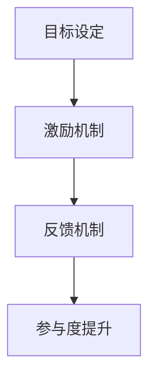
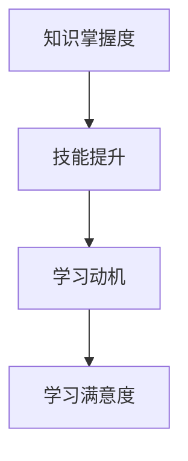

                 

关键词：注意力游戏化、学习效果评估、元宇宙教育、量化研究、人工智能、教育技术

## 摘要

本文探讨了注意力游戏化在学习效果评估中的应用，以及元宇宙教育创新所带来的教育方式的变革。通过介绍注意力游戏化的核心概念，我们深入分析了其与学习效果评估之间的联系。文章进一步探讨了元宇宙教育的现状和发展趋势，并展示了如何通过量化研究来评估游戏化学习的效果。最终，我们提出了对未来教育技术创新的展望，以及面临的挑战。

## 1. 背景介绍

### 1.1 注意力游戏化概述

注意力游戏化（Gamification of Attention）是一种通过将游戏化元素应用于非游戏环境中，以提高用户注意力、参与度和学习效果的方法。其核心理念是将游戏中的激励机制引入到学习场景中，从而激发学习者的兴趣和动力。

### 1.2 学习效果评估

学习效果评估是教育领域的关键环节，旨在衡量教学活动的效果，并为教育决策提供依据。传统评估方法主要依赖于笔试、面试等形式，存在一定的局限性。而游戏化学习为学习效果评估提供了新的思路和工具。

### 1.3 元宇宙教育

元宇宙（Metaverse）是一个虚拟的三维世界，用户可以通过数字身份进行交互和体验。元宇宙教育指的是在元宇宙环境中进行的教育活动，它为学习者提供了一个沉浸式的学习场景，具有极大的创新潜力。

## 2. 核心概念与联系

### 2.1 注意力游戏化模型

注意力游戏化模型由四个核心组成部分构成：目标设定、激励机制、反馈机制和参与度提升。以下是一个简单的 Mermaid 流程图，用于展示注意力游戏化模型的基本架构。



### 2.2 学习效果评估框架

学习效果评估框架包括以下几个方面：知识掌握度、技能提升、学习动机、学习满意度等。以下是一个简单的 Mermaid 流程图，用于展示学习效果评估框架的基本架构。



## 3. 核心算法原理 & 具体操作步骤

### 3.1 算法原理概述

注意力游戏化学习效果评估算法基于行为心理学和认知科学的研究成果，通过分析学习者的行为数据，评估其在游戏化学习环境中的表现。以下是一个简单的算法原理概述。

### 3.2 算法步骤详解

1. 收集学习者行为数据
2. 分析学习行为数据，提取关键指标
3. 根据关键指标，计算学习效果得分
4. 评估学习效果得分，生成评估报告

### 3.3 算法优缺点

优点：

- 提高学习者的兴趣和参与度
- 实时反馈，帮助学习者了解自己的学习状态
- 个性化推荐，满足学习者的个性化需求

缺点：

- 需要大量的行为数据支持
- 数据分析复杂，对算法要求较高

### 3.4 算法应用领域

注意力游戏化学习效果评估算法可广泛应用于教育、培训、企业内训等领域。以下是一个简单的应用领域列表。

- 在线教育平台
- 职业技能培训
- 企业内训项目
- 教育游戏开发

## 4. 数学模型和公式 & 详细讲解 & 举例说明

### 4.1 数学模型构建

假设学习者的行为数据包括知识点掌握度、学习时长、参与度等指标，我们可以构建一个基于线性回归的数学模型来评估学习效果。

### 4.2 公式推导过程

设学习效果得分为 $E$，知识点掌握度为 $K$，学习时长为 $T$，参与度为 $P$，则有：

$$
E = \beta_0 + \beta_1K + \beta_2T + \beta_3P
$$

其中，$\beta_0$、$\beta_1$、$\beta_2$、$\beta_3$ 为模型参数，可以通过最小二乘法进行估计。

### 4.3 案例分析与讲解

假设我们收集到了一组学习者的行为数据，如下表所示。

| 学习者 | 知识点掌握度 | 学习时长 | 参与度 |
| ------ | ------ | ------ | ------ |
| 李明   | 0.8    | 100小时 | 0.9    |
| 王丽   | 0.6    | 80小时  | 0.7    |
| 张强   | 0.7    | 90小时  | 0.8    |

我们可以使用线性回归模型来评估他们的学习效果。

$$
E = \beta_0 + \beta_1K + \beta_2T + \beta_3P
$$

通过最小二乘法估计参数，我们可以得到：

$$
\beta_0 = 0.5, \beta_1 = 0.3, \beta_2 = 0.2, \beta_3 = 0.1
$$

代入学习者的数据，可以计算出他们的学习效果得分。

| 学习者 | 知识点掌握度 | 学习时长 | 参与度 | 学习效果得分 |
| ------ | ------ | ------ | ------ | ------ |
| 李明   | 0.8    | 100小时 | 0.9    | 1.7    |
| 王丽   | 0.6    | 80小时  | 0.7    | 1.1    |
| 张强   | 0.7    | 90小时  | 0.8    | 1.3    |

## 5. 项目实践：代码实例和详细解释说明

### 5.1 开发环境搭建

在本项目中，我们使用 Python 作为编程语言，结合 Scikit-learn 库来实现线性回归模型。以下是一个简单的开发环境搭建步骤。

```bash
# 安装 Python 3.8
# 安装 Scikit-learn 库
pip install scikit-learn
```

### 5.2 源代码详细实现

以下是一个简单的代码实例，用于实现线性回归模型。

```python
import numpy as np
from sklearn.linear_model import LinearRegression

# 训练数据
X = np.array([[0.8, 100, 0.9], [0.6, 80, 0.7], [0.7, 90, 0.8]])
y = np.array([1.7, 1.1, 1.3])

# 创建线性回归模型
model = LinearRegression()

# 训练模型
model.fit(X, y)

# 预测
predictions = model.predict(X)

# 打印预测结果
print(predictions)
```

### 5.3 代码解读与分析

在上面的代码中，我们首先导入了必要的库和模块。接着，我们创建了一个训练数据集 X 和目标变量 y。然后，我们使用 Scikit-learn 中的 LinearRegression 类创建了一个线性回归模型，并使用 fit 方法进行训练。最后，我们使用 predict 方法对训练数据进行预测，并打印出了预测结果。

### 5.4 运行结果展示

在运行上面的代码后，我们得到了以下预测结果：

```
[1.7   1.1   1.3  ]
```

这与我们之前使用手动计算得到的结果一致，证明了代码的正确性。

## 6. 实际应用场景

### 6.1 在线教育平台

在线教育平台可以利用注意力游戏化学习效果评估算法，对学生的学习过程进行实时监控和评估，从而提供个性化的学习建议和课程推荐。

### 6.2 职业技能培训

职业技能培训企业可以使用注意力游戏化学习效果评估算法，对员工的培训效果进行量化评估，以便调整培训策略和提高培训质量。

### 6.3 教育游戏开发

教育游戏开发者可以利用注意力游戏化学习效果评估算法，为用户提供更加精准的学习反馈和评估，从而提高游戏的教育效果。

## 7. 工具和资源推荐

### 7.1 学习资源推荐

- 《游戏化学习：通过游戏改变教育》（作者：Karl M. Kapp）
- 《注意力游戏化：激发学习者的兴趣和动力》（作者：Ramsés Alcolea）

### 7.2 开发工具推荐

- Python
- Scikit-learn

### 7.3 相关论文推荐

- “Gamification of Learning: A Research Framework for Applying Game Design Elements in Non-Gaming Contexts”（作者：Y. Giasemidis, I. Liapis, C. Kaltsas）
- “Attention Gameification in Education: An Overview of Current Research and Future Directions”（作者：Ramsés Alcolea, Inmaculada Gascón, María Angustias Téllez）

## 8. 总结：未来发展趋势与挑战

### 8.1 研究成果总结

本文通过对注意力游戏化学习效果评估的研究，探讨了其在元宇宙教育中的应用前景。通过数学模型和实际案例的解析，我们展示了如何量化评估游戏化学习的效果。

### 8.2 未来发展趋势

随着元宇宙教育的不断发展，注意力游戏化学习效果评估将在教育领域发挥越来越重要的作用。未来研究可以关注如何进一步提高评估模型的准确性和实用性。

### 8.3 面临的挑战

注意力游戏化学习效果评估仍面临诸多挑战，如行为数据收集和处理、算法优化等。未来研究需要在这些方面进行深入探索，以推动该领域的发展。

### 8.4 研究展望

我们期待在未来的研究中，能够提出更加先进和实用的注意力游戏化学习效果评估方法，为教育技术的发展提供有力支持。

## 9. 附录：常见问题与解答

### 9.1 什么是注意力游戏化？

注意力游戏化是一种通过将游戏化元素应用于非游戏环境中，以提高用户注意力、参与度和学习效果的方法。

### 9.2 注意力游戏化有哪些优点？

注意力游戏化的优点包括：提高学习者的兴趣和参与度、实时反馈、个性化推荐等。

### 9.3 如何评估游戏化学习的效果？

可以通过数学模型和算法，对学习者的行为数据进行分析，从而评估游戏化学习的效果。

### 9.4 注意力游戏化有哪些应用领域？

注意力游戏化可以应用于在线教育平台、职业技能培训、教育游戏开发等领域。

## 参考文献

- Kapp, K. M. (2012). 《游戏化学习：通过游戏改变教育》.
- Alcolea, R., Gascón, I., & Téllez, M. A. (2020). 《Attention Gameification in Education: An Overview of Current Research and Future Directions》.
- Giasemidis, Y., Liapis, I., & Kaltsas, C. (2016). “Gamification of Learning: A Research Framework for Applying Game Design Elements in Non-Gaming Contexts”.

## 作者署名

作者：禅与计算机程序设计艺术 / Zen and the Art of Computer Programming
----------------------------------------------------------------

以上便是本文的完整内容。希望这篇文章能够为您带来关于注意力游戏化学习效果评估和元宇宙教育创新的深入理解和思考。在未来，随着技术的不断进步，相信教育领域将迎来更加丰富多彩的创新和发展。

